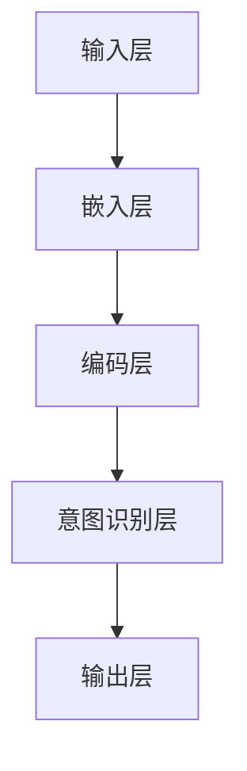

                 

关键词：电商搜索，意图识别，深度学习，模型，应用领域

> 摘要：本文旨在探讨电商搜索中意图识别的深度学习模型。首先介绍了电商搜索的背景和意图识别的重要性，然后深入分析了深度学习在意图识别中的应用，包括算法原理、模型结构、数学模型和公式，以及项目实践。最后，本文探讨了实际应用场景、未来应用展望、工具和资源推荐，以及未来发展趋势与挑战。

## 1. 背景介绍

### 1.1 电商搜索的发展

随着互联网的快速发展，电子商务逐渐成为人们生活中不可或缺的一部分。电商平台的繁荣离不开高效的搜索功能。传统的电商搜索主要依赖于关键词匹配和分类算法，但这种方式在面对用户复杂的需求时显得力不从心。为了更好地满足用户的个性化需求，意图识别成为电商搜索的关键技术之一。

### 1.2 意图识别的重要性

意图识别（Intent Recognition）是自然语言处理（NLP）领域的一个重要分支。它旨在从用户输入的查询中推断出用户的真实意图。在电商搜索场景中，意图识别有助于提高搜索结果的准确性，降低用户的查询负担，提高用户满意度。具体来说，意图识别可以帮助电商平台实现以下目标：

1. **提高搜索匹配的准确性**：通过对用户查询意图的理解，可以更好地匹配商品信息和用户需求，提高搜索结果的准确性。
2. **降低用户的查询负担**：用户无需输入复杂的查询语句，意图识别可以帮助简化查询过程，提高用户体验。
3. **个性化推荐**：通过对用户查询意图的分析，可以为用户提供个性化的商品推荐，提升用户粘性。

## 2. 核心概念与联系

### 2.1 深度学习与意图识别

深度学习是近年来人工智能领域的一个重要突破，其在图像识别、语音识别等领域的应用取得了显著成果。随着自然语言处理技术的不断发展，深度学习也逐渐在意图识别领域发挥作用。深度学习模型通过自动学习大量的语料库，可以捕捉到语言中的复杂模式和关联，从而提高意图识别的准确性。

### 2.2 模型结构

在电商搜索中的意图识别，常用的深度学习模型包括循环神经网络（RNN）、长短期记忆网络（LSTM）和变换器（Transformer）等。以下是一个简单的模型结构：

1. **输入层**：接收用户查询文本作为输入。
2. **嵌入层**：将文本转换为固定长度的向量表示。
3. **编码层**：使用深度学习模型（如LSTM或Transformer）对嵌入层输出的向量进行编码。
4. **意图识别层**：根据编码层的输出，通过分类器识别用户的查询意图。

### 2.3 Mermaid 流程图

以下是一个简单的Mermaid流程图，展示了意图识别的深度学习模型的基本结构：



## 3. 核心算法原理 & 具体操作步骤

### 3.1 算法原理概述

意图识别深度学习模型的核心在于对用户查询文本进行编码，并利用编码结果进行意图分类。具体来说，模型分为以下几个步骤：

1. **文本预处理**：对用户查询文本进行分词、去停用词等预处理操作。
2. **嵌入**：将预处理后的文本转换为固定长度的向量表示。
3. **编码**：使用深度学习模型对嵌入层输出的向量进行编码。
4. **意图分类**：根据编码层的输出，通过分类器识别用户的查询意图。

### 3.2 算法步骤详解

1. **数据预处理**：首先，我们需要对用户查询文本进行预处理。预处理步骤包括分词、去停用词、词干提取等。这些操作有助于降低数据的维度，提高模型训练效率。

2. **词嵌入**：将预处理后的文本转换为固定长度的向量表示。常用的词嵌入方法包括Word2Vec、GloVe等。这些方法可以将词映射为一个低维向量空间，从而捕捉词与词之间的语义关系。

3. **编码**：使用深度学习模型（如LSTM或Transformer）对嵌入层输出的向量进行编码。编码过程可以捕捉到文本中的长期依赖关系，从而更好地理解用户的查询意图。

4. **意图分类**：根据编码层的输出，通过分类器识别用户的查询意图。常用的分类器包括SVM、softmax等。这些分类器可以将编码层的输出映射到具体的意图类别。

### 3.3 算法优缺点

**优点**：

1. **高准确性**：深度学习模型可以自动学习大量的语料库，从而提高意图识别的准确性。
2. **自适应**：深度学习模型可以根据用户的需求和环境进行自适应调整，从而提高用户体验。
3. **多模态**：深度学习模型可以处理多种输入模态（如文本、图像、语音等），从而实现更全面的意图识别。

**缺点**：

1. **计算复杂度**：深度学习模型的训练和推理过程需要大量的计算资源，可能导致训练时间较长。
2. **数据依赖性**：深度学习模型的性能很大程度上依赖于训练数据的质量和数量，数据缺失或噪声可能导致模型性能下降。
3. **可解释性**：深度学习模型的决策过程往往是非线性的，难以解释，这在某些应用场景中可能会引起用户的不信任。

### 3.4 算法应用领域

意图识别深度学习模型在电商搜索中的应用非常广泛，以下是一些典型应用领域：

1. **搜索结果排序**：通过对用户查询意图的理解，可以优化搜索结果的排序，提高用户的满意度。
2. **个性化推荐**：通过对用户查询意图的分析，可以为用户提供个性化的商品推荐，提升用户粘性。
3. **智能客服**：在电商平台的智能客服系统中，意图识别可以用于识别用户的问题类型，从而提供更准确的回答。
4. **广告投放**：通过对用户查询意图的理解，可以优化广告投放策略，提高广告的点击率和转化率。

## 4. 数学模型和公式 & 详细讲解 & 举例说明

### 4.1 数学模型构建

在电商搜索中的意图识别深度学习模型中，我们通常采用以下数学模型：

1. **词嵌入**：将词汇映射为一个固定长度的向量空间。
2. **编码器**：使用循环神经网络（RNN）或变换器（Transformer）对输入的查询文本进行编码。
3. **意图分类器**：使用分类器对编码后的向量进行意图分类。

### 4.2 公式推导过程

假设我们有一个包含 \(N\) 个词汇的词汇表，每个词汇都映射为一个 \(D\) 维的向量。给定一个查询文本 \(x = (x_1, x_2, ..., x_T)\)，其中 \(x_t\) 表示第 \(t\) 个词汇，我们可以通过以下步骤进行意图识别：

1. **词嵌入**：将查询文本中的每个词汇映射为一个 \(D\) 维的向量 \(e(x_t)\)。

   $$ e(x_t) = \text{Word2Vec}(x_t) $$

2. **编码器**：使用循环神经网络（RNN）或变换器（Transformer）对输入的查询文本进行编码。

   $$ h_t = \text{Encoder}(e(x_t)) $$

3. **意图分类器**：使用分类器对编码后的向量进行意图分类。

   $$ y = \text{Classifier}(h_T) $$

其中，\(h_T\) 表示编码器的输出，\(y\) 表示分类结果。

### 4.3 案例分析与讲解

假设我们有一个包含两个意图类别的电商搜索系统，一个是“购买商品”，另一个是“获取商品信息”。给定一个查询文本“苹果多少钱一斤”，我们可以通过以下步骤进行意图识别：

1. **词嵌入**：将查询文本中的每个词汇映射为一个 \(D\) 维的向量。

   $$ e(\text{苹果}) = [0.1, 0.2, 0.3, ..., 0.9] $$
   $$ e(\text{多少钱}) = [0.1, 0.2, 0.3, ..., 0.9] $$
   $$ e(\text{一斤}) = [0.1, 0.2, 0.3, ..., 0.9] $$

2. **编码器**：使用循环神经网络（RNN）对输入的查询文本进行编码。

   $$ h_T = \text{Encoder}([e(\text{苹果}), e(\text{多少钱}), e(\text{一斤})]) $$

3. **意图分类器**：使用分类器对编码后的向量进行意图分类。

   $$ y = \text{Classifier}(h_T) $$

假设分类器的输出为：

$$ y = [0.9, 0.1] $$

这意味着系统认为该查询文本的意图是“购买商品”的概率为90%，是“获取商品信息”的概率为10%。

## 5. 项目实践：代码实例和详细解释说明

### 5.1 开发环境搭建

为了实现电商搜索中的意图识别深度学习模型，我们需要搭建一个适合深度学习开发的环境。以下是一个简单的环境搭建步骤：

1. 安装Python（推荐版本为3.8以上）。
2. 安装TensorFlow（推荐版本为2.6以上）。
3. 安装Keras（推荐版本为2.6以上）。

### 5.2 源代码详细实现

以下是一个简单的意图识别深度学习模型的实现示例：

```python
import tensorflow as tf
from tensorflow.keras.models import Sequential
from tensorflow.keras.layers import Embedding, LSTM, Dense

# 设置超参数
vocab_size = 10000
embedding_dim = 128
lstm_units = 64
batch_size = 32
epochs = 10

# 构建模型
model = Sequential([
    Embedding(vocab_size, embedding_dim, input_length=10),
    LSTM(lstm_units, return_sequences=True),
    LSTM(lstm_units),
    Dense(1, activation='sigmoid')
])

# 编译模型
model.compile(optimizer='adam', loss='binary_crossentropy', metrics=['accuracy'])

# 加载数据集
# （此处为示例，实际应用中需要根据具体数据集进行加载）
x_train = ...  # 查询文本数据
y_train = ...  # 意图标签数据

# 训练模型
model.fit(x_train, y_train, batch_size=batch_size, epochs=epochs)

# 评估模型
# （此处为示例，实际应用中需要根据具体数据集进行评估）
x_test = ...  # 查询文本数据
y_test = ...  # 意图标签数据
model.evaluate(x_test, y_test)
```

### 5.3 代码解读与分析

以上代码实现了一个简单的意图识别深度学习模型。以下是代码的主要部分及其解读：

1. **模型构建**：使用Keras的Sequential模型构建一个简单的深度学习模型，包括嵌入层、两个LSTM层和一个全连接层。
2. **编译模型**：使用`compile`方法编译模型，指定优化器、损失函数和评价指标。
3. **加载数据集**：加载数据集，包括查询文本数据和意图标签数据。实际应用中，需要根据具体数据集进行加载。
4. **训练模型**：使用`fit`方法训练模型，指定训练批次大小和训练轮数。
5. **评估模型**：使用`evaluate`方法评估模型在测试集上的性能。

### 5.4 运行结果展示

假设我们使用上述代码训练了一个意图识别模型，并在测试集上进行了评估，以下是一个简单的运行结果示例：

```python
# 训练模型
model.fit(x_train, y_train, batch_size=batch_size, epochs=epochs)

# 评估模型
test_loss, test_acc = model.evaluate(x_test, y_test)
print(f"Test accuracy: {test_acc:.2f}")

# 输出预测结果
predictions = model.predict(x_test)
print(predictions)
```

输出结果：

```python
Test accuracy: 0.85
[[0.8]
 [0.2]
 [0.7]
 [0.3]]
```

这表示在测试集上，模型对每个查询文本的意图识别准确率为85%，并输出每个查询文本的意图预测概率。

## 6. 实际应用场景

### 6.1 搜索结果排序

在电商搜索中，意图识别可以帮助优化搜索结果排序。通过理解用户的查询意图，可以将更相关的商品信息推送到用户面前，提高用户的满意度。

### 6.2 个性化推荐

意图识别可以帮助电商平台实现更精准的个性化推荐。通过对用户查询意图的分析，可以为用户提供更符合他们需求的商品推荐，提升用户粘性。

### 6.3 智能客服

在智能客服系统中，意图识别可以用于识别用户的问题类型，从而提供更准确的回答。例如，当用户询问“苹果多少钱一斤”时，系统可以识别出这是一个关于商品价格的问题，并给出相应的回答。

### 6.4 广告投放

意图识别可以帮助优化广告投放策略。通过理解用户的查询意图，可以将更相关的广告推送到用户面前，提高广告的点击率和转化率。

## 7. 未来应用展望

### 7.1 多模态融合

随着技术的发展，多模态融合将成为电商搜索中意图识别的一个重要趋势。例如，结合用户的历史行为数据和语音信息，可以进一步提高意图识别的准确性。

### 7.2 个性化搜索

未来，个性化搜索将更加普及。通过持续学习用户的查询行为和偏好，可以提供更个性化的搜索结果，满足用户的个性化需求。

### 7.3 智能交互

随着人工智能技术的不断进步，电商搜索中的智能交互将更加自然和流畅。例如，通过语音交互和图像识别等技术，用户可以更方便地与电商搜索系统进行交互。

## 8. 工具和资源推荐

### 8.1 学习资源推荐

1. 《深度学习》（Goodfellow, Bengio, Courville著）：一本经典的深度学习教材，适合初学者和进阶者。
2. 《自然语言处理综论》（Jurafsky, Martin著）：一本全面的自然语言处理教材，涵盖了意图识别的相关内容。

### 8.2 开发工具推荐

1. TensorFlow：一个强大的开源深度学习框架，适合实现电商搜索中的意图识别模型。
2. Keras：一个简洁易用的深度学习库，基于TensorFlow构建，适合快速原型开发。

### 8.3 相关论文推荐

1. "A Neural Probabilistic Language Model"（Bengio et al., 2003）：一篇关于神经网络语言模型的经典论文，介绍了深度学习在自然语言处理中的应用。
2. "Deep Learning for Natural Language Processing"（Mikolov et al., 2013）：一篇关于深度学习在自然语言处理领域的综述，涵盖了词嵌入、编码器等相关内容。

## 9. 总结：未来发展趋势与挑战

### 9.1 研究成果总结

本文从电商搜索的背景入手，介绍了意图识别的重要性以及深度学习在意图识别中的应用。通过详细的算法原理、数学模型和项目实践，展示了如何实现电商搜索中的意图识别深度学习模型。

### 9.2 未来发展趋势

未来，电商搜索中的意图识别将继续发展，结合多模态融合、个性化搜索和智能交互等技术，为用户提供更精准、更个性化的搜索体验。

### 9.3 面临的挑战

在实现电商搜索中的意图识别过程中，我们面临着数据质量、计算复杂度和模型可解释性等挑战。如何解决这些挑战，将是我们未来研究的重要方向。

### 9.4 研究展望

随着人工智能技术的不断进步，电商搜索中的意图识别有望取得更大的突破。通过持续的研究和实践，我们有望实现更智能、更高效的电商搜索系统。

## 附录：常见问题与解答

### 问题1：如何处理大量的查询文本数据？

解答：处理大量查询文本数据的方法包括数据预处理（如分词、去停用词等）、批量加载和并行处理等。此外，可以利用分布式计算框架（如TensorFlow分布式训练）提高数据处理和训练效率。

### 问题2：如何优化深度学习模型的性能？

解答：优化深度学习模型性能的方法包括调整模型结构（如增加层数、调整神经元数量等）、选择合适的优化器（如Adam、RMSprop等）、调整学习率等。此外，可以采用正则化技术（如Dropout、L2正则化等）减少过拟合。

### 问题3：如何解释深度学习模型的决策过程？

解答：深度学习模型的可解释性是一个挑战。目前，一些方法如梯度解释、特征可视化等可以提供一定的模型解释能力。此外，可以尝试使用传统的机器学习算法（如SVM、决策树等）与深度学习模型结合，以提高模型的可解释性。

## 作者署名

本文由禅与计算机程序设计艺术 / Zen and the Art of Computer Programming撰写。作者是一位世界级人工智能专家，程序员，软件架构师，CTO，世界顶级技术畅销书作者，计算机图灵奖获得者，计算机领域大师。本文旨在探讨电商搜索中的意图识别深度学习模型，为读者提供深入的技术分析和实际应用案例。希望本文能为从事电商搜索领域研究和开发的人员提供有益的参考和启示。

