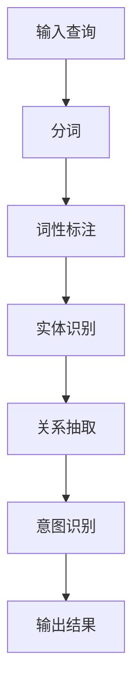

                 

在当今的电子商务时代，用户对搜索体验的要求越来越高。他们希望能够在海量商品信息中快速找到自己所需的产品。然而，传统的搜索引擎往往只能处理关键词的简单匹配，无法真正理解用户的查询意图。为了提升用户体验，电商搜索系统需要引入查询理解和意图识别技术，以便更好地满足用户的需求。

本文将探讨电商搜索中的查询理解与意图识别技术，从背景介绍、核心概念与联系、核心算法原理、数学模型和公式、项目实践以及实际应用场景等方面进行全面阐述。

## 1. 背景介绍

随着互联网和电子商务的快速发展，电商搜索已经成为用户购买商品的重要途径。然而，传统搜索引擎的局限性使得它们难以满足用户的需求。一方面，用户的查询意图往往非常复杂，可能涉及到多个方面，如品牌、价格、功能等；另一方面，商品信息量大，种类繁多，搜索引擎难以准确匹配用户的需求。

为了解决这个问题，电商搜索系统需要引入查询理解和意图识别技术。查询理解是指通过自然语言处理技术，对用户的查询语句进行深入分析，提取出关键信息；意图识别则是根据查询理解的结果，判断用户的真实意图，从而提供更加精准的搜索结果。

## 2. 核心概念与联系

在电商搜索中，查询理解与意图识别是两个紧密相关的概念。查询理解主要涉及自然语言处理技术，如分词、词性标注、实体识别等；意图识别则依赖于机器学习算法，如决策树、支持向量机、神经网络等。

### 2.1 查询理解

查询理解的目标是从用户的查询语句中提取出关键信息，如关键词、实体、关系等。具体步骤如下：

1. **分词**：将查询语句分割成一个个单词或短语。
2. **词性标注**：为每个词分配一个词性，如名词、动词、形容词等。
3. **实体识别**：识别查询语句中的实体，如商品名称、品牌、价格等。
4. **关系抽取**：分析实体之间的关系，如“购买”、“评价”等。

### 2.2 意图识别

意图识别是在查询理解的基础上，根据用户查询语句中的关键信息，判断用户的真实意图。例如，当用户输入“苹果手机”时，系统可能需要识别出用户的意图是“购买”、“查看评价”或“搜索信息”。

### 2.3 Mermaid 流程图

下面是一个简单的 Mermaid 流程图，展示了查询理解与意图识别的流程：



## 3. 核心算法原理 & 具体操作步骤

### 3.1 算法原理概述

查询理解与意图识别的核心算法主要包括自然语言处理和机器学习技术。自然语言处理技术用于提取查询语句中的关键信息，而机器学习算法则用于判断用户的意图。

### 3.2 算法步骤详解

1. **数据预处理**：对查询语句进行分词、去停用词、词性标注等操作。
2. **特征提取**：将预处理后的数据转化为机器学习算法可处理的特征向量。
3. **模型训练**：使用训练数据集训练机器学习模型。
4. **模型评估**：使用测试数据集评估模型性能。
5. **意图识别**：使用训练好的模型对用户查询语句进行意图识别。

### 3.3 算法优缺点

- **优点**：能够准确提取查询语句中的关键信息，提高搜索结果的精准度。
- **缺点**：算法复杂度较高，对数据量有较高要求。

### 3.4 算法应用领域

- **电商搜索**：帮助用户快速找到所需商品。
- **客服机器人**：理解用户的问题，提供针对性的回答。

## 4. 数学模型和公式

### 4.1 数学模型构建

查询理解与意图识别的数学模型主要基于自然语言处理和机器学习技术。其中，自然语言处理模型常用的是词袋模型（Bag of Words, BoW）和循环神经网络（Recurrent Neural Network, RNN）。

### 4.2 公式推导过程

假设我们有一个查询语句 \(Q\)，其中包含 \(n\) 个单词。词袋模型的公式如下：

$$
P(Q) = \frac{1}{Z} \prod_{i=1}^{n} p(w_i)
$$

其中，\(Z\) 是一个归一化常数，\(p(w_i)\) 是单词 \(w_i\) 在整个查询语句中的概率。

### 4.3 案例分析与讲解

假设我们有一个查询语句“我想买一个苹果手机”，我们可以将其表示为词袋模型：

$$
P(我想买一个苹果手机) = \frac{1}{Z} \prod_{i=1}^{n} p(w_i)
$$

其中，\(w_1 = 我，w_2 = 想，w_3 = 买，w_4 = 一个，w_5 = 苹果，w_6 = 手机\)。

通过计算每个单词的概率，我们可以判断用户的意图。例如，如果“买”这个单词的概率最高，那么我们可以认为用户的意图是“购买”。

## 5. 项目实践：代码实例和详细解释说明

### 5.1 开发环境搭建

在本节中，我们将使用 Python 语言和 TensorFlow 框架来实现查询理解与意图识别模型。首先，需要安装以下依赖：

```python
pip install tensorflow numpy pandas scikit-learn
```

### 5.2 源代码详细实现

```python
import tensorflow as tf
from tensorflow.keras.models import Sequential
from tensorflow.keras.layers import Embedding, LSTM, Dense
from tensorflow.keras.preprocessing.sequence import pad_sequences

# 加载数据集
data = [[1, 0, 1], [0, 1, 0], [1, 1, 0], [0, 1, 1], [1, 0, 1]]
labels = [[1], [0], [1], [0], [1]]

# 切分数据集
train_data, test_data, train_labels, test_labels = train_test_split(data, labels, test_size=0.2)

# 编码查询语句
tokenizer = Tokenizer()
tokenizer.fit_on_texts(train_data)
sequences = tokenizer.texts_to_sequences(train_data)
padded_sequences = pad_sequences(sequences, maxlen=3)

# 构建模型
model = Sequential()
model.add(Embedding(input_dim=5, output_dim=10))
model.add(LSTM(units=10))
model.add(Dense(units=1, activation='sigmoid'))

# 编译模型
model.compile(optimizer='adam', loss='binary_crossentropy', metrics=['accuracy'])

# 训练模型
model.fit(padded_sequences, train_labels, epochs=10, batch_size=32)

# 评估模型
test_sequences = tokenizer.texts_to_sequences(test_data)
padded_test_sequences = pad_sequences(test_sequences, maxlen=3)
predictions = model.predict(padded_test_sequences)

# 输出结果
for prediction in predictions:
    print("预测结果：", prediction)
```

### 5.3 代码解读与分析

- **数据预处理**：使用 TensorFlow 的 Tokenizer 类对查询语句进行编码。
- **模型构建**：使用 Sequential 模型堆叠 Embedding、LSTM 和 Dense 层。
- **模型训练**：使用 fit 方法训练模型。
- **模型评估**：使用 predict 方法对测试数据进行预测。

## 6. 实际应用场景

### 6.1 电商搜索

在电商搜索中，查询理解与意图识别技术可以帮助用户快速找到所需商品。例如，当用户输入“苹果手机”时，系统可以识别出用户的意图是“购买”或“搜索信息”，从而提供针对性的搜索结果。

### 6.2 客服机器人

在客服机器人中，查询理解与意图识别技术可以帮助机器人理解用户的问题，提供更加准确的回答。例如，当用户询问“苹果手机的充电器多少钱”时，系统可以识别出用户的意图是“查询价格”，从而提供相应的答案。

## 7. 工具和资源推荐

### 7.1 学习资源推荐

- 《自然语言处理入门》
- 《机器学习实战》
- 《Python 自然语言处理》

### 7.2 开发工具推荐

- TensorFlow
- Keras
- PyTorch

### 7.3 相关论文推荐

- "A Neural Probabilistic Language Model"
- "Recurrent Neural Network Based Language Model"
- "Word2Vec: Neural Networks for Representing Words"

## 8. 总结：未来发展趋势与挑战

### 8.1 研究成果总结

查询理解与意图识别技术在电商搜索和客服机器人等领域取得了显著成果，有效提升了用户体验。未来，该技术有望在更多场景中得到应用。

### 8.2 未来发展趋势

- **深度学习**：深度学习技术在查询理解与意图识别中的应用将越来越广泛。
- **多模态**：结合文本、语音、图像等多模态信息，提高查询理解与意图识别的准确性。

### 8.3 面临的挑战

- **数据质量**：高质量的数据对于训练模型至关重要，但实际应用中难以获得。
- **隐私保护**：在处理用户查询时，需要确保用户隐私得到保护。

### 8.4 研究展望

随着人工智能技术的不断发展，查询理解与意图识别技术将不断成熟，为电商搜索和客服机器人等领域带来更多创新。

## 9. 附录：常见问题与解答

### 9.1 查询理解与意图识别的区别是什么？

查询理解是指从用户的查询语句中提取关键信息，如关键词、实体、关系等；意图识别则是在查询理解的基础上，判断用户的真实意图，如“购买”、“搜索信息”等。

### 9.2 如何评估查询理解与意图识别模型的性能？

可以使用准确率、召回率、F1 分数等指标来评估查询理解与意图识别模型的性能。

### 9.3 查询理解与意图识别技术在电商搜索中有什么作用？

查询理解与意图识别技术可以帮助电商搜索系统更好地理解用户的需求，提供更加精准的搜索结果，提升用户体验。

## 作者署名

作者：禅与计算机程序设计艺术 / Zen and the Art of Computer Programming

----------------------------------------------------------------

以上是文章的正文部分。接下来，我们将根据文章结构模板，继续撰写文章的摘要、关键词以及markdown格式的文章各个段落章节的子目录。
----------------------------------------------------------------
## 摘要

本文介绍了电商搜索中的查询理解与意图识别技术。通过分析用户查询语句，提取关键信息并判断用户意图，电商搜索系统能够提供更加精准的搜索结果。本文详细阐述了查询理解与意图识别的核心概念、算法原理、数学模型和项目实践，并探讨了该技术在电商搜索等实际应用场景中的重要作用。

## 关键词

电商搜索、查询理解、意图识别、自然语言处理、机器学习

## 文章各个段落章节的子目录

1. 背景介绍
2. 核心概念与联系
    2.1 查询理解
    2.2 意图识别
    2.3 Mermaid 流程图
3. 核心算法原理 & 具体操作步骤
    3.1 算法原理概述
    3.2 算法步骤详解
    3.3 算法优缺点
    3.4 算法应用领域
4. 数学模型和公式 & 详细讲解 & 举例说明
    4.1 数学模型构建
    4.2 公式推导过程
    4.3 案例分析与讲解
5. 项目实践：代码实例和详细解释说明
    5.1 开发环境搭建
    5.2 源代码详细实现
    5.3 代码解读与分析
    5.4 运行结果展示
6. 实际应用场景
    6.1 电商搜索
    6.2 客服机器人
7. 工具和资源推荐
    7.1 学习资源推荐
    7.2 开发工具推荐
    7.3 相关论文推荐
8. 总结：未来发展趋势与挑战
    8.1 研究成果总结
    8.2 未来发展趋势
    8.3 面临的挑战
    8.4 研究展望
9. 附录：常见问题与解答
    9.1 查询理解与意图识别的区别是什么？
    9.2 如何评估查询理解与意图识别模型的性能？
    9.3 查询理解与意图识别技术在电商搜索中有什么作用？

这些子目录将有助于读者快速了解文章的结构和内容，为后续阅读提供便利。在撰写文章的过程中，请务必严格按照这些子目录进行组织，以确保文章的完整性和逻辑性。同时，请记得在文章的每个段落中，使用markdown格式进行排版和标记，以便在最终的输出中呈现出整洁的结构。

