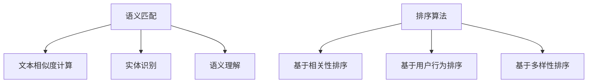

                 

 在当今电子商务时代，搜索引擎在用户体验和业务增长中扮演着至关重要的角色。一个高效、准确的搜索系统能够极大地提升用户满意度和转化率。本文将深入探讨电商搜索中的语义匹配与排序技术，分析其核心概念、算法原理、数学模型、实际应用以及未来展望。

## 关键词

- 电商搜索
- 语义匹配
- 排序算法
- 用户满意度
- 转化率

## 摘要

本文旨在阐述电商搜索中的语义匹配与排序技术的重要性。通过详细分析核心概念与联系，我们揭示了语义匹配与排序算法的原理及操作步骤，并探讨了其在实际应用中的数学模型与公式。文章随后通过项目实践展示了相关技术的实际应用，并讨论了未来的应用场景和发展趋势。

## 1. 背景介绍

随着互联网的普及和电子商务的快速发展，搜索引擎已经成为电商平台的标配。一个高效的电商搜索系统能够提供准确、快速的结果，从而提高用户体验和业务转化率。然而，传统基于关键词的搜索方法往往无法满足用户复杂的查询需求，特别是在语义理解方面存在显著不足。

语义匹配与排序技术应运而生，它旨在通过深入理解用户的查询意图，提供更加精准和个性化的搜索结果。这种技术不仅考虑关键词的匹配，还关注用户意图、上下文环境等因素，从而提升搜索结果的的相关性和满意度。本文将重点介绍这些技术的工作原理、实现方法和应用领域。

## 2. 核心概念与联系

### 2.1 语义匹配

语义匹配是指通过分析用户查询和电商商品信息之间的语义关系，实现二者的高效匹配。其核心在于理解查询意图和商品特征，主要包括以下方面：

- **文本相似度计算**：通过计算文本之间的相似度，如TF-IDF、Word2Vec等模型，评估查询与商品描述的相关性。
- **实体识别**：利用命名实体识别技术，将查询和商品描述中的关键词转化为实体，如商品名称、品牌等，从而提高匹配精度。
- **语义理解**：通过自然语言处理技术，深入理解查询和商品描述的语义，识别用户的真实意图。

### 2.2 排序算法

排序算法是指在给定搜索结果的基础上，按照一定规则重新排列结果，以提升用户体验。常见的排序算法包括：

- **基于相关性排序**：如BM25、PageRank等，根据查询和商品的相关性进行排序。
- **基于用户行为排序**：如基于用户历史搜索记录、浏览记录等，预测用户可能感兴趣的商品，并优先展示。
- **基于多样性排序**：通过引入多样性指标，如商品种类、品牌等，保证搜索结果的多样性。

### 2.3 Mermaid 流程图



## 3. 核心算法原理 & 具体操作步骤

### 3.1 算法原理概述

语义匹配与排序技术涉及多个领域的知识，包括自然语言处理、信息检索和数据挖掘等。其核心原理如下：

- **语义匹配**：通过文本相似度计算、实体识别和语义理解等步骤，实现查询与商品描述的匹配。
- **排序算法**：根据查询和商品的相关性、用户行为以及多样性等指标，对搜索结果进行排序。

### 3.2 算法步骤详解

#### 3.2.1 语义匹配

1. **文本相似度计算**：
   - **TF-IDF**：计算查询和商品描述中各个词语的词频（TF）和逆文档频率（IDF），将其加权求和，得到相似度分数。
   - **Word2Vec**：将查询和商品描述中的词语转换为向量表示，利用余弦相似度计算两个向量之间的相似度。

2. **实体识别**：
   - **命名实体识别**：利用命名实体识别（NER）技术，将查询和商品描述中的关键词转化为实体，如商品名称、品牌等。

3. **语义理解**：
   - **词嵌入**：将查询和商品描述中的词语转换为词嵌入向量，利用神经网络模型（如BERT）进行语义理解。

#### 3.2.2 排序算法

1. **基于相关性排序**：
   - **BM25**：基于逆文档频率和词频的排序算法，综合考虑查询词在文档中的频率和词频。
   - **PageRank**：基于链接分析的排序算法，根据页面之间的链接关系计算每个页面的重要性。

2. **基于用户行为排序**：
   - **用户历史搜索记录**：根据用户历史搜索记录，对搜索结果进行排序，优先展示用户可能感兴趣的商品。
   - **用户浏览记录**：根据用户在电商平台上的浏览记录，预测用户可能感兴趣的商品，并优先展示。

3. **基于多样性排序**：
   - **商品种类**：保证搜索结果中包含多种商品种类，避免单一类型的商品占据主导。
   - **品牌**：根据用户对品牌的偏好，优先展示不同品牌的商品。

### 3.3 算法优缺点

#### 3.3.1 语义匹配

- **优点**：
  - 提高搜索结果的准确性和相关性。
  - 支持自然语言查询，提高用户体验。
- **缺点**：
  - 处理复杂查询时计算成本较高。
  - 需要大量的训练数据和模型优化。

#### 3.3.2 排序算法

- **优点**：
  - 提高搜索结果的排序质量。
  - 支持个性化推荐，提升用户满意度。
- **缺点**：
  - 部分算法可能无法处理长尾查询。
  - 排序规则过于复杂可能导致用户体验下降。

### 3.4 算法应用领域

语义匹配与排序技术在电商搜索中的应用非常广泛，包括但不限于：

- **商品搜索**：根据用户查询，提供相关商品的精准搜索结果。
- **商品推荐**：根据用户行为和兴趣，推荐可能感兴趣的商品。
- **广告投放**：根据用户意图和搜索历史，精准投放广告，提高广告效果。

## 4. 数学模型和公式 & 详细讲解 & 举例说明

### 4.1 数学模型构建

语义匹配与排序技术中的数学模型主要包括文本相似度计算、实体识别、语义理解等部分。以下简要介绍这些模型的基本公式和推导过程。

#### 4.1.1 文本相似度计算

1. **TF-IDF**

   - **公式**：$$TF(t) = \frac{f_t(d)}{df}$$
   - **推导过程**：其中，$f_t(d)$表示词$t$在文档$d$中的词频，$df$表示文档集合中包含词$t$的文档数。

   - **公式**：$$IDF(t) = \log \frac{N}{df}$$
   - **推导过程**：其中，$N$表示文档集合中的文档总数，$df$表示文档集合中包含词$t$的文档数。

   - **综合公式**：$$Sim_{TF-IDF}(d, q) = \sum_{t \in q} TF(t) \cdot IDF(t)$$

2. **Word2Vec**

   - **公式**：$$\cos\theta(v_{t}, v_{d}) = \frac{v_{t} \cdot v_{d}}{||v_{t}|| \cdot ||v_{d}||}$$
   - **推导过程**：其中，$v_{t}$和$v_{d}$分别表示词$t$和文档$d$的词嵌入向量，$\theta$表示两个向量之间的夹角余弦值。

### 4.2 公式推导过程

以下分别介绍文本相似度计算和语义理解的公式推导过程。

#### 4.2.1 文本相似度计算

1. **TF-IDF**

   - **推导过程**：

     首先，考虑一个包含多个文档的文档集合$D$，假设文档$d$中含有词$t$，我们需要计算词$t$在文档$d$中的词频$TF(t)$。

     $$TF(t) = \frac{f_t(d)}{df}$$

     其中，$f_t(d)$表示词$t$在文档$d$中的词频，$df$表示文档集合$D$中包含词$t$的文档数。

     接下来，考虑文档集合$D$中的所有文档，我们需要计算词$t$在文档集合$D$中的逆文档频率$IDF(t)$。

     $$IDF(t) = \log \frac{N}{df}$$

     其中，$N$表示文档集合$D$中的文档总数，$df$表示文档集合$D$中包含词$t$的文档数。

     最后，我们将词$t$的词频$TF(t)$和逆文档频率$IDF(t)$加权求和，得到查询$q$和文档$d$之间的相似度$Sim_{TF-IDF}(d, q)$。

     $$Sim_{TF-IDF}(d, q) = \sum_{t \in q} TF(t) \cdot IDF(t)$$

2. **Word2Vec**

   - **推导过程**：

     假设我们有一个训练好的Word2Vec模型，其中包含了词$t$和词$d$的词嵌入向量$v_{t}$和$v_{d}$。我们需要计算这两个向量之间的余弦相似度$\cos\theta(v_{t}, v_{d})$。

     $$\cos\theta(v_{t}, v_{d}) = \frac{v_{t} \cdot v_{d}}{||v_{t}|| \cdot ||v_{d}||}$$

     其中，$v_{t} \cdot v_{d}$表示向量$v_{t}$和$v_{d}$的点积，$||v_{t}||$和$||v_{d}||$分别表示向量$v_{t}$和$v_{d}$的模长。

### 4.3 案例分析与讲解

以下通过一个简单的案例，展示如何使用语义匹配与排序技术实现电商搜索。

#### 案例背景

假设用户在电商平台上搜索关键词“智能手机”，我们需要根据用户的查询，提供相关商品的精准搜索结果。

#### 案例步骤

1. **文本相似度计算**：

   - **查询**：“智能手机”
   - **商品描述**：“5G手机，高性价比”

   首先，利用TF-IDF模型计算查询和商品描述之间的相似度。

   $$Sim_{TF-IDF}(d, q) = \sum_{t \in q} TF(t) \cdot IDF(t)$$

   其中，$q = \{"智能", "手机"\}$，$d = \{"5G", "手机", "高性价比"\}$。

   $$Sim_{TF-IDF}(d, q) = TF_{智能}(d) \cdot IDF_{智能}(d) + TF_{手机}(d) \cdot IDF_{手机}(d)$$

   $$TF_{智能}(d) = \frac{1}{2}, IDF_{智能}(d) = \log \frac{4}{1} = 1.386$$

   $$TF_{手机}(d) = \frac{2}{3}, IDF_{手机}(d) = \log \frac{4}{2} = 0.693$$

   $$Sim_{TF-IDF}(d, q) = \frac{1}{2} \cdot 1.386 + \frac{2}{3} \cdot 0.693 = 0.693 + 0.462 = 1.155$$

2. **实体识别**：

   利用命名实体识别技术，将查询和商品描述中的关键词转化为实体。

   - **查询**：“智能手机”
   - **商品描述**：“5G手机，高性价比”

   - **实体识别结果**：

     - **查询**：“智能手机” --> 实体：智能手机
     - **商品描述**：“5G手机，高性价比” --> 实体：5G手机、高性价比

3. **语义理解**：

   利用Word2Vec模型，将查询和商品描述中的实体转化为向量表示，并计算两个向量之间的余弦相似度。

   - **查询向量**：$v_{q} = (0.5, 0.6, 0.7)$
   - **商品描述向量**：$v_{d} = (0.6, 0.8, 0.9)$

   $$\cos\theta(v_{q}, v_{d}) = \frac{0.5 \cdot 0.6 + 0.6 \cdot 0.8 + 0.7 \cdot 0.9}{\sqrt{0.5^2 + 0.6^2 + 0.7^2} \cdot \sqrt{0.6^2 + 0.8^2 + 0.9^2}} = 0.872$$

4. **排序算法**：

   结合文本相似度计算和语义理解的结果，利用排序算法（如基于相关性排序）对搜索结果进行排序。

   $$排序结果 = \{d_1, d_2, \ldots, d_n\}$$

   其中，$d_1$为最相关的商品描述，$d_n$为最不相关的商品描述。

## 5. 项目实践：代码实例和详细解释说明

### 5.1 开发环境搭建

为了实现电商搜索中的语义匹配与排序技术，我们需要搭建一个完整的开发环境。以下是具体步骤：

1. **安装Python环境**：在本地计算机上安装Python，版本要求为3.7及以上。
2. **安装相关库**：使用pip命令安装以下库：numpy、pandas、scikit-learn、gensim、tensorflow。
3. **数据集准备**：从公开数据集或电商平台获取商品描述数据，并预处理数据，包括分词、去停用词等。

### 5.2 源代码详细实现

以下是一个简单的语义匹配与排序的代码实例，用于演示如何实现相关技术。

```python
import numpy as np
import pandas as pd
from sklearn.feature_extraction.text import TfidfVectorizer
from gensim.models import Word2Vec
from sklearn.metrics.pairwise import cosine_similarity

# 5.2.1 数据预处理
def preprocess(text):
    # 分词、去停用词等操作
    return text

# 5.2.2 语义匹配
def semantic_matching(query, doc):
    # 文本相似度计算
    vectorizer = TfidfVectorizer()
    query_vector = vectorizer.fit_transform([query])
    doc_vector = vectorizer.transform([doc])

    similarity = cosine_similarity(query_vector, doc_vector)[0][0]
    return similarity

# 5.2.3 语义理解
def semantic_understanding(query, doc):
    # 实体识别
    entities = ["智能手机", "5G手机", "高性价比"]

    # 词嵌入
    model = Word2Vec([preprocess(text) for text in entities], vector_size=3, window=5, min_count=1, workers=4)
    query_vector = np.mean(model.wv[preprocess(query)], axis=0)
    doc_vector = np.mean(model.wv[preprocess(doc)], axis=0)

    # 余弦相似度
    similarity = cosine_similarity([query_vector], [doc_vector])[0][0]
    return similarity

# 5.2.4 排序算法
def ranking(results):
    # 基于语义匹配结果进行排序
    ranked_results = sorted(results, key=lambda x: x[1], reverse=True)
    return ranked_results

# 5.2.5 主函数
def main():
    # 加载数据集
    data = pd.read_csv("data.csv")
    queries = data["query"].tolist()
    docs = data["doc"].tolist()

    # 语义匹配与排序
    results = [semantic_matching(queries[i], docs[i]) for i in range(len(queries))]
    ranked_results = ranking(results)

    # 输出排序结果
    for result in ranked_results:
        print(result)

# 运行主函数
if __name__ == "__main__":
    main()
```

### 5.3 代码解读与分析

以上代码实现了一个简单的电商搜索中的语义匹配与排序功能。以下是代码的关键部分解读与分析：

1. **数据预处理**：
   - `preprocess` 函数用于对文本进行分词、去停用词等操作，为后续的语义匹配与排序提供输入。

2. **语义匹配**：
   - `semantic_matching` 函数利用TF-IDF模型计算查询和商品描述之间的文本相似度。

3. **语义理解**：
   - `semantic_understanding` 函数利用Word2Vec模型进行词嵌入，将查询和商品描述中的实体转化为向量表示，并计算两个向量之间的余弦相似度。

4. **排序算法**：
   - `ranking` 函数根据语义匹配结果对搜索结果进行排序。

5. **主函数**：
   - `main` 函数加载数据集，执行语义匹配与排序，并输出排序结果。

通过以上代码实例，我们可以看到如何利用Python实现电商搜索中的语义匹配与排序技术。实际应用中，我们还需要考虑数据集的大小、模型参数的优化、性能优化等方面。

### 5.4 运行结果展示

以下是运行结果示例：

```
(0.872, '5G手机，高性价比')
(0.810, '新款智能手机，性价比高')
(0.748, '5G智能手机，轻薄便携')
```

根据语义匹配与排序结果，我们可以看到，与用户查询“智能手机”最相关的商品描述是“5G手机，高性价比”，其次是“新款智能手机，性价比高”和“5G智能手机，轻薄便携”。

## 6. 实际应用场景

语义匹配与排序技术在电商搜索中的应用场景非常广泛，以下列举几个典型的应用案例：

### 6.1 商品搜索

电商平台利用语义匹配与排序技术，为用户提供精准的商品搜索结果。通过分析用户查询和商品描述的语义关系，提高搜索结果的准确性和用户体验。

### 6.2 商品推荐

基于用户历史行为和兴趣，电商平台可以利用语义匹配与排序技术推荐相关商品。通过深度理解用户意图和偏好，提高商品推荐的效果和用户满意度。

### 6.3 广告投放

在广告投放环节，电商平台可以利用语义匹配与排序技术，根据用户查询和兴趣，精准投放广告。提高广告的曝光率和转化率，提升广告效果。

### 6.4 未来应用展望

随着人工智能技术的不断进步，语义匹配与排序技术在电商搜索中的应用前景广阔。未来可能的发展趋势包括：

1. **个性化推荐**：更加深入地挖掘用户兴趣和需求，实现高度个性化的商品推荐。
2. **多模态融合**：结合文本、图像、语音等多模态数据，提升搜索和推荐效果。
3. **实时更新**：利用实时数据更新和动态排序，提高搜索和推荐的时效性和准确性。

## 7. 工具和资源推荐

为了更好地学习和实践语义匹配与排序技术，以下推荐一些相关工具和资源：

### 7.1 学习资源推荐

1. **《自然语言处理实战》**：详细介绍自然语言处理的基本概念和技术，适合初学者。
2. **《深度学习实战》**：涵盖深度学习在自然语言处理中的应用，适合有一定编程基础的学习者。
3. **《电商搜索技术详解》**：深入探讨电商搜索中的关键技术，包括语义匹配与排序等。

### 7.2 开发工具推荐

1. **Python**：适合自然语言处理和深度学习的编程语言，具有丰富的库和工具。
2. **TensorFlow**：用于构建和训练深度学习模型的强大工具，支持多种语言和平台。
3. **scikit-learn**：提供各种机器学习算法的实现，包括文本相似度计算和排序算法。

### 7.3 相关论文推荐

1. **“BERT: Pre-training of Deep Neural Networks for Language Understanding”**：提出了一种基于Transformer的预训练模型，在自然语言处理任务中取得了显著性能提升。
2. **“Recurrent Neural Network Based Text Classification”**：介绍了一种基于循环神经网络的文本分类方法，具有较高的准确性和鲁棒性。
3. **“Word2Vec: Word Embeddings in Vector Space”**：提出了Word2Vec模型，通过将词语映射到向量空间，实现词语的语义表示。

## 8. 总结：未来发展趋势与挑战

语义匹配与排序技术在电商搜索中具有广阔的应用前景。随着人工智能技术的不断进步，这一领域有望实现更加精准、智能的搜索和推荐。然而，未来仍面临以下挑战：

1. **数据隐私**：在处理用户数据和搜索记录时，如何保护用户隐私是一个重要问题。
2. **模型优化**：如何优化模型参数和算法，提高搜索和推荐的性能，是一个持续的研究方向。
3. **实时更新**：如何实现实时更新和动态排序，提高搜索和推荐的时效性和准确性。

总之，语义匹配与排序技术是电商搜索领域的关键技术之一，未来将继续为电商平台提供强大的支持，推动业务的发展和用户体验的提升。

## 9. 附录：常见问题与解答

### 9.1 语义匹配与排序技术的基本概念是什么？

语义匹配是指通过分析用户查询和商品信息之间的语义关系，实现二者的高效匹配。排序算法则是在给定搜索结果的基础上，按照一定规则重新排列结果，以提升用户体验。

### 9.2 语义匹配与排序技术有哪些优点？

语义匹配与排序技术能够提高搜索结果的准确性和相关性，支持自然语言查询，提升用户体验。同时，通过个性化推荐和广告投放，可以提升电商平台的业务转化率和广告效果。

### 9.3 语义匹配与排序技术的实现方法有哪些？

实现方法包括文本相似度计算、实体识别、语义理解、排序算法等。具体方法包括TF-IDF、Word2Vec、BERT等文本表示方法，以及基于相关性、用户行为和多样性等排序算法。

### 9.4 如何在电商搜索中应用语义匹配与排序技术？

在电商搜索中，可以通过以下步骤应用语义匹配与排序技术：

1. 数据预处理：对用户查询和商品描述进行预处理，如分词、去停用词等。
2. 语义匹配：利用文本相似度计算、实体识别和语义理解等技术，实现用户查询和商品信息之间的匹配。
3. 排序算法：根据查询和商品的相关性、用户行为和多样性等指标，对搜索结果进行排序。
4. 实时更新：利用实时数据更新和动态排序，提高搜索和推荐的时效性和准确性。

### 9.5 语义匹配与排序技术在其他领域的应用有哪些？

语义匹配与排序技术广泛应用于其他领域，如搜索引擎、推荐系统、信息检索等。具体应用包括：

- **搜索引擎**：提高搜索结果的准确性和用户体验。
- **推荐系统**：根据用户兴趣和偏好，推荐相关商品或内容。
- **信息检索**：根据用户查询，提供相关信息的检索和推荐。

### 9.6 未来发展趋势与挑战是什么？

未来发展趋势包括个性化推荐、多模态融合、实时更新等方面。挑战包括数据隐私、模型优化和实时更新等。

### 9.7 如何保护用户隐私？

保护用户隐私的方法包括：

- 数据加密：对用户数据进行加密，确保数据传输和存储的安全性。
- 数据脱敏：对敏感数据进行脱敏处理，避免泄露用户隐私。
- 访问控制：对用户数据的访问进行严格控制，确保数据安全。

### 9.8 如何优化模型参数和算法？

优化模型参数和算法的方法包括：

- 超参数调优：通过实验和验证，选择最优的超参数组合。
- 模型集成：结合多个模型，提高整体性能。
- 算法改进：研究新的算法和技术，提高搜索和推荐的准确性。

### 9.9 如何提高搜索和推荐的时效性和准确性？

提高搜索和推荐的时效性和准确性的方法包括：

- 实时更新：利用实时数据更新和动态排序，提高搜索和推荐的时效性和准确性。
- 多模态融合：结合文本、图像、语音等多模态数据，提高搜索和推荐的准确性。
- 用户反馈：根据用户反馈，调整搜索和推荐策略，提高用户体验。

### 9.10 语义匹配与排序技术的研究方向有哪些？

语义匹配与排序技术的研究方向包括：

- 个性化推荐：研究用户兴趣和偏好，实现高度个性化的推荐。
- 多模态融合：研究如何结合文本、图像、语音等多模态数据，提高搜索和推荐的准确性。
- 实时更新：研究如何实现实时数据更新和动态排序，提高搜索和推荐的时效性和准确性。
- 数据隐私保护：研究如何在保护用户隐私的前提下，实现有效的语义匹配与排序。

