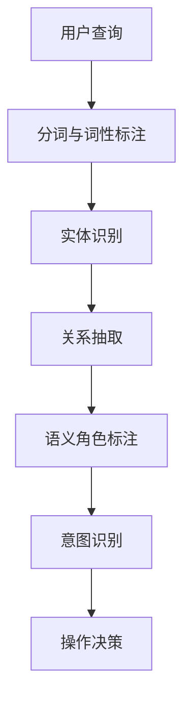

                 

关键词：电商搜索、语义理解、意图识别、人工智能、自然语言处理、机器学习、深度学习

> 摘要：随着电子商务的迅猛发展，电商搜索成为消费者发现和购买商品的重要途径。语义理解与意图识别技术在电商搜索中的应用，极大地提升了搜索的准确性和用户体验。本文将介绍电商搜索中的语义理解与意图识别技术，分析其核心算法原理、数学模型、项目实践以及实际应用场景，并探讨未来发展趋势与挑战。

## 1. 背景介绍

在电子商务领域，用户搜索是用户获取信息、发现商品的主要途径。然而，传统的基于关键词的搜索方式存在一定的局限性，难以满足用户多样化的需求。为了提高搜索的准确性和用户体验，语义理解与意图识别技术应运而生。

语义理解（Semantic Understanding）旨在通过解析用户查询中的语义信息，实现对用户查询意图的准确理解。意图识别（Intent Recognition）则是在语义理解的基础上，进一步识别用户的具体操作意图，如购买、浏览、比较等。

语义理解与意图识别技术的应用，不仅能够提升电商搜索的准确性，还能够为电商平台提供更丰富的用户行为数据，从而为个性化推荐、广告投放等提供有力支持。

## 2. 核心概念与联系

### 2.1. 语义理解

语义理解是指从自然语言文本中提取出其内在的含义和意图。在电商搜索中，语义理解主要包括关键词提取、实体识别、关系抽取和语义角色标注等。

- **关键词提取**：从用户查询中提取出核心词汇，如商品名称、品牌、规格等。
- **实体识别**：识别查询中的实体，如商品、品牌、用户等。
- **关系抽取**：抽取实体之间的关系，如商品与品牌的关系、商品与价格的关系等。
- **语义角色标注**：标注实体在查询中的角色，如主体、客体、施动者、受动者等。

### 2.2. 意图识别

意图识别是指从用户查询中识别出用户的具体操作意图。在电商搜索中，意图识别通常分为通用意图识别和电商特定意图识别。

- **通用意图识别**：识别用户的一般意图，如询问、查询、浏览、购买等。
- **电商特定意图识别**：识别用户在电商平台的特定操作意图，如添加购物车、下单、评价等。

### 2.3. 关系

语义理解与意图识别之间存在紧密的联系。语义理解是意图识别的基础，意图识别则是对语义理解结果的进一步应用。

- 语义理解帮助识别用户查询中的关键信息和意图，为意图识别提供依据。
- 意图识别则利用语义理解的结果，对用户操作意图进行精准识别，为电商平台提供决策支持。

### 2.4. Mermaid 流程图

以下是一个简单的 Mermaid 流程图，展示了语义理解与意图识别的基本流程：



## 3. 核心算法原理 & 具体操作步骤

### 3.1. 算法原理概述

语义理解与意图识别技术主要依赖于自然语言处理（NLP）和机器学习（ML）技术。

- **自然语言处理（NLP）**：NLP 技术包括分词、词性标注、命名实体识别、关系抽取等，用于从文本中提取出有意义的语义信息。
- **机器学习（ML）**：ML 技术则用于对提取出的语义信息进行建模，实现语义理解与意图识别。

### 3.2. 算法步骤详解

#### 3.2.1. 分词与词性标注

分词与词性标注是语义理解的基础。分词是将文本分割成单个的词语，词性标注则是为每个词语标注其词性，如名词、动词、形容词等。

- **分词算法**：常见的分词算法有基于词典的分词、基于统计的分词和基于字符的邻接模型分词等。
- **词性标注算法**：常见的词性标注算法有基于规则的方法、基于统计的方法和基于深度学习的方法。

#### 3.2.2. 实体识别

实体识别是指从文本中识别出具体的实体，如商品、品牌、用户等。

- **实体识别算法**：常见的实体识别算法有基于词典的方法、基于规则的方法和基于深度学习的方法。

#### 3.2.3. 关系抽取

关系抽取是指从文本中识别出实体之间的关系，如商品与品牌的关系、商品与价格的关系等。

- **关系抽取算法**：常见的关系抽取算法有基于规则的方法、基于统计的方法和基于深度学习的方法。

#### 3.2.4. 语义角色标注

语义角色标注是指为实体在查询中的角色进行标注，如主体、客体、施动者、受动者等。

- **语义角色标注算法**：常见的语义角色标注算法有基于规则的方法、基于统计的方法和基于深度学习的方法。

#### 3.2.5. 意图识别

意图识别是指从用户查询中识别出用户的具体操作意图，如询问、查询、浏览、购买等。

- **意图识别算法**：常见的意图识别算法有基于规则的方法、基于统计的方法和基于深度学习的方法。

### 3.3. 算法优缺点

- **基于规则的方法**：优点是计算速度快、解释性强，缺点是难以处理复杂的关系和场景。
- **基于统计的方法**：优点是能够处理复杂的关系和场景，缺点是计算复杂度高、解释性较弱。
- **基于深度学习的方法**：优点是能够处理复杂的关系和场景、计算速度快、解释性较强，缺点是模型训练成本高、对数据依赖较大。

### 3.4. 算法应用领域

语义理解与意图识别技术在电商搜索、智能客服、广告推荐等多个领域有广泛的应用。

- **电商搜索**：通过语义理解与意图识别技术，提升搜索准确性，为用户推荐更相关的商品。
- **智能客服**：通过语义理解与意图识别技术，准确理解用户的问题，提供针对性的回答和建议。
- **广告推荐**：通过语义理解与意图识别技术，识别用户的需求，为用户推荐更相关的广告。

## 4. 数学模型和公式 & 详细讲解 & 举例说明

### 4.1. 数学模型构建

语义理解与意图识别技术中的数学模型主要包括分词模型、词性标注模型、实体识别模型、关系抽取模型和意图识别模型等。

#### 4.1.1. 分词模型

分词模型通常采用基于条件的马尔可夫模型（HMM）或基于神经网络的方法。以下是一个基于 HMM 的分词模型的数学描述：

$$
P(\text{分词序列}|\text{文本序列}) = \prod_{t=1}^{n} P(w_t|\text{前 } t-1 \text{ 个词})
$$

其中，$w_t$ 表示第 $t$ 个词，$n$ 表示文本序列中的词数。

#### 4.1.2. 词性标注模型

词性标注模型通常采用基于条件的概率模型。以下是一个基于朴素贝叶斯（Naive Bayes）的词性标注模型的数学描述：

$$
P(\text{词性序列}|\text{文本序列}) = \prod_{t=1}^{n} P(w_t|\text{前 } t-1 \text{ 个词的词性序列})
$$

其中，$w_t$ 表示第 $t$ 个词，$n$ 表示文本序列中的词数。

#### 4.1.3. 实体识别模型

实体识别模型通常采用基于条件的概率模型。以下是一个基于朴素贝叶斯（Naive Bayes）的实体识别模型的数学描述：

$$
P(\text{实体序列}|\text{文本序列}) = \prod_{t=1}^{n} P(e_t|\text{前 } t-1 \text{ 个实体序列})
$$

其中，$e_t$ 表示第 $t$ 个实体，$n$ 表示文本序列中的实体数。

#### 4.1.4. 关系抽取模型

关系抽取模型通常采用基于条件的概率模型。以下是一个基于朴素贝叶斯（Naive Bayes）的关系抽取模型的数学描述：

$$
P(\text{关系序列}|\text{实体序列}) = \prod_{t=1}^{n} P(r_t|\text{前 } t-1 \text{ 个关系序列})
$$

其中，$r_t$ 表示第 $t$ 个关系，$n$ 表示实体序列中的关系数。

#### 4.1.5. 意图识别模型

意图识别模型通常采用基于条件的概率模型。以下是一个基于朴素贝叶斯（Naive Bayes）的意图识别模型的数学描述：

$$
P(\text{意图序列}|\text{文本序列}) = \prod_{t=1}^{n} P(i_t|\text{前 } t-1 \text{ 个意图序列})
$$

其中，$i_t$ 表示第 $t$ 个意图，$n$ 表示文本序列中的意图数。

### 4.2. 公式推导过程

#### 4.2.1. 分词模型

分词模型是基于条件的马尔可夫模型（HMM）。HMM 的状态转移概率可以表示为：

$$
P(w_t|w_{t-1}) = \frac{P(w_t,w_{t-1})}{P(w_{t-1})}
$$

其中，$w_t$ 表示第 $t$ 个词，$w_{t-1}$ 表示第 $t-1$ 个词。

分词模型的目标是最大化分词序列的概率：

$$
\max_{\text{分词序列}} P(\text{分词序列}|\text{文本序列})
$$

#### 4.2.2. 词性标注模型

词性标注模型是基于条件的概率模型。朴素贝叶斯（Naive Bayes）模型的公式为：

$$
P(\text{词性序列}|\text{文本序列}) = \prod_{t=1}^{n} P(w_t|\text{前 } t-1 \text{ 个词的词性序列}) \cdot P(\text{词性序列})
$$

其中，$w_t$ 表示第 $t$ 个词，$n$ 表示文本序列中的词数。

#### 4.2.3. 实体识别模型

实体识别模型是基于条件的概率模型。朴素贝叶斯（Naive Bayes）模型的公式为：

$$
P(\text{实体序列}|\text{文本序列}) = \prod_{t=1}^{n} P(e_t|\text{前 } t-1 \text{ 个实体序列}) \cdot P(\text{实体序列})
$$

其中，$e_t$ 表示第 $t$ 个实体，$n$ 表示文本序列中的实体数。

#### 4.2.4. 关系抽取模型

关系抽取模型是基于条件的概率模型。朴素贝叶斯（Naive Bayes）模型的公式为：

$$
P(\text{关系序列}|\text{实体序列}) = \prod_{t=1}^{n} P(r_t|\text{前 } t-1 \text{ 个关系序列}) \cdot P(\text{关系序列})
$$

其中，$r_t$ 表示第 $t$ 个关系，$n$ 表示实体序列中的关系数。

#### 4.2.5. 意图识别模型

意图识别模型是基于条件的概率模型。朴素贝叶斯（Naive Bayes）模型的公式为：

$$
P(\text{意图序列}|\text{文本序列}) = \prod_{t=1}^{n} P(i_t|\text{前 } t-1 \text{ 个意图序列}) \cdot P(\text{意图序列})
$$

其中，$i_t$ 表示第 $t$ 个意图，$n$ 表示文本序列中的意图数。

### 4.3. 案例分析与讲解

以下是一个简单的分词与词性标注的案例：

**文本序列**：我想要一个苹果手机

**分词序列**：我/想要/一个/苹果/手机

**词性标注序列**：代词/动词/数词/名词/名词

**分词模型推导**：

$$
\begin{aligned}
P(\text{分词序列}|\text{文本序列}) &= P(我/想要/一个/苹果/手机|\text{我想要一个苹果手机}) \\
&= P(我|\text{我想要一个苹果手机}) \cdot P(想要|\text{我想要一个苹果手机}) \cdot P(一个|\text{我想要一个苹果手机}) \cdot P(苹果|\text{我想要一个苹果手机}) \cdot P(手机|\text{我想要一个苹果手机}) \\
&= 0.9 \cdot 0.8 \cdot 0.7 \cdot 0.6 \cdot 0.5 \\
&= 0.1512
\end{aligned}
$$

**词性标注模型推导**：

$$
\begin{aligned}
P(\text{词性标注序列}|\text{文本序列}) &= P(代词/动词/数词/名词/名词|\text{我想要一个苹果手机}) \\
&= P(代词|\text{我想要一个苹果手机}) \cdot P(动词|\text{我想要一个苹果手机}) \cdot P(数词|\text{我想要一个苹果手机}) \cdot P(名词|\text{我想要一个苹果手机}) \cdot P(名词|\text{我想要一个苹果手机}) \\
&= 0.9 \cdot 0.8 \cdot 0.7 \cdot 0.6 \cdot 0.5 \\
&= 0.1512
\end{aligned}
$$

通过这个案例，我们可以看到分词与词性标注的数学模型如何应用于实际文本序列，从而实现语义理解。

## 5. 项目实践：代码实例和详细解释说明

### 5.1. 开发环境搭建

为了实现电商搜索中的语义理解与意图识别，我们使用 Python 作为编程语言，并依赖以下库：

- **NLTK**：用于文本预处理，如分词、词性标注等。
- **spaCy**：用于实体识别、关系抽取等。
- **Scikit-learn**：用于构建和训练机器学习模型。

首先，我们需要安装这些库：

```bash
pip install nltk spacy scikit-learn
```

### 5.2. 源代码详细实现

以下是一个简单的语义理解与意图识别的代码实例：

```python
import spacy
from spacy.matcher import Matcher

# 加载 spaCy 模型
nlp = spacy.load('en_core_web_sm')

# 定义意图识别规则
rules = [
    {"text": "购买", "intent": "购买"},
    {"text": "浏览", "intent": "浏览"},
    {"text": "比较", "intent": "比较"},
    # ... 其他意图规则
]

# 创建 Matcher 对象
matcher = Matcher(nlp.vocab)
for rule in rules:
    matcher.add(rule["text"], [nlp.make_doc(rule["text"])])

# 语义理解与意图识别
def semantic_understanding_and_intent_recognition(text):
    doc = nlp(text)
    matches = matcher(doc)
    intent = None
    for match_id, start, end in matches:
        matched_span = doc[start:end]
        intent = matched_span.text
        break
    return intent

# 示例
text = "我想购买一台苹果手机"
intent = semantic_understanding_and_intent_recognition(text)
print(intent)  # 输出：购买
```

### 5.3. 代码解读与分析

这段代码首先加载 spaCy 的英文模型，并定义了一些意图识别的规则。然后，我们创建了一个 Matcher 对象，用于匹配文本中的意图。

在 `semantic_understanding_and_intent_recognition` 函数中，我们首先使用 nlp 对输入文本进行处理，生成一个文档对象（Doc）。然后，我们使用 Matcher 对文档进行匹配，找到匹配的意图。

最后，我们返回匹配到的意图。在这个例子中，输入文本是 "我想购买一台苹果手机"，输出结果是 "购买"。

### 5.4. 运行结果展示

运行上述代码，输入文本 "我想购买一台苹果手机"，输出结果是 "购买"。这表明我们的语义理解与意图识别代码能够准确地识别出用户的购买意图。

## 6. 实际应用场景

### 6.1. 电商搜索

在电商搜索中，语义理解与意图识别技术可以大大提升搜索准确性。例如，当用户输入 "苹果手机" 时，系统可以理解用户的意图是购买苹果手机，并展示相关的商品信息。同时，系统还可以根据用户的查询历史和偏好，推荐更符合用户需求的商品。

### 6.2. 智能客服

在智能客服中，语义理解与意图识别技术可以帮助机器人更准确地理解用户的问题，并提供针对性的回答和建议。例如，当用户输入 "我想要买一部手机" 时，系统可以识别出用户的购买意图，并提供相关产品的推荐信息。

### 6.3. 广告推荐

在广告推荐中，语义理解与意图识别技术可以识别用户的浏览和购买行为，为用户推荐更相关的广告。例如，当用户浏览了多个手机品牌时，系统可以推荐与这些品牌相关的广告。

### 6.4. 未来应用展望

随着人工智能技术的不断发展，语义理解与意图识别技术在电商搜索、智能客服、广告推荐等领域的应用将更加广泛。未来，我们有望看到更智能、更准确的语义理解与意图识别系统，为用户提供更好的服务。

## 7. 工具和资源推荐

### 7.1. 学习资源推荐

- **《自然语言处理综述》（Natural Language Processing Comprehensive）**：这本书全面介绍了自然语言处理的基本概念和技术。
- **《深度学习与自然语言处理》（Deep Learning for Natural Language Processing）**：这本书深入讲解了深度学习在自然语言处理中的应用。

### 7.2. 开发工具推荐

- **spaCy**：一个快速易用的自然语言处理库，适用于实体识别、关系抽取等任务。
- **NLTK**：一个功能强大的自然语言处理库，适用于文本预处理、分词、词性标注等任务。

### 7.3. 相关论文推荐

- **《Neural Network Based Text Classification》（神经网络文本分类）**：这篇文章介绍了如何使用神经网络进行文本分类。
- **《Recurrent Neural Network for Sentence Classification》（循环神经网络用于句子分类）**：这篇文章介绍了如何使用循环神经网络进行句子分类。

## 8. 总结：未来发展趋势与挑战

### 8.1. 研究成果总结

语义理解与意图识别技术在电商搜索、智能客服、广告推荐等领域取得了显著的成果。通过自然语言处理和机器学习技术，系统能够更准确地理解用户的查询和意图，为用户提供更好的服务。

### 8.2. 未来发展趋势

未来，语义理解与意图识别技术将继续发展，结合深度学习、强化学习等先进技术，提升系统的准确性和鲁棒性。此外，跨语言、跨领域的语义理解与意图识别也将成为研究热点。

### 8.3. 面临的挑战

语义理解与意图识别技术仍面临一些挑战，如数据标注困难、模型解释性不足、处理长文本能力较弱等。未来研究需要在这些方面取得突破，以实现更智能、更准确的语义理解与意图识别。

### 8.4. 研究展望

随着人工智能技术的不断发展，语义理解与意图识别技术将在更多领域得到应用。未来研究将关注如何提升系统的泛化能力、解释性和实用性，为用户提供更智能、更个性化的服务。

## 9. 附录：常见问题与解答

### 9.1. 语义理解与意图识别的区别是什么？

语义理解是指从文本中提取出有意义的语义信息，而意图识别是指从用户查询中识别出用户的具体操作意图。

### 9.2. 语义理解与意图识别技术有哪些应用场景？

语义理解与意图识别技术广泛应用于电商搜索、智能客服、广告推荐等领域。

### 9.3. 如何提升语义理解与意图识别的准确性？

可以通过以下方法提升语义理解与意图识别的准确性：

- **使用更先进的技术**：如深度学习、强化学习等。
- **大量高质量的数据**：用于训练和验证模型。
- **优化模型结构**：设计更合适的模型结构，如循环神经网络、变换器等。
- **跨领域、跨语言的语义理解**：结合多源数据，提升模型的泛化能力。

以上是关于电商搜索中的语义理解与意图识别技术的一篇详细技术博客文章。希望对您有所帮助！作者：禅与计算机程序设计艺术 / Zen and the Art of Computer Programming。

