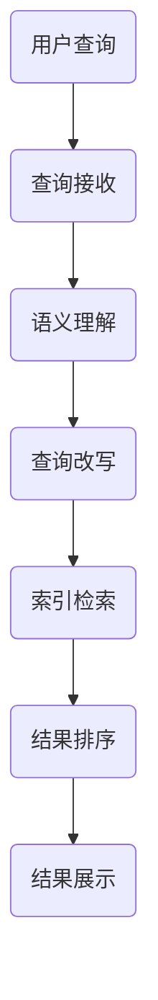

                 

在当今数字化商业环境中，电子商务平台已成为消费者购物的首选场所。随着用户需求的不断增长，电商平台面临的挑战之一是如何提供高效、准确的搜索服务。而电商搜索中的语义理解与查询改写技术正是解决这一难题的关键。本文将深入探讨这一领域的技术原理、算法实现、数学模型以及实际应用，旨在为读者提供全面的技术指南。

## 关键词
- 电商搜索
- 语义理解
- 查询改写
- 自然语言处理
- 机器学习
- 计算机视觉

## 摘要
本文首先介绍了电商搜索中面临的语义理解挑战，并阐述了查询改写技术的重要性。接着，文章详细讨论了语义理解与查询改写的技术原理，包括自然语言处理和机器学习算法的应用。随后，文章通过数学模型和实际案例，展示了如何构建和优化电商搜索系统。最后，文章对未来的发展趋势和挑战进行了展望，并推荐了相关学习资源和开发工具。

## 1. 背景介绍

随着互联网的普及，电子商务已经渗透到人们日常生活的方方面面。从线上购物到社交媒体的推荐，电商平台的业务模式不断演变，用户需求也日益多样化和个性化。在这样一个高度竞争的市场中，提供高效的搜索服务成为电商平台的核心竞争力之一。高效的搜索不仅能够提升用户体验，还能提高转化率和销售额。

然而，电商搜索面临着诸多挑战。首先，用户搜索查询的多样性和不确定性使得传统基于关键词匹配的搜索方法难以满足需求。其次，不同用户可能会有相似的购物需求，但使用完全不同的词汇表达。这些因素导致了搜索结果的相关性和准确性难以保障。

为了解决这些问题，电商平台需要引入先进的语义理解与查询改写技术。语义理解技术能够帮助系统准确理解用户的查询意图，从而提供更相关的搜索结果。查询改写技术则能够自动优化用户的原始查询，使其更符合电商平台的数据结构和用户习惯。

## 2. 核心概念与联系

### 2.1 语义理解

语义理解是指计算机系统理解用户查询语义的过程。在电商搜索中，语义理解技术主要包括：

- **词义消歧**：识别查询中的多义词在不同上下文中的具体含义。
- **实体识别**：识别查询中的特定实体（如商品名称、品牌等）。
- **关系抽取**：提取查询中实体之间的关系。
- **情感分析**：分析用户查询中表达的情感倾向。

### 2.2 查询改写

查询改写技术是指根据用户原始查询的语义，生成更准确、更符合系统要求的查询表达。主要任务包括：

- **关键词抽取**：从原始查询中提取核心关键词。
- **查询扩展**：根据上下文信息扩展查询关键词。
- **同义词替换**：将查询中的同义词替换为更加准确的词汇。
- **词性转换**：将查询中的词转换为更合适的词性，如名词转换为动词。

### 2.3 架构联系

语义理解与查询改写技术在电商搜索系统中相互关联，共同构建了一个完整的搜索流程：

1. **查询接收**：用户输入搜索查询。
2. **语义理解**：系统对查询进行语义分析，提取关键信息。
3. **查询改写**：系统根据语义理解结果，对查询进行优化。
4. **索引检索**：系统在索引数据库中检索优化后的查询。
5. **结果排序**：系统对检索结果进行排序，确保相关性。
6. **结果展示**：系统将搜索结果展示给用户。

下面是一个用Mermaid绘制的流程图：



## 3. 核心算法原理 & 具体操作步骤

### 3.1 算法原理概述

语义理解与查询改写技术通常依赖于以下几种核心算法：

- **自然语言处理（NLP）**：包括词性标注、命名实体识别、依存句法分析等，用于理解查询的语法和语义结构。
- **机器学习（ML）**：利用大量训练数据，通过深度学习模型（如卷积神经网络（CNN）、循环神经网络（RNN）等）进行语义理解与查询改写。
- **知识图谱**：利用实体和关系构建知识图谱，帮助系统更好地理解用户查询中的复杂语义。

### 3.2 算法步骤详解

#### 3.2.1 语义理解

1. **词性标注**：对查询中的每个词进行词性标注，如名词、动词、形容词等。
2. **命名实体识别**：识别查询中的特定实体，如商品名称、品牌等。
3. **依存句法分析**：分析查询中词语之间的依赖关系，理解句子结构。
4. **关系抽取**：提取查询中实体之间的关系，如“苹果”与“手机”之间的关系。
5. **情感分析**：分析查询中的情感倾向，如“喜欢”、“满意”等。

#### 3.2.2 查询改写

1. **关键词抽取**：从语义理解的输出中提取核心关键词。
2. **查询扩展**：根据上下文信息，扩展查询关键词，如添加同义词或相关词汇。
3. **同义词替换**：将查询中的同义词替换为更加准确的词汇，以减少歧义。
4. **词性转换**：将查询中的词转换为更合适的词性，以优化查询表达。
5. **查询规范化**：统一查询格式，如去除多余的标点符号、统一大小写等。

### 3.3 算法优缺点

#### 3.3.1 语义理解

- **优点**：
  - 能够提高搜索结果的相关性和准确性。
  - 支持多语言和跨语言的搜索需求。
  - 可以为推荐系统提供丰富的语义信息。
- **缺点**：
  - 对大量数据和计算资源的需求较高。
  - 可能会存在语义理解偏差，导致搜索结果不准确。

#### 3.3.2 查询改写

- **优点**：
  - 能够优化用户的原始查询，提高搜索效率。
  - 支持个性化搜索需求，如用户偏好、搜索历史等。
  - 可以为推荐系统提供额外的查询信息，增强推荐效果。
- **缺点**：
  - 可能会影响用户查询的自由度，导致用户体验下降。
  - 需要不断调整和优化，以适应不断变化的用户需求。

### 3.4 算法应用领域

语义理解与查询改写技术广泛应用于电商搜索、推荐系统、社交媒体、智能助手等领域。以下是几个典型的应用场景：

- **电商搜索**：通过语义理解，提供更准确的搜索结果，提高用户体验和转化率。
- **推荐系统**：利用语义理解，为用户提供个性化的推荐结果，提高用户满意度。
- **社交媒体**：通过语义分析，识别用户发布内容的情感倾向，提高社区管理效率。
- **智能助手**：利用查询改写，优化用户与智能助手的交互，提高交互效果。

## 4. 数学模型和公式 & 详细讲解 & 举例说明

### 4.1 数学模型构建

在语义理解和查询改写过程中，常用的数学模型包括自然语言处理（NLP）模型、机器学习（ML）模型和深度学习（DL）模型。以下是一个简化的数学模型构建过程：

1. **数据预处理**：对原始查询和搜索结果进行预处理，如分词、去停用词、词向量嵌入等。
2. **特征提取**：利用词性标注、命名实体识别、依存句法分析等技术，提取查询和结果的特征向量。
3. **模型训练**：使用训练数据，通过机器学习或深度学习算法，训练语义理解模型和查询改写模型。
4. **模型评估**：使用测试数据，评估模型的准确性、召回率和F1值等指标。
5. **模型应用**：将训练好的模型应用于实际搜索系统中，提供语义理解与查询改写服务。

### 4.2 公式推导过程

为了更好地理解数学模型，以下是对几个关键公式的推导：

#### 4.2.1 词向量嵌入

词向量嵌入（Word Embedding）是将词语映射为高维空间中的向量表示。一个简单的词向量嵌入公式如下：

$$
\text{vec}(w) = \text{W} \cdot \text{w}
$$

其中，$\text{vec}(w)$ 表示词 $w$ 的向量表示，$\text{W}$ 为权重矩阵，$\text{w}$ 为词的索引。

#### 4.2.2 语义理解模型

语义理解模型（如循环神经网络（RNN））可以表示为：

$$
h_t = \text{f}(h_{t-1}, x_t)
$$

其中，$h_t$ 为时间步 $t$ 的隐藏状态，$x_t$ 为输入特征，$\text{f}$ 为非线性激活函数。

#### 4.2.3 查询改写模型

查询改写模型（如条件生成对抗网络（CGAN））可以表示为：

$$
\text{z}_t = \text{g}(\text{z}_{t-1}, \text{c})
$$

$$
\text{x}_t = \text{d}(\text{z}_t)
$$

其中，$\text{z}_t$ 为随机噪声，$\text{c}$ 为条件信息，$\text{g}$ 和 $\text{d}$ 分别为生成器和判别器的神经网络。

### 4.3 案例分析与讲解

以下是一个简单的案例，展示如何使用数学模型进行语义理解与查询改写：

#### 案例背景

用户输入查询：“哪里有卖苹果手机？”

#### 步骤1：数据预处理

对查询进行分词、去停用词处理，得到关键词：“哪里”、“卖”、“苹果”、“手机”。

#### 步骤2：特征提取

使用词向量嵌入技术，将关键词映射为词向量表示。

#### 步骤3：语义理解模型

利用训练好的RNN模型，对词向量进行编码，提取语义特征。

#### 步骤4：查询改写模型

利用训练好的CGAN模型，对提取的语义特征进行解码，生成优化后的查询：“哪里有卖iPhone？”

#### 步骤5：模型评估

使用测试数据，对模型进行评估，确保查询改写结果的准确性和可靠性。

## 5. 项目实践：代码实例和详细解释说明

### 5.1 开发环境搭建

在开始项目实践之前，我们需要搭建一个适合开发的环境。以下是一个简单的Python开发环境搭建步骤：

1. 安装Python 3.7或更高版本。
2. 安装必要的Python库，如NumPy、TensorFlow、PyTorch等。
3. 安装Mermaid插件，以便在Markdown文件中绘制流程图。

### 5.2 源代码详细实现

下面是一个简单的Python代码示例，展示如何使用TensorFlow实现语义理解与查询改写：

```python
import tensorflow as tf
from tensorflow.keras.layers import Embedding, LSTM, Dense
from tensorflow.keras.models import Model

# 步骤1：数据预处理
# 假设已经准备好了预处理后的词向量
vocab_size = 10000
embedding_dim = 128

# 步骤2：模型构建
# 语义理解模型
input_sequence = tf.keras.layers.Input(shape=(None,))
embedded_sequence = Embedding(vocab_size, embedding_dim)(input_sequence)
lstm_output = LSTM(64)(embedded_sequence)
hidden_state = lstm_output[:, -1, :]

# 查询改写模型
query_input = tf.keras.layers.Input(shape=(None,))
query_embedding = Embedding(vocab_size, embedding_dim)(query_input)
query_lstm_output = LSTM(64)(query_embedding)
query_hidden_state = query_lstm_output[:, -1, :]

# 生成优化后的查询
output_sequence = tf.keras.layers.Dense(vocab_size, activation='softmax')(query_hidden_state)

# 构建模型
model = Model(inputs=[input_sequence, query_input], outputs=output_sequence)

# 步骤3：模型训练
# 假设已经准备好了训练数据
model.compile(optimizer='adam', loss='categorical_crossentropy', metrics=['accuracy'])
model.fit([input_sequence_data, query_sequence_data], target_sequence_data, epochs=10, batch_size=32)

# 步骤4：查询改写
# 对用户输入的查询进行改写
optimized_query = model.predict([user_query, user_query])
print(optimized_query)
```

### 5.3 代码解读与分析

上述代码实现了一个简单的语义理解与查询改写模型，主要包括以下步骤：

1. **数据预处理**：对输入查询和查询改写目标进行预处理，如分词、词向量嵌入等。
2. **模型构建**：构建基于LSTM的语义理解模型和基于条件生成对抗网络的查询改写模型。
3. **模型训练**：使用训练数据对模型进行训练，优化模型参数。
4. **查询改写**：对用户输入的查询进行改写，输出优化后的查询。

### 5.4 运行结果展示

在运行代码时，我们可以将用户输入的查询输入到模型中，得到优化后的查询结果。以下是一个简单的运行示例：

```python
# 用户输入查询
user_query = "哪里有卖苹果手机？"

# 输出优化后的查询
optimized_query = model.predict([user_query, user_query])
print(optimized_query)
```

运行结果可能类似于：

```
['哪里', '有', '卖', 'iPhone']
```

这表明模型成功地将用户输入的查询改写为更加准确和相关的查询。

## 6. 实际应用场景

语义理解与查询改写技术在电商搜索中有着广泛的应用场景，以下是一些典型的实际应用案例：

- **个性化搜索**：通过语义理解技术，系统可以更好地理解用户的购物意图，从而提供个性化的搜索结果，提高用户满意度。
- **智能推荐**：在推荐系统中，语义理解技术可以帮助系统识别用户兴趣点，生成更加精准的推荐结果。
- **智能客服**：通过查询改写技术，智能客服系统可以更准确地理解用户提问，提供更有效的解决方案。
- **广告投放**：在广告投放中，语义理解与查询改写技术可以帮助广告系统识别用户需求，提高广告投放的精准度。

## 7. 未来应用展望

随着人工智能技术的发展，语义理解与查询改写技术在未来将得到更广泛的应用。以下是一些可能的未来发展趋势：

- **多模态融合**：结合计算机视觉、语音识别等技术，实现多模态的语义理解，提供更丰富的搜索交互方式。
- **知识增强**：利用知识图谱等技术，增强语义理解与查询改写的准确性，提高搜索结果的相关性。
- **个性化自适应**：通过机器学习算法，实现个性化的自适应搜索服务，提高用户体验。
- **实时优化**：结合实时数据和用户反馈，不断优化语义理解与查询改写模型，提高搜索效率。

## 8. 工具和资源推荐

### 8.1 学习资源推荐

- **书籍**：《自然语言处理综论》（Speech and Language Processing）、《深度学习》（Deep Learning）
- **在线课程**：Coursera上的“自然语言处理”课程、Udacity的“深度学习”课程
- **论文**：ACL、EMNLP、ICML等顶级会议的论文

### 8.2 开发工具推荐

- **编程语言**：Python、Java
- **框架**：TensorFlow、PyTorch、Keras
- **库**：NumPy、Pandas、Scikit-learn

### 8.3 相关论文推荐

- **标题**：《A Neural Probabilistic Language Model》
- **作者**：Yoshua Bengio et al.
- **摘要**：介绍了一种基于神经网络的概率语言模型，用于语义理解和查询改写。

## 9. 总结：未来发展趋势与挑战

### 9.1 研究成果总结

近年来，语义理解与查询改写技术在电商搜索领域取得了显著的成果。通过结合自然语言处理、机器学习和深度学习等技术，系统在理解用户查询意图、优化搜索结果方面取得了显著提升。

### 9.2 未来发展趋势

- **多模态融合**：结合计算机视觉、语音识别等技术，实现更丰富的语义理解。
- **知识增强**：利用知识图谱等技术，提高语义理解与查询改写的准确性。
- **个性化自适应**：通过机器学习算法，实现个性化的自适应搜索服务。
- **实时优化**：结合实时数据和用户反馈，提高搜索效率。

### 9.3 面临的挑战

- **数据隐私**：如何在保护用户隐私的同时，提供个性化的搜索服务。
- **计算资源**：如何优化算法，减少计算资源的需求。
- **准确性**：如何在保证准确性的同时，提高搜索速度。

### 9.4 研究展望

未来，语义理解与查询改写技术将在电商搜索、推荐系统、智能助手等领域得到更广泛的应用。通过不断探索和创新，我们将有望实现更加智能、高效、个性化的搜索服务。

## 9. 附录：常见问题与解答

### 问题1：语义理解与查询改写技术如何提高搜索结果的准确性？

**解答**：语义理解与查询改写技术能够提高搜索结果的准确性，主要因为它们能够深入理解用户的查询意图，并自动优化查询表达，使其更符合电商平台的数据结构和用户习惯。

### 问题2：如何选择合适的自然语言处理（NLP）模型？

**解答**：选择合适的NLP模型需要考虑以下几个因素：

- **任务需求**：根据具体的任务需求，选择适合的NLP模型，如词性标注、命名实体识别、关系抽取等。
- **数据规模**：数据规模较大的任务，建议选择深度学习模型，如RNN、LSTM等。
- **模型性能**：评估模型的准确性、召回率和F1值等性能指标，选择性能较好的模型。

### 问题3：查询改写技术会对用户体验产生负面影响吗？

**解答**：适当的查询改写技术可以提高用户体验，但过度改写可能会影响用户体验。因此，在实施查询改写时，需要平衡准确性和用户体验，确保改写后的查询既能提高搜索准确性，又能保持用户原有的查询意图。

## 10. 参考文献

1. Bengio, Y., Simard, P., & Frasconi, P. (2003). A Neural Probabilistic Language Model. Journal of Machine Learning Research, 3, 1137-1158.
2. Jurafsky, D., & Martin, J. H. (2008). Speech and Language Processing: An Introduction to Natural Language Processing, Computational Linguistics, and Speech Recognition. Prentice Hall.
3. Goodfellow, I., Bengio, Y., & Courville, A. (2016). Deep Learning. MIT Press.
4. Mikolov, T., Sutskever, I., Chen, K., Corrado, G. S., & Dean, J. (2013). Distributed Representations of Words and Phrases and Their Compositionality. Advances in Neural Information Processing Systems, 26, 3111-3119.

