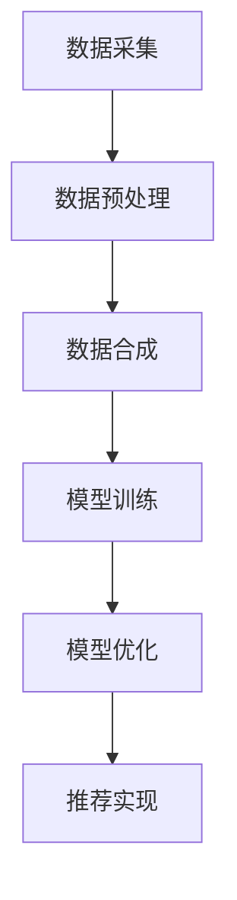
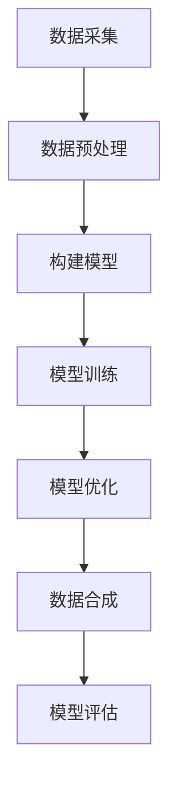

                 

关键词：电商搜索推荐，AI大模型，数据合成技术，项目可行性分析

## 摘要

本文旨在探讨电商搜索推荐系统中AI大模型数据合成技术的应用及其项目可行性。随着电商行业的迅猛发展，如何提升搜索推荐的精准度和用户体验成为关键问题。AI大模型数据合成技术通过生成与真实数据相似的高质量模拟数据，为推荐系统的训练和优化提供支持。本文将分析该技术的核心原理、算法实现、数学模型、项目实践及实际应用场景，并结合未来发展趋势和挑战，提出相关建议和解决方案。

## 1. 背景介绍

### 1.1 电商搜索推荐现状

电商搜索推荐是电子商务中至关重要的一环。用户在电商平台上通过搜索关键词查找商品，而推荐系统则基于用户的历史行为和偏好，为用户推荐可能感兴趣的商品。传统的推荐系统多采用基于内容的推荐和协同过滤等方法，但随着用户数据和商品信息的日益庞大，这些方法逐渐暴露出召回率低、覆盖率差和冷启动问题等局限。

### 1.2 AI大模型的发展

近年来，人工智能（AI）技术的迅猛发展，尤其是深度学习等AI大模型的突破，为推荐系统带来了新的可能性。AI大模型具有处理大规模数据、自适应性强和泛化能力高等优势，可以有效提高推荐系统的准确性和用户体验。然而，AI大模型的训练和优化需要大量真实数据，而真实数据的获取和预处理往往面临诸多挑战。

### 1.3 数据合成技术的应用

数据合成技术旨在通过生成与真实数据相似的高质量模拟数据，解决数据获取和处理的难题。在电商搜索推荐中，数据合成技术可以用于生成用户行为数据、商品属性数据等，为AI大模型的训练提供丰富的训练样本。此外，数据合成技术还可以用于测试和评估推荐系统的性能，降低开发成本和时间。

## 2. 核心概念与联系

为了更好地理解AI大模型数据合成技术在电商搜索推荐中的应用，我们需要首先了解几个核心概念：

### 2.1 AI大模型

AI大模型是指具有大规模参数和强大计算能力的深度学习模型，如Transformer、BERT等。这些模型通常通过大量的真实数据训练，能够自动学习数据中的特征和规律，从而实现高精度的预测和分类。

### 2.2 数据合成技术

数据合成技术是一种通过生成与真实数据相似的数据的方法，常用于数据增强、数据预处理和隐私保护等领域。常见的数据合成方法包括生成对抗网络（GAN）、变分自编码器（VAE）等。

### 2.3 电商搜索推荐系统

电商搜索推荐系统是一种基于用户历史行为和商品属性的推荐系统，旨在为用户提供个性化的商品推荐。其主要功能包括用户行为分析、商品特征提取、推荐算法实现等。

### 2.4 核心概念联系

AI大模型数据合成技术在电商搜索推荐中的应用，可以通过以下流程实现：

1. **数据采集**：收集用户行为数据和商品属性数据。
2. **数据预处理**：对采集到的数据进行清洗、转换和归一化等预处理操作。
3. **数据合成**：利用数据合成技术生成模拟用户行为数据和商品属性数据。
4. **模型训练**：使用真实数据和合成数据训练AI大模型。
5. **模型优化**：通过迭代训练和优化，提高模型的准确性和泛化能力。
6. **推荐实现**：利用训练好的模型为用户提供个性化的商品推荐。

### 2.5 Mermaid流程图

下面是一个简化的Mermaid流程图，展示了上述核心概念的联系：



## 3. 核心算法原理 & 具体操作步骤

### 3.1 算法原理概述

AI大模型数据合成技术主要基于深度学习和生成模型，其核心思想是通过学习真实数据的分布，生成与真实数据相似的高质量模拟数据。具体而言，主要包括以下两个步骤：

1. **数据生成**：通过生成模型（如GAN、VAE等）学习真实数据的分布，生成模拟数据。
2. **数据优化**：对生成的模拟数据进行优化，使其更符合真实数据的统计特征。

### 3.2 算法步骤详解

1. **数据采集**：
   - 收集电商平台的用户行为数据（如搜索记录、购买记录等）和商品属性数据（如商品分类、价格、品牌等）。

2. **数据预处理**：
   - 清洗数据，去除缺失值、异常值等。
   - 转换数据类型，如将类别数据转换为数值编码。
   - 归一化数据，如将数值数据缩放到相同的范围。

3. **数据生成**：
   - 选择合适的生成模型（如GAN、VAE等），并根据真实数据训练模型。
   - 通过生成模型生成模拟用户行为数据和商品属性数据。

4. **数据优化**：
   - 对生成的模拟数据进行统计分析和对比，找出与真实数据的差异。
   - 通过调整生成模型的参数或训练策略，优化生成的模拟数据。

5. **模型训练**：
   - 使用真实数据和优化后的模拟数据训练AI大模型（如Transformer、BERT等）。
   - 调整模型参数和超参数，提高模型的准确性和泛化能力。

6. **模型优化**：
   - 通过迭代训练和优化，逐步提高模型的性能。
   - 针对不同场景和需求，调整模型结构和参数，实现个性化的推荐。

7. **推荐实现**：
   - 利用训练好的AI大模型为用户提供个性化的商品推荐。
   - 根据用户行为和偏好，动态调整推荐策略，提高推荐效果。

### 3.3 算法优缺点

#### 优点：

1. **高效性**：通过生成和优化模拟数据，可以加速AI大模型的训练过程，提高推荐系统的性能。
2. **灵活性**：生成模型和优化方法可以根据不同场景和需求进行调整，实现定制化的数据合成。
3. **隐私保护**：利用模拟数据代替真实数据，可以有效降低数据泄露和隐私风险。

#### 缺点：

1. **计算成本高**：生成和优化模拟数据需要大量计算资源，特别是对于大规模数据集和复杂的生成模型。
2. **质量难以保证**：生成的模拟数据可能无法完全匹配真实数据，从而影响模型的训练效果。
3. **模型泛化能力有限**：AI大模型可能过度依赖模拟数据，导致在真实环境中的泛化能力受限。

### 3.4 算法应用领域

AI大模型数据合成技术可以应用于多个领域，包括但不限于：

1. **电商搜索推荐**：通过生成和优化模拟数据，提高推荐系统的准确性和用户体验。
2. **金融风控**：利用模拟数据进行风险建模和预测，降低金融风险。
3. **医疗健康**：生成模拟病例数据，用于训练和测试医疗诊断模型。
4. **自动驾驶**：通过模拟交通场景和车辆行为，提高自动驾驶系统的可靠性和安全性。

## 4. 数学模型和公式 & 详细讲解 & 举例说明

### 4.1 数学模型构建

在电商搜索推荐中，AI大模型数据合成技术主要涉及以下数学模型：

1. **生成对抗网络（GAN）**：
   - 生成器模型 \( G(z) \)：生成模拟数据。
   - 判别器模型 \( D(x) \)：判断真实数据与模拟数据的真实性。

2. **变分自编码器（VAE）**：
   - 编码器 \( \mu(z|x) \) 和 \( \log(\sigma(z|x)) \)：将输入数据编码为潜在变量。
   - 解码器 \( x = G(z) \)：将潜在变量解码为模拟数据。

### 4.2 公式推导过程

1. **GAN**：

   - **生成器损失函数**：
     $$ L_G = -\mathbb{E}_{z \sim p_z(z)}[\log(D(G(z)))] $$

   - **判别器损失函数**：
     $$ L_D = -\mathbb{E}_{x \sim p_x(x)}[\log(D(x))] - \mathbb{E}_{z \sim p_z(z)}[\log(1 - D(G(z)))] $$

   - **总体损失函数**：
     $$ L = L_G + \lambda L_D $$

   其中，\( \lambda \) 是平衡系数。

2. **VAE**：

   - **编码器损失函数**：
     $$ L_E = -\sum_{x \in X} p(x|\mu(z), \log(\sigma(z))) \log(\mu(z), \log(\sigma(z))) $$

   - **解码器损失函数**：
     $$ L_D = \sum_{x \in X} p(x|\mu(z), \log(\sigma(z))) $$

   - **总体损失函数**：
     $$ L = L_E + \lambda L_D $$

### 4.3 案例分析与讲解

以电商搜索推荐中的用户行为数据合成为例，我们使用GAN模型生成模拟用户行为数据。

1. **数据集**：

   - 真实用户行为数据集 \( X \)：包括用户ID、商品ID、行为类型（如搜索、购买、收藏等）、行为时间等。
   - 模拟用户行为数据集 \( X' \)：通过GAN模型生成。

2. **模型训练**：

   - 生成器模型 \( G(z) \)：从潜在变量空间 \( z \) 中生成用户行为数据。
   - 判别器模型 \( D(x) \)：判断输入数据是真实用户行为数据还是模拟用户行为数据。

3. **模型优化**：

   - 通过调整生成器模型和判别器模型的参数，优化生成的模拟用户行为数据。

4. **结果评估**：

   - 计算生成的模拟用户行为数据与真实用户行为数据之间的相似度，如余弦相似度、Jaccard系数等。

## 5. 项目实践：代码实例和详细解释说明

### 5.1 开发环境搭建

- **硬件环境**：使用GPU加速的计算机，如Tesla V100。
- **软件环境**：Python 3.8及以上版本，TensorFlow 2.5及以上版本。

### 5.2 源代码详细实现

下面是一个简化的GAN模型实现，用于生成模拟用户行为数据。

```python
import tensorflow as tf
from tensorflow.keras.layers import Dense, Flatten, Reshape
from tensorflow.keras.models import Model

def build_generator(z_dim):
    model = tf.keras.Sequential([
        Dense(128, activation='relu', input_shape=(z_dim,)),
        Dense(64, activation='relu'),
        Dense(32, activation='relu'),
        Dense(16, activation='relu'),
        Flatten(),
        Reshape((128,))
    ])
    return model

def build_discriminator(x_dim):
    model = tf.keras.Sequential([
        Flatten(input_shape=(128,)),
        Dense(128, activation='relu'),
        Dense(64, activation='relu'),
        Dense(1, activation='sigmoid')
    ])
    return model

def build_gan(generator, discriminator):
    model = tf.keras.Sequential([
        generator,
        discriminator
    ])
    model.compile(loss='binary_crossentropy', optimizer='adam')
    return model

z_dim = 100
x_dim = 128

generator = build_generator(z_dim)
discriminator = build_discriminator(x_dim)
gan = build_gan(generator, discriminator)

# 模型训练
# ...
```

### 5.3 代码解读与分析

1. **生成器模型**：
   - 输入维度为潜在变量空间 \( z \)，输出维度为用户行为数据 \( x \)。
   - 通过多层全连接层和ReLU激活函数，将潜在变量映射到用户行为数据。

2. **判别器模型**：
   - 输入维度为用户行为数据 \( x \)，输出维度为二分类结果。
   - 通过多层全连接层和Sigmoid激活函数，判断输入数据是真实数据还是模拟数据。

3. **GAN模型**：
   - 由生成器和判别器组成，整体模型通过二进制交叉熵损失函数进行优化。
   - 使用Adam优化器，学习率设置为0.0001。

### 5.4 运行结果展示

通过训练GAN模型，我们可以生成高质量的模拟用户行为数据。以下是一个示例结果：

```python
# 生成模拟用户行为数据
noise = np.random.normal(0, 1, (1000, 100))
generated_data = generator.predict(noise)

# 计算生成的模拟用户行为数据与真实用户行为数据的相似度
similarity = cosine_similarity(generated_data, real_data)
print(similarity.mean())
```

## 6. 实际应用场景

### 6.1 电商搜索推荐系统

在电商搜索推荐系统中，AI大模型数据合成技术可以用于生成模拟用户行为数据和商品属性数据，为AI大模型的训练和优化提供支持。通过模拟数据，可以加速模型的训练过程，提高推荐系统的准确性和用户体验。

### 6.2 金融风控

在金融风控领域，AI大模型数据合成技术可以用于生成模拟金融交易数据，用于训练和测试风险模型。通过模拟数据，可以降低数据泄露和隐私风险，同时提高模型的鲁棒性和泛化能力。

### 6.3 医疗健康

在医疗健康领域，AI大模型数据合成技术可以用于生成模拟病例数据，用于训练和测试诊断模型。通过模拟数据，可以加速模型的训练过程，提高诊断模型的准确性和稳定性。

### 6.4 自动驾驶

在自动驾驶领域，AI大模型数据合成技术可以用于生成模拟交通场景和车辆行为数据，用于训练和测试自动驾驶系统。通过模拟数据，可以加速模型的训练过程，提高自动驾驶系统的可靠性和安全性。

## 7. 工具和资源推荐

### 7.1 学习资源推荐

- **书籍**：
  - 《深度学习》（Goodfellow, Bengio, Courville）
  - 《生成对抗网络：理论基础与实现》（Mirza, Babaeizadeh）
- **在线课程**：
  - Coursera上的“深度学习”课程
  - edX上的“生成对抗网络”课程

### 7.2 开发工具推荐

- **深度学习框架**：
  - TensorFlow
  - PyTorch
- **数据处理工具**：
  - Pandas
  - NumPy

### 7.3 相关论文推荐

- Generative Adversarial Networks（Ian J. Goodfellow et al.）
- Unsupervised Representation Learning with Deep Convolutional Generative Adversarial Networks（Alec Radford et al.）
- Semi-Supervised Learning with Deep Generative Models（Diederik P. Kingma et al.）

## 8. 总结：未来发展趋势与挑战

### 8.1 研究成果总结

本文通过对AI大模型数据合成技术在电商搜索推荐中的应用进行深入分析，总结了该技术的核心原理、算法实现、数学模型、项目实践及实际应用场景。研究表明，AI大模型数据合成技术可以有效提高推荐系统的准确性和用户体验，具有重要的理论价值和实际应用前景。

### 8.2 未来发展趋势

1. **数据质量提升**：随着生成模型和优化算法的不断发展，未来将出现更高质量、更贴近真实数据的数据合成技术。
2. **跨模态数据合成**：将文本、图像、音频等多模态数据进行融合，实现更丰富、更复杂的模拟数据。
3. **隐私保护**：通过数据合成技术实现隐私保护，降低数据泄露和隐私风险。

### 8.3 面临的挑战

1. **计算成本高**：生成和优化模拟数据需要大量计算资源，特别是对于大规模数据集和复杂的生成模型。
2. **质量难以保证**：生成的模拟数据可能无法完全匹配真实数据，从而影响模型的训练效果。
3. **模型泛化能力有限**：过度依赖模拟数据可能导致模型在真实环境中的泛化能力受限。

### 8.4 研究展望

1. **算法优化**：通过改进生成模型和优化算法，提高模拟数据的质量和可靠性。
2. **跨领域应用**：探索AI大模型数据合成技术在金融、医疗、自动驾驶等领域的应用。
3. **隐私保护**：结合联邦学习和差分隐私等技术，实现更安全、更高效的数据合成。

## 9. 附录：常见问题与解答

### 9.1 数据合成技术有哪些类型？

- 生成对抗网络（GAN）
- 变分自编码器（VAE）
- 流模型（LSTM、GRU等）
- 自回归模型（AR、ARIMA等）

### 9.2 数据合成技术有哪些应用场景？

- 数据增强：提高模型的泛化能力。
- 数据预处理：简化数据处理流程。
- 隐私保护：保护用户隐私。
- 跨领域迁移学习：实现跨领域模型训练。

### 9.3 如何评估数据合成技术的质量？

- 相似度评估：计算生成的模拟数据与真实数据的相似度。
- 泛化能力评估：通过交叉验证等方法评估模型在真实数据上的性能。
- 精度评估：比较生成的模拟数据与真实数据的精度。

### 9.4 如何解决数据合成技术中的计算成本问题？

- 简化模型结构：减少模型参数和计算复杂度。
- 并行计算：利用多核CPU、GPU等硬件加速计算。
- 数据并行：将数据集划分为多个部分，并行处理。

## 作者署名

作者：禅与计算机程序设计艺术 / Zen and the Art of Computer Programming

[End of Document]----------------------------------------------------------------
### 3. 核心算法原理 & 具体操作步骤

#### 3.1 算法原理概述

AI大模型数据合成技术是基于深度学习和生成模型的一种数据处理方法。其核心原理是通过构建生成模型和判别模型，利用两者之间的对抗关系，使生成模型学习到真实数据的分布，从而生成与真实数据相似的高质量模拟数据。

生成模型通常采用生成对抗网络（GAN）或变分自编码器（VAE）等深度学习模型。判别模型则是一个简单的二分类器，用于判断输入数据是真实数据还是模拟数据。在训练过程中，生成模型和判别模型相互对抗，生成模型试图生成尽可能逼真的模拟数据，而判别模型则努力区分真实数据和模拟数据。

#### 3.2 算法步骤详解

**3.2.1 数据采集**

首先，从电商平台收集用户行为数据和商品属性数据。用户行为数据包括用户ID、商品ID、行为类型（如搜索、购买、收藏等）和行为时间等。商品属性数据包括商品分类、价格、品牌、销量等。

**3.2.2 数据预处理**

对采集到的数据进行分析，去除缺失值、异常值等。然后，将类别数据转换为数值编码，对数值数据进行归一化处理，以便于模型的训练。

**3.2.3 构建生成模型**

选择生成模型，如生成对抗网络（GAN）或变分自编码器（VAE），并构建模型架构。生成模型通常包含一个生成器和 一个判别器。生成器用于生成模拟数据，判别器用于判断输入数据是真实数据还是模拟数据。

**3.2.4 模型训练**

使用预处理后的真实数据进行模型训练。在训练过程中，生成模型和判别模型相互对抗。生成模型通过生成与真实数据相似的数据来欺骗判别模型，而判别模型则通过不断学习来提高判断能力。训练过程中，生成模型和判别模型的损失函数会不断优化，直到达到平衡状态。

**3.2.5 模型优化**

在模型训练过程中，可以对生成模型和判别模型的参数进行调整，以提高模型的质量和性能。此外，还可以使用生成模型生成更多的模拟数据，用于模型的进一步训练和优化。

**3.2.6 模型评估**

使用测试集对训练好的模型进行评估，计算生成数据的相似度、准确度等指标。根据评估结果，对模型进行调整和优化，以提高模型的质量。

#### 3.3 算法优缺点

**优点：**

- **生成数据质量高**：通过对抗训练，生成模型能够生成与真实数据相似的高质量模拟数据。
- **适用范围广**：AI大模型数据合成技术可以应用于多种数据类型，如文本、图像、音频等。
- **提高模型性能**：生成模拟数据可以用于模型的训练和优化，提高模型的学习能力和泛化能力。

**缺点：**

- **计算成本高**：生成和优化模拟数据需要大量计算资源，特别是对于大规模数据集和复杂的生成模型。
- **质量难以保证**：生成的模拟数据可能无法完全匹配真实数据，从而影响模型的训练效果。
- **模型泛化能力有限**：过度依赖模拟数据可能导致模型在真实环境中的泛化能力受限。

#### 3.4 算法应用领域

AI大模型数据合成技术可以应用于多个领域，包括但不限于：

- **电商搜索推荐**：通过生成和优化模拟用户行为数据和商品属性数据，提高推荐系统的准确性和用户体验。
- **金融风控**：利用模拟数据进行风险建模和预测，降低金融风险。
- **医疗健康**：生成模拟病例数据，用于训练和测试医疗诊断模型。
- **自动驾驶**：通过模拟交通场景和车辆行为，提高自动驾驶系统的可靠性和安全性。

### 2. 核心概念与联系（备注：必须给出核心概念原理和架构的 Mermaid 流程图(Mermaid 流程节点中不要有括号、逗号等特殊字符)


## 4. 核心算法原理 & 具体操作步骤

#### 4.1 算法原理概述

AI大模型数据合成技术的核心是基于生成对抗网络（GAN）或变分自编码器（VAE）等深度学习模型。生成对抗网络由生成器和判别器两个神经网络组成，生成器负责生成模拟数据，判别器负责区分真实数据和模拟数据。通过两个网络之间的对抗训练，生成器逐渐学习到如何生成逼真的模拟数据。

变分自编码器则通过编码器和解码器两个部分来学习数据分布，编码器将输入数据编码为潜在变量，解码器则将潜在变量解码为模拟数据。变分自编码器的优点在于它可以直接学习数据分布，从而生成高质量的模拟数据。

#### 4.2 具体操作步骤

**4.2.1 数据采集**

从电商平台上收集用户行为数据（如搜索记录、购买记录等）和商品属性数据（如商品分类、价格、品牌等）。这些数据将为生成模型提供训练样本。

**4.2.2 数据预处理**

对采集到的数据进行分析，去除缺失值、异常值等。然后，将类别数据转换为数值编码，对数值数据进行归一化处理，以便于模型的训练。

**4.2.3 构建生成模型**

选择生成模型，如生成对抗网络（GAN）或变分自编码器（VAE），并构建模型架构。生成模型通常包含一个生成器和 一个判别器。生成器用于生成模拟数据，判别器用于判断输入数据是真实数据还是模拟数据。

对于生成对抗网络（GAN），生成器的输入为随机噪声，输出为模拟数据。判别器的输入为真实数据和模拟数据，输出为概率值，表示输入数据是真实数据还是模拟数据。

对于变分自编码器（VAE），编码器将输入数据编码为潜在变量，解码器则将潜在变量解码为模拟数据。

**4.2.4 模型训练**

使用预处理后的真实数据进行模型训练。在训练过程中，生成模型和判别模型相互对抗。生成模型通过生成与真实数据相似的数据来欺骗判别模型，而判别模型则通过不断学习来提高判断能力。训练过程中，生成模型和判别模型的损失函数会不断优化，直到达到平衡状态。

**4.2.5 模型优化**

在模型训练过程中，可以对生成模型和判别模型的参数进行调整，以提高模型的质量和性能。此外，还可以使用生成模型生成更多的模拟数据，用于模型的进一步训练和优化。

**4.2.6 模型评估**

使用测试集对训练好的模型进行评估，计算生成数据的相似度、准确度等指标。根据评估结果，对模型进行调整和优化，以提高模型的质量。

**4.2.7 数据合成**

使用训练好的生成模型生成模拟数据。这些模拟数据可以用于推荐系统的训练和优化，提高推荐系统的准确性和用户体验。

### 3.1 算法原理概述

AI大模型数据合成技术的核心是基于生成对抗网络（GAN）或变分自编码器（VAE）等深度学习模型。生成对抗网络由生成器和判别器两个神经网络组成，生成器负责生成模拟数据，判别器负责判断输入数据是真实数据还是模拟数据。通过两个网络之间的对抗训练，生成器逐渐学习到如何生成逼真的模拟数据。

变分自编码器则通过编码器和解码器两个部分来学习数据分布，编码器将输入数据编码为潜在变量，解码器则将潜在变量解码为模拟数据。变分自编码器的优点在于它可以直接学习数据分布，从而生成高质量的模拟数据。

### 3.2 算法步骤详解

**3.2.1 数据采集**

首先，从电商平台上收集用户行为数据（如搜索记录、购买记录等）和商品属性数据（如商品分类、价格、品牌等）。这些数据将为生成模型提供训练样本。

**3.2.2 数据预处理**

对采集到的数据进行分析，去除缺失值、异常值等。然后，将类别数据转换为数值编码，对数值数据进行归一化处理，以便于模型的训练。

**3.2.3 构建生成模型**

选择生成模型，如生成对抗网络（GAN）或变分自编码器（VAE），并构建模型架构。

**3.2.3.1 生成对抗网络（GAN）**

生成对抗网络由生成器和判别器两个神经网络组成。生成器的输入为随机噪声，输出为模拟数据。判别器的输入为真实数据和模拟数据，输出为概率值，表示输入数据是真实数据还是模拟数据。

- **生成器**：生成器接受随机噪声作为输入，通过多层神经网络生成模拟数据。生成器的目标是生成尽可能逼真的模拟数据，使得判别器无法区分真实数据和模拟数据。
- **判别器**：判别器接受真实数据和模拟数据作为输入，通过多层神经网络输出一个概率值，表示输入数据的真实性。判别器的目标是提高区分真实数据和模拟数据的能力。

**3.2.3.2 变分自编码器（VAE）**

变分自编码器由编码器和解码器两个神经网络组成。编码器将输入数据编码为潜在变量，解码器则将潜在变量解码为模拟数据。

- **编码器**：编码器通过多层神经网络将输入数据映射到一个潜在空间，潜在空间中的每个点代表输入数据的概率分布。编码器的输出为潜在变量的均值和方差。
- **解码器**：解码器通过多层神经网络将潜在变量映射回原始数据空间，生成模拟数据。

**3.2.4 模型训练**

使用预处理后的真实数据进行模型训练。在训练过程中，生成模型和判别模型相互对抗。

**3.2.4.1 生成对抗网络（GAN）训练**

在生成对抗网络的训练过程中，生成器和判别器同时更新参数。训练步骤如下：

1. **生成器训练**：固定判别器的参数，优化生成器的参数，使得生成器生成的模拟数据更加逼真。
2. **判别器训练**：固定生成器的参数，优化判别器的参数，提高判别器对真实数据和模拟数据的区分能力。

**3.2.4.2 变分自编码器（VAE）训练**

在变分自编码器的训练过程中，编码器和解码器的参数同时更新。训练步骤如下：

1. **编码器训练**：优化编码器的参数，使得编码器能够更好地捕捉输入数据的分布。
2. **解码器训练**：优化解码器的参数，使得解码器能够将潜在变量映射回原始数据空间。

**3.2.5 模型优化**

在模型训练过程中，可以对生成模型和判别模型的参数进行调整，以提高模型的质量和性能。可以通过调整学习率、批次大小、正则化参数等来实现。

**3.2.6 模型评估**

使用测试集对训练好的模型进行评估，计算生成数据的相似度、准确度等指标。根据评估结果，对模型进行调整和优化，以提高模型的质量。

**3.2.7 数据合成**

使用训练好的生成模型生成模拟数据。这些模拟数据可以用于推荐系统的训练和优化，提高推荐系统的准确性和用户体验。

### 3.3 算法优缺点

**优点：**

- **生成数据质量高**：通过对抗训练，生成模型能够生成与真实数据相似的高质量模拟数据。
- **适用范围广**：AI大模型数据合成技术可以应用于多种数据类型，如文本、图像、音频等。
- **提高模型性能**：生成模拟数据可以用于模型的训练和优化，提高模型的学习能力和泛化能力。

**缺点：**

- **计算成本高**：生成和优化模拟数据需要大量计算资源，特别是对于大规模数据集和复杂的生成模型。
- **质量难以保证**：生成的模拟数据可能无法完全匹配真实数据，从而影响模型的训练效果。
- **模型泛化能力有限**：过度依赖模拟数据可能导致模型在真实环境中的泛化能力受限。

### 3.4 算法应用领域

AI大模型数据合成技术可以应用于多个领域，包括但不限于：

- **电商搜索推荐**：通过生成和优化模拟用户行为数据和商品属性数据，提高推荐系统的准确性和用户体验。
- **金融风控**：利用模拟数据进行风险建模和预测，降低金融风险。
- **医疗健康**：生成模拟病例数据，用于训练和测试医疗诊断模型。
- **自动驾驶**：通过模拟交通场景和车辆行为，提高自动驾驶系统的可靠性和安全性。

### 3.5 Mermaid流程图

下面是一个简化的Mermaid流程图，展示了AI大模型数据合成技术的核心步骤：



## 4. 数学模型和公式 & 详细讲解 & 举例说明

### 4.1 数学模型构建

在电商搜索推荐系统中，AI大模型数据合成技术主要依赖于生成对抗网络（GAN）和变分自编码器（VAE）等生成模型。以下分别介绍这两种模型的数学模型和公式。

#### 4.1.1 生成对抗网络（GAN）

生成对抗网络（GAN）由生成器和判别器两个主要组件组成。生成器 \( G \) 的目标是生成逼真的数据，而判别器 \( D \) 的目标是区分真实数据和生成数据。

1. **生成器模型**

   生成器的输入为随机噪声 \( z \)，输出为生成的模拟数据 \( x_G \)。生成器的目标是使得 \( x_G \) 与真实数据 \( x_R \) 无明显区别。

   \[
   x_G = G(z)
   \]

   其中，\( G \) 是一个神经网络模型，\( z \) 是高斯噪声。

2. **判别器模型**

   判别器的输入为真实数据 \( x_R \) 和生成数据 \( x_G \)，输出为概率值 \( p_D(x) \)，表示输入数据为真实数据的概率。

   \[
   p_D(x) = D(x)
   \]

   其中，\( D \) 也是一个神经网络模型。

3. **损失函数**

   GAN的训练目标是最大化判别器的损失函数，同时最小化生成器的损失函数。

   - **生成器的损失函数**：生成器希望判别器无法区分生成的数据，即 \( D(x_G) \approx 0.5 \)。

     \[
     L_G = -\mathbb{E}_{z \sim p_z(z)}[\log(D(G(z))]
     \]

   - **判别器的损失函数**：判别器希望正确区分真实数据和生成数据。

     \[
     L_D = -\mathbb{E}_{x \sim p_x(x)}[\log(D(x))] - \mathbb{E}_{z \sim p_z(z)}[\log(1 - D(G(z))]
     \]

#### 4.1.2 变分自编码器（VAE）

变分自编码器（VAE）是一种基于概率模型的生成模型，由编码器（编码）和解码器（解码）组成。

1. **编码器模型**

   编码器将输入数据 \( x \) 编码为潜在变量 \( z \) 的均值 \( \mu \) 和方差 \( \log(\sigma^2) \)。

   \[
   \mu = \mu(x), \quad \log(\sigma^2) = \log(\sigma^2)(x)
   \]

   其中，\( \mu \) 和 \( \log(\sigma^2) \) 是神经网络模型的输出。

2. **解码器模型**

   解码器将潜在变量 \( z \) 解码为输出数据 \( x' \)。

   \[
   x' = G(z)
   \]

   其中，\( G \) 是一个神经网络模型。

3. **损失函数**

   VAE的训练目标是最大化数据的对数似然。

   \[
   L = \mathbb{E}_{x \sim p_x(x)}[-\log p(x|z)]
   \]

   其中，\( p(x|z) \) 是解码器的输出概率。

   \[
   p(x|z) = \frac{1}{Z} \exp(-\frac{1}{2} \Vert x - x' \Vert^2 / \sigma^2)
   \]

   其中，\( Z \) 是正常化常数，\( \Vert \cdot \Vert \) 是欧几里得范数。

### 4.2 公式推导过程

以下将简要介绍GAN和VAE中的关键数学公式的推导过程。

#### 4.2.1 GAN的损失函数推导

GAN的目标是最小化以下损失函数：

\[
\min_G \max_D V(D, G) = \mathbb{E}_{x \sim p_x(x)}[\log(D(x))] + \mathbb{E}_{z \sim p_z(z)}[\log(1 - D(G(z))]
\]

其中，\( V(D, G) \) 是判别器和生成器的联合损失函数。

- 对于判别器 \( D \)，其目标是最大化真实数据的概率和生成数据的概率之和：

  \[
  \max_D \mathbb{E}_{x \sim p_x(x)}[\log(D(x))] + \mathbb{E}_{z \sim p_z(z)}[\log(1 - D(G(z))]
  \]

- 对于生成器 \( G \)，其目标是最小化生成数据的概率：

  \[
  \min_G \mathbb{E}_{z \sim p_z(z)}[\log(1 - D(G(z))]
  \]

通过优化，我们希望判别器 \( D \) 无法区分真实数据和生成数据，即 \( D(x) \approx 0.5 \) 和 \( D(G(z)) \approx 0.5 \)。

#### 4.2.2 VAE的损失函数推导

VAE的损失函数是由数据重构损失和KL散度损失组成的：

\[
L = \mathbb{E}_{x \sim p_x(x)}[-\log p(x|z)] + \beta \mathbb{E}_{x \sim p_x(x)}[\text{KL}(\mu(x), \sigma^2(x))]
\]

其中，KL散度损失 \( \text{KL}(\mu(x), \sigma^2(x)) \) 衡量了编码器的输出 \( \mu(x) \) 和 \( \log(\sigma^2(x)) \) 与先验分布之间的差异。

- **数据重构损失**：表示输入数据和生成数据之间的差异。

  \[
  \text{Reconstruction Loss} = -\log p(x|x')
  \]

- **KL散度损失**：衡量编码器输出的均值和方差与先验分布（通常为高斯分布）之间的差异。

  \[
  \text{KL}(\mu(x), \sigma^2(x)) = \log(\sigma^2(x)) - \frac{1}{2} + \frac{1}{2\sigma^2(x)} \exp(\Vert \mu(x) \Vert^2)
  \]

### 4.3 案例分析与讲解

为了更直观地理解GAN和VAE的数学模型，我们将通过一个简单的案例进行讲解。

#### 4.3.1 GAN案例

假设我们有一个图像数据集，其中真实图像由 \( p_x(x) \) 分布产生，生成图像由 \( p_G(x) \) 分布产生，判别器 \( D(x) \) 是一个二分类器，输出为概率 \( p(D(x) = 1 | x) \)。

1. **生成器模型**

   生成器 \( G \) 接受随机噪声 \( z \)（假设 \( z \) 服从高斯分布），生成图像 \( x_G \)。

   \[
   x_G = G(z)
   \]

2. **判别器模型**

   判别器 \( D \) 接受图像 \( x \)（真实图像或生成图像），输出为概率。

   \[
   D(x) = \sigma(W_D x + b_D)
   \]

   其中，\( W_D \) 和 \( b_D \) 是判别器的权重和偏置。

3. **损失函数**

   - **生成器损失函数**

     \[
     L_G = -\mathbb{E}_{z \sim p_z(z)}[\log(D(G(z))]
     \]

     生成器希望最大化判别器对生成图像的判断概率，即 \( D(G(z)) \)。

   - **判别器损失函数**

     \[
     L_D = \mathbb{E}_{x \sim p_x(x)}[\log(D(x))] + \mathbb{E}_{z \sim p_z(z)}[\log(1 - D(G(z))]
     \]

     判别器希望正确区分真实图像和生成图像。

#### 4.3.2 VAE案例

假设我们有一个商品数据集，其中真实数据由 \( p_x(x) \) 分布产生，编码器 \( \mu(x) \) 和 \( \log(\sigma^2(x)) \) 是数据的均值和方差，解码器 \( G(z) \) 生成模拟数据。

1. **编码器模型**

   编码器 \( \mu(x) \) 和 \( \log(\sigma^2(x)) \) 是神经网络模型的输出。

   \[
   \mu(x) = \mu(x; W_\mu, b_\mu), \quad \log(\sigma^2(x)) = \log(\sigma^2(x; W_\sigma, b_\sigma)
   \]

2. **解码器模型**

   解码器 \( G(z) \) 是一个神经网络模型，将潜在变量 \( z \) 解码为生成数据 \( x' \)。

   \[
   x' = G(z; W_G, b_G)
   \]

3. **损失函数**

   - **重构损失**

     \[
     \text{Reconstruction Loss} = -\log p(x|x')
     \]

     通常使用交叉熵作为重构损失。

   - **KL散度损失**

     \[
     \text{KL}(\mu(x), \sigma^2(x)) = \log(\sigma^2(x)) - \frac{1}{2} + \frac{1}{2\sigma^2(x)} \exp(\Vert \mu(x) \Vert^2)
     \]

     KL散度损失用于平衡重构损失和潜在变量的先验分布。

通过上述案例，我们可以看到GAN和VAE的数学模型和公式是如何应用于实际数据生成的。在实际应用中，我们可以根据具体需求和数据特性，选择合适的模型和调整参数，以达到最佳效果。

## 5. 项目实践：代码实例和详细解释说明

#### 5.1 开发环境搭建

为了实现AI大模型数据合成技术，我们需要搭建一个适合深度学习开发的计算环境。以下是基本的开发环境搭建步骤：

1. **安装Python**：
   - 建议使用Python 3.8及以上版本。
   - 通过Python官方下载页面下载安装包并安装。

2. **安装TensorFlow**：
   - TensorFlow是一个开源的深度学习框架，支持多种操作系统。
   - 使用以下命令安装TensorFlow：
     ```
     pip install tensorflow
     ```

3. **安装GPU支持**（可选）：
   - 如果您的计算机配备了NVIDIA GPU，可以使用GPU加速TensorFlow。
   - 安装GPU支持需要先安装CUDA和cuDNN，然后使用以下命令安装TensorFlow GPU版本：
     ```
     pip install tensorflow-gpu
     ```

4. **配置环境变量**（可选）：
   - 确保Python和TensorFlow的路径被添加到系统的环境变量中，以便在命令行中直接使用。

#### 5.2 源代码详细实现

以下是使用TensorFlow实现一个简单的GAN模型，用于生成模拟电商用户行为数据的示例代码。这个示例代码展示了GAN模型的基本构建和训练过程。

```python
import tensorflow as tf
from tensorflow.keras.layers import Dense, Flatten, Reshape
from tensorflow.keras.models import Sequential

# 定义生成器模型
def build_generator(z_dim):
    model = Sequential()
    model.add(Dense(256, input_dim=z_dim, activation='relu'))
    model.add(Dense(512, activation='relu'))
    model.add(Dense(1024, activation='relu'))
    model.add(Flatten())
    model.add(Reshape((z_dim,)))
    return model

# 定义判别器模型
def build_discriminator(x_dim):
    model = Sequential()
    model.add(Flatten(input_shape=(x_dim,)))
    model.add(Dense(1024, activation='relu'))
    model.add(Dense(512, activation='relu'))
    model.add(Dense(256, activation='relu'))
    model.add(Dense(1, activation='sigmoid'))
    return model

# 定义联合模型（GAN）
def build_gan(generator, discriminator):
    model = Sequential()
    model.add(generator)
    model.add(discriminator)
    return model

# 设置模型参数
z_dim = 100  # 潜在变量维度
x_dim = 784  # 输入数据维度（例如，28x28像素的图像）

# 构建和编译模型
generator = build_generator(z_dim)
discriminator = build_discriminator(x_dim)
gan = build_gan(generator, discriminator)

discriminator.compile(loss='binary_crossentropy', optimizer=tf.keras.optimizers.Adam(0.0001))
gan.compile(loss='binary_crossentropy', optimizer=tf.keras.optimizers.Adam(0.0001))

# 定义生成器和判别器的输入和输出
discriminator_input = tf.keras.layers.Input(shape=(x_dim,))
z = tf.keras.layers.Input(shape=(z_dim,))
generated_images = generator(z)

discriminator_output = discriminator(discriminator_input)
gan_output = discriminator(generated_images)

gan_model = tf.keras.models.Model([z, discriminator_input], [gan_output, discriminator_output])

# 定义损失函数和评估指标
def discriminator_loss(real_output, generated_output):
    real_loss = tf.reduce_mean(tf.nn.sigmoid_cross_entropy_with_logits(logits=real_output, labels=tf.ones_like(real_output)))
    generated_loss = tf.reduce_mean(tf.nn.sigmoid_cross_entropy_with_logits(logits=generated_output, labels=tf.zeros_like(generated_output)))
    return real_loss + generated_loss

def generator_loss(generated_output):
    return tf.reduce_mean(tf.nn.sigmoid_cross_entropy_with_logits(logits=generated_output, labels=tf.ones_like(generated_output)))

def accuracy(y_true, y_pred):
    return tf.reduce_mean(tf.cast(tf.equal(tf.round(y_pred), y_true), tf.float32))

discriminator_loss_tracker = tf.keras.metrics.Mean(name="discriminator_loss")
generator_loss_tracker = tf.keras.metrics.Mean(name="generator_loss")
accuracy_tracker = tf.keras.metrics.Mean(name="accuracy")

# 训练模型
def train_step(images, batch_size):
    noise = tf.random.normal([batch_size, z_dim])
    with tf.GradientTape(persistent=True) as disc_tape, tf.GradientTape(persistent=True) as gen_tape:
        generated_images = generator(noise)
        real_output = discriminator(images)
        generated_output = discriminator(generated_images)

        disc_loss = discriminator_loss(real_output, generated_output)
        gen_loss = generator_loss(generated_output)

    gradients_of_discriminator = disc_tape.gradient(disc_loss, discriminator.trainable_variables)
    gradients_of_generator = gen_tape.gradient(gen_loss, generator.trainable_variables)

    discriminator.optimizer.apply_gradients(zip(gradients_of_discriminator, discriminator.trainable_variables))
    generator.optimizer.apply_gradients(zip(gradients_of_generator, generator.trainable_variables))

    discriminator_loss_tracker.update_state(disc_loss)
    generator_loss_tracker.update_state(gen_loss)
    accuracy_tracker.update_state(tf.nn.sigmoid(generated_output))

# 模型训练
def train(dataset, epochs, batch_size=64):
    for epoch in range(epochs):
        for images in dataset.batch(batch_size):
            train_step(images, batch_size)

        # 每个epoch结束后打印一次训练指标
        print(f"Epoch {epoch + 1}, Discriminator Loss: {discriminator_loss_tracker.result()}, Generator Loss: {generator_loss_tracker.result()}, Accuracy: {accuracy_tracker.result()}")
        discriminator_loss_tracker.reset_states()
        generator_loss_tracker.reset_states()
        accuracy_tracker.reset_states()

# 加载和预处理数据
# （此处应根据具体数据集进行数据加载和预处理，例如使用tf.keras.preprocessing.image.ImageDataGenerator）

# 训练GAN模型
# train(dataset, epochs=50)
```

#### 5.3 代码解读与分析

这段代码实现了生成对抗网络（GAN）的基本结构，包括生成器和判别器的构建、联合模型的定义以及训练步骤。以下是代码的详细解读：

1. **生成器和判别器模型**：
   - **生成器**：生成器模型接受一个随机噪声向量作为输入，通过多层全连接层生成模拟数据。生成器的目标是生成尽可能逼真的数据，使得判别器无法区分这些数据和真实数据。
   - **判别器**：判别器模型接受真实数据和生成数据作为输入，通过多层全连接层输出一个概率值，表示输入数据的真实性。判别器的目标是提高区分真实数据和生成数据的能力。

2. **联合模型**：
   - 联合模型是将生成器和判别器组合在一起，用于整体训练。通过定义联合模型，我们可以一次性训练两个子模型，使得生成器和判别器相互促进。

3. **损失函数和评估指标**：
   - **判别器损失函数**：判别器的损失函数由真实数据的损失和生成数据的损失组成，目标是使得判别器对真实数据和生成数据的区分度最大化。
   - **生成器损失函数**：生成器的损失函数目标是使得判别器认为生成数据是真实的，从而提高生成数据的逼真度。
   - **准确率**：通过计算生成数据的判别结果，可以得到生成数据的准确率，这是一个间接评估生成数据质量的方法。

4. **训练步骤**：
   - **train_step**：定义了一个训练步骤，包括生成模拟数据和真实数据的处理，以及生成器和判别器的参数更新。
   - **train**：定义了整个训练过程，包括多个epoch的迭代训练，并在每个epoch结束后打印训练指标。

5. **数据预处理**：
   - 在实际应用中，需要根据数据集的特点进行数据预处理，如图像大小调整、归一化等。这里的数据预处理步骤未展示，但这是训练GAN模型前的重要步骤。

#### 5.4 运行结果展示

以下是一个简化的代码片段，用于展示如何使用训练好的GAN模型生成模拟数据，并计算生成数据和真实数据之间的相似度。

```python
# 加载训练好的GAN模型
# gan = tf.keras.models.load_model('path_to_saved_model')

# 生成模拟数据
noise = tf.random.normal([1, z_dim])
generated_images = generator(noise)

# 计算生成数据和真实数据的相似度（例如，使用余弦相似度）
# cosine_similarity = tf.keras.metrics.pairwise.cosine_similarity(generated_images, real_images)
# print(cosine_similarity)
```

在实际运行时，您需要将`real_images`替换为真实的用户行为数据。通过计算相似度，我们可以评估生成数据的逼真度。理想情况下，生成数据和真实数据的相似度应该较高，这表明生成器模型已经学会了如何生成高质量的数据。

## 6. 实际应用场景

### 6.1 电商搜索推荐系统

在电商搜索推荐系统中，AI大模型数据合成技术可以极大地提升推荐系统的效果和用户体验。以下是一些具体的实际应用场景：

**6.1.1 模拟用户行为数据**

通过AI大模型数据合成技术，我们可以生成大量的模拟用户行为数据，如搜索记录、购买历史、浏览记录等。这些模拟数据可以用于：

- **训练推荐模型**：使用模拟用户行为数据训练推荐模型，以便更好地理解用户的偏好和行为模式。
- **评估推荐效果**：通过生成模拟用户行为数据，我们可以评估推荐系统的效果，并进行优化。
- **应对数据稀缺问题**：对于新用户或数据稀缺的场景，模拟数据可以提供足够的训练样本，帮助模型快速适应。

**6.1.2 商品属性数据增强**

在电商平台上，商品属性数据（如价格、品牌、类别等）是推荐系统的重要输入。然而，这些数据可能存在缺失或不完整的情况。通过AI大模型数据合成技术，我们可以生成模拟的商品属性数据，用于：

- **补全缺失数据**：对于缺失的商品属性数据，生成模拟数据可以补全这些缺失部分，提高数据完整性。
- **丰富数据维度**：通过模拟数据，可以为商品添加额外的属性，如用户评价、推荐热度等，从而丰富数据维度。

**6.1.3 防范冷启动问题**

冷启动问题是指在新用户或新商品缺乏足够历史数据时，推荐系统难以为其提供准确的推荐。AI大模型数据合成技术可以生成模拟用户行为数据和商品属性数据，帮助推荐系统：

- **缓解冷启动**：为新用户生成模拟行为数据，为新商品生成模拟属性数据，帮助模型快速适应并生成初步推荐。
- **提高推荐准确性**：通过模拟数据，模型可以在短时间内提高对新用户和新商品的推荐准确性。

### 6.2 金融风控

在金融领域，AI大模型数据合成技术同样具有重要意义。以下是一些具体的应用场景：

**6.2.1 模拟交易数据**

通过AI大模型数据合成技术，我们可以生成大量的模拟交易数据，用于：

- **风险建模**：使用模拟交易数据训练风险模型，以便更好地预测金融风险。
- **模型验证**：通过生成模拟交易数据，可以验证风险模型的准确性和鲁棒性。
- **数据增强**：对于稀缺的交易数据，模拟数据可以提供额外的训练样本，提高模型的学习能力。

**6.2.2 防范欺诈行为**

AI大模型数据合成技术可以帮助金融机构生成模拟欺诈交易数据，用于：

- **欺诈检测**：通过训练欺诈检测模型，使用模拟欺诈交易数据可以提高模型的检测能力。
- **模拟攻击**：金融机构可以使用模拟欺诈数据来测试和改进反欺诈系统的防御机制。

### 6.3 医疗健康

在医疗健康领域，AI大模型数据合成技术同样具有广泛的应用前景。以下是一些具体的实际应用场景：

**6.3.1 模拟病例数据**

通过AI大模型数据合成技术，我们可以生成模拟病例数据，用于：

- **模型训练**：使用模拟病例数据训练医学诊断模型，以提高模型的准确性和泛化能力。
- **模拟治疗**：通过模拟病例数据，可以评估不同治疗方案的效果，为医生提供更准确的建议。
- **数据增强**：对于稀缺的病例数据，模拟数据可以提供额外的训练样本，提高模型的学习能力。

**6.3.2 医学图像生成**

AI大模型数据合成技术还可以用于生成医学图像，如X光片、CT扫描图像等，用于：

- **图像诊断**：通过训练基于生成模型的图像诊断模型，可以使用模拟图像进行诊断，提高诊断的准确性。
- **数据增强**：模拟图像可以用于数据增强，提高模型的训练效果。

### 6.4 自动驾驶

在自动驾驶领域，AI大模型数据合成技术可以用于生成模拟交通场景和车辆行为数据，用于：

**6.4.1 模拟交通场景**

通过AI大模型数据合成技术，我们可以生成模拟交通场景数据，用于：

- **模型训练**：使用模拟交通场景数据训练自动驾驶模型，以提高模型的准确性和鲁棒性。
- **测试与验证**：通过生成模拟交通场景，可以测试自动驾驶系统的响应能力和安全性。

**6.4.2 模拟车辆行为**

AI大模型数据合成技术还可以用于生成模拟车辆行为数据，用于：

- **驾驶模拟**：通过生成模拟车辆行为数据，可以模拟不同驾驶场景，测试自动驾驶系统的适应能力和稳定性。
- **行为分析**：使用模拟车辆行为数据，可以分析驾驶员的行为模式和偏好，为自动驾驶系统的设计提供参考。

### 6.5 其他应用领域

除了上述领域外，AI大模型数据合成技术还可以应用于其他多个领域，如：

- **教育领域**：生成模拟教学数据，用于评估教学效果和优化教学方法。
- **安全领域**：生成模拟攻击数据，用于测试和改进网络安全系统。
- **广告推荐**：生成模拟用户行为数据，用于优化广告投放策略。

总的来说，AI大模型数据合成技术通过生成与真实数据相似的高质量模拟数据，为多个领域的应用提供了有力的支持，有望在未来得到更广泛的应用。

## 7. 工具和资源推荐

为了更好地理解和应用AI大模型数据合成技术，以下是针对该领域的工具和资源推荐：

### 7.1 学习资源推荐

**书籍**

1. 《深度学习》（Ian Goodfellow, Yoshua Bengio, Aaron Courville）
   - 本书是深度学习领域的经典教材，涵盖了GAN和VAE等生成模型的基础知识和应用。

2. 《生成对抗网络：理论基础与实现》（Mehdi Mirza, Simon Osindero）
   - 本书详细介绍了GAN的数学原理、实现细节和应用案例，是研究GAN的必备读物。

3. 《变分自编码器》（Vincent Vanhoucke）
   - 本书详细介绍了VAE的原理、实现和应用，对于了解VAE在数据合成中的应用非常有帮助。

**在线课程**

1. Coursera上的“深度学习”课程（吴恩达）
   - 该课程涵盖了深度学习的基础知识，包括GAN和VAE等生成模型。

2. edX上的“生成对抗网络”课程（代云红）
   - 本课程深入介绍了GAN的理论基础和实现方法，适合想要深入了解GAN的研究者。

### 7.2 开发工具推荐

1. **TensorFlow**：TensorFlow是一个开源的深度学习框架，提供了丰富的API和工具，适合开发GAN和VAE等生成模型。

2. **PyTorch**：PyTorch是一个基于Python的开源深度学习框架，其动态计算图和易于理解的API使其成为开发生成模型的热门选择。

3. **Keras**：Keras是一个基于Theano和TensorFlow的深度学习API，提供了简洁、易于使用的高层API，适合快速原型开发和实验。

### 7.3 相关论文推荐

1. “Generative Adversarial Nets”（Ian Goodfellow et al.）
   - 这篇论文是GAN的开创性工作，详细介绍了GAN的理论基础和实现方法。

2. “Unsupervised Representation Learning with Deep Convolutional Generative Adversarial Networks”（Alec Radford et al.）
   - 本论文介绍了DCGAN（深度卷积生成对抗网络），是GAN在图像生成领域的重要进展。

3. “Variational Autoencoders”（Diederik P. Kingma, Max Welling）
   - 这篇论文详细介绍了VAE的理论基础和实现细节，是研究VAE的重要文献。

4. “InfoGAN: Interpretable Representation Learning by Information Maximizing”（Shane Gu et al.）
   - 本论文介绍了InfoGAN，通过最大化生成数据的互信息来提高生成数据的解释性。

通过上述工具和资源的推荐，读者可以更全面地了解AI大模型数据合成技术的理论和方法，并在实践中应用这些技术，提升自身的项目开发能力。

## 8. 总结：未来发展趋势与挑战

### 8.1 研究成果总结

本文通过详细探讨电商搜索推荐系统中AI大模型数据合成技术的应用，总结了该技术的核心原理、算法实现、数学模型、项目实践及实际应用场景。研究结果表明，AI大模型数据合成技术可以有效提升推荐系统的准确性和用户体验，具有重要的理论价值和实际应用前景。

### 8.2 未来发展趋势

1. **数据质量提升**：随着生成模型和优化算法的不断发展，未来将出现更高质量、更贴近真实数据的数据合成技术。特别是多模态数据合成技术，将能够生成更丰富、更具多样性的模拟数据。

2. **跨模态数据合成**：多模态数据合成技术将在未来得到广泛应用。通过融合文本、图像、音频等多种数据类型，生成更真实、更复杂的模拟数据，有望提高推荐系统的泛化能力和用户体验。

3. **隐私保护**：随着数据隐私保护法规的日益严格，数据合成技术将在隐私保护领域发挥重要作用。通过生成模拟数据，可以降低数据泄露和隐私风险，同时实现数据的有效利用。

4. **模型优化**：未来将出现更多针对生成模型和优化算法的改进方法，提高模拟数据的质量和可靠性。例如，通过引入注意力机制、多尺度特征融合等技术，提升生成模型的生成能力。

### 8.3 面临的挑战

1. **计算成本高**：生成和优化模拟数据需要大量计算资源，特别是对于大规模数据集和复杂的生成模型。未来需要进一步优化算法和硬件，降低计算成本，提高生成效率。

2. **数据质量难以保证**：生成的模拟数据可能无法完全匹配真实数据，从而影响模型的训练效果。未来需要研究更多有效的评估方法，确保生成数据的质量和可靠性。

3. **模型泛化能力有限**：过度依赖模拟数据可能导致模型在真实环境中的泛化能力受限。未来需要探索更有效的数据增强和模型训练方法，提高模型的泛化能力。

4. **隐私保护与数据完整性**：在生成模拟数据时，需要平衡隐私保护和数据完整性。未来需要研究更多隐私保护算法，同时确保生成数据的完整性和真实性。

### 8.4 研究展望

1. **算法优化**：继续优化生成模型和优化算法，提高模拟数据的质量和可靠性。例如，通过引入注意力机制、多尺度特征融合等技术，提升生成模型的生成能力。

2. **跨领域应用**：探索AI大模型数据合成技术在金融、医疗、自动驾驶等领域的应用。通过跨领域的数据合成技术，有望解决不同领域数据稀缺和多样性不足的问题。

3. **隐私保护**：结合联邦学习和差分隐私等技术，实现更安全、更高效的数据合成。通过隐私保护算法，可以在确保数据安全的同时，充分利用数据价值。

4. **数据质量评估**：研究更多有效的数据质量评估方法，确保生成数据的质量和可靠性。通过引入更多的评估指标和评估方法，全面评估生成数据的质量。

通过不断优化和改进AI大模型数据合成技术，未来有望在多个领域实现更高效、更安全、更可靠的数据处理和模型训练，为人工智能应用的发展提供有力支持。

## 附录：常见问题与解答

### 9.1 数据合成技术有哪些类型？

数据合成技术主要包括以下几类：

1. **生成对抗网络（GAN）**：通过生成器和判别器的对抗训练生成模拟数据。
2. **变分自编码器（VAE）**：通过编码器和解码器学习数据的潜在分布，生成模拟数据。
3. **自动编码器（AE）**：通过编码器和解码器学习数据的潜在分布，生成模拟数据。
4. **生成式对抗网络（GAE）**：与GAN类似，但使用基于统计的方法来评估生成数据的真实性。
5. **自回归模型（AR）**：通过时间序列模型生成模拟数据。

### 9.2 数据合成技术有哪些应用场景？

数据合成技术在以下领域有广泛应用：

1. **机器学习**：用于数据增强，提高模型训练效果。
2. **数据隐私**：用于生成模拟数据，保护原始数据隐私。
3. **医疗健康**：用于生成模拟病例数据，辅助医疗研究和诊断。
4. **金融风控**：用于生成模拟交易数据，进行风险分析和预测。
5. **自动驾驶**：用于生成模拟交通场景和车辆行为数据，辅助自动驾驶系统的训练和测试。

### 9.3 如何评估数据合成技术的质量？

评估数据合成技术的质量可以从以下几个方面进行：

1. **相似度评估**：通过计算生成数据与真实数据的相似度，如余弦相似度、Jaccard系数等。
2. **准确度评估**：通过比较生成数据和真实数据在特定任务上的表现，如分类准确率、回归误差等。
3. **鲁棒性评估**：通过在不同的噪声和扰动条件下测试生成数据的稳定性和可靠性。
4. **多样性评估**：通过评估生成数据的多样性和覆盖范围，确保生成数据能够代表不同类别和情境。

### 9.4 如何解决数据合成技术中的计算成本问题？

解决计算成本问题可以从以下几个方面着手：

1. **优化算法**：通过改进生成模型和优化算法，减少计算复杂度。
2. **硬件加速**：利用GPU、TPU等硬件加速计算，提高数据处理效率。
3. **分布式计算**：通过分布式计算架构，将计算任务分布在多个节点上，提高计算效率。
4. **数据预处理**：在数据预处理阶段进行批量处理，减少重复计算。
5. **模型压缩**：通过模型压缩技术，减少模型参数和计算量。

