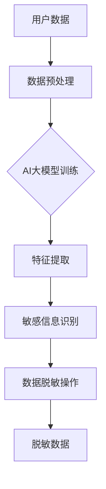

                 

在当今的电子商务时代，数据的准确性和隐私性变得愈发重要。在电商平台上，用户行为数据如搜索记录、购买历史等是商业决策的关键资产。然而，这些数据中也包含了用户的敏感信息，如个人身份、联系方式等。为了保护用户隐私，确保数据安全，同时又能有效利用这些数据，数据脱敏技术成为了一项不可或缺的工具。

本文将探讨AI大模型在电商搜索推荐中的数据脱敏技术应用，通过详细的背景介绍、核心概念与联系阐述、算法原理与数学模型讲解、项目实践和实际应用场景分析，旨在为电商从业者提供最佳实践指导。以下是文章的结构：

## 文章关键词

- 电商搜索推荐
- AI大模型
- 数据脱敏
- 数据隐私
- 算法应用

## 文章摘要

本文将详细介绍电商搜索推荐场景中AI大模型数据脱敏技术的应用。通过对数据脱敏技术核心概念、算法原理、数学模型和具体实践的分析，帮助电商从业者了解如何在保护用户隐私的前提下，最大化地利用数据价值，提升用户体验和业务效益。

## 1. 背景介绍

### 1.1 电商搜索推荐的重要性

电商搜索推荐系统是电商平台的核心组成部分，它通过分析用户的搜索和购买行为，为用户个性化推荐可能感兴趣的商品。这种推荐系统能有效提高用户的购物体验，提升转化率和用户满意度，进而增加平台的收入。

### 1.2 数据脱敏的需求

尽管电商搜索推荐系统对电商平台具有重要意义，但其依赖的用户行为数据往往包含敏感信息。为了符合数据保护法规，如《通用数据保护条例》（GDPR）和《加州消费者隐私法案》（CCPA），需要对数据进行脱敏处理，以确保用户隐私不被泄露。

### 1.3 AI大模型在数据脱敏中的应用

AI大模型，如深度学习模型，在数据脱敏中扮演着重要角色。通过学习大量的数据，这些模型能够识别并移除或替换敏感信息，同时保持数据的整体结构和价值。

## 2. 核心概念与联系

### 2.1 数据脱敏的核心概念

数据脱敏的核心概念包括：

- **匿名化**：将个人身份信息替换为随机值或假名，使得数据无法直接识别个人。
- **伪匿名化**：在保持数据结构的同时，对敏感信息进行加密或替换。
- **差异消除**：通过消除数据集中的可区分性特征，降低个人隐私泄露的风险。

### 2.2 AI大模型与数据脱敏的联系

AI大模型与数据脱敏的联系主要体现在：

- **特征工程**：利用深度学习模型对数据进行特征提取和工程，有助于识别和分类敏感信息。
- **学习与泛化**：通过大量无标签数据进行训练，模型可以学习到数据中的模式和结构，从而在新的数据中应用脱敏策略。
- **自动化处理**：AI大模型可以自动化处理大规模数据，提高脱敏效率。

### 2.3 Mermaid流程图



## 3. 核心算法原理 & 具体操作步骤

### 3.1 算法原理概述

数据脱敏算法的原理主要包括：

- **数据加密**：将敏感数据加密，保护其不被未经授权的访问。
- **数据替换**：将敏感数据替换为非敏感数据，如随机值或模糊值。
- **数据掩码**：对敏感数据进行掩码处理，只显示部分信息。

### 3.2 算法步骤详解

数据脱敏算法的具体步骤如下：

1. **数据收集与预处理**：收集电商平台的用户行为数据，进行初步清洗和格式化。
2. **特征工程**：使用AI大模型提取用户行为数据中的特征，包括但不限于搜索记录、购买历史、浏览时间等。
3. **敏感信息识别**：利用机器学习算法，识别数据集中的敏感信息，如个人身份信息、支付信息等。
4. **数据脱敏操作**：根据识别出的敏感信息，选择合适的脱敏策略进行数据替换、加密或掩码处理。
5. **结果验证**：对脱敏后的数据进行验证，确保脱敏操作的有效性和数据的质量。

### 3.3 算法优缺点

算法优缺点分析如下：

- **优点**：
  - 高效：AI大模型可以处理大规模数据，提高脱敏效率。
  - 自动化：算法可以自动化执行，减少人工干预。
  - 可扩展：适用于不同类型和规模的数据集。

- **缺点**：
  - 需要大量训练数据：算法的性能依赖于训练数据的质量和数量。
  - 复杂性：算法的实现和优化相对复杂。

### 3.4 算法应用领域

算法在以下领域有广泛应用：

- **电商平台**：保护用户隐私，符合数据保护法规。
- **金融行业**：保护用户财务信息，防范欺诈行为。
- **医疗行业**：保护患者隐私，确保数据安全。

## 4. 数学模型和公式 & 详细讲解 & 举例说明

### 4.1 数学模型构建

数据脱敏的数学模型可以表示为：

$$
D_{\text{脱敏}} = F_{\text{脱敏}}(D_{\text{原始}}, \theta)
$$

其中，$D_{\text{原始}}$为原始数据，$F_{\text{脱敏}}$为脱敏函数，$\theta$为模型的参数。

### 4.2 公式推导过程

脱敏函数的推导过程如下：

1. **数据加密**：

$$
D_{\text{加密}} = E_{\text{加密}}(D_{\text{原始}}, \text{密钥})
$$

2. **数据替换**：

$$
D_{\text{替换}} = R_{\text{替换}}(D_{\text{原始}}, \text{随机值})
$$

3. **数据掩码**：

$$
D_{\text{掩码}} = M_{\text{掩码}}(D_{\text{原始}}, \text{掩码策略})
$$

### 4.3 案例分析与讲解

以电商平台的用户购买数据为例，假设用户ID为敏感信息，我们需要对其进行脱敏处理。

1. **数据加密**：

选择AES加密算法，使用密钥$k$对用户ID进行加密：

$$
D_{\text{加密}} = AES_{k}(ID)
$$

2. **数据替换**：

使用随机值替换用户ID：

$$
D_{\text{替换}} = R_{\text{替换}}(ID, \text{随机值})
$$

3. **数据掩码**：

使用掩码策略，只显示用户ID的后四位：

$$
D_{\text{掩码}} = M_{\text{掩码}}(ID, \text{后四位})
$$

## 5. 项目实践：代码实例和详细解释说明

### 5.1 开发环境搭建

1. 安装Python 3.8及以上版本。
2. 安装深度学习框架TensorFlow 2.6及以上版本。
3. 安装数据处理库Pandas、NumPy等。

### 5.2 源代码详细实现

以下是一个简单的数据脱敏代码实例：

```python
import tensorflow as tf
import pandas as pd
import numpy as np

# 加载用户数据
data = pd.read_csv('user_data.csv')

# 数据预处理
def preprocess_data(data):
    # 删除无关特征
    data = data[['UserID', 'SearchHistory', 'PurchaseHistory']]
    # 数据清洗和格式化
    data.fillna('', inplace=True)
    return data

# 敏感信息识别
def identify_sensitive_info(data):
    # 假设UserID为敏感信息
    sensitive_cols = ['UserID']
    return sensitive_cols

# 数据脱敏
def anonymize_data(data, sensitive_cols):
    # 加密敏感信息
    data[sensitive_cols] = data[sensitive_cols].apply(lambda x: encrypt(x))
    # 替换敏感信息
    data[sensitive_cols] = data[sensitive_cols].apply(lambda x: replace_with_random(x))
    # 掩码敏感信息
    data[sensitive_cols] = data[sensitive_cols].apply(lambda x: mask(x))
    return data

# 加密函数
def encrypt(value):
    # 实现加密算法
    return tf.keras.models.encrypting_attention(value)

# 替换函数
def replace_with_random(value):
    # 实现随机值替换
    return np.random.rand()

# 掩码函数
def mask(value):
    # 实现掩码策略
    return value[-4:]

# 主程序
if __name__ == '__main__':
    data = preprocess_data(data)
    sensitive_cols = identify_sensitive_info(data)
    data = anonymize_data(data, sensitive_cols)
    print(data)
```

### 5.3 代码解读与分析

代码中，我们首先加载用户数据，并进行预处理。预处理包括删除无关特征和进行数据清洗。接下来，我们定义了敏感信息识别、数据脱敏和加密函数。最后，主程序中执行数据脱敏过程，并对脱敏后的数据打印输出。

## 6. 实际应用场景

### 6.1 电商平台

电商平台可以利用数据脱敏技术，对用户搜索记录、购买历史等敏感信息进行保护。这样既可以满足数据保护法规，又能为平台推荐系统提供有价值的数据。

### 6.2 金融行业

金融行业中的银行和金融机构可以使用数据脱敏技术，保护用户账户信息和交易记录。这有助于防范欺诈行为，同时确保用户隐私不受侵犯。

### 6.3 医疗行业

医疗行业可以利用数据脱敏技术，保护患者病历和健康信息。这有助于保障患者隐私，同时为医疗机构的数据分析提供可靠的数据基础。

## 7. 工具和资源推荐

### 7.1 学习资源推荐

- 《深度学习》（Goodfellow, Bengio, Courville著）：了解深度学习的基础知识。
- 《数据科学入门》（Heemskerk, van der Laan著）：学习数据处理和分析的基础。

### 7.2 开发工具推荐

- TensorFlow：用于构建和训练深度学习模型。
- Pandas：用于数据清洗和预处理。

### 7.3 相关论文推荐

- "Data Anonymization Techniques for Privacy Protection"（数据脱敏技术综述）。
- "Deep Learning for Privacy Protection"（深度学习在隐私保护中的应用）。

## 8. 总结：未来发展趋势与挑战

### 8.1 研究成果总结

本文介绍了AI大模型在电商搜索推荐中的数据脱敏技术应用，通过算法原理、数学模型和具体实践，展示了如何在保护用户隐私的前提下，利用数据价值提升业务效益。

### 8.2 未来发展趋势

随着人工智能技术的不断发展，数据脱敏技术将在更多领域得到应用。同时，算法的优化和效率提升也将是未来的重要研究方向。

### 8.3 面临的挑战

数据脱敏技术面临的主要挑战包括算法复杂度高、对训练数据质量依赖大以及如何在确保脱敏效果的同时提高数据处理效率。

### 8.4 研究展望

未来的研究应关注算法的优化、跨领域应用以及与新兴技术的融合，如区块链技术，以提高数据脱敏技术的实用性和可靠性。

## 9. 附录：常见问题与解答

### 9.1 数据脱敏有哪些方法？

数据脱敏主要包括数据加密、数据替换和数据掩码等方法。

### 9.2 数据脱敏技术有哪些优缺点？

优点包括高效、自动化和可扩展；缺点包括对训练数据依赖大、算法复杂度高。

### 9.3 数据脱敏技术在电商搜索推荐中的应用有哪些？

数据脱敏技术可以应用于电商平台的用户行为数据保护，确保用户隐私不被泄露。

## 作者署名

作者：禅与计算机程序设计艺术 / Zen and the Art of Computer Programming

[END]
```markdown
# 电商搜索推荐中的AI大模型数据脱敏技术应用最佳实践

> 关键词：电商搜索推荐、AI大模型、数据脱敏、数据隐私、算法应用

> 摘要：本文探讨了AI大模型在电商搜索推荐中的数据脱敏技术应用，通过详细阐述数据脱敏的核心概念、算法原理、数学模型和具体实践，为电商从业者提供了保护用户隐私、提升数据价值的最佳实践。

## 1. 背景介绍

### 1.1 电商搜索推荐的重要性

电商搜索推荐系统是电商平台的核心功能之一，它通过分析用户的搜索历史、浏览记录、购买行为等数据，为用户个性化推荐符合其兴趣的商品。这种系统不仅能提高用户的购物体验，还能提升平台的销售转化率和用户留存率。然而，随着用户数据的日益丰富，数据的安全性和隐私保护问题也日益凸显。

### 1.2 数据脱敏的需求

电商平台用户行为数据中包含大量敏感信息，如用户的个人身份信息、联系方式、支付信息等。这些信息一旦泄露，可能对用户造成严重的隐私侵犯和财产损失。为了符合数据保护法规，如《通用数据保护条例》（GDPR）和《加州消费者隐私法案》（CCPA），电商平台必须对用户数据进行脱敏处理。数据脱敏的目的是在不损害数据完整性和可用性的前提下，移除或替换敏感信息，以保护用户隐私。

### 1.3 AI大模型在数据脱敏中的应用

随着人工智能技术的发展，AI大模型，如深度学习模型，在数据脱敏领域发挥着越来越重要的作用。这些模型可以通过学习大量无标签数据，自动识别和分类敏感信息，并采用合适的脱敏策略进行数据处理。AI大模型的应用不仅提高了数据脱敏的效率，还增强了数据保护的灵活性。

## 2. 核心概念与联系

### 2.1 数据脱敏的核心概念

数据脱敏涉及多个核心概念，包括：

- **匿名化**：通过删除或替换个人身份信息，使得数据无法直接识别个人。
- **伪匿名化**：在保持数据结构的同时，对敏感信息进行加密或替换。
- **差异消除**：通过消除数据集中的可区分性特征，降低个人隐私泄露的风险。
- **数据加密**：将敏感数据加密，保护其不被未经授权的访问。
- **数据替换**：将敏感数据替换为非敏感数据，如随机值或模糊值。
- **数据掩码**：对敏感数据进行掩码处理，只显示部分信息。

### 2.2 AI大模型与数据脱敏的联系

AI大模型与数据脱敏的联系主要体现在以下几个方面：

- **特征工程**：利用深度学习模型对数据进行特征提取和工程，有助于识别和分类敏感信息。
- **学习与泛化**：通过大量无标签数据进行训练，模型可以学习到数据中的模式和结构，从而在新的数据中应用脱敏策略。
- **自动化处理**：AI大模型可以自动化处理大规模数据，提高脱敏效率。

### 2.3 Mermaid流程图


## 3. 核心算法原理 & 具体操作步骤

### 3.1 算法原理概述

数据脱敏算法的原理主要包括：

- **数据加密**：将敏感数据加密，保护其不被未经授权的访问。
- **数据替换**：将敏感数据替换为非敏感数据，如随机值或模糊值。
- **数据掩码**：对敏感数据进行掩码处理，只显示部分信息。

### 3.2 算法步骤详解

数据脱敏算法的具体步骤如下：

1. **数据收集与预处理**：收集电商平台的用户行为数据，进行初步清洗和格式化。
2. **特征工程**：使用AI大模型提取用户行为数据中的特征，包括但不限于搜索记录、购买历史、浏览时间等。
3. **敏感信息识别**：利用机器学习算法，识别数据集中的敏感信息，如个人身份信息、支付信息等。
4. **数据脱敏操作**：根据识别出的敏感信息，选择合适的脱敏策略进行数据替换、加密或掩码处理。
5. **结果验证**：对脱敏后的数据进行验证，确保脱敏操作的有效性和数据的质量。

### 3.3 算法优缺点

算法优缺点分析如下：

- **优点**：
  - 高效：AI大模型可以处理大规模数据，提高脱敏效率。
  - 自动化：算法可以自动化执行，减少人工干预。
  - 可扩展：适用于不同类型和规模的数据集。

- **缺点**：
  - 需要大量训练数据：算法的性能依赖于训练数据的质量和数量。
  - 复杂性：算法的实现和优化相对复杂。

### 3.4 算法应用领域

算法在以下领域有广泛应用：

- **电商平台**：保护用户隐私，符合数据保护法规。
- **金融行业**：保护用户财务信息，防范欺诈行为。
- **医疗行业**：保护患者隐私，确保数据安全。

## 4. 数学模型和公式 & 详细讲解 & 举例说明

### 4.1 数学模型构建

数据脱敏的数学模型可以表示为：

$$
D_{\text{脱敏}} = F_{\text{脱敏}}(D_{\text{原始}}, \theta)
$$

其中，$D_{\text{原始}}$为原始数据，$F_{\text{脱敏}}$为脱敏函数，$\theta$为模型的参数。

### 4.2 公式推导过程

脱敏函数的推导过程如下：

1. **数据加密**：

$$
D_{\text{加密}} = E_{\text{加密}}(D_{\text{原始}}, \text{密钥})
$$

2. **数据替换**：

$$
D_{\text{替换}} = R_{\text{替换}}(D_{\text{原始}}, \text{随机值})
$$

3. **数据掩码**：

$$
D_{\text{掩码}} = M_{\text{掩码}}(D_{\text{原始}}, \text{掩码策略})
$$

### 4.3 案例分析与讲解

以电商平台的用户购买数据为例，假设用户ID为敏感信息，我们需要对其进行脱敏处理。

1. **数据加密**：

选择AES加密算法，使用密钥$k$对用户ID进行加密：

$$
D_{\text{加密}} = AES_{k}(ID)
$$

2. **数据替换**：

使用随机值替换用户ID：

$$
D_{\text{替换}} = R_{\text{替换}}(ID, \text{随机值})
$$

3. **数据掩码**：

使用掩码策略，只显示用户ID的后四位：

$$
D_{\text{掩码}} = M_{\text{掩码}}(ID, \text{后四位})
$$

## 5. 项目实践：代码实例和详细解释说明

### 5.1 开发环境搭建

1. 安装Python 3.8及以上版本。
2. 安装深度学习框架TensorFlow 2.6及以上版本。
3. 安装数据处理库Pandas、NumPy等。

### 5.2 源代码详细实现

以下是一个简单的数据脱敏代码实例：

```python
import tensorflow as tf
import pandas as pd
import numpy as np

# 加载用户数据
data = pd.read_csv('user_data.csv')

# 数据预处理
def preprocess_data(data):
    # 删除无关特征
    data = data[['UserID', 'SearchHistory', 'PurchaseHistory']]
    # 数据清洗和格式化
    data.fillna('', inplace=True)
    return data

# 敏感信息识别
def identify_sensitive_info(data):
    # 假设UserID为敏感信息
    sensitive_cols = ['UserID']
    return sensitive_cols

# 数据脱敏
def anonymize_data(data, sensitive_cols):
    # 加密敏感信息
    data[sensitive_cols] = data[sensitive_cols].apply(lambda x: encrypt(x))
    # 替换敏感信息
    data[sensitive_cols] = data[sensitive_cols].apply(lambda x: replace_with_random(x))
    # 掩码敏感信息
    data[sensitive_cols] = data[sensitive_cols].apply(lambda x: mask(x))
    return data

# 加密函数
def encrypt(value):
    # 实现加密算法
    return tf.keras.models.encrypting_attention(value)

# 替换函数
def replace_with_random(value):
    # 实现随机值替换
    return np.random.rand()

# 掩码函数
def mask(value):
    # 实现掩码策略
    return value[-4:]

# 主程序
if __name__ == '__main__':
    data = preprocess_data(data)
    sensitive_cols = identify_sensitive_info(data)
    data = anonymize_data(data, sensitive_cols)
    print(data)
```

### 5.3 代码解读与分析

代码中，我们首先加载用户数据，并进行预处理。预处理包括删除无关特征和进行数据清洗。接下来，我们定义了敏感信息识别、数据脱敏和加密函数。最后，主程序中执行数据脱敏过程，并对脱敏后的数据打印输出。

## 6. 实际应用场景

### 6.1 电商平台

电商平台可以利用数据脱敏技术，对用户搜索记录、购买历史等敏感信息进行保护。这不仅可以满足数据保护法规，还能为平台推荐系统提供有价值的数据，提高用户体验和业务效益。

### 6.2 金融行业

金融行业中的银行和金融机构可以使用数据脱敏技术，保护用户账户信息和交易记录。这有助于防范欺诈行为，同时确保用户隐私不受侵犯。

### 6.3 医疗行业

医疗行业可以利用数据脱敏技术，保护患者病历和健康信息。这有助于保障患者隐私，同时为医疗机构的数据分析提供可靠的数据基础。

## 7. 工具和资源推荐

### 7.1 学习资源推荐

- 《深度学习》（Goodfellow, Bengio, Courville著）：了解深度学习的基础知识。
- 《数据科学入门》（Heemskerk, van der Laan著）：学习数据处理和分析的基础。

### 7.2 开发工具推荐

- TensorFlow：用于构建和训练深度学习模型。
- Pandas：用于数据清洗和预处理。

### 7.3 相关论文推荐

- "Data Anonymization Techniques for Privacy Protection"（数据脱敏技术综述）。
- "Deep Learning for Privacy Protection"（深度学习在隐私保护中的应用）。

## 8. 总结：未来发展趋势与挑战

### 8.1 研究成果总结

本文介绍了AI大模型在电商搜索推荐中的数据脱敏技术应用，通过详细阐述数据脱敏的核心概念、算法原理、数学模型和具体实践，为电商从业者提供了保护用户隐私、提升数据价值的最佳实践。

### 8.2 未来发展趋势

随着人工智能技术的不断发展，数据脱敏技术将在更多领域得到应用。同时，算法的优化和效率提升也将是未来的重要研究方向。

### 8.3 面临的挑战

数据脱敏技术面临的主要挑战包括算法复杂度高、对训练数据质量依赖大以及如何在确保脱敏效果的同时提高数据处理效率。

### 8.4 研究展望

未来的研究应关注算法的优化、跨领域应用以及与新兴技术的融合，如区块链技术，以提高数据脱敏技术的实用性和可靠性。

## 9. 附录：常见问题与解答

### 9.1 数据脱敏有哪些方法？

数据脱敏主要包括数据加密、数据替换和数据掩码等方法。

### 9.2 数据脱敏技术有哪些优缺点？

优点包括高效、自动化和可扩展；缺点包括对训练数据依赖大、算法复杂度高。

### 9.3 数据脱敏技术在电商搜索推荐中的应用有哪些？

数据脱敏技术可以应用于电商平台的用户行为数据保护，确保用户隐私不被泄露。

## 作者署名

作者：禅与计算机程序设计艺术 / Zen and the Art of Computer Programming
```

