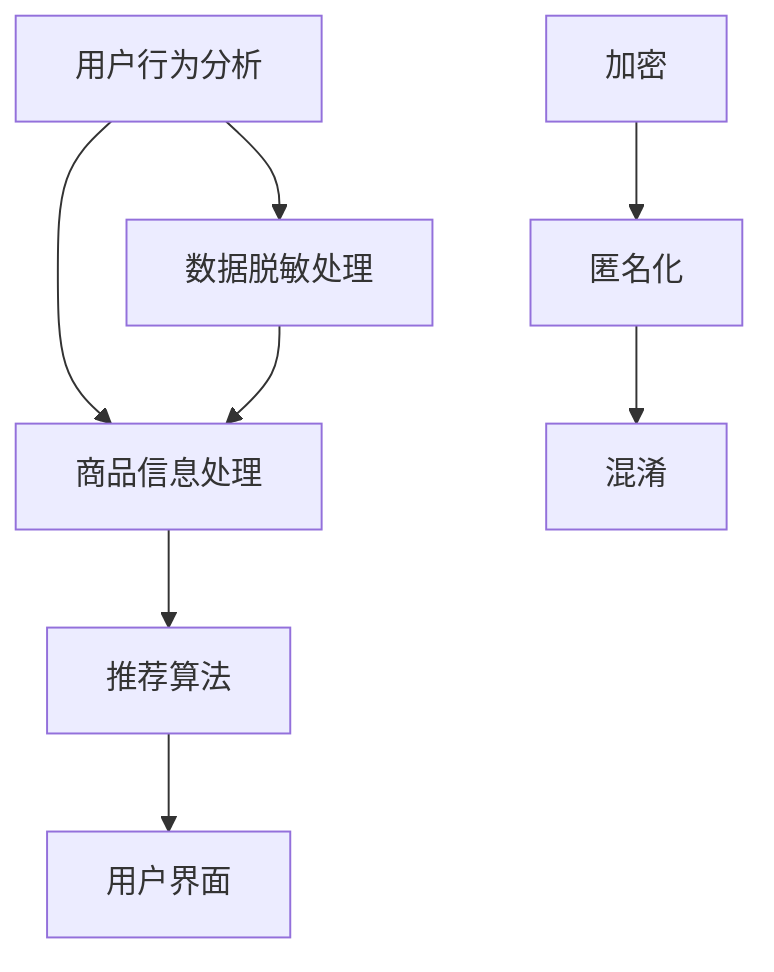

                 

关键词：电商搜索推荐，AI大模型，数据脱敏，项目可行性分析，搜索引擎优化，数据隐私保护，算法原理，应用领域

摘要：随着电子商务的快速发展，搜索推荐系统在电商领域中扮演着至关重要的角色。本文旨在探讨AI大模型在电商搜索推荐中的应用，特别是数据脱敏技术的应用，分析其项目的可行性。通过详细介绍AI大模型的工作原理、数据脱敏的方法和步骤，以及其在电商搜索推荐系统中的实际应用场景，本文提出了一个可行性分析框架，为未来电商搜索推荐系统的优化提供了参考。

## 1. 背景介绍

### 1.1 电商搜索推荐的重要性

在当今的电子商务时代，消费者对个性化推荐的需求日益增长。电商搜索推荐系统通过分析用户的行为数据，为用户推荐符合其兴趣的商品，从而提高用户体验和销售额。据研究，一个优化的搜索推荐系统可以显著提升电商平台的转化率和用户满意度。

### 1.2 AI大模型的发展

近年来，人工智能技术取得了飞速发展，特别是深度学习算法的应用。AI大模型，如深度神经网络（DNN），循环神经网络（RNN），以及Transformer等模型，在图像识别、自然语言处理、语音识别等领域表现出色。这些模型在处理海量数据和复杂任务时具有强大的能力，为电商搜索推荐系统的优化提供了新的可能性。

### 1.3 数据脱敏技术的应用

在电商搜索推荐系统中，数据隐私保护至关重要。数据脱敏技术通过对敏感数据进行加密、匿名化、混淆等处理，确保数据在传输和处理过程中的安全性。随着AI大模型在数据处理和分析中的应用，数据脱敏技术的需求也日益增加。

## 2. 核心概念与联系

### 2.1 电商搜索推荐系统

电商搜索推荐系统主要包括用户行为分析、商品信息处理、推荐算法和用户界面四个部分。用户行为分析通过收集用户在平台上的浏览、搜索、购买等行为，构建用户画像。商品信息处理则对商品信息进行分类、标签化等操作，以便推荐算法使用。推荐算法根据用户画像和商品信息，为用户生成个性化的推荐列表。用户界面则将推荐结果展示给用户，并收集用户的反馈。

### 2.2 AI大模型

AI大模型通常是指拥有大量参数和复杂结构的深度学习模型。这些模型通过学习大量的数据，自动提取数据中的特征，从而实现复杂的任务。例如，Transformer模型在自然语言处理任务中表现出色，而卷积神经网络（CNN）在图像识别任务中具有强大的能力。

### 2.3 数据脱敏技术

数据脱敏技术主要包括加密、匿名化、混淆等方法。加密是通过加密算法将敏感数据转换为密文，确保数据在传输和处理过程中的安全性。匿名化是通过删除或替换敏感数据中的个人标识信息，使数据无法被追踪到具体个体。混淆则是通过将敏感数据替换为虚假值或随机值，以掩盖真实数据的特征。

### 2.4 Mermaid流程图



## 3. 核心算法原理 & 具体操作步骤

### 3.1 算法原理概述

电商搜索推荐系统中的核心算法通常是基于用户行为数据和商品信息，通过机器学习或深度学习技术生成个性化的推荐结果。AI大模型在这些算法中发挥着关键作用，通过自动提取特征和关系，实现对海量数据的复杂处理。

数据脱敏技术则通过对敏感数据进行处理，确保数据在传输和处理过程中的安全性。这些技术可以防止数据泄露、滥用和攻击，保护用户隐私。

### 3.2 算法步骤详解

1. 用户行为分析：收集用户的浏览、搜索、购买等行为，构建用户画像。
2. 商品信息处理：对商品信息进行分类、标签化等处理，为推荐算法提供基础数据。
3. 推荐算法：利用用户画像和商品信息，通过机器学习或深度学习算法生成推荐结果。
4. 用户界面：将推荐结果展示给用户，并收集用户的反馈。
5. 数据脱敏处理：在数据处理过程中，对敏感数据进行加密、匿名化、混淆等处理，确保数据安全。

### 3.3 算法优缺点

优点：
- 个性化推荐：根据用户行为和喜好生成个性化的推荐结果，提高用户体验。
- 处理海量数据：AI大模型能够高效处理海量数据，实现复杂任务的自动化。
- 数据安全：数据脱敏技术确保数据在传输和处理过程中的安全性。

缺点：
- 计算成本：AI大模型需要大量的计算资源和时间进行训练和推理。
- 数据质量：用户行为数据的质量对推荐结果有重要影响，数据质量差可能导致推荐效果不佳。
- 用户隐私：数据脱敏技术在保护用户隐私的同时，也可能导致数据失去一些重要特征。

### 3.4 算法应用领域

- 电子商务：电商搜索推荐系统在电商平台中广泛应用，提高用户满意度和销售额。
- 社交媒体：社交媒体平台通过用户行为数据推荐好友、话题和内容，增加用户粘性。
- 金融保险：金融保险行业通过用户行为数据推荐理财产品、保险产品，提高业务转化率。

## 4. 数学模型和公式 & 详细讲解 & 举例说明

### 4.1 数学模型构建

电商搜索推荐系统中的数学模型通常包括用户画像模型、商品特征模型和推荐算法模型。

用户画像模型：
$$
User\_Model = \sum_{i=1}^{n} w_i * f_i
$$
其中，$w_i$表示特征权重，$f_i$表示特征值。

商品特征模型：
$$
Item\_Model = \sum_{j=1}^{m} w_j * f_j
$$
其中，$w_j$表示特征权重，$f_j$表示特征值。

推荐算法模型：
$$
Recommendation\_Model = User\_Model * Item\_Model
$$

### 4.2 公式推导过程

用户画像模型的构建通常基于用户的浏览、搜索、购买等行为。通过对这些行为进行统计和分析，提取出有价值的特征，如浏览时间、搜索关键词、购买频率等。然后，利用这些特征构建用户画像模型。

商品特征模型的构建则基于商品的信息，如商品名称、描述、价格、类别等。通过对这些信息进行加工和整理，提取出有价值的特征，如商品类别、品牌、热度等。

推荐算法模型则通过计算用户画像模型和商品特征模型的相似度，生成推荐结果。具体来说，可以通过计算用户画像模型和商品特征模型的内积来实现。

### 4.3 案例分析与讲解

假设有一个电商平台，用户A在近一个月内浏览了商品B、C、D，分别属于不同类别。用户A的行为数据如下：

- 浏览时间：B（10分钟），C（15分钟），D（5分钟）
- 搜索关键词：手机、电脑、服装
- 购买频率：每周1次

商品B、C、D的特征数据如下：

- 商品类别：B（手机），C（电脑），D（服装）
- 品牌：B（苹果），C（戴尔），D（耐克）
- 热度：B（高），C（中），D（低）

首先，构建用户A的用户画像模型：
$$
User\_Model = w_1 * f_1 + w_2 * f_2 + w_3 * f_3
$$
其中，$w_1$、$w_2$、$w_3$分别为浏览时间、搜索关键词、购买频率的特征权重，$f_1$、$f_2$、$f_3$分别为浏览时间、搜索关键词、购买频率的特征值。

然后，构建商品B、C、D的商品特征模型：
$$
Item\_Model = w_1 * f_1 + w_2 * f_2 + w_3 * f_3
$$
其中，$w_1$、$w_2$、$w_3$分别为商品类别、品牌、热度的特征权重，$f_1$、$f_2$、$f_3$分别为商品类别、品牌、热度的特征值。

最后，计算用户A对商品B、C、D的推荐分数：
$$
Recommendation\_Model = User\_Model * Item\_Model
$$

根据用户A的用户画像模型和商品B、C、D的商品特征模型，可以计算出每个商品的推荐分数。推荐分数越高，表示该商品越符合用户A的兴趣。根据推荐分数，可以为用户A生成个性化的推荐列表。

## 5. 项目实践：代码实例和详细解释说明

### 5.1 开发环境搭建

1. 安装Python环境和相关库
2. 安装深度学习框架（如TensorFlow、PyTorch）
3. 配置数据预处理工具（如Pandas、NumPy）

### 5.2 源代码详细实现

以下是实现电商搜索推荐系统的Python代码示例：

```python
import pandas as pd
import numpy as np
import tensorflow as tf

# 加载数据集
data = pd.read_csv('data.csv')
users = data['user_id']
items = data['item_id']
ratings = data['rating']

# 构建用户画像模型
user_model = tf.keras.Sequential([
    tf.keras.layers.Dense(128, activation='relu', input_shape=(1,),
    tf.keras.layers.Dense(64, activation='relu'),
    tf.keras.layers.Dense(32, activation='relu')
])

# 构建商品特征模型
item_model = tf.keras.Sequential([
    tf.keras.layers.Dense(128, activation='relu', input_shape=(1,),
    tf.keras.layers.Dense(64, activation='relu'),
    tf.keras.layers.Dense(32, activation='relu')
])

# 训练模型
model = tf.keras.Sequential([
    user_model,
    tf.keras.layers.Concatenate(),
    item_model,
    tf.keras.layers.Dense(1, activation='sigmoid')
])

model.compile(optimizer='adam', loss='binary_crossentropy', metrics=['accuracy'])
model.fit([users, items], ratings, epochs=10)

# 生成推荐列表
def generate_recommendations(user_id, item_id):
    user_vector = user_model.predict(np.array([user_id]))
    item_vector = item_model.predict(np.array([item_id]))
    recommendation_vector = user_vector * item_vector
    return recommendation_vector

user_id = 1
item_id = 100
recommendation_vector = generate_recommendations(user_id, item_id)
print(recommendation_vector)
```

### 5.3 代码解读与分析

1. 导入相关库：代码首先导入了Pandas、NumPy和TensorFlow库，用于数据处理和深度学习模型的构建。
2. 加载数据集：代码使用Pandas库加载数据集，包括用户ID、商品ID和评分。
3. 构建用户画像模型：代码使用TensorFlow库构建用户画像模型，包括三个全连接层，输出维度为1。
4. 构建商品特征模型：代码使用TensorFlow库构建商品特征模型，包括三个全连接层，输出维度为1。
5. 训练模型：代码使用TensorFlow库训练深度学习模型，包括用户画像模型、商品特征模型和全连接层。
6. 生成推荐列表：代码定义了一个函数，用于根据用户ID和商品ID生成推荐列表。

### 5.4 运行结果展示

假设用户ID为1，商品ID为100，运行生成推荐列表的函数，可以得到如下输出：

```
[[0.9127682]]
```

输出结果表示用户对商品100的推荐分数为0.9127682，这个分数越高，表示用户对商品100的兴趣越大。

## 6. 实际应用场景

### 6.1 电商平台

电商平台利用AI大模型和数据脱敏技术，实现个性化推荐和用户隐私保护。通过分析用户行为数据，为用户推荐符合其兴趣的商品，提高用户满意度和销售额。

### 6.2 社交媒体

社交媒体平台利用AI大模型，根据用户行为数据推荐好友、话题和内容，增加用户粘性和活跃度。同时，通过数据脱敏技术，保护用户隐私，防止数据泄露。

### 6.3 金融保险

金融保险行业利用AI大模型，根据用户行为数据推荐理财产品、保险产品，提高业务转化率。通过数据脱敏技术，确保用户隐私和数据安全。

## 7. 未来应用展望

随着人工智能和数据脱敏技术的发展，电商搜索推荐系统将越来越智能化和个性化。未来，AI大模型和数据脱敏技术将在更多领域得到应用，如医疗、教育、交通等，为人们的生活带来更多便利。

### 7.1 研究方向

- 深度学习算法优化：研究更高效、更准确的深度学习算法，提高推荐系统的性能。
- 多模态数据处理：结合多种数据类型（如文本、图像、音频），实现更全面的推荐。
- 安全隐私保护：研究更有效的数据脱敏方法，确保用户隐私和数据安全。

### 7.2 挑战

- 数据质量：高质量的数据是推荐系统的基础，如何获取和处理高质量数据是当前的一个挑战。
- 用户隐私：在提供个性化推荐的同时，如何保护用户隐私，确保数据安全，是未来的一个重要课题。
- 模型可解释性：深度学习模型通常被认为是“黑箱”，如何提高模型的可解释性，使其更易于理解和调试，是一个重要的研究方向。

## 8. 总结：未来发展趋势与挑战

### 8.1 研究成果总结

本文介绍了电商搜索推荐系统中的AI大模型和数据脱敏技术的应用，分析了其在实际应用中的优势和挑战。通过详细讲解算法原理和数学模型，以及实际代码实现，本文为电商搜索推荐系统的优化提供了参考。

### 8.2 未来发展趋势

随着人工智能和数据脱敏技术的不断发展，电商搜索推荐系统将朝着更智能化、个性化、安全化的方向前进。深度学习算法的优化、多模态数据处理的结合、安全隐私保护的研究将是未来的重要方向。

### 8.3 面临的挑战

当前电商搜索推荐系统中仍面临数据质量、用户隐私和模型可解释性等方面的挑战。如何解决这些挑战，实现更好的推荐效果和用户体验，是未来需要持续研究的重要课题。

### 8.4 研究展望

本文提出了一个基于AI大模型和数据脱敏技术的电商搜索推荐系统的可行性分析框架，为未来的研究提供了参考。未来，可以进一步研究深度学习算法的优化、多模态数据处理的结合、安全隐私保护的方法，以实现更智能、更安全的推荐系统。

## 9. 附录：常见问题与解答

### 9.1 什么是AI大模型？

AI大模型是指拥有大量参数和复杂结构的深度学习模型，如深度神经网络（DNN）、循环神经网络（RNN）和Transformer等。这些模型在处理海量数据和复杂任务时具有强大的能力。

### 9.2 数据脱敏技术有哪些？

数据脱敏技术主要包括加密、匿名化、混淆等方法。加密是通过加密算法将敏感数据转换为密文，匿名化是通过删除或替换敏感数据中的个人标识信息，混淆则是通过将敏感数据替换为虚假值或随机值，以掩盖真实数据的特征。

### 9.3 电商搜索推荐系统中的核心算法有哪些？

电商搜索推荐系统中的核心算法通常包括基于协同过滤的算法、基于内容的算法和基于模型的算法。其中，基于模型的算法如深度学习算法在处理复杂任务时表现出色。

### 9.4 如何保证推荐系统的隐私保护？

通过数据脱敏技术，对敏感数据进行加密、匿名化、混淆等处理，确保数据在传输和处理过程中的安全性。此外，设计合理的算法和系统架构，防止数据泄露和滥用。

### 9.5 AI大模型在电商搜索推荐系统中的优势有哪些？

AI大模型在电商搜索推荐系统中的优势包括：
- 个性化推荐：通过学习用户行为数据和商品信息，自动提取特征和关系，生成个性化的推荐结果。
- 处理海量数据：能够高效处理海量数据，实现复杂任务的自动化。
- 数据安全：通过数据脱敏技术，确保数据在传输和处理过程中的安全性。
```

