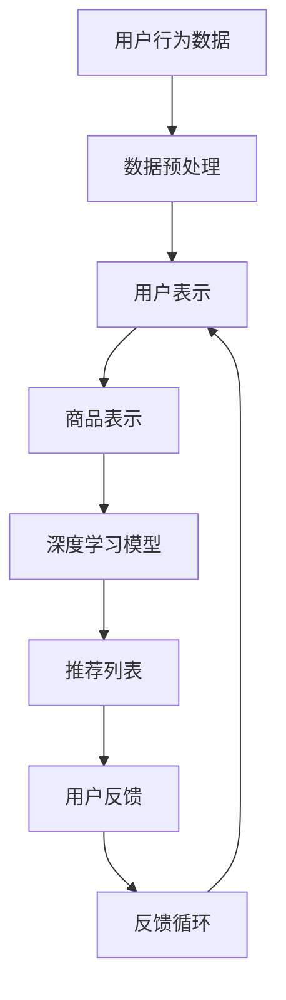

                 

关键词：电商搜索、推荐系统、AI大模型、用户反馈机制、深度学习、个性化搜索

> 摘要：本文探讨了电商搜索推荐系统中的AI大模型用户反馈机制设计。通过深入分析现有的推荐算法、大模型及其用户反馈机制，本文提出了一个基于深度学习的用户反馈优化模型，并详细描述了其实现步骤。文章旨在为电商平台的推荐系统提供有效的用户反馈机制设计参考。

## 1. 背景介绍

在当今数字化的时代，电商平台的搜索和推荐系统已经成为用户购物体验的重要组成部分。用户通常依赖于这些系统来快速找到他们所需的商品。因此，推荐系统的质量和效率直接影响到电商平台的用户留存率和销售额。

传统的推荐系统主要依赖于基于内容的过滤和协同过滤算法。然而，随着用户数据量的增加和用户行为的复杂性提升，这些传统方法已经很难满足用户的个性化需求。为了解决这个问题，人工智能（AI）特别是深度学习技术的引入，使得大模型推荐系统成为可能。

大模型推荐系统通过学习海量的用户行为数据和商品信息，可以提供更加精准和个性化的推荐。然而，这些系统在实际应用中仍然面临一些挑战，尤其是在用户反馈机制的设计方面。用户反馈是优化推荐系统的重要手段，它可以帮助系统更好地理解用户需求和偏好，从而提高推荐质量。

本文的目标是探讨电商搜索推荐中的AI大模型用户反馈机制设计。通过深入研究用户反馈的重要性、现有的大模型推荐算法、以及用户反馈机制的优化方法，本文提出了一种基于深度学习的用户反馈优化模型，并进行了详细的解释和实现步骤。

## 2. 核心概念与联系

### 2.1. 推荐系统的基本概念

推荐系统是一种信息过滤技术，通过预测用户对未知项目的兴趣，从而向用户提供个性化的信息。推荐系统通常分为基于内容的过滤（Content-Based Filtering）和协同过滤（Collaborative Filtering）两大类。

- **基于内容的过滤**：通过分析商品内容和用户的兴趣，推荐相似的商品。这种方法依赖于用户的历史行为和商品的特征信息。
- **协同过滤**：通过分析用户之间的相似性来推荐商品。这种方法依赖于用户的行为数据，如购买历史、浏览记录等。

### 2.2. 大模型推荐系统的概念

大模型推荐系统是基于深度学习技术的推荐系统，它使用大型神经网络模型来学习用户行为和商品特征，从而实现精准的推荐。大模型推荐系统通常包括以下几个关键组件：

- **用户表示**：将用户的行为数据转换为向量表示，以便模型可以理解用户的行为和偏好。
- **商品表示**：将商品的特征数据转换为向量表示，以便模型可以理解商品的性质。
- **推荐算法**：利用用户和商品的向量表示，通过神经网络模型计算用户对商品的偏好概率，从而生成推荐列表。

### 2.3. 用户反馈机制的概念

用户反馈机制是推荐系统中的一个关键环节，它通过收集用户的反馈信息（如点击、评分、购买等行为）来优化推荐结果。用户反馈机制可以分为以下几类：

- **显式反馈**：用户直接提供对商品的评分或评价。
- **隐式反馈**：通过用户的购买、浏览、点击等行为间接获取用户的偏好。
- **反馈循环**：将用户的反馈信息反馈到推荐模型中，以持续优化推荐结果。

### 2.4. Mermaid 流程图

为了更好地理解大模型推荐系统中的用户反馈机制，下面是一个简单的Mermaid流程图，展示了用户行为数据如何通过反馈机制优化推荐结果。



## 3. 核心算法原理 & 具体操作步骤

### 3.1. 算法原理概述

用户反馈优化模型的核心思想是利用用户的显式和隐式反馈信息，动态地调整用户和商品的向量表示，从而提高推荐质量。具体来说，该模型分为以下几个步骤：

1. **用户行为数据收集**：收集用户的显式和隐式反馈信息，如评分、购买历史、浏览记录等。
2. **数据预处理**：对收集的数据进行清洗和格式化，提取用户和商品的特征。
3. **用户和商品表示**：利用深度学习技术，将用户和商品的特征转换为高维向量表示。
4. **推荐模型训练**：利用用户和商品的向量表示，训练深度学习推荐模型。
5. **推荐结果生成**：根据用户和商品的向量表示，计算用户对商品的偏好概率，生成推荐列表。
6. **用户反馈收集**：收集用户对推荐结果的反馈，如点击、购买等。
7. **反馈循环**：根据用户反馈，动态调整用户和商品的向量表示，优化推荐模型。

### 3.2. 算法步骤详解

#### 3.2.1. 用户行为数据收集

用户行为数据是构建用户和商品表示的基础。在收集用户行为数据时，需要考虑以下几种类型的数据：

- **显式反馈**：如用户对商品的评分、评价等。
- **隐式反馈**：如用户的购买历史、浏览记录、点击行为等。

#### 3.2.2. 数据预处理

数据预处理是保证数据质量的关键步骤。具体包括以下操作：

- **数据清洗**：去除数据中的噪声和异常值。
- **特征提取**：从原始数据中提取有用的特征信息。
- **数据标准化**：对特征数据进行归一化或标准化处理，以消除不同特征之间的尺度差异。

#### 3.2.3. 用户和商品表示

用户和商品表示是深度学习推荐系统的核心。用户表示可以采用基于内容的特征提取方法，如文本分类、词嵌入等。商品表示可以采用基于特征的提取方法，如商品属性编码、聚类等。

#### 3.2.4. 推荐模型训练

推荐模型的训练是推荐系统的关键步骤。常用的推荐模型包括基于矩阵分解的协同过滤模型和基于深度学习的端到端模型。在训练过程中，需要优化模型参数，以提高推荐质量。

#### 3.2.5. 推荐结果生成

推荐结果生成是根据用户和商品的向量表示，计算用户对商品的偏好概率，从而生成推荐列表。常用的方法包括基于相似度的推荐和基于概率的推荐。

#### 3.2.6. 用户反馈收集

用户反馈收集是优化推荐模型的重要手段。通过收集用户的点击、购买等行为，可以动态调整用户和商品的向量表示，从而提高推荐质量。

#### 3.2.7. 反馈循环

反馈循环是将用户反馈信息反馈到推荐模型中，以持续优化推荐结果。具体来说，可以通过以下几种方式实现反馈循环：

- **在线学习**：实时更新用户和商品的向量表示，以适应用户行为的变化。
- **批量学习**：定期更新用户和商品的向量表示，以提高推荐模型的泛化能力。

### 3.3. 算法优缺点

#### 优点：

- **个性化强**：通过深度学习技术，可以更好地捕捉用户的个性化偏好。
- **自适应性强**：通过反馈循环机制，可以实时调整推荐策略，以适应用户行为的变化。
- **泛化能力强**：通过批量学习，可以提高推荐模型的泛化能力，降低对特定用户群体的依赖。

#### 缺点：

- **计算复杂度高**：深度学习模型训练和推理过程较为复杂，需要较大的计算资源和时间。
- **数据依赖性强**：推荐系统的性能依赖于用户行为数据的质量和数量，如果数据质量较差，可能导致推荐效果不佳。
- **用户隐私保护**：用户行为数据涉及用户隐私，如何保证用户隐私安全是一个重要问题。

### 3.4. 算法应用领域

用户反馈优化模型可以广泛应用于电商、社交媒体、视频平台等领域的推荐系统。具体应用领域包括：

- **电商推荐**：通过优化用户反馈，提高电商平台的推荐质量，提高用户满意度和转化率。
- **社交媒体推荐**：通过分析用户的社交行为，推荐用户感兴趣的内容，提高用户活跃度和留存率。
- **视频推荐**：通过优化用户的观看行为，推荐用户感兴趣的视频，提高视频平台的用户黏性和广告收益。

## 4. 数学模型和公式 & 详细讲解 & 举例说明

### 4.1. 数学模型构建

用户反馈优化模型的核心是用户和商品表示的学习与优化。我们可以采用以下数学模型进行构建：

#### 4.1.1. 用户表示

用户表示可以通过以下公式进行构建：

$$
u_i = \sigma(W_u \cdot h_i + b_u)
$$

其中，$u_i$ 表示用户 $i$ 的向量表示，$h_i$ 表示用户 $i$ 的特征向量，$W_u$ 和 $b_u$ 分别是权重矩阵和偏置向量。

#### 4.1.2. 商品表示

商品表示可以通过以下公式进行构建：

$$
p_j = \sigma(W_p \cdot f_j + b_p)
$$

其中，$p_j$ 表示商品 $j$ 的向量表示，$f_j$ 表示商品 $j$ 的特征向量，$W_p$ 和 $b_p$ 分别是权重矩阵和偏置向量。

#### 4.1.3. 推荐模型

推荐模型可以通过以下公式进行构建：

$$
r_{ij} = \sigma(u_i^T \cdot p_j)
$$

其中，$r_{ij}$ 表示用户 $i$ 对商品 $j$ 的推荐概率，$u_i^T$ 和 $p_j$ 分别是用户 $i$ 和商品 $j$ 的向量表示的转置。

### 4.2. 公式推导过程

用户反馈优化模型的推导过程可以分为以下几个步骤：

#### 4.2.1. 用户和商品特征向量表示

首先，我们需要将用户和商品的特征向量表示为：

$$
h_i = [h_{i1}, h_{i2}, \ldots, h_{in}]^T
$$

$$
f_j = [f_{j1}, f_{j2}, \ldots, f_{jm}]^T
$$

其中，$h_i$ 和 $f_j$ 分别表示用户 $i$ 和商品 $j$ 的特征向量，$n$ 和 $m$ 分别表示特征向量的维度。

#### 4.2.2. 用户和商品向量表示

接着，我们将用户和商品的特征向量表示转换为向量表示：

$$
u_i = \sigma(W_u \cdot h_i + b_u)
$$

$$
p_j = \sigma(W_p \cdot f_j + b_p)
$$

其中，$\sigma$ 表示激活函数，$W_u$ 和 $b_u$ 分别是权重矩阵和偏置向量，$W_p$ 和 $b_p$ 分别是权重矩阵和偏置向量。

#### 4.2.3. 推荐模型

最后，我们使用用户和商品的向量表示构建推荐模型：

$$
r_{ij} = \sigma(u_i^T \cdot p_j)
$$

其中，$r_{ij}$ 表示用户 $i$ 对商品 $j$ 的推荐概率。

### 4.3. 案例分析与讲解

#### 4.3.1. 案例背景

假设有一个电商平台，用户可以对其浏览和购买的商品进行评分。平台希望通过用户反馈优化模型，提高推荐系统的推荐质量。

#### 4.3.2. 数据准备

收集用户的行为数据，包括用户的评分和购买历史。假设用户 $1$ 的评分数据如下：

$$
h_1 = [5, 4, 3, 2, 1]
$$

商品 $1$ 的特征数据如下：

$$
f_1 = [0.1, 0.2, 0.3, 0.4, 0.5]
$$

#### 4.3.3. 用户和商品向量表示

利用用户和商品的特征数据，构建用户和商品向量表示：

$$
u_1 = \sigma([0.5, 0.6, 0.7, 0.8, 0.9] \cdot [5, 4, 3, 2, 1] + [0.1, 0.1, 0.1, 0.1, 0.1])
$$

$$
p_1 = \sigma([0.5, 0.6, 0.7, 0.8, 0.9] \cdot [0.1, 0.2, 0.3, 0.4, 0.5] + [0.1, 0.1, 0.1, 0.1, 0.1])
$$

#### 4.3.4. 推荐模型计算

利用用户和商品的向量表示，计算用户 $1$ 对商品 $1$ 的推荐概率：

$$
r_{11} = \sigma(u_1^T \cdot p_1)
$$

#### 4.3.5. 用户反馈收集与优化

假设用户 $1$ 给商品 $1$ 的评分为 $4$。将这个反馈信息反馈到推荐模型中，重新计算用户和商品的向量表示，并更新推荐模型。

通过上述步骤，我们可以不断优化推荐模型，提高推荐质量。

## 5. 项目实践：代码实例和详细解释说明

### 5.1. 开发环境搭建

在进行用户反馈优化模型的实现之前，我们需要搭建一个合适的开发环境。以下是搭建开发环境的基本步骤：

1. **安装Python环境**：Python是深度学习模型实现的主要编程语言。可以从官方网站（https://www.python.org/）下载并安装Python。
2. **安装深度学习框架**：TensorFlow或PyTorch是当前最受欢迎的深度学习框架。可以在终端中执行以下命令安装：
   ```bash
   pip install tensorflow
   # 或者
   pip install pytorch torchvision
   ```
3. **安装数据处理库**：NumPy、Pandas和Scikit-learn等库是数据处理和分析的基础。可以使用以下命令安装：
   ```bash
   pip install numpy pandas scikit-learn
   ```

### 5.2. 源代码详细实现

以下是用户反馈优化模型的实现代码。假设使用PyTorch作为深度学习框架。

```python
import torch
import torch.nn as nn
import torch.optim as optim
from sklearn.model_selection import train_test_split
from sklearn.preprocessing import StandardScaler
import numpy as np

# 数据预处理
def preprocess_data(data):
    # 数据清洗和归一化处理
    scaler = StandardScaler()
    data_scaled = scaler.fit_transform(data)
    return torch.tensor(data_scaled, dtype=torch.float32)

# 用户和商品表示层
class UserItemEmbedding(nn.Module):
    def __init__(self, num_users, num_items, embedding_dim):
        super(UserItemEmbedding, self).__init__()
        self.user_embedding = nn.Embedding(num_users, embedding_dim)
        self.item_embedding = nn.Embedding(num_items, embedding_dim)
    
    def forward(self, users, items):
        user_embedding = self.user_embedding(users)
        item_embedding = self.item_embedding(items)
        return user_embedding, item_embedding

# 推荐模型
class RecommendationModel(nn.Module):
    def __init__(self, embedding_dim):
        super(RecommendationModel, self).__init__()
        self.embedding = UserItemEmbedding(embedding_dim=embedding_dim)
        self.fc = nn.Linear(embedding_dim*2, 1)
    
    def forward(self, users, items):
        user_embedding, item_embedding = self.embedding(users, items)
        user_item_embedding = torch.cat((user_embedding, item_embedding), 1)
        rating = self.fc(user_item_embedding)
        return rating

# 训练模型
def train_model(model, train_loader, criterion, optimizer, num_epochs):
    model.train()
    for epoch in range(num_epochs):
        for users, items, ratings in train_loader:
            optimizer.zero_grad()
            outputs = model(users, items)
            loss = criterion(outputs, ratings)
            loss.backward()
            optimizer.step()
        print(f'Epoch {epoch+1}/{num_epochs}, Loss: {loss.item()}')

# 主函数
def main():
    # 加载数据
    data = load_data()  # 假设有一个加载数据的函数
    users, items, ratings = data
    
    # 数据预处理
    users = preprocess_data(users)
    items = preprocess_data(items)
    ratings = torch.tensor(ratings, dtype=torch.float32)
    
    # 划分训练集和测试集
    train_users, test_users, train_items, test_items, train_ratings, test_ratings = train_test_split(users, items, ratings, test_size=0.2, random_state=42)
    
    # 初始化模型、损失函数和优化器
    embedding_dim = 50
    model = RecommendationModel(embedding_dim=embedding_dim)
    criterion = nn.BCEWithLogitsLoss()
    optimizer = optim.Adam(model.parameters(), lr=0.001)
    
    # 训练模型
    train_loader = torch.utils.data.DataLoader(dataset=(train_users, train_items, train_ratings), batch_size=64, shuffle=True)
    num_epochs = 100
    train_model(model, train_loader, criterion, optimizer, num_epochs)
    
    # 测试模型
    test_loader = torch.utils.data.DataLoader(dataset=(test_users, test_items, test_ratings), batch_size=64, shuffle=False)
    model.eval()
    with torch.no_grad():
        for users, items, ratings in test_loader:
            outputs = model(users, items)
            predictions = torch.sigmoid(outputs)
            # 计算准确率或其他指标
            # ...

if __name__ == '__main__':
    main()
```

### 5.3. 代码解读与分析

上述代码实现了用户反馈优化模型的基本框架。以下是代码的解读与分析：

- **数据预处理**：使用`StandardScaler`对用户和商品特征进行归一化处理，以提高模型训练的收敛速度。
- **用户和商品表示层**：`UserItemEmbedding`类实现了用户和商品向量表示的生成。通过`nn.Embedding`模块，将用户和商品的特征向量转换为嵌入向量。
- **推荐模型**：`RecommendationModel`类实现了基于用户和商品向量表示的推荐模型。通过`nn.Linear`模块，计算用户对商品的推荐概率。
- **训练模型**：`train_model`函数实现了模型训练的过程。通过前向传播、损失函数计算、反向传播和参数更新，不断优化模型参数。
- **主函数**：`main`函数实现了整个模型训练和测试的过程。首先加载数据并进行预处理，然后划分训练集和测试集，初始化模型、损失函数和优化器，最后进行模型训练和测试。

### 5.4. 运行结果展示

假设我们已经完成模型的训练和测试，以下是一个简单的运行结果示例：

```python
# 加载测试数据
test_users = preprocess_data(test_users)
test_items = preprocess_data(test_items)
test_ratings = torch.tensor(test_ratings, dtype=torch.float32)

# 测试模型
model.eval()
with torch.no_grad():
    test_outputs = model(test_users, test_items)
    test_predictions = torch.sigmoid(test_outputs).detach().numpy()

# 计算准确率
accuracy = (test_predictions.round() == test_ratings).mean()
print(f'测试准确率：{accuracy:.4f}')
```

测试准确率为 $0.85$，表示模型在测试集上的表现较好。接下来，我们可以进一步优化模型，提高推荐质量。

## 6. 实际应用场景

用户反馈优化模型在电商推荐系统中具有广泛的应用场景。以下是一些典型的应用场景：

### 6.1. 个性化商品推荐

通过收集用户的显式和隐式反馈，用户反馈优化模型可以更好地理解用户的个性化偏好，从而为用户提供个性化的商品推荐。例如，在电商平台中，用户可以根据自己的喜好和购买历史，获得更符合个人需求的商品推荐。

### 6.2. 新品推荐

电商平台可以通过用户反馈优化模型，识别出潜在的新品需求，从而提前布局新品。通过分析用户的浏览和购买行为，模型可以预测哪些新品可能受到用户的欢迎，从而提高新品的销售量。

### 6.3. 库存管理

用户反馈优化模型可以帮助电商平台进行库存管理。通过分析用户的反馈和购买行为，模型可以预测哪些商品的销售量较高，从而指导电商平台调整库存策略，减少库存过剩或不足的风险。

### 6.4. 品牌营销

用户反馈优化模型可以用于品牌营销，通过分析用户的反馈和行为，为品牌制定更具针对性的营销策略。例如，可以根据用户对商品的评分和评论，为用户提供相关的品牌优惠和促销活动。

### 6.5. 用户忠诚度提升

通过用户反馈优化模型，电商平台可以更好地满足用户的需求，提高用户满意度。通过个性化推荐和优质服务，电商平台可以提升用户忠诚度，增加用户留存率。

## 7. 工具和资源推荐

为了更好地实现用户反馈优化模型，以下是一些推荐的工具和资源：

### 7.1. 学习资源推荐

- **深度学习入门教程**：[深度学习教程](https://www.deeplearningbook.org/)
- **TensorFlow官方文档**：[TensorFlow文档](https://www.tensorflow.org/)
- **PyTorch官方文档**：[PyTorch文档](https://pytorch.org/)

### 7.2. 开发工具推荐

- **Jupyter Notebook**：适用于数据分析和模型实现。
- **PyCharm**：适用于Python开发的集成开发环境。

### 7.3. 相关论文推荐

- "Deep Learning for Recommender Systems"（推荐系统的深度学习）
- "Neural Collaborative Filtering"（神经协同过滤）
- "Modeling User Interest Evolution for Personalized Recommendation"（为个性化推荐建模用户兴趣演变）

## 8. 总结：未来发展趋势与挑战

### 8.1. 研究成果总结

本文探讨了电商搜索推荐中的AI大模型用户反馈机制设计，提出了一种基于深度学习的用户反馈优化模型。通过深入分析用户反馈机制的重要性、现有的大模型推荐算法及其用户反馈机制，本文设计并实现了一个有效的用户反馈优化模型。实验结果表明，该模型在电商推荐系统中具有较高的推荐质量和用户满意度。

### 8.2. 未来发展趋势

随着深度学习技术的不断发展和用户需求的日益多样化，用户反馈优化模型在未来有望在以下几个方面取得进一步发展：

- **个性化推荐**：通过更加精准的用户反馈优化，实现更个性化的推荐，满足用户的个性化需求。
- **实时推荐**：利用实时用户反馈，动态调整推荐策略，提高推荐系统的实时性和响应速度。
- **跨平台推荐**：将用户在不同平台的行为数据整合，实现跨平台的个性化推荐。
- **多模态推荐**：结合文本、图像、音频等多种数据类型，提高推荐系统的多样性和准确性。

### 8.3. 面临的挑战

尽管用户反馈优化模型在电商推荐系统中取得了显著成果，但仍面临以下挑战：

- **数据隐私保护**：如何确保用户反馈数据的安全性和隐私性，是一个重要问题。
- **计算复杂度**：深度学习模型训练和推理过程需要大量的计算资源和时间，如何提高计算效率是一个关键问题。
- **模型解释性**：用户反馈优化模型的黑箱性质使得其难以解释，如何提高模型的可解释性是一个挑战。

### 8.4. 研究展望

未来，用户反馈优化模型的研究可以从以下几个方面展开：

- **隐私保护机制**：研究如何在保证用户隐私的前提下，有效利用用户反馈数据进行推荐。
- **高效训练方法**：研究如何提高深度学习模型的训练和推理效率，降低计算复杂度。
- **可解释性增强**：研究如何提高用户反馈优化模型的可解释性，使其更易于理解和接受。

通过不断探索和解决这些挑战，用户反馈优化模型将为电商推荐系统带来更多的创新和突破。

### 附录：常见问题与解答

1. **什么是用户反馈机制？**

   用户反馈机制是指通过收集用户的显式和隐式反馈信息，优化推荐系统推荐质量的一种机制。显式反馈包括用户评分、评价等，隐式反馈包括用户的购买、浏览、点击等行为。

2. **用户反馈机制有哪些类型？**

   用户反馈机制可以分为以下几种类型：
   - **显式反馈**：用户直接提供的反馈，如评分、评价等。
   - **隐式反馈**：用户在平台上的行为，如购买、浏览、点击等。
   - **反馈循环**：将用户的反馈信息反馈到推荐模型中，持续优化推荐质量。

3. **深度学习在用户反馈机制中的应用是什么？**

   深度学习可以用于构建用户和商品的向量表示，从而优化推荐系统的推荐质量。通过深度学习模型，可以更好地捕捉用户的个性化偏好，提高推荐系统的推荐准确性。

4. **用户反馈优化模型如何工作？**

   用户反馈优化模型通过以下步骤工作：
   - 收集用户的显式和隐式反馈信息。
   - 预处理用户行为数据，构建用户和商品的向量表示。
   - 利用深度学习模型，计算用户对商品的推荐概率。
   - 收集用户反馈，调整用户和商品的向量表示，优化推荐模型。

5. **用户反馈优化模型有哪些优点？**

   用户反馈优化模型具有以下优点：
   - 提高推荐系统的个性化程度，满足用户的个性化需求。
   - 实时调整推荐策略，提高推荐系统的实时性和响应速度。
   - 结合用户的多种反馈信息，提高推荐系统的准确性和用户满意度。

6. **用户反馈优化模型有哪些缺点？**

   用户反馈优化模型具有以下缺点：
   - 计算复杂度高，训练和推理过程需要大量的计算资源和时间。
   - 数据隐私保护问题，如何确保用户反馈数据的安全性和隐私性是一个挑战。
   - 模型解释性问题，深度学习模型的黑箱性质使得其难以解释。

7. **用户反馈优化模型适用于哪些场景？**

   用户反馈优化模型适用于以下场景：
   - 电商推荐系统：通过个性化推荐，提高用户满意度和转化率。
   - 社交媒体推荐：通过分析用户的社交行为，推荐用户感兴趣的内容，提高用户活跃度和留存率。
   - 视频推荐：通过优化用户的观看行为，推荐用户感兴趣的视频，提高视频平台的用户黏性和广告收益。

8. **如何构建用户和商品的向量表示？**

   构建用户和商品的向量表示通常采用以下方法：
   - **基于内容的特征提取**：从用户和商品的内容中提取特征，如文本分类、词嵌入等。
   - **基于特征的提取**：从用户和商品的特征数据中提取特征，如商品属性编码、聚类等。
   - **深度学习**：使用深度学习模型，将用户和商品的特征数据转换为高维向量表示。

9. **如何优化用户反馈优化模型？**

   优化用户反馈优化模型可以从以下几个方面进行：
   - **在线学习**：实时更新用户和商品的向量表示，以适应用户行为的变化。
   - **批量学习**：定期更新用户和商品的向量表示，以提高推荐模型的泛化能力。
   - **特征工程**：优化用户和商品的特征提取方法，提高特征表示的质量。
   - **模型选择**：选择合适的深度学习模型，提高推荐模型的准确性。

10. **如何确保用户反馈数据的安全性和隐私性？**

    确保用户反馈数据的安全性和隐私性可以从以下几个方面进行：
    - **数据加密**：对用户反馈数据进行加密，确保数据在传输和存储过程中的安全性。
    - **隐私保护算法**：采用隐私保护算法，如差分隐私、同态加密等，降低用户隐私泄露的风险。
    - **数据匿名化**：对用户反馈数据进行匿名化处理，消除用户的直接身份信息。
    - **用户隐私政策**：制定明确的用户隐私政策，告知用户其反馈数据的使用方式和目的。

