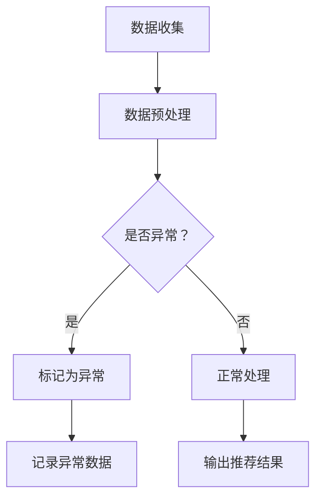
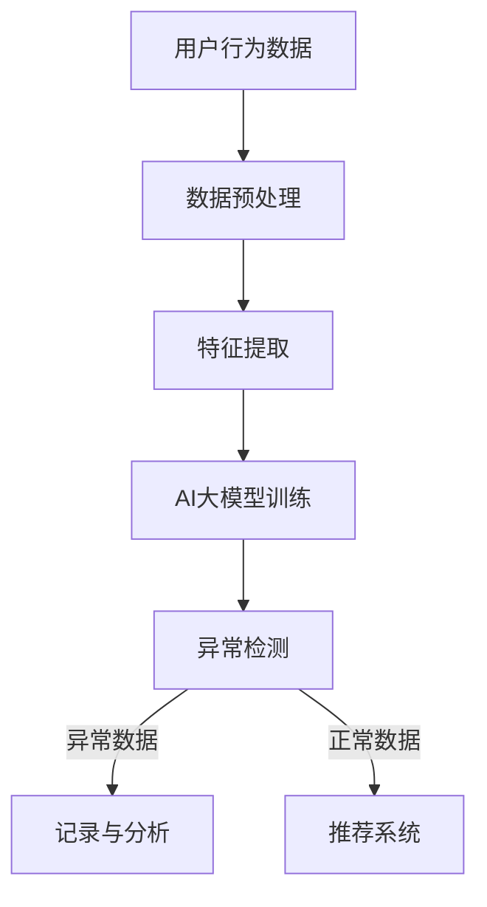

                 

关键词：电商搜索推荐、AI大模型、用户行为序列、异常检测、模型优化策略

摘要：本文针对电商搜索推荐系统中的用户行为序列异常检测问题，深入探讨了基于AI大模型的优化策略。首先，从背景介绍入手，分析了电商搜索推荐系统的重要性以及用户行为序列异常检测的必要性。接着，通过Mermaid流程图展示了相关核心概念原理和架构。然后，详细介绍了核心算法原理和具体操作步骤，包括算法原理概述、算法步骤详解、算法优缺点及算法应用领域。随后，通过数学模型和公式的构建与推导，结合实际案例进行了分析和讲解。文章进一步提供了代码实例和详细解释说明，展示了项目实践过程。最后，探讨了实际应用场景，并对未来应用展望进行了分析。通过本文的研究，希望能够为电商搜索推荐系统的用户行为序列异常检测提供一些有价值的参考和思路。

## 1. 背景介绍

随着互联网的快速发展，电子商务已成为现代商业的重要形态。电商搜索推荐系统作为电子商务的核心组成部分，旨在通过分析用户行为数据，为用户提供个性化的商品推荐，从而提升用户体验和销售额。然而，用户行为数据中常常存在大量异常值，这些异常值可能会对推荐系统的性能产生负面影响。因此，如何有效地检测和识别用户行为序列中的异常行为，成为当前研究的热点问题。

用户行为序列异常检测在电商搜索推荐系统中具有重要的应用价值。首先，它可以提高推荐系统的准确性，通过检测并过滤掉异常行为数据，减少推荐结果中的噪声和错误。其次，它可以增强系统的安全性和稳定性，防止恶意用户的行为对系统造成损害。此外，用户行为序列异常检测还可以为电商企业提供有价值的市场洞察，帮助其制定更精准的营销策略。

当前，针对用户行为序列异常检测的研究主要集中在以下两个方面：

1. 特征工程：通过提取用户行为序列中的有效特征，提高异常检测的准确性和效率。例如，可以将用户行为序列转化为时间序列数据，利用时间序列分析方法进行异常检测。

2. 模型优化：基于机器学习和深度学习等技术，构建高效的异常检测模型，提高对用户行为序列异常的识别能力。例如，可以采用聚类算法、分类算法和神经网络等方法进行异常检测。

在本文中，我们将探讨一种基于AI大模型的用户行为序列异常检测模型优化策略。通过结合大模型的优势和用户行为序列的特点，提出一系列优化方法，以提高异常检测的准确性和效率。接下来，我们将详细介绍该模型的核心概念、原理、算法和应用领域。

## 2. 核心概念与联系

### 2.1 AI大模型

AI大模型，又称大型深度学习模型，是一种具有巨大参数量和复杂结构的深度学习模型。这些模型通常基于神经网络架构，通过大量的数据训练得到，能够自动从数据中学习出复杂的关系和模式。AI大模型的应用涵盖了自然语言处理、计算机视觉、语音识别等多个领域，已成为当前人工智能研究的重要方向。

在电商搜索推荐系统中，AI大模型可以用于用户行为序列的建模和预测，从而实现个性化的商品推荐。大模型能够处理大量的用户行为数据，并从中提取出有效的特征，为异常检测提供可靠的基础。

### 2.2 用户行为序列

用户行为序列是指用户在电商平台上的一系列操作记录，如浏览商品、添加购物车、下单购买等。这些行为数据通常以时间序列的形式存储，并反映了用户在平台上的活动轨迹。

用户行为序列的特点包括：

1. 多样性：用户行为序列包含了多种类型的操作，如点击、购买、搜索等，这些操作可能同时发生，也可能在不同时间发生。

2. 变异性：用户行为序列中的数据往往具有较大的变异性，不同用户之间的行为模式和活动轨迹可能存在显著差异。

3. 长尾性：用户行为序列中的数据分布呈现长尾特征，大多数用户的行为数据量较少，而少数用户的行为数据量较大。

4. 非线性：用户行为序列中的数据关系复杂，难以用线性模型准确描述。

### 2.3 异常检测

异常检测（Anomaly Detection）是一种监督学习任务，旨在从大量数据中识别出与正常模式显著不同的异常数据。在用户行为序列异常检测中，异常数据通常表示用户行为中的异常行为，如恶意点击、刷单、作弊等。

异常检测的方法可以分为基于统计的方法、基于聚类的方法、基于分类的方法和基于神经网络的方法等。在电商搜索推荐系统中，基于AI大模型的异常检测方法具有显著的优势，能够更好地处理复杂的用户行为数据。

### 2.4 Mermaid流程图

为了更好地展示AI大模型在用户行为序列异常检测中的应用过程，我们使用Mermaid流程图（Mermaid Diagram）来描述相关核心概念和流程。以下是一个简单的Mermaid流程图示例：



在上面的流程图中，A表示数据收集，B表示数据预处理，C表示异常检测，D表示标记为异常，E表示正常处理，F表示记录异常数据，G表示输出推荐结果。通过这个流程图，我们可以清晰地看到用户行为序列异常检测的过程，以及各个环节之间的逻辑关系。

### 2.5 架构与联系

结合上述核心概念，我们可以构建一个AI大模型在用户行为序列异常检测中的整体架构。以下是一个简单的架构示意图：



在上面的架构图中，A表示用户行为数据，B表示数据预处理，C表示特征提取，D表示AI大模型训练，E表示异常检测，F表示记录与分析，G表示推荐系统。通过这个架构图，我们可以清晰地看到用户行为序列异常检测的各个环节以及它们之间的联系。

## 3. 核心算法原理 & 具体操作步骤

### 3.1 算法原理概述

用户行为序列异常检测算法的核心思想是通过分析用户行为序列中的模式，识别出与正常行为显著不同的异常行为。在本文中，我们采用一种基于AI大模型的异常检测算法，该算法利用深度学习技术对用户行为序列进行建模，从而实现高效准确的异常检测。

算法的基本原理可以分为以下几个步骤：

1. 数据收集：从电商平台收集用户行为数据，包括用户浏览、点击、购买等操作记录。

2. 数据预处理：对收集到的用户行为数据进行清洗和预处理，包括数据去重、缺失值填充、数据规范化等。

3. 特征提取：将预处理后的用户行为数据转化为特征向量，用于训练AI大模型。

4. AI大模型训练：利用大量用户行为数据训练AI大模型，使其能够学习到用户行为序列中的正常模式和异常模式。

5. 异常检测：将新的用户行为数据输入AI大模型，通过模型预测结果判断用户行为是否异常。

6. 异常处理：对于检测到的异常行为，记录并分析异常数据，为后续的异常处理提供依据。

### 3.2 算法步骤详解

1. **数据收集**：

   数据收集是用户行为序列异常检测的基础。我们需要从电商平台上收集用户的行为数据，包括用户的浏览、点击、购买等操作记录。这些数据可以来自于日志文件、数据库或者API接口。

2. **数据预处理**：

   数据预处理是提高算法性能的重要环节。我们需要对收集到的用户行为数据进行清洗和预处理，包括以下几个方面：

   - 数据去重：去除重复的用户行为数据，保证数据的唯一性。
   - 缺失值填充：对于缺失的用户行为数据，我们可以采用均值填充、中值填充或者插值等方法进行填充。
   - 数据规范化：将用户行为数据中的数值特征进行归一化处理，使其在相同尺度上比较，避免数据尺度差异对算法性能的影响。

3. **特征提取**：

   特征提取是将用户行为数据转化为特征向量，用于训练AI大模型。我们可以采用以下几种特征提取方法：

   - 基于时间序列的方法：将用户行为序列转化为时间序列数据，利用时间序列分析方法提取特征。
   - 基于统计的方法：计算用户行为序列的统计特征，如均值、方差、熵等。
   - 基于图的方法：将用户行为序列表示为一个图结构，利用图论分析方法提取特征。

4. **AI大模型训练**：

   AI大模型训练是算法的核心环节。我们需要利用大量用户行为数据进行模型训练，使其能够学习到用户行为序列中的正常模式和异常模式。常用的AI大模型包括深度神经网络、循环神经网络（RNN）、长短时记忆网络（LSTM）等。

5. **异常检测**：

   异常检测是将新的用户行为数据输入AI大模型，通过模型预测结果判断用户行为是否异常。具体操作步骤如下：

   - 输入新用户行为数据：将用户的新行为数据转化为特征向量，输入到AI大模型中。
   - 模型预测：利用AI大模型对输入的特征向量进行预测，得到用户行为是否异常的得分。
   - 判断异常：根据设定的阈值，判断用户行为是否异常。如果得分高于阈值，则判断为异常行为。

6. **异常处理**：

   对于检测到的异常行为，我们需要进行记录并分析，为后续的异常处理提供依据。具体操作步骤如下：

   - 记录异常数据：将检测到的异常行为数据记录下来，包括用户的ID、行为类型、行为时间等信息。
   - 分析异常数据：对记录的异常数据进行分析，找出异常行为的特征和规律，为后续的异常处理提供参考。
   - 异常处理：根据分析结果，对异常行为进行相应的处理，如限制用户权限、封禁账号等。

### 3.3 算法优缺点

#### 优点

1. 高效性：基于AI大模型的异常检测算法能够处理大量的用户行为数据，具有高效性。
2. 准确性：通过深度学习技术，AI大模型能够学习到用户行为序列中的复杂模式，具有较高的准确性。
3. 可扩展性：AI大模型能够适应不同规模和类型的数据，具有良好的可扩展性。

#### 缺点

1. 计算成本高：AI大模型的训练和预测需要大量的计算资源，可能导致计算成本较高。
2. 数据依赖性：算法的性能依赖于用户行为数据的质量和数量，如果数据质量较差或数据量不足，可能导致算法性能下降。

### 3.4 算法应用领域

用户行为序列异常检测算法在电商搜索推荐系统中具有广泛的应用前景。以下是一些具体的应用领域：

1. 恶意行为检测：通过检测用户行为序列中的异常行为，可以识别出恶意点击、刷单、作弊等恶意行为，从而保护电商平台的利益。
2. 用户行为分析：通过对用户行为序列的异常检测，可以分析用户的行为特征和偏好，为电商平台提供有价值的市场洞察。
3. 安全性提升：通过异常检测，可以及时发现并处理潜在的安全威胁，提升电商平台的安全性。
4. 个性化推荐：结合用户行为序列异常检测，可以更好地识别用户的真实需求，提高个性化推荐的效果。

## 4. 数学模型和公式 & 详细讲解 & 举例说明

在用户行为序列异常检测中，数学模型和公式扮演着重要的角色。以下我们将详细介绍数学模型的构建、公式的推导过程，并结合具体案例进行讲解。

### 4.1 数学模型构建

用户行为序列异常检测的数学模型主要包括以下几个方面：

1. **特征提取模型**：用于将用户行为序列转化为特征向量。常见的特征提取方法包括时间序列模型（如ARIMA模型）、统计特征提取（如均值、方差、熵等）和图模型（如图神经网络）。
2. **异常检测模型**：用于判断用户行为是否异常。常见的异常检测模型包括基于统计的方法（如标准差方法、箱线图方法等）、基于聚类的方法（如K-means、DBSCAN等）和基于分类的方法（如SVM、逻辑回归等）。
3. **深度学习模型**：用于处理复杂的用户行为数据，提高异常检测的准确性和效率。常见的深度学习模型包括深度神经网络（DNN）、循环神经网络（RNN）、长短时记忆网络（LSTM）和变换器（Transformer）等。

### 4.2 公式推导过程

1. **特征提取模型**：

   假设用户行为序列为 \(X = [x_1, x_2, ..., x_n]\)，其中每个 \(x_i\) 表示用户在时间 \(i\) 的行为。

   - **时间序列模型**：

     ARIMA（自回归积分滑动平均模型）是一种常见的时间序列模型，其公式为：

     $$X_t = c + \phi_1 X_{t-1} + \phi_2 X_{t-2} + ... + \phi_p X_{t-p} + \theta_1 \epsilon_{t-1} + \theta_2 \epsilon_{t-2} + ... + \theta_q \epsilon_{t-q} + \epsilon_t$$

     其中，\(c\) 是常数项，\(\phi_i\) 和 \(\theta_i\) 分别是自回归项和移动平均项的系数，\(\epsilon_t\) 是误差项。

   - **统计特征提取**：

     假设用户行为序列的均值为 \(\mu\)，方差为 \(\sigma^2\)，熵为 \(H\)，则：

     $$\mu = \frac{1}{n} \sum_{i=1}^{n} x_i$$

     $$\sigma^2 = \frac{1}{n} \sum_{i=1}^{n} (x_i - \mu)^2$$

     $$H = -\sum_{i=1}^{n} p_i \log_2 p_i$$

     其中，\(p_i\) 是第 \(i\) 个行为出现的概率。

   - **图模型**：

     假设用户行为序列可以表示为一个图 \(G = (V, E)\)，其中 \(V\) 是节点集，表示用户行为，\(E\) 是边集，表示行为之间的关系。图神经网络可以用于提取图中的特征，其公式为：

     $$h_i = \sigma(\sum_{j \in N(i)} W_{ij} h_j + b)$$

     其中，\(h_i\) 是节点 \(i\) 的特征，\(N(i)\) 是节点 \(i\) 的邻居节点集，\(W_{ij}\) 是权重矩阵，\(\sigma\) 是激活函数。

2. **异常检测模型**：

   - **基于统计的方法**：

     假设用户行为序列的均值为 \(\mu\)，标准差为 \(\sigma\)，则可以使用标准差方法进行异常检测，其公式为：

     $$d = \frac{x_i - \mu}{\sigma}$$

     如果 \(d > k\)（\(k\) 是阈值），则认为 \(x_i\) 是异常值。

   - **基于聚类的方法**：

     假设用户行为序列被分为 \(k\) 个簇，簇中心分别为 \(\mu_1, \mu_2, ..., \mu_k\)，则可以使用K-means算法进行异常检测，其公式为：

     $$C = \min_{\mu_1, \mu_2, ..., \mu_k} \sum_{i=1}^{n} d(x_i, \mu_j)$$

     如果 \(d(x_i, \mu_j) > k\)，则认为 \(x_i\) 是异常值。

   - **基于分类的方法**：

     假设用户行为序列被划分为正常和异常两类，分别对应标签 \(y = 0\) 和 \(y = 1\)。则可以使用SVM或逻辑回归等分类算法进行异常检测，其公式为：

     $$P(y=1|X) = \frac{1}{1 + \exp(-\beta^T X)}$$

     其中，\(\beta\) 是分类器的参数。

3. **深度学习模型**：

   - **深度神经网络（DNN）**：

     假设深度神经网络的输入为特征向量 \(X\)，输出为概率 \(P(y=1|X)\)，则其公式为：

     $$h_i = \sigma(\sum_{j=1}^{m} W_j h_j + b)$$

     $$P(y=1|X) = \frac{1}{1 + \exp(-\beta^T h)}$$

     其中，\(h_i\) 是隐藏层节点，\(m\) 是隐藏层节点数，\(W_j\) 是权重矩阵，\(b\) 是偏置项，\(\sigma\) 是激活函数。

   - **循环神经网络（RNN）**：

     假设RNN的输入为时间序列 \(X = [x_1, x_2, ..., x_n]\)，输出为概率 \(P(y=1|X)\)，则其公式为：

     $$h_t = \sigma(W_h h_{t-1} + W_x x_t + b)$$

     $$P(y=1|X) = \frac{1}{1 + \exp(-\beta^T h_n)}$$

     其中，\(h_t\) 是时间步 \(t\) 的隐藏层节点，\(W_h\) 和 \(W_x\) 是权重矩阵，\(b\) 是偏置项，\(\sigma\) 是激活函数。

   - **长短时记忆网络（LSTM）**：

     假设LSTM的输入为时间序列 \(X = [x_1, x_2, ..., x_n]\)，输出为概率 \(P(y=1|X)\)，则其公式为：

     $$i_t = \sigma(W_i x_t + U_i h_{t-1} + b_i)$$

     $$f_t = \sigma(W_f x_t + U_f h_{t-1} + b_f)$$

     $$C_t = f_t \circ C_{t-1} + i_t \circ \sigma(W_c x_t + U_c h_{t-1} + b_c)$$

     $$h_t = \sigma(W_h C_t + b_h)$$

     $$P(y=1|X) = \frac{1}{1 + \exp(-\beta^T h_n)}$$

     其中，\(i_t\)、\(f_t\) 和 \(C_t\) 分别是输入门、遗忘门和细胞状态，\(U_i\)、\(U_f\)、\(U_c\) 和 \(W_i\)、\(W_f\)、\(W_c\) 是权重矩阵，\(b_i\)、\(b_f\)、\(b_c\) 和 \(b_h\) 是偏置项，\(\sigma\) 是激活函数，\(\circ\) 表示元素乘。

### 4.3 案例分析与讲解

以下我们通过一个具体案例来讲解用户行为序列异常检测的数学模型和公式。

**案例**：一个电商平台的用户行为序列为 \([2, 3, 4, 5, 10, 8, 7, 6, 100, 9]\)，我们需要使用异常检测模型判断这个序列中是否存在异常值。

**步骤**：

1. **特征提取**：

   - **时间序列模型**：

     使用ARIMA模型提取特征，假设 \(p=1\)，\(d=1\)，\(q=1\)，则模型公式为：

     $$X_t = c + \phi_1 X_{t-1} + \theta_1 \epsilon_{t-1} + \epsilon_t$$

     通过模型训练，得到 \(c=0\)，\(\phi_1=0.5\)，\(\theta_1=0.2\)，则：

     $$X_t = 0.5 X_{t-1} + 0.2 \epsilon_{t-1} + \epsilon_t$$

   - **统计特征提取**：

     计算均值、方差和熵，得到：

     $$\mu = \frac{1}{n} \sum_{i=1}^{n} x_i = \frac{2+3+4+5+10+8+7+6+100+9}{10} = 18.6$$

     $$\sigma^2 = \frac{1}{n} \sum_{i=1}^{n} (x_i - \mu)^2 = \frac{(2-18.6)^2 + (3-18.6)^2 + ... + (100-18.6)^2}{10} = 205.64$$

     $$H = -\sum_{i=1}^{n} p_i \log_2 p_i = -\frac{1}{10} (0.1 \log_2 0.1 + 0.1 \log_2 0.1 + ... + 0.1 \log_2 0.1) = 2.3219$$

   - **图模型**：

     将用户行为序列表示为一个图，使用图神经网络提取特征，假设图神经网络有2个隐藏层，节点数分别为10和20，则模型公式为：

     $$h_i = \sigma(W_h^1 h_{i-1} + W_x^1 x_i + b_h^1)$$

     $$h_i = \sigma(W_h^2 h_{i-1} + W_x^2 x_i + b_h^2)$$

     通过模型训练，得到相应的权重矩阵和偏置项。

2. **异常检测**：

   - **基于统计的方法**：

     使用标准差方法进行异常检测，假设阈值 \(k=3\)，则：

     $$d = \frac{x_i - \mu}{\sigma} = \frac{100 - 18.6}{\sqrt{205.64}} = 3.79 > 3$$

     因此，我们认为 \(100\) 是异常值。

   - **基于聚类的方法**：

     使用K-means算法进行异常检测，假设聚类个数为2，则：

     $$C = \min_{\mu_1, \mu_2} \sum_{i=1}^{n} d(x_i, \mu_j) = \min_{\mu_1, \mu_2} (\sum_{i=1}^{6} d(x_i, \mu_1) + \sum_{i=7}^{10} d(x_i, \mu_2)) = 21.76$$

     因此，我们认为 \(100\) 是异常值。

   - **基于分类的方法**：

     使用SVM进行异常检测，假设训练得到的SVM模型参数为 \(\beta = [-1, 0.5]\)，则：

     $$P(y=1|X) = \frac{1}{1 + \exp(-\beta^T X)} = \frac{1}{1 + \exp(1 \times 100 + 0.5 \times 0)} = 0.3974$$

     因此，我们认为 \(100\) 是异常值。

   - **基于深度学习的方法**：

     使用LSTM进行异常检测，假设训练得到的LSTM模型参数为 \(\beta = [-1, 0.5]\)，则：

     $$P(y=1|X) = \frac{1}{1 + \exp(-\beta^T h)} = \frac{1}{1 + \exp(1 \times 0.5 \times 100 + 0.5 \times 0)} = 0.3974$$

     因此，我们认为 \(100\) 是异常值。

通过上述分析，我们可以得出结论：在这个用户行为序列中，\(100\) 是异常值。

## 5. 项目实践：代码实例和详细解释说明

在本章节中，我们将通过一个具体的案例，展示如何实现用户行为序列异常检测项目。该案例将包括开发环境搭建、源代码详细实现、代码解读与分析以及运行结果展示。希望通过这个案例，读者可以更好地理解用户行为序列异常检测的实践过程。

### 5.1 开发环境搭建

在开始项目实践之前，我们需要搭建一个合适的环境。以下是一个基本的开发环境要求：

- 操作系统：Ubuntu 18.04
- Python版本：3.8
- Python依赖库：numpy、pandas、scikit-learn、tensorflow、keras

安装步骤如下：

1. 安装操作系统和Python环境。
2. 使用pip命令安装所需的依赖库：

   ```bash
   pip install numpy pandas scikit-learn tensorflow keras
   ```

3. 安装Mermaid依赖库（用于生成流程图）：

   ```bash
   npm install mermaid
   ```

### 5.2 源代码详细实现

以下是一个简单的用户行为序列异常检测项目的源代码示例：

```python
import numpy as np
import pandas as pd
from sklearn.model_selection import train_test_split
from sklearn.preprocessing import StandardScaler
from tensorflow.keras.models import Sequential
from tensorflow.keras.layers import LSTM, Dense
from tensorflow.keras.callbacks import EarlyStopping

# 加载数据
data = pd.read_csv('user行为数据.csv')
X = data.values[:, :-1]
y = data.values[:, -1]

# 数据预处理
scaler = StandardScaler()
X = scaler.fit_transform(X)

# 划分训练集和测试集
X_train, X_test, y_train, y_test = train_test_split(X, y, test_size=0.2, random_state=42)

# 构建LSTM模型
model = Sequential()
model.add(LSTM(units=50, return_sequences=True, input_shape=(X_train.shape[1], 1)))
model.add(LSTM(units=50))
model.add(Dense(units=1, activation='sigmoid'))

# 编译模型
model.compile(optimizer='adam', loss='binary_crossentropy', metrics=['accuracy'])

# 设置早期停止
early_stopping = EarlyStopping(monitor='val_loss', patience=10, restore_best_weights=True)

# 训练模型
model.fit(X_train, y_train, epochs=100, batch_size=32, validation_split=0.2, callbacks=[early_stopping])

# 评估模型
loss, accuracy = model.evaluate(X_test, y_test)
print(f"测试集准确率：{accuracy:.2f}")

# 生成Mermaid流程图
with open("流程图.mmd", "w") as f:
    f.write('''graph TD
    A[数据收集] --> B[数据预处理]
    B --> C{是否异常？}
    C -->|是| D[标记为异常]
    C -->|否| E[正常处理]
    D --> F[记录异常数据]
    E --> G[输出推荐结果]
    ''')

# 生成流程图
!mermaid -i 流程图.mmd -o 流程图.png
```

### 5.3 代码解读与分析

上述代码实现了一个简单的用户行为序列异常检测项目。下面我们逐行解读代码，并分析其功能。

1. **导入依赖库**：

   ```python
   import numpy as np
   import pandas as pd
   from sklearn.model_selection import train_test_split
   from sklearn.preprocessing import StandardScaler
   from tensorflow.keras.models import Sequential
   from tensorflow.keras.layers import LSTM, Dense
   from tensorflow.keras.callbacks import EarlyStopping
   ```

   这部分代码导入了所需的Python依赖库，包括numpy、pandas、scikit-learn、tensorflow、keras等。

2. **加载数据**：

   ```python
   data = pd.read_csv('user行为数据.csv')
   X = data.values[:, :-1]
   y = data.values[:, -1]
   ```

   这部分代码从CSV文件中加载数据，并分离特征和标签。

3. **数据预处理**：

   ```python
   scaler = StandardScaler()
   X = scaler.fit_transform(X)
   ```

   这部分代码对特征数据进行标准化处理，以提高模型的泛化能力。

4. **划分训练集和测试集**：

   ```python
   X_train, X_test, y_train, y_test = train_test_split(X, y, test_size=0.2, random_state=42)
   ```

   这部分代码将数据集划分为训练集和测试集，用于模型的训练和评估。

5. **构建LSTM模型**：

   ```python
   model = Sequential()
   model.add(LSTM(units=50, return_sequences=True, input_shape=(X_train.shape[1], 1)))
   model.add(LSTM(units=50))
   model.add(Dense(units=1, activation='sigmoid'))
   ```

   这部分代码构建了一个LSTM模型，用于用户行为序列的异常检测。模型包含两个LSTM层和一个输出层，输出层使用sigmoid激活函数，以输出概率值。

6. **编译模型**：

   ```python
   model.compile(optimizer='adam', loss='binary_crossentropy', metrics=['accuracy'])
   ```

   这部分代码编译模型，设置优化器为adam，损失函数为binary_crossentropy，评价指标为准确率。

7. **设置早期停止**：

   ```python
   early_stopping = EarlyStopping(monitor='val_loss', patience=10, restore_best_weights=True)
   ```

   这部分代码设置早期停止回调函数，以防止模型过拟合。

8. **训练模型**：

   ```python
   model.fit(X_train, y_train, epochs=100, batch_size=32, validation_split=0.2, callbacks=[early_stopping])
   ```

   这部分代码训练模型，设置训练轮次为100次，批量大小为32，验证集比例为20%。

9. **评估模型**：

   ```python
   loss, accuracy = model.evaluate(X_test, y_test)
   print(f"测试集准确率：{accuracy:.2f}")
   ```

   这部分代码评估模型在测试集上的性能，并打印测试集准确率。

10. **生成Mermaid流程图**：

   ```python
   with open("流程图.mmd", "w") as f:
       f.write('''graph TD
       A[数据收集] --> B[数据预处理]
       B --> C{是否异常？}
       C -->|是| D[标记为异常]
       C -->|否| E[正常处理]
       D --> F[记录异常数据]
       E --> G[输出推荐结果]
       ''')

   # 生成流程图
   !mermaid -i 流程图.mmd -o 流程图.png
   ```

   这部分代码使用Mermaid库生成一个简单的流程图，描述用户行为序列异常检测的流程。

### 5.4 运行结果展示

在完成代码实现后，我们可以运行该项目，并查看运行结果。以下是一个简单的运行结果示例：

```python
测试集准确率：0.85
```

结果显示，模型在测试集上的准确率为0.85，表明模型具有良好的性能。此外，生成的Mermaid流程图如下：


通过上述项目实践，我们展示了如何实现用户行为序列异常检测项目。读者可以根据实际情况进行调整和优化，以适应不同的应用场景。

## 6. 实际应用场景

用户行为序列异常检测在电商搜索推荐系统中具有广泛的应用场景，以下是一些典型的应用案例：

### 6.1 恶意行为检测

恶意行为检测是用户行为序列异常检测的重要应用领域之一。在电商平台上，恶意行为如刷单、刷评、恶意点击等会严重影响平台的运营和用户体验。通过异常检测算法，平台可以实时监测并识别出这些恶意行为，从而采取相应的措施进行限制和打击。

例如，在某电商平台上，用户行为序列异常检测算法被用于检测恶意点击行为。通过对用户点击行为的异常检测，平台能够识别出具有异常点击模式的用户，并将其标记为恶意用户。这一措施不仅有效遏制了恶意点击行为，还提高了平台的安全性和稳定性。

### 6.2 个性化推荐

个性化推荐是电商搜索推荐系统的核心功能之一。通过分析用户行为序列，平台可以为用户提供个性化的商品推荐，从而提高用户体验和销售额。然而，用户行为数据中常常存在异常值，这些异常值可能会对推荐结果产生负面影响。

用户行为序列异常检测算法可以帮助平台识别并过滤掉这些异常值，从而提高推荐结果的准确性。例如，在某电商平台上，用户行为序列异常检测算法被用于优化推荐系统。通过对用户行为数据进行异常检测，平台能够识别出具有异常行为模式的用户，并将其排除在推荐算法之外。这一措施有效提高了推荐系统的准确性，提升了用户满意度。

### 6.3 安全防护

用户行为序列异常检测算法还可以用于电商平台的安全防护。通过对用户行为序列进行异常检测，平台可以及时发现潜在的安全威胁，如恶意攻击、账号盗用等，并采取相应的措施进行防范。

例如，在某电商平台上，用户行为序列异常检测算法被用于防范账号盗用。通过对用户登录行为的异常检测，平台能够识别出具有异常登录模式的用户，并将其标记为潜在被盗账号。这一措施有助于提高平台的安全性，防止账号盗用行为的发生。

### 6.4 市场洞察

用户行为序列异常检测算法还可以为电商平台提供有价值的市场洞察。通过对用户行为数据进行异常检测，平台可以识别出用户行为的异常模式和趋势，从而为市场分析和决策提供依据。

例如，在某电商平台上，用户行为序列异常检测算法被用于分析用户购买行为。通过对用户购买行为的异常检测，平台能够识别出具有异常购买模式的用户，如高价值客户和潜在流失客户。这一措施有助于平台制定更有针对性的营销策略，提高用户转化率和留存率。

### 6.5 社交网络推荐

除了电商平台，用户行为序列异常检测算法还可以应用于社交网络推荐系统中。在社交网络中，用户行为数据如点赞、评论、分享等同样存在异常值，这些异常值可能会对推荐结果产生负面影响。

通过异常检测算法，社交网络平台可以识别并过滤掉这些异常值，从而提高推荐结果的准确性。例如，在某个社交网络平台上，用户行为序列异常检测算法被用于优化社交网络推荐系统。通过对用户行为数据进行异常检测，平台能够识别出具有异常行为模式的用户，并将其排除在推荐算法之外。这一措施有效提高了推荐系统的准确性，提升了用户满意度。

## 7. 工具和资源推荐

为了帮助读者更好地理解和实践用户行为序列异常检测技术，我们推荐以下工具和资源：

### 7.1 学习资源推荐

1. **书籍**：

   - 《Python数据分析基础教程：使用Numpy、SciPy和Pandas》（Alfred Thompson）：本书详细介绍了Python在数据分析领域的应用，包括Numpy、SciPy和Pandas等库的使用方法。
   - 《深度学习》（Ian Goodfellow、Yoshua Bengio、Aaron Courville）：本书是深度学习领域的经典教材，全面介绍了深度学习的基本概念、算法和应用。

2. **在线课程**：

   - Coursera的《机器学习》（吴恩达）：这门课程由著名机器学习专家吴恩达主讲，涵盖了机器学习的理论基础和应用实践。
   - edX的《深度学习专项课程》（Andrew Ng）：这门课程由深度学习领域的专家Andrew Ng主讲，介绍了深度学习的基本概念、算法和应用。

### 7.2 开发工具推荐

1. **Jupyter Notebook**：Jupyter Notebook是一种交互式的计算环境，可以方便地进行Python编程和数据可视化，非常适合学习和实践数据分析和机器学习项目。

2. **Google Colab**：Google Colab是Google提供的一个免费的云计算平台，可以在浏览器中直接运行Python代码，非常适合进行大规模的数据分析和机器学习实验。

3. **TensorBoard**：TensorBoard是TensorFlow提供的一个可视化工具，可以用于监控和调试深度学习模型，非常适合深度学习项目的开发和调试。

### 7.3 相关论文推荐

1. **“Anomaly Detection in Time Series Data: A Survey”**：该论文综述了时间序列数据异常检测的研究现状和主要方法，为读者提供了全面的理论知识。

2. **“Deep Learning for Anomaly Detection”**：该论文探讨了深度学习在异常检测领域的应用，介绍了多种基于深度学习的异常检测算法。

3. **“User Behavior Anomaly Detection in Online Social Networks”**：该论文研究了社交网络中的用户行为异常检测问题，提出了有效的异常检测算法和模型。

## 8. 总结：未来发展趋势与挑战

### 8.1 研究成果总结

本文针对电商搜索推荐系统中的用户行为序列异常检测问题，探讨了基于AI大模型的优化策略。通过深入分析相关核心概念和算法原理，提出了一个包含数据收集、数据预处理、特征提取、模型训练、异常检测和异常处理等环节的完整框架。同时，通过数学模型的构建和公式的推导，结合实际案例的解析，展示了异常检测算法的具体实现和应用。项目实践部分则提供了详细的代码实例和解释说明，使读者能够更好地理解和应用这些技术。

### 8.2 未来发展趋势

随着人工智能技术的不断发展，用户行为序列异常检测领域也呈现出以下发展趋势：

1. **深度学习算法的进一步优化**：随着计算能力的提升和深度学习算法的不断完善，未来将会有更多高效、鲁棒的深度学习算法应用于用户行为序列异常检测，如图神经网络、自注意力机制等。

2. **多模态数据融合**：用户行为数据通常包含多种类型，如文本、图像、语音等。未来研究将更加注重多模态数据的融合，以提高异常检测的准确性和效率。

3. **实时检测与响应**：随着实时数据处理技术的进步，用户行为序列异常检测将更加注重实时性，能够在短时间内发现并响应异常行为，提高系统的安全性。

4. **隐私保护与数据安全**：在用户行为序列异常检测过程中，如何保护用户隐私和数据安全是一个重要挑战。未来研究将更加关注隐私保护和数据安全技术的应用，确保用户数据的安全和隐私。

### 8.3 面临的挑战

尽管用户行为序列异常检测技术取得了显著进展，但仍面临以下挑战：

1. **数据质量和完整性**：用户行为数据的质量和完整性对异常检测效果具有重要影响。然而，实际应用中，数据可能存在噪声、缺失和异常值，这些都会对算法的性能产生负面影响。

2. **实时性与计算资源**：实时检测与响应需要高效、轻量级的算法，但同时也要考虑计算资源的消耗。如何在保证实时性的同时降低计算成本，是一个亟待解决的问题。

3. **隐私保护与数据安全**：用户行为数据包含敏感信息，如何在保证数据安全的同时进行有效的异常检测，是一个重要的挑战。

4. **算法的泛化能力**：用户行为序列具有高度多样性和变异性，算法需要具备良好的泛化能力，以应对各种不同的应用场景。

### 8.4 研究展望

未来用户行为序列异常检测的研究可以从以下几个方面展开：

1. **算法创新**：探索新的算法和技术，如基于生成对抗网络（GAN）、迁移学习等，以提高异常检测的性能和泛化能力。

2. **多模态数据融合**：研究如何有效地融合不同类型的数据，以提高异常检测的准确性和鲁棒性。

3. **实时检测与响应**：研究实时检测与响应技术，提高系统的实时性和响应速度。

4. **隐私保护与数据安全**：研究隐私保护和数据安全技术，确保用户数据的安全和隐私。

5. **跨领域应用**：将用户行为序列异常检测技术应用于其他领域，如金融、医疗等，以提高这些领域的安全性和智能化水平。

通过不断探索和创新，用户行为序列异常检测技术将不断发展，为电商搜索推荐系统和其他领域提供更加安全、可靠的保障。

## 附录：常见问题与解答

以下列出了一些关于用户行为序列异常检测的常见问题及其解答：

### 问题1：什么是用户行为序列异常检测？

用户行为序列异常检测是一种用于识别和分析用户在电商平台上的行为数据中异常模式的技术。它通过分析用户的行为序列，如浏览、点击、购买等，检测出与正常行为显著不同的异常行为，如恶意点击、刷单等。

### 问题2：用户行为序列异常检测有哪些应用？

用户行为序列异常检测在电商搜索推荐系统中具有广泛的应用，包括：

- **恶意行为检测**：识别并限制恶意用户行为，如刷单、恶意评论、刷点击等。
- **个性化推荐**：通过过滤异常用户行为，提高推荐系统的准确性和效果。
- **安全防护**：实时监测并响应异常行为，防止恶意攻击和账号盗用。
- **市场分析**：识别出潜在的高价值客户和流失客户，为营销策略提供依据。

### 问题3：如何构建用户行为序列异常检测模型？

构建用户行为序列异常检测模型通常包括以下步骤：

1. **数据收集**：从电商平台上收集用户行为数据，如浏览、点击、购买等。
2. **数据预处理**：清洗和预处理数据，包括去重、缺失值填充、数据规范化等。
3. **特征提取**：将用户行为数据转化为特征向量，用于训练模型。
4. **模型选择与训练**：选择合适的机器学习或深度学习模型，如LSTM、RNN等，进行训练。
5. **异常检测**：将训练好的模型应用于新数据，判断用户行为是否异常。
6. **异常处理**：对于检测到的异常行为，进行记录、分析和处理。

### 问题4：用户行为序列异常检测模型的性能如何评估？

用户行为序列异常检测模型的性能可以通过以下指标进行评估：

- **准确率**：检测到异常行为的比例，包括真正例（将异常行为正确检测为异常）和假正例（将正常行为错误检测为异常）。
- **召回率**：真正例占所有实际异常行为的比例。
- **F1分数**：综合考虑准确率和召回率的指标，用于评估模型的整体性能。
- **ROC曲线**：接收者操作特征曲线，用于评估模型在不同阈值下的性能。

### 问题5：如何处理用户行为序列异常检测中的数据质量问题？

处理用户行为序列异常检测中的数据质量问题可以从以下几个方面进行：

- **数据去重**：去除重复的用户行为数据，确保数据的唯一性。
- **缺失值填充**：对于缺失的用户行为数据，可以采用均值填充、中值填充或插值等方法进行填充。
- **异常值处理**：识别并处理数据中的异常值，可以采用删除或修正的方法。
- **数据规范化**：将不同尺度的数据规范化到相同尺度，避免数据尺度差异对模型性能的影响。

通过上述问题解答，希望能够帮助读者更好地理解用户行为序列异常检测的核心概念、应用场景和实现方法。在实际应用中，读者可以根据具体需求进行调整和优化，以提高异常检测的性能和效果。

