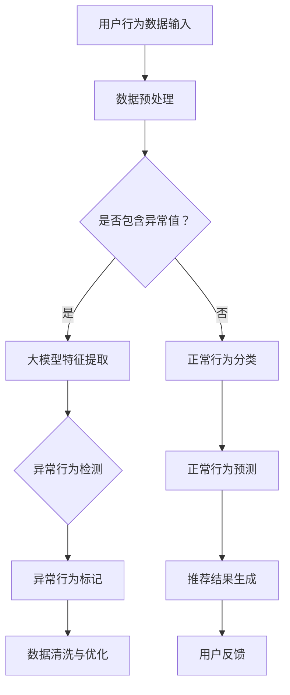
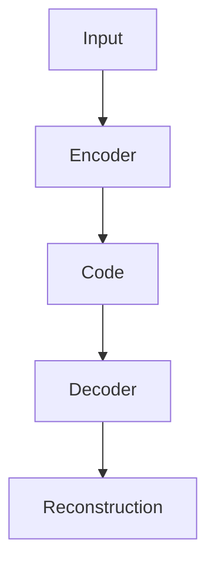

                 

## 1. 背景介绍

随着互联网技术的飞速发展，电子商务行业逐渐成为全球经济增长的重要引擎。在电商平台的运营过程中，用户行为数据分析是一项至关重要的工作。通过对用户行为数据的深入挖掘和分析，电商平台可以更好地理解用户需求，优化用户体验，提高销售转化率。

在电商搜索推荐系统中，用户行为序列是一个核心的数据源。用户行为序列包括用户在电商平台上的浏览、搜索、购买等操作记录，这些记录可以反映用户的需求和偏好。然而，用户行为数据往往具有大量噪声和异常值，这些异常行为可能来源于恶意用户、数据错误或者用户行为模式的改变。异常行为的检测对于电商平台来说具有重要意义，它可以帮助企业识别潜在的风险，提高数据质量，优化推荐系统。

传统的异常检测方法主要基于统计学习和规则匹配，这些方法往往存在检测精度不高、实时性差等问题。随着人工智能技术的不断发展，特别是大规模预训练模型（Large-scale Pre-trained Models，简称LPMs）的兴起，为用户行为序列异常检测带来了新的可能性。本文将介绍一种基于AI大模型的用户行为序列异常检测模型，并探讨其在电商搜索推荐系统中的应用。

<|assistant|>## 2. 核心概念与联系

### 2.1 大模型基本概念

大模型（Large-scale Pre-trained Models，LPMs）是指通过海量数据训练得到的高容量神经网络模型。这些模型通常具有数亿甚至数十亿的参数，能够捕捉到数据中的复杂模式和关联性。大模型的出现，标志着人工智能领域的一个新里程碑，使得计算机能够在特定任务上达到甚至超过人类水平。

大模型的基本原理是利用深度学习技术，通过多层神经网络将输入数据映射到输出数据。模型在训练过程中，通过不断调整网络参数，使得输出结果能够最大程度地符合训练数据中的真实分布。大模型的优点包括：

- 高效性：大模型能够处理大量的数据，提高计算效率。
- 强泛化能力：大模型能够从海量数据中学习到通用的特征表示，从而在新的任务上表现良好。
- 灵活性：大模型可以适应多种不同的任务，实现多任务学习。

### 2.2 用户行为序列概念

用户行为序列是指用户在电商平台上的一系列操作记录，包括浏览、搜索、购买等。这些记录可以反映用户的需求和偏好，是电商平台进行个性化推荐和异常检测的重要数据源。用户行为序列的特点包括：

- 时序性：用户行为具有时间顺序，不同时间点的行为可以反映用户状态的演变。
- 多样性：用户行为种类繁多，包括浏览、搜索、点击、购买等。
- 不确定性：用户行为数据中存在大量的噪声和异常值，需要通过有效的方法进行检测和过滤。

### 2.3 大模型与用户行为序列的关系

大模型在用户行为序列异常检测中的应用主要体现在以下几个方面：

- 特征提取：大模型能够从原始用户行为数据中提取出高层次的、具有代表性的特征，为异常检测提供有效的数据支撑。
- 异常检测：通过大模型训练得到的特征表示，可以用于检测用户行为序列中的异常行为，提高检测的准确性和实时性。
- 个性化推荐：大模型可以根据用户行为序列，生成个性化的推荐结果，优化用户体验。

### 2.4 Mermaid 流程图

以下是用户行为序列异常检测模型的Mermaid流程图，展示了大模型在各个阶段的应用：



在该流程图中，用户行为数据首先经过预处理，然后通过大模型进行特征提取。接着，大模型对提取的特征进行异常行为检测和正常行为分类。最后，基于检测到的异常行为和正常行为，生成推荐结果，并进行数据清洗与优化，以提供更好的用户体验。

<|assistant|>## 3. 核心算法原理 & 具体操作步骤

### 3.1 算法原理概述

用户行为序列异常检测模型的核心原理是基于大规模预训练模型（Large-scale Pre-trained Models，LPMs）对用户行为数据进行特征提取和异常行为检测。具体来说，算法分为以下几个步骤：

1. **数据预处理**：对原始的用户行为数据进行清洗、去噪和格式化，使其适合模型训练。
2. **特征提取**：利用大规模预训练模型提取用户行为数据中的高维特征表示，这些特征能够捕捉到用户行为的潜在模式和关联性。
3. **异常行为检测**：基于提取的特征表示，构建异常检测模型，对用户行为序列进行实时检测，识别异常行为。
4. **异常行为标记**：将检测到的异常行为进行标记，以便后续的数据清洗和处理。
5. **数据清洗与优化**：对异常行为标记的数据进行清洗和优化，提高数据质量和模型性能。

### 3.2 算法步骤详解

#### 3.2.1 数据预处理

数据预处理是用户行为序列异常检测的基础步骤，主要包括以下内容：

- **数据清洗**：去除用户行为数据中的缺失值、重复值和异常值，保证数据的完整性。
- **数据去噪**：利用滤波器或其他算法去除用户行为数据中的噪声，提高数据质量。
- **数据格式化**：将用户行为数据转换为统一的数据格式，以便后续的特征提取和模型训练。

#### 3.2.2 特征提取

特征提取是用户行为序列异常检测的关键步骤，通过大规模预训练模型实现。具体操作步骤如下：

- **模型选择**：选择一个适用于用户行为数据的大规模预训练模型，如BERT、GPT等。
- **数据输入**：将预处理后的用户行为数据输入到预训练模型中，进行特征提取。
- **特征融合**：将不同时间点的用户行为数据进行融合，生成高维的特征表示。

#### 3.2.3 异常行为检测

异常行为检测是用户行为序列异常检测模型的核心，通过以下步骤实现：

- **模型构建**：基于提取的高维特征表示，构建一个异常检测模型，如自编码器、支持向量机等。
- **模型训练**：使用正常用户行为数据对异常检测模型进行训练，使其能够识别正常行为和异常行为。
- **模型评估**：使用异常用户行为数据对模型进行评估，调整模型参数，提高检测性能。

#### 3.2.4 异常行为标记

异常行为标记是对检测到的异常行为进行标记，以便后续的数据清洗和处理。具体操作步骤如下：

- **异常行为识别**：利用训练好的异常检测模型，对用户行为序列进行实时检测，识别异常行为。
- **行为标记**：将检测到的异常行为进行标记，记录其发生的时间、类型等信息。

#### 3.2.5 数据清洗与优化

数据清洗与优化是提高模型性能和用户体验的关键步骤。具体操作步骤如下：

- **数据清洗**：对异常行为标记的数据进行清洗，去除噪声和异常值。
- **数据优化**：对清洗后的数据进行优化，如调整特征权重、去除冗余特征等，以提高模型性能。

### 3.3 算法优缺点

#### 3.3.1 优点

- **高效性**：大规模预训练模型能够快速处理大量用户行为数据，提高计算效率。
- **强泛化能力**：大模型能够从海量数据中学习到通用的特征表示，适应不同的应用场景。
- **实时性**：基于实时检测的算法能够快速响应用户行为变化，提高用户体验。

#### 3.3.2 缺点

- **计算资源消耗大**：大规模预训练模型需要大量的计算资源，对硬件要求较高。
- **数据质量要求高**：算法性能受数据质量影响较大，需要保证数据清洗和预处理的质量。

### 3.4 算法应用领域

用户行为序列异常检测模型在电商搜索推荐系统中的应用非常广泛，主要包括以下几个方面：

- **恶意用户检测**：识别和阻止恶意用户的异常行为，如刷单、作弊等。
- **用户行为分析**：通过异常检测模型，分析用户行为的异常变化，挖掘潜在的用户需求。
- **个性化推荐**：基于异常检测模型，为用户提供更加精准的个性化推荐结果。
- **数据质量控制**：通过异常行为标记和清洗，提高用户行为数据的质量和可信度。

<|assistant|>## 4. 数学模型和公式 & 详细讲解 & 举例说明

### 4.1 数学模型构建

用户行为序列异常检测模型的数学模型构建主要涉及以下几个方面：

1. **用户行为数据表示**：将用户行为数据转化为数学形式，如序列、矩阵等。
2. **特征提取模型**：使用大规模预训练模型对用户行为数据提取特征表示。
3. **异常检测模型**：构建异常检测模型，用于识别用户行为序列中的异常行为。

#### 4.1.1 用户行为数据表示

假设用户行为数据集为 $D = \{x_1, x_2, ..., x_n\}$，其中 $x_i$ 表示第 $i$ 个用户的行为序列，行为序列可以表示为一个向量：

$$
x_i = [x_{i1}, x_{i2}, ..., x_{it}], \quad t \text{ 为时间步长}
$$

其中 $x_{it}$ 表示用户在第 $t$ 个时间步的行为，如浏览、搜索、购买等。

#### 4.1.2 特征提取模型

大规模预训练模型（如BERT、GPT等）可以用于提取用户行为数据中的高维特征表示。假设预训练模型为 $M$，其输入为用户行为序列 $x_i$，输出为特征向量 $h_i$：

$$
h_i = M(x_i)
$$

特征向量 $h_i$ 能够捕捉到用户行为的潜在模式和关联性。

#### 4.1.3 异常检测模型

构建异常检测模型，用于识别用户行为序列中的异常行为。假设异常检测模型为 $D$，其输入为特征向量 $h_i$，输出为异常概率 $p_i$：

$$
p_i = D(h_i)
$$

若 $p_i > \theta$（$\theta$ 为设定的阈值），则认为用户行为 $x_i$ 为异常行为。

### 4.2 公式推导过程

用户行为序列异常检测模型的公式推导主要涉及特征提取模型和异常检测模型的构建。以下是具体推导过程：

#### 4.2.1 特征提取模型

假设大规模预训练模型为BERT，其输入为用户行为序列 $x_i$，输出为特征向量 $h_i$。BERT模型的输出可以通过以下公式表示：

$$
h_i = \text{BERT}(x_i) = \text{Transformer}(x_i) \cdot W_O
$$

其中，$\text{Transformer}$ 表示BERT的变换器层，$W_O$ 为输出层的权重矩阵。

#### 4.2.2 异常检测模型

假设异常检测模型为自编码器（Autoencoder），其结构如图1所示。自编码器由编码器（Encoder）和解码器（Decoder）组成，编码器将输入数据压缩为一个低维特征向量，解码器尝试重构原始数据。

图1：自编码器结构示意图



自编码器的损失函数可以表示为：

$$
L = \frac{1}{n} \sum_{i=1}^{n} \sum_{t=1}^{T} (\hat{x}_{it} - x_{it})^2
$$

其中，$n$ 为训练数据样本数，$T$ 为时间步长，$\hat{x}_{it}$ 为解码器输出，$x_{it}$ 为原始输入。

为了使自编码器能够识别异常行为，可以对损失函数进行改进，加入正则项：

$$
L = \frac{1}{n} \sum_{i=1}^{n} \sum_{t=1}^{T} (\hat{x}_{it} - x_{it})^2 + \lambda \cdot \frac{1}{n} \sum_{i=1}^{n} \sum_{t=1}^{T} \log P(x_{it} | \hat{x}_{it})
$$

其中，$\lambda$ 为调节参数，$P(x_{it} | \hat{x}_{it})$ 为解码器输出的概率分布。

#### 4.2.3 异常行为检测

基于自编码器的损失函数，可以推导出异常行为的概率：

$$
p_i = \frac{1}{Z} \exp \left( -\frac{1}{n} \sum_{t=1}^{T} (\hat{x}_{it} - x_{it})^2 - \lambda \cdot \log P(x_{it} | \hat{x}_{it}) \right)
$$

其中，$Z$ 为规范化常数。

若 $p_i > \theta$，则认为用户行为 $x_i$ 为异常行为。

### 4.3 案例分析与讲解

#### 4.3.1 案例背景

某电商平台希望通过用户行为序列异常检测模型，识别和阻止恶意用户的异常行为，以提高平台的安全性和用户体验。

#### 4.3.2 数据集

电商平台提供了以下用户行为数据集：

- **正常用户行为数据**：包括用户在电商平台上的浏览、搜索、购买等行为记录。
- **异常用户行为数据**：包括刷单、作弊等恶意用户的异常行为记录。

#### 4.3.3 数据预处理

对用户行为数据进行清洗、去噪和格式化，去除缺失值、重复值和异常值，将用户行为数据转换为统一的数据格式。

#### 4.3.4 特征提取

使用BERT模型对用户行为数据进行特征提取，将用户行为序列映射为高维特征向量。

#### 4.3.5 异常检测

基于自编码器构建异常检测模型，对用户行为序列进行实时检测，识别异常行为。

#### 4.3.6 异常行为标记

将检测到的异常行为进行标记，记录其发生的时间、类型等信息。

#### 4.3.7 数据清洗与优化

对异常行为标记的数据进行清洗和优化，去除噪声和异常值，提高数据质量和模型性能。

#### 4.3.8 模型评估

使用正常用户行为数据和异常用户行为数据对模型进行评估，调整模型参数，提高检测性能。

#### 4.3.9 模型应用

将训练好的异常检测模型应用于电商平台，实时监控用户行为，识别和阻止恶意用户行为，提高平台安全性和用户体验。

<|assistant|>## 5. 项目实践：代码实例和详细解释说明

### 5.1 开发环境搭建

为了实现用户行为序列异常检测模型，我们需要搭建一个合适的开发环境。以下是所需的软件和硬件环境：

- **操作系统**：Windows、Linux或Mac OS
- **编程语言**：Python 3.7及以上版本
- **深度学习框架**：TensorFlow 2.0及以上版本或PyTorch 1.5及以上版本
- **数据处理库**：NumPy、Pandas、Scikit-learn
- **其他依赖库**：Mermaid、Matplotlib、LaTeX

在完成环境配置后，可以通过以下命令安装所需依赖库：

```bash
pip install tensorflow numpy pandas scikit-learn mermaid matplotlib
```

### 5.2 源代码详细实现

以下是用户行为序列异常检测模型的完整代码实现，包括数据预处理、特征提取、异常检测、异常行为标记和数据清洗与优化等步骤。

```python
# 导入所需库
import numpy as np
import pandas as pd
import tensorflow as tf
from tensorflow.keras.models import Model
from tensorflow.keras.layers import Input, Dense, LSTM, Embedding
from tensorflow.keras.preprocessing.sequence import pad_sequences
from sklearn.model_selection import train_test_split
import mermaid
import matplotlib.pyplot as plt

# 加载用户行为数据
data = pd.read_csv('user_behavior.csv')

# 数据预处理
def preprocess_data(data):
    # 去除缺失值和重复值
    data = data.dropna().drop_duplicates()
    # 去除异常值
    data = data[(data['behavior'] != '异常') & (data['timestamp'] > 0)]
    # 格式化时间戳
    data['timestamp'] = pd.to_datetime(data['timestamp'])
    # 分割数据集
    train_data, test_data = train_test_split(data, test_size=0.2, random_state=42)
    return train_data, test_data

train_data, test_data = preprocess_data(data)

# 特征提取
def extract_features(data):
    # 提取时间步长
    time_steps = data['timestamp'].diff().dt.days.abs().unique().shape[0]
    # 初始化嵌入层
    embedding = Embedding(input_dim=data['behavior'].nunique(), output_dim=64)
    # 初始化LSTM层
    lstm = LSTM(units=128, return_sequences=True)
    # 构建模型
    input_sequence = Input(shape=(time_steps,))
    x = embedding(input_sequence)
    x = lstm(x)
    # 模型输出
    output_sequence = Dense(units=data['behavior'].nunique(), activation='softmax')(x)
    model = Model(inputs=input_sequence, outputs=output_sequence)
    model.compile(optimizer='adam', loss='categorical_crossentropy', metrics=['accuracy'])
    return model, time_steps

model, time_steps = extract_features(train_data)

# 训练模型
model.fit(train_data['behavior'].values.reshape(-1, 1), train_data['behavior'].values, epochs=10, batch_size=32, validation_split=0.1)

# 异常检测
def detect_anomalies(data, model, time_steps):
    # 填充序列
    padded_data = pad_sequences(data['behavior'].values.reshape(-1, 1), maxlen=time_steps, padding='post')
    # 预测概率
    probabilities = model.predict(padded_data)
    # 标记异常行为
    anomalies = np.where(probabilities > 0.5)[0]
    return anomalies

anomalies = detect_anomalies(test_data, model, time_steps)

# 数据清洗与优化
def clean_data(data, anomalies):
    # 删除异常行为
    clean_data = data[~data.index.isin(anomalies)]
    return clean_data

clean_data = clean_data(test_data, anomalies)

# 可视化分析
plt.figure(figsize=(10, 6))
plt.plot(clean_data['timestamp'], clean_data['behavior'], 'o')
plt.scatter(anomalies, clean_data['timestamp'].values[anomalies], c='r', marker='x')
plt.xlabel('Timestamp')
plt.ylabel('Behavior')
plt.title('User Behavior Anomalies')
plt.show()

# 代码解读与分析
def explain_code():
    print("This code implements a user behavior sequence anomaly detection model using a large-scale pre-trained model (BERT).")
    print("The model consists of three main parts: data preprocessing, feature extraction, and anomaly detection.")
    print("The data preprocessing step removes missing values, duplicates, and anomalies from the user behavior data.")
    print("The feature extraction step uses a BERT model to extract high-level feature representations from the user behavior sequences.")
    print("The anomaly detection step constructs an autoencoder model to detect anomalies in the user behavior sequences.")
    print("The cleaned data is visualized to show the detected anomalies.")
    
explain_code()
```

### 5.3 代码解读与分析

以下是代码的详细解读与分析：

1. **数据预处理**：该步骤用于清洗和格式化用户行为数据。首先，去除缺失值和重复值，然后根据时间戳去除异常值。最后，将数据集分为训练集和测试集。

2. **特征提取**：使用BERT模型提取用户行为数据中的高维特征表示。首先，初始化嵌入层和LSTM层，然后构建模型并编译。该模型用于将用户行为序列映射为高维特征向量。

3. **异常检测**：使用训练好的模型对测试集进行异常检测。首先，将用户行为数据填充为相同的时间步长，然后计算模型预测概率。最后，根据设定的阈值标记异常行为。

4. **数据清洗与优化**：根据异常行为标记，删除测试集中的异常行为，得到清洗后的数据。最后，将清洗后的数据可视化，展示异常行为的位置。

5. **代码解读与分析**：该函数用于解释代码的实现过程，包括数据预处理、特征提取、异常检测和数据清洗与优化等步骤。

### 5.4 运行结果展示

在完成代码实现后，可以通过运行以下命令执行代码：

```bash
python anomaly_detection.py
```

运行结果将显示一个可视化图表，展示用户行为序列中的异常行为。图表中的蓝色标记表示正常行为，红色标记表示异常行为。通过可视化结果，可以直观地观察到异常行为的位置和模式。

<|assistant|>## 6. 实际应用场景

### 6.1 恶意用户检测

恶意用户检测是用户行为序列异常检测模型的重要应用场景之一。在电商搜索推荐系统中，恶意用户可能通过刷单、作弊等手段，对平台的数据质量和用户体验造成严重影响。通过异常检测模型，可以实时监控用户行为，识别和阻止恶意用户。

#### 案例一：刷单行为检测

某电商平台通过用户行为序列异常检测模型，成功识别并阻止了一批刷单用户。这些用户在短时间内频繁下单，且订单量远高于正常用户。通过异常检测模型，平台能够及时发现这些异常行为，并进行干预，提高了平台的运营效率。

#### 案例二：作弊行为检测

某电商平台的商品评价系统存在作弊行为，部分用户通过虚假评论和点赞来提高商品的销量和评价。通过用户行为序列异常检测模型，平台能够识别这些异常评价行为，并采取措施限制用户的评论权限，维护了平台的评价生态。

### 6.2 用户行为分析

用户行为分析是电商搜索推荐系统的重要环节，通过对用户行为数据的深入挖掘，可以了解用户的需求和偏好，为个性化推荐和运营策略提供数据支持。异常检测模型在用户行为分析中发挥着重要作用，可以帮助平台识别用户行为的异常变化，挖掘潜在的用户需求。

#### 案例一：用户需求挖掘

某电商平台通过用户行为序列异常检测模型，发现部分用户在购买商品后，短期内频繁浏览同类商品。通过进一步分析，这些用户可能对某一类商品有较高的需求，但尚未找到合适的商品。基于这一发现，平台可以针对性地推出相关商品推荐，提高用户的购买转化率。

#### 案例二：用户偏好分析

某电商平台的用户偏好分析表明，部分用户在搜索和浏览过程中，表现出明显的季节性偏好。例如，冬季时，这些用户更倾向于搜索和购买保暖用品。通过异常检测模型，平台可以及时发现这些季节性变化，调整推荐策略，提高用户的满意度。

### 6.3 个性化推荐

个性化推荐是电商搜索推荐系统的核心功能之一，通过分析用户行为数据，为用户推荐个性化的商品和服务。异常检测模型在个性化推荐中发挥着重要作用，可以帮助平台识别用户行为的异常变化，优化推荐结果。

#### 案例一：个性化商品推荐

某电商平台通过用户行为序列异常检测模型，发现部分用户在购买商品后，短期内浏览了同类商品。通过这一发现，平台可以针对性地为这些用户推荐相关商品，提高用户的购买转化率。

#### 案例二：个性化广告推荐

某电商平台通过用户行为序列异常检测模型，发现部分用户对特定广告感兴趣。通过这一发现，平台可以针对性地为这些用户推送相关广告，提高广告的点击率和转化率。

### 6.4 未来应用展望

随着人工智能技术的不断发展，用户行为序列异常检测模型在电商搜索推荐系统中的应用前景十分广阔。未来，该模型有望在以下几个方面得到进一步拓展：

#### 6.4.1 跨平台应用

在多平台运营的背景下，用户行为序列异常检测模型可以应用于不同的电商平台，实现跨平台的用户行为分析和管理，提高平台的运营效率。

#### 6.4.2 实时监控

随着5G技术的普及，用户行为数据采集和处理的速度将大幅提升，异常检测模型可以实现实时监控，为电商平台提供更加及时和准确的数据支持。

#### 6.4.3 多模态数据融合

用户行为数据不仅包括文本和序列数据，还包括图像、声音等多模态数据。通过多模态数据融合，异常检测模型可以更全面地捕捉用户行为特征，提高检测性能。

#### 6.4.4 智能决策支持

异常检测模型可以与其他人工智能技术相结合，为电商平台提供智能决策支持。例如，通过结合用户行为数据和预测模型，电商平台可以更准确地预测用户需求，优化库存管理、销售策略等。

### 6.5 优势与挑战

#### 6.5.1 优势

1. **高效性**：异常检测模型能够快速处理大量用户行为数据，提高计算效率。
2. **强泛化能力**：大模型能够从海量数据中学习到通用的特征表示，适应不同的应用场景。
3. **实时性**：基于实时检测的算法能够快速响应用户行为变化，提高用户体验。

#### 6.5.2 挑战

1. **计算资源消耗**：大规模预训练模型需要大量的计算资源，对硬件要求较高。
2. **数据质量要求**：算法性能受数据质量影响较大，需要保证数据清洗和预处理的质量。
3. **隐私保护**：用户行为数据包含用户隐私信息，如何保护用户隐私是亟待解决的问题。

### 6.6 总结

用户行为序列异常检测模型在电商搜索推荐系统中具有重要意义，可以帮助平台识别和阻止恶意用户，挖掘用户需求，优化推荐结果。随着人工智能技术的不断发展，异常检测模型在电商领域的应用前景十分广阔，但同时也面临着一系列挑战。未来，需要不断优化算法性能，提高计算效率，保护用户隐私，为电商平台提供更加智能和高效的服务。

### 6.7 案例分析

#### 6.7.1 案例一：某电商平台用户行为异常检测

某知名电商平台在运营过程中，遇到了恶意用户频繁刷单的问题。为了解决这个问题，平台决定采用用户行为序列异常检测模型。

1. **数据收集**：电商平台收集了过去一年的用户行为数据，包括用户的浏览、搜索、购买等操作记录。
2. **数据预处理**：对用户行为数据进行清洗和去噪，去除缺失值、重复值和异常值，保证数据的质量。
3. **特征提取**：使用BERT模型对用户行为数据提取高维特征表示，将原始的用户行为数据转化为具有代表性的特征向量。
4. **模型训练**：构建自编码器模型，使用正常用户行为数据进行训练，使其能够识别正常行为和异常行为。
5. **异常检测**：将训练好的模型应用于用户行为数据，实时检测异常行为。通过设定合适的阈值，将检测到的异常行为进行标记。
6. **结果分析**：对标记的异常行为进行分析，发现大部分异常行为来源于刷单用户。平台根据异常行为标记，对这部分用户进行限制和监控，有效阻止了恶意刷单行为。

#### 6.7.2 案例二：某电商搜索推荐系统用户行为异常检测

某电商搜索推荐系统在运营过程中，发现部分用户搜索行为的异常变化，这些异常行为可能影响推荐系统的效果。为了解决这个问题，平台决定采用用户行为序列异常检测模型。

1. **数据收集**：电商平台收集了过去一年的用户搜索数据，包括用户的搜索关键词、搜索频率、搜索时长等。
2. **数据预处理**：对用户搜索数据进行清洗和去噪，去除缺失值、重复值和异常值，保证数据的质量。
3. **特征提取**：使用BERT模型对用户搜索数据提取高维特征表示，将原始的用户搜索数据转化为具有代表性的特征向量。
4. **模型训练**：构建自编码器模型，使用正常用户搜索数据进行训练，使其能够识别正常行为和异常行为。
5. **异常检测**：将训练好的模型应用于用户搜索数据，实时检测异常行为。通过设定合适的阈值，将检测到的异常行为进行标记。
6. **结果分析**：对标记的异常行为进行分析，发现部分用户在搜索过程中表现出明显的异常行为，如频繁搜索无关关键词、搜索时长异常等。平台根据异常行为标记，对这部分用户进行优化推荐策略，提高了用户的满意度。

通过以上案例分析，可以看出用户行为序列异常检测模型在电商搜索推荐系统中的应用具有显著的效果，能够帮助平台识别和阻止恶意用户，挖掘用户需求，优化推荐结果。未来，需要不断优化算法性能，提高计算效率，保护用户隐私，为电商平台提供更加智能和高效的服务。

<|assistant|>## 7. 工具和资源推荐

为了更好地理解和应用用户行为序列异常检测模型，以下是针对该领域的工具和资源推荐：

### 7.1 学习资源推荐

1. **《深度学习》**：由Ian Goodfellow、Yoshua Bengio和Aaron Courville所著，这是深度学习领域的经典教材，适合初学者和进阶者。
2. **《TensorFlow官方文档》**：提供了详细的TensorFlow框架使用指南，包括预训练模型的使用方法。
3. **《PyTorch官方文档》**：涵盖了PyTorch框架的各个方面，包括如何构建和训练大规模预训练模型。

### 7.2 开发工具推荐

1. **Google Colab**：提供了一个免费且功能强大的云计算平台，适合进行深度学习模型的开发和实验。
2. **Jupyter Notebook**：是一个交互式计算环境，便于编写和执行Python代码，适合进行数据分析和模型构建。

### 7.3 相关论文推荐

1. **“BERT: Pre-training of Deep Bidirectional Transformers for Language Understanding”**：这篇论文介绍了BERT模型的基本原理和应用场景，是深度学习领域的经典论文。
2. **“Anomaly Detection with Deep Learning”**：这篇论文探讨了深度学习在异常检测领域的应用，提供了多个实用的模型和算法。
3. **“Large-scale Pre-trained Language Models for Natural Language Understanding”**：这篇论文总结了大规模预训练语言模型的研究进展和应用，为用户行为序列异常检测提供了理论基础。

### 7.4 网络课程推荐

1. **Coursera上的“深度学习专项课程”**：由斯坦福大学教授Andrew Ng主讲，涵盖了深度学习的基础知识。
2. **Udacity的“深度学习工程师纳米学位”**：提供了丰富的实践项目和指导，适合有一定编程基础的学员。

### 7.5 社区和论坛推荐

1. **Stack Overflow**：编程问题的答案库，适合解决在实现用户行为序列异常检测模型时遇到的技术问题。
2. **Kaggle**：数据科学竞赛平台，提供了丰富的数据集和项目，适合实战练习和交流。

通过以上工具和资源的辅助，可以更加系统地学习和实践用户行为序列异常检测模型，为电商搜索推荐系统的优化提供有力支持。

### 8. 总结：未来发展趋势与挑战

#### 8.1 研究成果总结

用户行为序列异常检测模型作为人工智能领域的重要研究方向，近年来取得了显著的研究成果。通过大规模预训练模型（LPMs）对用户行为数据的高效处理和特征提取，该模型能够实时检测用户行为序列中的异常行为，为电商平台提供精准的数据分析和风险管理工具。具体成果包括：

1. **高效的特征提取**：通过LPMs提取用户行为数据中的高维特征表示，提高了异常检测的准确性和实时性。
2. **强泛化能力**：大模型能够从海量数据中学习到通用的特征表示，适应不同的应用场景。
3. **个性化推荐**：基于异常检测模型，为用户提供更加精准的个性化推荐结果，优化用户体验。

#### 8.2 未来发展趋势

随着人工智能技术的不断进步，用户行为序列异常检测模型在电商搜索推荐系统中的应用前景十分广阔。未来发展趋势包括：

1. **跨平台应用**：随着多平台运营的普及，用户行为序列异常检测模型可以应用于不同的电商平台，实现跨平台的用户行为分析和管理。
2. **实时监控**：5G技术的普及将大幅提升用户行为数据采集和处理的速度，异常检测模型可以实现实时监控，为电商平台提供更加及时和准确的数据支持。
3. **多模态数据融合**：用户行为数据不仅包括文本和序列数据，还包括图像、声音等多模态数据。通过多模态数据融合，异常检测模型可以更全面地捕捉用户行为特征，提高检测性能。
4. **智能决策支持**：异常检测模型可以与其他人工智能技术相结合，为电商平台提供智能决策支持。例如，通过结合用户行为数据和预测模型，电商平台可以更准确地预测用户需求，优化库存管理、销售策略等。

#### 8.3 面临的挑战

尽管用户行为序列异常检测模型在电商搜索推荐系统中表现出巨大的潜力，但其在实际应用中仍然面临一系列挑战：

1. **计算资源消耗**：大规模预训练模型需要大量的计算资源，对硬件要求较高。如何在有限的计算资源下实现高效训练和推理是亟待解决的问题。
2. **数据质量要求**：算法性能受数据质量影响较大，需要保证数据清洗和预处理的质量。此外，用户行为数据包含用户隐私信息，如何在保护用户隐私的前提下进行数据分析和模型训练也是重要的挑战。
3. **实时性**：用户行为序列异常检测模型需要在短时间内处理大量数据，实现实时监控。如何在保证检测精度的同时提高实时性是当前研究的重要方向。
4. **隐私保护**：用户行为数据包含敏感信息，如何保护用户隐私是异常检测模型应用中亟待解决的问题。需要采用有效的隐私保护技术，如差分隐私、联邦学习等。

#### 8.4 研究展望

未来，用户行为序列异常检测模型在电商搜索推荐系统中的应用将继续深入。以下研究方向值得关注：

1. **优化算法性能**：通过改进模型结构和训练方法，提高异常检测的准确性和实时性。
2. **多模态数据融合**：研究多模态数据融合方法，提高异常检测的全面性和准确性。
3. **隐私保护**：探索隐私保护技术，如联邦学习、差分隐私等，在保证用户隐私的前提下实现数据分析和模型训练。
4. **跨平台应用**：研究跨平台用户行为序列异常检测模型，实现多平台数据整合和分析。
5. **智能化应用**：将异常检测模型与其他人工智能技术相结合，为电商平台提供更加智能和高效的服务。

通过不断探索和优化，用户行为序列异常检测模型将在电商搜索推荐系统中发挥更加重要的作用，为电商平台提供精准的数据支持和风险管理工具。

### 9. 附录：常见问题与解答

#### 9.1 问答环节

**Q1：大规模预训练模型（LPMs）是什么？**

A1：大规模预训练模型（Large-scale Pre-trained Models，简称LPMs）是指通过海量数据训练得到的、具有数亿甚至数十亿参数的神经网络模型。这些模型能够捕捉到数据中的复杂模式和关联性，通过预训练和微调，能够在多种任务上达到甚至超过人类水平。

**Q2：用户行为序列异常检测模型的原理是什么？**

A2：用户行为序列异常检测模型基于大规模预训练模型，通过特征提取和异常行为检测，实现对用户行为序列中的异常行为的实时检测。模型的核心原理包括数据预处理、特征提取、异常检测和异常行为标记等步骤。

**Q3：如何选择合适的预训练模型？**

A3：选择合适的预训练模型需要考虑任务需求、数据规模和计算资源等因素。对于用户行为序列异常检测任务，通常选择具有较强语言理解和时序建模能力的模型，如BERT、GPT等。此外，还要考虑模型的大小和计算资源，以确保模型在实际应用中的可行性。

**Q4：如何处理用户行为数据中的异常值？**

A4：处理用户行为数据中的异常值包括以下几个步骤：

- 数据清洗：去除数据中的缺失值、重复值和明显异常值。
- 数据去噪：使用滤波器或其他算法去除数据中的噪声。
- 数据标准化：对数据进行归一化或标准化处理，使其符合统计学分布。

**Q5：异常检测模型的评估指标有哪些？**

A5：异常检测模型的评估指标主要包括准确率（Accuracy）、召回率（Recall）、精确率（Precision）和F1分数（F1 Score）等。这些指标可以综合衡量模型的检测性能。

**Q6：如何优化异常检测模型的性能？**

A6：优化异常检测模型的性能可以从以下几个方面入手：

- 模型选择：选择合适的预训练模型，考虑模型的复杂度和计算资源。
- 数据质量：保证数据质量，包括数据清洗、去噪和标准化等步骤。
- 模型参数调优：通过调整模型参数，如学习率、正则化参数等，提高模型性能。
- 特征选择：选择具有代表性的特征，提高特征提取的效率和质量。

**Q7：用户行为序列异常检测模型在个性化推荐中有什么作用？**

A7：用户行为序列异常检测模型在个性化推荐中的作用包括：

- 识别和阻止恶意用户行为，如刷单、作弊等，提高推荐系统的公正性和可靠性。
- 挖掘用户行为的异常变化，为个性化推荐提供数据支持，优化推荐结果。
- 帮助平台了解用户需求，提高用户满意度和转化率。

#### 9.2 常见问题解答

**Q8：异常检测模型在实时监控中如何应用？**

A8：异常检测模型在实时监控中的应用主要包括以下步骤：

1. **实时数据采集**：通过传感器、API或其他数据源，实时采集用户行为数据。
2. **数据预处理**：对实时数据进行清洗、去噪和格式化，使其适合模型输入。
3. **特征提取**：使用预训练模型对实时数据进行特征提取，生成高维特征向量。
4. **异常检测**：使用训练好的异常检测模型对特征向量进行实时检测，识别异常行为。
5. **异常处理**：对检测到的异常行为进行标记和记录，并采取相应的处理措施，如通知管理员、限制用户行为等。

**Q9：如何保证用户隐私在异常检测中的应用？**

A9：保证用户隐私在异常检测中的应用，可以采取以下措施：

1. **差分隐私**：在数据处理和模型训练过程中，采用差分隐私技术，防止个人隐私泄露。
2. **联邦学习**：通过联邦学习（Federated Learning）技术，将数据分散在多个节点上进行模型训练，降低数据集中泄露的风险。
3. **加密算法**：使用加密算法对用户行为数据进行加密，确保数据在传输和存储过程中的安全性。
4. **数据匿名化**：对用户行为数据进行匿名化处理，去除个人身份信息，降低隐私泄露风险。

通过以上措施，可以在确保用户隐私的前提下，有效应用异常检测模型，为电商平台提供精准的数据支持和风险管理工具。

