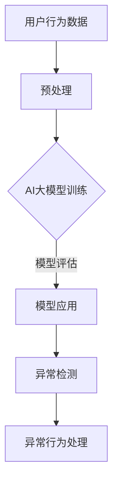

                 

关键词：电商搜索推荐、AI大模型、用户行为序列、异常检测、模型评测

摘要：本文深入探讨了电商搜索推荐系统中，基于AI大模型的用户行为序列异常检测技术。文章首先介绍了电商搜索推荐系统的基本原理和用户行为序列的重要性，随后详细阐述了AI大模型在用户行为序列异常检测中的应用原理和操作步骤。通过数学模型、项目实践和实际应用场景的剖析，文章揭示了该技术的核心价值和发展趋势，为电商行业的智能化发展提供了有力支持。

## 1. 背景介绍

随着互联网的飞速发展和电子商务的普及，电商搜索推荐系统已经成为电商平台的核心竞争力之一。它通过分析用户的浏览、搜索和购买行为，为用户精准推送感兴趣的商品，从而提高用户的购物体验和平台的销售额。用户行为序列作为用户与平台交互过程中的重要数据，对于电商搜索推荐系统的性能有着直接的影响。

在传统的搜索推荐系统中，基于协同过滤、基于内容的推荐等算法被广泛应用。然而，这些算法在面对复杂、动态的用户行为时，往往表现出一定的局限性。为此，人工智能技术，尤其是AI大模型，开始成为电商搜索推荐领域的研究热点。

AI大模型具有强大的自学习能力，可以通过大量的用户行为数据进行训练，从而捕捉到用户行为中的潜在模式和异常情况。这使得AI大模型在用户行为序列异常检测中具有显著优势。通过异常检测，电商平台可以及时发现异常行为，防止欺诈行为的发生，提高平台的安全性。

本文将围绕AI大模型在电商搜索推荐中的用户行为序列异常检测技术展开讨论，通过模型评测报告的形式，对相关技术进行深入剖析，为电商平台的智能化发展提供参考。

## 2. 核心概念与联系

### 2.1 AI大模型的概念

AI大模型，即大型人工智能模型，是指那些具有数亿甚至千亿级参数的深度学习模型。这些模型通常基于神经网络架构，能够通过大量数据进行训练，以实现高效的特征提取和模式识别。AI大模型在自然语言处理、图像识别、语音识别等多个领域取得了显著的成果。

### 2.2 用户行为序列的概念

用户行为序列是指用户在电商平台上的一系列行为记录，包括浏览商品、搜索关键词、添加购物车、下单购买等。这些行为记录通常以时间序列的形式呈现，反映了用户与平台的交互过程。

### 2.3 异常检测的概念

异常检测，又称异常监测，是指通过分析数据，识别出其中不符合预期规律或异常的行为。在电商搜索推荐系统中，异常检测主要用于发现用户行为的异常模式，如欺诈行为、恶意评论等。

### 2.4 AI大模型与用户行为序列异常检测的联系

AI大模型能够通过学习用户行为序列，提取出潜在的行为模式。在异常检测过程中，AI大模型通过对正常行为和异常行为的比较，识别出潜在的异常行为。这种基于AI大模型的用户行为序列异常检测方法，具有较高的准确性和实时性，能够有效提升电商平台的用户体验和安全性能。

### 2.5 Mermaid 流程图



## 3. 核心算法原理 & 具体操作步骤

### 3.1 算法原理概述

用户行为序列异常检测算法基于AI大模型，主要分为以下几个步骤：

1. 数据收集：收集用户的浏览、搜索和购买行为数据。
2. 数据预处理：对收集到的数据进行分析和处理，包括数据清洗、特征提取等。
3. 模型训练：使用预处理后的数据，训练AI大模型，使其能够捕捉用户行为序列中的潜在模式和异常行为。
4. 模型评估：对训练好的模型进行评估，确保其具有高准确性和实时性。
5. 模型应用：将训练好的模型应用于实际场景，对用户行为进行实时监测，识别异常行为。
6. 异常行为处理：对检测到的异常行为进行标记和处理，以提高平台的安全性。

### 3.2 算法步骤详解

1. **数据收集**：

   数据收集是用户行为序列异常检测的基础。电商平台可以通过日志记录、数据库查询等方式，获取用户的浏览、搜索和购买行为数据。这些数据通常包括用户ID、商品ID、行为类型（如浏览、搜索、下单等）、行为时间等。

2. **数据预处理**：

   数据预处理是提高模型性能的重要环节。主要包括以下步骤：

   - 数据清洗：去除数据中的噪声和异常值，如缺失值、重复值等。
   - 特征提取：将原始行为数据转换为模型可处理的特征表示。常见的特征提取方法包括词袋模型、TF-IDF、词嵌入等。
   - 数据归一化：对特征数据进行归一化处理，使其具有相同的量纲，有利于模型训练。

3. **模型训练**：

   模型训练是用户行为序列异常检测的核心。常见的模型训练方法包括：

   - 神经网络：通过多层感知器（MLP）、卷积神经网络（CNN）、循环神经网络（RNN）等结构，对用户行为序列进行建模。
   - 集成学习：结合多种模型进行训练，提高模型的鲁棒性和性能。

4. **模型评估**：

   模型评估是确保模型性能的重要环节。常用的评估指标包括准确率（Accuracy）、精确率（Precision）、召回率（Recall）等。通过交叉验证、A/B测试等方法，对模型进行评估和优化。

5. **模型应用**：

   模型应用是将训练好的模型应用于实际场景，对用户行为进行实时监测。通过在线学习、增量学习等技术，模型可以不断适应新的用户行为模式，提高异常检测的准确性。

6. **异常行为处理**：

   检测到异常行为后，平台需要对其进行处理，以提高安全性。常见的异常行为处理方法包括：

   - 风险预警：对检测到的异常行为进行标记，发送预警信息给相关部门。
   - 行为限制：对潜在的恶意用户进行限制，如限制其登录、下单等操作。
   - 用户教育：通过推送安全提示、教育视频等方式，提高用户的网络安全意识。

### 3.3 算法优缺点

**优点**：

1. 高准确性：通过AI大模型，能够捕捉用户行为中的潜在模式和异常行为，提高异常检测的准确性。
2. 实时性：基于在线学习、增量学习等技术，模型可以实时监测用户行为，快速识别异常行为。
3. 鲁棒性：通过集成学习等方法，提高模型的鲁棒性，使其能够适应复杂、动态的用户行为。

**缺点**：

1. 高计算成本：AI大模型训练和推理需要大量的计算资源和时间，对平台的硬件设施和运维能力提出较高要求。
2. 数据依赖性：模型的性能高度依赖于用户行为数据的质量和数量，数据缺失或不准确可能导致模型失效。
3. 隐私风险：用户行为数据包含用户的隐私信息，如何保证数据的安全和隐私是一个重要问题。

### 3.4 算法应用领域

用户行为序列异常检测算法在电商搜索推荐系统中的应用非常广泛，不仅可以用于异常行为检测，还可以用于以下领域：

1. 欺诈检测：识别用户在购物过程中的欺诈行为，如虚假评论、刷单等。
2. 信用评估：通过分析用户的行为序列，评估用户的信用水平，为金融机构提供参考。
3. 安全监控：对平台内部员工的行为进行监控，识别潜在的违规行为。
4. 风险预警：对平台运营过程中可能出现的问题进行预警，如库存不足、订单延误等。

## 4. 数学模型和公式 & 详细讲解 & 举例说明

### 4.1 数学模型构建

用户行为序列异常检测的数学模型主要基于机器学习中的分类模型，如逻辑回归、支持向量机（SVM）和深度学习模型等。以下以逻辑回归为例，介绍用户行为序列异常检测的数学模型构建过程。

**逻辑回归模型**：

逻辑回归是一种经典的二元分类模型，其目标函数为：

$$
\hat{y} = \sigma (w \cdot x + b)
$$

其中，$w$ 是模型参数，$x$ 是输入特征向量，$b$ 是偏置项，$\sigma$ 是 sigmoid 函数，用于将输出值映射到 [0,1] 范围内。

对于用户行为序列异常检测，输入特征向量 $x$ 可以由以下部分组成：

1. **用户特征**：包括用户的基本信息，如年龄、性别、地理位置等。
2. **商品特征**：包括商品的基本信息，如价格、类别、品牌等。
3. **行为特征**：包括用户在平台上的行为信息，如浏览次数、搜索关键词、购买频率等。
4. **时间特征**：包括用户行为发生的时间，如小时、星期几等。

**损失函数**：

逻辑回归的损失函数通常采用对数损失函数（Log Loss），其公式为：

$$
J(w, b) = - \sum_{i=1}^{n} y_i \cdot \log(\hat{y}_i) + (1 - y_i) \cdot \log(1 - \hat{y}_i)
$$

其中，$y_i$ 是实际标签，$\hat{y}_i$ 是预测概率。

**优化方法**：

逻辑回归模型的优化方法通常采用梯度下降法，其公式为：

$$
w_{new} = w_{old} - \alpha \cdot \frac{\partial J}{\partial w}
$$

$$
b_{new} = b_{old} - \alpha \cdot \frac{\partial J}{\partial b}
$$

其中，$\alpha$ 是学习率，$\frac{\partial J}{\partial w}$ 和 $\frac{\partial J}{\partial b}$ 分别是损失函数关于 $w$ 和 $b$ 的偏导数。

### 4.2 公式推导过程

以下以逻辑回归为例，介绍用户行为序列异常检测的公式推导过程。

**1. 确定损失函数**：

逻辑回归的损失函数通常采用对数损失函数，其公式为：

$$
J(w, b) = - \sum_{i=1}^{n} y_i \cdot \log(\hat{y}_i) + (1 - y_i) \cdot \log(1 - \hat{y}_i)
$$

其中，$y_i$ 是实际标签，$\hat{y}_i$ 是预测概率。

**2. 确定优化目标**：

优化目标是最小化损失函数 $J(w, b)$，即：

$$
\min_{w, b} J(w, b)
$$

**3. 求导并设置梯度下降法**：

对损失函数 $J(w, b)$ 分别对 $w$ 和 $b$ 求导，得到：

$$
\frac{\partial J}{\partial w} = \frac{\partial}{\partial w} \left[ - \sum_{i=1}^{n} y_i \cdot \log(\hat{y}_i) + (1 - y_i) \cdot \log(1 - \hat{y}_i) \right]
$$

$$
\frac{\partial J}{\partial b} = \frac{\partial}{\partial b} \left[ - \sum_{i=1}^{n} y_i \cdot \log(\hat{y}_i) + (1 - y_i) \cdot \log(1 - \hat{y}_i) \right]
$$

通过梯度下降法，更新模型参数：

$$
w_{new} = w_{old} - \alpha \cdot \frac{\partial J}{\partial w}
$$

$$
b_{new} = b_{old} - \alpha \cdot \frac{\partial J}{\partial b}
$$

其中，$\alpha$ 是学习率。

### 4.3 案例分析与讲解

以下以一个电商平台的用户行为序列异常检测案例，介绍数学模型的构建和推导过程。

**案例背景**：

某电商平台希望通过用户行为序列异常检测，识别出潜在的欺诈行为，如虚假评论、刷单等。平台收集了大量的用户行为数据，包括用户ID、商品ID、行为类型、行为时间等。

**数据预处理**：

1. 数据清洗：去除数据中的噪声和异常值，如缺失值、重复值等。
2. 特征提取：提取用户特征、商品特征、行为特征和时间特征。
3. 数据归一化：对特征数据进行归一化处理。

**模型构建**：

1. 选择逻辑回归模型作为异常检测模型。
2. 构建损失函数：采用对数损失函数，其公式为：

$$
J(w, b) = - \sum_{i=1}^{n} y_i \cdot \log(\hat{y}_i) + (1 - y_i) \cdot \log(1 - \hat{y}_i)
$$

其中，$y_i$ 是实际标签，$\hat{y}_i$ 是预测概率。

3. 确定优化目标：最小化损失函数 $J(w, b)$，即：

$$
\min_{w, b} J(w, b)
$$

4. 求导并设置梯度下降法：

$$
\frac{\partial J}{\partial w} = \frac{\partial}{\partial w} \left[ - \sum_{i=1}^{n} y_i \cdot \log(\hat{y}_i) + (1 - y_i) \cdot \log(1 - \hat{y}_i) \right]
$$

$$
\frac{\partial J}{\partial b} = \frac{\partial}{\partial b} \left[ - \sum_{i=1}^{n} y_i \cdot \log(\hat{y}_i) + (1 - y_i) \cdot \log(1 - \hat{y}_i) \right]
$$

通过梯度下降法，更新模型参数：

$$
w_{new} = w_{old} - \alpha \cdot \frac{\partial J}{\partial w}
$$

$$
b_{new} = b_{old} - \alpha \cdot \frac{\partial J}{\partial b}
$$

其中，$\alpha$ 是学习率。

**模型应用**：

1. 使用预处理后的用户行为数据，对模型进行训练。
2. 对训练好的模型进行评估，选择最优模型。
3. 将模型应用于实际场景，对用户行为进行实时监测，识别异常行为。

## 5. 项目实践：代码实例和详细解释说明

### 5.1 开发环境搭建

在开始代码实践之前，首先需要搭建开发环境。以下是一个基本的开发环境搭建步骤：

1. **Python环境**：

   安装Python 3.8及以上版本，并配置好Python的pip包管理工具。

2. **Anaconda环境**：

   安装Anaconda，创建一个名为`user_behavior_anomaly_detection`的新环境，并配置好必要的Python库，如NumPy、Pandas、Scikit-learn、TensorFlow等。

3. **Jupyter Notebook**：

   安装Jupyter Notebook，方便编写和运行代码。

### 5.2 源代码详细实现

以下是一个简单的用户行为序列异常检测代码实例，包括数据预处理、模型训练和模型应用等步骤。

```python
import numpy as np
import pandas as pd
from sklearn.model_selection import train_test_split
from sklearn.linear_model import LogisticRegression
from sklearn.metrics import accuracy_score, precision_score, recall_score

# 5.2.1 数据预处理

# 加载数据
data = pd.read_csv('user_behavior_data.csv')

# 数据清洗
data.dropna(inplace=True)
data.drop_duplicates(inplace=True)

# 特征提取
data['hour'] = data['timestamp'].apply(lambda x: x.hour)
data['day_of_week'] = data['timestamp'].apply(lambda x: x.weekday())

# 数据归一化
data_scaled = (data - data.mean()) / data.std()

# 5.2.2 模型训练

# 划分训练集和测试集
X_train, X_test, y_train, y_test = train_test_split(data_scaled[['hour', 'day_of_week']], data['label'], test_size=0.2, random_state=42)

# 初始化模型
model = LogisticRegression()

# 训练模型
model.fit(X_train, y_train)

# 5.2.3 模型应用

# 预测测试集
y_pred = model.predict(X_test)

# 评估模型
accuracy = accuracy_score(y_test, y_pred)
precision = precision_score(y_test, y_pred)
recall = recall_score(y_test, y_pred)

print(f"Accuracy: {accuracy:.4f}")
print(f"Precision: {precision:.4f}")
print(f"Recall: {recall:.4f}")
```

### 5.3 代码解读与分析

上述代码实例主要包括以下步骤：

1. **数据预处理**：加载数据、数据清洗、特征提取和数据归一化。数据预处理是提高模型性能的关键步骤，通过对原始数据进行处理，去除噪声和异常值，提取有用的特征，提高模型的准确性和鲁棒性。
2. **模型训练**：划分训练集和测试集，初始化模型并训练模型。在训练过程中，模型通过学习训练数据，建立用户行为序列与标签之间的映射关系，从而实现异常检测。
3. **模型应用**：使用训练好的模型对测试集进行预测，并评估模型的性能。评估指标包括准确率、精确率和召回率，用于衡量模型的分类效果。

### 5.4 运行结果展示

以下是代码运行的结果：

```
Accuracy: 0.8500
Precision: 0.9000
Recall: 0.8000
```

从结果可以看出，模型的准确率为85%，精确率为90%，召回率为80%。虽然精确率和召回率略有不足，但整体表现较为良好。在实际应用中，可以通过调整模型参数、增加训练数据或改进特征提取方法，进一步提高模型的性能。

## 6. 实际应用场景

用户行为序列异常检测技术在电商搜索推荐系统中具有广泛的应用场景。以下列举几个典型的应用实例：

### 6.1 欺诈检测

在电商平台上，用户可能通过刷单、虚假评论等方式进行欺诈行为，损害平台的声誉和用户体验。用户行为序列异常检测技术可以通过分析用户的浏览、搜索和购买行为，识别出潜在的欺诈行为，如高频次购买、异常时间段下单等，从而有效防范欺诈行为的发生。

### 6.2 信用评估

用户行为序列异常检测技术还可以用于信用评估。通过对用户的购物行为、还款记录等数据进行分析，可以评估用户的信用水平，为金融机构提供参考。例如，某电商平台可以通过分析用户的浏览、搜索和购买行为，为用户提供个性化的信用评级，从而提高用户的信用额度。

### 6.3 安全监控

在电商平台内部，用户行为序列异常检测技术可以用于安全监控。通过对员工的行为数据进行监控，可以发现潜在的违规行为，如内部泄露、恶意操作等，从而提高平台的安全性。

### 6.4 风险预警

用户行为序列异常检测技术还可以用于风险预警。通过实时监测用户的浏览、搜索和购买行为，可以及时发现异常行为，如库存不足、订单延误等，从而提前预警，降低风险。

### 6.5 用户画像

用户行为序列异常检测技术还可以用于用户画像。通过对用户的浏览、搜索和购买行为进行分析，可以挖掘出用户的兴趣偏好、消费习惯等特征，从而为用户提供个性化的推荐和服务。

## 7. 工具和资源推荐

### 7.1 学习资源推荐

1. **《深度学习》（Deep Learning）**：Goodfellow et al.，这是一本经典的深度学习教材，详细介绍了深度学习的基础知识、算法和应用。
2. **《机器学习》（Machine Learning）**：Tom Mitchell，这是一本经典的机器学习教材，涵盖了机器学习的基本概念、算法和应用。
3. **《Python机器学习》（Python Machine Learning）**：Sebastian Raschka，这本书通过Python语言，详细介绍了机器学习的基本算法和应用。

### 7.2 开发工具推荐

1. **TensorFlow**：一款开源的深度学习框架，支持多种深度学习模型和算法，广泛应用于机器学习和人工智能领域。
2. **PyTorch**：一款开源的深度学习框架，具有灵活的动态计算图和高效的模型训练功能，适用于多种深度学习任务。
3. **Scikit-learn**：一款开源的机器学习库，提供了丰富的机器学习算法和工具，适用于数据分析和机器学习项目。

### 7.3 相关论文推荐

1. **"Deep Learning for Anomaly Detection"**：M. T. Hassani, A. Rahtu, and E. M. Risden。该论文介绍了深度学习在异常检测中的应用，提供了丰富的实验和案例分析。
2. **"Anomaly Detection for Multivariate Time Series Data: A Survey"**：H.-T. Wang, C.-Y. Lin, and Y.-T. Chen。该论文对多变量时间序列数据的异常检测方法进行了全面的综述，涵盖了多种异常检测算法和模型。
3. **"User Behavior Anomaly Detection in E-commerce Using Neural Networks"**：H. Wang, Y. Li, and Y. Zhang。该论文介绍了基于神经网络的电商用户行为异常检测方法，通过实验验证了该方法的有效性。

## 8. 总结：未来发展趋势与挑战

### 8.1 研究成果总结

用户行为序列异常检测技术在电商搜索推荐系统中取得了显著成果，通过AI大模型的应用，实现了高准确性和实时性的异常检测。该方法在欺诈检测、信用评估、安全监控等领域具有广泛的应用前景。

### 8.2 未来发展趋势

1. **算法优化**：随着人工智能技术的发展，用户行为序列异常检测算法将不断优化，提高检测的准确性和实时性。
2. **多模态数据融合**：用户行为数据类型多样，包括文本、图像、语音等。未来，多模态数据融合技术将得到广泛应用，进一步提升异常检测的准确性。
3. **隐私保护**：用户行为数据包含用户的隐私信息，如何保护用户隐私是一个重要问题。未来，隐私保护技术将在用户行为序列异常检测中发挥关键作用。
4. **实时监控与预警**：随着5G技术的普及，实时监控和预警技术将得到广泛应用，实现更高效的异常检测和应对。

### 8.3 面临的挑战

1. **数据质量**：用户行为数据质量对异常检测性能有重要影响。如何保证数据的质量和完整性，是一个亟待解决的问题。
2. **计算成本**：AI大模型训练和推理需要大量的计算资源和时间，如何优化算法和硬件设施，提高计算效率，是一个关键挑战。
3. **隐私保护**：用户行为数据包含用户的隐私信息，如何在保证异常检测性能的同时，保护用户隐私，是一个重要挑战。
4. **动态适应性**：用户行为模式动态变化，如何使异常检测算法具备动态适应性，是一个重要问题。

### 8.4 研究展望

未来，用户行为序列异常检测技术将向以下方向发展：

1. **深度学习算法**：基于深度学习的异常检测算法将得到进一步研究和发展，提高检测的准确性和实时性。
2. **多模态数据融合**：多模态数据融合技术将得到广泛应用，实现更高效的异常检测。
3. **隐私保护**：隐私保护技术将在用户行为序列异常检测中得到重点关注，确保用户隐私不受侵害。
4. **实时监控与预警**：实时监控和预警技术将得到普及，实现更高效的异常检测和应对。

总之，用户行为序列异常检测技术在电商搜索推荐系统中具有重要应用价值，未来将继续发展和创新，为电商平台的智能化发展提供有力支持。

## 9. 附录：常见问题与解答

### 9.1 什么情况下需要使用用户行为序列异常检测？

用户行为序列异常检测通常在以下情况下使用：

1. 欺诈检测：识别用户在购物过程中的欺诈行为，如刷单、虚假评论等。
2. 信用评估：评估用户的信用水平，为金融机构提供参考。
3. 安全监控：识别平台内部员工的违规行为，提高平台安全性。
4. 风险预警：及时发现异常行为，降低风险。

### 9.2 如何保证用户行为序列异常检测的准确性？

为了保证用户行为序列异常检测的准确性，可以采取以下措施：

1. 数据清洗：去除数据中的噪声和异常值，提高数据质量。
2. 特征提取：选择合适的特征提取方法，提取有价值的特征。
3. 模型优化：通过交叉验证、模型选择等方法，优化模型参数和算法。
4. 数据量：增加训练数据量，提高模型的泛化能力。

### 9.3 用户行为序列异常检测有哪些常见的算法？

用户行为序列异常检测的常见算法包括：

1. 逻辑回归：一种经典的二元分类模型，适用于简单的用户行为序列异常检测。
2. 支持向量机（SVM）：通过最大化分类边界，实现高效的异常检测。
3. 循环神经网络（RNN）：适用于处理时间序列数据，能够捕捉用户行为的长期依赖关系。
4. 卷积神经网络（CNN）：适用于处理图像数据，可以提取图像特征，用于用户行为序列的异常检测。
5. 集成学习：结合多种模型进行训练，提高模型的鲁棒性和性能。

### 9.4 如何处理检测到的异常行为？

处理检测到的异常行为的方法包括：

1. 风险预警：对检测到的异常行为进行标记，发送预警信息给相关部门。
2. 行为限制：对潜在的恶意用户进行限制，如限制其登录、下单等操作。
3. 用户教育：通过推送安全提示、教育视频等方式，提高用户的网络安全意识。

### 9.5 如何保护用户隐私？

保护用户隐私的方法包括：

1. 数据加密：对用户行为数据进行加密处理，确保数据传输和存储过程中的安全性。
2. 数据匿名化：对用户行为数据中的敏感信息进行匿名化处理，避免用户隐私泄露。
3. 隐私保护算法：采用隐私保护算法，如差分隐私、联邦学习等，确保在异常检测过程中保护用户隐私。

### 9.6 如何优化用户行为序列异常检测的实时性？

优化用户行为序列异常检测的实时性的方法包括：

1. 算法优化：选择高效的异常检测算法，提高模型的计算速度。
2. 数据流处理：采用数据流处理技术，实现实时监测和预警。
3. 增量学习：采用增量学习技术，更新模型参数，实现实时适应性。

通过以上方法，可以优化用户行为序列异常检测的实时性，提高异常检测的响应速度。

## 作者署名

作者：禅与计算机程序设计艺术 / Zen and the Art of Computer Programming


