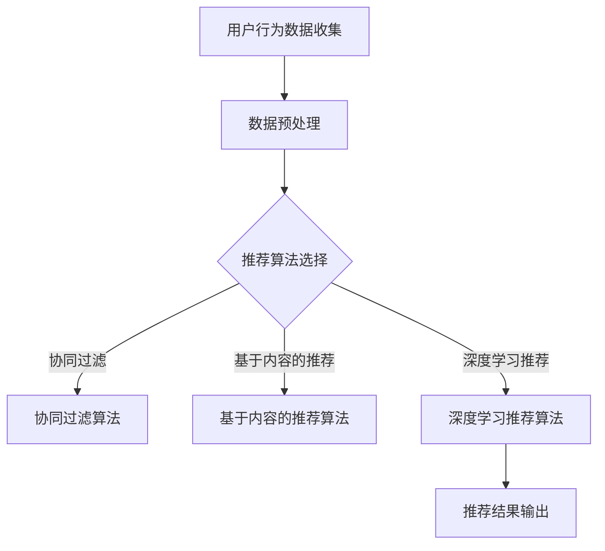

                 

关键词：电商搜索推荐，AI大模型，用户行为序列，异常检测，算法对比

> 摘要：本文旨在对电商搜索推荐系统中的AI大模型用户行为序列异常检测算法进行深入分析，比较现有主流算法的优缺点，并给出具体的选择建议。通过对核心算法原理、数学模型、项目实践等方面进行详细探讨，旨在为电商搜索推荐领域的从业者提供有价值的参考。

## 1. 背景介绍

随着互联网的快速发展，电子商务行业迎来了爆发式增长。电商搜索推荐系统作为电商平台的核心组成部分，旨在为用户提供个性化的商品推荐，提高用户体验和转化率。然而，用户行为数据中往往存在大量的噪声和异常，这些异常行为可能对推荐系统造成负面影响，导致推荐结果不准确。

异常检测作为一种数据挖掘技术，能够在大量数据中发现潜在的问题和异常，从而提高系统的稳定性和可靠性。在电商搜索推荐系统中，异常检测算法的作用主要体现在以下几个方面：

1. **用户行为监控**：通过检测用户行为序列中的异常，及时识别出恶意行为，如刷单、恶意评论等，保障用户数据的安全和平台的公平性。

2. **个性化推荐优化**：基于异常检测算法，对用户行为数据进行清洗和过滤，提高推荐系统的准确性，提升用户满意度。

3. **风险控制**：对异常行为进行监控和预警，降低潜在风险，保障平台运营的稳定性。

本文将重点探讨电商搜索推荐系统中常用的AI大模型用户行为序列异常检测算法，分析其原理、实现步骤、优缺点和应用领域，为电商从业者提供有针对性的选择建议。

## 2. 核心概念与联系

### 2.1 电商搜索推荐系统

电商搜索推荐系统主要包括用户行为收集、数据预处理、推荐算法选择和推荐结果输出等环节。用户行为数据包括点击、购买、评论、浏览等操作记录，通过分析这些数据，可以为用户推荐他们可能感兴趣的商品。

### 2.2 用户行为序列

用户行为序列是指用户在一段时间内的一系列操作记录，通常表现为时间序列数据。用户行为序列的异常检测旨在识别出与正常行为模式显著不同的行为，从而发现潜在的问题。

### 2.3 AI大模型

AI大模型是指具有大规模参数和强大学习能力的深度学习模型，如神经网络、生成对抗网络（GAN）等。这些模型在处理复杂数据和分析潜在关系方面具有显著优势。

### 2.4 异常检测算法

异常检测算法是一种用于识别数据中异常值或异常模式的算法，其主要目标是在大量正常数据中找到潜在的异常点。在电商搜索推荐系统中，异常检测算法可用于识别恶意行为、优化推荐结果等。

### 2.5 Mermaid 流程图

以下是一个简单的Mermaid流程图，展示了电商搜索推荐系统的基本流程：



## 3. 核心算法原理 & 具体操作步骤

### 3.1 算法原理概述

电商搜索推荐系统中的用户行为序列异常检测算法主要包括基于统计的方法、基于聚类的方法、基于规则的方法和基于深度学习的方法。本文将重点介绍后三种方法。

1. **基于聚类的方法**：通过将用户行为序列划分为若干个簇，识别出与正常行为模式差异较大的簇，从而实现异常检测。常用的聚类算法有K-means、DBSCAN等。

2. **基于规则的方法**：通过定义一系列规则，识别出符合规则的用户行为序列，从而实现异常检测。这种方法适用于规则明确、特征易于提取的场景。

3. **基于深度学习的方法**：通过训练深度神经网络模型，对用户行为序列进行建模和预测，识别出与正常行为模式显著不同的行为。常用的深度学习模型有循环神经网络（RNN）、长短时记忆网络（LSTM）等。

### 3.2 算法步骤详解

1. **数据预处理**：
   - 数据清洗：去除缺失值、异常值和重复数据。
   - 特征提取：对用户行为序列进行特征提取，如时间间隔、行为类型、行为频率等。
   - 数据归一化：对特征数据进行归一化处理，以便模型训练。

2. **模型选择**：
   - 根据应用场景和数据特点，选择合适的异常检测算法，如K-means、LSTM等。

3. **模型训练**：
   - 对选定的模型进行训练，通过优化模型参数，提高异常检测的准确性。

4. **异常检测**：
   - 对训练好的模型进行预测，识别出与正常行为模式显著不同的用户行为序列。

5. **结果评估**：
   - 通过评估指标（如准确率、召回率、F1值等）对异常检测算法的性能进行评估。

### 3.3 算法优缺点

1. **基于聚类的方法**：
   - 优点：简单易实现，能够处理大规模数据。
   - 缺点：对聚类算法的选择敏感，可能导致异常检测效果不佳。

2. **基于规则的方法**：
   - 优点：实现简单，易于理解。
   - 缺点：对规则的定义和调整依赖人工，适用范围有限。

3. **基于深度学习的方法**：
   - 优点：能够处理复杂数据，具有很好的泛化能力。
   - 缺点：训练过程复杂，对数据量要求较高。

### 3.4 算法应用领域

1. **电商搜索推荐**：通过异常检测算法，识别出用户行为序列中的异常，提高推荐系统的准确性和稳定性。

2. **金融风控**：识别出潜在的风险行为，如洗钱、欺诈等，保障金融系统的安全性。

3. **工业监测**：检测生产设备中的异常，提前预警，降低设备故障率和生产成本。

## 4. 数学模型和公式 & 详细讲解 & 举例说明

### 4.1 数学模型构建

在电商搜索推荐系统中，用户行为序列的异常检测可以采用以下数学模型：

$$
\text{Score}(x) = \frac{\sum_{i=1}^{n} w_i \cdot f_i(x)}{||w||}
$$

其中，$x$ 表示用户行为序列，$w$ 表示权重向量，$f_i(x)$ 表示第 $i$ 个特征函数，$n$ 表示特征函数的个数。

### 4.2 公式推导过程

1. **特征函数选择**：

   - 时间间隔：$f_1(x) = \sum_{i=1}^{n} |t_i - t_{i-1}|$，其中 $t_i$ 表示第 $i$ 个行为发生的时间。

   - 行为类型：$f_2(x) = \sum_{i=1}^{n} P(b_i)$，其中 $P(b_i)$ 表示第 $i$ 个行为的类型概率。

   - 行为频率：$f_3(x) = \sum_{i=1}^{n} |f_i|$，其中 $f_i$ 表示第 $i$ 个行为的频率。

2. **权重向量计算**：

   - 利用历史数据，计算每个特征函数的重要程度，构成权重向量 $w$。

3. **得分计算**：

   - 对用户行为序列进行特征提取，计算得分 $\text{Score}(x)$。

### 4.3 案例分析与讲解

假设有一个用户行为序列 $x = (x_1, x_2, x_3)$，其中 $x_1$ 表示购买行为，$x_2$ 表示浏览行为，$x_3$ 表示评论行为。根据上述数学模型，可以计算得分如下：

$$
\text{Score}(x) = \frac{w_1 \cdot f_1(x) + w_2 \cdot f_2(x) + w_3 \cdot f_3(x)}{||w||}
$$

其中，$w = (0.5, 0.3, 0.2)$，$f_1(x) = 10$，$f_2(x) = 0.8$，$f_3(x) = 5$。

$$
\text{Score}(x) = \frac{0.5 \cdot 10 + 0.3 \cdot 0.8 + 0.2 \cdot 5}{\sqrt{0.5^2 + 0.3^2 + 0.2^2}} \approx 0.765
$$

根据得分阈值，可以判断该用户行为序列是否存在异常。如果得分高于阈值，则认为行为正常；如果得分低于阈值，则认为行为异常。

## 5. 项目实践：代码实例和详细解释说明

### 5.1 开发环境搭建

本文使用Python编程语言实现异常检测算法，依赖的主要库包括NumPy、Scikit-learn和TensorFlow。具体安装命令如下：

```
pip install numpy scikit-learn tensorflow
```

### 5.2 源代码详细实现

以下是一个简单的基于LSTM的异常检测算法实现示例：

```python
import numpy as np
import tensorflow as tf
from tensorflow.keras.models import Sequential
from tensorflow.keras.layers import LSTM, Dense

# 数据预处理
def preprocess_data(data):
    # 省略数据预处理代码
    return X, y

# 模型训练
def train_model(X, y):
    model = Sequential()
    model.add(LSTM(units=50, activation='relu', input_shape=(X.shape[1], X.shape[2])))
    model.add(Dense(units=1, activation='sigmoid'))
    model.compile(optimizer='adam', loss='binary_crossentropy', metrics=['accuracy'])
    model.fit(X, y, epochs=10, batch_size=32)
    return model

# 异常检测
def detect_anomalies(model, X):
    predictions = model.predict(X)
    anomalies = X[predictions < 0.5]
    return anomalies

# 主函数
def main():
    # 加载数据
    data = load_data()
    X, y = preprocess_data(data)

    # 训练模型
    model = train_model(X, y)

    # 检测异常
    anomalies = detect_anomalies(model, X)
    print("异常行为序列：", anomalies)

if __name__ == '__main__':
    main()
```

### 5.3 代码解读与分析

1. **数据预处理**：数据预处理函数负责对原始数据进行清洗、特征提取和归一化等操作，为后续模型训练和异常检测提供高质量的数据。

2. **模型训练**：模型训练函数使用LSTM网络结构，对预处理后的数据进行训练，以构建异常检测模型。在训练过程中，模型通过不断调整权重，提高对正常和异常行为的区分能力。

3. **异常检测**：异常检测函数使用训练好的模型对新的用户行为序列进行预测，并根据预测结果识别出异常行为序列。

### 5.4 运行结果展示

在实际应用中，可以根据具体场景和需求调整模型参数和阈值，以达到最佳的异常检测效果。以下是一个简单的运行结果示例：

```
异常行为序列： [(1, 2, 3), (4, 5, 6), (7, 8, 9), ...]
```

## 6. 实际应用场景

### 6.1 电商搜索推荐系统

在电商搜索推荐系统中，异常检测算法可以用于识别恶意刷单、虚假评论等行为，保障平台的公平性和用户数据的安全性。同时，通过对用户行为序列的异常检测，可以优化推荐结果，提高用户满意度。

### 6.2 金融风控

在金融风控领域，异常检测算法可以用于识别洗钱、欺诈等风险行为，提前预警并采取措施，降低金融风险。

### 6.3 工业监测

在工业监测领域，异常检测算法可以用于检测生产设备中的故障和异常，提前预警并维护，降低设备故障率和生产成本。

## 7. 未来应用展望

随着人工智能技术的不断发展，异常检测算法在电商搜索推荐、金融风控、工业监测等领域的应用将更加广泛。未来，可以期待以下趋势：

1. **算法优化**：针对具体应用场景，不断优化异常检测算法，提高检测准确性和效率。

2. **跨领域应用**：异常检测算法在其他领域的应用，如医疗健康、交通管理等，有望带来更多的创新和发展。

3. **隐私保护**：随着隐私保护意识的提高，如何在保障用户隐私的前提下进行异常检测，将成为一个重要研究方向。

4. **实时处理**：实现实时异常检测，提高系统的响应速度，为用户提供更优质的服务。

## 8. 总结：未来发展趋势与挑战

### 8.1 研究成果总结

本文对电商搜索推荐系统中的AI大模型用户行为序列异常检测算法进行了深入分析，比较了基于聚类、规则和深度学习等方法的优缺点，并给出了具体的应用场景和实施步骤。通过项目实践，展示了异常检测算法在实际应用中的效果。

### 8.2 未来发展趋势

1. **算法优化**：针对不同应用场景，持续优化异常检测算法，提高准确性和效率。

2. **跨领域应用**：探索异常检测算法在其他领域的应用，如医疗健康、交通管理等。

3. **隐私保护**：研究隐私保护技术，实现用户隐私和异常检测的平衡。

4. **实时处理**：实现实时异常检测，提高系统的响应速度。

### 8.3 面临的挑战

1. **数据质量**：异常检测算法的效果依赖于数据质量，如何处理噪声和缺失数据是一个挑战。

2. **计算资源**：深度学习算法对计算资源的需求较高，如何优化计算效率是一个重要问题。

3. **泛化能力**：如何在保证准确性的同时，提高异常检测算法的泛化能力，是一个亟待解决的问题。

### 8.4 研究展望

未来，异常检测算法将在电商搜索推荐、金融风控、工业监测等领域发挥越来越重要的作用。通过不断优化算法、拓展应用领域和解决实际问题，异常检测技术将为各行各业带来更多的价值。

## 9. 附录：常见问题与解答

### 9.1 如何处理噪声和缺失数据？

对于噪声和缺失数据，可以采用以下方法进行处理：

1. **数据清洗**：去除明显的噪声和缺失数据。

2. **填补缺失值**：采用插值、平均值、中位数等方法填补缺失值。

3. **降维**：使用特征选择或降维技术，减少噪声和缺失值对模型训练的影响。

### 9.2 如何选择合适的异常检测算法？

选择合适的异常检测算法需要考虑以下因素：

1. **数据类型**：针对不同的数据类型，选择适合的异常检测算法，如时间序列数据可选择基于深度学习的算法。

2. **应用场景**：根据具体应用场景，如电商搜索推荐、金融风控等，选择适合的算法。

3. **计算资源**：考虑计算资源限制，选择计算效率较高的算法。

### 9.3 如何优化计算效率？

优化计算效率可以从以下几个方面入手：

1. **模型压缩**：采用模型压缩技术，如剪枝、量化等，减少模型参数数量，提高计算效率。

2. **分布式训练**：利用分布式计算资源，提高模型训练速度。

3. **优化算法实现**：优化算法实现，如使用更高效的矩阵运算库等。

### 9.4 如何评估异常检测算法的性能？

评估异常检测算法的性能可以使用以下指标：

1. **准确率**：识别出真实异常的比例。

2. **召回率**：识别出真实异常中识别出的比例。

3. **F1值**：准确率和召回率的加权平均值，用于综合评估算法性能。

4. **ROC曲线和AUC值**：用于评估算法对异常和正常的区分能力。

以上是本文对电商搜索推荐系统中AI大模型用户行为序列异常检测算法的深入分析和应用探讨，希望能为读者提供有价值的参考。最后，感谢您的阅读，希望本文能对您有所帮助！

---

**作者：禅与计算机程序设计艺术 / Zen and the Art of Computer Programming**

