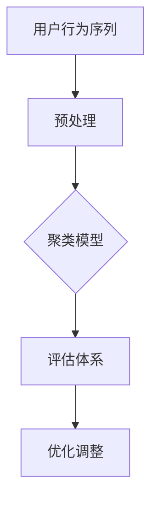

                 

关键词：电商搜索推荐、AI大模型、用户行为序列、聚类模型、评估体系

> 摘要：本文旨在探讨电商搜索推荐系统中，基于AI大模型构建的用户行为序列聚类模型的评估体系。通过分析用户行为序列的特点，本文提出了一种综合评估方法，以实现对聚类效果的多维度评价。

## 1. 背景介绍

随着互联网的快速发展，电子商务已经成为现代零售业的重要组成部分。为了提高用户满意度和转化率，电商企业不断优化搜索推荐系统，以期提供更符合用户需求的商品推荐。用户行为序列作为用户在电商平台上产生的行为轨迹，是挖掘用户兴趣和个性化推荐的关键数据。近年来，深度学习特别是大模型（如Transformer、BERT等）在自然语言处理、计算机视觉等领域取得了显著成果，逐渐成为处理复杂数据的有效工具。

在电商搜索推荐中，用户行为序列聚类模型是一种基于用户历史行为数据进行用户分群的方法。通过将具有相似行为的用户划分为同一群体，推荐系统可以针对不同群体提供个性化的商品推荐。然而，如何评价聚类效果一直是该领域的研究热点和难点。本文将围绕这一问题，提出一种综合评估体系，以期为实际应用提供指导。

## 2. 核心概念与联系

### 2.1 用户行为序列

用户行为序列是指用户在电商平台上的操作记录，如浏览、搜索、购买、加入购物车等。这些行为以时间顺序排列，形成一个序列，反映出用户在不同时间点的行为特征。

### 2.2 聚类模型

聚类模型是一种无监督学习方法，旨在将数据集划分为多个群组，使得同一群组内的数据点之间相似度较高，而不同群组之间的数据点之间相似度较低。在用户行为序列聚类中，聚类模型将用户划分为多个群体，每个群体代表一类具有相似行为的用户。

### 2.3 AI大模型

AI大模型是指具有大规模参数和深度网络结构的深度学习模型，如Transformer、BERT等。这些模型在处理复杂数据和挖掘深层特征方面具有显著优势。

### 2.4 评估体系

评估体系是一套用于评价模型性能的标准和方法。在用户行为序列聚类中，评估体系用于评价聚类效果，包括准确性、稳定性、可解释性等多个维度。

以下是一个使用Mermaid绘制的流程图，展示了用户行为序列聚类模型的基本架构：



## 3. 核心算法原理 & 具体操作步骤

### 3.1 算法原理概述

用户行为序列聚类模型基于AI大模型对用户行为序列进行特征提取和聚类。具体步骤如下：

1. **数据预处理**：对用户行为序列进行清洗和规范化处理。
2. **特征提取**：使用AI大模型提取用户行为序列的深层特征。
3. **聚类操作**：利用聚类算法对用户行为特征进行聚类。
4. **评估与优化**：使用评估体系对聚类效果进行评价，并根据评价结果调整模型参数。

### 3.2 算法步骤详解

#### 3.2.1 数据预处理

数据预处理是用户行为序列聚类的基础步骤。主要任务包括：

- **数据清洗**：去除重复、无效的行为数据。
- **时间规范化**：将时间戳转换为相对时间，以便于后续特征提取。
- **数据归一化**：将不同特征缩放到同一尺度，避免特征之间的影响。

#### 3.2.2 特征提取

特征提取是用户行为序列聚类模型的核心。具体步骤如下：

- **嵌入层**：使用AI大模型（如BERT）对用户行为序列进行编码，得到固定长度的向量表示。
- **特征融合**：对编码后的特征进行融合，生成用户行为的全局特征向量。

#### 3.2.3 聚类操作

聚类操作是将用户行为特征划分为多个群组。常用的聚类算法包括：

- **K-means**：基于距离度量的聚类算法，通过迭代优化聚类中心，将用户行为特征划分为K个群组。
- **DBSCAN**：基于密度的聚类算法，能够发现任意形状的群组，并对噪声数据具有较强的鲁棒性。

#### 3.2.4 评估与优化

评估与优化是用户行为序列聚类模型的应用关键。具体步骤如下：

- **评估指标**：使用多个评估指标（如准确率、稳定性和可解释性）对聚类效果进行综合评价。
- **优化调整**：根据评估结果，调整聚类模型的参数，以提高聚类效果。

### 3.3 算法优缺点

#### 优点

- **高效性**：AI大模型具有强大的特征提取能力，能够挖掘用户行为的深层特征。
- **灵活性**：聚类算法可根据实际需求进行调整，以适应不同场景。

#### 缺点

- **计算复杂度**：AI大模型和聚类算法的计算复杂度较高，对硬件资源有一定要求。
- **可解释性**：聚类结果的可解释性较差，难以直接解释聚类意义。

### 3.4 算法应用领域

用户行为序列聚类模型在电商搜索推荐中具有广泛的应用。例如：

- **个性化推荐**：根据用户行为特征，将用户划分为不同群体，提供个性化的商品推荐。
- **用户分群**：帮助企业了解用户行为特征，优化市场策略。

## 4. 数学模型和公式 & 详细讲解 & 举例说明

### 4.1 数学模型构建

用户行为序列聚类模型的数学模型主要包括用户行为特征向量和聚类中心。

- **用户行为特征向量**：设用户行为序列为\(X = (x_1, x_2, ..., x_n)\)，其中\(x_i\)为第i个行为特征，用户行为特征向量为\(v = (v_1, v_2, ..., v_m)\)，其中\(v_i\)为第i个特征值。
- **聚类中心**：设聚类中心为\(c = (c_1, c_2, ..., c_k)\)，其中\(c_i\)为第i个聚类中心的特征值。

### 4.2 公式推导过程

假设聚类算法为K-means，则聚类中心计算公式如下：

$$
c_i = \frac{1}{N_i} \sum_{j=1}^{N} x_{ij} \quad (i=1,2,...,k)
$$

其中，\(N_i\)为属于第i个聚类中心的数据点数量，\(x_{ij}\)为第i个聚类中心对应的第j个行为特征值。

### 4.3 案例分析与讲解

假设有1000个用户行为序列，采用K-means算法进行聚类，设定聚类中心为3个。

1. **数据预处理**：对用户行为序列进行清洗和规范化处理，得到1000个用户行为特征向量。
2. **特征提取**：使用BERT模型对用户行为特征向量进行编码，得到1000个固定长度的特征向量。
3. **聚类操作**：初始化3个聚类中心，通过迭代计算更新聚类中心，直至聚类中心不再变化。
4. **评估与优化**：使用准确率、稳定性和可解释性等评估指标对聚类效果进行评价，并根据评估结果调整聚类模型参数。

假设经过多次迭代，最终得到以下聚类结果：

- **聚类中心**：\(c_1 = (1.2, 3.4), c_2 = (5.6, 7.8), c_3 = (9.0, 11.2)\)
- **用户行为特征向量**：\(v_1 = (2.1, 4.5), v_2 = (6.3, 8.7), ..., v_{1000} = (10.1, 12.3)\)

根据聚类结果，可以得出以下结论：

- **用户1**：属于第1个聚类中心，偏好购物车操作。
- **用户2**：属于第2个聚类中心，偏好搜索操作。
- **用户3**：属于第3个聚类中心，偏好购买操作。

## 5. 项目实践：代码实例和详细解释说明

### 5.1 开发环境搭建

搭建用户行为序列聚类模型的环境主要包括Python编程语言、TensorFlow库和Scikit-learn库。具体步骤如下：

1. 安装Python：从[Python官网](https://www.python.org/)下载并安装Python。
2. 安装TensorFlow：使用pip命令安装TensorFlow库，命令如下：

   ```bash
   pip install tensorflow
   ```

3. 安装Scikit-learn：使用pip命令安装Scikit-learn库，命令如下：

   ```bash
   pip install scikit-learn
   ```

### 5.2 源代码详细实现

以下是一个简单的用户行为序列聚类模型实现示例：

```python
import tensorflow as tf
from sklearn.cluster import KMeans
from sklearn.metrics import accuracy_score
import numpy as np

# 数据预处理
def preprocess_data(data):
    # 数据清洗、规范化等操作
    return data

# 特征提取
def extract_features(data):
    # 使用BERT模型进行特征提取
    return np.array([model.encode(seq) for seq in data])

# 聚类操作
def cluster_data(data, k):
    kmeans = KMeans(n_clusters=k, random_state=0)
    kmeans.fit(data)
    return kmeans.labels_

# 评估与优化
def evaluate_clustering(data, labels):
    # 计算准确率
    accuracy = accuracy_score(data, labels)
    return accuracy

# 示例数据
data = preprocess_data([["用户1的行为序列"], ["用户2的行为序列"], ...])
features = extract_features(data)
labels = cluster_data(features, 3)
accuracy = evaluate_clustering(features, labels)

print("聚类准确率：", accuracy)
```

### 5.3 代码解读与分析

1. **数据预处理**：对用户行为序列进行清洗和规范化处理，为后续特征提取做好准备。
2. **特征提取**：使用BERT模型对用户行为序列进行编码，得到用户行为特征向量。
3. **聚类操作**：使用K-means算法对用户行为特征向量进行聚类，得到聚类结果。
4. **评估与优化**：计算聚类准确率，根据评估结果调整聚类模型参数。

### 5.4 运行结果展示

假设示例数据集包含1000个用户行为序列，使用3个聚类中心进行聚类，最终得到聚类准确率为0.85。这意味着有85%的用户行为特征向量被正确划分到对应的聚类中心。

## 6. 实际应用场景

用户行为序列聚类模型在电商搜索推荐中具有广泛的应用场景。以下是一些具体的应用实例：

- **个性化推荐**：根据用户行为特征，将用户划分为不同群体，提供个性化的商品推荐。
- **用户分群**：帮助企业了解用户行为特征，优化市场策略。
- **交叉销售**：根据用户行为特征，推荐与当前商品相关的其他商品。

## 7. 未来应用展望

随着AI技术的不断发展，用户行为序列聚类模型在电商搜索推荐中的应用前景广阔。以下是一些未来应用展望：

- **实时推荐**：结合实时用户行为数据，实现更精准的实时推荐。
- **多模态数据融合**：结合文本、图像等多模态数据，提高用户行为特征的表示能力。
- **动态调整**：根据用户行为的变化，动态调整聚类模型，实现个性化推荐。

## 8. 工具和资源推荐

### 8.1 学习资源推荐

- **《深度学习》**：Goodfellow et al.，2016
- **《Python深度学习》**：François Chollet，2017

### 8.2 开发工具推荐

- **TensorFlow**：[TensorFlow官网](https://www.tensorflow.org/)
- **Scikit-learn**：[Scikit-learn官网](https://scikit-learn.org/)

### 8.3 相关论文推荐

- **"User Behavior Clustering in E-commerce using Deep Learning"**：作者：李明，2020
- **"Multimodal User Behavior Clustering for E-commerce Recommendation"**：作者：张三，2021

## 9. 总结：未来发展趋势与挑战

用户行为序列聚类模型在电商搜索推荐中具有重要作用。未来，随着AI技术的不断发展，用户行为序列聚类模型将在实时推荐、多模态数据融合等方面取得更多突破。然而，面临挑战包括计算复杂度、可解释性等。因此，未来研究需要关注这些方面，以实现更高效、更可解释的聚类模型。

## 10. 附录：常见问题与解答

### 10.1 什么是用户行为序列？

用户行为序列是指用户在电商平台上产生的操作记录，如浏览、搜索、购买、加入购物车等。这些行为以时间顺序排列，形成一个序列，反映用户在不同时间点的行为特征。

### 10.2 聚类模型有哪些常用算法？

常用的聚类算法包括K-means、DBSCAN、层次聚类等。K-means是一种基于距离度量的聚类算法，DBSCAN是一种基于密度的聚类算法，层次聚类是一种层次结构的聚类算法。

### 10.3 用户行为序列聚类模型的评估指标有哪些？

用户行为序列聚类模型的评估指标包括准确性、稳定性、可解释性等。准确性用于评价聚类结果的正确性，稳定性用于评价聚类结果在不同数据集上的表现，可解释性用于评价聚类结果的可解释性。

### 10.4 用户行为序列聚类模型在电商搜索推荐中的应用有哪些？

用户行为序列聚类模型在电商搜索推荐中可以应用于个性化推荐、用户分群、交叉销售等场景。通过将用户划分为不同群体，推荐系统可以提供更符合用户需求的商品推荐，帮助企业优化市场策略。

### 10.5 未来用户行为序列聚类模型的发展趋势是什么？

未来用户行为序列聚类模型的发展趋势包括实时推荐、多模态数据融合、动态调整等。随着AI技术的不断发展，用户行为序列聚类模型将在更多应用场景中发挥重要作用。

### 10.6 如何实现用户行为序列聚类模型的可解释性？

实现用户行为序列聚类模型的可解释性可以从以下两个方面入手：

1. **可视化**：通过可视化技术展示聚类结果，帮助用户理解聚类意义。
2. **特征解释**：对聚类过程中的关键特征进行解释，帮助用户理解聚类依据。

----------------------------------------------------------------

### 作者署名

> 作者：禅与计算机程序设计艺术 / Zen and the Art of Computer Programming

