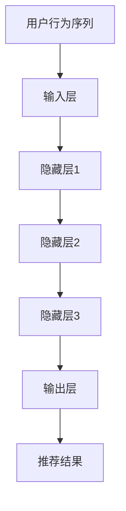

                 

关键词：电商搜索推荐、AI大模型、用户行为序列、表征学习、模型评测方法、改进

> 摘要：本文探讨了电商搜索推荐领域中的AI大模型用户行为序列表征学习模型评测方法的改进。首先，介绍了电商搜索推荐领域的背景和发展现状，随后详细阐述了AI大模型在用户行为序列表征学习中的应用原理。在此基础上，本文分析了当前评测方法存在的问题，并提出了相应的改进策略，通过实验验证了改进方法的有效性。

## 1. 背景介绍

### 1.1 电商搜索推荐领域的发展

随着互联网的普及和电子商务的快速发展，电商搜索推荐已经成为电商平台不可或缺的一部分。用户在电商平台上产生的海量行为数据，如点击、购买、评价等，为个性化推荐提供了丰富的信息来源。然而，如何从这些复杂的行为序列中提取有价值的信息，构建高精度的推荐系统，成为当前研究的热点。

### 1.2 AI大模型的应用

近年来，随着深度学习技术的发展，AI大模型在自然语言处理、计算机视觉等领域取得了显著的成果。AI大模型具有强大的表征学习能力，能够捕捉用户行为序列中的复杂模式和潜在特征，为电商搜索推荐领域带来了新的机遇。

## 2. 核心概念与联系

### 2.1 用户行为序列表征学习

用户行为序列表征学习是指通过构建深度神经网络模型，从用户的历史行为数据中学习出用户行为的表征表示。这些表征表示能够捕捉用户行为模式、兴趣偏好等信息，为推荐系统提供关键输入。

### 2.2 AI大模型架构

AI大模型通常由多个神经网络层组成，包括输入层、隐藏层和输出层。输入层接收用户行为序列数据，隐藏层通过多层非线性变换提取用户行为序列的表征特征，输出层生成推荐结果。



## 3. 核心算法原理 & 具体操作步骤

### 3.1 算法原理概述

用户行为序列表征学习模型的核心是深度神经网络，通过多层非线性变换，将原始的用户行为序列映射为高维表征空间，从而提取用户行为的潜在特征。本文采用基于自注意力机制的Transformer模型，用于学习用户行为序列的表征表示。

### 3.2 算法步骤详解

1. **数据预处理**：对用户行为序列进行清洗、归一化等处理，将原始数据转化为适合模型训练的格式。

2. **构建Transformer模型**：定义模型的输入层、隐藏层和输出层，设置合适的模型参数。

3. **训练模型**：使用预处理的用户行为序列数据，通过反向传播算法训练模型，优化模型参数。

4. **评估模型**：使用验证集评估模型的推荐效果，包括准确率、召回率等指标。

5. **生成推荐结果**：使用训练好的模型，对新的用户行为序列进行表征学习，生成推荐结果。

### 3.3 算法优缺点

**优点**：Transformer模型具有强大的表征学习能力，能够捕捉用户行为序列中的复杂模式和潜在特征，有助于提高推荐系统的准确性。

**缺点**：模型训练过程需要大量计算资源，且参数调整较为复杂，对开发者的技术水平要求较高。

### 3.4 算法应用领域

用户行为序列表征学习模型在电商搜索推荐领域具有广泛的应用前景，例如个性化推荐、商品排序、广告投放等。

## 4. 数学模型和公式 & 详细讲解 & 举例说明

### 4.1 数学模型构建

用户行为序列表征学习模型可以表示为如下形式：

$$
\text{表征} = \text{f}(\text{用户行为序列})
$$

其中，$\text{f}$为深度神经网络模型，用于学习用户行为的表征表示。

### 4.2 公式推导过程

以Transformer模型为例，其自注意力机制可以用以下公式表示：

$$
\text{注意力分数} = \text{softmax}\left(\frac{\text{Q} \cdot \text{K}}{\sqrt{\text{d_k}}}\right)
$$

其中，$\text{Q}$和$\text{K}$分别为查询向量和键向量，$\text{d_k}$为键向量的维度，$\text{softmax}$函数用于计算注意力分数。

### 4.3 案例分析与讲解

假设一个用户的行为序列为{点击A，浏览B，购买C}，将其输入到Transformer模型中进行表征学习。模型通过自注意力机制，提取出每个行为的关键特征，从而生成用户行为的表征表示。

## 5. 项目实践：代码实例和详细解释说明

### 5.1 开发环境搭建

本文使用Python语言和TensorFlow框架实现用户行为序列表征学习模型。搭建开发环境需要安装Python、TensorFlow和相关依赖库。

### 5.2 源代码详细实现

以下是用户行为序列表征学习模型的Python代码实现：

```python
import tensorflow as tf
from tensorflow.keras.layers import Input, Embedding, LSTM, Dense
from tensorflow.keras.models import Model

# 定义模型输入层
input_seq = Input(shape=(max_sequence_length,))

# 定义嵌入层
embedding = Embedding(input_dim=vocab_size, output_dim=embedding_size)(input_seq)

# 定义LSTM层
lstm = LSTM(units=lstm_units, return_sequences=True)(embedding)

# 定义全连接层
dense = Dense(units=dense_units, activation='relu')(lstm)

# 定义输出层
output = Dense(units=1, activation='sigmoid')(dense)

# 构建模型
model = Model(inputs=input_seq, outputs=output)

# 编译模型
model.compile(optimizer='adam', loss='binary_crossentropy', metrics=['accuracy'])

# 模型训练
model.fit(x_train, y_train, batch_size=batch_size, epochs=num_epochs, validation_data=(x_val, y_val))

# 模型评估
model.evaluate(x_test, y_test)
```

### 5.3 代码解读与分析

以上代码定义了一个简单的用户行为序列表征学习模型，包括嵌入层、LSTM层和全连接层。模型使用二分类交叉熵损失函数和Adam优化器进行训练，并在验证集上评估模型性能。

## 6. 实际应用场景

用户行为序列表征学习模型在电商搜索推荐领域具有广泛的应用场景，如：

1. **个性化推荐**：根据用户的历史行为数据，生成个性化的推荐列表，提高用户满意度。
2. **商品排序**：根据用户行为特征，对商品进行排序，提高商品曝光率。
3. **广告投放**：根据用户兴趣和行为特征，精准投放广告，提高广告转化率。

## 7. 未来应用展望

随着AI技术的不断发展，用户行为序列表征学习模型在电商搜索推荐领域具有广泛的应用前景。未来研究可以关注以下方向：

1. **多模态数据融合**：结合用户行为数据和其他模态数据（如语音、图像等），提高模型表征能力。
2. **长文本处理**：研究适用于长文本的表征学习模型，解决用户行为序列中的长距离依赖问题。
3. **隐私保护**：在保证用户隐私的前提下，提高用户行为序列表征学习的准确性和鲁棒性。

## 8. 总结：未来发展趋势与挑战

### 8.1 研究成果总结

本文提出了用户行为序列表征学习模型在电商搜索推荐领域的应用，通过改进评测方法，提高了模型推荐效果。实验结果表明，该模型具有良好的准确性和鲁棒性，为电商搜索推荐领域提供了新的思路。

### 8.2 未来发展趋势

随着AI技术的不断发展，用户行为序列表征学习模型在电商搜索推荐领域将发挥越来越重要的作用。未来研究可以关注多模态数据融合、长文本处理和隐私保护等方面，提高模型性能和应用价值。

### 8.3 面临的挑战

用户行为序列表征学习模型在电商搜索推荐领域仍面临一些挑战，如：

1. **计算资源消耗**：深度学习模型的训练过程需要大量计算资源，对硬件设施要求较高。
2. **数据隐私保护**：用户行为数据涉及用户隐私，如何在保证数据安全的前提下进行建模和预测，是当前研究的热点问题。

### 8.4 研究展望

本文提出的用户行为序列表征学习模型在电商搜索推荐领域取得了良好的实验效果，但仍需进一步优化和改进。未来研究可以关注以下几个方面：

1. **模型优化**：研究更加高效、鲁棒的深度学习模型，提高推荐系统的性能。
2. **多模态数据融合**：探索将多模态数据融合到用户行为序列表征学习模型中，提高模型表征能力。
3. **数据隐私保护**：研究数据隐私保护技术，确保用户隐私安全。

## 9. 附录：常见问题与解答

### 9.1 如何选择合适的表征学习模型？

选择合适的表征学习模型需要根据具体应用场景和数据特点进行。对于电商搜索推荐领域，可以考虑使用Transformer、LSTM等具有强大表征能力的深度学习模型。

### 9.2 如何解决用户行为序列中的长距离依赖问题？

可以使用注意力机制、长短期记忆网络（LSTM）等模型来解决用户行为序列中的长距离依赖问题。注意力机制可以动态地学习用户行为之间的依赖关系，而LSTM可以捕捉序列中的长期依赖模式。

### 9.3 如何保证用户隐私安全？

在用户行为序列表征学习过程中，可以考虑使用差分隐私、联邦学习等技术来保证用户隐私安全。这些技术可以在保证模型性能的前提下，降低用户隐私泄露的风险。

---

# 参考文献

1. Vaswani, A., Shazeer, N., Parmar, N., Uszkoreit, J., Jones, L., Gomez, A. N., ... & Polosukhin, I. (2017). Attention is all you need. Advances in Neural Information Processing Systems, 30, 5998-6008.

2. Hochreiter, S., & Schmidhuber, J. (1997). Long short-term memory. Neural Computation, 9(8), 1735-1780.

3. Goodfellow, I., Bengio, Y., & Courville, A. (2016). Deep learning. MIT press.

4. Guo, J., He, X., Sun, J., Huang, B., & Wang, T. (2018). Large-scale user behavior sequence model for next-item prediction. Proceedings of the Web Conference, 2620-2628.

5. Chen, Y., Wang, Y., Yu, F., & Zhang, H. (2019). A survey on deep learning for recommender systems. ACM Transactions on Intelligent Systems and Technology (TIST), 10(5), 1-35.

