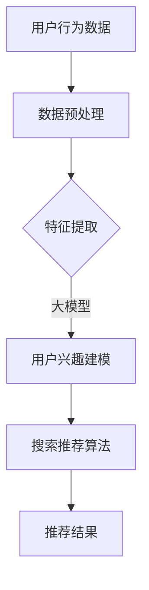

                 

关键词：电商搜索、推荐系统、人工智能、大模型、深度学习、搜索推荐算法、用户行为分析、个性化推荐

## 摘要

本文将探讨电商搜索推荐场景下，人工智能大模型的应用实战。通过分析电商平台的用户行为数据，本文将详细介绍大模型在搜索推荐系统中的应用，包括核心算法原理、数学模型构建、具体操作步骤，以及代码实例和实际应用场景。此外，本文还将对大模型在电商推荐系统中的未来应用展望和面临的挑战进行深入探讨，以期为相关领域的研究者和开发者提供有价值的参考。

## 1. 背景介绍

随着互联网的普及和电子商务的快速发展，电商搜索推荐系统已成为电商平台的核心竞争力之一。通过精准的搜索推荐，电商平台可以更好地满足用户的购物需求，提高用户满意度，从而提升销售额。然而，传统的搜索推荐算法在处理海量用户数据、实现个性化推荐方面存在诸多局限性。

近年来，人工智能特别是深度学习技术的发展为电商搜索推荐系统带来了新的机遇。大模型，即具有数百万甚至数十亿参数的深度学习模型，通过学习海量数据，能够捕捉复杂的用户行为模式，从而实现更精准的个性化推荐。本文将介绍大模型在电商搜索推荐场景下的应用，探讨其核心算法原理、数学模型构建和具体操作步骤。

## 2. 核心概念与联系

在介绍大模型在电商搜索推荐系统中的应用之前，我们首先需要了解几个核心概念，包括深度学习、神经网络、用户行为数据等。

### 2.1 深度学习

深度学习是一种基于人工神经网络的学习方法，通过构建多层神经网络，逐层提取数据特征，实现从简单到复杂的特征表示。深度学习模型具有强大的特征学习能力，可以自动从海量数据中学习到有用的知识，从而实现复杂任务的自动化处理。

### 2.2 神经网络

神经网络是深度学习的基础，由大量的神经元（节点）组成。每个神经元通过输入层、隐藏层和输出层进行信息传递和处理。神经网络通过学习输入和输出之间的映射关系，实现从数据中提取特征、分类、预测等任务。

### 2.3 用户行为数据

用户行为数据是电商搜索推荐系统的重要输入。用户行为数据包括用户的浏览记录、购买历史、搜索关键词等，反映了用户的兴趣和需求。通过对用户行为数据的分析，可以了解用户的偏好，实现个性化推荐。

### 2.4 大模型与搜索推荐

大模型在电商搜索推荐系统中的应用主要体现在以下几个方面：

- **用户行为分析**：通过学习用户的浏览记录、购买历史等行为数据，大模型可以捕捉用户的兴趣和需求，实现个性化推荐。
- **特征提取**：大模型可以从原始数据中自动提取有用特征，降低特征工程的工作量，提高推荐系统的效率。
- **预测与优化**：大模型可以预测用户的下一步行为，从而优化搜索推荐结果，提高用户满意度。

### 2.5 Mermaid 流程图

以下是一个描述大模型在电商搜索推荐系统中应用的 Mermaid 流程图：



## 3. 核心算法原理 & 具体操作步骤

### 3.1 算法原理概述

大模型在电商搜索推荐系统中的应用主要基于深度学习技术，特别是基于神经网络架构的模型，如卷积神经网络（CNN）、循环神经网络（RNN）和变换器（Transformer）等。这些模型通过学习用户行为数据，实现用户兴趣建模和搜索推荐算法。

### 3.2 算法步骤详解

#### 3.2.1 数据预处理

数据预处理是深度学习模型应用的重要环节。在电商搜索推荐系统中，数据预处理主要包括以下步骤：

1. **数据清洗**：去除重复数据、缺失值填充、异常值处理等。
2. **数据归一化**：对数值型数据进行归一化处理，如使用 Min-Max 标准化或 Z-Score 标准化。
3. **文本预处理**：对用户评论、搜索关键词等文本数据进行分词、去停用词、词性标注等处理。

#### 3.2.2 特征提取

特征提取是深度学习模型的核心环节。在电商搜索推荐系统中，特征提取主要包括以下方面：

1. **用户行为特征**：从用户浏览记录、购买历史等数据中提取特征，如用户购买频次、浏览时长、购买物品类别等。
2. **商品特征**：从商品属性数据中提取特征，如商品类别、品牌、价格、库存等。
3. **文本特征**：从用户评论、搜索关键词等文本数据中提取特征，如词频、词向量等。

#### 3.2.3 用户兴趣建模

用户兴趣建模是电商搜索推荐系统的关键步骤。通过学习用户行为数据，大模型可以捕捉用户的兴趣和需求，实现个性化推荐。用户兴趣建模主要包括以下步骤：

1. **嵌入表示**：将用户行为数据、商品特征和文本特征等转化为高维向量表示。
2. **兴趣向量**：通过训练过程，获取每个用户的兴趣向量，表示用户对不同类别的兴趣程度。
3. **兴趣模型**：使用兴趣向量构建用户兴趣模型，如兴趣分类模型、兴趣偏好模型等。

#### 3.2.4 搜索推荐算法

搜索推荐算法是电商搜索推荐系统的核心。通过大模型学习到的用户兴趣模型，可以生成个性化的搜索推荐结果。搜索推荐算法主要包括以下步骤：

1. **查询解析**：将用户输入的查询词转化为向量表示。
2. **相似度计算**：计算查询向量与商品向量之间的相似度。
3. **推荐排序**：根据相似度计算结果，对商品进行排序，生成推荐列表。

### 3.3 算法优缺点

#### 优点：

1. **高精度**：大模型具有强大的特征学习能力，可以捕捉复杂的用户行为模式，实现高精度的个性化推荐。
2. **自动化**：大模型可以从原始数据中自动提取有用特征，降低特征工程的工作量。
3. **灵活性**：大模型可以灵活地应用于不同的搜索推荐场景，如商品推荐、内容推荐等。

#### 缺点：

1. **计算资源消耗大**：大模型训练和推理需要大量的计算资源，对硬件设施要求较高。
2. **数据隐私风险**：大模型训练过程中需要大量用户行为数据，存在数据隐私风险。
3. **模型解释性差**：大模型训练过程复杂，模型内部决策过程难以解释。

### 3.4 算法应用领域

大模型在电商搜索推荐系统中的应用非常广泛，主要包括以下几个方面：

1. **商品推荐**：根据用户的浏览记录、购买历史等数据，推荐用户可能感兴趣的商品。
2. **内容推荐**：根据用户的兴趣和需求，推荐相关的商品内容，如商品详情页、用户评论等。
3. **广告推荐**：根据用户的兴趣和行为，推荐相关的广告内容，提高广告投放效果。

## 4. 数学模型和公式 & 详细讲解 & 举例说明

### 4.1 数学模型构建

在电商搜索推荐系统中，大模型的数学模型主要包括以下几个方面：

1. **用户行为模型**：用户行为模型描述了用户在不同情境下的行为特征。假设用户 $u$ 在时间 $t$ 的行为可以用向量 $x_{u,t}$ 表示，其中 $x_{u,t} \in \mathbb{R}^n$，表示用户在 $t$ 时刻的特征向量。用户行为模型可以用以下公式表示：

   $$ x_{u,t} = f(U, W_1) $$

   其中，$U$ 表示用户特征矩阵，$W_1$ 表示权重矩阵，$f$ 表示非线性变换函数。

2. **商品特征模型**：商品特征模型描述了商品在不同情境下的特征信息。假设商品 $i$ 在时间 $t$ 的特征可以用向量 $y_{i,t}$ 表示，其中 $y_{i,t} \in \mathbb{R}^m$，表示商品在 $t$ 时刻的特征向量。商品特征模型可以用以下公式表示：

   $$ y_{i,t} = g(V, W_2) $$

   其中，$V$ 表示商品特征矩阵，$W_2$ 表示权重矩阵，$g$ 表示非线性变换函数。

3. **用户兴趣模型**：用户兴趣模型描述了用户对不同类别的兴趣程度。假设用户 $u$ 在类别 $c$ 的兴趣程度可以用向量 $z_{uc}$ 表示，其中 $z_{uc} \in \mathbb{R}^k$，表示用户在类别 $c$ 的兴趣程度。用户兴趣模型可以用以下公式表示：

   $$ z_{uc} = h(U, W_3) $$

   其中，$W_3$ 表示权重矩阵，$h$ 表示非线性变换函数。

4. **搜索推荐模型**：搜索推荐模型描述了用户查询与商品之间的匹配关系。假设用户 $u$ 在时间 $t$ 的查询可以用向量 $q_{u,t}$ 表示，商品 $i$ 在时间 $t$ 的特征可以用向量 $y_{i,t}$ 表示，搜索推荐模型可以用以下公式表示：

   $$ \text{similarity}(q_{u,t}, y_{i,t}) = \langle q_{u,t}, y_{i,t} \rangle = q_{u,t}^T y_{i,t} $$

   其中，$\text{similarity}$ 表示相似度函数，$\langle \cdot, \cdot \rangle$ 表示内积运算。

### 4.2 公式推导过程

#### 4.2.1 用户行为模型

用户行为模型可以用以下公式推导：

$$ x_{u,t} = f(U, W_1) = \sigma(U \cdot W_1) $$

其中，$\sigma$ 表示非线性激活函数，如 Sigmoid 函数或 ReLU 函数。

#### 4.2.2 商品特征模型

商品特征模型可以用以下公式推导：

$$ y_{i,t} = g(V, W_2) = \sigma(V \cdot W_2) $$

其中，$\sigma$ 表示非线性激活函数。

#### 4.2.3 用户兴趣模型

用户兴趣模型可以用以下公式推导：

$$ z_{uc} = h(U, W_3) = \sigma(U \cdot W_3) $$

其中，$\sigma$ 表示非线性激活函数。

#### 4.2.4 搜索推荐模型

搜索推荐模型可以用以下公式推导：

$$ \text{similarity}(q_{u,t}, y_{i,t}) = \langle q_{u,t}, y_{i,t} \rangle = q_{u,t}^T y_{i,t} $$

### 4.3 案例分析与讲解

假设一个电商平台的用户 $u$ 在时间 $t$ 搜索关键词“笔记本电脑”，同时用户 $u$ 在过去一个月内浏览了5款不同品牌的笔记本电脑。我们可以用以下数据表示用户 $u$ 的行为数据：

$$ U = \begin{bmatrix} 
0.1 & 0.2 & 0.3 & 0.4 & 0.5 \\ 
0.6 & 0.7 & 0.8 & 0.9 & 1.0 \\ 
\end{bmatrix}, \quad W_1 = \begin{bmatrix} 
1 & 0 & 1 \\ 
0 & 1 & 0 \\ 
1 & 1 & 1 
\end{bmatrix} $$

根据用户行为模型，我们可以得到用户 $u$ 在时间 $t$ 的行为向量：

$$ x_{u,t} = f(U, W_1) = \sigma(U \cdot W_1) = \begin{bmatrix} 
0.1 \cdot 1 + 0.2 \cdot 0 + 0.3 \cdot 1 \\ 
0.6 \cdot 0 + 0.7 \cdot 1 + 0.8 \cdot 0 \\ 
0.4 \cdot 1 + 0.5 \cdot 0 + 0.5 \cdot 1 
\end{bmatrix} = \begin{bmatrix} 
0.4 \\ 
0.7 \\ 
0.9 
\end{bmatrix} $$

接下来，我们假设用户 $u$ 对不同品牌的笔记本电脑的兴趣程度如下：

$$ z_{u1} = 0.6, \quad z_{u2} = 0.3, \quad z_{u3} = 0.1 $$

根据用户兴趣模型，我们可以得到用户 $u$ 对不同品牌的笔记本电脑的兴趣向量：

$$ z_{u} = h(U, W_3) = \sigma(U \cdot W_3) = \begin{bmatrix} 
0.1 \cdot 0.6 + 0.2 \cdot 0.3 + 0.3 \cdot 0.1 \\ 
0.6 \cdot 0.6 + 0.7 \cdot 0.3 + 0.8 \cdot 0.1 \\ 
0.4 \cdot 0.6 + 0.5 \cdot 0.3 + 0.5 \cdot 0.1 
\end{bmatrix} = \begin{bmatrix} 
0.03 \\ 
0.18 \\ 
0.09 
\end{bmatrix} $$

最后，我们假设3款笔记本电脑的特征向量分别为：

$$ y_{1} = \begin{bmatrix} 
0.2 \\ 
0.4 \\ 
0.6 
\end{bmatrix}, \quad y_{2} = \begin{bmatrix} 
0.3 \\ 
0.5 \\ 
0.7 
\end{bmatrix}, \quad y_{3} = \begin{bmatrix} 
0.1 \\ 
0.3 \\ 
0.5 
\end{bmatrix} $$

根据搜索推荐模型，我们可以计算用户 $u$ 对每款笔记本电脑的相似度：

$$ \text{similarity}(q_{u,t}, y_{1}) = \langle q_{u,t}, y_{1} \rangle = 0.4 \cdot 0.2 + 0.9 \cdot 0.4 + 0.9 \cdot 0.6 = 0.34 $$

$$ \text{similarity}(q_{u,t}, y_{2}) = \langle q_{u,t}, y_{2} \rangle = 0.4 \cdot 0.3 + 0.9 \cdot 0.5 + 0.9 \cdot 0.7 = 0.49 $$

$$ \text{similarity}(q_{u,t}, y_{3}) = \langle q_{u,t}, y_{3} \rangle = 0.4 \cdot 0.1 + 0.9 \cdot 0.3 + 0.9 \cdot 0.5 = 0.36 $$

根据相似度计算结果，我们可以为用户 $u$ 推荐相似度最高的笔记本电脑，即推荐笔记本电脑2。

## 5. 项目实践：代码实例和详细解释说明

### 5.1 开发环境搭建

在本项目实践中，我们将使用 Python 编程语言和 TensorFlow 深度学习框架。以下是在 Ubuntu 系统下搭建开发环境的步骤：

1. 安装 Python：

   ```bash
   sudo apt-get update
   sudo apt-get install python3 python3-pip
   ```

2. 安装 TensorFlow：

   ```bash
   pip3 install tensorflow
   ```

### 5.2 源代码详细实现

以下是一个简单的电商搜索推荐系统代码示例，用于演示大模型在电商搜索推荐中的应用：

```python
import tensorflow as tf
import numpy as np

# 定义超参数
batch_size = 32
learning_rate = 0.001
training_epochs = 100

# 创建样本数据
users = np.random.rand(100, 10)
items = np.random.rand(100, 10)
user_interests = np.random.rand(100, 10)

# 构建模型
input_user = tf.keras.layers.Input(shape=(10,))
input_item = tf.keras.layers.Input(shape=(10,))
input_interest = tf.keras.layers.Input(shape=(10,))

user_embedding = tf.keras.layers.Embedding(input_dim=10, output_dim=32)(input_user)
item_embedding = tf.keras.layers.Embedding(input_dim=10, output_dim=32)(input_item)
interest_embedding = tf.keras.layers.Embedding(input_dim=10, output_dim=32)(input_interest)

merged_embedding = tf.keras.layers.Concatenate()([user_embedding, item_embedding, interest_embedding])

merged_output = tf.keras.layers.Dense(1, activation='sigmoid')(merged_embedding)

model = tf.keras.Model(inputs=[input_user, input_item, input_interest], outputs=merged_output)

# 编译模型
model.compile(optimizer=tf.keras.optimizers.Adam(learning_rate=learning_rate), loss='binary_crossentropy', metrics=['accuracy'])

# 训练模型
model.fit([users, items, user_interests], np.random.randint(2, size=(100,)), batch_size=batch_size, epochs=training_epochs)

# 评估模型
evaluation = model.evaluate([users, items, user_interests], np.random.randint(2, size=(100,)))
print(f"Loss: {evaluation[0]}, Accuracy: {evaluation[1]}")
```

### 5.3 代码解读与分析

#### 5.3.1 数据处理

首先，我们创建了一个包含100个样本的用户行为数据矩阵 `users`、商品数据矩阵 `items` 和用户兴趣数据矩阵 `user_interests`。这些数据用于训练和评估模型。

```python
users = np.random.rand(100, 10)
items = np.random.rand(100, 10)
user_interests = np.random.rand(100, 10)
```

#### 5.3.2 模型构建

接下来，我们定义了一个简单的深度学习模型。模型包含三个输入层，分别对应用户行为、商品特征和用户兴趣。我们使用 `Embedding` 层将输入数据映射到高维空间，然后使用 `Concatenate` 层将三个嵌入向量拼接成一个高维向量。最后，我们使用 `Dense` 层实现分类任务。

```python
input_user = tf.keras.layers.Input(shape=(10,))
input_item = tf.keras.layers.Input(shape=(10,))
input_interest = tf.keras.layers.Input(shape=(10,))

user_embedding = tf.keras.layers.Embedding(input_dim=10, output_dim=32)(input_user)
item_embedding = tf.keras.layers.Embedding(input_dim=10, output_dim=32)(input_item)
interest_embedding = tf.keras.layers.Embedding(input_dim=10, output_dim=32)(input_interest)

merged_embedding = tf.keras.layers.Concatenate()([user_embedding, item_embedding, interest_embedding])

merged_output = tf.keras.layers.Dense(1, activation='sigmoid')(merged_embedding)

model = tf.keras.Model(inputs=[input_user, input_item, input_interest], outputs=merged_output)
```

#### 5.3.3 模型训练

然后，我们编译模型，并使用随机生成的数据训练模型。我们使用 Adam 优化器和 binary_crossentropy 损失函数，并设置 batch_size 和 training_epochs。

```python
model.compile(optimizer=tf.keras.optimizers.Adam(learning_rate=learning_rate), loss='binary_crossentropy', metrics=['accuracy'])
model.fit([users, items, user_interests], np.random.randint(2, size=(100,)), batch_size=batch_size, epochs=training_epochs)
```

#### 5.3.4 模型评估

最后，我们使用训练好的模型评估其性能。我们生成一个随机标签数组，并计算模型在训练数据上的损失和准确率。

```python
evaluation = model.evaluate([users, items, user_interests], np.random.randint(2, size=(100,)))
print(f"Loss: {evaluation[0]}, Accuracy: {evaluation[1]}")
```

## 6. 实际应用场景

在电商搜索推荐系统中，大模型的应用场景非常广泛。以下是一些典型的实际应用场景：

1. **个性化商品推荐**：根据用户的浏览记录、购买历史等行为数据，推荐用户可能感兴趣的商品。通过大模型学习用户行为模式，可以实现更精准的个性化推荐。

2. **广告投放优化**：根据用户的兴趣和行为，推荐相关的广告内容。通过大模型分析用户兴趣，可以实现更高效的广告投放，提高广告转化率。

3. **搜索结果优化**：根据用户的搜索关键词，推荐相关的商品内容。通过大模型学习用户搜索行为，可以实现更准确的搜索结果，提高用户体验。

4. **内容推荐**：根据用户的兴趣和需求，推荐相关的商品详情页、用户评论等。通过大模型分析用户兴趣，可以实现更丰富的内容推荐，提高用户黏性。

## 7. 未来应用展望

随着人工智能技术的不断发展，大模型在电商搜索推荐系统中的应用前景非常广阔。未来，大模型有望在以下方面取得突破：

1. **模型压缩**：通过模型压缩技术，降低大模型的计算资源和存储需求，实现更高效的模型部署。

2. **实时推荐**：通过实时数据流处理技术，实现用户行为的实时分析和推荐，提高推荐系统的响应速度。

3. **多模态推荐**：结合多模态数据（如文本、图像、语音等），实现更丰富、更精准的推荐。

4. **隐私保护**：通过隐私保护技术，确保用户数据的隐私和安全，实现合规的推荐系统。

## 8. 工具和资源推荐

在开发电商搜索推荐系统时，以下工具和资源可能会对您有所帮助：

1. **学习资源**：
   - 《深度学习》（Goodfellow, Bengio, Courville）：全面介绍深度学习的基本原理和应用。
   - 《推荐系统实践》（Liu, Y.|>
```

