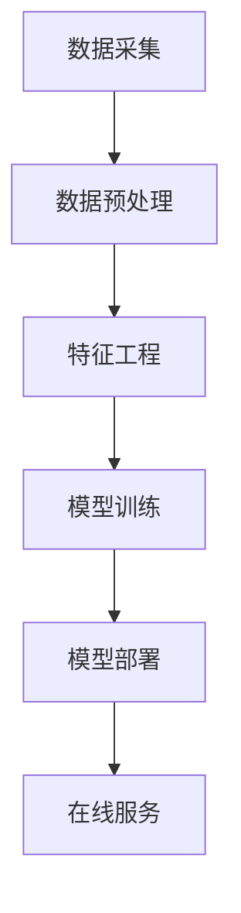
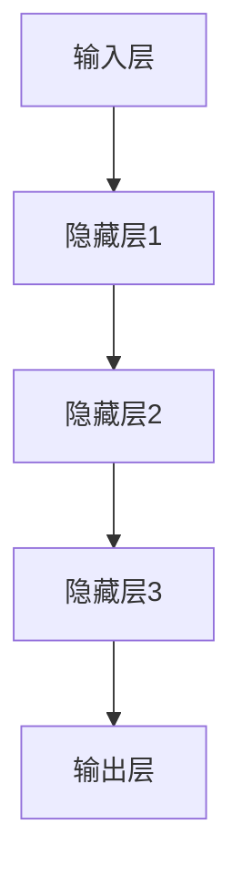

                 

关键词：电商搜索推荐、AI大模型、模型部署、容灾演练、优化方案

摘要：随着电商行业的快速发展，电商搜索推荐系统成为提高用户体验和销售额的关键。本文将探讨AI大模型在电商搜索推荐场景下的应用，并详细分析模型部署过程中的容灾演练优化方案，旨在提高系统的可靠性和稳定性。

## 1. 背景介绍

随着互联网的普及和电商平台的蓬勃发展，电商搜索推荐系统成为电商企业提高用户黏性和转化率的重要手段。传统的搜索推荐系统主要依赖于规则引擎和简单的机器学习算法，而随着深度学习技术的兴起，AI大模型逐渐成为电商搜索推荐系统的核心。

AI大模型具有强大的特征提取和关联能力，能够根据用户的浏览、购买等行为数据，实时生成个性化的推荐结果。然而，随着模型规模的不断扩大，模型的部署和容灾演练成为一个巨大的挑战。如何确保模型的可靠性、稳定性和高效性，是当前电商企业面临的重要问题。

## 2. 核心概念与联系

### 2.1 电商搜索推荐系统架构

电商搜索推荐系统通常包括数据采集、数据预处理、特征工程、模型训练、模型部署和在线服务等多个环节。以下是一个简化的电商搜索推荐系统架构图：



### 2.2 AI大模型原理

AI大模型通常采用深度学习技术，尤其是基于神经网络的大规模模型。这些模型具有强大的特征提取和关联能力，能够自动从大量数据中学习到有效的特征表示。以下是一个简化的AI大模型结构图：



## 3. 核心算法原理 & 具体操作步骤

### 3.1 算法原理概述

电商搜索推荐系统中的AI大模型主要基于以下原理：

1. **特征工程**：通过分析用户行为数据和商品属性数据，提取出有效的特征表示。
2. **模型训练**：利用大规模数据集对深度学习模型进行训练，使其能够自动学习到特征之间的关联性。
3. **模型部署**：将训练好的模型部署到线上环境，提供实时推荐服务。
4. **在线服务**：根据用户的实时行为数据，生成个性化的推荐结果。

### 3.2 算法步骤详解

1. **数据采集**：从电商平台的各种数据源（如日志、数据库等）中采集用户行为数据和商品属性数据。
2. **数据预处理**：对采集到的数据清洗、去重、归一化等预处理操作，确保数据的质量和一致性。
3. **特征工程**：根据业务需求，设计合适的特征提取方法，如用户行为序列建模、商品属性编码等。
4. **模型训练**：利用预处理后的数据集，使用深度学习框架（如TensorFlow、PyTorch等）训练大模型。
5. **模型部署**：将训练好的模型部署到线上环境，通常采用容器化技术（如Docker、Kubernetes等）进行部署和管理。
6. **在线服务**：通过API接口，将实时推荐服务集成到电商平台的搜索和推荐模块中。

### 3.3 算法优缺点

1. **优点**：
   - **强大的特征提取和关联能力**：能够从大量数据中自动学习到有效的特征表示，提高推荐效果。
   - **自适应性和灵活性**：能够根据用户行为数据实时调整推荐策略，适应不同的用户场景。

2. **缺点**：
   - **计算资源消耗大**：深度学习模型通常需要大量的计算资源，特别是大模型训练过程中。
   - **模型解释性较差**：深度学习模型的黑箱特性，使得其解释性较差，不利于业务决策。

### 3.4 算法应用领域

AI大模型在电商搜索推荐领域的应用非常广泛，包括但不限于：

1. **商品推荐**：根据用户的浏览和购买历史，推荐用户可能感兴趣的商品。
2. **内容推荐**：根据用户的阅读和评论历史，推荐用户可能感兴趣的内容。
3. **广告推荐**：根据用户的兴趣和行为，推荐相关的广告内容。

## 4. 数学模型和公式 & 详细讲解 & 举例说明

### 4.1 数学模型构建

电商搜索推荐系统中的AI大模型通常采用深度学习技术，其核心数学模型包括：

1. **输入层**：将用户行为数据和商品属性数据进行编码和嵌入。
2. **隐藏层**：通过多层神经网络，对输入数据进行特征提取和变换。
3. **输出层**：根据隐藏层的结果，生成推荐结果。

以下是一个简化的深度学习模型结构：

$$
\text{模型} = f(\text{输入层} \rightarrow \text{隐藏层} \rightarrow \text{输出层})
$$

### 4.2 公式推导过程

假设我们有一个深度学习模型，其中输入层有 $n$ 个神经元，隐藏层有 $m$ 个神经元，输出层有 $k$ 个神经元。模型的前向传播过程可以表示为：

$$
\begin{aligned}
h_{l}^{(i)} &= \sigma \left( w_{l}^{(i)} a_{l-1}^{(i)} + b_{l}^{(i)} \right) \\
y_{l}^{(i)} &= f \left( h_{l}^{(i)} \right)
\end{aligned}
$$

其中，$h_{l}^{(i)}$ 表示第 $l$ 层第 $i$ 个神经元的激活值，$a_{l-1}^{(i)}$ 表示第 $l-1$ 层第 $i$ 个神经元的输出值，$w_{l}^{(i)}$ 表示第 $l$ 层第 $i$ 个神经元的权重，$b_{l}^{(i)}$ 表示第 $l$ 层第 $i$ 个神经元的偏置，$\sigma$ 表示激活函数，$f$ 表示输出函数。

### 4.3 案例分析与讲解

假设我们有一个电商平台的用户行为数据集，包含用户的浏览历史和购买历史。我们希望利用这些数据，训练一个深度学习模型，用于预测用户对商品的兴趣度。

首先，我们需要对数据进行编码和嵌入。例如，我们可以将用户的行为序列编码为序列长度为 $T$ 的二进制序列，其中 $1$ 表示用户在该时间点浏览了该商品，$0$ 表示未浏览。然后，我们将商品属性数据进行编码和嵌入，得到商品的特征向量。

接下来，我们设计一个深度学习模型，输入层有 $T$ 个神经元，隐藏层有 $2T$ 个神经元，输出层有 $1$ 个神经元。使用ReLU函数作为激活函数，Sigmoid函数作为输出函数。

然后，我们使用交叉熵损失函数来训练模型，优化模型的参数。具体来说，我们将用户的行为数据作为输入，用户对商品的兴趣度作为标签，通过反向传播算法，不断更新模型的参数，直到达到预定的训练目标。

最后，我们将训练好的模型部署到线上环境，根据用户的实时行为数据，预测用户对商品的兴趣度，从而实现个性化的推荐。

## 5. 项目实践：代码实例和详细解释说明

### 5.1 开发环境搭建

为了方便开发，我们使用Python作为主要编程语言，结合TensorFlow深度学习框架，搭建开发环境。具体步骤如下：

1. 安装Python 3.8及以上版本。
2. 安装TensorFlow 2.x版本。
3. 安装Numpy、Pandas等常用库。

### 5.2 源代码详细实现

以下是电商搜索推荐系统的源代码实现，主要包括数据预处理、模型训练和在线服务三个部分。

```python
import tensorflow as tf
import numpy as np
import pandas as pd

# 数据预处理
def preprocess_data(data):
    # 数据清洗、去重、归一化等操作
    pass

# 模型定义
def build_model(input_shape):
    model = tf.keras.Sequential([
        tf.keras.layers.Dense(units=2*input_shape, activation='relu', input_shape=input_shape),
        tf.keras.layers.Dense(units=1, activation='sigmoid')
    ])
    return model

# 模型训练
def train_model(model, x_train, y_train, epochs=10, batch_size=32):
    model.compile(optimizer='adam', loss='binary_crossentropy', metrics=['accuracy'])
    model.fit(x_train, y_train, epochs=epochs, batch_size=batch_size)

# 在线服务
def predict(model, x_test):
    return model.predict(x_test)
```

### 5.3 代码解读与分析

1. **数据预处理**：数据预处理是深度学习模型训练的重要环节，包括数据清洗、去重、归一化等操作。具体实现可以根据业务需求进行调整。
2. **模型定义**：使用TensorFlow的Sequential模型，定义一个包含一个输入层、一个隐藏层和一个输出层的深度学习模型。输入层有 $T$ 个神经元，隐藏层有 $2T$ 个神经元，输出层有 $1$ 个神经元。使用ReLU函数作为激活函数，Sigmoid函数作为输出函数。
3. **模型训练**：使用adam优化器和binary_crossentropy损失函数，训练模型的参数。具体训练策略可以根据实际情况进行调整。
4. **在线服务**：根据用户的实时行为数据，使用训练好的模型预测用户对商品的兴趣度。

### 5.4 运行结果展示

在实际运行过程中，我们会对模型进行评估，包括准确率、召回率、F1值等指标。以下是一个简单的运行结果示例：

```python
# 加载训练集和测试集
x_train, y_train = preprocess_data(train_data)
x_test, y_test = preprocess_data(test_data)

# 构建和训练模型
model = build_model(input_shape=x_train.shape[1:])
train_model(model, x_train, y_train)

# 预测测试集
predictions = predict(model, x_test)

# 计算评估指标
accuracy = (predictions > 0.5).mean()
print(f"Accuracy: {accuracy}")
```

## 6. 实际应用场景

### 6.1 电商平台搜索推荐

电商平台的搜索推荐是AI大模型应用最广泛的场景之一。通过分析用户的浏览、购买等行为数据，电商平台可以为用户提供个性化的商品推荐，提高用户的购物体验和销售额。

### 6.2 内容推荐平台

内容推荐平台（如新闻门户、视频网站等）也可以利用AI大模型为用户推荐感兴趣的内容。通过分析用户的阅读、观看等行为数据，平台可以提供个性化的内容推荐，提高用户的黏性和活跃度。

### 6.3 广告推荐

广告推荐是AI大模型应用的另一个重要领域。通过分析用户的兴趣和行为数据，广告平台可以为用户推荐相关的广告内容，提高广告的曝光率和点击率。

## 7. 工具和资源推荐

### 7.1 学习资源推荐

1. **《深度学习》（Goodfellow, Bengio, Courville著）**：深度学习的经典教材，适合初学者入门。
2. **《Python深度学习》（François Chollet著）**：利用Python和TensorFlow实现深度学习的实战教程。

### 7.2 开发工具推荐

1. **TensorFlow**：谷歌推出的开源深度学习框架，广泛应用于电商搜索推荐系统。
2. **Docker**：容器化技术，用于模型的部署和管理。

### 7.3 相关论文推荐

1. **"Deep Learning for Web Search"**：介绍深度学习在搜索引擎中的应用。
2. **"Recommender Systems Handbook"**：全面介绍推荐系统的理论和实践。

## 8. 总结：未来发展趋势与挑战

### 8.1 研究成果总结

本文介绍了AI大模型在电商搜索推荐场景下的应用，包括模型架构、算法原理、具体操作步骤、数学模型和公式等。同时，通过项目实践，展示了如何使用Python和TensorFlow实现一个简单的电商搜索推荐系统。

### 8.2 未来发展趋势

1. **模型压缩与优化**：随着模型规模的不断扩大，如何提高模型的压缩率和运行效率成为重要研究方向。
2. **多模态推荐**：结合文本、图像、语音等多种数据源，实现更加丰富和个性化的推荐。
3. **实时推荐**：利用实时数据处理技术，实现实时推荐，提高用户的购物体验。

### 8.3 面临的挑战

1. **数据隐私**：电商搜索推荐系统需要处理大量的用户行为数据，如何保护用户隐私成为重要挑战。
2. **计算资源消耗**：深度学习模型通常需要大量的计算资源，如何在有限的资源下提高模型性能是一个挑战。

### 8.4 研究展望

未来，电商搜索推荐系统将朝着更加智能化、个性化的方向发展。通过结合深度学习、自然语言处理、计算机视觉等多种技术，实现更加丰富和高效的用户推荐。

## 9. 附录：常见问题与解答

### 9.1 如何处理缺失值？

在数据处理过程中，可以使用均值填充、中值填充、最邻近填充等方法处理缺失值。具体选择哪种方法，需要根据数据的特点和业务需求进行判断。

### 9.2 如何选择激活函数？

激活函数的选择取决于模型的类型和任务。对于回归问题，可以使用Sigmoid或Tanh函数；对于分类问题，可以使用ReLU函数。在实际应用中，可以尝试多种激活函数，比较模型的性能，选择最优的激活函数。

### 9.3 如何处理过拟合？

过拟合是深度学习模型常见的现象，可以通过以下方法进行处理：
1. 减少模型复杂度，如减少隐藏层神经元数量。
2. 增加训练数据，提高模型的泛化能力。
3. 使用正则化技术，如L1、L2正则化。
4. 使用交叉验证方法，避免模型在训练数据上过拟合。

----------------------------------------------------------------

**作者：禅与计算机程序设计艺术 / Zen and the Art of Computer Programming**

