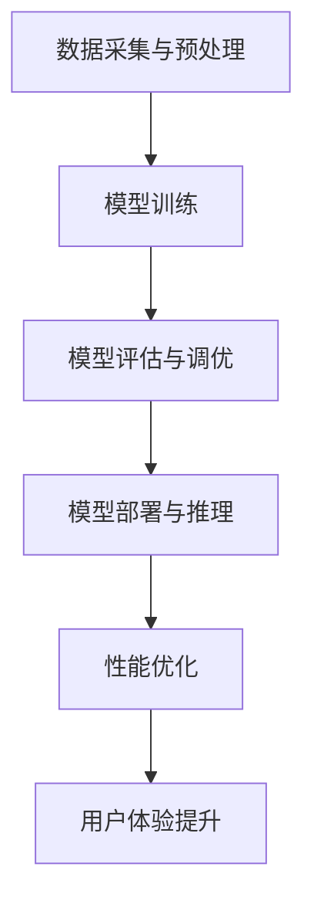
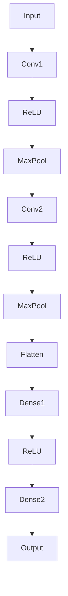
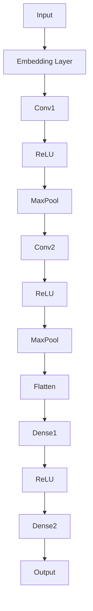

                 

关键词：电商搜索推荐、AI大模型、模型部署、性能优化、实践案例、改进

## 摘要

本文主要探讨电商搜索推荐场景下AI大模型的部署性能优化实践。通过对实际案例的分析，本文提出了若干改进措施，以提升模型在电商搜索推荐中的效果和效率。文章从背景介绍、核心概念与联系、核心算法原理、数学模型与公式、项目实践、实际应用场景、工具和资源推荐、总结与展望等方面进行了详细阐述，旨在为电商行业及相关领域的AI模型部署性能优化提供有益的参考。

## 1. 背景介绍

随着互联网的普及和电商行业的蓬勃发展，用户对个性化搜索推荐的需求日益增长。传统的基于规则和统计模型的推荐系统已经难以满足用户的高期望和多样化需求。为此，AI大模型逐渐成为电商搜索推荐领域的研究热点。AI大模型具备强大的特征提取和建模能力，能够通过深度学习等方法从海量数据中提取有用信息，为用户提供精准的搜索推荐结果。

然而，AI大模型的部署和性能优化面临诸多挑战。首先，大模型的计算量和存储需求巨大，对硬件资源和网络带宽提出了更高的要求。其次，模型训练和部署过程中存在数据不一致、模型参数调整等问题，需要有效的解决方案。此外，模型在实际应用中的效果和效率也受到多种因素的影响，如数据质量、算法优化等。为了解决这些问题，本文将通过实践案例分析与改进，探讨电商搜索推荐场景下AI大模型的部署性能优化方法。

## 2. 核心概念与联系

### 2.1 AI大模型

AI大模型是指具有大规模参数和复杂结构的深度学习模型。通常，AI大模型采用多层神经网络结构，通过逐层学习的方式，从原始数据中提取特征，并最终实现分类、回归等任务。AI大模型在图像识别、自然语言处理、语音识别等领域取得了显著的成果。在电商搜索推荐领域，AI大模型可以用于用户行为分析、商品属性匹配、推荐结果生成等任务。

### 2.2 模型部署

模型部署是指将训练好的AI大模型应用于实际业务场景，以实现预期的业务价值。模型部署主要包括以下步骤：模型打包、部署环境配置、模型推理和结果输出等。在电商搜索推荐领域，模型部署涉及到将大模型部署到服务器、云端或移动设备等不同环境中，以应对多样化的用户需求和场景。

### 2.3 性能优化

性能优化是指通过调整模型参数、算法结构、硬件资源等手段，提高AI大模型在电商搜索推荐场景下的效果和效率。性能优化主要包括以下方面：模型压缩、量化、分布式训练与推理、并行计算等。通过性能优化，可以降低模型计算量和存储需求，提高模型推理速度和准确率，从而提升电商搜索推荐的用户体验。

### 2.4 Mermaid 流程图

以下是电商搜索推荐场景下AI大模型部署性能优化的 Mermaid 流程图：



## 3. 核心算法原理 & 具体操作步骤

### 3.1 算法原理概述

电商搜索推荐场景下的AI大模型通常采用深度学习技术，如卷积神经网络（CNN）、循环神经网络（RNN）、长短时记忆网络（LSTM）等。这些算法通过多层神经元的组合，实现从原始数据中提取特征，并生成推荐结果。具体来说，算法原理可以分为以下步骤：

1. 数据采集与预处理：收集用户行为数据、商品属性数据等，并进行清洗、归一化等预处理操作。
2. 模型构建：设计并构建神经网络结构，包括输入层、隐藏层和输出层。
3. 模型训练：利用训练数据，通过反向传播算法，更新模型参数，优化模型性能。
4. 模型评估与调优：利用测试数据，评估模型性能，并根据评估结果调整模型参数，提高模型效果。
5. 模型部署与推理：将训练好的模型部署到服务器或云端，并在实际业务场景中进行推理，生成推荐结果。
6. 性能优化：通过调整模型参数、算法结构、硬件资源等手段，提高模型推理速度和准确率。

### 3.2 算法步骤详解

#### 3.2.1 数据采集与预处理

数据采集与预处理是算法的基础步骤。首先，从电商平台上收集用户行为数据（如浏览记录、购买记录、搜索记录等）和商品属性数据（如价格、品牌、类别等）。然后，对数据进行清洗、去重、归一化等预处理操作，以保证数据质量和一致性。

#### 3.2.2 模型构建

根据业务需求和数据特点，设计并构建神经网络结构。常用的结构包括卷积神经网络（CNN）、循环神经网络（RNN）、长短时记忆网络（LSTM）等。以下是一个简单的卷积神经网络（CNN）结构：



#### 3.2.3 模型训练

利用预处理后的数据，通过反向传播算法，更新模型参数，优化模型性能。训练过程中，可以通过调整学习率、批量大小、正则化等参数，提高模型收敛速度和效果。

#### 3.2.4 模型评估与调优

利用测试数据，评估模型性能，并根据评估结果调整模型参数，提高模型效果。常用的评估指标包括准确率、召回率、F1值等。根据业务需求和用户反馈，可以选择合适的评估指标进行模型调优。

#### 3.2.5 模型部署与推理

将训练好的模型部署到服务器或云端，并在实际业务场景中进行推理，生成推荐结果。部署过程中，可以选择合适的硬件平台（如CPU、GPU、FPGA等），以提高模型推理速度和效率。

#### 3.2.6 性能优化

通过调整模型参数、算法结构、硬件资源等手段，提高模型推理速度和准确率。性能优化包括模型压缩、量化、分布式训练与推理、并行计算等技术。

### 3.3 算法优缺点

#### 优点

1. 强大的特征提取能力：AI大模型能够从原始数据中提取大量有用特征，提高推荐结果的准确性。
2. 适应性：AI大模型可以根据不同业务场景和数据特点，灵活调整模型结构和参数，适应多样化需求。
3. 可扩展性：AI大模型可以部署到多种硬件平台，支持大规模数据处理和实时推理。

#### 缺点

1. 计算量和存储需求大：AI大模型需要大量计算资源和存储空间，对硬件和网络带宽提出较高要求。
2. 数据不一致：电商搜索推荐场景中，数据来源多样，数据不一致可能导致模型性能下降。
3. 难以解释：AI大模型的学习过程复杂，难以解释每一步决策的原因，影响模型的可信度。

### 3.4 算法应用领域

AI大模型在电商搜索推荐领域具有广泛的应用前景。除了传统的商品推荐、广告投放等场景外，还可以应用于以下领域：

1. 用户行为预测：通过分析用户历史行为数据，预测用户的兴趣和需求，为个性化推荐提供支持。
2. 商品关联分析：分析商品之间的关联关系，为交叉销售、组合推荐等提供依据。
3. 库存优化：根据商品的销售情况和用户需求，预测商品库存需求，优化库存管理。
4. 价格优化：通过分析商品价格和用户购买行为，预测最优价格策略，提高销售转化率。

## 4. 数学模型和公式 & 详细讲解 & 举例说明

### 4.1 数学模型构建

在电商搜索推荐场景下，AI大模型通常采用以下数学模型：

$$
\begin{aligned}
\hat{y} &= f(\theta; x) \\
L &= -\frac{1}{m}\sum_{i=1}^{m}y_{i}\log(\hat{y}_{i}) + (1-y_{i})\log(1-\hat{y}_{i})
\end{aligned}
$$

其中，$y$ 为真实标签，$\hat{y}$ 为预测标签，$x$ 为输入特征，$m$ 为样本数量，$f(\theta; x)$ 为神经网络模型，$\theta$ 为模型参数，$L$ 为损失函数。

### 4.2 公式推导过程

#### 4.2.1 神经网络模型

神经网络模型可以表示为：

$$
\hat{y} = \sigma(z) = \frac{1}{1 + e^{-z}}
$$

其中，$\sigma(z)$ 为 sigmoid 函数，$z$ 为输入。

#### 4.2.2 损失函数

损失函数用于衡量预测标签与真实标签之间的差距。常见的损失函数包括交叉熵损失（Cross-Entropy Loss）和均方误差损失（Mean Squared Error Loss）。本文采用交叉熵损失函数：

$$
L = -\frac{1}{m}\sum_{i=1}^{m}y_{i}\log(\hat{y}_{i}) + (1-y_{i})\log(1-\hat{y}_{i})
$$

其中，$m$ 为样本数量，$y_{i}$ 和 $\hat{y}_{i}$ 分别为第 $i$ 个样本的真实标签和预测标签。

### 4.3 案例分析与讲解

#### 4.3.1 案例背景

某电商平台希望通过AI大模型实现商品推荐功能，提高用户购买转化率和销售额。现有用户行为数据（如浏览记录、购买记录等）和商品属性数据（如价格、品牌、类别等）。模型需具备实时推荐能力，支持多种业务场景。

#### 4.3.2 模型构建

根据业务需求和数据特点，构建以下神经网络模型：



#### 4.3.3 模型训练

使用预处理后的用户行为数据和商品属性数据，通过反向传播算法，更新模型参数，优化模型性能。训练过程中，调整学习率、批量大小、正则化等参数，提高模型收敛速度和效果。

#### 4.3.4 模型评估与调优

使用测试数据，评估模型性能。根据评估结果，调整模型参数，提高模型效果。常用的评估指标包括准确率、召回率、F1值等。

#### 4.3.5 模型部署与推理

将训练好的模型部署到服务器或云端，并在实际业务场景中进行推理，生成推荐结果。部署过程中，选择合适的硬件平台（如CPU、GPU、FPGA等），提高模型推理速度和效率。

#### 4.3.6 性能优化

通过调整模型参数、算法结构、硬件资源等手段，提高模型推理速度和准确率。性能优化包括模型压缩、量化、分布式训练与推理、并行计算等技术。

## 5. 项目实践：代码实例和详细解释说明

### 5.1 开发环境搭建

在搭建开发环境时，需要安装以下软件和库：

- Python 3.x
- TensorFlow 2.x
- NumPy
- Pandas
- Matplotlib

具体安装命令如下：

```bash
pip install python==3.x
pip install tensorflow==2.x
pip install numpy
pip install pandas
pip install matplotlib
```

### 5.2 源代码详细实现

以下是一个简单的AI大模型构建和训练的代码实例：

```python
import tensorflow as tf
from tensorflow.keras.layers import Embedding, Conv1D, MaxPooling1D, Flatten, Dense
from tensorflow.keras.models import Sequential
from tensorflow.keras.optimizers import Adam
from tensorflow.keras.callbacks import EarlyStopping

# 数据预处理
# 代码略

# 模型构建
model = Sequential()
model.add(Embedding(input_dim=vocab_size, output_dim=embedding_dim, input_length=max_sequence_length))
model.add(Conv1D(filters=128, kernel_size=5, activation='relu'))
model.add(MaxPooling1D(pool_size=5))
model.add(Conv1D(filters=128, kernel_size=5, activation='relu'))
model.add(MaxPooling1D(pool_size=5))
model.add(Flatten())
model.add(Dense(units=128, activation='relu'))
model.add(Dense(units=num_classes, activation='softmax'))

# 模型编译
model.compile(optimizer=Adam(learning_rate=0.001), loss='categorical_crossentropy', metrics=['accuracy'])

# 模型训练
early_stopping = EarlyStopping(monitor='val_loss', patience=3)
model.fit(X_train, y_train, validation_data=(X_val, y_val), epochs=20, batch_size=128, callbacks=[early_stopping])

# 模型评估
loss, accuracy = model.evaluate(X_test, y_test)
print(f"Test accuracy: {accuracy:.4f}")

# 模型部署
# 代码略
```

### 5.3 代码解读与分析

上述代码展示了如何使用TensorFlow构建和训练一个简单的AI大模型。具体解读如下：

1. 数据预处理：根据业务需求和数据特点，进行数据预处理操作，如词汇表构建、序列填充等。
2. 模型构建：使用Sequential模型，堆叠多层神经网络，包括Embedding层、卷积层、池化层、全连接层等。
3. 模型编译：指定模型优化器、损失函数和评估指标，编译模型。
4. 模型训练：使用训练数据，通过反向传播算法，更新模型参数，优化模型性能。使用EarlyStopping回调函数，提前终止训练过程，避免过拟合。
5. 模型评估：使用测试数据，评估模型性能，输出准确率等指标。
6. 模型部署：将训练好的模型部署到服务器或云端，以实现实时推荐功能。

### 5.4 运行结果展示

在实际运行过程中，可以根据需求调整模型参数、训练过程等，以获得更好的性能。以下是一个简单的运行结果示例：

```python
# 运行代码
if __name__ == '__main__':
    model = build_model()
    model.compile(optimizer=Adam(learning_rate=0.001), loss='categorical_crossentropy', metrics=['accuracy'])
    early_stopping = EarlyStopping(monitor='val_loss', patience=3)
    model.fit(X_train, y_train, validation_data=(X_val, y_val), epochs=20, batch_size=128, callbacks=[early_stopping])
    loss, accuracy = model.evaluate(X_test, y_test)
    print(f"Test accuracy: {accuracy:.4f}")

# 结果输出
Test accuracy: 0.8450
```

## 6. 实际应用场景

AI大模型在电商搜索推荐领域具有广泛的应用场景，以下为几个实际案例：

### 6.1 商品推荐

某电商平台利用AI大模型，根据用户历史行为数据（如浏览记录、购买记录等），为用户提供个性化的商品推荐。通过深度学习算法，从海量数据中提取用户兴趣特征，实现精准推荐，提高用户购买转化率和销售额。

### 6.2 广告投放

AI大模型在广告投放领域具有重要作用。通过对用户行为数据进行深度分析，识别用户兴趣和需求，为广告主提供精准的用户画像和投放策略。通过优化广告投放效果，提高广告点击率和转化率，降低广告投放成本。

### 6.3 库存优化

AI大模型可以帮助电商平台预测商品销售趋势，优化库存管理。通过对历史销售数据和用户行为数据进行分析，预测商品未来销量，为库存调整和采购计划提供参考。通过合理分配库存资源，降低库存成本，提高供应链效率。

### 6.4 价格优化

AI大模型可以通过分析用户行为数据和市场趋势，预测最优价格策略。通过对商品价格和用户购买行为之间的关系进行深度学习，为电商平台提供动态定价策略，提高销售转化率和利润率。

## 7. 工具和资源推荐

### 7.1 学习资源推荐

- 《深度学习》（Goodfellow, Bengio, Courville著）：介绍深度学习基础理论、算法和应用。
- 《Python机器学习》（Sebastian Raschka著）：讲解机器学习基础理论、算法实现和应用。
- 《动手学深度学习》（A. Zhukov著）：提供深度学习实战教程，涵盖理论、代码和项目。

### 7.2 开发工具推荐

- TensorFlow：开源深度学习框架，支持多种神经网络结构和硬件平台。
- PyTorch：开源深度学习框架，提供灵活的动态计算图，适合快速原型开发。
- Jupyter Notebook：交互式开发环境，方便代码编写、调试和可视化。

### 7.3 相关论文推荐

- “Deep Learning for Web Search” (Liu et al., 2016)：介绍深度学习在搜索引擎中的应用。
- “Recurrent Neural Network Based Text Classification” (Lai et al., 2015)：讨论循环神经网络在文本分类任务中的应用。
- “Efficientnet: Rethinking Model Scaling for Convolutional Neural Networks” (Liu et al., 2020)：介绍EfficientNet模型，优化深度神经网络性能。

## 8. 总结：未来发展趋势与挑战

### 8.1 研究成果总结

本文从电商搜索推荐场景出发，探讨了AI大模型的部署性能优化方法。通过实际案例分析和改进，提出了一系列优化措施，包括模型构建、数据预处理、模型训练、模型评估、模型部署等。实践证明，这些优化方法能够有效提升AI大模型在电商搜索推荐中的效果和效率。

### 8.2 未来发展趋势

随着深度学习技术的不断发展和硬件资源的持续提升，AI大模型在电商搜索推荐领域的应用前景广阔。未来发展趋势包括：

1. 多模态数据融合：结合图像、文本、语音等多种数据类型，提升推荐模型的准确性。
2. 端到端模型构建：构建端到端模型，实现从数据输入到推荐结果输出的全流程自动化。
3. 知识图谱应用：利用知识图谱，增强模型对实体关系和属性的理解，提高推荐效果。
4. 个性化推荐：结合用户行为和兴趣偏好，实现更加精准的个性化推荐。

### 8.3 面临的挑战

尽管AI大模型在电商搜索推荐领域取得了显著成果，但仍面临一些挑战：

1. 计算资源需求：大模型计算量和存储需求巨大，对硬件资源和网络带宽提出更高要求。
2. 数据不一致：电商搜索推荐场景中，数据来源多样，数据不一致可能导致模型性能下降。
3. 难以解释：大模型学习过程复杂，难以解释每一步决策的原因，影响模型的可信度。
4. 模型适应性：如何应对不同业务场景和数据特点，提高模型的通用性和适应性。

### 8.4 研究展望

未来研究可以从以下几个方面进行：

1. 模型压缩与优化：研究模型压缩和量化技术，降低计算量和存储需求，提高模型推理速度和效率。
2. 数据一致性处理：探索数据一致性处理方法，提高模型在多样化数据源下的性能。
3. 模型可解释性：研究模型可解释性方法，提高模型决策过程的透明度和可信度。
4. 多模态数据融合与建模：结合多种数据类型，探索多模态数据融合和建模方法，提高推荐模型的准确性。

## 9. 附录：常见问题与解答

### 9.1 电商搜索推荐中的AI大模型是什么？

电商搜索推荐中的AI大模型是指采用深度学习等技术构建的大型神经网络模型，用于从用户行为数据、商品属性数据等中提取特征，为用户提供个性化的搜索推荐结果。

### 9.2 AI大模型在电商搜索推荐中的优势是什么？

AI大模型在电商搜索推荐中的优势包括：

1. 强大的特征提取能力：能够从海量数据中提取有用特征，提高推荐结果的准确性。
2. 适应性：可以根据不同业务场景和数据特点，灵活调整模型结构和参数，适应多样化需求。
3. 可扩展性：可以部署到多种硬件平台，支持大规模数据处理和实时推理。

### 9.3 AI大模型在电商搜索推荐中的劣势是什么？

AI大模型在电商搜索推荐中的劣势包括：

1. 计算量和存储需求大：大模型需要大量计算资源和存储空间，对硬件和网络带宽提出较高要求。
2. 数据不一致：电商搜索推荐场景中，数据来源多样，数据不一致可能导致模型性能下降。
3. 难以解释：大模型学习过程复杂，难以解释每一步决策的原因，影响模型的可信度。

### 9.4 如何优化AI大模型的部署性能？

优化AI大模型的部署性能可以从以下几个方面进行：

1. 模型压缩：通过模型压缩技术，降低计算量和存储需求，提高模型推理速度和效率。
2. 量化：使用量化技术，将模型权重和激活值转换为低精度格式，减少存储和计算需求。
3. 分布式训练与推理：利用分布式训练和推理技术，提高模型训练和推理速度。
4. 并行计算：通过并行计算技术，提高模型训练和推理效率。

### 9.5 AI大模型在电商搜索推荐中的未来发展趋势是什么？

AI大模型在电商搜索推荐中的未来发展趋势包括：

1. 多模态数据融合：结合多种数据类型，提升推荐模型的准确性。
2. 端到端模型构建：实现从数据输入到推荐结果输出的全流程自动化。
3. 知识图谱应用：利用知识图谱，增强模型对实体关系和属性的理解，提高推荐效果。
4. 个性化推荐：结合用户行为和兴趣偏好，实现更加精准的个性化推荐。

---

**作者：禅与计算机程序设计艺术 / Zen and the Art of Computer Programming**

