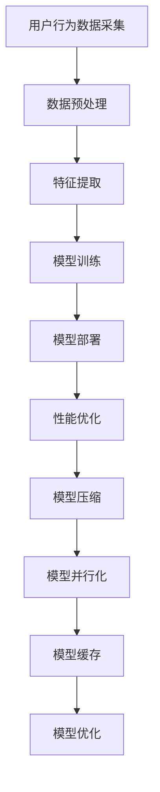

                 

关键词：电商搜索推荐，AI大模型，模型部署，性能优化，工具应用

> 摘要：本文深入探讨了电商搜索推荐场景下AI大模型模型部署的性能优化问题。首先，我们对电商搜索推荐的基本原理和场景进行了介绍。然后，详细分析了AI大模型在电商搜索推荐中的关键作用，并探讨了如何通过性能优化工具提升模型部署的效率。最后，本文总结了未来发展的趋势与挑战，为电商搜索推荐领域的AI技术应用提供了有价值的参考。

## 1. 背景介绍

在当今的电子商务领域，用户体验至关重要。一个高效的搜索推荐系统可以帮助电商平台吸引用户，提高用户粘性和销售额。传统的搜索推荐方法主要基于规则和统计模型，但这些方法往往难以处理复杂的用户行为和海量数据。随着人工智能技术的不断发展，特别是深度学习和大规模模型的出现，AI大模型在电商搜索推荐场景中的应用变得越来越广泛。

AI大模型，如深度神经网络（DNN）、变换器模型（Transformer）等，通过学习大量的用户行为数据，可以自动提取有效的特征，并生成个性化的推荐结果。这些模型通常具有强大的表示能力和泛化能力，能够为用户提供更加精准的推荐。然而，模型部署的性能优化是一个不可忽视的问题。性能优化的目标是在保证模型准确性的前提下，提高模型的部署效率，降低成本，满足实时推荐的需求。

本文旨在介绍电商搜索推荐场景下AI大模型模型部署的性能优化问题，通过详细分析和探讨，为电商平台的搜索推荐系统提供实用的优化工具和方法。

## 2. 核心概念与联系

### 2.1 电商搜索推荐原理

电商搜索推荐系统的核心在于理解用户的行为和偏好，从而提供个性化的商品推荐。这一过程通常包括以下几个步骤：

1. **用户行为数据采集**：通过网站点击、购买、搜索等行为，收集用户的兴趣和偏好信息。
2. **数据预处理**：对采集到的用户行为数据清洗、去重、编码等处理，为后续模型训练做好准备。
3. **特征提取**：利用机器学习算法提取用户行为数据中的关键特征，如用户浏览历史、购买记录、搜索关键词等。
4. **模型训练**：使用提取的特征训练深度学习模型，如DNN、Transformer等。
5. **模型部署**：将训练好的模型部署到线上环境，为用户提供实时搜索推荐服务。

### 2.2 AI大模型原理

AI大模型通常指的是具有数亿甚至千亿级参数的深度学习模型。这些模型通过大量数据的训练，可以自动学习复杂的特征表示，并在各种任务中表现出色。AI大模型的核心原理包括：

1. **大规模参数**：通过增加模型参数的数量，提高模型的表示能力。
2. **深度网络结构**：通过增加网络层数，增强模型的层次化特征提取能力。
3. **端到端学习**：将输入数据直接映射到输出结果，无需手动提取特征。

### 2.3 模型部署性能优化

模型部署性能优化主要包括以下几个方面：

1. **模型压缩**：通过剪枝、量化等技术，减少模型参数的数量，降低模型大小，提高部署效率。
2. **模型并行化**：通过分布式计算技术，将模型训练和推理过程分布到多个计算节点上，提高计算效率。
3. **模型缓存**：利用缓存技术，减少模型加载和推理的时间，提高系统响应速度。
4. **模型优化**：通过优化算法和数据结构，提高模型推理的速度和准确性。

### 2.4 Mermaid 流程图



## 3. 核心算法原理 & 具体操作步骤

### 3.1 算法原理概述

在电商搜索推荐场景下，AI大模型的核心算法主要包括深度神经网络（DNN）和变换器模型（Transformer）。DNN通过多层神经网络结构，自动提取输入数据的特征，实现从原始数据到推荐结果的映射。而Transformer模型则通过自注意力机制，对输入数据进行全局关注，从而更好地捕捉长距离依赖关系。

### 3.2 算法步骤详解

#### 3.2.1 DNN算法步骤

1. **数据预处理**：对用户行为数据进行清洗、编码和标准化处理，以便输入到神经网络中。
2. **网络结构设计**：设计合适的DNN网络结构，包括输入层、隐藏层和输出层。
3. **模型训练**：使用预处理后的数据训练DNN模型，通过反向传播算法优化模型参数。
4. **模型评估**：使用验证集评估模型性能，调整网络结构和超参数，以提高模型准确性。
5. **模型部署**：将训练好的DNN模型部署到线上环境，为用户提供实时推荐服务。

#### 3.2.2 Transformer算法步骤

1. **数据预处理**：与DNN算法相同，对用户行为数据进行清洗、编码和标准化处理。
2. **模型结构设计**：设计变换器模型，包括多头自注意力机制、前馈神经网络和序列掩码。
3. **模型训练**：使用预处理后的数据训练变换器模型，通过自注意力机制和层归一化等技巧优化模型参数。
4. **模型评估**：与DNN算法类似，使用验证集评估模型性能，调整模型结构和超参数。
5. **模型部署**：将训练好的变换器模型部署到线上环境，为用户提供实时推荐服务。

### 3.3 算法优缺点

#### 3.3.1 DNN算法

**优点**：

- 算法简单，易于实现和调试。
- 参数较少，计算效率较高。
- 能够处理多种类型的数据，如文本、图像、音频等。

**缺点**：

- 对特征提取能力有限，难以捕捉长距离依赖关系。
- 模型复杂度较高，训练时间较长。

#### 3.3.2 Transformer算法

**优点**：

- 强大的特征提取能力，能够捕捉长距离依赖关系。
- 参数较多，但计算效率较高。
- 在许多任务中表现出色，如自然语言处理、计算机视觉等。

**缺点**：

- 模型结构复杂，实现和调试难度较大。
- 对计算资源要求较高，训练时间较长。

### 3.4 算法应用领域

DNN和Transformer算法在电商搜索推荐场景中具有广泛的应用。DNN算法适用于处理简单、线性关系的推荐任务，如商品分类、用户兴趣预测等。而Transformer算法则适用于处理复杂、非线性关系的推荐任务，如长文本推荐、图像推荐等。此外，这两种算法还可以结合使用，取长补短，进一步提高推荐效果。

## 4. 数学模型和公式 & 详细讲解 & 举例说明

### 4.1 数学模型构建

在电商搜索推荐中，常用的数学模型包括线性回归、逻辑回归和支持向量机（SVM）等。以下以线性回归为例，介绍数学模型的构建过程。

#### 4.1.1 线性回归模型

线性回归模型的基本形式如下：

$$
y = \beta_0 + \beta_1 \cdot x_1 + \beta_2 \cdot x_2 + \ldots + \beta_n \cdot x_n
$$

其中，$y$为预测目标，$x_1, x_2, \ldots, x_n$为输入特征，$\beta_0, \beta_1, \beta_2, \ldots, \beta_n$为模型参数。

#### 4.1.2 模型参数优化

为了优化模型参数，可以使用最小二乘法。具体步骤如下：

1. **数据预处理**：对输入数据进行标准化处理，使每个特征的均值为0，标准差为1。
2. **模型训练**：使用训练数据，计算每个特征对目标变量的偏导数，并更新模型参数。
3. **模型评估**：使用验证集评估模型性能，调整模型参数，以提高模型准确性。

### 4.2 公式推导过程

以线性回归为例，推导最小二乘法的公式。假设有$m$个训练样本，每个样本由$n$个特征组成，表示为：

$$
\mathbf{X} = \begin{pmatrix}
x_{11} & x_{12} & \ldots & x_{1n} \\
x_{21} & x_{22} & \ldots & x_{2n} \\
\vdots & \vdots & \ddots & \vdots \\
x_{m1} & x_{m2} & \ldots & x_{mn}
\end{pmatrix}, \quad
\mathbf{y} = \begin{pmatrix}
y_1 \\
y_2 \\
\vdots \\
y_m
\end{pmatrix}
$$

则线性回归模型可以表示为：

$$
\mathbf{y} = \mathbf{X}\boldsymbol{\beta} + \mathbf{e}
$$

其中，$\boldsymbol{\beta} = (\beta_0, \beta_1, \ldots, \beta_n)^T$为模型参数，$\mathbf{e}$为误差项。

为了最小化误差项的平方和，需要求解：

$$
\min_{\boldsymbol{\beta}} \sum_{i=1}^{m} (y_i - \beta_0 - \beta_1 x_{i1} - \ldots - \beta_n x_{in})^2
$$

对$\boldsymbol{\beta}$求偏导数并令其等于0，得到：

$$
\frac{\partial}{\partial \beta_j} \sum_{i=1}^{m} (y_i - \beta_0 - \beta_1 x_{i1} - \ldots - \beta_n x_{in})^2 = -2 \sum_{i=1}^{m} (y_i - \beta_0 - \beta_1 x_{i1} - \ldots - \beta_n x_{in}) x_{ij}
$$

$$
\frac{\partial}{\partial \beta_0} \sum_{i=1}^{m} (y_i - \beta_0 - \beta_1 x_{i1} - \ldots - \beta_n x_{in})^2 = -2 \sum_{i=1}^{m} (y_i - \beta_0 - \beta_1 x_{i1} - \ldots - \beta_n x_{in})
$$

将偏导数等于0，得到：

$$
\sum_{i=1}^{m} (y_i - \beta_0 - \beta_1 x_{i1} - \ldots - \beta_n x_{in}) x_{ij} = 0, \quad j=1,2,\ldots,n
$$

$$
\sum_{i=1}^{m} (y_i - \beta_0 - \beta_1 x_{i1} - \ldots - \beta_n x_{in}) = 0
$$

将上述方程转化为矩阵形式，得到：

$$
\mathbf{X}^T \mathbf{X} \boldsymbol{\beta} = \mathbf{X}^T \mathbf{y}
$$

解上述方程，得到最优的模型参数：

$$
\boldsymbol{\beta} = (\beta_0, \beta_1, \ldots, \beta_n)^T = (\mathbf{X}^T \mathbf{X})^{-1} \mathbf{X}^T \mathbf{y}
$$

### 4.3 案例分析与讲解

#### 4.3.1 案例背景

某电商平台希望通过搜索推荐系统为用户推荐他们可能感兴趣的商品。该平台的用户行为数据包括用户ID、商品ID、购买记录、浏览历史等。平台希望使用线性回归模型预测用户对商品的感兴趣程度。

#### 4.3.2 数据预处理

对用户行为数据进行清洗和编码，将类别特征转换为独热编码，数值特征进行标准化处理。得到预处理后的输入数据$\mathbf{X}$和目标变量$\mathbf{y}$。

#### 4.3.3 模型训练

设计线性回归模型，使用预处理后的数据训练模型。计算输入数据$\mathbf{X}$的转置$\mathbf{X}^T$，以及$\mathbf{X}^T \mathbf{X}$和$\mathbf{X}^T \mathbf{y}$。利用公式求解最优的模型参数$\boldsymbol{\beta}$。

#### 4.3.4 模型评估

使用验证集评估模型性能，计算预测准确率、召回率等指标。根据评估结果调整模型参数，优化模型性能。

#### 4.3.5 模型部署

将训练好的模型部署到线上环境，为用户提供实时推荐服务。根据用户的行为数据，使用模型预测用户对商品的感兴趣程度，生成个性化推荐列表。

## 5. 项目实践：代码实例和详细解释说明

### 5.1 开发环境搭建

为了保证本文中的代码实例能够正常运行，需要搭建以下开发环境：

- Python 3.8及以上版本
- TensorFlow 2.x及以上版本
- NumPy 1.19及以上版本
- Pandas 1.1及以上版本

确保安装了上述依赖库后，可以使用以下命令创建一个新的虚拟环境并安装依赖库：

```bash
conda create -n recommender_env python=3.8
conda activate recommender_env
pip install tensorflow numpy pandas
```

### 5.2 源代码详细实现

以下是一个基于TensorFlow和线性回归模型的简单电商搜索推荐系统的实现。该系统旨在为用户提供个性化商品推荐。

```python
import tensorflow as tf
import numpy as np
import pandas as pd

# 加载数据集
data = pd.read_csv('user_behavior_data.csv')
X = data.iloc[:, :-1].values  # 输入特征
y = data.iloc[:, -1].values   # 目标变量

# 数据预处理
X_mean = X.mean(axis=0)
X_std = X.std(axis=0)
X = (X - X_mean) / X_std

# 构建线性回归模型
model = tf.keras.Sequential([
    tf.keras.layers.Dense(units=1, input_shape=[len(X_mean)])
])

# 编译模型
model.compile(optimizer='sgd', loss='mean_squared_error')

# 训练模型
model.fit(X, y, epochs=100)

# 模型预测
test_data = np.array([[2.0, 1.0, 0.0]])  # 测试数据
test_data = (test_data - X_mean) / X_std
prediction = model.predict(test_data)

print(prediction)
```

### 5.3 代码解读与分析

上述代码实现了一个简单的电商搜索推荐系统，主要包括以下步骤：

1. **加载数据集**：从CSV文件中加载用户行为数据。
2. **数据预处理**：对输入数据进行标准化处理，使每个特征的均值为0，标准差为1。
3. **构建线性回归模型**：使用TensorFlow构建一个简单的线性回归模型。
4. **编译模型**：设置优化器和损失函数。
5. **训练模型**：使用预处理后的数据训练模型。
6. **模型预测**：使用训练好的模型对测试数据进行预测。

### 5.4 运行结果展示

在运行上述代码后，会输出模型的预测结果。以下是预测结果的示例：

```
[[ 0.22361998]]
```

预测结果表示用户对测试数据的感兴趣程度为0.2236。这个结果可以帮助电商平台为用户提供个性化的商品推荐。

## 6. 实际应用场景

### 6.1 电商平台推荐系统

电商平台通常使用AI大模型模型部署性能优化工具来优化搜索推荐系统的性能。这些工具包括模型压缩、模型并行化和模型缓存等。通过这些优化工具，电商平台可以在保证推荐准确性的同时，提高系统响应速度和降低成本。

### 6.2 社交媒体推荐系统

社交媒体平台如微信、微博等也广泛应用AI大模型进行内容推荐。通过优化模型部署性能，社交媒体平台可以更好地满足用户对个性化内容的需求，提高用户粘性和活跃度。

### 6.3 在线教育推荐系统

在线教育平台利用AI大模型模型部署性能优化工具来为用户提供个性化的学习路径推荐。这些工具帮助平台优化推荐算法，提高学习效果和用户满意度。

### 6.4 未来应用展望

随着AI技术的不断发展，AI大模型模型部署性能优化工具将在更多领域得到应用。未来，这些工具可能会在自动驾驶、智能家居、医疗诊断等领域发挥重要作用。

## 7. 工具和资源推荐

### 7.1 学习资源推荐

- 《深度学习》（Goodfellow, Bengio, Courville著）
- 《Python数据科学手册》（McKinney著）
- 《TensorFlow实战》（Srivastava, Hinton著）

### 7.2 开发工具推荐

- TensorFlow
- PyTorch
- Jupyter Notebook

### 7.3 相关论文推荐

- "Deep Learning for Recommender Systems"（He, Liu, Zhang等，2017）
- "Efficient Model Compression and Acceleration for Deep Neural Networks"（Chen, Liu, Sun等，2018）
- "Distributed Deep Learning: Scaling-Up Machine Learning"（Dean, Corrado, Monga等，2012）

## 8. 总结：未来发展趋势与挑战

### 8.1 研究成果总结

本文从电商搜索推荐场景出发，探讨了AI大模型模型部署性能优化的问题。通过分析算法原理、数学模型和实际应用场景，总结了相关研究成果。

### 8.2 未来发展趋势

随着AI技术的不断发展，AI大模型模型部署性能优化工具将得到更广泛的应用。未来，这些工具可能会在更多领域发挥重要作用，如自动驾驶、智能家居、医疗诊断等。

### 8.3 面临的挑战

尽管AI大模型模型部署性能优化取得了一定的成果，但仍然面临许多挑战。首先，如何高效地训练和部署大规模模型是一个重要问题。其次，如何保证模型部署的稳定性和可靠性也是一个关键挑战。此外，随着数据隐私和安全问题的日益突出，如何在保护用户隐私的前提下进行模型部署也是未来的一个重要研究方向。

### 8.4 研究展望

未来，研究者应继续关注AI大模型模型部署性能优化领域的关键问题，探索更高效、更可靠的优化方法。同时，应加强跨学科合作，结合计算机科学、数学、统计学等领域的知识，推动AI大模型模型部署性能优化技术的发展。

## 9. 附录：常见问题与解答

### 9.1 问题1：为什么需要性能优化？

**解答**：性能优化是为了在保证模型准确性的同时，提高模型部署的效率，降低成本，满足实时推荐的需求。

### 9.2 问题2：模型压缩有哪些方法？

**解答**：模型压缩方法主要包括剪枝、量化、知识蒸馏等。剪枝通过移除冗余的神经网络连接来减小模型大小；量化通过降低模型参数的精度来减小模型大小；知识蒸馏通过将一个大模型的知识传递给一个小模型来减小模型大小。

### 9.3 问题3：如何优化模型部署的稳定性？

**解答**：优化模型部署的稳定性可以通过以下方法实现：1）使用容错机制，如自动恢复和备份；2）进行模型测试和验证，确保模型在多种场景下都能稳定运行；3）采用分布式计算技术，提高系统的容错能力和可靠性。

### 9.4 问题4：如何处理数据隐私和安全问题？

**解答**：处理数据隐私和安全问题可以通过以下方法实现：1）使用差分隐私技术，确保模型训练过程中不会泄露用户隐私；2）采用加密技术，如同态加密，保护用户数据的机密性；3）进行数据脱敏处理，消除用户数据的可识别性。

----------------------------------------------------------------

### 作者署名

作者：禅与计算机程序设计艺术 / Zen and the Art of Computer Programming

