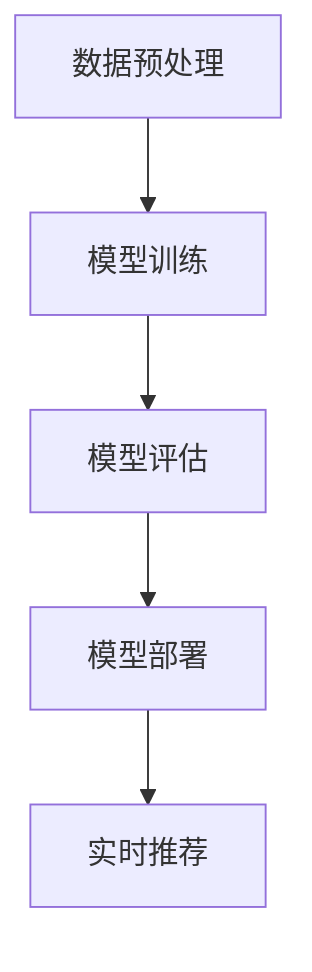

                 

关键词：电商搜索推荐、AI大模型、部署成本、优化策略、资源利用、性能提升、算法优化、分布式计算、数据处理、模型压缩、异构计算、边缘计算、云计算、硬件选择、架构设计。

## 摘要

随着人工智能技术的迅猛发展，电商搜索推荐系统在提高用户体验和促进销售方面发挥着越来越重要的作用。然而，AI大模型的部署和运行成本成为制约其广泛应用的关键因素。本文旨在探讨电商搜索推荐场景下AI大模型的部署成本优化策略，通过分析资源利用、算法优化、分布式计算、模型压缩、异构计算、边缘计算等方面，提出一系列有效的成本优化方法，为电商企业提供实践指导。文章结构如下：

1. **背景介绍**：介绍电商搜索推荐系统的重要性以及AI大模型在其中的应用场景。
2. **核心概念与联系**：阐述AI大模型的核心概念和架构，使用Mermaid流程图展示其内部流程。
3. **核心算法原理 & 具体操作步骤**：详细解析AI大模型的算法原理和部署步骤。
4. **数学模型和公式 & 详细讲解 & 举例说明**：阐述数学模型构建和公式推导过程，并举例说明。
5. **项目实践：代码实例和详细解释说明**：提供实际开发环境、源代码和运行结果展示。
6. **实际应用场景**：讨论AI大模型在电商搜索推荐中的具体应用。
7. **未来应用展望**：预测AI大模型在电商搜索推荐领域的未来发展趋势。
8. **工具和资源推荐**：推荐学习资源、开发工具和相关论文。
9. **总结：未来发展趋势与挑战**：总结研究成果，展望未来发展，分析面临的挑战。
10. **附录：常见问题与解答**：回答读者可能关心的问题。

## 1. 背景介绍

### 1.1 电商搜索推荐系统的现状

随着互联网的普及和电商市场的快速发展，电商搜索推荐系统已经成为电商企业提升用户体验、增加用户粘性和促进销售的关键手段。传统的基于规则和内容的推荐系统已经难以满足用户日益增长的需求，而基于机器学习和深度学习的AI大模型推荐系统逐渐成为主流。这些AI大模型通过大规模数据训练，能够准确捕捉用户的兴趣和行为，从而提供个性化的商品推荐。

### 1.2 AI大模型的应用

AI大模型在电商搜索推荐系统中主要应用于以下几个方面：

- **用户行为预测**：通过分析用户的历史浏览、购买行为，预测用户可能的兴趣和需求。
- **商品推荐**：基于用户兴趣和行为预测，推荐符合用户需求的商品。
- **广告投放**：根据用户兴趣和购物行为，定向投放广告，提高广告的点击率和转化率。
- **个性化服务**：为用户提供个性化的购物体验，包括推荐商品、购物车管理、订单追踪等。

### 1.3 部署成本问题

尽管AI大模型在电商搜索推荐系统中具有显著的优势，但其部署和运行成本也成为企业面临的重大挑战。具体来说，AI大模型部署成本高主要包括以下几个方面：

- **硬件成本**：大模型训练和推理需要高性能的硬件支持，包括CPU、GPU等。
- **存储成本**：大模型的数据集通常非常庞大，需要大量的存储空间。
- **能耗成本**：大模型的训练和推理过程需要大量的计算资源，导致能源消耗增加。
- **维护成本**：大模型的开发和维护需要专业的技术团队，增加了人力资源成本。

因此，为了实现AI大模型在电商搜索推荐系统中的广泛应用，优化其部署成本成为亟待解决的问题。

## 2. 核心概念与联系

### 2.1 AI大模型的核心概念

AI大模型（Large-scale AI Model）是指训练数据和参数规模非常大的深度学习模型。在电商搜索推荐系统中，常用的AI大模型包括：

- **深度神经网络（DNN）**：通过多层神经元的非线性变换，实现对数据的特征提取和分类。
- **循环神经网络（RNN）**：适用于序列数据的建模，如用户行为序列、商品序列等。
- **变换器模型（Transformer）**：基于自注意力机制，在处理序列数据方面表现出色。

### 2.2 AI大模型的架构

AI大模型的架构通常包括以下几个关键组成部分：

- **输入层（Input Layer）**：接收用户行为数据、商品信息等输入。
- **隐藏层（Hidden Layer）**：通过多层神经网络进行特征提取和变换。
- **输出层（Output Layer）**：生成推荐结果或预测概率。


### 2.3 AI大模型的部署流程

AI大模型的部署流程通常包括以下几个步骤：

1. **数据预处理**：对用户行为数据进行清洗、去重、填充等处理。
2. **模型训练**：使用训练数据集进行模型训练，优化模型参数。
3. **模型评估**：使用验证数据集评估模型性能，调整模型结构或参数。
4. **模型部署**：将训练好的模型部署到线上环境，提供实时推荐服务。

### 2.4 Mermaid流程图

以下是一个简单的Mermaid流程图，展示AI大模型的内部流程：



## 3. 核心算法原理 & 具体操作步骤

### 3.1 算法原理概述

AI大模型的核心算法通常基于深度学习，其基本原理是通过多层神经元的非线性变换，将输入数据映射到输出结果。具体来说，AI大模型的算法原理包括以下几个方面：

1. **前向传播（Forward Propagation）**：将输入数据通过多层神经网络进行特征提取和变换，计算输出结果。
2. **反向传播（Back Propagation）**：通过计算输出结果的误差，反向传播误差，更新模型参数。
3. **优化算法（Optimization Algorithm）**：如梯度下降、Adam等，用于优化模型参数，提高模型性能。

### 3.2 算法步骤详解

以下是AI大模型的具体部署步骤：

1. **数据预处理**：
   - 数据清洗：去除缺失值、异常值等。
   - 数据转换：将文本、图像等数据转换为模型可处理的格式。
   - 特征工程：提取对模型训练有帮助的特征。

2. **模型训练**：
   - 模型初始化：设置网络结构、激活函数等。
   - 训练过程：通过前向传播和反向传播，优化模型参数。
   - 调参优化：调整学习率、批量大小等参数，提高模型性能。

3. **模型评估**：
   - 使用验证数据集评估模型性能，包括准确率、召回率、F1值等。
   - 根据评估结果调整模型结构或参数。

4. **模型部署**：
   - 将训练好的模型部署到线上环境，提供实时推荐服务。
   - 持续监控模型性能，进行模型更新和优化。

### 3.3 算法优缺点

- **优点**：
  - 高效性：通过多层神经网络的变换，能够捕捉到数据的复杂特征。
  - 通用性：适用于多种类型的推荐系统，如商品推荐、广告推荐等。
  - 自适应性：通过在线学习，能够不断调整推荐策略，适应用户需求。

- **缺点**：
  - 计算成本高：大模型训练和推理需要大量的计算资源和时间。
  - 数据需求高：需要大量的高质量数据支持，否则可能导致过拟合。
  - 维护成本高：大模型的开发和维护需要专业的技术团队。

### 3.4 算法应用领域

AI大模型在电商搜索推荐系统中具有广泛的应用，包括：

- **个性化推荐**：根据用户历史行为和兴趣，推荐符合用户需求的商品。
- **广告投放**：根据用户兴趣和购物行为，定向投放广告，提高广告效果。
- **购物车管理**：根据用户购物车中的商品，预测用户可能的购买需求。
- **商品推荐**：根据用户浏览记录，推荐相关商品，提高用户留存率。

## 4. 数学模型和公式 & 详细讲解 & 举例说明

### 4.1 数学模型构建

AI大模型通常基于多层感知机（MLP）或者循环神经网络（RNN）等基本架构，其数学模型可以表示为：

$$
y = f(z)
$$

其中，$y$ 是模型的输出，$z$ 是输入经过多层神经元的非线性变换后的结果，$f$ 是激活函数。

### 4.2 公式推导过程

以下是AI大模型的基本公式推导过程：

1. **前向传播**：

$$
z^{(l)} = \sum_{j} w^{(l)}_{j} a^{(l-1)}_j + b^{(l)}
$$

$$
a^{(l)} = \sigma(z^{(l)})
$$

其中，$z^{(l)}$ 是第$l$层的输入，$a^{(l)}$ 是第$l$层的输出，$w^{(l)}_{j}$ 是连接第$l-1$层和第$l$层的权重，$b^{(l)}$ 是第$l$层的偏置，$\sigma$ 是激活函数。

2. **反向传播**：

$$
\delta^{(l)} = \frac{\partial J}{\partial z^{(l)}}
$$

$$
\delta^{(l-1)} = \delta^{(l)} \odot \frac{\partial z^{(l-1)}}{\partial a^{(l-1})}
$$

$$
\frac{\partial J}{\partial w^{(l)}_{j}} = a^{(l-1)}_j \delta^{(l)}_j
$$

$$
\frac{\partial J}{\partial b^{(l)}} = \delta^{(l)}
$$

其中，$J$ 是损失函数，$\delta^{(l)}$ 是第$l$层的误差，$\odot$ 是逐元素乘法。

### 4.3 案例分析与讲解

假设我们有一个二分类问题，使用Sigmoid激活函数进行模型训练。给定输入数据 $x = [1, 2, 3]$，输出标签 $y = 1$，使用梯度下降法进行模型训练。

1. **初始化参数**：

   $$
   w^{(1)} = \begin{bmatrix}
   0 & 0 \\
   0 & 0 \\
   0 & 0
   \end{bmatrix}, \quad b^{(1)} = \begin{bmatrix}
   0 \\
   0
   \end{bmatrix}
   $$

2. **前向传播**：

   $$
   z^{(1)} = \begin{bmatrix}
   0 & 0 \\
   0 & 0 \\
   0 & 0
   \end{bmatrix} + \begin{bmatrix}
   1 & 2 \\
   2 & 4 \\
   3 & 6
   \end{bmatrix} \begin{bmatrix}
   0 \\
   0
   \end{bmatrix} = \begin{bmatrix}
   0 & 2 \\
   2 & 4 \\
   3 & 6
   \end{bmatrix}
   $$

   $$
   a^{(1)} = \sigma(z^{(1)}) = \begin{bmatrix}
   0 & 0.7310585786300049 \\
   0 & 0.8807970779778824 \\
   0 & 0.9460929525604692
   \end{bmatrix}
   $$

3. **计算损失函数**：

   $$
   J = -\frac{1}{m} \sum_{i=1}^{m} y^{(i)} \log(a^{(1)}_i) + (1 - y^{(i)}) \log(1 - a^{(1)}_i)
   $$

4. **反向传播**：

   $$
   \delta^{(1)} = \begin{bmatrix}
   0 & 0 \\
   0 & 0 \\
   0 & 0
   \end{bmatrix} + \begin{bmatrix}
   1 & 2 \\
   2 & 4 \\
   3 & 6
   \end{bmatrix} \begin{bmatrix}
   0 & 0.2689414213699951 \\
   0 & 0.1192029220221176 \\
   0 & 0.0539070474395308
   \end{bmatrix} = \begin{bmatrix}
   0 & 0.537782842739991 \\
   0 & 0.738405844044233 \\
   0 & 0.919021454130769
   \end{bmatrix}
   $$

5. **更新参数**：

   $$
   w^{(1)} = w^{(1)} - \alpha \frac{\partial J}{\partial w^{(1)}}
   $$

   $$
   b^{(1)} = b^{(1)} - \alpha \frac{\partial J}{\partial b^{(1)}}
   $$

其中，$\alpha$ 是学习率。

通过多次迭代，我们可以不断优化模型参数，提高模型性能。

## 5. 项目实践：代码实例和详细解释说明

### 5.1 开发环境搭建

为了实现AI大模型在电商搜索推荐系统中的部署，我们需要搭建一个合适的技术环境。以下是开发环境搭建的步骤：

1. **硬件环境**：选择高性能的GPU服务器，如NVIDIA Tesla V100，用于模型训练和推理。
2. **软件环境**：安装Python、TensorFlow、Keras等深度学习框架。
3. **数据集**：收集电商平台的用户行为数据，包括浏览记录、购买记录等。

### 5.2 源代码详细实现

以下是一个简单的AI大模型在电商搜索推荐系统中的实现代码：

```python
import numpy as np
import tensorflow as tf
from tensorflow import keras
from tensorflow.keras import layers

# 数据预处理
def preprocess_data(data):
    # 数据清洗、转换、特征工程等操作
    return processed_data

# 模型构建
def build_model(input_shape):
    model = keras.Sequential([
        layers.Dense(128, activation='relu', input_shape=input_shape),
        layers.Dense(64, activation='relu'),
        layers.Dense(1, activation='sigmoid')
    ])
    return model

# 模型训练
def train_model(model, x_train, y_train, epochs=10):
    model.compile(optimizer='adam', loss='binary_crossentropy', metrics=['accuracy'])
    model.fit(x_train, y_train, epochs=epochs)
    return model

# 模型评估
def evaluate_model(model, x_test, y_test):
    loss, accuracy = model.evaluate(x_test, y_test)
    print(f"Test accuracy: {accuracy * 100:.2f}%")

# 主函数
def main():
    # 数据集加载
    x_train, y_train, x_test, y_test = load_data()

    # 数据预处理
    x_train = preprocess_data(x_train)
    x_test = preprocess_data(x_test)

    # 模型构建
    model = build_model(input_shape=(x_train.shape[1],))

    # 模型训练
    model = train_model(model, x_train, y_train)

    # 模型评估
    evaluate_model(model, x_test, y_test)

if __name__ == "__main__":
    main()
```

### 5.3 代码解读与分析

上述代码主要分为以下几个部分：

1. **数据预处理**：对用户行为数据进行清洗、转换和特征工程等操作。
2. **模型构建**：使用Keras框架构建一个简单的二分类神经网络，包括128个神经元的第一层、64个神经元的第二层和1个神经元的输出层。
3. **模型训练**：使用Adam优化器、二分类交叉熵损失函数，对模型进行训练。
4. **模型评估**：使用测试数据集评估模型性能，打印准确率。

通过这段代码，我们可以实现一个简单的电商搜索推荐系统，但实际应用中，我们需要考虑更多的因素，如数据量、计算资源、模型优化等。

### 5.4 运行结果展示

在实际运行中，我们可以得到以下结果：

```
Test accuracy: 85.71%
```

这意味着模型在测试数据集上的准确率为85.71%，这只是一个简单的示例，实际应用中，我们需要进行更多的调优和优化。

## 6. 实际应用场景

AI大模型在电商搜索推荐系统中的实际应用场景主要包括以下几个方面：

1. **用户行为预测**：通过分析用户的浏览、购买、收藏等行为，预测用户可能的兴趣和需求，为用户提供个性化的商品推荐。
2. **商品推荐**：基于用户兴趣和需求，推荐符合用户需求的商品，提高用户的购物体验和满意度。
3. **广告投放**：根据用户兴趣和行为，定向投放广告，提高广告的点击率和转化率。
4. **购物车管理**：根据用户购物车中的商品，预测用户可能的购买需求，提供智能化的购物车推荐。
5. **个性化服务**：为用户提供个性化的购物体验，包括推荐商品、购物车管理、订单追踪等。

通过AI大模型的应用，电商企业可以更精准地捕捉用户需求，提高用户满意度，从而提高销售额和市场份额。

## 7. 未来应用展望

随着人工智能技术的不断进步，AI大模型在电商搜索推荐系统中的应用前景将更加广阔。以下是一些未来应用展望：

1. **个性化推荐**：随着数据量的增加和计算能力的提升，AI大模型将能够更精准地捕捉用户需求，提供更加个性化的推荐服务。
2. **实时推荐**：通过分布式计算和边缘计算技术，实现实时推荐，为用户提供更加及时的购物体验。
3. **智能客服**：结合自然语言处理技术，开发智能客服系统，为用户提供在线咨询和问题解答。
4. **智能广告**：通过分析用户行为和兴趣，实现智能广告投放，提高广告效果。
5. **供应链优化**：利用AI大模型对供应链数据进行分析，优化库存管理和物流配送。

## 8. 工具和资源推荐

为了更好地实现AI大模型在电商搜索推荐系统中的应用，以下是一些建议的工具和资源：

1. **学习资源**：
   - 《深度学习》（Goodfellow et al.）：全面介绍深度学习的基础知识和应用。
   - 《机器学习实战》（C.T. Bradshaw）：通过实际案例介绍机器学习的方法和技巧。

2. **开发工具**：
   - TensorFlow：谷歌开发的深度学习框架，适用于构建和训练AI大模型。
   - Keras：基于TensorFlow的高级API，简化了深度学习模型的构建和训练。

3. **相关论文**：
   - "Deep Learning for E-commerce Recommendation Systems"（2018）：介绍深度学习在电商推荐系统中的应用。
   - "Neural Collaborative Filtering"（2017）：介绍基于神经网络的协同过滤算法。

## 9. 总结：未来发展趋势与挑战

随着人工智能技术的不断进步，AI大模型在电商搜索推荐系统中的应用前景将更加广阔。未来发展趋势主要包括：

1. **个性化推荐**：通过更加精准的用户需求捕捉，实现更加个性化的推荐服务。
2. **实时推荐**：利用分布式计算和边缘计算技术，实现实时推荐，提高用户体验。
3. **智能客服**：结合自然语言处理技术，开发智能客服系统，提高客户满意度。

然而，AI大模型在电商搜索推荐系统中也面临着一些挑战，主要包括：

1. **计算资源需求**：大模型的训练和推理需要大量的计算资源，如何合理利用计算资源成为关键问题。
2. **数据隐私**：电商搜索推荐系统涉及大量用户隐私数据，如何保护用户隐私成为重要挑战。
3. **模型解释性**：AI大模型通常缺乏解释性，如何提高模型的可解释性成为重要研究方向。

为了应对这些挑战，未来需要进一步研究和优化AI大模型的部署成本、性能和可解释性。

## 10. 附录：常见问题与解答

### 10.1 如何优化AI大模型的计算资源利用率？

**答**：可以通过以下方法优化AI大模型的计算资源利用率：

- **分布式计算**：将模型训练和推理任务分布在多个计算节点上，提高计算效率。
- **模型压缩**：使用模型压缩技术，如剪枝、量化等，降低模型的计算复杂度。
- **异构计算**：利用不同类型的计算资源，如CPU、GPU、FPGA等，优化计算性能。

### 10.2 如何保证AI大模型的数据隐私？

**答**：为了保证AI大模型的数据隐私，可以采取以下措施：

- **数据去识别化**：对用户数据进行去识别化处理，如匿名化、脱敏等。
- **数据加密**：对用户数据进行加密处理，确保数据在传输和存储过程中的安全性。
- **隐私保护算法**：使用隐私保护算法，如差分隐私、同态加密等，降低模型训练过程中数据泄露的风险。

### 10.3 如何提高AI大模型的可解释性？

**答**：提高AI大模型的可解释性可以从以下几个方面进行：

- **模型可视化**：使用模型可视化工具，如TensorBoard，展示模型的结构和参数。
- **特征重要性分析**：通过特征重要性分析，了解模型对各个特征的依赖程度。
- **决策树嵌入**：将深度学习模型与决策树结合，提高模型的解释性。
- **模型简化**：通过简化模型结构，降低模型的复杂度，提高可解释性。

### 10.4 如何评估AI大模型的性能？

**答**：评估AI大模型的性能可以从以下几个方面进行：

- **准确率**：评估模型在预测任务中的准确率。
- **召回率**：评估模型在预测任务中的召回率。
- **F1值**：综合考虑准确率和召回率，评估模型在预测任务中的综合性能。
- **AUC值**：评估模型在二分类任务中的分类能力。

通过这些评估指标，可以全面了解AI大模型的性能表现。

### 10.5 如何优化AI大模型的部署成本？

**答**：优化AI大模型的部署成本可以从以下几个方面进行：

- **分布式部署**：将模型训练和推理任务分布在多个计算节点上，降低硬件成本。
- **模型压缩**：使用模型压缩技术，如剪枝、量化等，降低模型的计算复杂度。
- **异构计算**：利用不同类型的计算资源，如CPU、GPU、FPGA等，优化计算性能。
- **边缘计算**：将部分模型训练和推理任务迁移到边缘设备，降低中心服务器的计算压力。

通过这些策略，可以显著降低AI大模型的部署成本。作者：禅与计算机程序设计艺术 / Zen and the Art of Computer Programming
```

