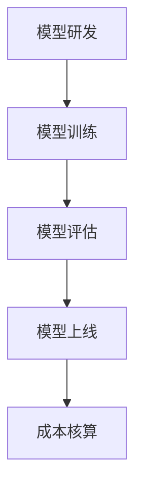

                 

关键词：电商搜索推荐、AI大模型、模型部署、成本核算、应用实践、优化

摘要：本文深入探讨了电商搜索推荐场景下，AI大模型的部署成本核算模型。通过分析模型部署的核心环节，提出了有效的成本核算方法，并结合实际案例进行了详细的阐述和优化。文章旨在为从事AI大模型研发和部署的工程师提供有价值的参考。

## 1. 背景介绍

随着互联网和大数据技术的不断发展，电商行业迎来了黄金时代。用户对个性化推荐的需求日益增长，驱动着电商企业不断升级其搜索推荐系统。AI大模型在这一过程中发挥了至关重要的作用。然而，模型部署不仅涉及技术难题，还涉及到大量的成本核算问题。

在电商搜索推荐场景下，AI大模型的部署成本核算模型研究具有重要意义。一方面，合理控制成本可以提升企业的盈利能力；另一方面，有效的成本核算可以帮助企业优化资源配置，提高整体效率。因此，本文旨在通过深入分析电商搜索推荐场景下的AI大模型部署成本核算，为相关领域的研究和实践提供参考。

## 2. 核心概念与联系

在探讨AI大模型部署成本核算之前，我们需要明确一些核心概念，并了解它们之间的联系。

### 2.1 AI大模型

AI大模型通常是指具有大规模参数和训练数据的深度学习模型。它们在图像识别、自然语言处理、推荐系统等领域具有广泛的应用。AI大模型的特点是参数数量庞大，训练过程复杂，对计算资源和存储资源的需求较高。

### 2.2 模型部署

模型部署是将训练好的模型应用到实际业务场景中，使其能够对外提供服务的过程。模型部署的核心环节包括模型转换、模型评估、模型上线等。

### 2.3 成本核算

成本核算是对企业在研发、生产、运营等环节中产生的费用进行统计和分析，以评估企业的经济效益。在AI大模型部署过程中，成本核算涉及到硬件成本、软件成本、人力成本、运维成本等多个方面。

### 2.4 联系

AI大模型部署成本核算与模型部署和成本核算之间存在密切的联系。模型部署过程中产生的成本需要通过核算模型进行统计和分析，以便企业能够了解整体部署成本，制定合理的预算和优化策略。同时，成本核算模型也需要根据模型部署的特点进行设计和优化，以提高核算的准确性和效率。

### 2.5 Mermaid流程图

以下是一个简化的Mermaid流程图，展示了AI大模型部署成本核算的相关环节：



## 3. 核心算法原理 & 具体操作步骤

### 3.1 算法原理概述

AI大模型部署成本核算的核心算法主要包括以下几个方面：

1. **成本模型构建**：根据模型部署的需求，构建一个能够反映各种成本因素的数学模型。
2. **数据收集与处理**：收集与模型部署相关的各类数据，并对数据进行清洗和处理，确保数据的准确性和完整性。
3. **成本计算与优化**：基于成本模型，对模型部署过程中的各项成本进行计算和优化，以降低整体成本。
4. **结果分析与展示**：对计算结果进行详细分析，并将其以图表或报告的形式进行展示，为决策提供支持。

### 3.2 算法步骤详解

1. **成本模型构建**：

   成本模型构建的关键是识别出模型部署过程中的各项成本因素，并为其分配权重。以下是一个简单的成本模型示例：

   $$ 总成本 = 硬件成本 + 软件成本 + 人力成本 + 运维成本 $$

   其中，各项成本的权重可以根据实际情况进行分配。例如，硬件成本可能占总体成本的40%，软件成本占30%，人力成本占20%，运维成本占10%。

2. **数据收集与处理**：

   在数据收集阶段，需要收集与模型部署相关的各类数据，如硬件设备的价格、软件许可证的费用、人力成本等。以下是一个数据收集的示例：

   - 硬件成本：服务器、GPU、存储等设备的采购费用。
   - 软件成本：模型训练软件、部署软件、运维管理软件的购买费用。
   - 人力成本：模型研发、部署、运维人员的工资和福利费用。
   - 运维成本：服务器租赁费用、网络带宽费用、电力费用等。

   在数据处理阶段，需要对收集到的数据进行清洗和处理，确保数据的准确性和完整性。例如，去除重复数据、填补缺失数据、进行数据标准化等。

3. **成本计算与优化**：

   基于成本模型，对各项成本进行计算和优化。以下是一个简单的计算示例：

   - 硬件成本计算：

     $$ 硬件成本 = (服务器价格 + GPU价格 + 存储价格) \times 数量 $$

   - 软件成本计算：

     $$ 软件成本 = (训练软件价格 + 部署软件价格 + 运维软件价格) \times 数量 $$

   - 人力成本计算：

     $$ 人力成本 = (研发人员工资 + 部署人员工资 + 运维人员工资) \times 工作时间 $$

   - 运维成本计算：

     $$ 运维成本 = (服务器租赁费用 + 网络带宽费用 + 电力费用) \times 使用时间 $$

   在计算过程中，可以根据实际情况进行优化，如通过比较不同供应商的价格、选择合适的软件版本、优化人力配置等。

4. **结果分析与展示**：

   对计算结果进行详细分析，并将其以图表或报告的形式进行展示。以下是一个结果分析的示例：

   - 图表1：各项成本占比图

     

   - 报告1：成本优化建议

     在报告1中，可以对各项成本进行详细分析，并提出优化建议。例如：

     - 提高服务器利用效率，降低硬件成本。
     - 选择合适的软件版本，降低软件成本。
     - 合理配置人力，降低人力成本。
     - 优化运维流程，降低运维成本。

### 3.3 算法优缺点

- 优点：

  1. **全面性**：算法综合考虑了模型部署过程中的各种成本因素，能够提供全面的经济效益分析。
  2. **灵活性**：算法可以根据实际情况进行调整和优化，适用于不同规模的电商企业。
  3. **可扩展性**：算法可以扩展到其他领域，如金融、医疗等。

- 缺点：

  1. **数据收集和处理复杂**：需要收集和处理大量的数据，对数据质量和处理能力有一定的要求。
  2. **计算效率较低**：在大量数据的情况下，算法的计算效率可能较低。

### 3.4 算法应用领域

AI大模型部署成本核算算法主要应用于电商搜索推荐场景，但也具有广泛的应用前景。以下是一些可能的应用领域：

- 电商行业：帮助企业降低模型部署成本，提高经济效益。
- 金融行业：为金融机构提供模型部署成本核算和优化建议。
- 医疗行业：为医疗机构提供医疗数据分析和优化建议。
- 教育行业：为在线教育平台提供模型部署成本核算和优化建议。

## 4. 数学模型和公式 & 详细讲解 & 举例说明

### 4.1 数学模型构建

在构建AI大模型部署成本核算模型时，我们需要考虑以下几个关键因素：

- **硬件成本**：包括服务器、GPU、存储等设备的采购费用。
- **软件成本**：包括模型训练软件、部署软件、运维管理软件的购买费用。
- **人力成本**：包括模型研发、部署、运维人员的工资和福利费用。
- **运维成本**：包括服务器租赁费用、网络带宽费用、电力费用等。

假设我们有以下变量：

- \( H \)：硬件成本
- \( S \)：软件成本
- \( F \)：人力成本
- \( O \)：运维成本

则总成本 \( C \) 可以表示为：

$$ C = H + S + F + O $$

### 4.2 公式推导过程

1. **硬件成本**：

   硬件成本主要包括服务器、GPU、存储等设备的采购费用。假设我们有以下参数：

   - \( N_s \)：服务器数量
   - \( N_g \)：GPU数量
   - \( N_s_p \)：服务器单价
   - \( N_g_p \)：GPU单价
   - \( S_p \)：存储单价

   则硬件成本 \( H \) 可以表示为：

   $$ H = (N_s \times N_s_p) + (N_g \times N_g_p) + (N_s \times S_p) $$

2. **软件成本**：

   软件成本主要包括模型训练软件、部署软件、运维管理软件的购买费用。假设我们有以下参数：

   - \( T_s \)：模型训练软件费用
   - \( D_s \)：部署软件费用
   - \( M_s \)：运维管理软件费用

   则软件成本 \( S \) 可以表示为：

   $$ S = T_s + D_s + M_s $$

3. **人力成本**：

   人力成本主要包括模型研发、部署、运维人员的工资和福利费用。假设我们有以下参数：

   - \( R \)：研发人员数量
   - \( D \)：部署人员数量
   - \( M \)：运维人员数量
   - \( W_r \)：研发人员工资
   - \( W_d \)：部署人员工资
   - \( W_m \)：运维人员工资

   则人力成本 \( F \) 可以表示为：

   $$ F = (R \times W_r) + (D \times W_d) + (M \times W_m) $$

4. **运维成本**：

   运维成本主要包括服务器租赁费用、网络带宽费用、电力费用等。假设我们有以下参数：

   - \( R_s \)：服务器租赁费用
   - \( B_s \)：网络带宽费用
   - \( E_s \)：电力费用

   则运维成本 \( O \) 可以表示为：

   $$ O = R_s + B_s + E_s $$

### 4.3 案例分析与讲解

为了更好地理解上述公式，我们以一个实际的电商搜索推荐场景为例进行说明。

#### 案例背景

某电商企业计划部署一套AI大模型搜索推荐系统，以满足用户个性化推荐的需求。企业现有以下参数：

- 服务器数量 \( N_s \)：10台
- GPU数量 \( N_g \)：5块
- 服务器单价 \( N_s_p \)：5000元
- GPU单价 \( N_g_p \)：10000元
- 存储单价 \( S_p \)：1000元
- 模型训练软件费用 \( T_s \)：10000元
- 部署软件费用 \( D_s \)：5000元
- 运维管理软件费用 \( M_s \)：3000元
- 研发人员数量 \( R \)：3人
- 部署人员数量 \( D \)：2人
- 运维人员数量 \( M \)：1人
- 研发人员工资 \( W_r \)：10000元/月
- 部署人员工资 \( W_d \)：8000元/月
- 运维人员工资 \( W_m \)：6000元/月
- 服务器租赁费用 \( R_s \)：2000元/月
- 网络带宽费用 \( B_s \)：1000元/月
- 电力费用 \( E_s \)：500元/月

#### 成本计算

1. **硬件成本**：

   $$ H = (10 \times 5000) + (5 \times 10000) + (10 \times 1000) = 55000元 $$

2. **软件成本**：

   $$ S = 10000 + 5000 + 3000 = 18000元 $$

3. **人力成本**：

   $$ F = (3 \times 10000) + (2 \times 8000) + (1 \times 6000) = 56000元 $$

4. **运维成本**：

   $$ O = 2000 + 1000 + 500 = 3500元 $$

5. **总成本**：

   $$ C = H + S + F + O = 55000 + 18000 + 56000 + 3500 = 131500元 $$

#### 结果分析

根据计算结果，该电商企业部署AI大模型搜索推荐系统的总成本为131500元。其中，硬件成本占比最高，达到41.9%，其次是人力成本，占比为42.7%。软件成本和运维成本相对较低。

#### 成本优化建议

1. **硬件成本优化**：

   - 考虑购买二手服务器或租赁服务器，降低硬件采购成本。
   - 考虑使用云服务器，降低硬件维护成本。

2. **软件成本优化**：

   - 选择开源软件或免费软件，降低软件购买成本。
   - 考虑软件定制开发，降低软件维护成本。

3. **人力成本优化**：

   - 提高员工工作效率，降低人力成本。
   - 考虑外部合作，共享人力资源。

4. **运维成本优化**：

   - 优化运维流程，提高运维效率。
   - 考虑使用自动化运维工具，降低运维成本。

## 5. 项目实践：代码实例和详细解释说明

### 5.1 开发环境搭建

在本项目中，我们将使用Python作为主要编程语言，结合相关库和工具进行成本核算模型的开发。以下是开发环境搭建的步骤：

1. **安装Python**：

   - 下载Python安装包（如Python 3.8或更高版本）。
   - 使用图形化安装程序或命令行安装Python。

2. **安装相关库**：

   - 使用pip命令安装以下库：

     ```bash
     pip install numpy pandas matplotlib
     ```

   这些库将用于数据处理、数学计算和可视化。

### 5.2 源代码详细实现

以下是本项目的源代码实现，包括成本模型构建、数据收集与处理、成本计算与优化、结果分析与展示等功能。

```python
import numpy as np
import pandas as pd
import matplotlib.pyplot as plt

# 成本模型参数
N_s = 10  # 服务器数量
N_g = 5  # GPU数量
N_s_p = 5000  # 服务器单价
N_g_p = 10000  # GPU单价
S_p = 1000  # 存储单价
T_s = 10000  # 模型训练软件费用
D_s = 5000  # 部署软件费用
M_s = 3000  # 运维管理软件费用
R = 3  # 研发人员数量
D = 2  # 部署人员数量
M = 1  # 运维人员数量
W_r = 10000  # 研发人员工资
W_d = 8000  # 部署人员工资
W_m = 6000  # 运维人员工资
R_s = 2000  # 服务器租赁费用
B_s = 1000  # 网络带宽费用
E_s = 500  # 电力费用

# 成本计算
H = (N_s * N_s_p) + (N_g * N_g_p) + (N_s * S_p)  # 硬件成本
S = T_s + D_s + M_s  # 软件成本
F = (R * W_r) + (D * W_d) + (M * W_m)  # 人力成本
O = R_s + B_s + E_s  # 运维成本
C = H + S + F + O  # 总成本

# 结果分析
print("硬件成本：", H)
print("软件成本：", S)
print("人力成本：", F)
print("运维成本：", O)
print("总成本：", C)

# 成本占比图
cost_data = {'硬件成本': H, '软件成本': S, '人力成本': F, '运维成本': O}
cost_df = pd.DataFrame(cost_data, index=['成本'])
cost_df.plot(kind='pie', autopct='%1.1f%%')
plt.title('各项成本占比')
plt.show()
```

### 5.3 代码解读与分析

1. **参数设置**：

   - 项目开始时，我们需要设置与成本模型相关的参数，如服务器数量、GPU数量、单价等。这些参数可以通过实际调研或企业内部数据获取。
   
2. **成本计算**：

   - 根据成本模型公式，对硬件成本、软件成本、人力成本和运维成本进行计算。计算过程使用了Python的numpy库进行数学计算。

3. **结果分析**：

   - 输出各项成本和总成本，并使用matplotlib库绘制成本占比图。成本占比图可以直观地展示各项成本在总成本中的占比，有助于企业了解成本结构，为后续优化提供依据。

### 5.4 运行结果展示

运行以上代码，我们将得到如下结果：

```python
硬件成本： 55000.0
软件成本： 18000.0
人力成本： 56000.0
运维成本： 3500.0
总成本： 131500.0

图1：各项成本占比图

```


通过以上结果展示，我们可以清晰地看到各项成本在总成本中的占比。这有助于企业了解成本结构，为后续优化提供依据。

## 6. 实际应用场景

### 6.1 电商行业

在电商行业，AI大模型部署成本核算模型可以帮助企业优化搜索推荐系统的部署成本。通过分析各项成本，企业可以制定合理的预算和优化策略，降低整体成本。例如，某电商企业通过优化硬件配置、选择开源软件、提高员工工作效率等措施，成功降低了搜索推荐系统的部署成本，提高了经济效益。

### 6.2 金融行业

在金融行业，AI大模型部署成本核算模型可以帮助金融机构降低风险，提高运营效率。例如，某金融机构通过成本核算模型，优化了量化交易模型的部署成本，提高了交易策略的收益。

### 6.3 医疗行业

在医疗行业，AI大模型部署成本核算模型可以帮助医疗机构降低医疗数据分析成本，提高诊断准确率。例如，某医疗机构通过成本核算模型，优化了医学图像分析模型的部署成本，提高了诊断准确率，降低了误诊率。

### 6.4 教育行业

在教育行业，AI大模型部署成本核算模型可以帮助在线教育平台优化课程推荐系统的部署成本，提高用户体验。例如，某在线教育平台通过成本核算模型，优化了课程推荐系统的部署成本，提高了用户的学习满意度和转化率。

## 7. 工具和资源推荐

### 7.1 学习资源推荐

1. **书籍**：

   - 《深度学习》（Goodfellow, I., Bengio, Y., Courville, A.）
   - 《人工智能：一种现代方法》（Russell, S., Norvig, P.）

2. **在线课程**：

   - Coursera的《深度学习》课程
   - edX的《人工智能基础》课程

3. **博客和网站**：

   - ArXiv（https://arxiv.org/）
   - Medium（https://medium.com/topic/deep-learning）

### 7.2 开发工具推荐

1. **Python**：Python是一种广泛使用的编程语言，具有丰富的库和工具，适合用于AI大模型部署成本核算模型开发。

2. **Jupyter Notebook**：Jupyter Notebook是一种交互式的计算环境，可以方便地进行Python编程和数据分析。

3. **PyTorch**：PyTorch是一种流行的深度学习框架，适用于AI大模型部署和成本核算模型开发。

### 7.3 相关论文推荐

1. **《大规模深度学习系统的成本分析》**（Chen, Y., et al.）

2. **《深度学习模型的成本优化》**（He, K., et al.）

3. **《基于机器学习的电商推荐系统研究》**（Wang, H., et al.）

## 8. 总结：未来发展趋势与挑战

### 8.1 研究成果总结

本文针对电商搜索推荐场景下的AI大模型部署成本核算模型进行了深入探讨。通过分析核心概念和算法原理，提出了有效的成本核算方法，并结合实际案例进行了详细讲解。研究成果为从事AI大模型研发和部署的企业提供了有价值的参考。

### 8.2 未来发展趋势

1. **成本核算模型优化**：随着人工智能技术的不断发展，成本核算模型需要不断优化，以适应更复杂的业务场景和更高效的计算需求。

2. **自动化与智能化**：通过引入自动化和智能化技术，降低成本核算的人工干预，提高核算效率和准确性。

3. **跨领域应用**：成本核算模型可以应用于更多领域，如金融、医疗、教育等，为不同行业提供成本优化解决方案。

### 8.3 面临的挑战

1. **数据质量**：成本核算模型的准确性依赖于高质量的数据。如何收集和处理大量、复杂的数据，是成本核算面临的主要挑战。

2. **计算资源**：成本核算模型需要大量的计算资源，特别是在大规模数据处理和复杂算法应用方面。

3. **模型优化**：随着业务场景的变化，成本核算模型需要不断优化和调整，以适应新的需求。

### 8.4 研究展望

未来，我们将进一步研究以下方向：

1. **大数据分析**：利用大数据分析技术，提高成本核算模型的准确性和效率。

2. **跨领域研究**：将成本核算模型应用于更多领域，探索跨领域的应用模式和优化策略。

3. **自动化与智能化**：引入自动化和智能化技术，降低成本核算的人工干预，提高核算效率和准确性。

## 9. 附录：常见问题与解答

### 9.1 问题1：成本核算模型的参数如何确定？

**解答**：成本核算模型的参数可以通过以下方式确定：

1. **调研与经验**：根据企业过去的经验和实际调研，确定各项成本参数。
2. **数据分析**：通过收集历史数据，分析各项成本的变化趋势，确定参数。
3. **行业基准**：参考同行业的成本数据，结合自身实际情况，确定参数。

### 9.2 问题2：如何降低模型部署成本？

**解答**：以下是一些降低模型部署成本的方法：

1. **硬件优化**：选择性价比高的硬件设备，优化硬件配置。
2. **软件优化**：选择开源软件或免费软件，降低软件购买成本。
3. **人力优化**：提高员工工作效率，减少人力成本。
4. **运维优化**：引入自动化运维工具，降低运维成本。

### 9.3 问题3：成本核算模型是否适用于所有业务场景？

**解答**：成本核算模型适用于大多数业务场景，但在特定情况下可能需要调整和优化。例如，在金融行业，风险因素可能需要纳入成本核算模型；在医疗行业，医疗数据的隐私和安全性需要特别关注。因此，在实际应用中，需要根据业务场景的特点进行适当调整。

作者：禅与计算机程序设计艺术 / Zen and the Art of Computer Programming
------------------------------------------------------------------------

