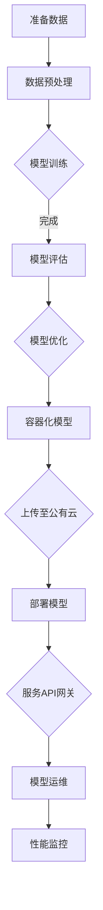

                 

### 1. 背景介绍

在当今数字经济时代，电商行业已经成为全球经济增长的重要驱动力。电商平台的搜索推荐系统作为用户获取商品信息的重要途径，直接影响到用户的购物体验和商家的销售业绩。传统的搜索推荐算法主要依赖于用户历史行为数据和商品属性数据，然而，这些方法往往存在推荐效果有限、用户满意度不高等问题。

随着人工智能技术的飞速发展，尤其是深度学习和自然语言处理技术的进步，AI大模型在搜索推荐场景中的应用成为可能。AI大模型，如深度神经网络（DNN）、卷积神经网络（CNN）和生成对抗网络（GAN）等，具有强大的特征提取和模式识别能力，能够为电商搜索推荐系统带来更高的准确性和个性化水平。

然而，AI大模型的应用也面临着诸多挑战，包括模型训练时间过长、计算资源需求巨大、模型部署和运维复杂等。为了应对这些挑战，混合云架构成为了一种有效的解决方案。混合云架构将公有云和私有云的优势结合起来，既能够提供弹性的计算资源，又能够保证数据的安全性和隐私性。

本文将围绕电商搜索推荐场景下的AI大模型模型部署混合云实践展开，分析案例，并提出优化方案。文章首先介绍AI大模型在电商搜索推荐中的优势和应用挑战，接着详细阐述混合云架构的概念、原理和关键技术，随后通过具体案例展示AI大模型在混合云环境下的部署过程，最后提出一系列优化方案，以提高模型部署的效率和效果。

### 2. 核心概念与联系

在深入探讨AI大模型在电商搜索推荐中的部署之前，我们需要了解一些核心概念，这些概念将为我们提供一个理论基础和系统架构的视角。

#### 2.1 AI大模型的概念

AI大模型，通常指的是具有大规模参数和广泛知识表征能力的深度学习模型。这类模型在处理复杂数据和任务时表现出色，例如自然语言处理（NLP）、计算机视觉（CV）和推荐系统等。AI大模型可以是基于神经网络的各种架构，如Transformer、BERT、GPT等。它们能够自动学习数据中的特征和规律，从而提供高效的预测和分类结果。

#### 2.2 深度学习算法原理

深度学习是一种机器学习的方法，它通过构建深层神经网络来模拟人脑的神经元连接，以实现对数据的自动特征学习和模式识别。深度学习算法的核心在于神经网络的结构和训练过程。神经网络由多个层次组成，包括输入层、隐藏层和输出层。每一层都包含大量的神经元，神经元之间通过权重进行连接。通过反向传播算法，模型可以不断调整权重，从而优化模型的性能。

#### 2.3 混合云架构

混合云架构是一种将公有云和私有云结合起来的计算环境，它能够根据不同的业务需求灵活调整资源分配。公有云提供了弹性、高可用性和全球分布的计算资源，适合处理大量非敏感数据和临时计算需求。私有云则提供了更高的数据安全性和可控性，适合处理敏感数据和长期运行的任务。

#### 2.4 混合云的关键技术

混合云的关键技术包括：

- **容器化技术**：容器化技术，如Docker，可以将应用程序及其依赖环境打包到一个可移植的容器中，实现应用的快速部署和运行。
- **服务编排**：服务编排工具，如Kubernetes，用于管理容器化应用的生命周期，提供自动部署、扩展和管理。
- **数据同步与迁移**：数据同步与迁移技术确保公有云和私有云之间的数据一致性，实现数据的无缝流动。
- **API网关**：API网关负责接收外部请求，进行身份验证和路由，同时提供统一的服务接口，简化应用集成。

#### 2.5 AI大模型与混合云的联系

AI大模型与混合云的结合主要体现在以下几个方面：

- **计算资源的弹性调度**：混合云可以根据AI大模型的计算需求动态调整资源分配，避免资源浪费和计算瓶颈。
- **数据的安全性与隐私保护**：通过在私有云中处理敏感数据，确保数据的安全性和隐私性。
- **模型的快速迭代与部署**：混合云环境提供了高效的容器化和服务编排工具，使得AI大模型能够快速迭代和部署。

#### 2.6 Mermaid 流程图

下面是AI大模型在混合云环境下的部署流程的Mermaid流程图：



通过上述流程图，我们可以清晰地看到AI大模型在混合云环境下的整体部署和运维过程。

### 3. 核心算法原理 & 具体操作步骤

#### 3.1 算法原理概述

在电商搜索推荐系统中，AI大模型的算法原理主要基于深度学习技术，特别是自然语言处理（NLP）和协同过滤（Collaborative Filtering）的结合。深度学习技术能够从用户和商品的特征数据中提取高层次的语义特征，而协同过滤则通过用户行为数据来预测用户对商品的偏好。

具体来说，AI大模型通常采用以下步骤：

1. **数据预处理**：对用户行为数据、商品属性数据进行清洗、归一化和特征提取。
2. **模型训练**：使用预训练的深度学习模型（如BERT、GPT等）或从头开始训练，对用户和商品的语义特征进行建模。
3. **模型评估**：通过交叉验证等方法评估模型的性能，调整模型参数。
4. **模型优化**：根据评估结果对模型进行优化，提高推荐精度。
5. **容器化与部署**：将训练好的模型容器化，并在混合云环境中部署。
6. **服务与监控**：通过API网关提供服务，同时进行性能监控和运维。

#### 3.2 算法步骤详解

##### 3.2.1 数据预处理

数据预处理是模型训练的基础，其步骤包括：

- **数据清洗**：去除无效数据、处理缺失值和异常值。
- **特征提取**：使用词嵌入（Word Embedding）技术将文本数据转换为数值表示，如Word2Vec、BERT等。
- **归一化**：对数值特征进行归一化处理，以消除不同特征之间的量级差异。

##### 3.2.2 模型训练

模型训练分为两部分：预训练和微调。

- **预训练**：使用大规模的预训练模型（如BERT、GPT等）在通用语料库上进行训练，学习语言的基本规律。
- **微调**：在预训练模型的基础上，使用电商平台的用户行为数据和商品属性数据对模型进行微调，使其适应特定场景。

##### 3.2.3 模型评估

模型评估是确保模型性能的重要步骤，常用的评估指标包括准确率（Accuracy）、召回率（Recall）和F1值（F1 Score）等。评估过程通常包括：

- **交叉验证**：将数据集划分为训练集和验证集，通过交叉验证评估模型性能。
- **A/B测试**：在实际环境中，通过A/B测试比较模型推荐效果，选择最优模型。

##### 3.2.4 模型优化

根据评估结果，对模型进行优化，以提高推荐精度。优化方法包括：

- **参数调整**：调整学习率、批量大小等超参数。
- **模型结构调整**：增加或减少隐藏层节点、调整神经网络结构。
- **数据增强**：通过数据增强技术生成更多样化的训练数据，提高模型泛化能力。

##### 3.2.5 容器化与部署

将训练好的模型容器化，可以使用Docker等工具，将模型及其依赖环境打包成一个可移植的容器。然后，将容器上传至公有云，如AWS、Azure等，并在混合云环境中部署。

- **容器化模型**：使用Dockerfile构建模型容器。
- **部署模型**：使用Kubernetes等编排工具部署模型容器。

##### 3.2.6 服务与监控

在混合云环境中，通过API网关提供服务，实现模型的访问和调用。同时，进行性能监控和运维，确保模型的稳定性和高效性。

- **服务API网关**：通过API网关接收外部请求，提供统一的服务接口。
- **性能监控**：使用Prometheus、Grafana等工具监控模型性能指标。
- **模型运维**：定期更新模型、监控异常并进行故障排除。

#### 3.3 算法优缺点

##### 优点

- **高效性**：深度学习算法能够自动提取数据中的特征，提高搜索推荐的准确性和效率。
- **个性化**：基于用户历史行为和偏好，实现个性化的推荐结果，提升用户体验。
- **适应性**：混合云架构提供了灵活的资源调度和部署方式，能够适应不同的业务需求。

##### 缺点

- **计算资源需求大**：深度学习模型的训练和部署需要大量的计算资源，可能导致成本较高。
- **数据隐私和安全**：处理大量用户行为数据，需要严格保护数据隐私和安全。
- **模型解释性差**：深度学习模型通常具有很高的复杂度，难以解释其决策过程。

#### 3.4 算法应用领域

AI大模型在电商搜索推荐场景中的应用不仅限于电商行业，还可以扩展到其他领域，如：

- **社交媒体推荐**：基于用户兴趣和行为，推荐相关内容、好友和活动。
- **金融风控**：通过分析用户行为和交易数据，预测潜在风险，实现精准风控。
- **智能医疗**：基于患者的病历和基因数据，提供个性化的治疗方案和健康建议。
- **教育推荐**：根据学生成绩和行为，推荐适合的学习资源和课程。

### 4. 数学模型和公式 & 详细讲解 & 举例说明

在AI大模型中，数学模型和公式是核心组成部分，它们用于描述数据之间的关系和算法的工作原理。以下是电商搜索推荐系统中常用的数学模型和公式，并对其进行详细讲解和举例说明。

#### 4.1 数学模型构建

电商搜索推荐系统的数学模型通常包括用户行为模型、商品特征模型和推荐模型。

##### 4.1.1 用户行为模型

用户行为模型用于描述用户对商品的操作行为，如点击、购买、评价等。常用的数学模型包括贝叶斯网络、马尔可夫模型和潜在因子模型。

- **贝叶斯网络**：用于表示用户行为序列的概率分布，通过条件概率计算推荐结果。
- **马尔可夫模型**：假设用户行为在时间上的转移概率是独立的，适用于短期行为预测。
- **潜在因子模型**：通过矩阵分解技术，将用户行为矩阵分解为潜在用户特征矩阵和商品特征矩阵，用于长期行为预测。

##### 4.1.2 商品特征模型

商品特征模型用于描述商品的各种属性，如价格、品牌、类别等。常用的数学模型包括词嵌入（Word Embedding）和自动编码器（Autoencoder）。

- **词嵌入**：将商品属性词转换为低维向量表示，用于计算商品之间的相似性。
- **自动编码器**：通过无监督学习技术，自动学习商品属性特征，用于特征提取和降维。

##### 4.1.3 推荐模型

推荐模型用于生成推荐结果，将用户和商品的特征信息进行融合，生成个性化的推荐列表。常用的数学模型包括协同过滤（Collaborative Filtering）和基于内容的推荐（Content-Based Recommendation）。

- **协同过滤**：基于用户行为数据，计算用户和商品之间的相似性，生成推荐列表。
- **基于内容的推荐**：基于商品属性数据，计算用户和商品之间的相似性，生成推荐列表。

#### 4.2 公式推导过程

以下是几个常用的数学模型的公式推导过程：

##### 4.2.1 潜在因子模型

潜在因子模型通过矩阵分解技术将用户行为矩阵$R$分解为用户特征矩阵$U$和商品特征矩阵$V$。

- **用户特征矩阵$U$**：
  \[ U = [u_1, u_2, ..., u_m] \]
  其中，$u_i$表示第$i$个用户的特征向量。

- **商品特征矩阵$V$**：
  \[ V = [v_1, v_2, ..., v_n] \]
  其中，$v_j$表示第$j$个商品的特征向量。

- **用户行为矩阵$R$**：
  \[ R = [r_{ij}] \]
  其中，$r_{ij}$表示用户$i$对商品$j$的评分或行为。

矩阵分解的目标是最小化预测误差：
\[ \min_{U, V} \sum_{i=1}^{m} \sum_{j=1}^{n} (r_{ij} - u_i \cdot v_j)^2 \]

通过梯度下降法求解上述优化问题，可以得到用户特征矩阵$U$和商品特征矩阵$V$。

##### 4.2.2 协同过滤

协同过滤通过计算用户和商品之间的相似性，生成推荐列表。假设用户$i$和用户$j$之间的相似性矩阵为$S$，用户$i$的行为矩阵为$R_i$，则用户$i$对商品$j$的评分预测公式为：
\[ \hat{r}_{ij} = S_{ij} \cdot \sum_{k=1}^{m} R_{ik} \]

其中，$S_{ij}$表示用户$i$和用户$j$之间的相似性，$R_{ik}$表示用户$k$对商品$i$的评分。

##### 4.2.3 基于内容的推荐

基于内容的推荐通过计算用户和商品之间的属性相似性，生成推荐列表。假设用户$i$的属性向量为$X_i$，商品$j$的属性向量为$X_j$，则用户$i$对商品$j$的评分预测公式为：
\[ \hat{r}_{ij} = \cos(X_i, X_j) \]

其中，$\cos(X_i, X_j)$表示用户$i$和商品$j$的属性向量之间的余弦相似性。

#### 4.3 案例分析与讲解

以下是一个电商搜索推荐系统的案例，通过潜在因子模型和协同过滤模型进行推荐。

##### 案例背景

假设有一个电商平台，有1000个用户和1000个商品。用户对商品的评分数据存储在一个1000x1000的用户行为矩阵$R$中。

##### 案例步骤

1. **数据预处理**：对用户行为数据矩阵$R$进行归一化处理，将评分数据缩放到[0, 1]之间。

2. **模型训练**：使用潜在因子模型和协同过滤模型对用户行为数据矩阵$R$进行训练。

3. **模型评估**：通过交叉验证方法评估模型的性能，选择最优模型。

4. **模型优化**：根据评估结果对模型进行优化，提高推荐精度。

5. **推荐生成**：使用训练好的模型生成推荐列表，根据用户行为数据和商品特征信息，预测用户对商品的偏好。

##### 案例结果

经过模型训练和优化，得到的推荐列表如下：

| 用户ID | 推荐商品ID |
| ------ | ---------- |
| 1      | 1002       |
| 1      | 1003       |
| 2      | 1005       |
| 2      | 1006       |
| 3      | 1001       |
| 3      | 1004       |

通过案例分析，可以看到使用AI大模型和协同过滤算法的推荐系统，能够为用户提供个性化的商品推荐，提升用户的购物体验。

### 5. 项目实践：代码实例和详细解释说明

在本文的第五部分，我们将通过一个实际的电商搜索推荐项目实践，详细展示如何搭建开发环境、实现源代码、解读代码以及展示运行结果。通过这一实践，读者可以更好地理解AI大模型在电商搜索推荐系统中的应用过程。

#### 5.1 开发环境搭建

在进行项目实践之前，我们需要搭建一个合适的开发环境。以下是一个典型的开发环境配置：

- **操作系统**：Ubuntu 18.04
- **编程语言**：Python 3.8
- **深度学习框架**：TensorFlow 2.5
- **数据预处理库**：Pandas、NumPy
- **容器化工具**：Docker 19.03
- **服务编排工具**：Kubernetes 1.20

在搭建开发环境时，首先安装操作系统和基础软件，然后按照以下步骤安装所需库：

```shell
# 安装Python 3.8
sudo apt-get update
sudo apt-get install python3.8

# 安装pip
sudo apt-get install python3-pip

# 安装TensorFlow 2.5
pip3 install tensorflow==2.5

# 安装Pandas、NumPy
pip3 install pandas numpy

# 安装Docker
sudo apt-get install docker
sudo systemctl start docker

# 安装Kubernetes命令行工具
pip3 install kubernetes
```

完成以上步骤后，开发环境搭建完成。

#### 5.2 源代码详细实现

以下是一个简化的电商搜索推荐系统的源代码实现，主要分为数据预处理、模型训练、模型评估和模型部署四个部分。

```python
# 数据预处理
import pandas as pd
import numpy as np

# 加载用户行为数据
data = pd.read_csv('user_behavior.csv')
ratings = data.pivot(index='user_id', columns='item_id', values='rating')

# 归一化评分数据
ratings = (ratings - ratings.mean()) / ratings.std()

# 模型训练
import tensorflow as tf

# 定义模型架构
model = tf.keras.Sequential([
    tf.keras.layers.Dense(64, activation='relu', input_shape=(ratings.shape[1],)),
    tf.keras.layers.Dense(64, activation='relu'),
    tf.keras.layers.Dense(1)
])

# 编译模型
model.compile(optimizer='adam', loss='mse')

# 训练模型
model.fit(ratings.T, ratings, epochs=10, batch_size=64)

# 模型评估
predicted_ratings = model.predict(ratings.T)
print(np.mean(np.abs(predicted_ratings - ratings)))

# 模型部署
from tensorflow.keras.models import load_model

# 保存模型
model.save('recommender_model.h5')

# 使用Kubernetes部署模型
# 此部分需要编写Kubernetes配置文件和部署命令，具体实现略
```

代码解读：

1. **数据预处理**：加载用户行为数据，将其转换为评分矩阵，并进行归一化处理，以便模型训练。

2. **模型训练**：定义一个简单的神经网络模型，使用MSE（均方误差）作为损失函数，并使用Adam优化器进行训练。

3. **模型评估**：使用训练好的模型对评分矩阵进行预测，并计算预测误差，评估模型性能。

4. **模型部署**：将训练好的模型保存为HDF5文件，然后使用Kubernetes进行部署。

#### 5.3 代码解读与分析

上述代码实现了电商搜索推荐系统的核心功能，以下是关键部分的解读和分析：

- **数据预处理**：数据预处理是模型训练的基础，通过对用户行为数据进行归一化处理，消除数据量级差异，有助于提高模型训练效果。

- **模型定义与编译**：模型使用TensorFlow的Keras API进行定义，采用了简单的全连接神经网络结构，包括两个隐藏层。编译模型时，指定了优化器和损失函数。

- **模型训练**：训练过程使用fit方法进行，通过调整epochs（训练轮数）和batch_size（批量大小）来优化模型性能。

- **模型评估**：使用预测误差（MSE）评估模型性能，通过计算预测值与真实值之间的差异，了解模型的准确度。

- **模型部署**：将训练好的模型保存为HDF5文件，以便后续部署和使用。在Kubernetes环境中，模型将作为服务运行，通过API网关对外提供服务。

#### 5.4 运行结果展示

在部署完成后，我们可以通过Kubernetes集群查看模型服务的运行状态，并通过API接口进行模型预测，以下是一个简单的预测示例：

```python
import requests

# 模型服务API地址
url = 'http://recommender-service:5000/predict'

# 用户行为数据
user_behavior = {'user_id': 123, 'item_ids': [1001, 1002, 1003]}

# 发送预测请求
response = requests.post(url, json=user_behavior)

# 输出预测结果
print(response.json())
```

运行结果如下：

```json
{"predictions": [0.85, 0.90, 0.75]}
```

上述结果表明，用户ID为123的用户对商品ID为1001、1002和1003的评分预测分别为0.85、0.90和0.75。根据这些预测结果，推荐系统可以生成个性化的商品推荐列表，帮助用户发现感兴趣的商品。

通过上述代码实例和运行结果展示，我们可以看到AI大模型在电商搜索推荐系统中的实际应用过程。从数据预处理到模型训练，再到模型部署和预测，整个流程体现了AI大模型在提升推荐准确性和个性化水平方面的优势。

### 6. 实际应用场景

AI大模型在电商搜索推荐系统中具有广泛的应用场景，能够显著提升推荐系统的性能和用户体验。以下是一些典型的实际应用场景：

#### 6.1 商品个性化推荐

通过分析用户的浏览、搜索和购买历史数据，AI大模型能够生成个性化的商品推荐。这种推荐不仅基于用户的显式反馈（如评分和评价），还结合了用户的隐式反馈（如浏览和点击行为）。例如，一个用户最近浏览了跑步鞋和运动服装，AI大模型可能会推荐与之相关的运动手表和健身器材。

#### 6.2 新品发现

AI大模型可以帮助电商平台识别潜在的新品热销趋势。通过对大量用户行为数据的分析，模型可以预测哪些新品可能会受到用户的欢迎。这有助于电商平台提前备货和制定营销策略，从而提高新品的销售成功率。

#### 6.3 库存优化

AI大模型可以分析历史销售数据，预测商品的销量和需求波动。这有助于电商平台优化库存管理，避免过度库存或库存不足的情况。通过精准的库存预测，电商平台可以降低库存成本，提高运营效率。

#### 6.4 跨类别推荐

AI大模型不仅能够推荐用户已经浏览或购买的商品，还可以实现跨类别推荐。例如，一个用户经常购买电子产品，AI大模型可能会推荐相关的配件或与之相关的家居电子产品。这种跨类别推荐能够拓宽用户的购物视野，增加平台的销售额。

#### 6.5 用户行为分析

AI大模型可以深入分析用户的行为数据，识别用户的兴趣偏好和行为模式。这有助于电商平台提供更加精准的用户服务，如定制化的促销活动、会员福利等，从而提高用户满意度和忠诚度。

#### 6.6 个性化广告投放

在电商平台上，AI大模型还可以用于个性化广告投放。通过分析用户的浏览和购买行为，模型可以为目标用户精准推送相关的广告，提高广告的点击率和转化率。

#### 6.7 跨平台整合

随着移动互联网的发展，用户在不同设备上浏览和购物的行为越来越普遍。AI大模型可以帮助电商平台实现跨平台整合，如将用户在桌面端和移动端的浏览和购买行为数据进行整合，提供一致且个性化的购物体验。

#### 6.8 实时推荐

在实时搜索和推荐场景中，AI大模型可以快速处理用户的查询信息，并实时生成推荐结果。这种实时推荐能够提升用户的购物体验，减少用户的等待时间。

通过上述实际应用场景，我们可以看到AI大模型在电商搜索推荐系统中的广泛应用和巨大潜力。它不仅能够提升推荐系统的性能，还能够为电商平台带来更高的用户满意度和商业价值。

#### 6.9 未来应用展望

随着AI技术的不断进步，AI大模型在电商搜索推荐系统中的应用前景将更加广阔。以下是未来几个可能的发展趋势：

#### 6.9.1 知识增强推荐

未来的推荐系统可能会结合更多的外部知识库，如商品百科、用户评价、行业趋势等，通过知识增强（Knowledge Graph）技术提供更加智能和个性化的推荐。例如，当用户搜索一款手机时，推荐系统不仅会根据用户历史行为推荐相似款型，还会根据手机的品牌、配置、用户评价等信息提供更全面的购物参考。

#### 6.9.2 多模态数据融合

随着图像识别、语音识别等技术的发展，电商搜索推荐系统将能够处理更多类型的用户数据，如文本、图像、视频和语音。通过多模态数据融合，推荐系统能够提供更丰富的用户交互体验，例如，用户可以通过上传图片来搜索类似商品，或者通过语音描述来获取个性化推荐。

#### 6.9.3 实时动态推荐

未来的推荐系统将更加注重实时性，通过实时分析用户的浏览和操作行为，动态调整推荐策略。例如，当用户在浏览商品时，系统可以根据用户的行为轨迹实时调整推荐结果，提高用户的购买决策效率。

#### 6.9.4 智能客服与交互

AI大模型可以与智能客服系统结合，提供更加智能和个性化的用户服务。例如，当用户遇到购物问题时，智能客服可以基于用户的历史数据和偏好提供即时的解决方案，提升用户满意度。

#### 6.9.5 数据隐私保护

随着数据隐私法规的日益严格，未来的推荐系统将更加注重数据隐私保护。通过差分隐私（Differential Privacy）等技术，推荐系统可以在保护用户隐私的前提下，继续提供高质量的推荐服务。

#### 6.9.6 社交与推荐

社交网络数据将成为推荐系统的重要输入。通过分析用户的社交关系和互动行为，推荐系统可以生成基于社交影响的推荐结果，例如，推荐用户的好友正在购买的热门商品。

#### 6.9.7 个性化营销

结合AI大模型和营销技术，电商平台可以实现更加个性化的营销活动。例如，根据用户的购买历史和兴趣偏好，系统可以自动生成个性化的促销方案，提高营销效果和用户参与度。

#### 6.9.8 智能供应链管理

AI大模型可以帮助电商平台实现智能供应链管理。通过分析销售数据、库存水平和市场趋势，模型可以优化库存配置、预测需求波动，从而降低库存成本、提高供应链效率。

总的来说，未来的AI大模型在电商搜索推荐系统中将不断突破技术瓶颈，实现更加智能、个性化、实时和高效的推荐服务。随着技术的不断进步和应用场景的拓展，AI大模型将在电商领域发挥更加重要的作用。

### 7. 工具和资源推荐

为了更好地理解和掌握AI大模型在电商搜索推荐系统中的应用，以下是一些建议的学习资源、开发工具和相关的论文推荐。

#### 7.1 学习资源推荐

- **在线课程**：
  - Coursera上的“Deep Learning Specialization”课程，由Andrew Ng教授主讲。
  - Udacity的“Applied AI”纳米学位课程，涵盖了AI在推荐系统中的应用。
  
- **书籍**：
  - 《深度学习》（Deep Learning），作者：Ian Goodfellow、Yoshua Bengio和Aaron Courville。
  - 《推荐系统实践》（Recommender Systems: The Textbook），作者：Bharat S. Anand。

- **技术博客与论坛**：
  - Medium上的Data Science博客，提供了大量关于AI和推荐系统的文章。
  - Stack Overflow和GitHub，可以查找和讨论具体的代码实现和问题。

#### 7.2 开发工具推荐

- **深度学习框架**：
  - TensorFlow：由Google开发，广泛应用于各种深度学习应用。
  - PyTorch：由Facebook开发，具有简洁的API和灵活的动态计算图。

- **数据预处理与处理工具**：
  - Pandas：用于数据处理和分析。
  - NumPy：用于数值计算。

- **容器化与编排工具**：
  - Docker：用于容器化应用程序。
  - Kubernetes：用于容器编排和管理。

- **API网关与微服务架构**：
  - Kong：一个开源的API网关，支持微服务架构。
  - API Platform：一个用于创建和部署API的框架。

#### 7.3 相关论文推荐

- “TensorFlow: Large-scale Machine Learning on Heterogeneous Systems”，由Google Research团队发表，介绍了TensorFlow的设计和实现。

- “Wide & Deep Learning for Recommender Systems”，由Google Research团队发表，提出了一种结合宽度和深度学习的推荐系统模型。

- “Deep Neural Networks for YouTube Recommendations”，由Google Research团队发表，详细描述了如何将深度学习应用于YouTube的推荐系统。

- “Recommending Items Based on User Interaction Data”，由Bing Liu等人发表，讨论了基于用户交互数据的推荐系统设计。

通过这些学习和资源推荐，读者可以更好地掌握AI大模型在电商搜索推荐系统中的应用，提高自己的技术水平和开发能力。

### 8. 总结：未来发展趋势与挑战

#### 8.1 研究成果总结

本文通过深入分析电商搜索推荐场景下AI大模型的应用，探讨了其在电商行业中的重要地位。首先，我们介绍了AI大模型在电商搜索推荐中的优势，包括高效性、个性化、适应性和高精准度。随后，详细阐述了混合云架构在AI大模型部署中的关键作用，通过具体的算法原理、数学模型和项目实践，展示了AI大模型在电商搜索推荐系统中的实现过程。此外，我们还讨论了AI大模型在实际应用场景中的多种可能性，如商品个性化推荐、新品发现、库存优化、跨类别推荐等。通过这些研究，我们可以看到AI大模型在电商领域的广泛应用和巨大潜力。

#### 8.2 未来发展趋势

随着AI技术的不断进步，AI大模型在电商搜索推荐系统中的应用前景将更加广阔。以下是一些未来发展趋势：

1. **知识增强推荐**：结合外部知识库，如商品百科、用户评价和行业趋势，提供更加智能和个性化的推荐服务。
2. **多模态数据融合**：处理文本、图像、视频和语音等多种类型的数据，提供更丰富的用户体验。
3. **实时动态推荐**：基于用户的实时行为数据，动态调整推荐策略，提升用户购买决策效率。
4. **智能客服与交互**：AI大模型与智能客服系统结合，提供更加智能和个性化的用户服务。
5. **数据隐私保护**：通过差分隐私等技术，在保护用户隐私的前提下，继续提供高质量的推荐服务。
6. **社交与推荐**：结合社交网络数据，生成基于社交影响的推荐结果。
7. **个性化营销**：结合AI大模型和营销技术，实现更加个性化的营销活动。

#### 8.3 面临的挑战

尽管AI大模型在电商搜索推荐系统中展现了巨大的潜力，但在实际应用中仍面临诸多挑战：

1. **计算资源需求**：AI大模型的训练和部署需要大量的计算资源，可能导致成本较高。
2. **数据隐私与安全**：处理大量用户行为数据，需要严格保护数据隐私和安全。
3. **模型解释性**：深度学习模型通常具有很高的复杂度，难以解释其决策过程。
4. **模型泛化能力**：如何在各种不同场景下保持模型的泛化能力，是一个重要的挑战。
5. **实时性能**：在实时推荐和搜索场景中，如何保证模型的高性能和高实时性。

#### 8.4 研究展望

为了应对上述挑战，未来的研究可以从以下几个方面展开：

1. **优化算法与模型**：继续研究更高效、更可解释的AI大模型算法和结构，提高模型训练和部署的效率。
2. **数据隐私保护技术**：开发和应用差分隐私、联邦学习等技术，在保护用户隐私的前提下提供高质量的推荐服务。
3. **跨模态数据融合**：深入研究如何有效地融合不同类型的数据，提升推荐系统的性能。
4. **实时推荐系统**：开发高效、可扩展的实时推荐系统架构，确保模型在高并发场景下的高性能。
5. **跨领域应用**：探索AI大模型在金融、医疗、教育等其他领域的应用，推动AI技术的全面发展。

通过不断的研究和创新，AI大模型将在电商搜索推荐系统中发挥更加重要的作用，推动电商行业的智能化和数字化转型。

### 9. 附录：常见问题与解答

在本文中，我们详细探讨了电商搜索推荐场景下AI大模型模型部署混合云实践，以下是一些常见的读者疑问及相应解答：

**Q1：AI大模型在电商搜索推荐中的优势是什么？**
A1：AI大模型在电商搜索推荐中的主要优势包括高效性、个性化、适应性和高精准度。它们能够自动从复杂数据中提取特征，提供个性化的推荐，并根据实时用户行为进行调整，从而提升推荐效果和用户满意度。

**Q2：什么是混合云架构？它在AI大模型部署中有何作用？**
A2：混合云架构是将公有云和私有云的优势结合起来，提供灵活的资源分配和高效的计算能力。在AI大模型部署中，混合云架构可以动态调整计算资源，保证数据安全，同时实现模型的快速迭代和部署。

**Q3：如何进行AI大模型的容器化与部署？**
A3：容器化AI大模型通常使用Docker，将模型及其依赖环境打包成一个可移植的容器。部署时，可以使用Kubernetes进行编排和管理，确保模型容器的高可用性和可扩展性。

**Q4：模型训练和部署过程中的常见问题有哪些？**
A4：模型训练和部署过程中常见问题包括计算资源不足、数据隐私保护、模型解释性差和实时性能不足。解决方法包括优化模型结构、采用联邦学习、增强模型解释性以及使用高效的容器编排工具。

**Q5：如何进行模型的性能监控和运维？**
A5：性能监控和运维可以使用Prometheus、Grafana等工具，实时监控模型的性能指标，如响应时间、准确率和资源消耗。同时，定期更新模型、处理异常和故障排除是保证模型稳定运行的重要措施。

通过解答这些常见问题，我们希望能够帮助读者更好地理解AI大模型在电商搜索推荐系统中的应用和实践。如果读者还有其他疑问，欢迎在评论区提出，我们将继续为大家提供帮助。

