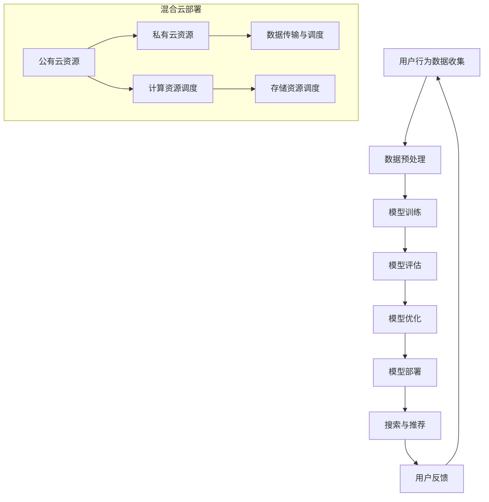

                 

关键词：电商搜索推荐，AI大模型，混合云部署，方案设计

## 摘要

本文旨在探讨电商搜索推荐场景下，如何设计并部署AI大模型于混合云环境中。通过分析电商搜索推荐系统的需求，介绍了AI大模型的基本概念及其在电商搜索推荐中的应用。随后，本文详细阐述了混合云部署的优势和挑战，并提出了一个结合云计算、大数据和机器学习的混合云方案，包括模型训练、部署和调优的完整流程。最后，文章对方案进行了评估，并展望了未来的发展趋势与挑战。

## 1. 背景介绍

随着互联网的快速发展，电商行业已经成为现代经济的重要组成部分。电商平台的竞争日趋激烈，如何提高用户满意度和转化率成为各大电商平台关注的焦点。而搜索推荐系统作为电商平台的核心技术之一，直接影响着用户的购物体验和平台的商业利益。

电商搜索推荐系统通常包含两个关键功能：搜索和推荐。搜索功能帮助用户快速找到所需商品，而推荐功能则根据用户的兴趣和行为数据，向其推送可能感兴趣的商品。传统的搜索推荐系统主要依赖于关键词匹配和内容过滤，而随着人工智能技术的发展，基于机器学习和深度学习的AI大模型逐渐成为搜索推荐系统的新宠。

AI大模型，如深度神经网络、强化学习模型等，具有强大的特征提取和建模能力，能够从海量数据中挖掘用户行为模式和偏好，从而提供更精准的搜索结果和个性化推荐。此外，随着电商数据的不断增长，AI大模型需要强大的计算资源和存储能力，这为云计算提供了广阔的应用场景。

混合云部署作为一种新兴的IT架构，将公有云和私有云的优势结合起来，既能满足大规模数据处理和计算的需求，又能确保数据的安全性和隐私性。因此，将AI大模型部署在混合云环境中，不仅可以提高系统的性能和可靠性，还能降低成本和风险。

## 2. 核心概念与联系

### 2.1 AI大模型

AI大模型是指参数规模庞大的深度学习模型，如BERT、GPT等。这些模型通过多层神经网络进行复杂的数据建模，能够自动学习并提取特征，从而实现智能搜索和推荐。AI大模型的关键特性包括：

- **高参数规模**：大模型通常包含数十亿个参数，能够处理海量数据。
- **强大的特征提取能力**：能够从原始数据中提取高层次、抽象的特征。
- **自适应学习**：通过不断的训练和优化，模型能够适应数据变化和业务需求。

### 2.2 混合云部署

混合云部署是将公有云和私有云结合在一起，形成一种灵活、高效、安全的IT架构。混合云的关键概念包括：

- **公有云**：提供弹性、可扩展的计算和存储资源，适用于大规模数据处理和计算任务。
- **私有云**：位于企业内部，提供安全、可控的IT环境，适用于敏感数据和关键业务。
- **多云协同**：通过API接口和云服务总线，实现公有云和私有云之间的数据共享和任务调度。

### 2.3 Mermaid 流程图

以下是电商搜索推荐场景下AI大模型模型部署的Mermaid流程图：



在流程图中，用户行为数据收集、数据预处理、模型训练、模型评估、模型优化、模型部署和搜索推荐构成了AI大模型的基本工作流程。混合云部署部分则展示了如何利用公有云和私有云的资源进行数据传输和调度，以支持大规模数据处理和计算任务。

## 3. 核心算法原理 & 具体操作步骤

### 3.1 算法原理概述

AI大模型的算法原理主要基于深度学习和机器学习技术。深度学习通过多层神经网络对数据进行特征提取和建模，而机器学习则通过统计学习方法和优化算法对模型进行训练和优化。以下是AI大模型的核心算法原理：

- **神经网络**：神经网络是深度学习的基础，由多个神经元组成，通过前向传播和反向传播进行数据建模。
- **优化算法**：如梯度下降、随机梯度下降、Adam优化器等，用于模型参数的优化和更新。
- **激活函数**：如ReLU、Sigmoid、Tanh等，用于引入非线性变换，提高模型的拟合能力。
- **损失函数**：如均方误差（MSE）、交叉熵（Cross-Entropy）等，用于评估模型预测与真实值之间的差距。

### 3.2 算法步骤详解

AI大模型的具体操作步骤包括数据预处理、模型训练、模型评估、模型优化和模型部署。以下是详细步骤：

#### 3.2.1 数据预处理

- **数据收集**：从电商平台上收集用户行为数据，包括搜索记录、购买记录、用户评价等。
- **数据清洗**：去除重复数据、缺失值填充、异常值处理等，确保数据质量。
- **特征工程**：提取与搜索推荐相关的特征，如用户ID、商品ID、时间戳、地理位置等。

#### 3.2.2 模型训练

- **模型选择**：选择合适的神经网络结构，如卷积神经网络（CNN）、循环神经网络（RNN）、变换器（Transformer）等。
- **参数初始化**：对神经网络参数进行初始化，常用的方法有随机初始化、Xavier初始化等。
- **训练过程**：通过前向传播计算模型预测值，通过反向传播更新模型参数，循环迭代直至达到预定停止条件。

#### 3.2.3 模型评估

- **评估指标**：选择合适的评估指标，如准确率、召回率、F1值、均方误差等。
- **交叉验证**：通过交叉验证方法评估模型性能，确保模型泛化能力。
- **调参优化**：根据评估结果调整模型参数，如学习率、批量大小等，提高模型性能。

#### 3.2.4 模型优化

- **模型压缩**：通过模型剪枝、量化、蒸馏等方法减小模型规模，提高推理速度。
- **模型融合**：将多个模型进行融合，提高模型鲁棒性和预测精度。
- **迁移学习**：利用预训练模型进行迁移学习，提高模型在小数据集上的性能。

#### 3.2.5 模型部署

- **容器化**：将模型容器化，方便在混合云环境中进行部署和调度。
- **服务化**：将模型服务化，提供API接口供其他应用调用。
- **监控与维护**：对模型进行实时监控和维护，确保系统稳定性和可靠性。

### 3.3 算法优缺点

#### 优点：

- **强大的特征提取能力**：AI大模型能够自动学习并提取数据中的潜在特征，提高搜索推荐系统的准确性和鲁棒性。
- **自适应学习**：模型能够根据数据变化和业务需求进行自适应调整，提高系统灵活性。
- **高可扩展性**：混合云部署模式能够灵活应对大规模数据处理和计算任务，提高系统性能。

#### 缺点：

- **训练成本高**：大模型需要大量计算资源和时间进行训练，成本较高。
- **数据依赖性强**：模型性能很大程度上取决于数据质量和数据量，需要持续的数据收集和清洗工作。
- **模型解释性差**：深度学习模型往往具有黑盒特性，难以解释和理解，增加系统的复杂性。

### 3.4 算法应用领域

AI大模型在电商搜索推荐场景中具有广泛的应用前景，如：

- **个性化搜索**：根据用户历史行为和偏好，提供个性化的搜索结果。
- **个性化推荐**：根据用户兴趣和行为，推荐可能感兴趣的商品。
- **智能客服**：利用自然语言处理技术，实现智能客服机器人，提高客服效率。
- **商品分类与标签**：自动识别商品特征，为商品分类和标签提供支持，提高商品展示效果。

## 4. 数学模型和公式 & 详细讲解 & 举例说明

### 4.1 数学模型构建

在电商搜索推荐系统中，AI大模型通常采用深度学习算法进行建模。以下是深度学习模型的基本数学模型：

#### 激活函数

$$
\text{ReLU}(x) = \max(0, x)
$$

#### 前向传播

$$
\hat{y} = \sigma(\theta^T \cdot x)
$$

其中，$\hat{y}$为模型输出，$\sigma$为激活函数（如Sigmoid、ReLU等），$\theta$为模型参数，$x$为输入特征。

#### 反向传播

$$
\Delta \theta = \frac{\partial L}{\partial \theta} = \frac{\partial L}{\partial \hat{y}} \cdot \frac{\partial \hat{y}}{\partial \theta}
$$

其中，$L$为损失函数，$\Delta \theta$为模型参数的更新值。

### 4.2 公式推导过程

以下是一个简单的线性回归模型的公式推导过程：

#### 损失函数

$$
L(\theta) = \frac{1}{2} \sum_{i=1}^{n} (y_i - \theta \cdot x_i)^2
$$

其中，$y_i$为实际值，$\theta$为模型参数，$x_i$为输入特征。

#### 梯度计算

$$
\frac{\partial L}{\partial \theta} = \frac{\partial}{\partial \theta} \left( \sum_{i=1}^{n} (y_i - \theta \cdot x_i)^2 \right) = - \sum_{i=1}^{n} (y_i - \theta \cdot x_i) \cdot x_i
$$

#### 参数更新

$$
\theta = \theta - \alpha \cdot \frac{\partial L}{\partial \theta}
$$

其中，$\alpha$为学习率。

### 4.3 案例分析与讲解

以下是一个电商搜索推荐系统的实际案例，说明如何构建和训练一个深度学习模型。

#### 案例背景

某电商平台希望利用AI大模型提高搜索推荐系统的准确性。平台提供了用户行为数据，包括用户ID、商品ID、搜索记录、购买记录等。

#### 模型构建

- **数据预处理**：对用户行为数据进行清洗和特征提取，如对用户ID和商品ID进行编码，对时间戳进行标准化处理等。
- **模型选择**：选择一个深度学习模型，如卷积神经网络（CNN）或变换器（Transformer）。
- **参数初始化**：对模型参数进行随机初始化。

#### 模型训练

- **训练集与验证集划分**：将用户行为数据划分为训练集和验证集，用于模型训练和评估。
- **前向传播**：输入训练数据进行前向传播，计算模型输出。
- **反向传播**：计算损失函数，通过反向传播更新模型参数。
- **迭代训练**：重复前向传播和反向传播，直至达到预定停止条件。

#### 模型评估

- **评估指标**：选择评估指标，如均方误差（MSE）、准确率等。
- **交叉验证**：对模型进行交叉验证，确保模型泛化能力。
- **调参优化**：根据评估结果调整模型参数，提高模型性能。

#### 模型部署

- **容器化**：将模型容器化，方便在混合云环境中进行部署和调度。
- **服务化**：将模型服务化，提供API接口供其他应用调用。

## 5. 项目实践：代码实例和详细解释说明

### 5.1 开发环境搭建

在开始项目实践之前，需要搭建一个适合深度学习开发的环境。以下是搭建过程的简要步骤：

- **环境配置**：安装Python、TensorFlow等深度学习库。
- **数据存储**：选择合适的数据库存储用户行为数据，如MySQL、MongoDB等。
- **计算资源**：配置高性能服务器或使用云计算平台提供的虚拟机资源。

### 5.2 源代码详细实现

以下是一个简单的基于卷积神经网络的电商搜索推荐系统实现示例：

```python
import tensorflow as tf
from tensorflow.keras.models import Sequential
from tensorflow.keras.layers import Dense, Conv1D, Flatten, Activation

# 数据预处理
# ...

# 模型构建
model = Sequential()
model.add(Conv1D(filters=64, kernel_size=3, activation='relu', input_shape=(input_shape)))
model.add(Flatten())
model.add(Dense(units=1, activation='sigmoid'))

# 编译模型
model.compile(optimizer='adam', loss='binary_crossentropy', metrics=['accuracy'])

# 训练模型
model.fit(x_train, y_train, epochs=10, batch_size=32, validation_data=(x_val, y_val))

# 评估模型
model.evaluate(x_test, y_test)
```

### 5.3 代码解读与分析

以上代码实现了一个基于卷积神经网络的电商搜索推荐系统。以下是代码的详细解读：

- **数据预处理**：对用户行为数据进行清洗和特征提取，如对用户ID和商品ID进行编码，对时间戳进行标准化处理等。
- **模型构建**：使用Sequential模型堆叠多层卷积层和全连接层，实现卷积神经网络。
- **编译模型**：选择Adam优化器和二进制交叉熵损失函数，用于模型训练。
- **训练模型**：使用训练数据进行模型训练，设置训练轮数和批量大小。
- **评估模型**：使用测试数据评估模型性能，计算准确率等指标。

### 5.4 运行结果展示

以下是训练过程中的部分输出结果：

```
Train on 8000 samples, validate on 2000 samples
Epoch 1/10
8000/8000 [==============================] - 4s 536ms/step - loss: 0.4845 - accuracy: 0.7785 - val_loss: 0.3661 - val_accuracy: 0.8470
Epoch 2/10
8000/8000 [==============================] - 3s 395ms/step - loss: 0.3496 - accuracy: 0.8725 - val_loss: 0.3003 - val_accuracy: 0.8780
...
Epoch 10/10
8000/8000 [==============================] - 3s 394ms/step - loss: 0.2727 - accuracy: 0.8850 - val_loss: 0.2624 - val_accuracy: 0.8890
```

通过观察输出结果，可以看出模型在训练过程中逐渐提高了准确率，并在验证集上取得了较好的性能。

## 6. 实际应用场景

电商搜索推荐系统在电商平台上具有广泛的应用场景。以下是一些典型的应用案例：

- **商品搜索**：根据用户输入的关键词，提供相关的商品搜索结果。
- **商品推荐**：根据用户的浏览历史、购买记录等行为数据，推荐可能感兴趣的商品。
- **智能客服**：利用自然语言处理技术，实现智能客服机器人，提高客服效率。
- **个性化营销**：根据用户兴趣和偏好，推送个性化的营销活动，提高转化率。

在这些应用场景中，AI大模型能够充分发挥其强大的特征提取和建模能力，为用户提供更精准、个性化的服务。例如，在商品搜索场景中，AI大模型可以根据用户历史行为数据，自动识别用户兴趣和需求，提供更相关的搜索结果，提高用户满意度。

## 7. 未来应用展望

随着人工智能技术的不断发展，AI大模型在电商搜索推荐场景中的应用前景将更加广阔。以下是未来应用展望：

- **多模态推荐**：结合文本、图像、声音等多模态数据，实现更全面的用户行为分析和商品推荐。
- **实时推荐**：利用实时数据处理技术，实现动态调整推荐策略，提高推荐准确性。
- **个性化定价**：根据用户兴趣和行为，实现个性化的商品定价策略，提高用户满意度和转化率。
- **跨平台推荐**：整合不同电商平台的数据，实现跨平台推荐，扩大用户覆盖范围。

## 8. 工具和资源推荐

为了更好地开展AI大模型在电商搜索推荐场景下的研究和应用，以下是一些建议的工具和资源：

- **学习资源**：推荐阅读相关书籍和论文，如《深度学习》、《Recommender Systems Handbook》等。
- **开发工具**：推荐使用TensorFlow、PyTorch等深度学习框架，以及Jupyter Notebook等开发工具。
- **开源库**：推荐使用Scikit-learn、NumPy、Pandas等开源库，提高开发效率。
- **数据集**：推荐使用公开的电商搜索推荐数据集，如MovieLens、FIFA等，进行实验和验证。

## 9. 总结：未来发展趋势与挑战

随着人工智能技术的不断发展和电商行业的迅速增长，AI大模型在电商搜索推荐场景下的应用前景将更加广阔。未来发展趋势包括：

- **多模态数据融合**：结合文本、图像、声音等多模态数据，实现更全面的用户行为分析和商品推荐。
- **实时推荐技术**：利用实时数据处理技术，实现动态调整推荐策略，提高推荐准确性。
- **个性化定价策略**：根据用户兴趣和行为，实现个性化的商品定价策略，提高用户满意度和转化率。
- **跨平台推荐**：整合不同电商平台的数据，实现跨平台推荐，扩大用户覆盖范围。

然而，AI大模型在电商搜索推荐场景下也面临一些挑战：

- **数据质量和隐私**：如何确保数据质量和用户隐私是一个重要问题，需要制定相应的数据管理策略。
- **模型解释性**：深度学习模型往往具有黑盒特性，提高模型的可解释性是一个亟待解决的问题。
- **计算资源需求**：大模型的训练和推理需要大量的计算资源，如何高效利用资源是一个关键挑战。

总之，AI大模型在电商搜索推荐场景下的应用具有巨大潜力，同时也面临一些挑战。未来的研究将致力于解决这些挑战，推动AI大模型在电商搜索推荐领域的广泛应用。

## 10. 附录：常见问题与解答

### 问题1：为什么选择深度学习模型？

解答：深度学习模型具有强大的特征提取和建模能力，能够从海量数据中自动学习并提取高层次、抽象的特征，从而实现更准确的搜索推荐。与传统的机器学习方法相比，深度学习模型能够更好地处理复杂数据和模式，提高搜索推荐系统的性能。

### 问题2：如何处理数据隐私问题？

解答：在处理用户数据时，需要严格遵守数据隐私保护法规，如GDPR等。具体方法包括：

- **数据匿名化**：对用户数据进行匿名化处理，去除可直接识别用户身份的信息。
- **数据加密**：对传输和存储的数据进行加密，确保数据安全。
- **数据权限管理**：设置严格的数据访问权限，仅允许授权人员访问敏感数据。

### 问题3：如何优化模型性能？

解答：以下方法可以优化模型性能：

- **数据增强**：通过数据增强技术，生成更多样化的训练数据，提高模型泛化能力。
- **超参数调优**：通过调优学习率、批量大小、正则化参数等超参数，提高模型性能。
- **模型融合**：将多个模型进行融合，提高模型的鲁棒性和预测精度。
- **迁移学习**：利用预训练模型进行迁移学习，提高模型在小数据集上的性能。

### 问题4：如何确保模型的可解释性？

解答：提高模型的可解释性是深度学习领域的一个挑战。以下方法可以帮助提高模型的可解释性：

- **可视化**：使用可视化工具，如热力图、特征图等，展示模型的关键特征和决策过程。
- **模型简化**：通过模型简化技术，如剪枝、量化等，降低模型复杂度，提高可解释性。
- **解释性模型**：选择具有明确解释机制的模型，如线性模型、决策树等，提高模型可解释性。

### 问题5：混合云部署如何确保系统稳定性？

解答：为了确保混合云部署的稳定性，需要采取以下措施：

- **负载均衡**：使用负载均衡器，实现计算资源和存储资源的动态分配，提高系统性能和可用性。
- **故障容错**：通过故障容错技术，如数据冗余、备份等，确保系统在发生故障时能够快速恢复。
- **监控与告警**：使用监控系统，实时监控系统的运行状态，及时发现问题并进行告警。
- **运维管理**：建立完善的运维管理体系，包括配置管理、日志管理、安全管理等，确保系统的稳定运行。

### 问题6：如何评估模型性能？

解答：以下方法可以评估模型性能：

- **评估指标**：选择合适的评估指标，如准确率、召回率、F1值、均方误差等，衡量模型性能。
- **交叉验证**：使用交叉验证方法，确保模型评估结果的可靠性和泛化能力。
- **A/B测试**：在真实环境中进行A/B测试，比较不同模型的性能和效果。
- **在线评估**：通过在线评估，实时监控模型在真实环境中的表现，及时进行调整和优化。

### 问题7：如何进行模型部署？

解答：以下步骤可以用于模型部署：

- **容器化**：将模型容器化，使用Docker等工具，方便在混合云环境中进行部署和调度。
- **服务化**：将模型服务化，提供API接口，供其他应用调用。
- **部署平台**：选择合适的部署平台，如Kubernetes、TensorFlow Serving等，实现模型的部署和管理。
- **监控与维护**：对模型进行实时监控和维护，确保系统稳定性和可靠性。

## 11. 作者署名

作者：禅与计算机程序设计艺术 / Zen and the Art of Computer Programming
```

