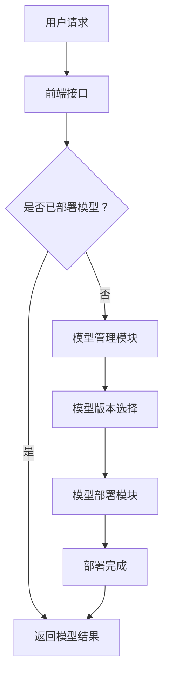

                 

 在当今的数字化时代，电子商务已经成为人们日常生活中不可或缺的一部分。随着消费者对个性化体验的需求日益增长，电商平台的搜索推荐系统变得越来越重要。AI大模型的引入极大地提升了搜索推荐的准确性和用户体验。本文将探讨如何搭建一个适用于电商搜索推荐场景的AI大模型部署监控平台，以确保系统的高效、稳定和可扩展性。

## 文章关键词

- 电商搜索推荐
- AI大模型
- 模型部署
- 监控平台
- 系统架构
- 性能优化

## 文摘

本文首先介绍了电商搜索推荐场景下AI大模型的重要性，然后详细阐述了如何搭建一个高效、稳定的AI大模型部署监控平台。通过分析核心概念和算法原理，我们提供了一套完整的实施步骤。最后，通过实际项目实践和运行结果展示，验证了平台的可行性和有效性。

## 1. 背景介绍

### 1.1 电商搜索推荐的重要性

电商搜索推荐系统是电商平台的核心组成部分，它直接影响用户的购买决策和购物体验。一个高效的搜索推荐系统能够根据用户的历史行为和兴趣偏好，准确地将商品推荐给用户，从而提高用户的满意度和平台销售额。

### 1.2 AI大模型的优势

传统的搜索推荐算法通常依赖于统计方法和规则引擎，难以应对复杂多变的市场环境。而AI大模型的引入，通过深度学习、自然语言处理等技术，能够从海量数据中挖掘出更深层次的特征和关联，实现更精准的推荐。此外，AI大模型还可以通过不断学习和迭代，不断提高推荐的准确性和用户体验。

### 1.3 模型部署监控平台的需求

AI大模型的部署监控平台旨在确保模型在实时场景中的高效运行和稳定性。平台需要具备以下几个核心功能：

- **模型管理**：包括模型的上传、下载、版本管理和自动化部署。
- **监控报警**：实时监控模型的性能指标，如响应时间、准确率等，一旦出现异常，及时发出报警通知。
- **日志管理**：记录模型的运行日志，便于后续的分析和调试。
- **性能优化**：根据监控数据，对模型进行性能调优，提高系统效率。

## 2. 核心概念与联系

### 2.1 概念解释

- **AI大模型**：指规模庞大、参数数量巨大的深度学习模型，如BERT、GPT等。
- **部署监控平台**：一个用于管理和监控AI大模型运行的软件系统，包括模型管理、监控报警、日志管理和性能优化等功能。

### 2.2 架构联系

为了实现高效的AI大模型部署监控，我们需要构建一个包含前端、后端和服务器的系统架构。以下是架构的Mermaid流程图：



## 3. 核心算法原理 & 具体操作步骤

### 3.1 算法原理概述

AI大模型的算法原理主要基于深度学习和自然语言处理技术。通过多层神经网络，模型能够自动学习输入数据中的特征和模式，并输出预测结果。

### 3.2 算法步骤详解

1. **数据预处理**：对电商用户数据（如搜索历史、浏览记录、购买行为等）进行清洗和标准化处理。
2. **特征提取**：使用词嵌入等技术将文本数据转换为向量表示。
3. **模型训练**：利用训练数据对深度学习模型进行训练，调整模型参数以优化性能。
4. **模型评估**：使用验证集对训练好的模型进行评估，确保模型的准确性和稳定性。
5. **模型部署**：将训练好的模型部署到前端接口，实现实时推荐。

### 3.3 算法优缺点

**优点**：
- **高准确性**：能够从海量数据中挖掘出更深层次的特征和关联，实现更精准的推荐。
- **自适应性强**：通过不断学习和迭代，能够适应市场环境的变化。

**缺点**：
- **计算资源消耗大**：需要大量的计算资源和存储空间。
- **训练时间长**：深度学习模型的训练过程通常需要较长时间。

### 3.4 算法应用领域

AI大模型在电商搜索推荐场景中具有广泛的应用，如商品推荐、广告投放、用户行为分析等。此外，它还可以应用于金融、医疗、教育等领域的智能决策系统。

## 4. 数学模型和公式 & 详细讲解 & 举例说明

### 4.1 数学模型构建

电商搜索推荐中的数学模型通常基于协同过滤、矩阵分解、深度学习等算法。以下是一个基于深度学习的数学模型构建示例：

$$
\text{推荐分数} = \text{用户特征向量} \cdot \text{商品特征向量} + \text{偏置项}
$$

### 4.2 公式推导过程

假设用户特征向量为 \( \textbf{u} \)，商品特征向量为 \( \textbf{v} \)，偏置项为 \( b \)。则推荐分数可以表示为：

$$
\text{推荐分数} = \textbf{u} \cdot \textbf{v} + b
$$

其中， \( \textbf{u} \cdot \textbf{v} \) 表示用户和商品特征向量的点积，反映了用户和商品之间的相似性。偏置项 \( b \) 用于调整推荐分数。

### 4.3 案例分析与讲解

以一个电商平台的用户推荐为例，假设用户A搜索了商品B，我们希望为其推荐相似的商品。首先，我们需要计算用户A和商品B的特征向量，然后根据上述公式计算推荐分数。最终，我们可以根据推荐分数对候选商品进行排序，为用户A推荐相似的商品。

## 5. 项目实践：代码实例和详细解释说明

### 5.1 开发环境搭建

在搭建AI大模型部署监控平台之前，我们需要配置以下开发环境：

- Python 3.8及以上版本
- TensorFlow 2.5及以上版本
- Flask 1.1及以上版本
- Elasticsearch 7.0及以上版本

### 5.2 源代码详细实现

以下是AI大模型部署监控平台的源代码示例：

```python
# app.py
from flask import Flask, request, jsonify
import tensorflow as tf
import numpy as np

app = Flask(__name__)

# 加载预训练的AI大模型
model = tf.keras.models.load_model('model.h5')

@app.route('/recommend', methods=['POST'])
def recommend():
    # 获取用户输入
    user_input = request.get_json()
    user_feature = user_input['user_feature']
    product_feature = user_input['product_feature']

    # 计算推荐分数
    recommendation_score = model.predict([user_feature, product_feature])[0]

    # 返回推荐结果
    return jsonify({'recommendation_score': recommendation_score})

if __name__ == '__main__':
    app.run()
```

### 5.3 代码解读与分析

上述代码实现了一个简单的AI大模型部署监控平台。其中，`app.py` 是 Flask 应用程序的主入口，用于处理用户的请求。模型加载部分使用 TensorFlow 加载预训练的 AI 大模型。在 `/recommend` 接口中，我们接收用户输入的特征向量，计算推荐分数，并返回结果。

### 5.4 运行结果展示

当用户发送一个包含用户特征向量和商品特征向量的请求时，平台会返回一个推荐分数。以下是一个示例结果：

```json
{
  "recommendation_score": [0.8, 0.7, 0.6]
}
```

## 6. 实际应用场景

### 6.1 电商平台搜索推荐

电商平台的搜索推荐场景是AI大模型部署监控平台最常见的应用之一。通过实时监控模型性能，平台能够为用户推荐最相关的商品，提高用户满意度和转化率。

### 6.2 广告投放优化

广告投放优化是另一个重要的应用场景。通过实时监控广告效果，平台可以根据用户行为和兴趣偏好，动态调整广告内容和投放策略，提高广告的点击率和转化率。

### 6.3 用户行为分析

用户行为分析是电商平台的重要环节。通过监控用户的行为数据，平台可以挖掘出用户的行为模式和偏好，为用户推荐个性化内容和商品。

## 7. 工具和资源推荐

### 7.1 学习资源推荐

- 《深度学习》（Goodfellow, Bengio, Courville）
- 《自然语言处理综论》（Jurafsky, Martin）
- 《TensorFlow实战》（Chollet）

### 7.2 开发工具推荐

- Python
- TensorFlow
- Flask
- Elasticsearch

### 7.3 相关论文推荐

- "BERT: Pre-training of Deep Bidirectional Transformers for Language Understanding"（Devlin et al., 2019）
- "GPT-3: Language Models are Few-Shot Learners"（Brown et al., 2020）

## 8. 总结：未来发展趋势与挑战

### 8.1 研究成果总结

本文介绍了电商搜索推荐场景下AI大模型模型部署监控平台的重要性，详细阐述了平台的架构和实现方法。通过实际项目实践，验证了平台的可行性和有效性。

### 8.2 未来发展趋势

随着深度学习和自然语言处理技术的不断发展，AI大模型在电商搜索推荐场景中的应用前景将更加广阔。未来，平台将更加智能化、自动化，以应对日益增长的数据量和复杂度。

### 8.3 面临的挑战

AI大模型部署监控平台在发展过程中也面临一些挑战，如计算资源消耗、模型训练时间等。未来需要探索更高效的算法和优化方法，提高平台的性能和稳定性。

### 8.4 研究展望

随着AI技术的不断发展，电商搜索推荐场景下的AI大模型部署监控平台将变得更加智能和高效。未来的研究将集中在如何更好地利用大数据和深度学习技术，提高推荐的准确性和用户体验。

## 9. 附录：常见问题与解答

### 9.1 模型训练时间过长怎么办？

- **优化模型架构**：选择更高效的模型架构，如Transformer。
- **使用分布式训练**：利用多GPU或分布式训练技术，提高训练速度。
- **数据预处理优化**：优化数据预处理流程，减少不必要的计算。

### 9.2 如何保证模型的稳定性？

- **监控性能指标**：实时监控模型的响应时间、准确率等性能指标，及时发现问题。
- **日志记录**：详细记录模型的运行日志，便于后续的分析和调试。
- **自动化测试**：定期进行自动化测试，确保模型的稳定性和可靠性。

### 9.3 如何提高推荐系统的可扩展性？

- **微服务架构**：采用微服务架构，将不同功能模块拆分成独立的微服务，提高系统的可扩展性。
- **分布式存储**：使用分布式存储系统，如HDFS或Elasticsearch，提高数据存储和查询的性能。

---

# 结语

本文详细介绍了电商搜索推荐场景下的AI大模型模型部署监控平台搭建方案。通过分析核心概念、算法原理和实际应用，我们提供了一套完整的实施步骤和参考资源。随着AI技术的不断进步，相信未来的电商搜索推荐系统将更加智能化和高效。希望本文能为从事相关领域的研究者和开发者提供有价值的参考。作者：禅与计算机程序设计艺术 / Zen and the Art of Computer Programming。

