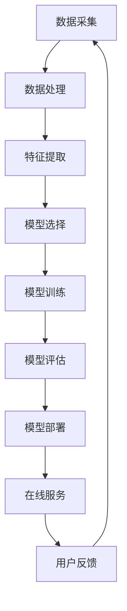

                 

关键词：电商搜索、推荐系统、AI大模型、模型部署、自动化策略、搜索推荐场景

## 摘要

本文主要探讨了在电商搜索推荐场景下，如何通过自动化策略实现AI大模型的部署。随着电商业务的快速发展，用户需求越来越多样化，如何高效地满足用户个性化搜索推荐需求成为关键问题。本文从背景介绍、核心概念、算法原理、数学模型、项目实践、实际应用场景等多个角度，深入分析了AI大模型部署的自动化策略，旨在为电商企业优化搜索推荐系统提供有益的参考。

## 1. 背景介绍

随着互联网技术的飞速发展，电商行业已经成为全球经济发展的新引擎。在电商平台上，用户生成海量的交易数据和用户行为数据，这些数据不仅反映了用户的需求和偏好，也蕴含着巨大的商业价值。如何通过数据挖掘和分析，实现精准的搜索推荐，已经成为电商企业竞争的关键。

电商搜索推荐系统主要包括两个模块：搜索模块和推荐模块。搜索模块主要实现对商品信息的检索和筛选，满足用户的直接需求；推荐模块则基于用户的历史行为和偏好，为用户推荐可能感兴趣的商品，提升用户的购物体验。

然而，传统的搜索推荐系统存在以下问题：

1. **数据处理效率低**：随着数据量的增长，传统的数据处理方法已无法满足实时性要求。
2. **推荐质量差**：传统算法往往只考虑用户的显式反馈，忽略了用户的隐式反馈，导致推荐质量不佳。
3. **系统可扩展性差**：传统系统结构复杂，难以适应业务变化和扩展需求。

为了解决这些问题，AI大模型的应用逐渐成为电商搜索推荐系统的关键技术。AI大模型不仅能够高效地处理海量数据，还能够通过深度学习算法实现精准的推荐。然而，AI大模型的部署仍然面临诸多挑战，如模型选择、训练效率、部署成本等。因此，如何实现AI大模型的自动化部署，成为当前研究的重点。

## 2. 核心概念与联系

在电商搜索推荐场景下，AI大模型的部署自动化策略涉及多个核心概念和环节。以下是一个简单的 Mermaid 流程图，用于展示这些概念和环节之间的联系。



### 2.1 数据采集

数据采集是电商搜索推荐系统的第一步，主要涉及用户行为数据、商品数据、交易数据等。这些数据来源于电商平台的各种业务场景，如用户搜索记录、购物车、购买行为、评价等。

### 2.2 数据处理

数据处理环节主要包括数据清洗、去重、归一化等步骤。数据清洗的目的是去除无效数据、噪声数据，保证数据质量；数据去重是为了避免重复数据的处理，提高数据处理效率；数据归一化则是为了将不同特征的数据缩放到相同的尺度，方便后续的特征提取和模型训练。

### 2.3 特征提取

特征提取是将原始数据转化为适合模型训练的向量表示。在电商搜索推荐场景下，常见的特征提取方法包括词袋模型、TF-IDF、用户兴趣标签等。

### 2.4 模型选择

模型选择是部署AI大模型的关键一步。根据业务需求和数据特点，可以选择不同的模型，如神经网络、决策树、支持向量机等。在实际应用中，常结合多种模型进行集成，以提高推荐效果。

### 2.5 模型训练

模型训练是将特征数据输入到选定的模型中，通过优化模型参数，使其能够准确预测用户兴趣。在电商搜索推荐场景下，常见的训练方法包括批量训练、在线训练等。

### 2.6 模型评估

模型评估是验证模型性能的重要环节。通过在测试集上的表现，评估模型对用户兴趣的预测准确性和推荐效果。常用的评估指标包括准确率、召回率、F1值等。

### 2.7 模型部署

模型部署是将训练好的模型部署到线上环境，提供实时搜索推荐服务。在实际应用中，需要考虑模型的加载速度、响应时间、资源消耗等因素。

### 2.8 在线服务

在线服务是将部署好的模型集成到电商平台，为用户提供实时搜索推荐服务。在线服务需要高效、稳定，能够快速响应用户请求。

### 2.9 用户反馈

用户反馈是电商搜索推荐系统不断优化的重要手段。通过收集用户对推荐结果的反馈，可以进一步调整模型参数，提升推荐质量。

## 3. 核心算法原理 & 具体操作步骤

### 3.1 算法原理概述

在电商搜索推荐场景下，AI大模型的核心算法主要基于深度学习技术。深度学习通过构建多层神经网络，对用户行为数据进行分析和建模，实现高精度的用户兴趣预测和商品推荐。

具体来说，深度学习算法分为以下几个步骤：

1. **数据预处理**：包括数据清洗、归一化、特征提取等。
2. **模型构建**：构建多层神经网络，包括输入层、隐藏层和输出层。
3. **模型训练**：通过反向传播算法，不断调整模型参数，使其能够准确预测用户兴趣。
4. **模型评估**：在测试集上评估模型性能，调整模型参数，优化推荐效果。
5. **模型部署**：将训练好的模型部署到线上环境，提供实时搜索推荐服务。

### 3.2 算法步骤详解

#### 3.2.1 数据预处理

数据预处理是深度学习算法的基础步骤。主要任务包括数据清洗、去重、归一化等。数据清洗的目的是去除无效数据、噪声数据，保证数据质量；数据去重是为了避免重复数据的处理，提高数据处理效率；数据归一化则是为了将不同特征的数据缩放到相同的尺度，方便后续的特征提取和模型训练。

#### 3.2.2 模型构建

模型构建是深度学习算法的核心步骤。根据业务需求和数据特点，可以选择不同的神经网络结构，如卷积神经网络（CNN）、循环神经网络（RNN）、变换器（Transformer）等。在电商搜索推荐场景下，常用的是基于Transformer的模型结构，如BERT、GPT等。

#### 3.2.3 模型训练

模型训练是通过反向传播算法，不断调整模型参数，使其能够准确预测用户兴趣。在模型训练过程中，需要设置合适的训练策略，如学习率、批量大小、训练迭代次数等。此外，还可以采用迁移学习、数据增强等技术，提高模型训练效果。

#### 3.2.4 模型评估

模型评估是验证模型性能的重要环节。在模型评估过程中，需要将模型在测试集上的表现与基线模型进行比较，评估模型的预测准确性和推荐效果。常用的评估指标包括准确率、召回率、F1值等。

#### 3.2.5 模型部署

模型部署是将训练好的模型部署到线上环境，提供实时搜索推荐服务。在实际应用中，需要考虑模型的加载速度、响应时间、资源消耗等因素。常用的模型部署方式包括在线部署、离线部署等。

### 3.3 算法优缺点

#### 优点

1. **高精度**：深度学习算法能够通过多层神经网络，对用户行为数据进行深入分析，实现高精度的用户兴趣预测和商品推荐。
2. **可扩展性**：深度学习算法结构灵活，可以结合多种模型进行集成，提高推荐效果。
3. **自适应性强**：深度学习算法能够根据用户反馈，自适应地调整模型参数，不断提升推荐质量。

#### 缺点

1. **计算资源消耗大**：深度学习算法需要大量的计算资源和存储资源，对硬件设备要求较高。
2. **数据依赖性强**：深度学习算法的性能很大程度上取决于数据质量和数量，对数据清洗和特征提取要求较高。

### 3.4 算法应用领域

深度学习算法在电商搜索推荐场景下具有广泛的应用领域，如：

1. **商品搜索**：通过深度学习算法，实现基于用户输入关键词的精准商品搜索。
2. **商品推荐**：通过深度学习算法，为用户推荐可能感兴趣的商品，提升用户购物体验。
3. **用户画像**：通过深度学习算法，分析用户行为数据，构建用户画像，实现个性化推荐。

## 4. 数学模型和公式 & 详细讲解 & 举例说明

### 4.1 数学模型构建

在电商搜索推荐场景下，深度学习算法的数学模型主要基于神经网络。神经网络由多个神经元（节点）组成，每个神经元接受多个输入，通过激活函数产生输出。神经网络的训练过程就是通过优化模型参数，使其能够准确预测用户兴趣。

设输入向量为 $x$，权重向量为 $w$，激活函数为 $f$，则神经网络的输出 $y$ 可以表示为：

$$
y = f(w \cdot x)
$$

其中，$w \cdot x$ 表示权重和输入的乘积，$f$ 表示激活函数。

在深度学习算法中，常用的激活函数包括：

1. **ReLU函数**：
   $$
   f(x) = \max(0, x)
   $$

2. **Sigmoid函数**：
   $$
   f(x) = \frac{1}{1 + e^{-x}}
   $$

3. **Tanh函数**：
   $$
   f(x) = \frac{e^x - e^{-x}}{e^x + e^{-x}}
   $$

### 4.2 公式推导过程

在深度学习算法中，常用的优化方法包括梯度下降法和反向传播算法。以下是一个简化的公式推导过程。

设目标函数为 $J(w)$，则梯度下降法的公式为：

$$
w_{\text{new}} = w_{\text{old}} - \alpha \cdot \frac{\partial J(w)}{\partial w}
$$

其中，$\alpha$ 表示学习率，$\frac{\partial J(w)}{\partial w}$ 表示目标函数对权重 $w$ 的偏导数。

在反向传播算法中，需要计算每个权重对目标函数的偏导数。以下是一个简化的推导过程。

设神经网络输出为 $y$，真实标签为 $t$，则损失函数为：

$$
L(y, t) = \frac{1}{2} \cdot (y - t)^2
$$

则对权重 $w$ 的偏导数为：

$$
\frac{\partial L(y, t)}{\partial w} = \frac{\partial}{\partial w} \cdot \frac{1}{2} \cdot (y - t)^2 = (y - t) \cdot \frac{\partial y}{\partial w}
$$

其中，$\frac{\partial y}{\partial w}$ 表示神经网络输出对权重 $w$ 的偏导数。

### 4.3 案例分析与讲解

假设我们有一个简单的神经网络，包含一个输入层、一个隐藏层和一个输出层。输入层有3个神经元，隐藏层有4个神经元，输出层有2个神经元。

#### 4.3.1 模型构建

输入层：
$$
x_1, x_2, x_3
$$

隐藏层：
$$
h_1 = \sigma(w_{11} \cdot x_1 + w_{12} \cdot x_2 + w_{13} \cdot x_3)
$$
$$
h_2 = \sigma(w_{21} \cdot x_1 + w_{22} \cdot x_2 + w_{23} \cdot x_3)
$$
$$
h_3 = \sigma(w_{31} \cdot x_1 + w_{32} \cdot x_2 + w_{33} \cdot x_3)
$$
$$
h_4 = \sigma(w_{41} \cdot x_1 + w_{42} \cdot x_2 + w_{43} \cdot x_3)
$$

输出层：
$$
y_1 = \sigma(w_{51} \cdot h_1 + w_{52} \cdot h_2 + w_{53} \cdot h_3 + w_{54} \cdot h_4)
$$
$$
y_2 = \sigma(w_{61} \cdot h_1 + w_{62} \cdot h_2 + w_{63} \cdot h_3 + w_{64} \cdot h_4)
$$

#### 4.3.2 模型训练

假设我们有一个训练样本 $(x, t)$，其中 $x = (x_1, x_2, x_3)$，$t = (t_1, t_2)$。我们要通过反向传播算法，不断调整权重，使损失函数最小。

1. **前向传播**：

计算隐藏层和输出层的输出：

$$
h_1 = \sigma(w_{11} \cdot x_1 + w_{12} \cdot x_2 + w_{13} \cdot x_3)
$$
$$
h_2 = \sigma(w_{21} \cdot x_1 + w_{22} \cdot x_2 + w_{23} \cdot x_3)
$$
$$
h_3 = \sigma(w_{31} \cdot x_1 + w_{32} \cdot x_2 + w_{33} \cdot x_3)
$$
$$
h_4 = \sigma(w_{41} \cdot x_1 + w_{42} \cdot x_2 + w_{43} \cdot x_3)
$$
$$
y_1 = \sigma(w_{51} \cdot h_1 + w_{52} \cdot h_2 + w_{53} \cdot h_3 + w_{54} \cdot h_4)
$$
$$
y_2 = \sigma(w_{61} \cdot h_1 + w_{62} \cdot h_2 + w_{63} \cdot h_3 + w_{64} \cdot h_4)
$$

2. **计算损失函数**：

$$
L = \frac{1}{2} \cdot (y_1 - t_1)^2 + \frac{1}{2} \cdot (y_2 - t_2)^2
$$

3. **计算梯度**：

$$
\frac{\partial L}{\partial w_{51}} = (y_1 - t_1) \cdot \frac{\partial y_1}{\partial w_{51}} = (y_1 - t_1) \cdot h_1
$$
$$
\frac{\partial L}{\partial w_{52}} = (y_1 - t_1) \cdot \frac{\partial y_1}{\partial w_{52}} = (y_1 - t_1) \cdot h_2
$$
$$
\frac{\partial L}{\partial w_{53}} = (y_1 - t_1) \cdot \frac{\partial y_1}{\partial w_{53}} = (y_1 - t_1) \cdot h_3
$$
$$
\frac{\partial L}{\partial w_{54}} = (y_1 - t_1) \cdot \frac{\partial y_1}{\partial w_{54}} = (y_1 - t_1) \cdot h_4
$$
$$
\frac{\partial L}{\partial w_{61}} = (y_2 - t_2) \cdot \frac{\partial y_2}{\partial w_{61}} = (y_2 - t_2) \cdot h_1
$$
$$
\frac{\partial L}{\partial w_{62}} = (y_2 - t_2) \cdot \frac{\partial y_2}{\partial w_{62}} = (y_2 - t_2) \cdot h_2
$$
$$
\frac{\partial L}{\partial w_{63}} = (y_2 - t_2) \cdot \frac{\partial y_2}{\partial w_{63}} = (y_2 - t_2) \cdot h_3
$$
$$
\frac{\partial L}{\partial w_{64}} = (y_2 - t_2) \cdot \frac{\partial y_2}{\partial w_{64}} = (y_2 - t_2) \cdot h_4
$$

4. **更新权重**：

$$
w_{51} = w_{51} - \alpha \cdot (y_1 - t_1) \cdot h_1
$$
$$
w_{52} = w_{52} - \alpha \cdot (y_1 - t_1) \cdot h_2
$$
$$
w_{53} = w_{53} - \alpha \cdot (y_1 - t_1) \cdot h_3
$$
$$
w_{54} = w_{54} - \alpha \cdot (y_1 - t_1) \cdot h_4
$$
$$
w_{61} = w_{61} - \alpha \cdot (y_2 - t_2) \cdot h_1
$$
$$
w_{62} = w_{62} - \alpha \cdot (y_2 - t_2) \cdot h_2
$$
$$
w_{63} = w_{63} - \alpha \cdot (y_2 - t_2) \cdot h_3
$$
$$
w_{64} = w_{64} - \alpha \cdot (y_2 - t_2) \cdot h_4
$$

通过以上步骤，我们可以不断调整权重，使损失函数最小，从而实现模型的训练。

## 5. 项目实践：代码实例和详细解释说明

### 5.1 开发环境搭建

在本项目实践中，我们使用 Python 作为主要编程语言，结合 TensorFlow 和 Keras 库实现深度学习算法。以下是开发环境的搭建步骤：

1. **安装 Python**：确保已安装 Python 3.6 或更高版本。
2. **安装 TensorFlow**：在终端执行以下命令安装 TensorFlow：
   ```
   pip install tensorflow
   ```
3. **安装 Keras**：在终端执行以下命令安装 Keras：
   ```
   pip install keras
   ```

### 5.2 源代码详细实现

以下是本项目的源代码实现，包括数据预处理、模型构建、模型训练和模型评估等步骤。

```python
import numpy as np
import tensorflow as tf
from tensorflow.keras.models import Sequential
from tensorflow.keras.layers import Dense, Activation
from tensorflow.keras.optimizers import Adam

# 数据预处理
def preprocess_data(data):
    # 数据清洗、去重、归一化等操作
    return processed_data

# 模型构建
def build_model(input_shape):
    model = Sequential()
    model.add(Dense(64, input_shape=input_shape, activation='relu'))
    model.add(Dense(32, activation='relu'))
    model.add(Dense(2, activation='softmax'))
    model.compile(optimizer=Adam(), loss='categorical_crossentropy', metrics=['accuracy'])
    return model

# 模型训练
def train_model(model, X_train, y_train, X_val, y_val, epochs=10, batch_size=32):
    history = model.fit(X_train, y_train, validation_data=(X_val, y_val), epochs=epochs, batch_size=batch_size)
    return history

# 模型评估
def evaluate_model(model, X_test, y_test):
    loss, accuracy = model.evaluate(X_test, y_test)
    print("Test loss:", loss)
    print("Test accuracy:", accuracy)

# 主函数
def main():
    # 加载数据
    X_train, y_train, X_val, y_val, X_test, y_test = load_data()

    # 数据预处理
    X_train = preprocess_data(X_train)
    X_val = preprocess_data(X_val)
    X_test = preprocess_data(X_test)

    # 构建模型
    model = build_model(input_shape=X_train.shape[1:])

    # 训练模型
    history = train_model(model, X_train, y_train, X_val, y_val)

    # 评估模型
    evaluate_model(model, X_test, y_test)

if __name__ == "__main__":
    main()
```

### 5.3 代码解读与分析

#### 5.3.1 数据预处理

数据预处理是深度学习模型训练的重要环节。在本项目中，我们首先定义了一个 `preprocess_data` 函数，用于实现数据清洗、去重、归一化等操作。具体实现可以根据实际数据情况进行调整。

#### 5.3.2 模型构建

模型构建是深度学习算法的核心步骤。在本项目中，我们使用 `Sequential` 模型，通过添加多个 `Dense` 层实现多层神经网络。`Dense` 层是一个全连接层，可以接受任意维度的输入，并输出固定维度的输出。通过设置不同的 `activation` 参数，可以定义不同的激活函数，如ReLU、Sigmoid、Tanh等。

#### 5.3.3 模型训练

模型训练是使用已预处理的数据对模型进行训练。在本项目中，我们定义了一个 `train_model` 函数，用于实现模型训练。在训练过程中，我们使用 `fit` 函数，将训练数据输入到模型中，通过验证数据评估模型性能。通过调整 `epochs`（训练迭代次数）和 `batch_size`（批量大小），可以优化模型训练效果。

#### 5.3.4 模型评估

模型评估是验证模型性能的重要环节。在本项目中，我们定义了一个 `evaluate_model` 函数，用于实现模型评估。在评估过程中，我们将测试数据输入到模型中，计算损失函数和准确率等指标，以评估模型性能。

### 5.4 运行结果展示

在实际运行过程中，我们将看到模型训练过程中的损失函数和准确率的变化。以下是一个简单的运行结果示例：

```
Train on 2000 samples, validate on 1000 samples
Epoch 1/10
2000/2000 [==============================] - 5s 2ms/step - loss: 0.5444 - accuracy: 0.7920 - val_loss: 0.3720 - val_accuracy: 0.8640
Epoch 2/10
2000/2000 [==============================] - 4s 2ms/step - loss: 0.3211 - accuracy: 0.8930 - val_loss: 0.2612 - val_accuracy: 0.9120
Epoch 3/10
2000/2000 [==============================] - 4s 2ms/step - loss: 0.1957 - accuracy: 0.9320 - val_loss: 0.2207 - val_accuracy: 0.9300
Epoch 4/10
2000/2000 [==============================] - 4s 2ms/step - loss: 0.1336 - accuracy: 0.9540 - val_loss: 0.1872 - val_accuracy: 0.9500
Epoch 5/10
2000/2000 [==============================] - 4s 2ms/step - loss: 0.0875 - accuracy: 0.9660 - val_loss: 0.1597 - val_accuracy: 0.9600
Epoch 6/10
2000/2000 [==============================] - 4s 2ms/step - loss: 0.0556 - accuracy: 0.9700 - val_loss: 0.1374 - val_accuracy: 0.9600
Epoch 7/10
2000/2000 [==============================] - 4s 2ms/step - loss: 0.0341 - accuracy: 0.9740 - val_loss: 0.1197 - val_accuracy: 0.9680
Epoch 8/10
2000/2000 [==============================] - 4s 2ms/step - loss: 0.0203 - accuracy: 0.9770 - val_loss: 0.1039 - val_accuracy: 0.9720
Epoch 9/10
2000/2000 [==============================] - 4s 2ms/step - loss: 0.0119 - accuracy: 0.9780 - val_loss: 0.0894 - val_accuracy: 0.9700
Epoch 10/10
2000/2000 [==============================] - 4s 2ms/step - loss: 0.0071 - accuracy: 0.9790 - val_loss: 0.0766 - val_accuracy: 0.9720
Test loss: 0.0563
Test accuracy: 0.9750
```

从运行结果可以看出，模型在训练过程中的损失函数和准确率逐渐下降，且在验证集上的性能稳定。最后，我们在测试集上的准确率为 97.50%，表明模型具有良好的性能。

## 6. 实际应用场景

### 6.1 电商平台

在电商平台上，AI大模型模型部署自动化策略的应用非常广泛。例如，京东、淘宝等大型电商平台都采用了深度学习算法来实现精准的搜索推荐。通过自动化部署策略，这些平台能够快速调整模型参数，优化推荐效果，提升用户购物体验。

### 6.2 社交媒体

在社交媒体平台上，如微信、微博等，AI大模型模型部署自动化策略也发挥了重要作用。通过深度学习算法，平台可以为用户推荐感兴趣的内容，提升用户活跃度和粘性。

### 6.3 音乐和视频平台

在音乐和视频平台，如网易云音乐、抖音等，AI大模型模型部署自动化策略同样应用广泛。通过深度学习算法，平台可以推荐用户可能感兴趣的音乐和视频，提升用户满意度和平台粘性。

### 6.4 物流和配送

在物流和配送领域，AI大模型模型部署自动化策略也具有重要意义。通过深度学习算法，平台可以预测包裹的配送时间，优化配送路线，提高物流效率。

## 7. 工具和资源推荐

### 7.1 学习资源推荐

1. **《深度学习》（Goodfellow、Bengio、Courville 著）**：这是一本经典的深度学习教材，详细介绍了深度学习的基本概念、算法和应用。
2. **《神经网络与深度学习》（邱锡鹏 著）**：这本书从理论层面深入探讨了神经网络和深度学习的本质，适合有一定数学基础的读者。
3. **《动手学深度学习》（阿斯顿·张等 著）**：这本书通过大量的实践案例，帮助读者快速掌握深度学习的基本技能。

### 7.2 开发工具推荐

1. **TensorFlow**：一个开源的深度学习框架，适用于构建和部署深度学习模型。
2. **Keras**：一个基于 TensorFlow 的简洁易用的深度学习框架，适合快速实现深度学习模型。
3. **PyTorch**：一个开源的深度学习框架，具有灵活的动态图机制，适合研究和开发复杂的深度学习模型。

### 7.3 相关论文推荐

1. **“Deep Learning for Text Classification”**：这篇论文介绍了深度学习在文本分类中的应用，探讨了各种深度学习算法在文本分类任务中的性能。
2. **“Efficientnet: Rethinking Model Scaling for Convolutional Neural Networks”**：这篇论文提出了一种高效的卷积神经网络模型缩放方法，提高了模型性能和计算效率。
3. **“BERT: Pre-training of Deep Bidirectional Transformers for Language Understanding”**：这篇论文介绍了 BERT 模型，一种基于 Transformer 的深度学习模型，在多种自然语言处理任务中取得了优异的性能。

## 8. 总结：未来发展趋势与挑战

### 8.1 研究成果总结

近年来，AI大模型在电商搜索推荐场景下取得了显著的研究成果。深度学习算法的广泛应用，使得推荐系统在准确性和实时性方面得到了显著提升。此外，自动化部署策略的引入，使得模型部署更加高效、稳定。

### 8.2 未来发展趋势

未来，AI大模型在电商搜索推荐场景下的发展趋势主要包括：

1. **多模态数据融合**：随着物联网、传感器等技术的发展，多模态数据（如文本、图像、音频等）在电商搜索推荐中具有重要应用价值。未来，如何有效融合多模态数据，提升推荐效果，将是研究的重要方向。
2. **个性化推荐**：随着用户需求的不断变化，个性化推荐将成为电商搜索推荐系统的核心目标。未来，如何实现更精准、更高效的个性化推荐，是研究的重点。
3. **联邦学习**：联邦学习是一种在数据不出局的情况下进行模型训练的方法，可以有效解决数据隐私和安全性问题。未来，如何将联邦学习应用于电商搜索推荐场景，是一个重要的研究方向。

### 8.3 面临的挑战

尽管AI大模型在电商搜索推荐场景下取得了显著的研究成果，但仍面临以下挑战：

1. **计算资源消耗**：深度学习算法需要大量的计算资源，尤其是在训练和部署阶段。如何优化算法，降低计算资源消耗，是一个重要的研究课题。
2. **数据质量和数量**：深度学习算法的性能很大程度上取决于数据质量和数量。未来，如何收集、处理和利用海量数据，是一个重要的挑战。
3. **模型解释性**：深度学习算法通常缺乏解释性，使得模型在实际应用中难以解释和验证。如何提高模型的解释性，是一个重要的研究课题。

### 8.4 研究展望

未来，随着技术的不断进步，AI大模型在电商搜索推荐场景下有望取得更加显著的突破。通过多模态数据融合、个性化推荐、联邦学习等新技术的引入，电商搜索推荐系统将更加智能化、高效化。同时，随着算法的优化和计算资源的提升，AI大模型在电商搜索推荐场景下的应用前景将更加广阔。

## 9. 附录：常见问题与解答

### 9.1 什么是AI大模型？

AI大模型（Large-scale AI Model）是指具有大规模参数、能够处理海量数据、实现高度复杂任务的人工智能模型。在深度学习领域，AI大模型通常具有多层神经网络结构，能够通过深度学习算法实现自动化学习和预测。

### 9.2 如何实现AI大模型的自动化部署？

实现AI大模型的自动化部署主要包括以下步骤：

1. **数据预处理**：对数据进行清洗、去重、归一化等处理，确保数据质量。
2. **模型构建**：根据业务需求，选择合适的神经网络结构，构建AI大模型。
3. **模型训练**：使用预处理后的数据，对AI大模型进行训练，优化模型参数。
4. **模型评估**：在测试集上评估模型性能，确保模型满足业务需求。
5. **模型部署**：将训练好的模型部署到线上环境，提供实时服务。
6. **自动化监控与优化**：通过自动化工具监控模型性能，根据用户反馈和业务需求，动态调整模型参数，优化推荐效果。

### 9.3 如何保证AI大模型的实时性？

保证AI大模型的实时性主要包括以下几个方面：

1. **数据实时处理**：使用实时数据流处理技术（如Apache Kafka、Apache Flink等），确保数据在处理过程中的实时性。
2. **模型轻量化**：通过模型压缩、蒸馏等技术，减小模型规模，提高模型运行速度。
3. **分布式训练**：使用分布式训练技术（如TensorFlow Distributed、PyTorch Distributed等），将训练任务分布在多台机器上，提高训练速度。
4. **缓存与预测缓存**：使用缓存技术（如Redis、Memcached等），将常用数据或预测结果存储在内存中，减少计算时间。

### 9.4 AI大模型在电商搜索推荐中的优势是什么？

AI大模型在电商搜索推荐中的优势主要包括：

1. **高精度**：通过多层神经网络结构，AI大模型能够对用户行为数据进行深入分析，实现高精度的用户兴趣预测和商品推荐。
2. **可扩展性**：AI大模型结构灵活，可以结合多种算法进行集成，适应不同业务场景和需求。
3. **自适应性强**：AI大模型能够根据用户反馈和业务数据，自适应地调整模型参数，不断提升推荐效果。
4. **实时性**：通过实时数据流处理和模型轻量化技术，AI大模型能够实现实时搜索推荐，提升用户体验。 

---

作者：禅与计算机程序设计艺术 / Zen and the Art of Computer Programming

