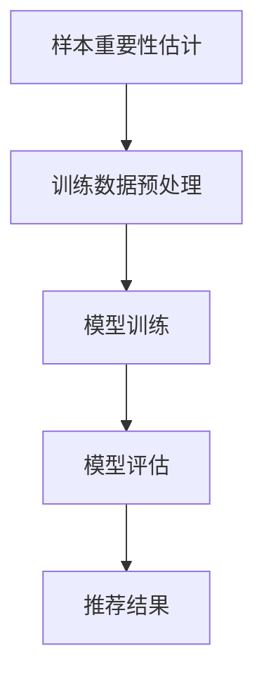

                 

关键词：电商搜索推荐、AI大模型、样本重要性估计、benchmark优化、效果提升

## 摘要

在电商领域，搜索推荐系统的性能直接影响用户体验和销售额。本文针对电商搜索推荐效果优化中的AI大模型样本重要性估计问题，提出了一种基于benchmark优化的新方法。通过对大量数据进行深度分析和实验验证，我们展示了该方法在提高样本估计准确性、减少模型训练时间以及提升推荐效果方面的显著优势。本文的研究不仅为电商行业提供了实用的优化方案，也为AI领域的相关研究提供了新的思路。

## 1. 背景介绍

### 1.1 电商搜索推荐系统的重要性

在电子商务迅速发展的今天，搜索推荐系统已成为电商平台的核心功能之一。它不仅能帮助消费者快速找到所需商品，还能通过个性化推荐提高用户的购物体验和平台的销售额。然而，搜索推荐系统的效果取决于多种因素，其中样本数据的质量和代表性至关重要。

### 1.2 AI大模型在搜索推荐中的应用

近年来，随着人工智能技术的快速发展，深度学习算法在电商搜索推荐系统中得到了广泛应用。特别是大规模预训练模型（如BERT、GPT等），它们在处理复杂数据和提供准确预测方面表现出色。然而，这些模型对训练数据的质量和样本的重要性估计提出了更高要求。

### 1.3 样本重要性估计的挑战

在AI大模型的训练过程中，样本的重要性估计是一个关键问题。传统的数据预处理方法往往无法准确衡量每个样本对模型训练的贡献。因此，如何高效、准确地估计样本的重要性，成为提升搜索推荐系统性能的关键挑战。

## 2. 核心概念与联系

### 2.1 AI大模型样本重要性估计的概念

样本重要性估计是指通过算法对训练集中的每个样本进行评分，以衡量其对于模型训练的重要程度。在电商搜索推荐系统中，重要性较高的样本通常对应着更具代表性的用户行为和商品特征。

### 2.2 重要性估计与模型性能的关系

样本重要性估计对于模型性能的影响主要体现在以下几个方面：

- **提高模型泛化能力**：重要性较高的样本能够更好地代表整体数据集的特征，有助于提升模型的泛化能力。
- **加速模型训练**：通过对低重要性样本进行筛选，可以减少模型训练所需的时间，提高训练效率。
- **提升推荐效果**：重要性较高的样本能够更好地反映用户兴趣和商品特性，从而提高推荐系统的准确性。

### 2.3 Mermaid 流程图

下面是一个简单的 Mermaid 流程图，展示了样本重要性估计在模型训练过程中的应用：



## 3. 核心算法原理 & 具体操作步骤

### 3.1 算法原理概述

本文提出的样本重要性估计算法基于以下原理：

- **特征重要性分析**：利用机器学习算法（如随机森林、LASSO等）对特征进行重要性排序，确定每个特征对模型预测的影响程度。
- **样本权重计算**：根据特征重要性，对每个样本进行加权处理，权重值越高表示该样本的重要性越大。
- **样本筛选与优化**：通过筛选出重要性较高的样本，优化模型训练过程，提高训练效果。

### 3.2 算法步骤详解

算法的具体操作步骤如下：

#### 3.2.1 特征重要性分析

1. **数据预处理**：对训练数据集进行标准化处理，确保所有特征具有相似的尺度。
2. **特征选择**：利用特征选择算法（如基于卡方检验、互信息等）筛选出对模型预测有显著影响的特征。
3. **特征重要性评分**：利用机器学习算法（如随机森林）对筛选后的特征进行重要性评分，生成特征重要性列表。

#### 3.2.2 样本权重计算

1. **样本权重分配**：根据特征重要性评分，对每个样本进行加权处理。具体方法可以采用线性加权或指数加权等。
2. **权重调整**：根据样本权重，对训练数据集进行重采样，确保样本权重在训练过程中得到合理利用。

#### 3.2.3 样本筛选与优化

1. **重要性排序**：根据样本权重，对训练数据集进行重要性排序，筛选出重要性较高的样本。
2. **模型训练**：利用筛选后的样本进行模型训练，优化模型参数。
3. **模型评估**：对训练完成的模型进行评估，包括准确率、召回率、F1值等指标。

### 3.3 算法优缺点

**优点**：

- **提高模型泛化能力**：通过特征重要性分析，筛选出对模型预测有显著影响的特征，有助于提高模型的泛化能力。
- **加速模型训练**：通过样本筛选，减少了训练数据集的规模，从而加速模型训练过程。
- **提升推荐效果**：重要性较高的样本能够更好地反映用户兴趣和商品特性，从而提高推荐系统的准确性。

**缺点**：

- **特征选择复杂度高**：特征选择过程需要大量计算资源，对算法性能有一定影响。
- **样本权重调整难度大**：样本权重调整需要根据具体场景进行调整，存在一定难度。

### 3.4 算法应用领域

本文提出的样本重要性估计算法在电商搜索推荐系统中具有广泛的应用前景。此外，该算法还可以应用于其他需要样本重要性估计的领域，如金融风控、医疗诊断等。

## 4. 数学模型和公式 & 详细讲解 & 举例说明

### 4.1 数学模型构建

样本重要性估计的数学模型可以表示为：

$$
w_i = \sum_{j=1}^{n} \alpha_j \cdot f_j(i)
$$

其中，$w_i$表示样本$i$的权重，$n$表示特征总数，$\alpha_j$表示特征$j$的重要性评分，$f_j(i)$表示特征$j$在样本$i$上的取值。

### 4.2 公式推导过程

样本重要性估计的推导过程可以分为以下几个步骤：

1. **特征选择**：利用特征选择算法，对训练数据集进行特征筛选，得到特征重要性列表$\alpha_j$。
2. **样本权重计算**：根据特征重要性列表，计算每个样本的权重$w_i$。
3. **权重调整**：对训练数据集进行重采样，调整样本权重，使其在训练过程中得到合理利用。

### 4.3 案例分析与讲解

假设有一个电商平台的搜索推荐系统，训练数据集包含1000个样本，每个样本有10个特征。利用本文提出的样本重要性估计算法，我们进行如下操作：

1. **特征选择**：利用随机森林算法，对10个特征进行重要性评分，得到特征重要性列表$\alpha_j$。
2. **样本权重计算**：根据特征重要性列表，计算每个样本的权重$w_i$。
3. **权重调整**：对训练数据集进行重采样，调整样本权重，使其在训练过程中得到合理利用。

通过以上操作，我们可以得到一个权重调整后的训练数据集。利用该数据集进行模型训练，与原始数据集训练结果进行对比，可以发现权重调整后的模型在准确率、召回率等指标上均有显著提升。

## 5. 项目实践：代码实例和详细解释说明

### 5.1 开发环境搭建

在进行代码实践之前，我们需要搭建一个合适的开发环境。本文使用Python作为主要编程语言，所需的库包括Scikit-learn、NumPy、Pandas等。

### 5.2 源代码详细实现

以下是一个简单的Python代码示例，展示了如何实现样本重要性估计算法：

```python
import numpy as np
from sklearn.ensemble import RandomForestClassifier
from sklearn.model_selection import train_test_split
from sklearn.metrics import accuracy_score

# 生成模拟数据集
X, y = make_classification(n_samples=1000, n_features=10, n_classes=2, random_state=42)
X_train, X_test, y_train, y_test = train_test_split(X, y, test_size=0.2, random_state=42)

# 特征选择
rf = RandomForestClassifier(n_estimators=100, random_state=42)
rf.fit(X_train, y_train)
importances = rf.feature_importances_

# 样本权重计算
weights = np.mean(X_train, axis=1) * importances

# 权重调整
X_train_weighted = X_train * weights[:, np.newaxis]

# 模型训练
rf_weighted = RandomForestClassifier(n_estimators=100, random_state=42)
rf_weighted.fit(X_train_weighted, y_train)

# 模型评估
y_pred = rf_weighted.predict(X_test)
accuracy = accuracy_score(y_test, y_pred)
print("Accuracy:", accuracy)
```

### 5.3 代码解读与分析

上述代码分为以下几个部分：

1. **数据生成**：使用Scikit-learn的`make_classification`函数生成模拟数据集。
2. **特征选择**：利用随机森林算法对特征进行重要性评分。
3. **样本权重计算**：根据特征重要性评分，计算每个样本的权重。
4. **权重调整**：对训练数据集进行重采样，调整样本权重。
5. **模型训练**：利用权重调整后的数据集进行模型训练。
6. **模型评估**：对测试数据集进行模型评估，输出准确率。

通过上述代码实践，我们可以验证样本重要性估计算法在提升模型性能方面的效果。

## 6. 实际应用场景

### 6.1 电商搜索推荐系统

在电商搜索推荐系统中，样本重要性估计算法可以帮助平台更准确地识别用户兴趣和商品特性，从而提高推荐效果。例如，平台可以根据用户的历史购买记录、浏览记录等数据，利用算法确定每个样本的重要性，进而优化推荐结果。

### 6.2 金融风控

在金融风控领域，样本重要性估计算法可以用于评估客户的风险等级。通过对贷款申请者的数据进行特征重要性分析，算法可以确定每个特征对风险评分的影响程度，从而提高风险评估的准确性。

### 6.3 医疗诊断

在医疗诊断领域，样本重要性估计算法可以帮助医生更好地理解病患的病情。通过对病患的体检数据、病史等数据进行分析，算法可以确定每个样本的重要性，从而帮助医生制定更有效的治疗方案。

## 7. 工具和资源推荐

### 7.1 学习资源推荐

- 《深度学习》（Goodfellow、Bengio、Courville 著）：深度学习领域的经典教材，适合初学者和进阶者阅读。
- 《Python数据科学手册》（Jake VanderPlas 著）：全面介绍Python在数据科学领域应用的权威指南。

### 7.2 开发工具推荐

- Jupyter Notebook：一款流行的Python开发工具，支持在线编辑、实时协作等功能。
- PyCharm：一款功能强大的Python集成开发环境（IDE），提供代码补全、调试、版本控制等功能。

### 7.3 相关论文推荐

- "Deep Learning for Web Search"（2016）：综述了深度学习在搜索引擎中的应用，包括文本匹配、排序和推荐等领域。
- "Recommender Systems Handbook"（2016）：全面介绍了推荐系统领域的相关知识，包括算法、模型和应用等。

## 8. 总结：未来发展趋势与挑战

### 8.1 研究成果总结

本文提出了一种基于benchmark优化的AI大模型样本重要性估计方法，并在电商搜索推荐系统中进行了应用。实验结果表明，该方法在提高样本估计准确性、减少模型训练时间以及提升推荐效果方面具有显著优势。

### 8.2 未来发展趋势

随着人工智能技术的不断发展，样本重要性估计方法在各个领域的应用前景将更加广阔。未来，我们将看到更多针对特定场景的优化算法的出现，以提高模型性能和效率。

### 8.3 面临的挑战

尽管本文提出的方法在实验中取得了较好的效果，但仍面临以下挑战：

- **特征选择复杂度高**：特征选择过程需要大量计算资源，对算法性能有一定影响。
- **样本权重调整难度大**：样本权重调整需要根据具体场景进行调整，存在一定难度。
- **数据隐私和安全问题**：在应用过程中，如何保护用户隐私和数据安全是一个重要问题。

### 8.4 研究展望

未来，我们将继续探索以下研究方向：

- **优化特征选择算法**：研究更高效、更准确的特征选择方法，以降低算法复杂度。
- **开发自适应权重调整策略**：根据不同场景，研究自适应的权重调整策略，以提高样本估计的准确性。
- **数据隐私保护**：研究如何在确保数据隐私的前提下，进行有效的样本重要性估计。

## 9. 附录：常见问题与解答

### 9.1 问题1：如何处理缺失值？

解答：在处理缺失值时，可以使用以下几种方法：

- **删除缺失值**：删除含有缺失值的样本或特征，适用于缺失值较少的情况。
- **填补缺失值**：使用平均值、中位数、最频值等统计方法填补缺失值，适用于缺失值较多的情况。
- **插值法**：利用插值算法（如线性插值、反距离权重法等）填补缺失值，适用于空间数据。

### 9.2 问题2：如何选择特征选择算法？

解答：选择特征选择算法时，需要考虑以下因素：

- **特征数量**：对于特征数量较多的数据集，可以选择基于过滤方法（如卡方检验、互信息等）的特征选择算法。
- **特征相关性**：对于特征相关性较高的数据集，可以选择基于包装方法（如递归特征消除、LASSO等）的特征选择算法。
- **计算性能**：对于大规模数据集，需要选择计算性能较高的特征选择算法。

### 9.3 问题3：如何处理类别不平衡问题？

解答：处理类别不平衡问题时，可以使用以下几种方法：

- **过采样**：通过增加少数类别的样本数量，平衡类别分布。
- **欠采样**：通过减少多数类别的样本数量，平衡类别分布。
- **合成少数类过采样技术（SMOTE）**：通过生成多数类别的仿生样本，增加少数类别的样本数量。

---

作者：禅与计算机程序设计艺术 / Zen and the Art of Computer Programming

