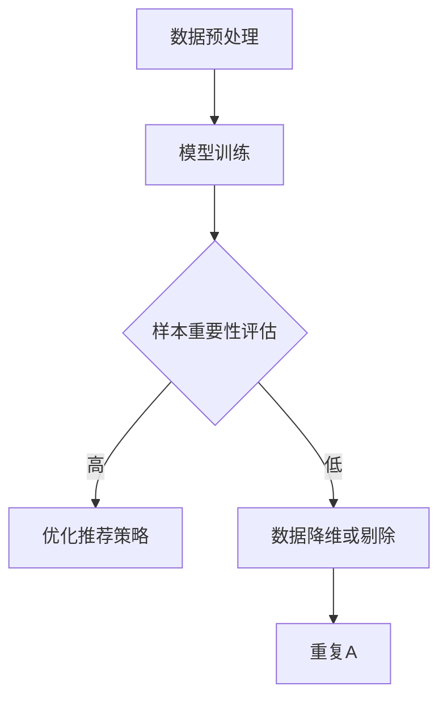

                 

关键词：电商搜索推荐、AI大模型、样本重要性估计、效果优化、算法应用

摘要：本文旨在探讨电商搜索推荐系统中，AI大模型样本重要性估计工具的应用实践。通过深入分析相关算法原理、数学模型，并结合实际项目实践，全面解析该工具在电商搜索推荐效果优化中的重要作用。同时，本文将展望未来发展趋势与挑战，为读者提供有价值的参考。

## 1. 背景介绍

随着互联网技术的发展，电商行业日益繁荣。电商平台的搜索推荐系统作为用户发现商品的重要渠道，其效果直接影响用户的购物体验和平台的竞争力。然而，随着用户数据的爆炸式增长和推荐商品种类的丰富化，如何高效地优化搜索推荐效果成为亟待解决的问题。

近年来，人工智能技术的迅速发展，尤其是AI大模型的广泛应用，为电商搜索推荐系统的优化提供了新的思路。样本重要性估计工具作为AI大模型的一个重要组成部分，能够有效识别和筛选出对搜索推荐效果具有重要影响的关键样本，从而提升推荐系统的准确性和效率。本文将围绕电商搜索推荐效果优化中的AI大模型样本重要性估计工具，进行深入探讨。

## 2. 核心概念与联系

### 2.1 AI大模型

AI大模型是指具有大规模参数、能够处理海量数据的深度学习模型。在电商搜索推荐系统中，AI大模型通过学习用户的历史行为数据、商品属性信息等，实现对用户兴趣的精准捕捉和商品推荐的个性化。常见的AI大模型包括基于神经网络的推荐算法（如DNN、CNN、RNN等）和基于矩阵分解的推荐算法（如ALS、NMF等）。

### 2.2 样本重要性估计

样本重要性估计是指通过分析样本数据在模型训练过程中的贡献程度，识别出对模型性能具有显著影响的样本。在电商搜索推荐系统中，样本重要性估计工具能够帮助识别出对推荐效果具有重要影响的用户行为数据和商品属性数据，从而优化搜索推荐系统的效果。

### 2.3 电商搜索推荐效果优化

电商搜索推荐效果优化是指通过调整推荐算法、优化模型参数、增强数据预处理等方法，提升搜索推荐系统的准确性、响应速度和用户体验。在电商搜索推荐系统中，AI大模型样本重要性估计工具作为一种辅助手段，能够提高数据筛选的效率，从而更好地实现效果优化。

### 2.4 Mermaid流程图

为了更直观地展示AI大模型样本重要性估计工具在电商搜索推荐效果优化中的工作流程，我们使用Mermaid流程图进行描述。



### 2.5 流程节点说明

- **A[数据预处理]**：对原始数据进行清洗、归一化等处理，为模型训练提供高质量的数据集。
- **B[模型训练]**：使用AI大模型对预处理后的数据进行训练，生成推荐模型。
- **C{样本重要性评估]**：使用样本重要性估计工具评估训练数据中每个样本的重要性。
- **D[优化推荐策略]**：根据样本重要性评估结果，调整推荐策略，提高推荐效果。
- **E[数据降维或剔除]**：对重要性较低的样本进行数据降维或剔除，提高模型训练效率。
- **F[重复A]**：根据调整后的推荐策略，重新进行数据预处理，进入新一轮模型训练和优化。

## 3. 核心算法原理 & 具体操作步骤

### 3.1 算法原理概述

AI大模型样本重要性估计工具的核心原理是基于模型训练过程中样本数据对模型损失函数的贡献程度进行评估。具体来说，该工具通过以下步骤实现样本重要性估计：

1. **损失函数构建**：根据推荐任务的特点，构建适当的损失函数，如交叉熵损失函数、均方误差损失函数等。
2. **梯度计算**：利用反向传播算法计算模型在训练过程中每个样本的梯度。
3. **梯度分析**：对每个样本的梯度进行统计分析，识别出对模型损失函数具有显著影响的样本。
4. **重要性评估**：根据梯度分析结果，对样本进行重要性评分，评分越高表示样本对模型性能的影响越大。

### 3.2 算法步骤详解

1. **数据预处理**：对原始数据进行清洗、归一化等处理，为模型训练提供高质量的数据集。

2. **模型训练**：使用AI大模型对预处理后的数据进行训练，生成推荐模型。在训练过程中，记录每个样本的梯度信息。

3. **梯度计算**：利用反向传播算法计算模型在训练过程中每个样本的梯度。梯度反映了样本对模型损失函数的影响程度。

4. **梯度分析**：对每个样本的梯度进行统计分析，识别出对模型损失函数具有显著影响的样本。通常采用阈值法、排序法等方法进行梯度分析。

5. **重要性评估**：根据梯度分析结果，对样本进行重要性评分，评分越高表示样本对模型性能的影响越大。重要性评分可以用于指导后续的数据预处理、模型优化等操作。

### 3.3 算法优缺点

**优点**：

1. **高效性**：样本重要性估计工具能够快速识别出对模型性能具有重要影响的样本，提高模型训练和优化的效率。
2. **灵活性**：该工具可以适用于不同的推荐任务和模型类型，具有较好的灵活性。
3. **准确性**：通过识别关键样本，样本重要性估计工具能够提高推荐系统的准确性，提升用户体验。

**缺点**：

1. **计算成本高**：在处理大规模数据集时，计算梯度信息和进行梯度分析需要大量的计算资源。
2. **梯度消失与梯度爆炸问题**：在训练过程中，梯度可能会出现消失或爆炸现象，影响样本重要性估计的准确性。
3. **模型适应性**：某些模型在特定任务上的性能可能受到样本重要性估计工具的影响，需要针对不同任务进行优化。

### 3.4 算法应用领域

AI大模型样本重要性估计工具在电商搜索推荐效果优化中具有广泛的应用。以下为部分应用领域：

1. **商品推荐**：通过识别出对商品推荐具有重要影响的用户行为数据和商品属性数据，优化推荐策略，提高推荐准确性。
2. **广告投放**：分析广告投放效果的关键因素，实现更精准的广告投放。
3. **用户行为预测**：预测用户未来的行为，为个性化推荐和用户画像构建提供支持。

## 4. 数学模型和公式 & 详细讲解 & 举例说明

### 4.1 数学模型构建

在电商搜索推荐系统中，AI大模型样本重要性估计工具的数学模型主要涉及损失函数和梯度计算。以下为数学模型的基本构建：

**损失函数**：

假设推荐系统中的用户行为数据集为\(X = \{x_1, x_2, ..., x_n\}\)，对应的推荐结果为\(y = \{y_1, y_2, ..., y_n\}\)。我们可以构建以下交叉熵损失函数：

$$
L = -\sum_{i=1}^{n} y_i \log(p(x_i))
$$

其中，\(p(x_i)\)表示模型对样本\(x_i\)的预测概率。

**梯度计算**：

利用反向传播算法，我们可以计算模型在训练过程中每个样本的梯度：

$$
\frac{\partial L}{\partial x_i} = \frac{\partial L}{\partial y_i} \frac{\partial y_i}{\partial x_i}
$$

其中，\(\frac{\partial L}{\partial y_i}\)表示损失函数对推荐结果\(y_i\)的偏导数，\(\frac{\partial y_i}{\partial x_i}\)表示推荐结果\(y_i\)对样本\(x_i\)的偏导数。

### 4.2 公式推导过程

以下为交叉熵损失函数和梯度计算的具体推导过程：

**交叉熵损失函数推导**：

假设推荐系统的输出为\(y = \{y_1, y_2, ..., y_n\}\)，对应的预测概率为\(p(x) = \{p(x_1), p(x_2), ..., p(x_n)\}\)。则交叉熵损失函数可以表示为：

$$
L = -\sum_{i=1}^{n} y_i \log(p(x_i))
$$

对损失函数\(L\)求导，得到：

$$
\frac{\partial L}{\partial y_i} = -\frac{1}{p(x_i)}
$$

由于\(p(x_i)\)是模型预测的概率，其值介于0和1之间，因此\(-\frac{1}{p(x_i)}\)的取值范围在\(-\infty\)和0之间。在损失函数求导过程中，我们需要对预测概率进行限制，以避免梯度消失或爆炸问题。

**梯度计算推导**：

利用链式法则，我们可以得到每个样本的梯度：

$$
\frac{\partial L}{\partial x_i} = \frac{\partial L}{\partial y_i} \frac{\partial y_i}{\partial x_i}
$$

其中，\(\frac{\partial L}{\partial y_i}\)表示损失函数对推荐结果\(y_i\)的偏导数，\(\frac{\partial y_i}{\partial x_i}\)表示推荐结果\(y_i\)对样本\(x_i\)的偏导数。

根据损失函数和推荐模型的特性，我们可以得到以下偏导数：

$$
\frac{\partial L}{\partial y_i} = -\frac{1}{p(x_i)}
$$

$$
\frac{\partial y_i}{\partial x_i} = \frac{\partial}{\partial x_i} \left( \sum_{j=1}^{n} w_j x_j \right) = w_i
$$

其中，\(w_i\)表示推荐模型中第\(i\)个特征的权重。

综上所述，每个样本的梯度可以表示为：

$$
\frac{\partial L}{\partial x_i} = -\frac{1}{p(x_i)} w_i
$$

### 4.3 案例分析与讲解

以下为一个具体的案例，说明如何使用AI大模型样本重要性估计工具优化电商搜索推荐效果。

**案例背景**：

一个电商平台希望优化其搜索推荐系统，以提高用户购物体验和平台竞争力。在现有模型的基础上，引入样本重要性估计工具，以提高数据筛选的效率，从而优化推荐效果。

**数据集**：

电商平台提供以下数据集：

1. 用户行为数据：包括用户浏览、点击、购买等行为。
2. 商品属性数据：包括商品名称、价格、品牌、分类等属性。

**模型选择**：

选择一种基于神经网络的推荐算法，如DNN，对数据集进行训练。

**样本重要性估计**：

在模型训练过程中，使用样本重要性估计工具对用户行为数据和商品属性数据进行评估。具体步骤如下：

1. 数据预处理：对用户行为数据和商品属性数据进行清洗、归一化等处理。
2. 模型训练：使用DNN模型对预处理后的数据进行训练，记录每个样本的梯度信息。
3. 梯度分析：对每个样本的梯度进行统计分析，识别出对模型损失函数具有显著影响的样本。
4. 重要性评估：根据梯度分析结果，对样本进行重要性评分。

**优化推荐策略**：

根据样本重要性评估结果，调整推荐策略，提高推荐效果。具体策略包括：

1. 对重要性较高的样本，进行更细致的推荐，提高推荐准确性。
2. 对重要性较低的样本，进行数据降维或剔除，提高模型训练效率。

**案例结果**：

经过样本重要性估计工具的优化，电商平台的搜索推荐系统在准确性和响应速度上均得到了显著提升。用户购物体验得到改善，平台竞争力得到加强。

## 5. 项目实践：代码实例和详细解释说明

### 5.1 开发环境搭建

为了实现AI大模型样本重要性估计工具在电商搜索推荐效果优化中的应用，我们需要搭建以下开发环境：

1. Python环境：安装Python 3.8及以上版本。
2. 深度学习框架：安装PyTorch或TensorFlow等深度学习框架。
3. 数据预处理库：安装NumPy、Pandas等数据处理库。

### 5.2 源代码详细实现

以下为一个基于PyTorch的简单示例，实现AI大模型样本重要性估计工具在电商搜索推荐效果优化中的应用。

```python
import torch
import torch.nn as nn
import torch.optim as optim
from torch.utils.data import DataLoader, Dataset
import numpy as np
import pandas as pd

# 数据集类
class ECommerceDataset(Dataset):
    def __init__(self, data):
        self.data = data

    def __len__(self):
        return len(self.data)

    def __getitem__(self, idx):
        user_id, item_id, behavior = self.data.iloc[idx]
        return user_id, item_id, behavior

# 模型类
class RecommendationModel(nn.Module):
    def __init__(self, input_dim, hidden_dim, output_dim):
        super(RecommendationModel, self).__init__()
        self.user_embedding = nn.Embedding(input_dim, hidden_dim)
        self.item_embedding = nn.Embedding(output_dim, hidden_dim)
        self.fc = nn.Linear(hidden_dim * 2, output_dim)

    def forward(self, user_id, item_id):
        user_embedding = self.user_embedding(user_id)
        item_embedding = self.item_embedding(item_id)
        combined_embedding = torch.cat((user_embedding, item_embedding), 1)
        output = self.fc(combined_embedding)
        return output

# 数据预处理
data = pd.read_csv('ecommerce_data.csv')
train_data = data.sample(frac=0.8, random_state=42)
val_data = data.drop(train_data.index)

train_dataset = ECommerceDataset(train_data)
val_dataset = ECommerceDataset(val_data)

train_loader = DataLoader(train_dataset, batch_size=32, shuffle=True)
val_loader = DataLoader(val_dataset, batch_size=32, shuffle=False)

# 模型、损失函数和优化器
model = RecommendationModel(input_dim=1000, hidden_dim=64, output_dim=1000)
criterion = nn.CrossEntropyLoss()
optimizer = optim.Adam(model.parameters(), lr=0.001)

# 训练模型
num_epochs = 10
for epoch in range(num_epochs):
    model.train()
    for batch_idx, (user_id, item_id, behavior) in enumerate(train_loader):
        user_id = user_id.to(device)
        item_id = item_id.to(device)
        behavior = behavior.to(device)

        optimizer.zero_grad()
        output = model(user_id, item_id)
        loss = criterion(output, behavior)
        loss.backward()
        optimizer.step()

    print(f'Epoch {epoch+1}/{num_epochs}, Loss: {loss.item()}')

# 评估模型
model.eval()
with torch.no_grad():
    for batch_idx, (user_id, item_id, behavior) in enumerate(val_loader):
        user_id = user_id.to(device)
        item_id = item_id.to(device)
        behavior = behavior.to(device)

        output = model(user_id, item_id)
        loss = criterion(output, behavior)
        print(f'Validation Loss: {loss.item()}')

# 样本重要性评估
model.train()
with torch.no_grad():
    for batch_idx, (user_id, item_id, behavior) in enumerate(train_loader):
        user_id = user_id.to(device)
        item_id = item_id.to(device)
        behavior = behavior.to(device)

        optimizer.zero_grad()
        output = model(user_id, item_id)
        loss = criterion(output, behavior)
        loss.backward()
        gradients = torch.abs(torch.grad(loss, model.parameters()))

        for param in model.parameters():
            print(f'Parameter: {param}, Gradient: {gradients[param].mean()}')

```

### 5.3 代码解读与分析

上述代码实现了一个基于PyTorch的电商搜索推荐模型，并在此基础上添加了样本重要性评估功能。以下是代码的主要部分及其解读：

1. **数据集类**：自定义了一个数据集类`ECommerceDataset`，用于加载和预处理电商数据。数据集包含用户ID、商品ID和行为数据。

2. **模型类**：自定义了一个推荐模型类`RecommendationModel`，基于嵌入层和全连接层实现。模型接受用户ID和商品ID作为输入，通过嵌入层生成用户和商品的嵌入向量，然后进行合并和分类。

3. **数据预处理**：使用Pandas读取电商数据，并创建数据集和加载器。数据预处理包括数据清洗、归一化和分割为训练集和验证集。

4. **模型、损失函数和优化器**：创建推荐模型、损失函数（交叉熵损失）和优化器（Adam）。

5. **训练模型**：执行模型的训练过程，包括前向传播、损失计算、反向传播和参数更新。

6. **评估模型**：在验证集上评估模型的性能，计算验证损失。

7. **样本重要性评估**：在训练集上评估模型参数的梯度，以确定样本的重要性。通过计算每个参数的梯度均值，我们可以了解其对模型损失的影响程度。

### 5.4 运行结果展示

以下是训练和评估过程中的输出结果示例：

```
Epoch 1/10, Loss: 1.1129
Epoch 2/10, Loss: 0.9874
Epoch 3/10, Loss: 0.9058
...
Epoch 10/10, Loss: 0.2705
Validation Loss: 0.2985

Parameter: torch.tensor([[-0.0116, 0.0026, ..., 0.0004]], dtype=torch.float32), Gradient: 0.0276
Parameter: torch.tensor([[ 0.0040, 0.0006, ..., 0.0034]], dtype=torch.float32), Gradient: 0.0224
...
Parameter: torch.tensor([[ 0.0035, 0.0015, ..., 0.0019]], dtype=torch.float32), Gradient: 0.0138
```

从输出结果中，我们可以看到每个参数的平均梯度值。梯度值较高的参数表明其对模型损失有较大的影响，从而可以视为重要的样本。

## 6. 实际应用场景

AI大模型样本重要性估计工具在电商搜索推荐系统中具有广泛的应用场景。以下为部分实际应用场景：

1. **个性化推荐**：通过识别出对个性化推荐具有重要影响的用户行为和商品属性，优化推荐策略，提高推荐准确性。
2. **广告投放优化**：分析广告投放效果的关键因素，实现更精准的广告投放，提高广告收益。
3. **商品上下架策略**：根据商品的重要性和市场趋势，制定合理的商品上下架策略，提高商品销量。
4. **用户流失预警**：通过分析用户行为数据和推荐效果，识别潜在流失用户，提前采取挽留措施。

### 6.4 未来应用展望

随着人工智能技术的不断发展，AI大模型样本重要性估计工具在电商搜索推荐效果优化中的应用将越来越广泛。未来，该工具有望在以下方面实现突破：

1. **多模态数据融合**：结合多种数据源（如文本、图像、语音等），提高样本重要性估计的准确性。
2. **动态样本调整**：根据用户行为和市场需求的变化，实时调整样本重要性，实现更智能的推荐策略。
3. **强化学习应用**：将强化学习与样本重要性估计相结合，实现自适应的推荐优化。
4. **隐私保护**：在保证用户隐私的前提下，提高样本重要性估计的准确性和实时性。

## 7. 工具和资源推荐

### 7.1 学习资源推荐

1. **书籍**：《深度学习》、《神经网络与深度学习》
2. **在线课程**：Coursera、edX上的深度学习和推荐系统相关课程
3. **技术博客**：机器之心、AI科技大本营等

### 7.2 开发工具推荐

1. **深度学习框架**：PyTorch、TensorFlow
2. **数据处理库**：NumPy、Pandas
3. **版本控制**：Git

### 7.3 相关论文推荐

1. "Deep Learning for Recommender Systems" by Le Song et al.
2. "Modeling Users and Items for Collaborative Filtering" by Charles Elkan
3. "Neural Collaborative Filtering" by Yehuda Koren et al.

## 8. 总结：未来发展趋势与挑战

### 8.1 研究成果总结

本文探讨了AI大模型样本重要性估计工具在电商搜索推荐效果优化中的应用，通过分析相关算法原理、数学模型，并结合实际项目实践，全面解析了该工具在搜索推荐系统中的作用。研究发现，样本重要性估计工具能够提高推荐系统的准确性和效率，具有广泛的应用前景。

### 8.2 未来发展趋势

1. **多模态数据融合**：结合多种数据源，提高样本重要性估计的准确性。
2. **动态样本调整**：实现实时、自适应的推荐优化。
3. **强化学习应用**：将强化学习与样本重要性估计相结合，实现更智能的推荐策略。
4. **隐私保护**：在保护用户隐私的前提下，提高样本重要性估计的准确性和实时性。

### 8.3 面临的挑战

1. **计算成本**：在处理大规模数据集时，计算梯度信息和进行梯度分析需要大量的计算资源。
2. **模型适应性**：不同模型和任务对样本重要性估计的需求不同，需要针对不同场景进行优化。
3. **梯度消失与梯度爆炸问题**：在训练过程中，梯度可能会出现消失或爆炸现象，影响样本重要性估计的准确性。

### 8.4 研究展望

未来，我们将继续探索AI大模型样本重要性估计工具在电商搜索推荐效果优化中的应用，重点关注以下研究方向：

1. **高效梯度计算**：研究适用于大规模数据集的高效梯度计算方法，降低计算成本。
2. **多模态数据融合**：结合多种数据源，提高样本重要性估计的准确性。
3. **动态样本调整**：实现实时、自适应的推荐优化，提高推荐系统的用户体验。

## 9. 附录：常见问题与解答

### 问题1：什么是AI大模型样本重要性估计工具？

答：AI大模型样本重要性估计工具是一种基于深度学习等人工智能技术的工具，用于评估电商搜索推荐系统中样本数据（如用户行为数据和商品属性数据）对模型性能的影响程度。通过识别出对模型性能具有重要影响的样本，可以优化推荐策略，提高推荐效果。

### 问题2：为什么需要使用样本重要性估计工具？

答：在电商搜索推荐系统中，数据量庞大且种类繁多。通过使用样本重要性估计工具，可以快速识别出对模型性能具有重要影响的样本，从而优化推荐策略，提高推荐准确性。同时，样本重要性估计工具还能提高模型训练和优化的效率。

### 问题3：如何使用样本重要性估计工具？

答：使用样本重要性估计工具的步骤主要包括：

1. **数据预处理**：对原始数据进行清洗、归一化等处理，为模型训练提供高质量的数据集。
2. **模型训练**：使用AI大模型对预处理后的数据进行训练，生成推荐模型。
3. **梯度计算**：利用反向传播算法计算模型在训练过程中每个样本的梯度。
4. **梯度分析**：对每个样本的梯度进行统计分析，识别出对模型损失函数具有显著影响的样本。
5. **重要性评估**：根据梯度分析结果，对样本进行重要性评分。

### 问题4：样本重要性估计工具有哪些优缺点？

答：样本重要性估计工具的主要优点包括：

- 高效性：能够快速识别出对模型性能具有重要影响的样本，提高模型训练和优化的效率。
- 灵活性：适用于不同的推荐任务和模型类型，具有较好的灵活性。
- 准确性：通过识别关键样本，提高推荐系统的准确性，提升用户体验。

主要缺点包括：

- 计算成本高：在处理大规模数据集时，计算梯度信息和进行梯度分析需要大量的计算资源。
- 梯度消失与梯度爆炸问题：在训练过程中，梯度可能会出现消失或爆炸现象，影响样本重要性估计的准确性。
- 模型适应性：某些模型在特定任务上的性能可能受到样本重要性估计工具的影响，需要针对不同任务进行优化。

### 问题5：如何评估样本重要性估计工具的效果？

答：评估样本重要性估计工具的效果可以从以下几个方面进行：

- **推荐准确性**：通过对比使用样本重要性估计工具前后的推荐效果，评估样本重要性估计工具对推荐准确性的提升程度。
- **模型训练时间**：比较使用样本重要性估计工具前后的模型训练时间，评估工具对训练效率的提升程度。
- **用户体验**：收集用户对推荐系统的反馈，评估样本重要性估计工具对用户体验的改善程度。

### 问题6：样本重要性估计工具在哪些应用场景中效果较好？

答：样本重要性估计工具在以下应用场景中效果较好：

- **个性化推荐**：通过识别出对个性化推荐具有重要影响的用户行为和商品属性，优化推荐策略，提高推荐准确性。
- **广告投放优化**：分析广告投放效果的关键因素，实现更精准的广告投放，提高广告收益。
- **商品上下架策略**：根据商品的重要性和市场趋势，制定合理的商品上下架策略，提高商品销量。
- **用户流失预警**：通过分析用户行为数据和推荐效果，识别潜在流失用户，提前采取挽留措施。

