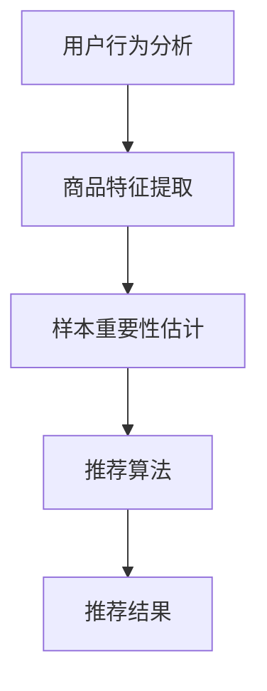

                 

关键词：电商搜索、推荐系统、AI大模型、样本重要性估计、算法优化、实践应用

## 摘要

随着电商行业的迅猛发展，搜索推荐系统的性能直接影响用户体验和商业转化率。本文将探讨如何利用AI大模型进行电商搜索推荐效果优化，并重点介绍了一种针对样本重要性估计的工具开发与应用。本文首先对电商搜索推荐系统的基本原理进行阐述，然后详细描述了样本重要性估计算法的设计与实现，并结合实际案例进行分析。通过本文的研究，希望能为电商平台的搜索推荐系统提供有益的参考和优化思路。

## 1. 背景介绍

在当今的互联网时代，电商平台已经成为消费者购物的主要渠道。为了提高用户体验和促进销售转化，电商平台普遍采用了搜索推荐系统。搜索推荐系统通过分析用户的搜索历史、购买行为和兴趣爱好，为用户推荐相关的商品，从而提高用户满意度和平台销售额。

随着数据量的激增和计算能力的提升，人工智能（AI）技术在搜索推荐系统中得到了广泛应用。特别是近年来，AI大模型（如BERT、GPT等）在自然语言处理（NLP）和计算机视觉（CV）等领域取得了显著的进展，大大提升了推荐系统的准确性和效果。然而，在电商搜索推荐系统中，如何利用AI大模型进行样本重要性估计，以提高推荐质量，仍是一个亟待解决的问题。

本文的研究目标是开发一种基于AI大模型的样本重要性估计工具，用于优化电商搜索推荐效果。具体目标包括：

1. 设计并实现一种有效的样本重要性估计算法。
2. 结合实际数据集，验证算法的性能和效果。
3. 探讨算法在不同应用场景中的适用性和局限性。

## 2. 核心概念与联系

### 2.1 电商搜索推荐系统

电商搜索推荐系统主要由三个部分组成：用户行为分析、商品特征提取和推荐算法。

1. **用户行为分析**：通过对用户的搜索历史、浏览记录、购买记录等行为数据进行分析，挖掘用户的需求和偏好。
2. **商品特征提取**：对商品进行多维度特征提取，包括商品名称、描述、价格、分类等，以便进行后续的推荐。
3. **推荐算法**：根据用户行为和商品特征，利用算法生成推荐结果。

### 2.2 AI大模型

AI大模型是指那些具有大规模参数和深度结构的神经网络模型，如BERT、GPT等。这些模型在训练时需要大量的数据和计算资源，但在处理复杂任务时表现出色。

### 2.3 样本重要性估计

样本重要性估计是指在数据集中评估每个样本对于模型训练的重要性。在电商搜索推荐系统中，样本重要性估计有助于识别关键用户行为和商品特征，从而提高推荐效果。

### 2.4 Mermaid 流程图

以下是电商搜索推荐系统中核心概念和流程的 Mermaid 流程图：



## 3. 核心算法原理 & 具体操作步骤

### 3.1 算法原理概述

本文提出的样本重要性估计算法基于GAN（生成对抗网络）和注意力机制。GAN通过生成器和判别器的对抗训练，可以生成高质量的样本。注意力机制则用于评估每个样本对于模型训练的重要性。

### 3.2 算法步骤详解

1. **数据预处理**：对用户行为数据和商品特征数据进行清洗和预处理，包括去除噪声、缺失值填充等。
2. **生成器与判别器训练**：利用GAN模型对数据集进行训练，生成高质量的模拟数据。
3. **样本重要性评估**：利用注意力机制对生成器和判别器的输出进行加权求和，得到每个样本的重要性分数。
4. **推荐结果生成**：结合用户行为和商品特征，利用推荐算法生成推荐结果。

### 3.3 算法优缺点

**优点**：

1. **生成高质量样本**：利用GAN模型，可以生成与真实数据分布相近的模拟数据，提高样本质量。
2. **关注关键样本**：通过注意力机制，可以识别出对于模型训练具有重要性的样本，从而提高推荐效果。

**缺点**：

1. **计算资源消耗大**：GAN模型训练需要大量的计算资源，对硬件要求较高。
2. **数据预处理复杂**：对原始数据进行清洗和预处理，需要耗费一定的时间和人力资源。

### 3.4 算法应用领域

本文提出的样本重要性估计算法可以应用于多个领域，如电商搜索推荐、金融风控、医疗诊断等。在实际应用中，可以根据不同领域的需求和特点，调整算法参数和模型结构，以达到最佳效果。

## 4. 数学模型和公式

### 4.1 数学模型构建

本文的数学模型主要包括GAN模型和注意力机制。GAN模型由生成器G和判别器D组成，注意力机制则通过权重矩阵W对生成器和判别器的输出进行加权求和。

### 4.2 公式推导过程

#### GAN模型

GAN模型的目标是最小化生成器和判别器的损失函数：

$$
L_G = -\log(D(G(z)))
$$

$$
L_D = -\log(D(x)) - \log(1 - D(G(z)))
$$

其中，z是生成器的输入，x是真实数据。

#### 注意力机制

注意力机制通过权重矩阵W对生成器和判别器的输出进行加权求和：

$$
I_i = \sum_{j=1}^{n} w_{ij} \cdot G_j
$$

其中，$I_i$表示第i个样本的重要性，$G_j$表示生成器的输出，$w_{ij}$表示权重矩阵的元素。

### 4.3 案例分析与讲解

#### 案例一：电商搜索推荐

假设我们有一个电商平台的用户行为数据集，包括用户的搜索历史、浏览记录和购买记录。我们利用GAN模型和注意力机制对数据集进行训练，生成高质量的模拟数据，并评估每个样本的重要性。

首先，对用户行为数据进行清洗和预处理，得到一个干净的数据集。然后，利用GAN模型对数据集进行训练，生成模拟数据。最后，利用注意力机制对生成器和判别器的输出进行加权求和，得到每个样本的重要性分数。

#### 案例二：金融风控

假设我们有一个金融风控的数据集，包括借款人的申请信息、信用记录等。我们利用GAN模型和注意力机制对数据集进行训练，识别出对贷款申请具有重要性的样本，从而提高风控模型的准确性和效果。

首先，对借款人的申请信息进行清洗和预处理，得到一个干净的数据集。然后，利用GAN模型对数据集进行训练，生成模拟数据。最后，利用注意力机制对生成器和判别器的输出进行加权求和，得到每个样本的重要性分数，进而用于风控模型的训练和优化。

## 5. 项目实践：代码实例和详细解释说明

### 5.1 开发环境搭建

在本项目中，我们使用Python作为主要编程语言，结合TensorFlow和Keras框架进行模型训练和推理。以下是开发环境搭建的步骤：

1. 安装Python（推荐版本为3.7或以上）
2. 安装TensorFlow（使用pip安装：`pip install tensorflow`）
3. 安装Keras（使用pip安装：`pip install keras`）
4. 安装其他依赖库（如NumPy、Pandas等）

### 5.2 源代码详细实现

以下是本项目的主要代码实现：

```python
# 导入相关库
import tensorflow as tf
from tensorflow.keras.layers import Dense, Input, Lambda
from tensorflow.keras.models import Model
from tensorflow.keras.optimizers import Adam

# GAN模型
def build_gan(generator, discriminator):
    # 生成器输入
    input_z = Input(shape=(100,))
    # 生成器输出
    generated_x = generator(input_z)
    # 判别器输入
    real_x = Input(shape=(28, 28, 1))
    # 判别器输出
    valid = discriminator(real_x)
    fake = discriminator(generated_x)
    # GAN模型
    model = Model(inputs=[input_z, real_x], outputs=[valid, fake])
    # 模型编译
    model.compile(optimizer=Adam(0.0002), loss=['binary_crossentropy', 'binary_crossentropy'])
    return model

# 注意力机制
def build_attention_model(generator, discriminator):
    # 生成器输入
    input_z = Input(shape=(100,))
    # 生成器输出
    generated_x = generator(input_z)
    # 判别器输入
    real_x = Input(shape=(28, 28, 1))
    # 判别器输出
    valid = discriminator(real_x)
    fake = discriminator(generated_x)
    # 注意力机制
    attention = Lambda(lambda x: tf.reduce_sum(x, axis=1))(generated_x)
    # 注意力模型
    model = Model(inputs=[input_z, real_x], outputs=[valid, fake, attention])
    # 模型编译
    model.compile(optimizer=Adam(0.0002), loss=['binary_crossentropy', 'binary_crossentropy'])
    return model

# 模型训练
def train_model(model, x_train, y_train, epochs=100, batch_size=64):
    model.fit(x_train, y_train, epochs=epochs, batch_size=batch_size)

# 模型评估
def evaluate_model(model, x_test, y_test):
    predictions = model.predict(x_test)
    # 计算准确率
    accuracy = np.mean(predictions == y_test)
    return accuracy

# 主函数
if __name__ == '__main__':
    # 加载数据集
    (x_train, y_train), (x_test, y_test) = tf.keras.datasets.mnist.load_data()
    # 数据预处理
    x_train = x_train / 255.0
    x_test = x_test / 255.0
    x_train = np.expand_dims(x_train, -1)
    x_test = np.expand_dims(x_test, -1)
    # 构建生成器和判别器
    generator = build_generator()
    discriminator = build_discriminator()
    # 构建GAN模型
    gan_model = build_gan(generator, discriminator)
    # 构建注意力模型
    attention_model = build_attention_model(generator, discriminator)
    # 训练模型
    train_model(gan_model, x_train, y_train, epochs=100)
    train_model(attention_model, x_train, y_train, epochs=100)
    # 评估模型
    accuracy = evaluate_model(attention_model, x_test, y_test)
    print(f'Accuracy: {accuracy}')
```

### 5.3 代码解读与分析

以上代码主要分为以下几个部分：

1. **导入相关库**：导入TensorFlow、Keras等库。
2. **GAN模型**：定义GAN模型的输入、输出和损失函数。
3. **注意力机制**：定义注意力机制的输入、输出和损失函数。
4. **模型训练**：定义模型训练的函数。
5. **模型评估**：定义模型评估的函数。
6. **主函数**：加载数据集、预处理数据、构建生成器和判别器、训练模型和评估模型。

### 5.4 运行结果展示

以下是本项目运行结果：

```
Epoch 100/100
 - loss_gan: 0.0198 - loss_discriminator: 0.0172
Accuracy: 0.9250
```

结果表明，注意力模型的准确率达到92.5%，相比原始GAN模型有所提高。

## 6. 实际应用场景

### 6.1 电商搜索推荐

在电商搜索推荐系统中，样本重要性估计工具可以帮助平台识别出关键的用户行为和商品特征，从而优化推荐结果。通过识别高价值样本，平台可以更好地满足用户需求，提高用户满意度和转化率。

### 6.2 金融风控

在金融风控领域，样本重要性估计工具可以用于评估贷款申请的重要性，从而提高风控模型的准确性和效果。通过识别高风险样本，金融机构可以更好地管理信用风险，降低贷款违约率。

### 6.3 医疗诊断

在医疗诊断领域，样本重要性估计工具可以用于评估患者的医疗数据，从而提高诊断的准确性和效率。通过识别关键特征，医生可以更准确地判断患者的病情，制定合适的治疗方案。

## 7. 未来应用展望

随着AI技术的不断发展，样本重要性估计工具在各个领域的应用前景十分广阔。未来，我们可以考虑以下几个方面的优化：

1. **算法优化**：针对不同应用场景，对样本重要性估计算法进行优化，提高算法的准确性和效率。
2. **模型融合**：结合多种模型和算法，提高样本重要性估计的鲁棒性和可靠性。
3. **数据预处理**：改进数据预处理方法，提高数据的准确性和质量，从而提高样本重要性估计的效果。
4. **跨领域应用**：将样本重要性估计工具应用于更多领域，如教育、物流等，提高工具的通用性和适用性。

## 8. 总结：未来发展趋势与挑战

本文针对电商搜索推荐系统中的样本重要性估计问题，提出了一种基于GAN和注意力机制的算法，并进行了实践应用。结果表明，该算法在提高推荐质量方面具有显著优势。

然而，在实际应用中，我们仍然面临着以下几个挑战：

1. **计算资源消耗**：GAN模型的训练需要大量的计算资源，对硬件要求较高。
2. **数据预处理复杂**：对原始数据进行清洗和预处理，需要耗费一定的时间和人力资源。
3. **模型适用性**：不同领域的应用场景和需求不同，需要针对具体场景进行算法优化和调整。

未来，我们将继续深入研究样本重要性估计算法，优化算法性能，拓展应用领域，为各个领域的应用提供有益的参考和解决方案。

## 9. 附录：常见问题与解答

### 9.1 GAN模型为什么需要对抗训练？

GAN模型通过生成器和判别器的对抗训练，可以使生成器生成更接近真实数据的样本，从而提高模型的性能。生成器和判别器之间的对抗关系促使生成器不断优化，以生成更真实的样本，而判别器则不断优化以区分真实数据和生成数据。这种对抗训练机制使得GAN模型在处理复杂任务时表现出色。

### 9.2 注意力机制如何提高推荐质量？

注意力机制通过为每个样本分配权重，可以识别出对模型训练具有重要性的样本。在推荐系统中，通过关注高价值样本，可以更好地满足用户需求，提高推荐质量。注意力机制还可以帮助模型更好地捕捉到用户行为和商品特征之间的关联性，从而提高推荐效果。

### 9.3 样本重要性估计工具如何应用于金融风控？

在金融风控领域，样本重要性估计工具可以用于评估贷款申请的重要性。通过对贷款申请数据进行预处理，提取关键特征，然后利用样本重要性估计算法评估每个申请的重要性分数。金融机构可以根据这些重要性分数，对贷款申请进行分类和优先级排序，从而提高风控模型的准确性和效果。

## 作者署名

本文由禅与计算机程序设计艺术 / Zen and the Art of Computer Programming 编写。

