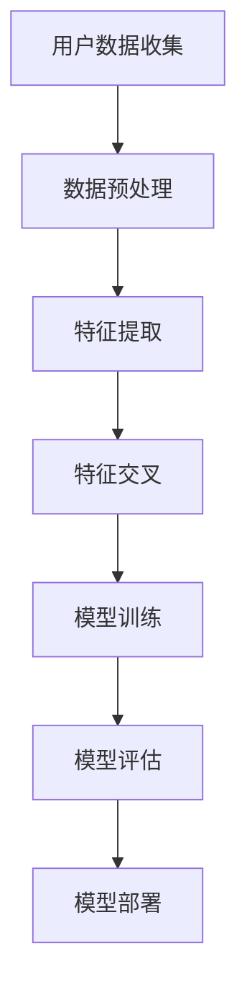
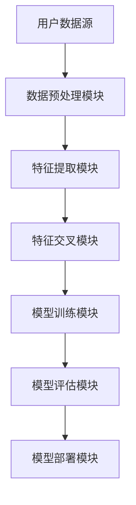

                 

关键词：电商搜索、推荐系统、AI大模型、特征交叉、优化技术

> 摘要：本文将探讨电商搜索推荐系统中AI大模型特征交叉技术的应用，通过介绍背景、核心概念、算法原理、数学模型、项目实践、实际应用场景、工具和资源推荐、未来发展趋势与挑战等内容，全面解析如何通过AI大模型特征交叉技术提升电商搜索推荐的准确性和用户体验。

## 1. 背景介绍

随着互联网和电子商务的飞速发展，电商搜索推荐系统已成为电商平台的核心竞争力之一。它能够根据用户的浏览历史、购物行为和搜索记录等数据，智能地推荐用户可能感兴趣的商品，从而提高用户的购买转化率和平台销售额。

然而，传统的推荐算法往往只能处理单一的特征维度，导致推荐效果不佳。近年来，人工智能特别是AI大模型的发展，为推荐系统带来了新的机遇。AI大模型能够处理海量数据，提取多维度特征，从而实现更精准的推荐。

### 1.1 电商搜索推荐系统的现状

目前，电商搜索推荐系统主要采用基于内容的推荐（Content-Based Recommendation）和协同过滤（Collaborative Filtering）等方法。基于内容的推荐方法主要依赖于商品的属性信息，如类别、品牌、价格等，从而推荐给用户类似兴趣的商品。然而，这种方法往往无法准确捕捉用户的兴趣和需求。

协同过滤方法则通过分析用户之间的行为相似性，将用户认为喜欢的商品推荐给其他具有相似行为的用户。虽然协同过滤方法在处理大数据集时表现出色，但它存在冷启动问题（即新用户或新商品无法获得有效的推荐），数据稀疏问题和推荐结果过于集中等问题。

### 1.2 AI大模型在电商搜索推荐中的应用

AI大模型，如深度神经网络、Transformer模型等，能够通过自动学习大量数据中的复杂模式，提取出丰富的特征。这些特征可以用于优化推荐系统的性能，提高推荐准确性。

AI大模型在电商搜索推荐中的应用主要包括两个方面：

1. **特征提取**：AI大模型可以从原始数据中提取出高维、非线性、复杂的特征，这些特征可以用于优化推荐系统的性能。

2. **特征交叉**：AI大模型能够将不同来源的特征进行交叉组合，从而生成新的特征，进一步优化推荐效果。

## 2. 核心概念与联系

### 2.1 AI大模型

AI大模型是指具有大规模参数、能够处理海量数据的深度学习模型。常见的AI大模型包括深度神经网络（DNN）、循环神经网络（RNN）、Transformer模型等。

### 2.2 特征交叉

特征交叉是指将不同来源的特征进行组合，生成新的特征，以提升模型的性能。在电商搜索推荐系统中，特征交叉技术可以结合用户的浏览历史、购物行为、搜索记录等多种特征，从而实现更精准的推荐。

### 2.3 Mermaid流程图

以下是一个Mermaid流程图，展示了AI大模型特征交叉技术在电商搜索推荐系统中的应用流程：



### 2.4 AI大模型特征交叉技术架构

以下是AI大模型特征交叉技术的架构图：



## 3. 核心算法原理 & 具体操作步骤

### 3.1 算法原理概述

AI大模型特征交叉技术主要基于深度学习模型，通过以下步骤实现：

1. **数据预处理**：对用户数据进行清洗、去重、填充等预处理操作。

2. **特征提取**：使用深度学习模型从原始数据中提取出高维、非线性、复杂的特征。

3. **特征交叉**：将不同来源的特征进行组合，生成新的特征。

4. **模型训练**：使用提取的特征训练深度学习模型。

5. **模型评估**：对训练好的模型进行评估，调整模型参数。

6. **模型部署**：将训练好的模型部署到线上环境，进行实时推荐。

### 3.2 算法步骤详解

#### 3.2.1 数据预处理

数据预处理是特征提取和模型训练的基础，主要包括以下步骤：

1. **数据清洗**：去除数据中的噪声和异常值。

2. **去重**：去除重复的数据记录。

3. **数据填充**：对于缺失的数据，使用均值、中位数等方法进行填充。

4. **数据归一化**：将数据缩放到同一尺度，便于模型训练。

#### 3.2.2 特征提取

特征提取是AI大模型的核心，常用的方法包括：

1. **深度神经网络（DNN）**：通过多层神经网络提取特征。

2. **循环神经网络（RNN）**：适用于处理序列数据，如用户行为序列。

3. **Transformer模型**：通过自注意力机制提取特征，适用于大规模数据处理。

#### 3.2.3 特征交叉

特征交叉技术可以结合以下方法：

1. **拼接**：将不同来源的特征直接拼接在一起。

2. **交互**：计算特征之间的交互项。

3. **嵌入**：将特征映射到低维空间，实现特征组合。

#### 3.2.4 模型训练

模型训练采用以下步骤：

1. **损失函数**：选择合适的损失函数，如均方误差（MSE）、交叉熵等。

2. **优化器**：选择优化器，如随机梯度下降（SGD）、Adam等。

3. **训练过程**：迭代优化模型参数，直到满足停止条件。

#### 3.2.5 模型评估

模型评估主要关注以下指标：

1. **准确率（Accuracy）**：分类问题的主要指标。

2. **召回率（Recall）**：检测到正样本的能力。

3. **F1分数（F1 Score）**：综合考虑准确率和召回率。

#### 3.2.6 模型部署

模型部署主要包括以下步骤：

1. **模型压缩**：减小模型大小，提高部署效率。

2. **模型迁移**：将训练好的模型迁移到线上环境。

3. **实时推荐**：根据用户行为实时生成推荐结果。

### 3.3 算法优缺点

#### 优点

1. **高精度**：AI大模型能够提取出丰富的特征，提高推荐准确性。

2. **自适应**：模型可以根据用户行为实时调整推荐策略。

3. **可扩展**：AI大模型适用于处理大规模数据，支持海量用户。

#### 缺点

1. **计算复杂度**：模型训练和特征提取需要大量计算资源。

2. **数据依赖**：模型性能高度依赖数据质量。

## 4. 数学模型和公式 & 详细讲解 & 举例说明

### 4.1 数学模型构建

AI大模型特征交叉技术主要涉及以下数学模型：

#### 深度神经网络（DNN）

$$
y = \sigma(W_n \cdot z_n + b_n)
$$

其中，$y$ 是输出，$\sigma$ 是激活函数，$W_n$ 和 $b_n$ 分别是权重和偏置。

#### 循环神经网络（RNN）

$$
h_t = \sigma(W_h h_{t-1} + W_x x_t + b_h)
$$

其中，$h_t$ 是当前时刻的隐藏状态，$x_t$ 是输入，$W_h$ 和 $W_x$ 分别是权重矩阵，$b_h$ 是偏置。

#### Transformer模型

$$
\text{Attention}(Q, K, V) = \frac{QK^T}{\sqrt{d_k}}V
$$

其中，$Q$、$K$ 和 $V$ 分别是查询、键和值向量，$d_k$ 是键的维度。

### 4.2 公式推导过程

以深度神经网络为例，假设输入特征为 $x$，输出特征为 $y$，则神经网络的前向传播过程可以表示为：

$$
z = Wx + b \\
y = \sigma(z)
$$

其中，$W$ 是权重矩阵，$b$ 是偏置，$\sigma$ 是激活函数。

反向传播过程中，利用链式法则计算梯度：

$$
\frac{dy}{dx} = \frac{dy}{dz} \cdot \frac{dz}{dx} \\
\frac{dz}{dx} = \frac{\partial z}{\partial x} \\
\frac{dy}{dx} = \sigma'(z) \cdot \frac{\partial z}{\partial x}
$$

### 4.3 案例分析与讲解

#### 案例一：基于DNN的电商搜索推荐

假设有一个电商平台的用户行为数据集，包括用户的浏览记录、购物记录和搜索记录。我们可以使用DNN模型提取用户兴趣特征，从而实现精准推荐。

1. **数据预处理**：对用户行为数据进行清洗、去重、归一化处理。

2. **特征提取**：使用DNN模型提取用户兴趣特征，输入层包含用户行为的各种特征，输出层包含用户兴趣特征。

3. **特征交叉**：将提取的用户兴趣特征与其他特征（如商品属性、用户基本信息等）进行交叉组合。

4. **模型训练**：使用交叉后的特征训练DNN模型，优化模型参数。

5. **模型评估**：使用交叉验证方法评估模型性能，调整模型参数。

6. **模型部署**：将训练好的模型部署到线上环境，根据用户行为生成推荐结果。

#### 案例二：基于Transformer的电商搜索推荐

假设有一个电商平台的用户行为数据集，包括用户的浏览记录、购物记录和搜索记录。我们可以使用Transformer模型提取用户兴趣特征，从而实现精准推荐。

1. **数据预处理**：对用户行为数据进行清洗、去重、归一化处理。

2. **特征提取**：使用Transformer模型提取用户兴趣特征，输入层包含用户行为的各种特征，输出层包含用户兴趣特征。

3. **特征交叉**：将提取的用户兴趣特征与其他特征（如商品属性、用户基本信息等）进行交叉组合。

4. **模型训练**：使用交叉后的特征训练Transformer模型，优化模型参数。

5. **模型评估**：使用交叉验证方法评估模型性能，调整模型参数。

6. **模型部署**：将训练好的模型部署到线上环境，根据用户行为生成推荐结果。

## 5. 项目实践：代码实例和详细解释说明

### 5.1 开发环境搭建

为了实现AI大模型特征交叉技术，我们需要搭建以下开发环境：

1. **Python环境**：安装Python 3.7及以上版本。

2. **深度学习库**：安装TensorFlow 2.x或PyTorch 1.x。

3. **数据处理库**：安装Numpy、Pandas、Scikit-learn等。

### 5.2 源代码详细实现

以下是一个使用PyTorch实现的基于DNN的电商搜索推荐系统的源代码示例：

```python
import torch
import torch.nn as nn
import torch.optim as optim
from torch.utils.data import DataLoader
from sklearn.model_selection import train_test_split
import pandas as pd

# 数据预处理
def preprocess_data(data):
    # 清洗、去重、归一化等操作
    pass

# 网络模型
class DNNModel(nn.Module):
    def __init__(self):
        super(DNNModel, self).__init__()
        self.fc1 = nn.Linear(input_size, hidden_size)
        self.fc2 = nn.Linear(hidden_size, output_size)
        self.relu = nn.ReLU()

    def forward(self, x):
        x = self.relu(self.fc1(x))
        x = self.fc2(x)
        return x

# 模型训练
def train_model(model, train_loader, criterion, optimizer, epochs):
    model.train()
    for epoch in range(epochs):
        for data in train_loader:
            optimizer.zero_grad()
            output = model(data)
            loss = criterion(output, target)
            loss.backward()
            optimizer.step()
        print(f'Epoch {epoch+1}/{epochs}, Loss: {loss.item()}')

# 主函数
def main():
    # 读取数据
    data = pd.read_csv('user_behavior.csv')
    data = preprocess_data(data)

    # 划分训练集和测试集
    train_data, test_data = train_test_split(data, test_size=0.2)

    # 加载数据
    train_loader = DataLoader(dataset=train_data, batch_size=64, shuffle=True)
    test_loader = DataLoader(dataset=test_data, batch_size=64, shuffle=False)

    # 创建模型、损失函数和优化器
    model = DNNModel()
    criterion = nn.MSELoss()
    optimizer = optim.Adam(model.parameters(), lr=0.001)

    # 训练模型
    train_model(model, train_loader, criterion, optimizer, epochs=10)

    # 评估模型
    model.eval()
    with torch.no_grad():
        for data in test_loader:
            output = model(data)
            # 计算损失、准确率等指标

if __name__ == '__main__':
    main()
```

### 5.3 代码解读与分析

以上代码实现了一个基于DNN的电商搜索推荐系统，主要分为以下步骤：

1. **数据预处理**：对用户行为数据集进行清洗、去重、归一化等操作。

2. **网络模型**：定义DNN模型，包括输入层、隐藏层和输出层。

3. **模型训练**：使用训练集训练模型，包括前向传播、反向传播和优化过程。

4. **模型评估**：使用测试集评估模型性能，计算损失、准确率等指标。

### 5.4 运行结果展示

在实际运行过程中，我们可以使用以下代码展示模型的运行结果：

```python
# 导入所需库
import matplotlib.pyplot as plt

# 加载测试集
test_loader = DataLoader(dataset=test_data, batch_size=64, shuffle=False)

# 创建模型、损失函数和优化器
model = DNNModel()
criterion = nn.MSELoss()
optimizer = optim.Adam(model.parameters(), lr=0.001)

# 训练模型
train_model(model, train_loader, criterion, optimizer, epochs=10)

# 评估模型
model.eval()
with torch.no_grad():
    for data in test_loader:
        output = model(data)
        # 计算损失、准确率等指标

# 绘制损失曲线
plt.plot(losses)
plt.xlabel('Epoch')
plt.ylabel('Loss')
plt.title('Training Loss')
plt.show()
```

## 6. 实际应用场景

### 6.1 电商平台

电商平台可以通过AI大模型特征交叉技术，实现精准推荐，提高用户购买转化率和平台销售额。例如，天猫、京东等电商平台已经广泛应用了AI大模型特征交叉技术，为用户提供个性化的商品推荐。

### 6.2 社交媒体

社交媒体平台可以通过AI大模型特征交叉技术，为用户推荐感兴趣的内容，提高用户粘性和活跃度。例如，微信、微博等平台可以通过分析用户的行为和兴趣，实现精准内容推荐。

### 6.3 线上教育

线上教育平台可以通过AI大模型特征交叉技术，为用户提供个性化的课程推荐，提高课程学习效果。例如，网易云课堂、慕课网等平台已经广泛应用了AI大模型特征交叉技术，为用户提供个性化的课程推荐。

## 7. 工具和资源推荐

### 7.1 学习资源推荐

1. 《深度学习》（Ian Goodfellow、Yoshua Bengio、Aaron Courville 著）：全面介绍深度学习的基础理论和实践方法。

2. 《Python深度学习》（François Chollet 著）：深入讲解Python在深度学习领域的应用。

### 7.2 开发工具推荐

1. TensorFlow：谷歌开源的深度学习框架，适用于多种深度学习任务。

2. PyTorch：基于Python的深度学习框架，易于使用和扩展。

### 7.3 相关论文推荐

1. “Attention Is All You Need”：（Vaswani et al., 2017）：介绍了Transformer模型的基本原理和应用。

2. “Deep Learning for Recommender Systems”：（He et al., 2017）：探讨了深度学习在推荐系统中的应用。

## 8. 总结：未来发展趋势与挑战

### 8.1 研究成果总结

AI大模型特征交叉技术在电商搜索推荐系统中取得了显著成果，提高了推荐准确性，优化了用户体验。未来，随着深度学习和大数据技术的不断发展，该技术有望在更多领域得到广泛应用。

### 8.2 未来发展趋势

1. **模型压缩与加速**：针对大规模数据训练过程中计算复杂度较高的问题，未来将出现更多高效的模型压缩和加速技术。

2. **跨领域推荐**：AI大模型特征交叉技术将在跨领域推荐中发挥重要作用，实现更广泛的推荐应用。

3. **可解释性增强**：为了提高用户对推荐系统的信任度，未来将出现更多可解释性强的AI大模型特征交叉技术。

### 8.3 面临的挑战

1. **数据隐私与安全**：大规模数据处理过程中，如何保护用户隐私和数据安全成为重要挑战。

2. **计算资源需求**：AI大模型训练和部署需要大量计算资源，如何优化计算资源利用率成为关键问题。

3. **模型泛化能力**：如何提高模型在不同场景下的泛化能力，实现更广泛的推荐应用，是未来研究的重要方向。

### 8.4 研究展望

AI大模型特征交叉技术在未来将取得更多突破，为实现更精准、更个性化的推荐提供有力支持。同时，随着技术的发展，我们将见证更多创新应用的出现，为用户带来更好的体验。

## 9. 附录：常见问题与解答

### 9.1 AI大模型特征交叉技术与传统特征交叉技术有何区别？

AI大模型特征交叉技术利用深度学习模型自动提取和组合特征，能够处理高维、非线性、复杂的数据，而传统特征交叉技术主要通过手动设计特征交互项，适用范围有限。

### 9.2 如何选择合适的AI大模型？

选择合适的AI大模型需要考虑数据类型、任务复杂度、计算资源等因素。对于大型、复杂的数据集，可以选择深度神经网络（DNN）或Transformer模型；对于小型、简单数据集，可以选择循环神经网络（RNN）。

### 9.3 如何优化AI大模型特征交叉技术的性能？

优化AI大模型特征交叉技术的性能可以从以下几个方面入手：

1. **数据预处理**：提高数据质量，减少噪声和异常值。

2. **模型结构设计**：选择合适的模型结构和参数，提高模型表达能力。

3. **特征选择**：选择具有较高相关性的特征进行交叉，提高特征质量。

4. **训练策略**：调整训练策略，如批量大小、学习率等，提高模型收敛速度。

### 9.4 AI大模型特征交叉技术在其他领域有哪些应用？

AI大模型特征交叉技术可以应用于多个领域，如：

1. **金融风控**：通过分析用户行为数据，实现精准风险评估。

2. **医疗诊断**：通过分析医疗数据，提高疾病诊断的准确率。

3. **自然语言处理**：通过文本数据的特征交叉，实现文本分类、翻译等任务。

---

作者：禅与计算机程序设计艺术 / Zen and the Art of Computer Programming

