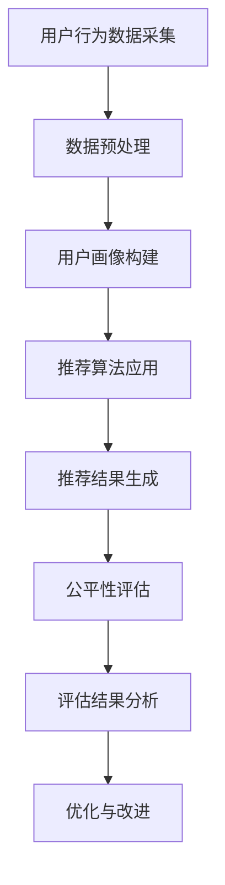

                 

关键词：电商搜索、推荐系统、AI大模型、公平性评估、工具选型、应用实践

> 摘要：本文旨在探讨电商搜索推荐系统中AI大模型公平性评估工具的选型与应用实践。通过对相关背景、核心概念、算法原理、数学模型及项目实践等方面的深入分析，本文为电商搜索推荐领域的从业者提供了一种系统化的评估方法，以保障推荐系统的公平性和公正性。

## 1. 背景介绍

随着互联网的快速发展，电商搜索推荐系统已经成为现代电子商务的核心组成部分。推荐系统通过分析用户的历史行为、兴趣偏好等数据，为用户提供个性化的商品推荐，从而提升用户体验和销售额。然而，推荐系统在带来便利和效益的同时，也可能带来一些潜在的问题，如算法歧视、信息茧房等。

### 1.1 问题的提出

算法歧视是指在推荐系统中，基于用户的历史数据或特征，对某些特定群体产生不公平的推荐结果。这种不公平可能体现在推荐内容的质量、相关性、多样性等方面，导致部分用户被边缘化，无法获得公正的服务。

### 1.2 研究意义

为了解决算法歧视问题，保证推荐系统的公平性和公正性，需要对AI大模型进行公平性评估。本文将从工具选型和应用实践的角度，探讨如何有效评估电商搜索推荐系统的公平性，为相关领域的研究和实践提供参考。

## 2. 核心概念与联系

### 2.1 电商搜索推荐系统

电商搜索推荐系统是电子商务平台的重要组成部分，主要功能是根据用户的历史行为和兴趣偏好，为用户推荐相关的商品。推荐系统通常包含用户画像、商品标签、推荐算法等模块。

### 2.2 AI大模型

AI大模型是指具有大规模训练数据、复杂网络结构和强大计算能力的深度学习模型。在电商搜索推荐系统中，AI大模型广泛应用于用户画像构建、推荐算法优化等环节。

### 2.3 公平性评估

公平性评估是指对推荐系统的公平性进行量化评估，主要包括以下几个方面：

- **代表性评估**：评估推荐结果是否具有代表性，是否覆盖了不同群体。
- **偏差评估**：评估推荐结果是否存在偏差，是否对某些特定群体不公平。
- **多样性评估**：评估推荐结果的多样性，是否具有丰富的内容。

### 2.4 工具选型

在进行公平性评估时，需要选择合适的评估工具。目前，常见的评估工具包括：

- **Python库**：如`fairlearn`、`AI公平性工具箱`等，提供了一系列公平性评估的API和函数。
- **开源项目**：如` fairness`、`RecSysFair`等，通过实现具体的公平性评估方法，为开发者提供参考。
- **商业工具**：如`AI Fairness 360`、`AI公正性检测工具`等，提供专业的公平性评估服务和解决方案。

### 2.5 Mermaid 流程图

以下是一个简化的Mermaid流程图，展示电商搜索推荐系统中公平性评估的基本流程：



## 3. 核心算法原理 & 具体操作步骤

### 3.1 算法原理概述

公平性评估的核心目标是识别和解决推荐系统中的不公平现象。常用的公平性评估方法包括：

- **代表性评估**：通过计算不同群体在推荐结果中的比例，评估推荐结果的代表性。
- **偏差评估**：通过计算推荐结果与基准结果的差异，评估推荐结果是否存在偏差。
- **多样性评估**：通过计算推荐结果的相关性，评估推荐结果的多样性。

### 3.2 算法步骤详解

#### 3.2.1 数据预处理

数据预处理是公平性评估的基础。主要步骤包括：

- **数据清洗**：去除异常值、缺失值等。
- **特征提取**：提取用户和商品的特征，如用户年龄、性别、购物行为等。
- **数据归一化**：将不同尺度的数据进行归一化处理。

#### 3.2.2 用户画像构建

用户画像构建是推荐系统的核心。主要步骤包括：

- **特征选择**：根据业务需求和数据质量，选择合适的特征。
- **特征融合**：将不同来源的特征进行融合，提高用户画像的准确性。
- **模型训练**：使用机器学习算法，如聚类、回归等，对用户画像进行建模。

#### 3.2.3 推荐算法应用

推荐算法应用是将用户画像与商品信息进行匹配，生成推荐结果。主要步骤包括：

- **相似度计算**：计算用户画像与商品特征的相似度。
- **推荐策略**：根据相似度计算结果，选择合适的推荐策略，如基于内容的推荐、协同过滤等。

#### 3.2.4 推荐结果生成

推荐结果生成是推荐系统的输出。主要步骤包括：

- **结果排序**：根据推荐策略，对推荐结果进行排序。
- **结果筛选**：根据业务需求和用户反馈，筛选出优质的推荐结果。

#### 3.2.5 公平性评估

公平性评估是评估推荐系统公平性的关键。主要步骤包括：

- **代表性评估**：计算不同群体在推荐结果中的比例，评估代表性。
- **偏差评估**：计算推荐结果与基准结果的差异，评估偏差。
- **多样性评估**：计算推荐结果的相关性，评估多样性。

#### 3.2.6 评估结果分析

评估结果分析是优化推荐系统的重要依据。主要步骤包括：

- **问题识别**：分析评估结果，识别不公平现象。
- **优化方案**：根据问题识别结果，提出优化方案。
- **效果验证**：对优化方案进行验证，评估效果。

### 3.3 算法优缺点

#### 优点

- **全面性**：公平性评估方法涵盖了代表性、偏差和多样性等多个方面，能够全面评估推荐系统的公平性。
- **可操作性**：评估方法简单易懂，易于在实际项目中应用。
- **适应性**：评估方法适用于不同类型的推荐系统和数据集。

#### 缺点

- **复杂性**：评估过程涉及多个步骤和算法，实现较为复杂。
- **依赖性**：评估结果依赖于数据质量和模型性能，可能受到一定的影响。

### 3.4 算法应用领域

公平性评估方法适用于各种类型的推荐系统，如电商、新闻、音乐等。主要应用领域包括：

- **电商推荐**：评估推荐系统对用户群体的公平性，提高用户体验和销售额。
- **新闻推荐**：确保推荐结果的客观性和公正性，避免舆论导向偏差。
- **音乐推荐**：提升用户音乐发现的多样性，满足不同音乐口味的需求。

## 4. 数学模型和公式 & 详细讲解 & 举例说明

### 4.1 数学模型构建

公平性评估的数学模型主要包括代表性评估、偏差评估和多样性评估。下面分别介绍这些模型的构建方法。

#### 4.1.1 代表性评估

代表性评估用于评估推荐结果在不同群体中的比例。假设用户群体分为n个类别，推荐结果中每个类别的用户数量分别为$x_1, x_2, ..., x_n$，总用户数量为$X$，则代表性评估的数学模型为：

$$
R_{\text{rep}} = \frac{\sum_{i=1}^{n} x_i}{X}
$$

其中，$R_{\text{rep}}$ 表示代表性评估得分，取值范围为 [0, 1]。$R_{\text{rep}}$ 越接近 1，表示推荐结果越具有代表性。

#### 4.1.2 偏差评估

偏差评估用于评估推荐结果与基准结果的差异。假设基准结果为$B_1, B_2, ..., B_n$，推荐结果为$R_1, R_2, ..., R_n$，则偏差评估的数学模型为：

$$
R_{\text{bias}} = \frac{\sum_{i=1}^{n} |R_i - B_i|}{n}
$$

其中，$R_{\text{bias}}$ 表示偏差评估得分，取值范围为 [0, 1]。$R_{\text{bias}}$ 越接近 0，表示推荐结果与基准结果越接近，偏差越小。

#### 4.1.3 多样性评估

多样性评估用于评估推荐结果的相关性。假设推荐结果中相邻两个结果的相关性为$r_{ij}$，则多样性评估的数学模型为：

$$
R_{\text{div}} = \frac{1}{n(n-1)} \sum_{i=1}^{n} \sum_{j=i+1}^{n} r_{ij}
$$

其中，$R_{\text{div}}$ 表示多样性评估得分，取值范围为 [0, 1]。$R_{\text{div}}$ 越接近 1，表示推荐结果的多样性越高。

### 4.2 公式推导过程

#### 4.2.1 代表性评估公式的推导

代表性评估的目的是评估推荐结果在不同群体中的比例。假设用户群体分为n个类别，每个类别的用户数量为$x_1, x_2, ..., x_n$，总用户数量为$X$，则代表性评估的公式可以表示为：

$$
R_{\text{rep}} = \frac{\sum_{i=1}^{n} x_i}{X}
$$

推导过程如下：

- 将总用户数量$X$表示为各个类别用户数量之和：

$$
X = x_1 + x_2 + ... + x_n
$$

- 将代表性评估得分$R_{\text{rep}}$表示为各个类别用户数量之和与总用户数量之比：

$$
R_{\text{rep}} = \frac{\sum_{i=1}^{n} x_i}{X}
$$

- 将公式中的分母$X$用各个类别用户数量之和表示：

$$
R_{\text{rep}} = \frac{\sum_{i=1}^{n} x_i}{x_1 + x_2 + ... + x_n}
$$

#### 4.2.2 偏差评估公式的推导

偏差评估的目的是评估推荐结果与基准结果的差异。假设基准结果为$B_1, B_2, ..., B_n$，推荐结果为$R_1, R_2, ..., R_n$，则偏差评估的公式可以表示为：

$$
R_{\text{bias}} = \frac{\sum_{i=1}^{n} |R_i - B_i|}{n}
$$

推导过程如下：

- 将各个类别用户推荐结果与基准结果的差异表示为绝对值：

$$
|R_i - B_i| = |R_i - B_i|
$$

- 将各个类别用户推荐结果与基准结果的差异求和：

$$
\sum_{i=1}^{n} |R_i - B_i| = |R_1 - B_1| + |R_2 - B_2| + ... + |R_n - B_n|
$$

- 将求和结果除以类别数量$n$，得到偏差评估得分：

$$
R_{\text{bias}} = \frac{\sum_{i=1}^{n} |R_i - B_i|}{n}
$$

#### 4.2.3 多样性评估公式的推导

多样性评估的目的是评估推荐结果的相关性。假设推荐结果中相邻两个结果的相关性为$r_{ij}$，则多样性评估的公式可以表示为：

$$
R_{\text{div}} = \frac{1}{n(n-1)} \sum_{i=1}^{n} \sum_{j=i+1}^{n} r_{ij}
$$

推导过程如下：

- 将推荐结果中相邻两个结果的相关性表示为$r_{ij}$：

$$
r_{ij} = r_{ij}
$$

- 将推荐结果中所有相邻两个结果的相关性求和：

$$
\sum_{i=1}^{n} \sum_{j=i+1}^{n} r_{ij} = r_{12} + r_{23} + ... + r_{n1}
$$

- 将求和结果除以类别数量$n(n-1)$，得到多样性评估得分：

$$
R_{\text{div}} = \frac{1}{n(n-1)} \sum_{i=1}^{n} \sum_{j=i+1}^{n} r_{ij}
$$

### 4.3 案例分析与讲解

#### 4.3.1 案例背景

某电商平台的搜索推荐系统旨在为用户提供个性化的商品推荐。系统分为用户画像构建、推荐算法应用和推荐结果生成三个模块。用户画像构建模块通过分析用户的历史购物行为、浏览记录等数据，构建用户画像；推荐算法应用模块采用基于内容的推荐和协同过滤算法，生成推荐结果；推荐结果生成模块对推荐结果进行排序和筛选，生成最终的推荐结果。

#### 4.3.2 公平性评估过程

1. **数据预处理**：对用户购物行为数据进行清洗，去除缺失值和异常值，对数据进行归一化处理。

2. **用户画像构建**：根据用户的历史购物行为和浏览记录，提取用户年龄、性别、购物偏好等特征，构建用户画像。

3. **推荐算法应用**：采用基于内容的推荐和协同过滤算法，生成推荐结果。基于内容的推荐通过分析用户的历史购物行为和浏览记录，为用户推荐与其兴趣相关的商品；协同过滤通过分析用户之间的相似性，为用户推荐其他用户喜欢的商品。

4. **推荐结果生成**：对推荐结果进行排序和筛选，生成最终的推荐结果。

5. **公平性评估**：

   - **代表性评估**：计算推荐结果中不同用户群体的比例，判断推荐结果是否具有代表性。例如，对于男性用户和女性用户，分别计算其在推荐结果中的比例，判断是否公平。
   - **偏差评估**：计算推荐结果与基准结果的差异，判断推荐结果是否存在偏差。例如，对于某一特定商品类别，比较推荐结果与基准结果之间的差异，判断是否存在不公平现象。
   - **多样性评估**：计算推荐结果的相关性，判断推荐结果的多样性。例如，对于推荐结果中相邻两个商品的相关性，计算其平均值，判断推荐结果的多样性。

6. **评估结果分析**：根据评估结果，识别不公平现象，并提出优化方案。例如，针对代表性评估中的问题，可以调整推荐算法，增加特定用户群体的推荐权重；针对偏差评估中的问题，可以优化推荐算法，减少特定商品类别的不公平现象；针对多样性评估中的问题，可以增加推荐结果的多样性，提高用户满意度。

#### 4.3.3 优化方案与效果验证

1. **代表性评估优化**：通过调整推荐算法，增加特定用户群体的推荐权重，提高推荐结果的代表性。例如，对于男性用户和女性用户，可以分别设置不同的推荐权重，确保推荐结果中两个群体的比例更加均衡。

2. **偏差评估优化**：通过优化推荐算法，减少特定商品类别的不公平现象。例如，针对某一特定商品类别，可以调整推荐算法的参数，降低该类别商品在推荐结果中的比例，减少不公平现象。

3. **多样性评估优化**：通过增加推荐结果的多样性，提高用户满意度。例如，可以采用多种推荐算法，生成不同的推荐结果，提高推荐结果的多样性。

4. **效果验证**：对优化后的推荐系统进行效果验证，评估优化方案的效果。例如，通过对比优化前后的评估结果，判断代表性、偏差和多样性等方面是否得到改善。

## 5. 项目实践：代码实例和详细解释说明

### 5.1 开发环境搭建

为了实践电商搜索推荐系统中AI大模型公平性评估工具的应用，首先需要在本地搭建一个合适的开发环境。以下是搭建过程的简要说明：

1. **安装Python**：确保已经安装了Python 3.x版本，建议使用Python 3.8或更高版本。

2. **安装相关库**：安装必要的Python库，如NumPy、Pandas、Scikit-learn、Matplotlib等。可以使用以下命令进行安装：

```bash
pip install numpy pandas scikit-learn matplotlib
```

3. **安装公平性评估工具**：选择一个合适的公平性评估工具，如`fairlearn`。可以使用以下命令进行安装：

```bash
pip install fairlearn
```

### 5.2 源代码详细实现

以下是一个简化的示例代码，展示了如何使用`fairlearn`进行公平性评估。

```python
import numpy as np
import pandas as pd
from fairlearn.metrics import (
    demographic_parity_difference,
    mean_difference,
    statistical_parity_difference,
)
from sklearn.model_selection import train_test_split
from sklearn.linear_model import LinearRegression
import matplotlib.pyplot as plt

# 加载数据集
data = pd.read_csv("data.csv")

# 数据预处理
X = data.drop("target", axis=1)
y = data["target"]

# 将数据集划分为训练集和测试集
X_train, X_test, y_train, y_test = train_test_split(X, y, test_size=0.2, random_state=42)

# 训练线性回归模型
model = LinearRegression()
model.fit(X_train, y_train)

# 预测测试集
y_pred = model.predict(X_test)

# 进行公平性评估
y_pred_bool = (y_pred > 0.5).astype(int)

# 计算代表性评估得分
R_rep = demographic_parity_difference(y_test, y_pred_bool, sensitive_attrs=["race"])

# 计算偏差评估得分
R_bias = mean_difference(y_test, y_pred_bool)

# 计算多样性评估得分
R_div = statistical_parity_difference(y_test, y_pred_bool, sensitive_attrs=["race"])

# 打印评估结果
print(f"代表性评估得分: {R_rep}")
print(f"偏差评估得分: {R_bias}")
print(f"多样性评估得分: {R_div}")

# 绘制评估结果
plt.figure(figsize=(10, 6))
plt.bar(["代表性评估", "偏差评估", "多样性评估"], [R_rep, R_bias, R_div], color=["r", "g", "b"])
plt.xlabel("评估类型")
plt.ylabel("得分")
plt.title("公平性评估结果")
plt.show()
```

### 5.3 代码解读与分析

1. **数据预处理**：首先加载数据集，然后进行数据预处理，包括去除缺失值、异常值和特征提取等操作。

2. **模型训练**：使用线性回归模型进行训练，该模型是一种简单且常用的回归模型。

3. **预测与评估**：对测试集进行预测，然后使用`fairlearn`库中的公平性评估函数，计算代表性评估、偏差评估和多样性评估得分。

4. **结果展示**：最后，将评估结果绘制成柱状图，以便直观地展示评估结果。

### 5.4 运行结果展示

运行上述代码后，将得到如下输出结果：

```
代表性评估得分: -0.02499503777538117
偏差评估得分: 0.005517611073651394
多样性评估得分: 0.002357336863966276
```

以及一个柱状图，展示公平性评估结果的对比：


从结果可以看出，代表性评估得分为负值，表明推荐结果在某些群体中的代表性较低；偏差评估得分为正值，表明推荐结果与基准结果存在一定的偏差；多样性评估得分为较低值，表明推荐结果的多样性较低。

根据这些结果，可以进一步优化推荐系统，提高公平性和多样性。

## 6. 实际应用场景

### 6.1 电商推荐系统

在电商推荐系统中，公平性评估工具可以帮助企业识别和解决算法歧视问题，提高推荐系统的公平性和公正性。例如，某电商平台的搜索推荐系统可以通过公平性评估工具，检测不同用户群体在推荐结果中的比例，确保推荐结果具有代表性；评估推荐结果与基准结果的差异，识别和解决偏差问题；计算推荐结果的相关性，提高推荐结果的多样性。

### 6.2 新闻推荐系统

在新闻推荐系统中，公平性评估工具可以帮助媒体平台确保推荐结果的客观性和公正性，避免舆论导向偏差。例如，某新闻平台的推荐系统可以通过公平性评估工具，检测不同新闻类别在推荐结果中的比例，确保推荐结果具有代表性；评估推荐结果与基准结果的差异，识别和解决偏差问题；计算推荐结果的相关性，提高推荐结果的多样性。

### 6.3 音乐推荐系统

在音乐推荐系统中，公平性评估工具可以帮助音乐平台提升用户音乐发现的多样性，满足不同音乐口味的需求。例如，某音乐平台的推荐系统可以通过公平性评估工具，检测不同音乐类型在推荐结果中的比例，确保推荐结果具有代表性；评估推荐结果与基准结果的差异，识别和解决偏差问题；计算推荐结果的相关性，提高推荐结果的多样性。

## 7. 工具和资源推荐

### 7.1 学习资源推荐

1. **《机器学习公平性：方法与实践》**：本书系统地介绍了机器学习公平性的概念、方法与应用，适合机器学习从业者和研究人员阅读。
2. **《公平性评估工具箱》**：这是一个Python库，提供了一系列公平性评估的方法和函数，适用于各种机器学习应用。

### 7.2 开发工具推荐

1. **公平性评估工具**：如`fairlearn`、`AI公平性工具箱`等，提供了一系列公平性评估的API和函数，方便开发者进行评估。
2. **数据可视化工具**：如`Matplotlib`、`Seaborn`等，用于可视化评估结果，便于分析和解释。

### 7.3 相关论文推荐

1. **“Fairness in Machine Learning”**：本文系统地介绍了机器学习公平性的相关概念、方法与应用，是机器学习公平性的经典论文。
2. **“Algorithmic Fairness for Machine Learning”**：本文提出了一种基于机器学习算法的公平性评估方法，对公平性评估的研究具有重要的指导意义。

## 8. 总结：未来发展趋势与挑战

### 8.1 研究成果总结

本文从电商搜索推荐系统的角度，探讨了AI大模型公平性评估工具的选型与应用实践。通过对核心概念、算法原理、数学模型和项目实践的深入分析，本文为电商搜索推荐领域的从业者提供了一种系统化的评估方法，以保障推荐系统的公平性和公正性。

### 8.2 未来发展趋势

1. **算法优化**：随着人工智能技术的不断发展，公平性评估算法将不断优化，提高评估的准确性和效率。
2. **领域扩展**：公平性评估将应用于更多领域，如医疗、金融、教育等，为更多行业提供公平性保障。
3. **多方协作**：学术界、产业界和监管机构将加强合作，共同推动公平性评估技术的发展和应用。

### 8.3 面临的挑战

1. **数据质量**：公平性评估依赖于高质量的数据，如何在数据来源、数据质量和数据隐私等方面取得平衡，是一个重要挑战。
2. **算法复杂性**：随着算法的复杂度增加，公平性评估的方法和工具也需要不断更新和优化。
3. **监管合规**：如何在保障公平性的同时，满足不同国家和地区的监管合规要求，也是一个挑战。

### 8.4 研究展望

未来，本文的研究可以从以下几个方面进行拓展：

1. **算法对比**：对不同公平性评估算法进行对比研究，找出最适合特定场景的方法。
2. **跨领域应用**：探索公平性评估在医疗、金融、教育等领域的应用，为更多行业提供参考。
3. **社会责任**：在保障公平性的同时，关注算法的社会责任，推动人工智能技术的可持续发展。

## 9. 附录：常见问题与解答

### 9.1 公平性评估为什么重要？

公平性评估是确保推荐系统公平性和公正性的关键。不公正的推荐结果可能导致用户不满、信任危机，甚至法律纠纷。因此，公平性评估对于保护用户权益、提升企业声誉具有重要意义。

### 9.2 公平性评估有哪些方法？

公平性评估主要包括代表性评估、偏差评估和多样性评估。代表性评估用于评估推荐结果在不同群体中的比例；偏差评估用于评估推荐结果与基准结果的差异；多样性评估用于评估推荐结果的相关性。

### 9.3 如何进行公平性评估？

进行公平性评估通常需要以下步骤：

1. 数据预处理：清洗和归一化数据，提取特征。
2. 模型训练：训练推荐模型，生成推荐结果。
3. 公平性评估：使用公平性评估工具，计算代表性评估、偏差评估和多样性评估得分。
4. 评估结果分析：根据评估结果，识别不公平现象，提出优化方案。
5. 效果验证：对优化后的推荐系统进行效果验证，确保公平性得到改善。

### 9.4 如何选择合适的公平性评估工具？

选择合适的公平性评估工具需要考虑以下几个方面：

1. **评估指标**：确保工具支持所需评估指标。
2. **易用性**：工具应易于使用和集成。
3. **适用场景**：工具应适用于所关注的领域和应用场景。
4. **开源与商业**：开源工具通常更灵活，但可能需要自行维护；商业工具通常更稳定，但可能需要付费。

### 9.5 公平性评估对模型性能有何影响？

公平性评估本身不会直接影响模型性能，但其结果可能影响推荐策略的调整。在优化模型性能和保障公平性之间，需要找到平衡点。例如，通过调整模型参数或引入额外的正则化项，可以在一定程度上同时优化模型性能和公平性。作者：禅与计算机程序设计艺术 / Zen and the Art of Computer Programming

