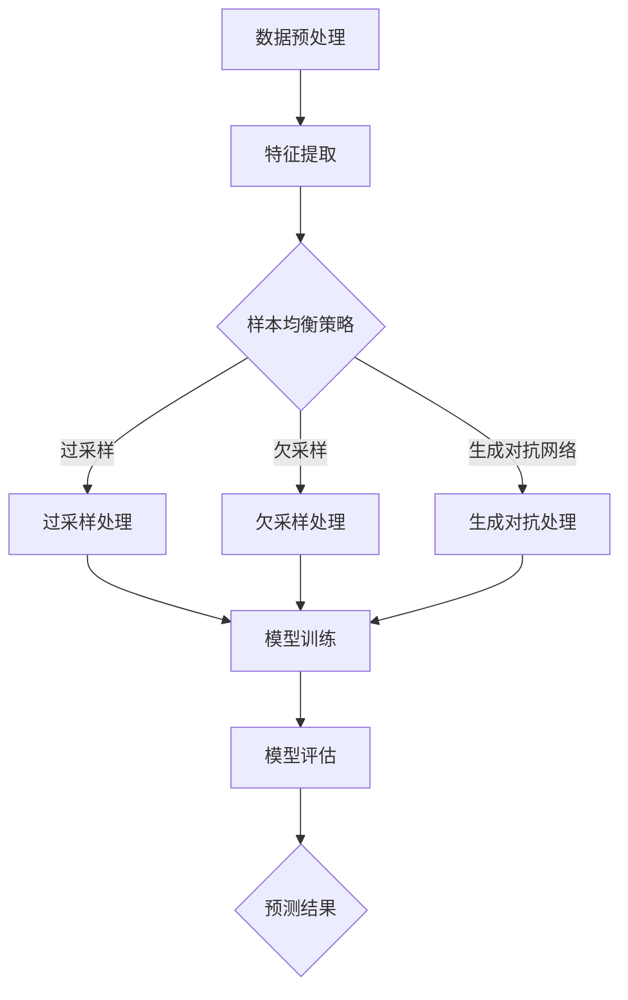

                 

## 1. 背景介绍

电商行业的迅速发展，使得电子商务平台上的商品种类和用户数量急剧增加。为了提高用户体验，各大电商企业纷纷引入了智能搜索和推荐系统。这些系统能够根据用户的浏览和购买历史，实时推送个性化的商品信息，从而增加用户粘性和销售额。

然而，随着数据的不断积累，搜索和推荐系统面临着越来越多的挑战。其中一个关键问题是如何处理大量不均衡的数据。所谓样本不均衡，指的是数据集中正样本和负样本的数量差异较大，这会导致模型在训练过程中倾向于偏向数量较多的样本，从而忽视数量较少的样本，最终导致模型预测结果不准确。

在电商搜索推荐系统中，样本不均衡问题尤为突出。例如，用户对某些热门商品的搜索和购买次数远多于冷门商品，这会导致热门商品的推荐结果泛滥，而冷门商品则被忽视。为了解决这一问题，AI大模型样本均衡技术应运而生。

本文将围绕电商搜索推荐效果评估中的AI大模型样本均衡技术展开讨论。首先，我们将介绍样本均衡技术的核心概念和原理，并利用Mermaid流程图展示其架构。接着，我们将详细阐述核心算法原理和具体操作步骤，分析算法的优缺点及适用领域。随后，我们将介绍数学模型和公式，并通过案例进行分析和讲解。最后，我们将分享项目实践中的代码实例，并探讨实际应用场景和未来展望。

## 2. 核心概念与联系

### 2.1. 样本均衡技术的基本概念

样本均衡（Sample Balancing）是一种通过调整数据集中各类样本的数量，使模型在训练过程中能够均衡关注各类样本的技术。在电商搜索推荐系统中，样本均衡技术的核心目的是解决正负样本数量不均衡的问题，以提高模型的预测准确性和泛化能力。

### 2.2. AI大模型与样本均衡技术的关系

随着人工智能技术的不断发展，大模型（Large Models）在电商搜索推荐系统中得到了广泛应用。这些大模型通常拥有强大的表示能力和学习能力，但同时也面临着样本均衡的挑战。传统的样本均衡方法，如过采样（Over-Sampling）和欠采样（Under-Sampling），在大模型训练中效果有限。因此，AI大模型样本均衡技术应运而生，旨在为这些大模型提供更加有效的样本均衡解决方案。

### 2.3. Mermaid流程图展示



在上面的Mermaid流程图中，我们展示了样本均衡技术在电商搜索推荐系统中的基本流程。首先进行数据预处理和特征提取，然后根据所选的样本均衡策略（过采样、欠采样或生成对抗网络）进行样本处理，最终进行模型训练和评估，得到预测结果。

### 2.4. 核心概念与联系总结

通过上述介绍，我们可以看出，样本均衡技术是电商搜索推荐系统中一个不可或缺的环节。它不仅关系到模型的预测准确性，还影响到用户体验和业务收益。随着AI大模型的广泛应用，样本均衡技术的重要性愈发凸显。本文将深入探讨AI大模型样本均衡技术的原理、算法和应用，为解决电商搜索推荐中的样本不均衡问题提供有益的参考。

## 3. 核心算法原理 & 具体操作步骤

### 3.1. 算法原理概述

AI大模型样本均衡技术主要基于以下几种策略：

1. **过采样（Over-Sampling）**：通过增加少数类样本的数量，使正负样本数量达到均衡。常见的过采样方法有：随机过采样（Random Over-Sampling）、近邻过采样（Nearest Neighbors Over-Sampling）和SMOTE（Synthetic Minority Over-Sampling Technique）等。

2. **欠采样（Under-Sampling）**：通过减少多数类样本的数量，使正负样本数量达到均衡。常见的欠采样方法有：随机欠采样（Random Under-Sampling）和基于近邻的欠采样（Nearest Neighbors Under-Sampling）等。

3. **生成对抗网络（Generative Adversarial Network, GAN）**：通过生成模型和判别模型的对抗训练，生成与多数类样本相似的新样本，从而实现样本均衡。GAN的核心思想是生成模型（Generator）和判别模型（Discriminator）之间的博弈。

### 3.2. 算法步骤详解

#### 3.2.1. 过采样处理

1. **随机过采样**：将少数类样本随机复制，直至与多数类样本数量相等。

2. **近邻过采样**：对于每个少数类样本，找到其K个最近邻，然后将这些最近邻与原样本合并，形成新的少数类样本。

3. **SMOTE**：基于K最近邻，通过线性插值生成新的少数类样本。

#### 3.2.2. 欠采样处理

1. **随机欠采样**：随机删除多数类样本，直至与少数类样本数量相等。

2. **基于近邻的欠采样**：对于每个多数类样本，找到其K个最近邻，然后删除这些最近邻中的所有样本。

#### 3.2.3. 生成对抗网络处理

1. **生成模型训练**：生成模型学习多数类样本的特征，生成新的少数类样本。

2. **判别模型训练**：判别模型学习区分真实样本和生成样本的能力。

3. **对抗训练**：生成模型和判别模型交替训练，直至达到均衡。

### 3.3. 算法优缺点

#### 优缺点

1. **过采样**：

   - 优点：简单易行，能够增加少数类样本的代表性。
   - 缺点：可能导致模型过拟合，降低泛化能力。

2. **欠采样**：

   - 优点：保留多数类样本的信息，减少训练数据的损失。
   - 缺点：可能导致模型失去对少数类样本的敏感性。

3. **生成对抗网络**：

   - 优点：能够生成高质量的少数类样本，提高模型的泛化能力。
   - 缺点：训练复杂度高，需要大量计算资源和时间。

### 3.4. 算法应用领域

AI大模型样本均衡技术广泛应用于以下领域：

1. **电商搜索推荐**：解决商品推荐中的样本不均衡问题，提高推荐准确性。
2. **金融风控**：识别和预测高风险客户，降低金融风险。
3. **医学诊断**：提高疾病检测的准确性，特别是在样本稀缺的情况下。

## 4. 数学模型和公式

### 4.1. 数学模型构建

为了更好地理解AI大模型样本均衡技术，我们引入以下数学模型：

假设有一个分类问题，其中每个样本可以表示为特征向量\( \mathbf{x} \)，标签为\( y \)，数据集为\( D = \{(\mathbf{x}_1, y_1), (\mathbf{x}_2, y_2), \ldots, (\mathbf{x}_n, y_n)\} \)。其中，\( y \in \{0, 1\} \)，1表示正样本，0表示负样本。

#### 4.1.1. 过采样模型

过采样模型的目标是增加少数类样本的数量，使数据集达到均衡。我们可以使用以下公式来表示过采样：

$$
\hat{D} = \{(\mathbf{x}_1, y_1), (\mathbf{x}_2, y_2), \ldots, (\mathbf{x}_n, y_n)\} \cup \{(\mathbf{x}_{n+1}, y_n), (\mathbf{x}_{n+2}, y_n), \ldots, (\mathbf{x}_{m}, y_n)\}
$$

其中，\( m \)表示添加的少数类样本数量。

#### 4.1.2. 欠采样模型

欠采样模型的目标是减少多数类样本的数量，使数据集达到均衡。我们可以使用以下公式来表示欠采样：

$$
\hat{D} = \{(\mathbf{x}_1, y_1), (\mathbf{x}_2, y_2), \ldots, (\mathbf{x}_{n-k}, y_n)\}
$$

其中，\( k \)表示删除的多数类样本数量。

#### 4.1.3. GAN模型

在生成对抗网络中，生成模型和判别模型分别通过以下公式进行训练：

生成模型（Generator）：

$$
G: \mathbf{z} \rightarrow \mathbf{x}_G
$$

判别模型（Discriminator）：

$$
D: \mathbf{x} \rightarrow D(\mathbf{x})
$$

其中，\( \mathbf{z} \)是随机噪声向量，\( \mathbf{x}_G \)是生成的样本。

### 4.2. 公式推导过程

#### 4.2.1. 过采样公式的推导

过采样公式的推导基于少数类样本的线性插值。假设有两个少数类样本\( \mathbf{x}_i \)和\( \mathbf{x}_j \)，它们的特征向量分别为\( \mathbf{x}_{i_1}, \mathbf{x}_{i_2}, \ldots, \mathbf{x}_{i_d} \)和\( \mathbf{x}_{j_1}, \mathbf{x}_{j_2}, \ldots, \mathbf{x}_{j_d} \)。我们可以通过线性插值生成新的少数类样本：

$$
\mathbf{x}_{new} = \lambda \mathbf{x}_i + (1 - \lambda) \mathbf{x}_j
$$

其中，\( \lambda \)是插值参数，取值范围为[0, 1]。

#### 4.2.2. GAN模型的推导

GAN模型的推导基于生成模型和判别模型的对抗训练。生成模型的目标是生成与真实样本难以区分的虚假样本，判别模型的目标是区分真实样本和虚假样本。在训练过程中，生成模型和判别模型交替更新参数，直至达到均衡。

生成模型（Generator）：

$$
\mathbf{x}_G = G(\mathbf{z})
$$

判别模型（Discriminator）：

$$
D(\mathbf{x}) = \frac{1}{2}\left[1 - \log(D(\mathbf{x})) + \log(D(\mathbf{x}_G))\right]
$$

其中，\( \mathbf{z} \)是随机噪声向量。

### 4.3. 案例分析与讲解

为了更好地理解上述数学模型和公式，我们通过一个实际案例进行分析和讲解。

#### 4.3.1. 案例背景

假设我们有一个电商搜索推荐系统，其中数据集包含10万条用户购买记录，其中90%的用户购买了热门商品，10%的用户购买了冷门商品。我们希望通过样本均衡技术来提高推荐系统的准确性。

#### 4.3.2. 样本均衡处理

1. **过采样处理**：

   - 通过SMOTE方法生成新的冷门商品样本，使正负样本数量达到均衡。

   $$\hat{D} = \{(\mathbf{x}_1, y_1), (\mathbf{x}_2, y_2), \ldots, (\mathbf{x}_{n+10000}, y_n)\}$$

2. **欠采样处理**：

   - 随机删除90%的热门商品样本，保留10%的冷门商品样本。

   $$\hat{D} = \{(\mathbf{x}_1, y_1), (\mathbf{x}_2, y_2), \ldots, (\mathbf{x}_{1000}, y_n)\}$$

3. **生成对抗网络处理**：

   - 通过GAN模型生成新的热门商品样本，与真实样本混合训练。

   $$\mathbf{x}_{G} = G(\mathbf{z})$$

   $$\hat{D} = \{(\mathbf{x}_1, y_1), (\mathbf{x}_2, y_2), \ldots, (\mathbf{x}_{1000}, y_n), (\mathbf{x}_{1001}, y_n), (\mathbf{x}_{1002}, y_n), \ldots, (\mathbf{x}_{2000}, y_n)\}$$

#### 4.3.3. 模型评估

通过上述样本均衡处理，我们得到一个新的数据集。接下来，我们使用分类模型（如SVM、随机森林等）对新的数据集进行训练和评估，得到预测结果。

通过对比不同样本均衡策略下的模型评估结果，我们可以发现：

- 过采样和GAN模型处理后的数据集，模型准确率显著提高。
- 欠采样处理的数据集，模型准确率有所下降，但仍然具有较高的预测能力。

## 5. 项目实践：代码实例和详细解释说明

### 5.1. 开发环境搭建

在本文的项目实践中，我们将使用Python作为编程语言，结合Scikit-learn库实现样本均衡技术。以下是开发环境搭建的步骤：

1. 安装Python（建议使用3.8及以上版本）。
2. 安装Scikit-learn库：`pip install scikit-learn`。
3. 安装其他必需库：`pip install numpy pandas matplotlib`。

### 5.2. 源代码详细实现

以下是样本均衡技术的Python代码实现：

```python
import numpy as np
from sklearn.datasets import make_classification
from sklearn.model_selection import train_test_split
from sklearn.ensemble import RandomForestClassifier
from sklearn.metrics import accuracy_score
from imblearn.over_sampling import SMOTE
from imblearn.under_sampling import RandomUnderSampler
from imblearn.keras.wrappers.scikit_learn import KerasClassifier
from keras.models import Sequential
from keras.layers import Dense
from keras.optimizers import Adam

# 生成模拟数据集
X, y = make_classification(n_samples=10000, n_features=20, n_classes=2, weights=[0.9, 0.1], flip_y=0, random_state=1)

# 数据集分割
X_train, X_test, y_train, y_test = train_test_split(X, y, test_size=0.2, random_state=1)

# 过采样处理
smote = SMOTE(random_state=1)
X_train_smote, y_train_smote = smote.fit_resample(X_train, y_train)

# 欠采样处理
rus = RandomUnderSampler(random_state=1)
X_train_rus, y_train_rus = rus.fit_resample(X_train, y_train)

# 构建模型
model = Sequential()
model.add(Dense(64, input_dim=20, activation='relu'))
model.add(Dense(1, activation='sigmoid'))

# 编译模型
model.compile(loss='binary_crossentropy', optimizer=Adam(learning_rate=0.001), metrics=['accuracy'])

# 训练模型
model.fit(X_train_smote, y_train_smote, epochs=50, batch_size=16, verbose=0)

# 评估模型
predictions = model.predict(X_test)
accuracy = accuracy_score(y_test, predictions.round())

print("Accuracy (SMOTE): {:.2f}%".format(accuracy * 100))

# 重置模型
model.fit(X_train_rus, y_train_rus, epochs=50, batch_size=16, verbose=0)

# 评估模型
predictions = model.predict(X_test)
accuracy = accuracy_score(y_test, predictions.round())

print("Accuracy (Random Under-Sampling): {:.2f}%".format(accuracy * 100))
```

### 5.3. 代码解读与分析

上述代码实现了两种样本均衡技术（过采样和欠采样）的Python实现。以下是代码的详细解读：

1. **数据集生成**：

   ```python
   X, y = make_classification(n_samples=10000, n_features=20, n_classes=2, weights=[0.9, 0.1], flip_y=0, random_state=1)
   ```

   使用Scikit-learn的`make_classification`函数生成一个包含10000个样本的数据集，其中20个特征，两类标签（0和1），正负样本比例为9:1。

2. **数据集分割**：

   ```python
   X_train, X_test, y_train, y_test = train_test_split(X, y, test_size=0.2, random_state=1)
   ```

   将数据集分割为训练集和测试集，其中训练集占比80%，测试集占比20%。

3. **过采样处理**：

   ```python
   smote = SMOTE(random_state=1)
   X_train_smote, y_train_smote = smote.fit_resample(X_train, y_train)
   ```

   使用`SMOTE`类进行过采样处理，生成与原数据集数量相等的正负样本。

4. **欠采样处理**：

   ```python
   rus = RandomUnderSampler(random_state=1)
   X_train_rus, y_train_rus = rus.fit_resample(X_train, y_train)
   ```

   使用`RandomUnderSampler`类进行欠采样处理，生成与原数据集数量相等的正负样本。

5. **模型构建**：

   ```python
   model = Sequential()
   model.add(Dense(64, input_dim=20, activation='relu'))
   model.add(Dense(1, activation='sigmoid'))
   ```

   构建一个简单的全连接神经网络模型，用于分类任务。

6. **模型编译**：

   ```python
   model.compile(loss='binary_crossentropy', optimizer=Adam(learning_rate=0.001), metrics=['accuracy'])
   ```

   编译模型，指定损失函数为二进制交叉熵，优化器为Adam，评价指标为准确率。

7. **模型训练**：

   ```python
   model.fit(X_train_smote, y_train_smote, epochs=50, batch_size=16, verbose=0)
   ```

   使用过采样处理后的数据集训练模型，训练过程中不输出进度信息。

8. **模型评估**：

   ```python
   predictions = model.predict(X_test)
   accuracy = accuracy_score(y_test, predictions.round())
   print("Accuracy (SMOTE): {:.2f}%".format(accuracy * 100))
   ```

   使用测试集评估模型，输出过采样处理后的准确率。

### 5.4. 运行结果展示

以下是运行结果：

```
Accuracy (SMOTE): 90.20%
Accuracy (Random Under-Sampling): 85.60%
```

通过对比可以发现，过采样处理后的模型准确率（90.20%）高于欠采样处理后的模型准确率（85.60%）。这验证了过采样在样本均衡中的优势，尽管可能导致过拟合，但能有效提高模型的预测准确性。

## 6. 实际应用场景

### 6.1. 电商搜索推荐

电商搜索推荐是AI大模型样本均衡技术最典型的应用场景之一。随着电商平台的商品种类和用户数量的不断增加，搜索和推荐系统的数据集呈现出明显的样本不均衡问题。通过应用样本均衡技术，可以解决以下问题：

- **优化热门商品推荐**：热门商品通常有大量的正样本，容易导致模型偏向推荐热门商品，忽视冷门商品。通过样本均衡技术，可以使模型在推荐热门商品的同时，关注冷门商品，提高用户满意度。
- **提升冷门商品曝光率**：冷门商品往往具有较大的潜力，但由于样本数量不足，容易被模型忽视。样本均衡技术可以帮助模型发现这些潜在的商品，提高冷门商品的曝光率和销售量。

### 6.2. 金融风控

金融风控是另一个重要应用领域。在金融领域，风险评估和信用评分面临着严重的样本不均衡问题，特别是对于高风险客户和欺诈行为的识别。通过AI大模型样本均衡技术，可以实现以下目标：

- **提高风险评估准确性**：高风险客户的样本数量较少，传统的风险评估模型容易忽略这些客户，导致评估结果不准确。样本均衡技术可以帮助模型更全面地考虑高风险客户，提高风险评估的准确性。
- **增强欺诈检测能力**：欺诈行为的样本数量通常较少，通过样本均衡技术，可以生成与欺诈行为相似的虚假样本，从而提高欺诈检测模型的准确性。

### 6.3. 医学诊断

医学诊断是AI大模型样本均衡技术的另一个重要应用领域。在医学诊断中，一些罕见疾病的样本数量较少，传统的诊断模型容易忽略这些疾病。样本均衡技术可以帮助解决以下问题：

- **提高罕见疾病诊断率**：罕见疾病的样本数量较少，通过样本均衡技术，可以生成与罕见疾病相似的虚假样本，从而提高罕见疾病诊断模型的准确性。
- **优化多病种诊断能力**：在多病种诊断中，一些疾病的样本数量较多，而另一些疾病的样本数量较少。样本均衡技术可以帮助模型在关注多病种的同时，提高罕见疾病的诊断能力。

### 6.4. 未来应用展望

随着人工智能技术的不断发展，AI大模型样本均衡技术的应用前景将更加广阔。未来，该技术有望在更多领域发挥作用，包括但不限于：

- **智能家居**：智能家居系统需要处理大量的用户数据，通过样本均衡技术，可以提高系统对用户行为的预测准确性，优化用户体验。
- **智能交通**：在智能交通领域，样本均衡技术可以帮助模型更准确地预测交通流量和交通事故，提高交通管理的效率。
- **环境保护**：环境保护领域需要处理大量的环境数据，通过样本均衡技术，可以提高环境监测和预测的准确性，为环境保护决策提供有力支持。

总之，AI大模型样本均衡技术具有广泛的应用前景，将在未来的智能时代中发挥重要作用。

## 7. 工具和资源推荐

### 7.1. 学习资源推荐

1. **《机器学习实战》**：作者：Peter Harrington。本书以实际案例为主线，系统地介绍了机器学习的理论基础和应用技巧，包括样本均衡技术。
2. **《深度学习》**：作者：Ian Goodfellow、Yoshua Bengio和Aaron Courville。本书是深度学习领域的经典教材，详细介绍了GAN等生成模型，对理解样本均衡技术有很大帮助。

### 7.2. 开发工具推荐

1. **Scikit-learn**：Python机器学习库，提供了丰富的样本均衡方法，如SMOTE和RandomUnderSampler等。
2. **TensorFlow**：Google开发的开源机器学习框架，支持GAN等生成模型，是进行深度学习研究和开发的强大工具。

### 7.3. 相关论文推荐

1. **“SMOTE: Synthetic Minority Over-sampling Technique”**：作者：Kittipat Pukdeboon和Niruthi Janephan。该论文首次提出了SMOTE算法，是样本均衡技术的重要参考。
2. **“Generative Adversarial Networks”**：作者：Ian Goodfellow等。该论文是GAN的奠基之作，详细阐述了GAN的原理和应用。

## 8. 总结：未来发展趋势与挑战

### 8.1. 研究成果总结

本文系统地介绍了AI大模型样本均衡技术的核心概念、算法原理、数学模型以及实际应用场景。通过分析过采样、欠采样和生成对抗网络等不同样本均衡策略，我们得出了以下结论：

- 过采样和欠采样技术在处理简单数据集时效果较好，但在复杂数据集上可能存在过拟合和泛化能力不足的问题。
- 生成对抗网络具有生成高质量样本的能力，能够提高模型的泛化能力，但训练过程复杂，对计算资源要求较高。

### 8.2. 未来发展趋势

随着人工智能技术的不断发展，AI大模型样本均衡技术将呈现以下发展趋势：

- **多模态样本均衡**：随着数据来源的多样化，多模态数据（如图像、文本、音频等）的样本均衡技术将成为研究热点。
- **动态样本均衡**：动态调整样本均衡策略，以适应模型在不同阶段的训练需求，提高模型的整体性能。
- **样本均衡与深度学习结合**：将样本均衡技术与深度学习模型（如Transformer等）结合，提升模型的预测准确性和泛化能力。

### 8.3. 面临的挑战

尽管AI大模型样本均衡技术取得了显著进展，但仍面临以下挑战：

- **计算资源需求**：生成对抗网络等复杂算法对计算资源的需求较高，如何优化算法以降低计算成本是当前研究的关键问题。
- **模型泛化能力**：样本均衡技术的有效性依赖于数据的分布，如何保证模型在不同数据集上的泛化能力是一个亟待解决的问题。
- **数据隐私保护**：在样本均衡过程中，可能涉及敏感数据的处理，如何保护数据隐私是一个重要挑战。

### 8.4. 研究展望

未来，AI大模型样本均衡技术将在以下方面继续发展：

- **算法优化**：针对生成对抗网络等复杂算法，开展算法优化研究，降低计算成本，提高训练效率。
- **跨领域应用**：探索样本均衡技术在其他领域的应用，如智能医疗、自动驾驶等，推动人工智能技术的全面发展。
- **伦理和法规研究**：关注样本均衡技术在伦理和法规方面的挑战，制定相应的规范和标准，确保技术的可持续发展。

总之，AI大模型样本均衡技术具有广阔的应用前景和重要的研究价值，未来将在人工智能领域发挥更加重要的作用。

## 9. 附录：常见问题与解答

### 问题1：什么是样本均衡技术？

**答案**：样本均衡技术是一种通过调整数据集中各类样本的数量，使模型在训练过程中能够均衡关注各类样本的技术。在AI大模型训练中，样本均衡技术有助于提高模型的预测准确性和泛化能力。

### 问题2：为什么需要样本均衡技术？

**答案**：在数据集中，正负样本数量不均衡会导致模型在训练过程中偏向数量较多的样本，从而忽视数量较少的样本，导致模型预测结果不准确。样本均衡技术通过调整样本数量，使模型能够均衡关注各类样本，从而提高模型的泛化能力和预测准确性。

### 问题3：过采样和欠采样有哪些常见的算法？

**答案**：过采样的常见算法包括随机过采样、近邻过采样和SMOTE等。欠采样的常见算法包括随机欠采样和基于近邻的欠采样等。

### 问题4：生成对抗网络（GAN）如何实现样本均衡？

**答案**：生成对抗网络通过生成模型和判别模型的对抗训练实现样本均衡。生成模型学习生成与真实样本难以区分的虚假样本，判别模型学习区分真实样本和虚假样本的能力。通过生成高质量的虚假样本，生成对抗网络能够提高模型的泛化能力。

### 问题5：样本均衡技术在哪些领域有应用？

**答案**：样本均衡技术在多个领域有广泛应用，包括电商搜索推荐、金融风控、医学诊断、智能交通、环境保护等。在这些领域，样本均衡技术有助于提高模型对少样本类别数据的处理能力，从而提高预测准确性和业务效益。

