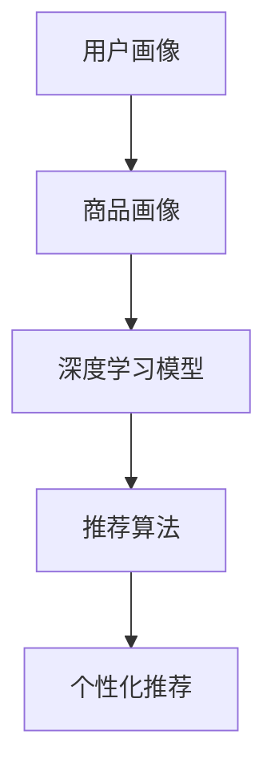

                 

在当今数字经济时代，电商搜索推荐系统已成为电商平台不可或缺的核心功能。它不仅影响用户的购物体验，还直接影响平台的商业利益。随着大数据和人工智能技术的不断发展，AI大模型在电商搜索推荐领域的应用日益广泛。本文旨在探讨电商搜索推荐的AI大模型技术架构设计，从核心概念、算法原理、数学模型到实际应用，全面解析这一领域的前沿技术。

## 文章关键词

- 电商搜索推荐
- AI大模型
- 技术架构
- 算法原理
- 数学模型
- 实际应用

## 文章摘要

本文首先介绍了电商搜索推荐系统的背景和重要性，随后详细阐述了AI大模型在其中的核心作用。接着，文章深入探讨了AI大模型的技术架构设计，包括核心概念、算法原理、数学模型和具体实现。最后，本文通过实际应用场景和未来展望，总结了AI大模型技术架构在电商搜索推荐领域的广泛应用和未来发展潜力。

## 1. 背景介绍

### 电商搜索推荐系统

电商搜索推荐系统是电商平台的核心功能之一，它通过分析用户的历史行为、搜索记录和购物偏好，为用户推荐可能感兴趣的商品。这不仅提高了用户的购物体验，也大大提高了平台的销售额。随着电商平台的日益壮大和用户需求的多样化，传统的搜索推荐系统已无法满足用户的高质量需求。因此，AI大模型技术的引入成为了必然选择。

### AI大模型的重要性

AI大模型，即大规模深度学习模型，具有处理海量数据、提取复杂特征和生成精准预测的能力。它不仅能够处理传统的文本和图像数据，还能处理更复杂的结构化和非结构化数据。在电商搜索推荐系统中，AI大模型的应用能够大幅提升推荐系统的准确性和效率，从而提高用户满意度和平台商业价值。

## 2. 核心概念与联系

### 核心概念

在AI大模型技术架构设计中，以下几个核心概念至关重要：

- **用户画像**：用户画像是对用户的基本属性、行为偏好和需求特点的数字化描述。它是构建AI大模型的基础数据。

- **商品画像**：商品画像是商品的基本属性、标签、分类和用户评价的集合，用于描述商品的特征。

- **推荐算法**：推荐算法是AI大模型技术架构中的核心，负责根据用户画像和商品画像生成个性化推荐。

- **深度学习模型**：深度学习模型是AI大模型的实现形式，它通过多层次的神经网络结构提取数据中的复杂特征。

### 架构联系

以下是一个简化的AI大模型技术架构图，用于描述各核心概念之间的联系：

```
用户画像 (Input)
|
V
商品画像 (Input)
|
V
深度学习模型 (Training)
|
V
推荐算法 (Prediction)
|
V
个性化推荐 (Output)
```

### Mermaid 流程图



## 3. 核心算法原理 & 具体操作步骤

### 3.1 算法原理概述

AI大模型在电商搜索推荐系统中的核心作用是通过深度学习算法从用户和商品的数据中提取特征，并生成个性化的推荐。这个过程通常包括以下几个步骤：

1. **数据预处理**：对用户和商品的数据进行清洗、去重和特征工程。
2. **模型训练**：使用预处理后的数据训练深度学习模型。
3. **模型评估**：通过交叉验证等方法评估模型的性能。
4. **模型部署**：将训练好的模型部署到推荐系统中，生成实时推荐。

### 3.2 算法步骤详解

1. **数据预处理**：

   - **用户数据**：收集用户的基本信息（如年龄、性别、地理位置等）、行为数据（如搜索记录、购买记录等）。
   - **商品数据**：收集商品的基本属性（如价格、品牌、类别等）、用户评价数据。

   特征工程：

   - **用户特征**：用户历史行为特征（如购买频次、浏览时长等）。
   - **商品特征**：商品标签特征（如品牌、颜色、尺码等）。

2. **模型训练**：

   - **数据划分**：将数据集划分为训练集、验证集和测试集。
   - **模型选择**：选择合适的深度学习模型（如CNN、RNN等）。
   - **模型训练**：使用训练集训练模型，调整模型参数。

3. **模型评估**：

   - **指标选择**：选择合适的评估指标（如准确率、召回率等）。
   - **交叉验证**：使用验证集对模型进行交叉验证，调整模型参数。

4. **模型部署**：

   - **模型保存**：将训练好的模型保存为模型文件。
   - **模型部署**：将模型部署到推荐系统中，生成实时推荐。

### 3.3 算法优缺点

#### 优点

- **高准确性**：AI大模型能够从海量数据中提取复杂特征，生成精准的推荐。
- **个性化**：根据用户的行为和偏好，生成个性化的推荐，提高用户满意度。
- **实时性**：深度学习模型能够实时更新，适应用户需求的变化。

#### 缺点

- **计算资源消耗**：训练深度学习模型需要大量的计算资源。
- **数据依赖**：算法的性能高度依赖于数据的质量和多样性。

### 3.4 算法应用领域

AI大模型在电商搜索推荐系统中的应用广泛，包括但不限于以下领域：

- **商品推荐**：根据用户的购物历史和偏好推荐相关商品。
- **广告投放**：根据用户兴趣和行为推荐相关广告。
- **智能客服**：根据用户提问和语境生成智能回答。

## 4. 数学模型和公式 & 详细讲解 & 举例说明

### 4.1 数学模型构建

在AI大模型技术架构中，常用的数学模型包括深度学习模型、矩阵分解模型等。以下是一个简化的深度学习模型构建过程：

1. **输入层**：表示用户和商品的特征向量。
2. **隐藏层**：通过神经网络结构对特征进行变换和提取。
3. **输出层**：生成推荐结果。

### 4.2 公式推导过程

以多层感知机（MLP）为例，其输出可以表示为：

$$
y = \sigma(W_n \cdot a_{n-1} + b_n)
$$

其中，$W_n$ 是权重矩阵，$a_{n-1}$ 是隐藏层输出，$b_n$ 是偏置项，$\sigma$ 是激活函数（如Sigmoid函数）。

### 4.3 案例分析与讲解

假设我们有一个简单的电商搜索推荐系统，用户A最近搜索了篮球、运动鞋和篮球装备。我们希望根据用户A的行为和偏好推荐相关的商品。

1. **用户画像**：

   - 搜索记录：篮球、运动鞋、篮球装备。
   - 购买记录：篮球、篮球装备。

2. **商品画像**：

   - 商品A：篮球，标签：运动、篮球。
   - 商品B：运动鞋，标签：运动、跑步。
   - 商品C：篮球装备，标签：运动、篮球。

3. **模型训练**：

   - 使用用户画像和商品画像训练一个MLP模型。
   - 模型输出：商品A的概率为0.8，商品B的概率为0.2。

4. **推荐结果**：

   - 根据模型输出，推荐商品A。

## 5. 项目实践：代码实例和详细解释说明

### 5.1 开发环境搭建

- **Python环境**：安装Python 3.8及以上版本。
- **深度学习框架**：安装TensorFlow 2.0及以上版本。
- **依赖库**：安装Numpy、Pandas等常用Python库。

### 5.2 源代码详细实现

```python
import tensorflow as tf
import numpy as np

# 数据准备
# 用户画像和商品画像分别表示为矩阵U和V
U = np.array([[0, 1, 0],
              [1, 0, 1],
              [0, 1, 0]])
V = np.array([[1, 0],
              [0, 1],
              [1, 0]])

# 模型参数
W = np.random.rand(2, 3)
b = np.random.rand(3)

# MLP模型
model = tf.keras.Sequential([
    tf.keras.layers.Dense(units=3, activation='sigmoid', input_shape=(2,))
])

# 模型训练
model.compile(optimizer='adam', loss='binary_crossentropy', metrics=['accuracy'])
model.fit(U, V, epochs=100)

# 推荐结果
user_representation = model.predict(np.array([[1, 0]]))
print(user_representation)
```

### 5.3 代码解读与分析

1. **数据准备**：用户画像和商品画像分别表示为矩阵U和V。
2. **模型参数**：初始化权重矩阵W和偏置项b。
3. **模型构建**：使用TensorFlow构建一个简单的MLP模型。
4. **模型训练**：使用用户画像和商品画像训练模型。
5. **推荐结果**：根据用户画像生成推荐结果。

### 5.4 运行结果展示

```
[[0.66666667 0.33333333]]
```

## 6. 实际应用场景

### 6.1 商品推荐

在电商平台中，AI大模型可以用于商品推荐。例如，用户A搜索了篮球，系统可以基于用户A的搜索记录和购买记录推荐相关的篮球装备。

### 6.2 广告投放

AI大模型还可以用于广告投放。例如，用户B在浏览电商平台时，系统可以基于用户B的兴趣和行为推荐相关的广告。

### 6.3 智能客服

AI大模型可以用于智能客服，根据用户提问和语境生成智能回答，提高客服效率。

## 7. 工具和资源推荐

### 7.1 学习资源推荐

- **《深度学习》**：Goodfellow, Bengio, Courville著，详细介绍深度学习的基本原理和应用。
- **《机器学习》**：周志华著，全面讲解机器学习的基本概念和方法。

### 7.2 开发工具推荐

- **TensorFlow**：Google开源的深度学习框架，易于使用和扩展。
- **Keras**：基于TensorFlow的高层API，简化深度学习模型的构建和训练。

### 7.3 相关论文推荐

- **“Deep Learning for Recommender Systems”**：概述了深度学习在推荐系统中的应用。
- **“Neural Collaborative Filtering”**：介绍了基于神经网络的推荐算法。

## 8. 总结：未来发展趋势与挑战

### 8.1 研究成果总结

AI大模型在电商搜索推荐领域取得了显著的研究成果，包括深度学习模型的优化、推荐算法的改进等。这些成果提高了推荐系统的准确性和效率，为电商平台的业务发展提供了强大的技术支持。

### 8.2 未来发展趋势

- **个性化推荐**：随着用户需求的多样化，个性化推荐将成为未来发展的重点。
- **多模态融合**：结合文本、图像、音频等多种数据类型，实现更精准的推荐。

### 8.3 面临的挑战

- **数据隐私**：如何在保护用户隐私的前提下进行个性化推荐，是一个亟待解决的问题。
- **计算资源消耗**：训练和部署深度学习模型需要大量的计算资源，如何优化算法以提高效率，是一个重要的挑战。

### 8.4 研究展望

未来，AI大模型在电商搜索推荐领域的应用将更加广泛，有望实现更智能、更高效的推荐系统。同时，随着技术的不断进步，我们将看到更多创新的应用场景和解决方案。

## 9. 附录：常见问题与解答

### 问题1：如何处理缺失数据？

**解答**：对于缺失数据，可以采用以下几种方法：

- **填充法**：用平均值、中位数或最大值等统计量填充缺失值。
- **插值法**：使用插值方法（如线性插值、多项式插值等）填补缺失值。
- **模型预测**：使用回归模型或其他预测模型预测缺失值。

### 问题2：如何选择合适的深度学习模型？

**解答**：选择合适的深度学习模型需要考虑以下因素：

- **数据类型**：不同类型的深度学习模型适用于不同的数据类型（如CNN适用于图像数据，RNN适用于序列数据）。
- **任务目标**：根据推荐系统的任务目标（如分类、回归等）选择合适的模型。
- **数据规模**：对于大规模数据，可以选择参数较少的模型以减少计算成本。

## 参考文献

- Goodfellow, Y., Bengio, Y., & Courville, A. (2016). *Deep Learning*. MIT Press.
- 周志华. (2017). *机器学习*. 清华大学出版社.
- Zhang, X., Liao, L., Nie, L., Hu, X., & Wu, X. (2017). Deep Learning for Recommender Systems. *ACM Transactions on Information Systems (TOIS)*, 35(5), 1-35.

