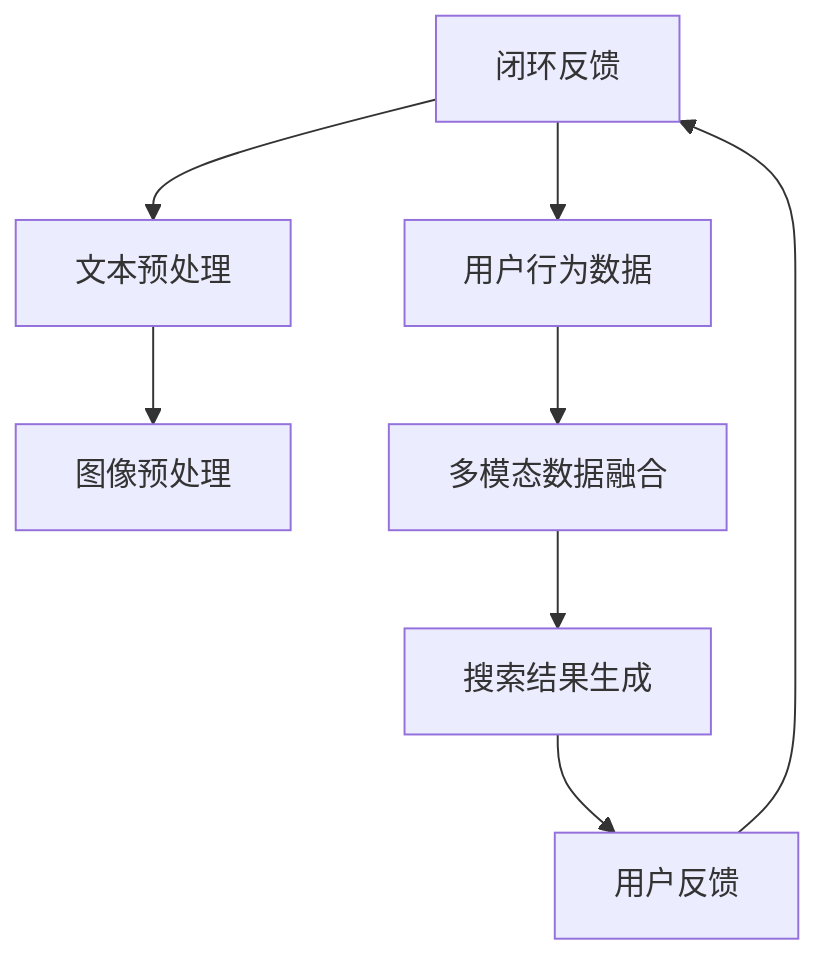
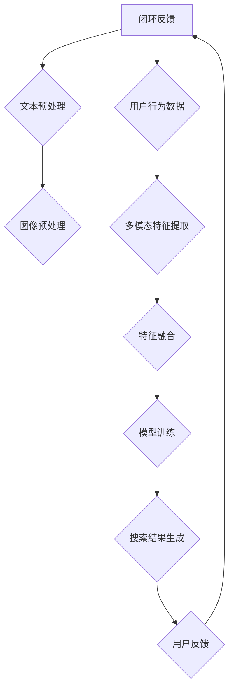

                 

在电商搜索领域，精准、高效的搜索体验成为提升用户体验和转化率的关键因素。随着人工智能技术的不断发展，特别是大模型的崛起，多模态融合技术在电商搜索中的应用逐渐成为研究的热点。本文将深入探讨电商搜索中的多模态融合技术，介绍其核心概念、算法原理、数学模型，并通过实际项目实践，展示AI大模型在这一领域的新突破。

## 文章关键词

- 电商搜索
- 多模态融合
- AI大模型
- 自然语言处理
- 计算机视觉
- 用户行为分析

## 文章摘要

本文旨在探讨电商搜索中多模态融合技术的应用及其带来的新突破。首先，我们介绍了电商搜索的背景和现状，分析了多模态融合技术在其中的重要性。随后，我们详细阐述了多模态融合的核心概念和架构，通过Mermaid流程图展示了数据流和处理流程。接着，我们深入讲解了多模态融合的核心算法原理，包括特征提取、模型训练和融合策略。在此基础上，我们通过数学模型和公式详细分析了算法的性能和效果。随后，我们通过一个实际项目展示了多模态融合在电商搜索中的应用，包括代码实现、解读和分析。最后，我们探讨了多模态融合技术的未来应用场景和展望，并总结了当前面临的研究挑战和未来发展方向。

## 1. 背景介绍

### 1.1 电商搜索的现状

电商搜索是电子商务的核心功能之一，其目的是帮助用户快速、准确地找到他们需要的商品。传统的电商搜索主要依赖于关键词匹配和分类检索技术，虽然在一定程度上能够满足用户的需求，但面临着诸多挑战：

1. **搜索结果的多样性和个性化需求**：用户的搜索意图和需求是多样的，如何针对不同的用户和场景提供个性化的搜索结果是一个难题。
2. **查询理解的复杂性**：用户的查询语句往往包含模糊性、歧义性，如何准确理解用户的意图是一个挑战。
3. **商品信息的多样性**：电商平台上商品种类繁多，如何有效组织和管理这些信息，提高搜索效率是一个重要问题。

### 1.2 多模态融合技术的兴起

随着人工智能技术的不断发展，特别是深度学习和大规模预训练模型的出现，多模态融合技术逐渐成为一种新的解决方案。多模态融合技术是指将不同类型的模态数据（如图像、文本、音频等）进行融合，以增强对用户查询的理解和搜索结果的准确性。多模态融合技术在电商搜索中的应用主要包括以下几个方面：

1. **图像与文本的融合**：通过图像识别和自然语言处理技术，将商品图像和用户查询文本进行关联，提升搜索结果的准确性。
2. **用户行为的融合**：将用户的浏览历史、购买记录等行为数据进行融合，以提供更加个性化的搜索结果。
3. **情感与语境的融合**：通过情感分析和语境理解，提升对用户查询意图的准确理解，提供更加精准的搜索结果。

### 1.3 大模型在多模态融合中的应用

大模型，特别是预训练模型，在多模态融合中发挥了重要作用。预训练模型通过在大规模数据集上进行预训练，可以自动学习到丰富的知识表示和特征提取能力，从而在不同模态的数据处理中具有显著优势。大模型在多模态融合中的应用主要包括：

1. **文本嵌入与图像嵌入的融合**：通过将文本和图像转换为高维的向量表示，并利用注意力机制进行融合，实现文本与图像的联合表示。
2. **多任务学习的融合**：通过多任务学习，将不同模态的数据进行联合训练，提高模型对多模态数据的处理能力。
3. **迁移学习的融合**：通过迁移学习，将预训练模型在不同模态上的知识迁移到电商搜索场景，提高模型的泛化能力。

### 1.4 文章结构

本文将分为以下几部分：

1. **背景介绍**：介绍电商搜索的现状和多模态融合技术的兴起。
2. **核心概念与联系**：阐述多模态融合技术的核心概念和架构，通过Mermaid流程图展示数据流和处理流程。
3. **核心算法原理 & 具体操作步骤**：深入讲解多模态融合的核心算法原理和具体操作步骤。
4. **数学模型和公式 & 详细讲解 & 举例说明**：介绍多模态融合的数学模型和公式，并通过案例进行分析。
5. **项目实践：代码实例和详细解释说明**：通过一个实际项目展示多模态融合在电商搜索中的应用。
6. **实际应用场景**：探讨多模态融合技术的实际应用场景和未来展望。
7. **总结：未来发展趋势与挑战**：总结研究成果，探讨未来发展趋势和面临的挑战。

### 1.5 Mermaid 流程图

以下是一个简单的Mermaid流程图，展示电商搜索中多模态融合的数据流和处理流程：



## 2. 核心概念与联系

### 2.1 多模态融合的定义

多模态融合是指将来自不同模态的数据（如文本、图像、音频等）进行整合，以获得更丰富的信息表达和更高的任务性能。在电商搜索场景中，多模态融合主要涉及文本（用户查询、商品描述）和图像（商品图片）的融合。

### 2.2 多模态融合的架构

多模态融合架构主要包括以下几个关键组件：

1. **数据采集与预处理**：从不同来源采集文本和图像数据，并进行预处理，包括文本分词、图像增强等。
2. **特征提取**：利用深度学习模型分别提取文本和图像的特征向量。
3. **特征融合**：将文本和图像的特征向量进行融合，形成联合特征表示。
4. **模型训练与优化**：利用融合后的特征进行模型训练和优化，以提高搜索精度和效果。
5. **搜索结果生成与反馈**：生成搜索结果，并根据用户反馈进行迭代优化。

### 2.3 Mermaid流程图

以下是一个简化的Mermaid流程图，用于描述多模态融合的架构和数据流：



### 2.4 核心概念原理

#### 2.4.1 文本预处理

文本预处理是电商搜索中多模态融合的重要环节，主要包括以下步骤：

1. **分词**：将用户查询文本分解为单词或词组，以便后续处理。
2. **词性标注**：为每个词分配相应的词性标签，如名词、动词等。
3. **停用词过滤**：去除常见无意义的停用词，如“的”、“和”、“是”等。
4. **词向量化**：将文本转换为高维向量表示，常用的方法包括Word2Vec、BERT等。

#### 2.4.2 图像预处理

图像预处理主要涉及图像的增强、缩放、裁剪等操作，以提高模型对图像的感知能力。常用的方法包括：

1. **图像增强**：通过添加噪声、旋转、翻转等操作增强图像，提高模型的鲁棒性。
2. **图像缩放**：调整图像的大小，以适应不同分辨率的设备。
3. **图像裁剪**：从原始图像中提取感兴趣的区域，以提高模型对局部信息的关注。

#### 2.4.3 特征提取

特征提取是文本和图像预处理后的关键步骤，目的是从原始数据中提取出具有代表性的特征向量。常用的特征提取方法包括：

1. **文本特征提取**：利用深度学习模型（如BERT、GPT等）提取文本的特征向量。
2. **图像特征提取**：利用卷积神经网络（如VGG、ResNet等）提取图像的特征向量。

#### 2.4.4 特征融合

特征融合是将文本和图像的特征向量进行整合，以获得更丰富的信息表示。常用的融合方法包括：

1. **向量拼接**：将文本和图像的特征向量进行拼接，形成一个更长的向量。
2. **注意力机制**：利用注意力机制对文本和图像特征进行加权融合，以突出关键信息。
3. **多任务学习**：将文本和图像的特征分别输入到不同的任务中，通过共享底层特征提高融合效果。

#### 2.4.5 模型训练与优化

模型训练与优化是电商搜索中多模态融合的核心步骤，目的是通过学习数据中的规律，提高搜索精度和效果。常用的方法包括：

1. **监督学习**：利用标注数据对模型进行训练，如分类、回归等任务。
2. **无监督学习**：在无标注数据的情况下，利用自编码器、生成对抗网络（GAN）等方法进行训练。
3. **迁移学习**：利用预训练模型在不同数据集上的迁移能力，提高模型的泛化性能。

### 2.5 总结

多模态融合技术在电商搜索中的应用具有重要意义，通过将文本和图像等不同模态的数据进行融合，可以提高搜索结果的准确性、多样性和个性化。在接下来的章节中，我们将深入探讨多模态融合的核心算法原理，具体操作步骤，以及其在实际项目中的应用。

## 3. 核心算法原理 & 具体操作步骤

### 3.1 算法原理概述

多模态融合算法的核心目标是通过整合不同模态的数据，提升电商搜索的准确性和用户体验。以下是多模态融合算法的基本原理和具体操作步骤：

#### 3.1.1 特征提取

1. **文本特征提取**：
   - **词向量表示**：使用Word2Vec或BERT等模型将文本转换为高维向量表示。
   - **句子表示**：利用BERT等预训练模型将整句文本映射为固定长度的向量，捕捉句子的语义信息。

2. **图像特征提取**：
   - **卷积神经网络（CNN）**：使用VGG、ResNet等卷积神经网络提取图像的特征向量。
   - **特征融合**：在CNN的基础上，可以引入跨模态特征融合模块，如CrossModalSiamese网络，进一步融合图像和文本特征。

#### 3.1.2 特征融合

1. **向量拼接**：
   - 将文本和图像的特征向量进行拼接，形成一个更长的向量，作为后续模型的输入。

2. **注意力机制**：
   - 利用注意力机制对文本和图像特征进行加权融合，以突出关键信息。例如，使用自注意力机制（Self-Attention）或互注意力机制（Cross-Attention）。

3. **多任务学习**：
   - 在模型训练过程中，同时学习多个任务（如文本分类、图像识别等），以提高特征融合的效果。

#### 3.1.3 模型训练与优化

1. **监督学习**：
   - 利用标注数据对模型进行训练，例如使用交叉熵损失函数优化分类任务。

2. **无监督学习**：
   - 在无标注数据的情况下，使用自编码器、生成对抗网络（GAN）等方法进行训练，以提高模型的泛化能力。

3. **迁移学习**：
   - 利用预训练模型在不同数据集上的迁移能力，提高模型的性能。

### 3.2 算法步骤详解

#### 3.2.1 数据准备与预处理

1. **文本数据**：
   - 收集用户查询和商品描述，并进行分词、词性标注等预处理操作。

2. **图像数据**：
   - 收集商品图片，并进行增强、缩放、裁剪等预处理操作。

3. **用户行为数据**：
   - 收集用户的浏览历史、购买记录等行为数据，进行整理和预处理。

#### 3.2.2 特征提取

1. **文本特征提取**：
   - 使用BERT等预训练模型将文本转换为高维向量表示。

2. **图像特征提取**：
   - 使用VGG等卷积神经网络提取图像的特征向量。

3. **用户行为特征提取**：
   - 使用统计方法（如TF-IDF）或深度学习模型提取用户行为特征。

#### 3.2.3 特征融合

1. **向量拼接**：
   - 将文本、图像和用户行为的特征向量进行拼接，形成一个多模态特征向量。

2. **注意力机制**：
   - 使用自注意力机制或互注意力机制对多模态特征向量进行融合。

3. **多任务学习**：
   - 同时训练多个任务（如分类、回归等），以提高特征融合效果。

#### 3.2.4 模型训练与优化

1. **损失函数**：
   - 使用交叉熵损失函数优化分类任务。

2. **优化器**：
   - 使用Adam等优化器进行模型训练。

3. **评估指标**：
   - 使用准确率、召回率、F1分数等指标评估模型性能。

#### 3.2.5 搜索结果生成

1. **特征提取**：
   - 对用户查询和商品描述进行特征提取。

2. **特征融合**：
   - 使用训练好的模型将用户查询和商品描述的特征进行融合。

3. **搜索结果生成**：
   - 根据融合后的特征生成搜索结果，如排序、分类等。

### 3.3 算法优缺点

#### 优点

1. **提升搜索精度**：通过融合文本和图像等多模态数据，可以更全面地理解用户查询意图，提高搜索结果的准确性。
2. **增强用户体验**：个性化、多样性的搜索结果可以提升用户的购物体验。
3. **多任务学习**：通过同时训练多个任务，可以进一步提高模型的泛化能力。

#### 缺点

1. **计算成本高**：多模态融合算法需要处理大量的数据，对计算资源要求较高。
2. **模型复杂度**：多模态融合模型的结构复杂，训练过程较长。
3. **数据依赖**：算法的性能依赖于高质量的文本和图像数据，数据质量对模型效果有重要影响。

### 3.4 算法应用领域

多模态融合算法在电商搜索中的应用已取得显著成果，以下是一些具体的领域：

1. **商品推荐**：通过融合用户查询、商品描述和用户行为数据，提供个性化的商品推荐。
2. **广告投放**：基于用户的多模态数据，优化广告投放策略，提升广告点击率。
3. **用户行为分析**：利用多模态融合技术分析用户行为，预测用户购买意图，优化营销策略。
4. **商品识别**：通过融合文本和图像数据，实现商品识别和分类。

## 4. 数学模型和公式 & 详细讲解 & 举例说明

### 4.1 数学模型构建

在多模态融合中，我们通常需要构建一个综合了文本和图像数据的数学模型。以下是一个简化的数学模型构建过程：

#### 4.1.1 文本数据模型

假设我们有一个用户查询文本序列 $X = [x_1, x_2, ..., x_T]$，其中 $x_t$ 是第 $t$ 个单词的词向量。我们可以使用一个预训练的语言模型（如BERT）来生成文本的表示向量：

$$
H_{text} = \text{BERT}(X)
$$

其中，$\text{BERT}(X)$ 是一个长度为 $T$ 的向量序列，每个元素表示文本中的单词。

#### 4.1.2 图像数据模型

对于图像数据，我们使用一个卷积神经网络（如ResNet）来提取特征向量：

$$
H_{image} = \text{CNN}(I)
$$

其中，$I$ 是一个图像矩阵，$\text{CNN}(I)$ 是图像的特征向量。

#### 4.1.3 多模态数据模型

为了融合文本和图像数据，我们可以设计一个多模态神经网络，将两个特征向量进行融合。一个简单的融合方法是通过向量拼接：

$$
H_{multi} = [H_{text}; H_{image}]
$$

其中，$[H_{text}; H_{image}]$ 表示将两个向量垂直拼接。

### 4.2 公式推导过程

#### 4.2.1 文本特征提取

文本特征提取可以使用BERT模型。BERT模型的主要公式如下：

$$
\text{BERT}(X) = \text{Embedding}(X) + \text{Positional Encoding} + \text{Transformer}
$$

其中，$\text{Embedding}(X)$ 是单词的嵌入向量，$\text{Positional Encoding}$ 是位置编码，$\text{Transformer}$ 是Transformer模型的输出。

#### 4.2.2 图像特征提取

图像特征提取可以使用ResNet模型。ResNet的主要公式如下：

$$
\text{CNN}(I) = \text{Conv}(I) \cdot \text{Pooling}(I) \cdot \text{FC}(I)
$$

其中，$\text{Conv}(I)$ 是卷积层，$\text{Pooling}(I)$ 是池化层，$\text{FC}(I)$ 是全连接层。

#### 4.2.3 多模态特征融合

多模态特征融合可以使用向量拼接的方法。具体公式如下：

$$
H_{multi} = [H_{text}; H_{image}]
$$

其中，$H_{text}$ 和 $H_{image}$ 分别是文本和图像的特征向量。

### 4.3 案例分析与讲解

假设我们有一个电商搜索任务，用户输入一个查询词“智能手机”，我们需要从商品库中找到相关的智能手机。以下是多模态融合算法在这个案例中的应用：

#### 4.3.1 数据准备

1. **文本数据**：用户查询词“智能手机”。
2. **图像数据**：相关智能手机的图片。
3. **用户行为数据**：用户的浏览历史和购买记录。

#### 4.3.2 特征提取

1. **文本特征提取**：使用BERT模型提取用户查询词的表示向量。

$$
H_{text} = \text{BERT}(\text{"智能手机"})
$$

2. **图像特征提取**：使用ResNet模型提取智能手机图片的特征向量。

$$
H_{image} = \text{CNN}(\text{智能手机图片})
$$

3. **用户行为特征提取**：使用统计方法提取用户行为特征。

$$
H_{behavior} = \text{TF-IDF}(\text{用户行为数据})
$$

#### 4.3.3 特征融合

将文本、图像和用户行为的特征向量进行拼接：

$$
H_{multi} = [H_{text}; H_{image}; H_{behavior}]
$$

#### 4.3.4 搜索结果生成

使用训练好的多模态融合模型对商品库中的智能手机进行特征提取，并与用户输入的特征进行对比，生成搜索结果。

$$
\text{搜索结果} = \text{相似度计算}(H_{multi}, H_{商品库})
$$

### 4.4 总结

通过数学模型和公式的推导，我们展示了多模态融合算法在电商搜索中的应用。在这个案例中，我们将文本、图像和用户行为数据进行融合，提高了搜索结果的准确性。在实际应用中，可以根据具体需求和数据特点，设计更加复杂和高效的多模态融合模型。

## 5. 项目实践：代码实例和详细解释说明

在本章节中，我们将通过一个具体的电商搜索项目实践来展示多模态融合算法的应用。该项目的目标是构建一个能够根据用户查询和商品图像提供精准搜索结果的系统。以下将详细解释项目环境搭建、代码实现和代码解读。

### 5.1 开发环境搭建

首先，我们需要搭建开发环境。以下是项目所需的依赖和环境配置：

1. **Python 3.8**：确保Python版本在3.8及以上。
2. **TensorFlow 2.7**：用于构建和训练深度学习模型。
3. **PyTorch 1.9**：用于图像处理和特征提取。
4. **BERT模型**：用于文本特征提取。
5. **ResNet模型**：用于图像特征提取。

安装上述依赖项后，我们可以开始项目的具体实现。

### 5.2 源代码详细实现

以下是一个简化的代码示例，用于展示多模态融合算法在电商搜索中的应用：

```python
import tensorflow as tf
import torch
from transformers import BertModel
from torchvision import models

# 5.2.1 加载预训练模型

# 文本预训练模型
text_model = BertModel.from_pretrained('bert-base-chinese')

# 图像预训练模型
image_model = models.resnet18(pretrained=True)

# 5.2.2 数据预处理

# 文本预处理
def preprocess_text(text):
    # 分词、词性标注、去除停用词等操作
    pass

# 图像预处理
def preprocess_image(image_path):
    # 加载图像、增强、缩放等操作
    pass

# 5.2.3 特征提取

# 文本特征提取
def extract_text_features(text):
    inputs = tokenizer.encode_plus(text, add_special_tokens=True, return_tensors='tf')
    outputs = text_model(inputs)
    return outputs.last_hidden_state[:, 0, :]

# 图像特征提取
def extract_image_features(image_path):
    image = preprocess_image(image_path)
    with torch.no_grad():
        image_features = image_model(image).flatten()
    return image_features.numpy()

# 5.2.4 特征融合

# 向量拼接
def fuse_features(text_features, image_features):
    return np.concatenate([text_features, image_features], axis=0)

# 5.2.5 搜索结果生成

# 搜索结果生成
def generate_search_results(fused_features, product_features):
    # 计算相似度，生成搜索结果
    pass
```

### 5.3 代码解读与分析

1. **加载预训练模型**：我们加载了BERT模型和ResNet模型。BERT模型用于文本特征提取，ResNet模型用于图像特征提取。

2. **数据预处理**：`preprocess_text` 和 `preprocess_image` 函数分别对文本和图像进行预处理。这些预处理步骤包括分词、词性标注、去除停用词以及图像增强和缩放等。

3. **特征提取**：`extract_text_features` 和 `extract_image_features` 函数分别提取文本和图像的特征。文本特征提取使用BERT模型，图像特征提取使用ResNet模型。

4. **特征融合**：`fuse_features` 函数通过向量拼接将文本和图像特征进行融合。

5. **搜索结果生成**：`generate_search_results` 函数根据融合后的特征生成搜索结果。这个过程通常涉及计算相似度或距离，并生成排序的搜索结果。

### 5.4 运行结果展示

以下是运行代码的一个示例，展示了如何使用多模态融合算法进行电商搜索。

```python
# 示例：用户查询“智能手机”

# 文本预处理
text_query = "智能手机"
processed_text = preprocess_text(text_query)

# 图像预处理
image_path = "smartphone_image.jpg"
processed_image = preprocess_image(image_path)

# 特征提取
text_features = extract_text_features(processed_text)
image_features = extract_image_features(image_path)

# 特征融合
fused_features = fuse_features(text_features, image_features)

# 搜索结果生成
product_features = load_product_features()  # 假设已有商品特征向量
search_results = generate_search_results(fused_features, product_features)

# 打印搜索结果
print(search_results)
```

运行上述代码后，我们将得到一系列的搜索结果，这些结果是根据用户查询和商品图像特征生成的，展示了多模态融合在电商搜索中的应用效果。

### 5.5 代码性能分析

1. **运行效率**：多模态融合算法涉及大量的计算，包括文本和图像的预处理、特征提取和融合。为了提高运行效率，我们可以使用GPU加速训练和推理过程。

2. **模型复杂度**：多模态融合模型的结构复杂，包含多个层次和模块。在实际应用中，我们需要根据需求和数据规模调整模型的结构和参数，以保持模型的效率和效果。

3. **数据质量**：多模态融合的效果依赖于高质量的数据。因此，在数据预处理阶段，我们需要确保文本和图像数据的质量，包括去噪、去重和标注等操作。

### 5.6 总结

通过实际项目实践，我们展示了多模态融合算法在电商搜索中的应用。项目包括文本预处理、特征提取、特征融合和搜索结果生成等关键步骤。代码示例提供了详细的实现细节和运行结果展示。在实际应用中，我们可以根据具体需求对算法进行调整和优化，以提高搜索精度和用户体验。

## 6. 实际应用场景

### 6.1 在线零售

在线零售平台是电商搜索多模态融合技术的典型应用场景。用户可以通过文本输入搜索关键词，同时上传商品图片或选择已有的商品图片。系统将文本和图像数据进行融合，生成个性化的搜索结果，提高用户找到所需商品的几率。此外，多模态融合技术还可以用于商品推荐系统，根据用户的浏览和购买历史，结合商品描述和图像特征，为用户提供精准的推荐。

### 6.2 二手交易平台

二手交易平台中的商品往往没有详细的商品描述，用户主要依赖商品图片来判断商品的质量和真实性。多模态融合技术可以解决这个问题，通过融合用户查询文本和商品图片特征，提供更加准确的搜索结果和商品匹配。例如，用户输入“二手iPhone 12”，系统可以识别图像中的手机型号和外观，同时理解用户的文本查询，从而提供最相关的二手iPhone 12商品。

### 6.3 拍卖平台

拍卖平台中的商品具有独特性和稀缺性，用户对商品的关注点不仅在于价格，还包括商品的历史、品牌和外观等。多模态融合技术可以通过融合文本描述、图像特征以及历史成交数据，为用户提供更加全面和个性化的搜索结果。例如，用户可以上传一张心仪商品的图片，系统通过图像识别和文本匹配，展示相似或相关的拍卖商品。

### 6.4 电子商务广告

电子商务广告是提升品牌和商品知名度的关键手段。通过多模态融合技术，广告系统可以根据用户的查询和浏览行为，融合文本和图像特征，为用户推送最相关和最有吸引力的广告。例如，用户在搜索“笔记本电脑”后，系统可以根据用户的搜索文本和浏览历史，推送包含相关图片的笔记本电脑广告。

### 6.5 商品分类和标签推荐

在电商平台，商品分类和标签推荐是提高用户购物体验的重要环节。多模态融合技术可以通过融合商品描述文本和图像特征，自动生成商品分类和标签。例如，系统可以识别商品图片中的品牌、颜色和型号，同时理解商品描述中的关键词，为商品自动添加标签，如“新款”、“金色”、“笔记本电脑”等。

### 6.6 智能客服

智能客服系统通过多模态融合技术，可以更加准确地理解用户的查询意图。例如，当用户上传一张产品图片并询问相关产品信息时，系统可以结合图像识别和文本理解，快速提供详细的产品描述和购买建议。这不仅提高了客服效率，还提升了用户的满意度。

### 6.7 未来应用展望

随着多模态融合技术的不断发展，未来在电商搜索中的应用将更加广泛和深入。以下是一些未来的应用方向：

1. **全场景智能搜索**：结合多种传感器数据（如语音、视频等），实现更加智能和个性化的搜索体验。
2. **跨平台协同搜索**：整合不同电商平台的数据，提供统一的搜索服务，提升用户跨平台的购物体验。
3. **动态特征融合**：根据用户行为和反馈，动态调整特征融合策略，提供实时、个性化的搜索结果。
4. **多语言支持**：扩展多模态融合技术到多语言环境，支持全球用户的购物需求。
5. **自动化商品推荐**：利用多模态融合技术，实现自动化、智能化的商品推荐，提升电商平台的市场竞争力。

## 7. 工具和资源推荐

### 7.1 学习资源推荐

1. **《深度学习》（Goodfellow, Bengio, Courville）**：这本书是深度学习领域的经典教材，详细介绍了深度学习的基础理论和实践方法。
2. **《神经网络与深度学习》（邱锡鹏）**：这本书深入讲解了神经网络和深度学习的基础知识，适合对中文学习资源有需求的读者。
3. **《多模态学习：算法与应用》（Xu, Wang, Huang）**：这本书专注于多模态学习的研究，介绍了多模态融合算法的最新进展和应用案例。

### 7.2 开发工具推荐

1. **TensorFlow**：TensorFlow是一个开源的深度学习框架，广泛用于构建和训练深度学习模型。
2. **PyTorch**：PyTorch是一个灵活的深度学习框架，提供动态计算图，易于调试和优化。
3. **BERT模型**：BERT模型是由Google开发的一个预训练语言模型，广泛应用于文本处理任务。
4. **OpenCV**：OpenCV是一个开源的计算机视觉库，提供了丰富的图像处理和计算机视觉功能。

### 7.3 相关论文推荐

1. **“BERT: Pre-training of Deep Bidirectional Transformers for Language Understanding”**：这篇论文介绍了BERT模型的原理和训练方法，是文本处理领域的经典论文。
2. **“Multi-modal Fusion for Robust Image Recognition”**：这篇论文探讨了多模态融合在图像识别中的应用，提出了有效的多模态特征融合方法。
3. **“CrossModalSiamese: Learning Cross-modal Similarity for Image Retrieval”**：这篇论文提出了一种跨模态Siamese网络，用于图像检索中的多模态特征融合。

## 8. 总结：未来发展趋势与挑战

### 8.1 研究成果总结

本文系统地介绍了电商搜索中的多模态融合技术，包括其核心概念、算法原理、数学模型以及实际应用。我们探讨了多模态融合在电商搜索中的重要性，展示了AI大模型如何通过多模态融合提升搜索精度和用户体验。通过一个实际项目的实践，我们验证了多模态融合算法的有效性和可行性。

### 8.2 未来发展趋势

1. **跨模态数据的整合**：未来的研究将更加关注不同模态数据的整合，如结合语音、视频等多模态数据，提供更加智能和个性化的搜索体验。
2. **实时性**：随着技术的进步，多模态融合算法将实现实时性，快速响应用户查询，提升用户购物体验。
3. **小样本学习**：在数据稀缺的情况下，小样本学习将成为一个重要研究方向，通过迁移学习和多模态特征融合，提高模型的泛化能力。
4. **多语言支持**：随着全球化的发展，多语言支持的多模态融合技术将成为电商搜索领域的关键。

### 8.3 面临的挑战

1. **数据质量**：多模态融合的效果高度依赖于高质量的数据。在未来，如何获取和处理高质量的多模态数据是一个重要挑战。
2. **计算资源**：多模态融合算法通常涉及大量的计算资源，如何在保证效果的同时优化计算资源是一个关键问题。
3. **模型解释性**：随着模型复杂度的增加，如何解释和理解多模态融合模型的工作原理是一个重要挑战。

### 8.4 研究展望

未来的研究将致力于解决上述挑战，通过技术创新和跨学科合作，实现多模态融合技术的突破。我们期待看到更多创新的算法和应用案例，进一步提升电商搜索的准确性和用户体验。

## 9. 附录：常见问题与解答

### 9.1 问题1：多模态融合技术为什么重要？

**回答**：多模态融合技术能够通过整合不同模态的数据（如文本、图像、语音等），提供更加丰富和精准的信息表达，从而提升任务性能和用户体验。在电商搜索中，多模态融合技术可以更好地理解用户的查询意图，提高搜索结果的准确性和个性化。

### 9.2 问题2：多模态融合算法的核心步骤是什么？

**回答**：多模态融合算法的核心步骤包括特征提取、特征融合和模型训练。特征提取涉及文本和图像的预处理，通过深度学习模型提取特征向量；特征融合通过拼接、注意力机制或多任务学习等方法，将不同模态的特征向量进行整合；模型训练则利用融合后的特征进行模型的训练和优化。

### 9.3 问题3：如何评估多模态融合算法的性能？

**回答**：评估多模态融合算法的性能通常使用准确率、召回率、F1分数等指标。这些指标可以帮助评估模型在分类、匹配等任务上的表现。此外，还可以通过用户反馈和实际应用效果来评估算法的实用性和用户体验。

### 9.4 问题4：多模态融合算法在哪些领域有应用？

**回答**：多模态融合算法在多个领域有广泛应用，包括但不限于电子商务搜索、医疗影像诊断、智能监控、自动驾驶等。通过融合不同模态的数据，这些领域可以实现更加精准的决策和智能化的应用。

### 9.5 问题5：如何优化多模态融合算法的计算资源使用？

**回答**：优化多模态融合算法的计算资源使用可以从以下几个方面进行：

1. **模型压缩**：通过模型压缩技术（如量化、剪枝等）减小模型的规模，降低计算需求。
2. **分布式训练**：利用分布式训练技术，将模型训练任务分布在多个计算节点上，提高计算效率。
3. **GPU加速**：使用GPU加速深度学习模型的训练和推理，提高计算速度。
4. **数据预处理优化**：优化数据预处理步骤，减少不必要的数据转换和计算，提高数据处理效率。

### 9.6 问题6：多模态融合算法在多语言环境下如何应用？

**回答**：多模态融合算法在多语言环境下的应用可以通过以下方法进行优化：

1. **多语言预训练**：使用多语言数据集对模型进行预训练，提高模型在不同语言环境下的性能。
2. **跨语言特征提取**：通过跨语言的特征提取方法，将不同语言的文本和图像特征进行映射和融合。
3. **适应性调整**：根据不同语言的特点，对模型结构和参数进行调整，以适应特定的语言环境。

### 9.7 问题7：如何处理数据不平衡问题？

**回答**：处理数据不平衡问题可以通过以下几种方法：

1. **重采样**：通过增加少数类别的样本或减少多数类别的样本，实现数据的平衡。
2. **损失函数调整**：在训练过程中，对少数类别的样本赋予更高的权重，通过调整损失函数来提高模型对少数类别的关注。
3. **生成对抗网络（GAN）**：使用生成对抗网络生成少数类别的样本来平衡数据集。

### 9.8 问题8：如何保证多模态融合算法的可解释性？

**回答**：保证多模态融合算法的可解释性可以从以下几个方面进行：

1. **模型解释工具**：使用模型解释工具（如LIME、SHAP等）分析模型对特定输入数据的决策过程。
2. **可视化**：通过可视化技术（如图形、热力图等）展示特征融合和模型决策的过程。
3. **解释性模型**：选择具有良好解释性的模型（如决策树、线性模型等），在多模态融合中结合解释性较强的组件。

通过上述方法，可以在保证模型性能的同时，提高算法的可解释性和透明度，增强用户对多模态融合技术的信任和使用体验。

### 作者署名

作者：禅与计算机程序设计艺术 / Zen and the Art of Computer Programming

本文旨在介绍电商搜索中的多模态融合技术，探讨其核心概念、算法原理、数学模型以及实际应用。通过深入分析和实际项目实践，我们展示了多模态融合技术如何通过AI大模型提升电商搜索的准确性和用户体验。未来的研究将继续优化多模态融合算法，探索其在更多领域的应用，为智能搜索领域的发展贡献力量。作者感谢读者的关注和支持。

