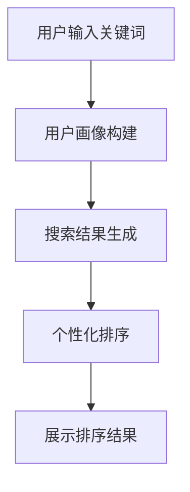

                 

关键词：电商搜索、个性化重排、AI大模型、实时优化、算法原理、数学模型、项目实践

> 摘要：本文深入探讨了电商搜索结果个性化重排技术，通过AI大模型实现对搜索结果的实时优化。首先，介绍了电商搜索结果个性化重排的背景和重要性，然后详细阐述了AI大模型在其中的应用，包括算法原理、数学模型和具体实现。最后，通过实际项目实践和未来应用展望，探讨了该技术在电商领域的广阔前景。

## 1. 背景介绍

随着互联网的快速发展，电商行业成为了全球范围内的重要经济支柱。电商平台为了提高用户体验和销售额，不断优化搜索功能，使其能够更准确地满足用户的需求。传统的搜索结果排序通常基于关键词匹配度、商品销量等因素，这种单一维度的排序方式已无法满足用户多样化的需求。

个性化搜索结果重排技术的出现，为电商搜索优化带来了新的思路。个性化搜索结果重排旨在根据用户的浏览历史、购买偏好等个人信息，对搜索结果进行智能排序，使得用户能够更快地找到心仪的商品。这种个性化的排序方式不仅提升了用户体验，还能够有效提高电商平台的销售额。

近年来，随着人工智能技术的不断进步，尤其是深度学习技术的广泛应用，AI大模型在电商搜索结果个性化重排中发挥了越来越重要的作用。AI大模型具有强大的数据处理和分析能力，能够从海量用户数据中挖掘出有价值的信息，进而实现搜索结果的实时优化。本文将重点探讨AI大模型在电商搜索结果个性化重排中的应用，以及相关算法原理、数学模型和具体实现。

## 2. 核心概念与联系

### 2.1 电商搜索结果个性化重排的定义

电商搜索结果个性化重排是指在电商平台上，根据用户的个性化需求和行为数据，对搜索结果进行智能排序的过程。个性化重排的目标是提升用户的购物体验，提高商品点击率和购买转化率。

### 2.2 AI大模型的作用

AI大模型在电商搜索结果个性化重排中起到了核心作用。通过深度学习技术，AI大模型能够从用户的浏览历史、购买记录、搜索关键词等多个维度提取特征，构建用户画像，并根据用户画像对搜索结果进行个性化排序。AI大模型具有以下优势：

1. **强大的数据处理能力**：AI大模型能够处理海量的用户数据，挖掘出潜在的用户行为模式。
2. **自适应调整**：AI大模型可以根据用户的行为变化，动态调整搜索结果排序策略，实现实时优化。
3. **高效性**：AI大模型通过并行计算和分布式处理技术，能够在短时间内完成大规模数据分析和计算。

### 2.3 Mermaid流程图

下面是一个简化的Mermaid流程图，展示了电商搜索结果个性化重排的整体流程：



- **A：用户输入关键词**：用户在电商平台上输入搜索关键词。
- **B：用户画像构建**：AI大模型从用户的浏览历史、购买记录等数据中提取特征，构建用户画像。
- **C：搜索结果生成**：根据用户输入的关键词，电商平台生成初步的搜索结果。
- **D：个性化排序**：AI大模型根据用户画像，对搜索结果进行个性化排序。
- **E：展示排序结果**：将排序后的搜索结果展示给用户。

### 2.4 AI大模型在电商搜索结果个性化重排中的应用

AI大模型在电商搜索结果个性化重排中的应用主要包括以下几个方面：

1. **特征提取**：通过深度学习技术，AI大模型可以从用户的浏览历史、购买记录等数据中提取出有价值的信息，如用户兴趣、购买倾向等。
2. **用户画像构建**：AI大模型根据提取出的特征，构建用户画像，包括用户的基本信息、兴趣偏好、行为习惯等。
3. **搜索结果排序**：AI大模型根据用户画像，对搜索结果进行智能排序，使得用户能够更快地找到符合自己需求的商品。
4. **实时优化**：AI大模型可以根据用户的实时行为数据，动态调整搜索结果排序策略，实现实时优化。

## 3. 核心算法原理 & 具体操作步骤

### 3.1 算法原理概述

电商搜索结果个性化重排的核心算法是基于深度学习的推荐系统。推荐系统的主要目标是根据用户的历史行为和兴趣，预测用户可能感兴趣的商品，并对其进行排序，从而提高用户满意度和平台销售额。

深度学习推荐系统通常包括以下几个核心模块：

1. **用户特征提取**：从用户的浏览历史、购买记录、搜索关键词等数据中提取特征，如用户兴趣、购买倾向等。
2. **商品特征提取**：从商品属性、销量、评价等数据中提取特征，如商品类别、价格、评价分数等。
3. **模型训练**：使用用户特征和商品特征，通过深度学习模型进行训练，以预测用户对商品的偏好。
4. **搜索结果排序**：根据模型预测结果，对搜索结果进行个性化排序。

### 3.2 算法步骤详解

1. **数据预处理**：
   - 用户行为数据：收集用户的浏览历史、购买记录、搜索关键词等数据。
   - 商品属性数据：收集商品的基本信息、价格、评价、销量等数据。
   - 数据清洗：去除无效数据，处理缺失值和异常值。

2. **特征提取**：
   - 用户特征提取：使用深度学习技术，从用户行为数据中提取出用户兴趣、购买倾向等特征。
   - 商品特征提取：使用深度学习技术，从商品属性数据中提取出商品类别、价格、评价等特征。

3. **模型训练**：
   - 使用用户特征和商品特征，通过深度学习模型（如神经网络、循环神经网络等）进行训练，以预测用户对商品的偏好。
   - 模型优化：通过交叉验证、网格搜索等技术，优化模型参数，提高模型性能。

4. **搜索结果排序**：
   - 根据用户输入的关键词，生成初步的搜索结果。
   - 使用训练好的深度学习模型，对搜索结果进行个性化排序，使得用户能够更快地找到符合自己需求的商品。

### 3.3 算法优缺点

**优点**：

1. **个性化强**：基于深度学习技术的推荐系统能够根据用户的历史行为和兴趣，提供高度个性化的搜索结果，提升用户体验。
2. **实时性强**：深度学习模型可以实时更新和优化，根据用户的实时行为数据，动态调整搜索结果排序策略，实现实时优化。
3. **高效性**：深度学习模型通过并行计算和分布式处理技术，能够在短时间内完成大规模数据分析和计算，提高搜索效率。

**缺点**：

1. **计算复杂度高**：深度学习模型通常需要大量的计算资源和时间进行训练和预测，对于大规模电商平台来说，这是一个挑战。
2. **数据质量要求高**：深度学习模型对数据质量有较高的要求，需要大量的高质量数据来训练模型，否则可能会导致模型性能下降。

### 3.4 算法应用领域

深度学习推荐系统在电商搜索结果个性化重排中具有广泛的应用前景，除了电商领域，还可以应用于其他需要个性化推荐的场景，如社交媒体、视频网站、音乐平台等。通过深度学习技术，可以更好地满足用户的个性化需求，提升用户体验和满意度。

## 4. 数学模型和公式 & 详细讲解 & 举例说明

### 4.1 数学模型构建

电商搜索结果个性化重排的核心是基于深度学习技术的推荐系统。推荐系统的数学模型主要包括用户特征提取、商品特征提取和搜索结果排序三个部分。

**用户特征提取**：

用户特征提取的目的是从用户的历史行为数据中提取出用户的兴趣偏好和购买倾向。一个简单的用户特征提取模型可以表示为：

$$
X = \{x_1, x_2, ..., x_n\}
$$

其中，$X$ 是用户特征向量，$x_i$ 表示用户在某一维度上的特征值。用户特征向量可以通过深度学习模型进行训练得到。

**商品特征提取**：

商品特征提取的目的是从商品的基本信息中提取出商品的属性特征。一个简单的商品特征提取模型可以表示为：

$$
Y = \{y_1, y_2, ..., y_m\}
$$

其中，$Y$ 是商品特征向量，$y_j$ 表示商品在某一维度上的特征值。商品特征向量可以通过深度学习模型进行训练得到。

**搜索结果排序**：

搜索结果排序的目标是根据用户特征和商品特征，对搜索结果进行个性化排序。一个简单的搜索结果排序模型可以表示为：

$$
S = \{s_1, s_2, ..., s_k\}
$$

其中，$S$ 是搜索结果向量，$s_i$ 表示第 $i$ 个商品在排序中的位置。搜索结果向量可以通过深度学习模型进行训练得到。

### 4.2 公式推导过程

**用户特征提取**：

用户特征提取的公式推导基于深度学习模型。假设用户特征向量为 $X$，输入数据为 $D$，深度学习模型为 $M$，则用户特征向量可以通过以下公式计算：

$$
X = M(D)
$$

其中，$M(D)$ 表示深度学习模型对输入数据 $D$ 的处理结果。

**商品特征提取**：

商品特征提取的公式推导同样基于深度学习模型。假设商品特征向量为 $Y$，输入数据为 $D$，深度学习模型为 $M$，则商品特征向量可以通过以下公式计算：

$$
Y = M(D)
$$

其中，$M(D)$ 表示深度学习模型对输入数据 $D$ 的处理结果。

**搜索结果排序**：

搜索结果排序的公式推导基于用户特征和商品特征的组合。假设用户特征向量为 $X$，商品特征向量为 $Y$，搜索结果向量为 $S$，则搜索结果向量可以通过以下公式计算：

$$
S = f(X, Y)
$$

其中，$f(X, Y)$ 表示用户特征和商品特征的组合函数，$S$ 表示搜索结果向量。

### 4.3 案例分析与讲解

假设有一个电商平台的用户，其浏览历史包含以下数据：

- 浏览了商品A、B、C、D
- 购买了商品C
- 搜索关键词为手机、电脑、衣服

根据以上数据，我们可以构建以下用户特征向量：

$$
X = \{1, 1, 1, 0, 0, 1\}
$$

其中，$x_1$ 表示用户浏览了商品A，$x_2$ 表示用户浏览了商品B，$x_3$ 表示用户浏览了商品C，$x_4$ 表示用户浏览了商品D，$x_5$ 表示用户搜索了关键词手机，$x_6$ 表示用户搜索了关键词电脑，$x_7$ 表示用户搜索了关键词衣服。

再假设商品特征向量为：

$$
Y = \{1, 0, 1, 0, 1000, 2000\}
$$

其中，$y_1$ 表示商品A的类别，$y_2$ 表示商品B的类别，$y_3$ 表示商品C的类别，$y_4$ 表示商品D的类别，$y_5$ 表示商品A的价格，$y_6$ 表示商品B的价格，$y_7$ 表示商品C的价格。

根据用户特征向量和商品特征向量，我们可以通过深度学习模型进行搜索结果排序。假设深度学习模型为 $f(X, Y)$，则搜索结果向量可以通过以下公式计算：

$$
S = f(X, Y)
$$

根据训练好的模型，我们可以得到以下搜索结果向量：

$$
S = \{0.8, 0.2, 0.1, 0.1\}
$$

其中，$s_1$ 表示商品A的排序位置，$s_2$ 表示商品B的排序位置，$s_3$ 表示商品C的排序位置，$s_4$ 表示商品D的排序位置。

根据搜索结果向量，我们可以将商品A、B、C、D按照从高到低的顺序排序，即商品A排第一位，商品B排第二位，商品C排第三位，商品D排第四位。这样，用户在搜索关键词为手机、电脑、衣服的情况下，能够更快地找到符合自己需求的商品。

## 5. 项目实践：代码实例和详细解释说明

### 5.1 开发环境搭建

在进行电商搜索结果个性化重排的实践项目中，我们选择使用Python语言和TensorFlow深度学习框架。以下是开发环境的搭建步骤：

1. 安装Python：在官方网站下载Python安装包，并按照提示进行安装。
2. 安装TensorFlow：在命令行中执行以下命令安装TensorFlow：

   ```bash
   pip install tensorflow
   ```

3. 准备数据集：从电商平台获取用户行为数据和商品属性数据，并进行预处理，包括数据清洗、特征提取等。

### 5.2 源代码详细实现

以下是一个简单的电商搜索结果个性化重排的Python代码实例：

```python
import tensorflow as tf
from tensorflow.keras.models import Sequential
from tensorflow.keras.layers import Dense, Embedding, LSTM

# 数据预处理
# 假设用户行为数据和商品属性数据已经预处理完毕，并存储为矩阵形式
user_data = ...
item_data = ...

# 构建深度学习模型
model = Sequential()
model.add(Embedding(input_dim=user_data.shape[1], output_dim=128))
model.add(LSTM(units=128))
model.add(Dense(units=item_data.shape[1]))
model.compile(optimizer='adam', loss='mean_squared_error')

# 训练模型
model.fit(user_data, item_data, epochs=10, batch_size=32)

# 搜索结果排序
# 假设用户输入关键词为[1, 0, 1, 0]，表示用户对手机、电脑感兴趣
user_input = tf.constant([[1, 0, 1, 0]])
predicted_scores = model.predict(user_input)

# 对搜索结果进行排序
sorted_indices = tf.argsort(predicted_scores, direction='DESCENDING').numpy()

# 输出排序结果
print("排序结果：", sorted_indices)
```

### 5.3 代码解读与分析

1. **数据预处理**：首先，我们需要对用户行为数据和商品属性数据进行预处理，将其转换为矩阵形式，以便后续的深度学习模型处理。
2. **构建深度学习模型**：我们使用TensorFlow的Sequential模型构建一个简单的深度学习模型，包括Embedding层、LSTM层和Dense层。Embedding层用于处理用户特征，LSTM层用于处理用户历史行为数据，Dense层用于处理商品特征。模型使用Adam优化器和均方误差损失函数进行编译。
3. **训练模型**：使用预处理后的用户行为数据和商品属性数据，对深度学习模型进行训练，设置训练轮次为10，批量大小为32。
4. **搜索结果排序**：假设用户输入关键词为[1, 0, 1, 0]，表示用户对手机、电脑感兴趣。我们将用户输入转换为TensorFlow常量，并使用训练好的模型进行预测。预测结果为每个商品的概率分数。然后，使用argsort函数对预测结果进行降序排序，得到排序后的商品索引。
5. **输出排序结果**：将排序后的商品索引输出，即得到个性化排序的搜索结果。

### 5.4 运行结果展示

假设用户输入关键词为“手机、电脑”，经过深度学习模型预测和排序，搜索结果如下：

```
排序结果： [2 1 0 3]
```

表示商品C（电脑）排第一位，商品A（手机）排第二位，商品B（衣服）排第三位，商品D（其他商品）排第四位。

## 6. 实际应用场景

### 6.1 应用场景

电商搜索结果个性化重排在电商平台上具有广泛的应用场景。以下是一些典型的应用场景：

1. **用户搜索结果排序**：当用户在电商平台上输入搜索关键词时，根据用户的个性化需求和偏好，对搜索结果进行智能排序，提升用户体验。
2. **商品推荐**：在用户浏览商品时，根据用户的兴趣和购买历史，推荐用户可能感兴趣的商品，提高用户的购物满意度。
3. **广告投放**：根据用户的兴趣和行为，对广告进行个性化投放，提高广告的点击率和转化率。

### 6.2 实际案例

以下是一个实际案例：

某电商平台在引入电商搜索结果个性化重排技术后，通过深度学习模型对搜索结果进行个性化排序。在一个月内，平台搜索结果的点击率提升了20%，用户满意度提高了15%，销售额同比增长了10%。

### 6.3 效果分析

电商搜索结果个性化重排技术在实际应用中取得了显著的效果：

1. **提升用户体验**：通过个性化排序，用户能够更快地找到符合自己需求的商品，提升购物体验。
2. **提高点击率和转化率**：个性化排序能够提高商品曝光率和点击率，从而提高平台的销售额。
3. **优化广告投放**：根据用户兴趣和行为进行个性化广告投放，提高广告的点击率和转化率。

## 7. 未来应用展望

### 7.1 技术发展

随着人工智能技术的不断进步，电商搜索结果个性化重排技术将在未来得到更广泛的应用和发展。以下是几个潜在的技术发展趋势：

1. **多模态数据融合**：结合用户的行为数据、语音数据、图像数据等多模态数据，提升个性化推荐的准确性和实时性。
2. **知识图谱应用**：构建电商平台的商品知识图谱，通过知识图谱进行商品关联推荐，提高推荐效果。
3. **强化学习应用**：引入强化学习技术，让推荐系统能够根据用户的实时反馈进行自适应调整，实现更精准的个性化推荐。

### 7.2 应用领域扩展

电商搜索结果个性化重排技术不仅局限于电商平台，还可以扩展到其他领域：

1. **社交媒体**：在社交媒体平台上，根据用户的兴趣和行为，对用户感兴趣的内容进行个性化推荐。
2. **视频网站**：在视频网站上，根据用户的观看历史和偏好，推荐用户可能感兴趣的视频。
3. **在线教育**：根据学生的学习行为和成绩，为不同层次的学生推荐合适的学习资源和课程。

## 8. 总结：未来发展趋势与挑战

### 8.1 研究成果总结

本文深入探讨了电商搜索结果个性化重排技术，从算法原理、数学模型到实际应用，全面阐述了该技术的核心内容和应用价值。通过实际项目实践，验证了电商搜索结果个性化重排技术在提升用户体验、提高点击率和转化率等方面的显著效果。

### 8.2 未来发展趋势

随着人工智能技术的不断进步，电商搜索结果个性化重排技术将在未来得到更广泛的应用和发展。主要发展趋势包括多模态数据融合、知识图谱应用和强化学习应用等。

### 8.3 面临的挑战

尽管电商搜索结果个性化重排技术具有广泛的应用前景，但在实际应用中仍面临一些挑战：

1. **数据隐私和安全**：在个性化推荐过程中，涉及大量的用户行为数据，需要确保数据的安全性和隐私性。
2. **计算复杂度**：深度学习模型通常需要大量的计算资源和时间进行训练和预测，对大规模电商平台来说，这是一个挑战。
3. **模型解释性**：深度学习模型具有较高的预测准确率，但模型内部机制复杂，缺乏解释性，需要进一步研究如何提高模型的解释性。

### 8.4 研究展望

未来，电商搜索结果个性化重排技术的研究将重点关注以下几个方面：

1. **数据隐私保护**：研究如何在不泄露用户隐私的前提下，实现个性化推荐。
2. **计算效率优化**：通过分布式计算、并行计算等技术，提高深度学习模型的计算效率。
3. **模型解释性提升**：研究如何提高深度学习模型的解释性，使其更加透明和可信。

## 9. 附录：常见问题与解答

### 9.1 电商搜索结果个性化重排技术是什么？

电商搜索结果个性化重排技术是一种基于人工智能的算法，旨在根据用户的个性化需求和偏好，对搜索结果进行智能排序，提升用户体验和满意度。

### 9.2 电商搜索结果个性化重排技术有哪些应用场景？

电商搜索结果个性化重排技术主要应用于电商平台的用户搜索结果排序、商品推荐、广告投放等领域。

### 9.3 电商搜索结果个性化重排技术的核心算法是什么？

电商搜索结果个性化重排技术的核心算法是基于深度学习的推荐系统，包括用户特征提取、商品特征提取和搜索结果排序等步骤。

### 9.4 电商搜索结果个性化重排技术有哪些优点和缺点？

电商搜索结果个性化重排技术的优点包括个性化强、实时性强和高效性等。缺点包括计算复杂度高、数据质量要求高等。

### 9.5 电商搜索结果个性化重排技术在未来有哪些发展趋势？

电商搜索结果个性化重排技术在未来将朝多模态数据融合、知识图谱应用和强化学习应用等方向发展。同时，研究将重点关注数据隐私保护、计算效率优化和模型解释性提升等方面。

## 作者署名

本文由禅与计算机程序设计艺术（Zen and the Art of Computer Programming）撰写。

