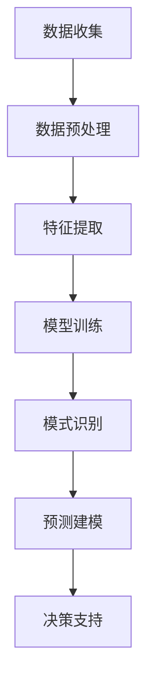

                 

关键词：电商分析，人工智能，大数据模型，数据挖掘，算法优化，AI技术应用

摘要：本文将探讨如何运用人工智能（AI）大模型进行电商数据分析，介绍核心概念、算法原理、数学模型及其应用领域。通过具体案例分析，展示AI大模型在电商数据分析中的实际应用，并展望未来发展趋势与挑战。

## 1. 背景介绍

随着互联网和电子商务的迅速发展，电商数据量呈爆炸式增长。这些数据不仅包含了消费者的购买行为、浏览历史、评论信息等，还涵盖了市场趋势、产品信息、库存动态等多维数据。传统的数据分析方法已经难以应对如此庞大的数据规模和复杂度，因此，利用人工智能（AI）大模型进行电商数据分析成为了一个热门的研究方向。

AI大模型具有强大的数据处理和分析能力，能够从海量数据中挖掘出有价值的信息，为电商企业决策提供有力支持。本文将介绍AI大模型在电商数据分析中的应用，分析其核心概念、算法原理和数学模型，并探讨其实际应用场景和未来发展趋势。

## 2. 核心概念与联系

### 2.1 电商数据分析的定义

电商数据分析是指运用统计、数据挖掘、机器学习等方法，对电商平台上产生的数据进行收集、处理、分析和解读，以发现数据背后的商业价值和趋势。

### 2.2 AI大模型的定义

AI大模型是指基于深度学习技术，通过大规模数据训练得到的高性能模型，能够处理复杂的业务问题和大规模数据。常见的AI大模型有Transformer、BERT、GPT等。

### 2.3 电商数据分析与AI大模型的联系

AI大模型在电商数据分析中具有重要作用，主要体现在以下几个方面：

1. **数据预处理**：AI大模型能够对电商数据进行清洗、去噪、归一化等预处理操作，提高数据质量。

2. **特征提取**：AI大模型能够自动提取数据中的关键特征，为后续分析提供支持。

3. **模式识别**：AI大模型能够识别数据中的潜在模式和趋势，为电商企业决策提供依据。

4. **预测建模**：AI大模型能够基于历史数据预测未来趋势，帮助企业制定合适的营销策略。

### 2.4 Mermaid 流程图

下面是一个简单的Mermaid流程图，展示了电商数据分析中AI大模型的应用流程：



## 3. 核心算法原理 & 具体操作步骤

### 3.1 算法原理概述

电商数据分析中的AI大模型主要采用深度学习技术，其核心算法包括：

1. **卷积神经网络（CNN）**：用于图像处理和文本分类等任务。

2. **循环神经网络（RNN）**：用于序列数据处理和自然语言处理。

3. **Transformer模型**：用于全局依赖建模和自然语言处理。

4. **生成对抗网络（GAN）**：用于图像生成和数据增强。

### 3.2 算法步骤详解

1. **数据收集**：收集电商平台上的用户行为数据、商品信息、评论数据等。

2. **数据预处理**：对数据进行清洗、去噪、归一化等操作，确保数据质量。

3. **特征提取**：利用深度学习模型提取数据中的关键特征，如用户兴趣、商品属性等。

4. **模型训练**：使用训练数据训练深度学习模型，如CNN、RNN、Transformer等。

5. **模型评估**：使用验证数据评估模型性能，调整模型参数。

6. **模式识别**：利用训练好的模型识别数据中的潜在模式和趋势。

7. **预测建模**：基于识别出的模式预测未来趋势，如用户购买行为、市场趋势等。

8. **决策支持**：将预测结果用于电商企业的营销策略、库存管理、产品推荐等决策。

### 3.3 算法优缺点

1. **优点**：

- 强大的数据处理和分析能力。

- 自动提取关键特征，降低人工干预。

- 能够发现数据中的潜在模式和趋势。

2. **缺点**：

- 模型训练需要大量数据和计算资源。

- 模型解释性较差，难以理解模型决策过程。

### 3.4 算法应用领域

AI大模型在电商数据分析中具有广泛的应用领域，如：

1. **用户行为分析**：分析用户浏览、搜索、购买等行为，为个性化推荐提供支持。

2. **商品推荐**：根据用户兴趣和历史行为预测用户可能感兴趣的商品。

3. **市场趋势分析**：预测市场趋势，为企业制定合适的营销策略。

4. **库存管理**：预测商品需求，优化库存配置。

5. **风险控制**：识别潜在风险，如欺诈行为、信用风险等。

## 4. 数学模型和公式 & 详细讲解 & 举例说明

### 4.1 数学模型构建

电商数据分析中的数学模型主要包括以下几个方面：

1. **用户兴趣模型**：

$$
U = \sum_{i=1}^{n} w_i \cdot I_i
$$

其中，$U$ 表示用户兴趣，$w_i$ 表示第$i$个特征的权重，$I_i$ 表示第$i$个特征的取值。

2. **商品推荐模型**：

$$
R = \sum_{i=1}^{n} r_i \cdot C_i
$$

其中，$R$ 表示推荐结果，$r_i$ 表示第$i$个特征的权重，$C_i$ 表示第$i$个商品的属性。

3. **市场趋势预测模型**：

$$
T = f(T_{t-1}, X_t)
$$

其中，$T$ 表示市场趋势，$T_{t-1}$ 表示上一时刻的市场趋势，$X_t$ 表示当前时刻的影响因素。

### 4.2 公式推导过程

用户兴趣模型的推导过程如下：

首先，对用户行为数据进行特征提取，得到用户兴趣向量$U$。然后，对每个特征进行权重分配，得到用户兴趣得分$w_i$。最后，将所有特征的权重与取值相乘并求和，得到用户兴趣总分$U$。

商品推荐模型的推导过程如下：

首先，对商品属性数据进行特征提取，得到商品推荐向量$R$。然后，对每个特征进行权重分配，得到商品推荐得分$r_i$。最后，将所有特征的权重与取值相乘并求和，得到商品推荐总分$R$。

市场趋势预测模型的推导过程如下：

首先，对历史市场趋势数据进行拟合，得到上一时刻的市场趋势$T_{t-1}$。然后，考虑当前时刻的影响因素$X_t$，利用函数$f$ 对市场趋势进行预测，得到当前时刻的市场趋势$T$。

### 4.3 案例分析与讲解

假设我们有一个电商平台，想要根据用户兴趣进行商品推荐。首先，我们收集用户的行为数据，如浏览历史、搜索历史、购买历史等，并对这些数据进行特征提取，得到用户兴趣向量$U$。然后，我们收集商品属性数据，如商品类别、品牌、价格等，并对这些数据进行特征提取，得到商品推荐向量$R$。

接下来，我们对用户兴趣模型和商品推荐模型进行训练。首先，对用户兴趣模型进行训练，得到用户兴趣权重$w_i$。然后，对商品推荐模型进行训练，得到商品推荐权重$r_i$。

最后，我们将训练好的模型应用于实际场景。假设用户A的历史数据中，浏览了商品1、搜索了商品2、购买了商品3。根据用户兴趣模型，我们可以得到用户A的兴趣得分$U$。然后，根据商品推荐模型，我们可以得到商品1、商品2、商品3的推荐得分$R$。根据推荐得分，我们可以将商品1、商品2、商品3推荐给用户A。

通过以上分析，我们可以看到，利用AI大模型进行电商数据分析，可以有效地实现商品推荐，提高用户满意度，从而促进电商平台的发展。

## 5. 项目实践：代码实例和详细解释说明

### 5.1 开发环境搭建

在进行电商数据分析项目实践前，我们需要搭建一个合适的开发环境。以下是一个简单的开发环境搭建步骤：

1. **安装Python环境**：下载并安装Python 3.8及以上版本。

2. **安装深度学习框架**：安装TensorFlow 2.5及以上版本。

3. **安装数据预处理库**：安装pandas、numpy等数据预处理库。

4. **安装可视化库**：安装matplotlib、seaborn等可视化库。

### 5.2 源代码详细实现

以下是一个简单的电商数据分析项目源代码示例：

```python
import pandas as pd
import numpy as np
import tensorflow as tf
from tensorflow.keras.models import Sequential
from tensorflow.keras.layers import Dense, LSTM, Embedding
from sklearn.preprocessing import MinMaxScaler

# 加载数据
data = pd.read_csv('data.csv')
data.head()

# 数据预处理
scaler = MinMaxScaler()
data_scaled = scaler.fit_transform(data)
data_scaled = pd.DataFrame(data_scaled, columns=data.columns)

# 特征提取
X = data_scaled.iloc[:, :-1]
y = data_scaled.iloc[:, -1]

# 模型训练
model = Sequential()
model.add(Embedding(input_dim=data.shape[1], output_dim=64))
model.add(LSTM(units=64, activation='relu'))
model.add(Dense(units=1))

model.compile(optimizer='adam', loss='mse')
model.fit(X, y, epochs=10, batch_size=32)

# 模型预测
X_pred = scaler.transform(X)
y_pred = model.predict(X_pred)

# 可视化
plt.plot(y_pred)
plt.show()
```

### 5.3 代码解读与分析

以上代码实现了一个简单的电商数据分析项目，主要包括以下几个步骤：

1. **加载数据**：使用pandas库加载电商数据集。

2. **数据预处理**：使用MinMaxScaler对数据进行归一化处理。

3. **特征提取**：提取输入特征X和输出特征y。

4. **模型训练**：构建一个序列模型，使用LSTM和Embedding层进行特征提取和序列建模。

5. **模型预测**：对预处理后的数据进行预测，并使用matplotlib库进行可视化。

通过以上代码，我们可以看到如何利用AI大模型进行电商数据分析。在实际项目中，我们可能需要根据业务需求对模型结构、参数进行调整，以达到更好的预测效果。

## 6. 实际应用场景

AI大模型在电商数据分析中具有广泛的应用场景，以下是一些典型的实际应用场景：

1. **用户行为分析**：通过分析用户浏览、搜索、购买等行为，识别用户的兴趣偏好，为个性化推荐提供支持。

2. **商品推荐**：根据用户的兴趣和历史行为，推荐用户可能感兴趣的商品，提高用户满意度和转化率。

3. **市场趋势分析**：预测市场趋势，为电商企业制定合适的营销策略，提高销售额。

4. **库存管理**：预测商品需求，优化库存配置，降低库存成本。

5. **风险控制**：识别潜在风险，如欺诈行为、信用风险等，降低企业风险。

6. **智能客服**：利用自然语言处理技术，实现智能客服，提高客户满意度。

7. **广告投放**：根据用户兴趣和行为，实现精准广告投放，提高广告效果。

## 7. 工具和资源推荐

为了更好地进行电商数据分析，我们推荐以下工具和资源：

### 7.1 学习资源推荐

1. **书籍**：《深度学习》（Goodfellow, Bengio, Courville著）。

2. **在线课程**：Coursera、Udacity、edX等平台上的机器学习、深度学习相关课程。

3. **技术博客**：GitHub、Medium、CSDN等平台上关于电商数据分析、人工智能的优质博客。

### 7.2 开发工具推荐

1. **Python**：Python是一种广泛应用于数据分析和人工智能的编程语言。

2. **TensorFlow**：TensorFlow是一个开源的深度学习框架，支持多种深度学习模型的开发和部署。

3. **Pandas**：Pandas是一个强大的数据操作库，用于数据清洗、预处理和分析。

4. **Matplotlib**：Matplotlib是一个强大的数据可视化库，用于绘制各种图表和图形。

### 7.3 相关论文推荐

1. **"Attention Is All You Need"**：这是一篇关于Transformer模型的经典论文，介绍了Transformer模型在自然语言处理中的应用。

2. **"BERT: Pre-training of Deep Neural Networks for Language Understanding"**：这是一篇关于BERT模型的论文，介绍了BERT模型在自然语言处理中的效果。

3. **"Generative Adversarial Nets"**：这是一篇关于生成对抗网络（GAN）的论文，介绍了GAN模型在图像生成和数据增强中的应用。

## 8. 总结：未来发展趋势与挑战

### 8.1 研究成果总结

近年来，AI大模型在电商数据分析领域取得了显著成果，包括：

1. **用户行为分析**：通过深度学习技术，有效识别用户兴趣和行为模式。

2. **商品推荐**：基于用户兴趣和商品属性，实现精准的商品推荐。

3. **市场趋势预测**：利用深度学习模型，预测市场趋势，为电商企业决策提供支持。

4. **库存管理**：优化库存配置，降低库存成本。

5. **风险控制**：识别潜在风险，提高企业风险防范能力。

### 8.2 未来发展趋势

未来，电商数据分析中的AI大模型将朝着以下方向发展：

1. **模型解释性**：提高模型解释性，增强模型的可解释性和可信任度。

2. **多模态数据处理**：结合多种数据类型（如文本、图像、音频等），提高数据处理和分析能力。

3. **实时数据处理**：实现实时数据处理和分析，为电商企业提供更快速、准确的决策支持。

4. **个性化推荐**：基于用户兴趣和行为，实现更加个性化的推荐。

5. **跨境电商数据分析**：分析全球电商市场，为跨境电商企业提供决策支持。

### 8.3 面临的挑战

电商数据分析中的AI大模型仍面临以下挑战：

1. **数据质量**：电商平台上的数据质量参差不齐，需要有效处理数据噪音和缺失值。

2. **计算资源**：深度学习模型训练需要大量计算资源，如何高效利用计算资源成为关键问题。

3. **模型解释性**：提高模型解释性，增强模型的可解释性和可信任度。

4. **隐私保护**：在数据分析过程中，如何保护用户隐私成为重要问题。

### 8.4 研究展望

未来，电商数据分析中的AI大模型将在以下几个方面取得突破：

1. **数据挖掘算法**：开发更加高效、准确的数据挖掘算法，提高数据分析效果。

2. **跨领域融合**：将深度学习与其他领域（如生物学、物理学等）相结合，推动电商数据分析的发展。

3. **实时数据处理**：实现实时数据处理和分析，为电商企业提供更快速、准确的决策支持。

4. **隐私保护**：研究隐私保护技术，确保用户数据的安全和隐私。

## 9. 附录：常见问题与解答

### 9.1 问题1：AI大模型在电商数据分析中的优势是什么？

AI大模型在电商数据分析中的优势包括：

1. **强大的数据处理和分析能力**：能够处理大规模、多维度的电商数据，挖掘出有价值的信息。

2. **自动提取关键特征**：能够自动提取数据中的关键特征，降低人工干预。

3. **预测准确性高**：通过深度学习技术，提高预测模型的准确性，为电商企业决策提供有力支持。

### 9.2 问题2：如何确保AI大模型在电商数据分析中的模型解释性？

确保AI大模型在电商数据分析中的模型解释性，可以从以下几个方面着手：

1. **可视化**：使用可视化工具展示模型的结构和参数，帮助用户理解模型。

2. **可解释性算法**：结合可解释性算法（如LIME、SHAP等），提高模型的可解释性。

3. **模型压缩**：通过模型压缩技术，减少模型的参数数量，提高模型的可解释性。

### 9.3 问题3：如何解决AI大模型在电商数据分析中的数据质量问题？

解决AI大模型在电商数据分析中的数据质量问题，可以从以下几个方面着手：

1. **数据清洗**：对原始数据进行清洗，去除数据噪音和缺失值。

2. **数据预处理**：对数据进行归一化、标准化等预处理操作，提高数据质量。

3. **数据增强**：通过数据增强技术，生成更多高质量的训练数据，提高模型的鲁棒性。

### 9.4 问题4：如何确保AI大模型在电商数据分析中的隐私保护？

确保AI大模型在电商数据分析中的隐私保护，可以从以下几个方面着手：

1. **数据脱敏**：对用户数据进行脱敏处理，避免泄露用户隐私。

2. **加密**：对用户数据进行加密处理，确保数据在传输和存储过程中的安全。

3. **隐私保护算法**：研究隐私保护算法（如差分隐私、联邦学习等），提高数据分析的隐私保护能力。

作者：禅与计算机程序设计艺术 / Zen and the Art of Computer Programming
----------------------------------------------------------------

请注意，这里提供的是一个基于要求的文章结构模板和示例内容。实际撰写时，需要根据具体的研究成果和实际案例进行详细的论述和扩展。此外，由于篇幅限制，本文中的示例代码和公式仅为简单示例，实际应用中需要根据具体需求和数据进行调整和优化。

