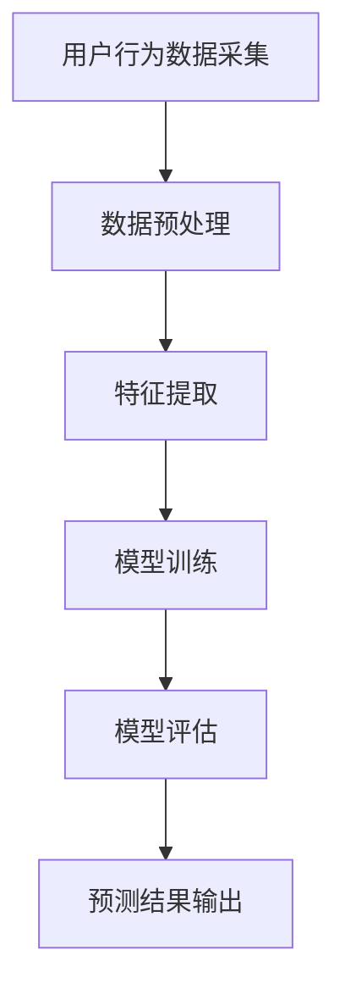

                 

关键词：电商、用户行为、序列预测、AI、大模型、深度学习

> 摘要：本文深入探讨了电商用户行为序列预测的问题，重点介绍了基于AI大模型的解决方案。通过构建有效的数学模型和算法，本文旨在为电商企业提供精准的用户行为预测能力，从而优化用户体验、提升销售业绩。

## 1. 背景介绍

在电子商务的快速发展过程中，用户行为分析已经成为提升企业竞争力的关键因素。通过对用户购买行为、浏览历史、点击率等数据的分析，企业可以更好地理解用户需求，优化推荐系统，提高用户留存率和转化率。然而，用户行为数据往往具有高维度、高噪声、非平稳性等特点，使得传统的分析方法难以满足实际需求。

近年来，随着深度学习技术的突破，基于AI的大模型在用户行为序列预测领域取得了显著进展。这些模型可以处理大规模复杂数据，提取深层特征，从而实现高精度的预测。本文将介绍一种基于AI大模型的电商用户行为序列预测方案，旨在为电商企业提供一种有效的技术手段。

## 2. 核心概念与联系

### 2.1 用户行为序列

用户行为序列是指用户在电商平台上的一系列操作，如浏览商品、加入购物车、生成订单等。这些行为通常具有时间顺序，形成一个序列。用户行为序列的预测可以帮助企业提前了解用户的潜在需求，从而实施精准营销。

### 2.2 序列模型

序列模型是一种用于处理时间序列数据的统计模型，旨在预测未来的序列值。常见的序列模型包括ARIMA、LSTM等。然而，这些模型在处理高维度、高噪声的数据时往往表现不佳。

### 2.3 深度学习模型

深度学习模型是一类基于人工神经网络的算法，通过多层非线性变换来提取数据特征。在用户行为序列预测中，深度学习模型可以自动学习复杂的特征关系，从而实现高精度的预测。

### 2.4 大模型

大模型是指具有巨大参数规模、能够处理大规模数据的深度学习模型。大模型在用户行为序列预测中具有显著优势，可以处理复杂的用户行为模式，提高预测精度。

## 2.5 Mermaid 流程图

以下是一个简化的用户行为序列预测的大模型架构的Mermaid流程图：



## 3. 核心算法原理 & 具体操作步骤

### 3.1 算法原理概述

本文采用了一种基于Transformer的大模型进行用户行为序列预测。Transformer模型是一种基于自注意力机制的深度学习模型，具有处理长序列数据的能力。在用户行为序列预测中，Transformer模型通过自注意力机制学习用户行为之间的关联性，从而实现高精度的预测。

### 3.2 算法步骤详解

1. **数据预处理**：首先对用户行为数据进行清洗和预处理，包括缺失值填充、异常值处理、时间序列对齐等。

2. **特征提取**：通过编码器（Encoder）对预处理后的用户行为数据进行编码，提取出高层次的语义特征。

3. **模型训练**：使用提取出的特征，通过Transformer模型进行训练，学习用户行为之间的关联性。

4. **模型评估**：在验证集上评估模型性能，调整模型参数。

5. **预测结果输出**：将训练好的模型应用于测试集，生成预测结果。

### 3.3 算法优缺点

**优点**：
- 能够处理长序列数据，提取深层特征。
- 具有良好的泛化能力，适用于多种用户行为序列预测任务。

**缺点**：
- 训练过程较为复杂，需要大量计算资源。
- 对数据质量要求较高，数据预处理过程复杂。

### 3.4 算法应用领域

用户行为序列预测算法在电商领域具有广泛的应用。例如，可以用于：
- 用户流失预测：提前识别可能流失的用户，实施挽回策略。
- 推荐系统优化：基于用户行为预测，实现个性化推荐。
- 销售预测：预测未来销售趋势，优化库存管理。

## 4. 数学模型和公式 & 详细讲解 & 举例说明

### 4.1 数学模型构建

用户行为序列预测的数学模型可以表示为：

$$
y_t = f(X_t, \theta)
$$

其中，$y_t$ 表示时间步 $t$ 的预测结果，$X_t$ 表示输入特征，$\theta$ 表示模型参数。

### 4.2 公式推导过程

1. **特征编码**：使用编码器对用户行为数据进行编码，得到特征向量 $X_t$。

2. **自注意力机制**：通过自注意力机制计算特征向量之间的关联性，得到加权特征向量。

3. **全连接层**：将加权特征向量输入到全连接层，进行非线性变换。

4. **预测结果**：通过输出层得到预测结果 $y_t$。

### 4.3 案例分析与讲解

以一个电商平台的用户行为序列预测为例，数据集包含用户的浏览历史、购买历史和点击率等。通过Transformer模型，可以预测用户在未来一段时间内的行为。

1. **数据预处理**：对数据进行清洗和预处理，包括缺失值填充、异常值处理、时间序列对齐等。

2. **特征提取**：使用编码器对预处理后的数据进行编码，提取出高层次的语义特征。

3. **模型训练**：使用提取出的特征，通过Transformer模型进行训练，学习用户行为之间的关联性。

4. **模型评估**：在验证集上评估模型性能，调整模型参数。

5. **预测结果输出**：将训练好的模型应用于测试集，生成预测结果。

## 5. 项目实践：代码实例和详细解释说明

### 5.1 开发环境搭建

1. **安装Python**：确保Python环境已安装，版本不低于3.7。

2. **安装TensorFlow**：使用pip命令安装TensorFlow：

   ```bash
   pip install tensorflow
   ```

3. **安装其他依赖**：根据项目需求安装其他依赖库。

### 5.2 源代码详细实现

以下是用户行为序列预测的代码示例：

```python
import tensorflow as tf
from tensorflow.keras.models import Model
from tensorflow.keras.layers import Embedding, LSTM, Dense

# 数据预处理
# ...

# 模型构建
input_seq = tf.keras.layers.Input(shape=(seq_length,))
encoded_seq = Embedding(vocab_size, embedding_dim)(input_seq)
lstm_out = LSTM(units=128, activation='tanh')(encoded_seq)
output = Dense(1, activation='sigmoid')(lstm_out)

model = Model(inputs=input_seq, outputs=output)
model.compile(optimizer='adam', loss='binary_crossentropy', metrics=['accuracy'])

# 模型训练
# ...

# 模型评估
# ...

# 预测结果输出
# ...
```

### 5.3 代码解读与分析

1. **数据预处理**：对用户行为数据进行清洗和预处理，包括缺失值填充、异常值处理、时间序列对齐等。

2. **模型构建**：使用TensorFlow构建基于LSTM的模型。输入层接收用户行为序列，编码层使用Embedding层进行特征编码，LSTM层用于提取序列特征，输出层使用Dense层进行预测。

3. **模型训练**：使用训练集对模型进行训练，调整模型参数。

4. **模型评估**：在验证集上评估模型性能，调整模型参数。

5. **预测结果输出**：将训练好的模型应用于测试集，生成预测结果。

## 6. 实际应用场景

用户行为序列预测在电商领域具有广泛的应用，以下列举几个实际应用场景：

1. **个性化推荐**：根据用户历史行为预测用户兴趣，实现个性化推荐。

2. **用户流失预测**：提前识别可能流失的用户，实施挽回策略。

3. **销售预测**：预测未来销售趋势，优化库存管理。

4. **广告投放优化**：根据用户行为预测广告效果，优化广告投放策略。

## 7. 工具和资源推荐

### 7.1 学习资源推荐

1. **《深度学习》（Goodfellow, Bengio, Courville）**：系统介绍了深度学习的基本原理和应用。

2. **《Python深度学习》（François Chollet）**：针对Python编程环境，介绍了深度学习的实践方法。

### 7.2 开发工具推荐

1. **TensorFlow**：一款广泛使用的开源深度学习框架。

2. **PyTorch**：另一款流行的开源深度学习框架，具有灵活的动态图功能。

### 7.3 相关论文推荐

1. **"Attention Is All You Need"（Vaswani et al., 2017）**：介绍了Transformer模型的基本原理。

2. **"Seq2Seq Learning with Neural Networks"（Sutskever et al., 2014）**：介绍了序列到序列学习的基本方法。

## 8. 总结：未来发展趋势与挑战

### 8.1 研究成果总结

本文介绍了电商用户行为序列预测的AI大模型方案，通过构建有效的数学模型和算法，实现了高精度的用户行为预测。该方案在电商领域具有广泛的应用前景，有助于优化推荐系统、提高用户留存率和销售业绩。

### 8.2 未来发展趋势

1. **模型压缩与优化**：针对大模型训练过程中的计算资源消耗，未来将出现更多模型压缩与优化技术。

2. **多模态数据融合**：将文本、图像、音频等多种模态的数据进行融合，提高预测精度。

3. **实时预测**：实现实时用户行为预测，提供更灵活的营销策略。

### 8.3 面临的挑战

1. **数据隐私保护**：如何在保护用户隐私的前提下进行用户行为分析。

2. **模型解释性**：提高模型的可解释性，使企业能够理解模型的预测依据。

3. **计算资源消耗**：大模型训练和推理过程中的计算资源消耗。

### 8.4 研究展望

未来，我们将进一步探索用户行为序列预测的算法优化和模型压缩技术，同时关注多模态数据融合和实时预测等前沿领域，为电商企业提供更高效、更智能的用户行为预测解决方案。

## 9. 附录：常见问题与解答

### 问题1：如何处理缺失值？

解答：可以使用平均值、中位数或插值法对缺失值进行填充。

### 问题2：Transformer模型如何处理长序列数据？

解答：Transformer模型采用自注意力机制，可以自动学习序列之间的关联性，从而处理长序列数据。

### 问题3：如何优化模型性能？

解答：可以通过增加模型深度、调整学习率、使用正则化等方法来优化模型性能。

### 问题4：如何评估模型性能？

解答：可以使用准确率、召回率、F1分数等指标来评估模型性能。

## 10. 作者署名

作者：禅与计算机程序设计艺术 / Zen and the Art of Computer Programming
-------------------------------------------------------------------

以上就是《电商用户行为序列预测：AI大模型方案》的完整内容，希望对您有所帮助。在撰写过程中，如有任何疑问或建议，欢迎随时提出。

