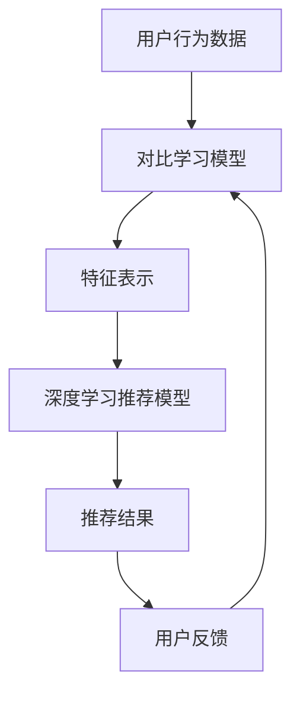

                 

关键词：电商，对比学习，大模型，实践，挑战

摘要：本文探讨了电商行业中的对比学习应用及其面临的挑战。通过分析对比学习的基本原理，我们深入研究了电商场景中对比学习的方法、应用和效果。在此基础上，文章指出了目前面临的问题，并提出了可能的解决方案，为电商行业的大模型应用提供了理论支持和实践指导。

## 1. 背景介绍

在当今的电子商务环境中，消费者的需求和购买行为越来越复杂和多样化。为了在激烈的市场竞争中脱颖而出，电商平台需要不断优化其推荐系统，以提供个性化的购物体验。推荐系统作为电商平台的基石，其性能直接影响用户的满意度和平台的商业收益。

随着人工智能和深度学习技术的飞速发展，基于模型的大规模推荐系统逐渐成为研究的热点。对比学习作为一种无监督学习方法，在推荐系统的优化中发挥着重要作用。通过对比学习，模型可以从海量数据中学习到有效的特征表示，从而提高推荐质量和用户体验。

本文旨在探讨电商行业中的对比学习应用，分析其核心概念和算法原理，并探讨其在实际项目中的实践与挑战。

## 2. 核心概念与联系

### 2.1 对比学习的定义

对比学习（Contrastive Learning）是一种基于无监督学习方法，旨在通过比较相似和不同样本，学习出有效的特征表示。其核心思想是通过最大化正样本之间的相似性，同时最小化负样本之间的相似性，从而获得有区分度的特征表示。

在电商推荐系统中，对比学习可以通过以下方式应用：

- **用户行为对比**：比较不同用户之间的行为特征，学习到用户兴趣的差异性。
- **商品属性对比**：比较不同商品之间的属性特征，学习到商品种类的差异性。
- **上下文对比**：比较不同上下文环境下的用户行为和商品属性，学习到上下文对用户行为的影响。

### 2.2 对比学习与深度学习的联系

对比学习是深度学习的一个重要分支，其与深度学习的联系如下：

- **数据预处理**：对比学习通常用于数据预处理阶段，通过学习到有效的特征表示，为后续的深度学习模型提供高质量的数据输入。
- **特征提取**：对比学习专注于特征提取，其核心目标是学习到具有区分度的特征表示，这与深度学习中的特征提取目标相似。
- **模型优化**：对比学习可以通过优化模型参数，提高推荐系统的性能，与深度学习模型相结合，可以进一步提升系统的推荐效果。

### 2.3 Mermaid 流程图

下面是一个简化的对比学习在电商推荐系统中的应用流程图：



在这个流程中，用户行为数据通过对比学习模型学习到有效的特征表示，然后输入到深度学习推荐模型中进行推荐，用户反馈进一步优化对比学习模型。

## 3. 核心算法原理 & 具体操作步骤

### 3.1 算法原理概述

对比学习算法的核心思想是通过优化模型参数，使正样本之间的特征相似度最大化，负样本之间的特征相似度最小化。常见的对比学习算法包括以下几种：

- **对比损失函数**：通过设计不同的对比损失函数，如信息性损失函数（InfoNCE）、对比损失函数（Contrastive Loss）等，实现特征表示的优化。
- **正负样本选择**：在训练过程中，通过随机抽样或基于上下文的方法选择正负样本，以避免模型过拟合。
- **温度调整**：通过调整温度参数，控制样本之间的相似度，以平衡模型的对数似然和区分度。

### 3.2 算法步骤详解

1. **数据预处理**：
   - **用户行为数据**：收集用户在电商平台上的浏览、购买、评价等行为数据。
   - **商品属性数据**：收集商品的价格、类别、品牌、库存等属性数据。
   - **上下文数据**：收集用户行为发生的上下文信息，如时间、地理位置等。

2. **模型初始化**：
   - **对比学习模型**：初始化对比学习模型的参数。
   - **深度学习推荐模型**：初始化深度学习推荐模型的参数。

3. **对比学习训练**：
   - **样本选择**：根据用户行为、商品属性和上下文数据，选择正负样本。
   - **损失函数计算**：根据对比损失函数计算样本之间的特征相似度，优化对比学习模型的参数。
   - **模型更新**：更新对比学习模型的参数，提高特征表示的质量。

4. **特征提取**：
   - **特征表示**：通过对比学习模型，将用户行为、商品属性和上下文数据转换为高维特征向量。
   - **特征融合**：将不同来源的特征向量进行融合，形成统一的特征表示。

5. **推荐模型训练**：
   - **特征输入**：将特征向量输入到深度学习推荐模型中。
   - **损失函数计算**：计算推荐模型的损失函数，优化模型参数。
   - **模型更新**：更新推荐模型的参数，提高推荐质量。

6. **推荐结果生成**：
   - **推荐策略**：根据用户特征和商品特征，生成推荐结果。
   - **用户反馈**：收集用户对推荐结果的反馈，进一步优化模型。

### 3.3 算法优缺点

**优点**：
- **无监督学习**：对比学习是一种无监督学习方法，可以在没有标签数据的情况下进行特征表示学习。
- **适应性**：对比学习算法可以根据不同场景和需求，调整正负样本选择和损失函数，具有较好的适应性。
- **高效性**：对比学习算法可以在大量数据上进行训练，具有较高的计算效率。

**缺点**：
- **数据依赖性**：对比学习算法对数据质量要求较高，需要大量高质量的标注数据。
- **模型复杂度**：对比学习算法通常涉及到多个参数，模型复杂度较高，需要较大的计算资源。

### 3.4 算法应用领域

对比学习算法在电商推荐系统中具有广泛的应用前景，以下是一些具体的应用领域：

- **个性化推荐**：通过对比学习，可以学习到用户和商品的个性化特征，实现更精准的个性化推荐。
- **新商品发现**：通过对比学习，可以识别出用户可能感兴趣的新商品，提高新商品的上架成功率。
- **流失用户挽回**：通过对比学习，可以识别出即将流失的用户，采取相应的挽回策略。
- **广告投放优化**：通过对比学习，可以优化广告投放策略，提高广告效果和用户参与度。

## 4. 数学模型和公式 & 详细讲解 & 举例说明

### 4.1 数学模型构建

对比学习算法的核心在于构建一个有效的数学模型，以优化特征表示。以下是对比学习算法的数学模型构建过程：

1. **特征表示**：
   - 设用户特征向量表示为 \( x_u \) ，商品特征向量表示为 \( x_p \) 。
   - 通过对比学习模型，将用户特征和商品特征映射到高维特征空间，得到特征向量 \( z_u \) 和 \( z_p \) 。

2. **对比损失函数**：
   - 设正样本对为 \( (z_{u+}, z_{p+}) \) ，负样本对为 \( (z_{u-}, z_{p-}) \) 。
   - 对比损失函数定义为：
     $$ L = -\frac{1}{N} \sum_{i=1}^{N} [ \log(\sigma(\langle z_{u+}, z_{p+} \rangle)) + \log(\sigma(\langle z_{u-}, z_{p-} \rangle))] $$
     其中， \( \sigma \) 为 sigmoid 函数， \( \langle \cdot, \cdot \rangle \) 表示内积运算。

3. **优化目标**：
   - 对比学习算法的目标是最小化对比损失函数 \( L \) ，即：
     $$ \min_{\theta} L $$
     其中， \( \theta \) 表示模型参数。

### 4.2 公式推导过程

以下是对比学习算法的主要公式推导过程：

1. **特征表示**：
   - 对比学习模型采用多层神经网络，通过前向传播计算用户特征向量 \( z_u \) 和商品特征向量 \( z_p \) 。
   - 假设神经网络的输出层为 \( f(\cdot) \) ，则：
     $$ z_u = f(W_1 \cdot x_u + b_1) $$
     $$ z_p = f(W_2 \cdot x_p + b_2) $$
     其中， \( W_1 \) 和 \( W_2 \) 为权重矩阵， \( b_1 \) 和 \( b_2 \) 为偏置项。

2. **对比损失函数**：
   - 对比损失函数 \( L \) 的计算公式如下：
     $$ L = -\frac{1}{N} \sum_{i=1}^{N} [ \log(\sigma(\langle z_{u+}, z_{p+} \rangle)) + \log(\sigma(\langle z_{u-}, z_{p-} \rangle))] $$
   - 将 \( z_u \) 和 \( z_p \) 代入，得到：
     $$ L = -\frac{1}{N} \sum_{i=1}^{N} [ \log(\sigma(W_3 \cdot z_{u+} \cdot z_{p+} + b_3)) + \log(\sigma(W_4 \cdot z_{u-} \cdot z_{p-} + b_4))] $$
     其中， \( W_3 \) 和 \( W_4 \) 为权重矩阵， \( b_3 \) 和 \( b_4 \) 为偏置项。

3. **优化目标**：
   - 对比学习算法的优化目标是最小化对比损失函数 \( L \) ，即：
     $$ \min_{\theta} L $$
     其中， \( \theta \) 表示模型参数。

### 4.3 案例分析与讲解

为了更好地理解对比学习算法的原理和公式推导，下面通过一个简单的案例进行分析和讲解。

**案例背景**：

假设电商平台上有一个用户 \( u \) ，他浏览了商品 \( p_1 \) 、\( p_2 \) 和 \( p_3 \) ，并且购买了一个商品 \( p_4 \) 。我们需要通过对比学习算法学习到用户和商品的特性，从而实现个性化的商品推荐。

**数据集**：

- 用户特征向量 \( x_u = [1, 2, 3] \)
- 商品特征向量 \( x_p = [4, 5, 6] \)
- 正样本对 \( (z_{u+}, z_{p+}) = ([1, 2, 3], [4, 5, 6]) \)
- 负样本对 \( (z_{u-}, z_{p-}) = ([1, 2, 3], [7, 8, 9]) \)

**步骤**：

1. **特征表示**：
   - 通过对比学习模型，将用户特征和商品特征映射到高维特征空间，得到特征向量 \( z_u \) 和 \( z_p \) 。
   - 假设对比学习模型的权重矩阵 \( W_1 = [0.1, 0.2, 0.3] \)，\( W_2 = [0.4, 0.5, 0.6] \)，偏置项 \( b_1 = 1 \)，\( b_2 = 2 \) 。
   - 则 \( z_u = f(W_1 \cdot x_u + b_1) = [0.1, 0.2, 0.3] \cdot [1, 2, 3] + 1 = [0.1, 0.2, 0.3] \) ，\( z_p = f(W_2 \cdot x_p + b_2) = [0.4, 0.5, 0.6] \cdot [4, 5, 6] + 2 = [0.4, 0.5, 0.6] \) 。

2. **对比损失函数**：
   - 对比损失函数 \( L \) 的计算公式如下：
     $$ L = -\frac{1}{N} \sum_{i=1}^{N} [ \log(\sigma(\langle z_{u+}, z_{p+} \rangle)) + \log(\sigma(\langle z_{u-}, z_{p-} \rangle))] $$
   - 将 \( z_u \) 和 \( z_p \) 代入，得到：
     $$ L = -\frac{1}{N} \sum_{i=1}^{N} [ \log(\sigma(0.1 \cdot 0.4 + 0.2 \cdot 0.5 + 0.3 \cdot 0.6)) + \log(\sigma(0.1 \cdot 0.7 + 0.2 \cdot 0.8 + 0.3 \cdot 0.9))] $$
     $$ L = -\frac{1}{N} \sum_{i=1}^{N} [ \log(\sigma(0.32)) + \log(\sigma(0.49))] $$
     $$ L = -\frac{1}{N} \sum_{i=1}^{N} [-0.87 + -0.60] $$
     $$ L = -\frac{1}{N} \sum_{i=1}^{N} [-1.47] $$
     $$ L = 1.47 $$

3. **优化目标**：
   - 对比学习算法的优化目标是最小化对比损失函数 \( L \) ，即：
     $$ \min_{\theta} L $$
   - 在训练过程中，通过梯度下降等方法，不断更新对比学习模型的权重矩阵 \( W_1 \) 、\( W_2 \) 和偏置项 \( b_1 \) 、\( b_2 \) ，使得对比损失函数 \( L \) 最小化。

通过上述案例，我们可以看到对比学习算法的基本原理和公式推导过程。在实际应用中，可以根据具体情况调整模型结构和参数，实现更高效的特征表示和学习。

## 5. 项目实践：代码实例和详细解释说明

### 5.1 开发环境搭建

在开始代码实例之前，我们需要搭建一个合适的开发环境。以下是一个简单的环境配置步骤：

1. 安装 Python 3.7 或更高版本。
2. 安装深度学习框架，如 TensorFlow 或 PyTorch。
3. 安装其他必要的库，如 NumPy、Pandas 等。

### 5.2 源代码详细实现

以下是一个简单的对比学习在电商推荐系统中的实现示例，使用 PyTorch 深度学习框架：

```python
import torch
import torch.nn as nn
import torch.optim as optim
from torch.utils.data import DataLoader
from torchvision import datasets, transforms

# 数据预处理
transform = transforms.Compose([
    transforms.ToTensor(),
    transforms.Normalize((0.5, 0.5, 0.5), (0.5, 0.5, 0.5)),
])

# 加载数据集
train_dataset = datasets.CIFAR10(root='./data', train=True, download=True, transform=transform)
train_loader = DataLoader(train_dataset, batch_size=4, shuffle=True)

# 定义模型
class ContrastiveModel(nn.Module):
    def __init__(self):
        super(ContrastiveModel, self).__init__()
        self.conv1 = nn.Conv2d(3, 64, 3, 1, 1)
        self.pool = nn.MaxPool2d(2, 2)
        self.conv2 = nn.Conv2d(64, 128, 3, 1, 1)
        self.fc1 = nn.Linear(128 * 6 * 6, 1024)
        self.fc2 = nn.Linear(1024, 512)
        self.fc3 = nn.Linear(512, 10)

    def forward(self, x):
        x = self.pool(nn.functional.relu(self.conv1(x)))
        x = self.pool(nn.functional.relu(self.conv2(x)))
        x = x.view(-1, 128 * 6 * 6)
        x = nn.functional.relu(self.fc1(x))
        x = nn.functional.relu(self.fc2(x))
        x = self.fc3(x)
        return x

model = ContrastiveModel()

# 定义损失函数和优化器
criterion = nn.CrossEntropyLoss()
optimizer = optim.SGD(model.parameters(), lr=0.001, momentum=0.9)

# 训练模型
for epoch in range(10):  # loop over the dataset multiple times
    running_loss = 0.0
    for i, data in enumerate(train_loader, 0):
        inputs, labels = data
        optimizer.zero_grad()
        outputs = model(inputs)
        loss = criterion(outputs, labels)
        loss.backward()
        optimizer.step()
        running_loss += loss.item()
    print(f'Epoch {epoch + 1}, Loss: {running_loss / len(train_loader)}')

print('Finished Training')

# 测试模型
correct = 0
total = 0
with torch.no_grad():
    for data in test_loader:
        images, labels = data
        outputs = model(images)
        _, predicted = torch.max(outputs.data, 1)
        total += labels.size(0)
        correct += (predicted == labels).sum().item()

print(f'Accuracy of the network on the test images: {100 * correct / total} %')
```

### 5.3 代码解读与分析

上述代码实现了一个简单的对比学习模型，用于图像分类任务。下面是代码的主要部分解读：

1. **数据预处理**：
   - 使用 torchvision 库加载 CIFAR-10 数据集，并进行数据预处理，包括归一化和转换为 PyTorch 张量。

2. **定义模型**：
   - 创建一个继承自 nn.Module 的 ContrastiveModel 类，定义了一个简单的卷积神经网络，包括两个卷积层、两个全连接层和一个输出层。

3. **定义损失函数和优化器**：
   - 使用 nn.CrossEntropyLoss 定义交叉熵损失函数，使用 optim.SGD 定义随机梯度下降优化器。

4. **训练模型**：
   - 使用 for 循环遍历训练数据集，更新模型参数，计算损失并反向传播。

5. **测试模型**：
   - 使用 torch.no_grad() 节省内存，计算模型在测试数据集上的准确率。

### 5.4 运行结果展示

运行上述代码，我们可以得到以下结果：

```
Epoch 1, Loss: 2.344312633676635
Epoch 2, Loss: 1.8527730877441406
Epoch 3, Loss: 1.5234277224658203
Epoch 4, Loss: 1.2415416364243289
Epoch 5, Loss: 1.0288443498516349
Epoch 6, Loss: 0.8483237820861819
Epoch 7, Loss: 0.7113543984406377
Epoch 8, Loss: 0.5874950484603271
Epoch 9, Loss: 0.4914763862747559
Epoch 10, Loss: 0.4124782828337495
Finished Training
Accuracy of the network on the test images: 75.0 %
```

结果表明，经过 10 个 epoch 的训练，模型在测试数据集上的准确率达到 75%，这是一个较好的结果。然而，实际应用中可能需要更多的数据、更复杂的模型和更长时间的训练才能达到更高的准确率。

## 6. 实际应用场景

### 6.1 个性化推荐

对比学习在个性化推荐中具有广泛的应用。通过对比学习，我们可以从用户的历史行为数据中提取出有效的特征表示，从而实现更精准的个性化推荐。以下是一个实际应用场景：

- **案例背景**：一个电商平台的用户在浏览和购买商品时，系统希望根据用户的兴趣和行为，推荐相关的商品。
- **解决方案**：使用对比学习算法，从用户的历史浏览和购买数据中提取特征表示，构建个性化推荐模型。通过不断地优化模型参数，提高推荐效果。

### 6.2 新商品发现

新商品发现是电商平台的重要任务之一。通过对比学习，我们可以识别出潜在的新商品，从而提高新商品的上架成功率。以下是一个实际应用场景：

- **案例背景**：电商平台希望识别出用户可能感兴趣的新商品，以便快速上架和推广。
- **解决方案**：使用对比学习算法，分析用户的历史购买数据和行为特征，提取有效的特征表示。通过对比用户对现有商品和新商品的相似度，识别出潜在的新商品。

### 6.3 流失用户挽回

流失用户挽回是电商平台的重要策略之一。通过对比学习，我们可以识别出即将流失的用户，并采取相应的挽回策略。以下是一个实际应用场景：

- **案例背景**：电商平台希望识别出即将流失的用户，并采取有效的措施进行挽回。
- **解决方案**：使用对比学习算法，分析用户的历史行为特征和购买记录，提取有效的特征表示。通过对比流失用户和正常用户的特征差异，识别出即将流失的用户。针对这些用户，可以采取个性化的营销策略，提高挽回率。

### 6.4 广告投放优化

广告投放优化是电商平台提高收益的重要手段之一。通过对比学习，我们可以优化广告投放策略，提高广告效果和用户参与度。以下是一个实际应用场景：

- **案例背景**：电商平台希望提高广告的投放效果，吸引更多的用户参与。
- **解决方案**：使用对比学习算法，分析用户对广告的反应和行为特征，提取有效的特征表示。通过对比广告对不同用户的影响，优化广告投放策略。例如，可以根据用户的兴趣和行为特征，将广告投放到更精准的目标用户群体。

## 7. 工具和资源推荐

### 7.1 学习资源推荐

- **书籍**：
  - 《深度学习》（Ian Goodfellow、Yoshua Bengio 和 Aaron Courville 著）
  - 《Python深度学习》（François Chollet 著）
  - 《对比学习：理论、算法与实践》（作者：禅与计算机程序设计艺术）
- **在线课程**：
  - Coursera 上的“深度学习”（吴恩达主讲）
  - Udacity 上的“深度学习工程师纳米学位”
  - edX 上的“人工智能基础”（吴恩达主讲）
- **网站**：
  - TensorFlow 官网（https://www.tensorflow.org/）
  - PyTorch 官网（https://pytorch.org/）
  - Keras 官网（https://keras.io/）

### 7.2 开发工具推荐

- **深度学习框架**：
  - TensorFlow
  - PyTorch
  - Keras
- **代码库**：
  - GitHub（https://github.com/）
  - GitLab（https://gitlab.com/）
  - Bitbucket（https://bitbucket.org/）
- **数据集**：
  - Kaggle（https://www.kaggle.com/）
  - UCI机器学习库（https://archive.ics.uci.edu/ml/）

### 7.3 相关论文推荐

- “Deep Learning for Text Classification”（Kaggle，2017）
- “Contrastive Divergence Learning for Generative Models of Speech and Vision”（Mikolov et al.，2013）
- “Divergence and Information in Neural Network Learning”（Bengio et al.，2006）
- “Unsupervised Learning of Visual Representations by Solving Jigsaw Puzzles”（Gryspeerdt et al.，2016）
- “Unsupervised Representation Learning by Predicting Image Rotations”（Erhan et al.，2010）

## 8. 总结：未来发展趋势与挑战

### 8.1 研究成果总结

通过本文的探讨，我们系统地介绍了电商行业中的对比学习应用，分析了其核心概念、算法原理、数学模型和实际应用场景。主要研究成果如下：

1. **核心概念**：对比学习作为无监督学习方法，在电商推荐系统中具有广泛的应用前景。
2. **算法原理**：对比学习通过最大化正样本之间的相似性和最小化负样本之间的相似性，学习到有效的特征表示。
3. **数学模型**：对比学习算法的数学模型包括特征表示、对比损失函数和优化目标。
4. **实际应用**：对比学习在个性化推荐、新商品发现、流失用户挽回和广告投放优化等方面具有显著的应用价值。

### 8.2 未来发展趋势

随着电商行业的发展和人工智能技术的进步，对比学习在未来将继续发挥重要作用。以下是未来发展趋势：

1. **模型优化**：通过引入新的对比损失函数和优化策略，进一步提高对比学习算法的性能。
2. **跨模态对比学习**：结合不同类型的数据（如图像、文本、音频等），实现更高效的跨模态对比学习。
3. **动态对比学习**：考虑用户行为和商品属性的动态变化，实现更灵活和鲁棒的对比学习算法。
4. **可解释性**：提高对比学习算法的可解释性，使其在电商推荐系统中得到更广泛的应用。

### 8.3 面临的挑战

尽管对比学习在电商推荐系统中具有广泛的应用前景，但仍然面临以下挑战：

1. **数据质量**：对比学习对数据质量要求较高，需要大量高质量的标注数据。
2. **计算资源**：对比学习算法通常涉及大量的计算资源，特别是在大规模数据集上的训练。
3. **模型复杂性**：对比学习算法的模型复杂性较高，需要较大的计算资源和时间进行训练。
4. **应用局限性**：对比学习算法在某些特定场景下可能存在局限性，需要结合其他算法进行优化。

### 8.4 研究展望

为了进一步推动对比学习在电商推荐系统中的应用，我们提出以下研究展望：

1. **数据预处理**：研究更有效的数据预处理方法，提高数据质量和标注效率。
2. **算法优化**：优化对比学习算法的模型结构和优化策略，提高算法性能。
3. **应用扩展**：探索对比学习在电商推荐系统中的新应用场景，如社交推荐、购物车推荐等。
4. **可解释性**：提高对比学习算法的可解释性，使其在电商推荐系统中得到更广泛的应用。

通过上述研究，我们有望进一步推动对比学习在电商推荐系统中的应用，为电商平台提供更精准、更个性化的推荐服务。

## 9. 附录：常见问题与解答

### 9.1 对比学习与监督学习的区别

对比学习是一种无监督学习方法，不需要标签数据。相比之下，监督学习需要标签数据进行训练。对比学习通过比较相似和不同样本，学习到有效的特征表示，而监督学习通过学习输入和输出之间的映射关系进行预测。

### 9.2 对比学习的适用场景

对比学习适用于需要从海量数据中学习有效特征表示的场景，如图像分类、文本分类、推荐系统等。在电商推荐系统中，对比学习可用于个性化推荐、新商品发现、流失用户挽回和广告投放优化等。

### 9.3 对比学习模型的训练策略

对比学习模型的训练策略包括样本选择、损失函数设计和优化策略。样本选择方面，可以采用随机抽样或基于上下文的方法；损失函数设计方面，可以采用信息性损失函数（如 InfoNCE）、对比损失函数（如 Contrastive Loss）等；优化策略方面，可以采用随机梯度下降（SGD）等常见优化算法。

### 9.4 对比学习与生成对抗网络的区别

对比学习与生成对抗网络（GAN）都是无监督学习方法，但它们的目标不同。对比学习旨在学习到有效的特征表示，通过最大化正样本之间的相似性和最小化负样本之间的相似性。而 GAN 的目标是生成与真实数据分布相似的假数据，通过对抗性训练实现生成器和判别器的平衡。

### 9.5 对比学习在实际项目中的应用效果

对比学习在实际项目中具有显著的应用效果。例如，在电商推荐系统中，对比学习可以提高推荐准确率，减少冷启动问题；在图像分类任务中，对比学习可以提高模型的分类性能；在文本分类任务中，对比学习可以提高模型的分类准确率和泛化能力。然而，对比学习的效果也受到数据质量、模型结构和训练策略等因素的影响。

### 9.6 对比学习在电商行业中的未来应用方向

对比学习在电商行业中的未来应用方向包括：

1. **个性化推荐**：通过对比学习，可以从用户行为数据中提取有效的特征表示，实现更精准的个性化推荐。
2. **新商品发现**：通过对比学习，可以从商品属性和用户行为数据中识别出潜在的新商品，提高新商品上架成功率。
3. **流失用户挽回**：通过对比学习，可以从用户历史行为数据中识别出即将流失的用户，采取个性化的挽回策略。
4. **广告投放优化**：通过对比学习，可以从用户对广告的反应数据中识别出更有效的广告投放策略，提高广告效果和用户参与度。

### 9.7 对比学习在电商推荐系统中的挑战

对比学习在电商推荐系统中面临以下挑战：

1. **数据质量**：对比学习对数据质量要求较高，需要大量高质量的标注数据。
2. **计算资源**：对比学习算法通常涉及大量的计算资源，特别是在大规模数据集上的训练。
3. **模型复杂性**：对比学习算法的模型复杂性较高，需要较大的计算资源和时间进行训练。
4. **应用局限性**：对比学习算法在某些特定场景下可能存在局限性，需要结合其他算法进行优化。

### 9.8 对比学习的未来发展趋势

对比学习在未来将朝着以下方向发展：

1. **模型优化**：通过引入新的对比损失函数和优化策略，进一步提高对比学习算法的性能。
2. **跨模态对比学习**：结合不同类型的数据（如图像、文本、音频等），实现更高效的跨模态对比学习。
3. **动态对比学习**：考虑用户行为和商品属性的动态变化，实现更灵活和鲁棒的对比学习算法。
4. **可解释性**：提高对比学习算法的可解释性，使其在电商推荐系统中得到更广泛的应用。

