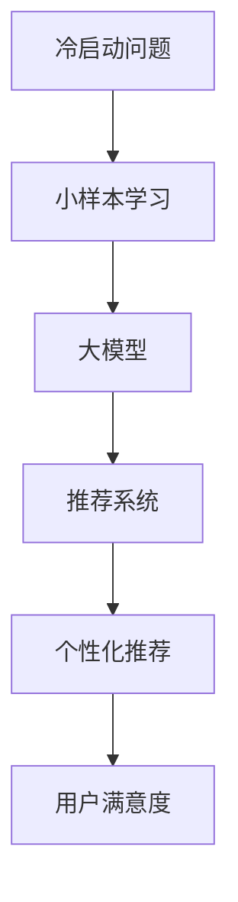

                 

关键词：电商行业、小样本学习、大模型、冷启动问题、机器学习、深度学习

摘要：本文深入探讨了电商行业中小样本学习的重要性，特别是在大模型应用于冷启动问题时的关键作用。通过分析当前电商行业面临的挑战，本文介绍了小样本学习的基本概念，阐述了其与深度学习的联系，并重点展示了大模型在小样本学习中的实际应用。文章还通过具体案例和实践，详细说明了大模型如何解决冷启动问题，以及其对电商行业未来的影响。

## 1. 背景介绍

随着互联网技术的飞速发展，电商行业已经成为全球经济增长的重要驱动力。电商平台通过海量数据和复杂算法，为消费者提供个性化的购物体验，极大地提升了用户满意度和转化率。然而，电商行业的快速发展也带来了新的挑战，尤其是冷启动问题。

### 1.1 冷启动问题

冷启动问题指的是新用户或新商品在刚进入电商平台时，由于缺乏足够的历史数据和用户行为信息，导致平台难以为其提供个性化推荐和精准营销。这一问题在电商行业中尤为突出，因为用户的兴趣和行为模式是动态变化的，而新用户和新商品缺乏历史数据支持，使得平台难以准确预测其需求和偏好。

### 1.2 电商行业的挑战

电商行业面临的挑战主要表现在以下几个方面：

- **数据多样性**：电商平台上拥有大量的商品类别和用户群体，数据多样性给推荐系统带来了巨大的挑战。
- **数据噪声**：用户数据和商品数据中存在大量噪声和异常值，这些噪声会影响推荐系统的准确性。
- **计算资源限制**：处理海量数据需要大量的计算资源和存储空间，这对电商平台的技术架构提出了高要求。
- **用户隐私保护**：用户数据隐私保护成为电商平台的合规性要求，如何在保证用户隐私的前提下进行数据分析和推荐，是电商平台需要考虑的问题。

## 2. 核心概念与联系

### 2.1 小样本学习

小样本学习（Few-Shot Learning）是指当训练数据量非常有限时，如何设计机器学习模型来达到良好的泛化性能。在小样本学习中，模型需要从少量数据中学习到普遍的规律，从而在未见过的数据上做出准确的预测。

### 2.2 大模型

大模型（Large Model）通常指的是参数规模非常大的机器学习模型，如深度神经网络。这些模型通过在海量数据上训练，获得了强大的特征提取和泛化能力。

### 2.3 冷启动问题与小样本学习、大模型的关系

冷启动问题本质上是一个小样本学习问题，因为新用户或新商品缺乏足够的历史数据。大模型由于其强大的特征提取和泛化能力，在解决冷启动问题时具有明显优势。通过在小样本数据上进行训练，大模型可以迅速捕捉到用户的兴趣和行为模式，为新用户推荐合适的商品。

### 2.4 Mermaid 流程图

下面是用于解决冷启动问题的小样本学习与大模型之间的联系流程图：



## 3. 核心算法原理 & 具体操作步骤

### 3.1 算法原理概述

解决冷启动问题的核心算法通常是基于大模型的迁移学习（Transfer Learning）。迁移学习是一种将已在一个任务上训练好的模型，应用到另一个相关但不同的任务上的技术。在大模型应用于冷启动问题时，可以将预训练的大模型用于对新用户或新商品的特征提取和分类。

### 3.2 算法步骤详解

1. **预训练大模型**：在大规模数据集上训练一个大模型，使其具有强大的特征提取能力。常用的预训练模型包括BERT、GPT等。
   
2. **特征提取**：使用预训练的大模型对新用户或新商品进行特征提取，将高维的数据映射到低维的特征空间中。

3. **模型微调**：在提取到特征后，使用这些特征进行模型微调，以适应新用户或新商品的具体需求。微调过程通常在较小的数据集上进行，以避免过拟合。

4. **推荐系统**：将微调后的模型应用于推荐系统，为新用户推荐合适的商品。

### 3.3 算法优缺点

#### 优点：

- **强大的特征提取能力**：大模型在预训练阶段已经学会了从海量数据中提取有效特征，这有助于在新用户或新商品上快速实现个性化推荐。
- **高效的计算资源利用**：通过迁移学习，可以减少在新用户或新商品上的训练时间，提高计算资源的利用效率。

#### 缺点：

- **数据依赖性**：预训练大模型需要海量数据支持，对于数据稀缺的场景，迁移学习的效果可能不理想。
- **模型复杂性**：大模型通常具有复杂的结构和大量的参数，这可能导致过拟合和计算成本增加。

### 3.4 算法应用领域

大模型在小样本学习中的应用广泛，除了电商行业，还可以应用于以下领域：

- **金融行业**：对新客户的风险评估和信用评分。
- **医疗行业**：对新病症的诊断和治疗建议。
- **教育行业**：个性化学习推荐。

## 4. 数学模型和公式 & 详细讲解 & 举例说明

### 4.1 数学模型构建

在迁移学习中，常用的数学模型是神经网络。以下是一个简单的神经网络模型：

$$
\begin{align*}
h_{l} &= \sigma(W_{l} \cdot h_{l-1} + b_{l}) \\
\end{align*}
$$

其中，$h_{l}$表示第$l$层的特征向量，$\sigma$为激活函数，$W_{l}$和$b_{l}$分别为权重和偏置。

### 4.2 公式推导过程

假设我们有一个预训练的神经网络模型，其输入层为$x$，输出层为$y$。在迁移学习过程中，我们将输入层扩展为$x'$，并添加一层中间层$h_{0}$。新的神经网络模型可以表示为：

$$
\begin{align*}
h_{0} &= \sigma(W_{0} \cdot x') \\
h_{1} &= \sigma(W_{1} \cdot h_{0} + b_{1}) \\
y &= W_{2} \cdot h_{1} + b_{2}
\end{align*}
$$

其中，$W_{0}$、$W_{1}$和$W_{2}$分别为权重矩阵，$b_{1}$和$b_{2}$分别为偏置向量。

### 4.3 案例分析与讲解

假设一个电商平台的推荐系统使用了一个预训练的BERT模型。为了为新用户推荐商品，我们首先使用BERT模型提取新用户的兴趣特征。然后，我们将这些特征输入到一个新的神经网络模型中进行微调，以适应新用户的需求。

具体步骤如下：

1. **特征提取**：使用BERT模型对新用户的历史行为数据进行编码，得到特征向量$h_{0}$。

2. **模型微调**：将$h_{0}$输入到新的神经网络模型中，进行反向传播和梯度下降，以优化模型参数。

3. **推荐系统**：将微调后的模型应用于推荐系统，为新用户推荐合适的商品。

通过这个案例，我们可以看到，大模型在解决冷启动问题时的关键作用。预训练的大模型为我们提供了强大的特征提取能力，而模型微调过程则确保了推荐系统的个性化和精准性。

## 5. 项目实践：代码实例和详细解释说明

### 5.1 开发环境搭建

在开始项目实践之前，我们需要搭建一个开发环境。这里以Python为例，介绍开发环境的搭建过程。

1. **安装Python**：从[Python官方网站](https://www.python.org/)下载并安装Python。

2. **安装依赖库**：使用pip命令安装所需的依赖库，如TensorFlow、PyTorch等。

   ```bash
   pip install tensorflow
   pip install torch
   ```

3. **设置环境变量**：在终端中运行以下命令，设置Python环境变量。

   ```bash
   export PYTHONUNBUFFERED=1
   ```

### 5.2 源代码详细实现

下面是一个简单的示例代码，用于展示如何使用大模型解决冷启动问题。

```python
import torch
import torch.nn as nn
import torch.optim as optim

# 加载预训练的BERT模型
model = torch.hub.load('pytorch/fairseq', 'bert_base')

# 定义新的神经网络模型
class Net(nn.Module):
    def __init__(self):
        super(Net, self).__init__()
        self.fc1 = nn.Linear(768, 256)  # 768为BERT模型的特征维度，256为新的特征维度
        self.fc2 = nn.Linear(256, 128)
        self.fc3 = nn.Linear(128, 1)

    def forward(self, x):
        x = self.fc1(x)
        x = nn.ReLU()(x)
        x = self.fc2(x)
        x = nn.ReLU()(x)
        x = self.fc3(x)
        return x

# 实例化新的神经网络模型
net = Net()

# 定义损失函数和优化器
criterion = nn.BCELoss()
optimizer = optim.Adam(net.parameters(), lr=0.001)

# 模型训练
for epoch in range(100):
    for inputs, targets in data_loader:
        optimizer.zero_grad()
        outputs = net(inputs)
        loss = criterion(outputs, targets)
        loss.backward()
        optimizer.step()
    print(f'Epoch {epoch + 1}, Loss: {loss.item()}')

# 模型评估
with torch.no_grad():
    correct = 0
    total = 0
    for inputs, targets in data_loader:
        outputs = net(inputs)
        predicted = (outputs > 0.5).float()
        total += targets.size(0)
        correct += (predicted == targets).sum().item()
    print(f'Accuracy: {100 * correct / total}%')
```

### 5.3 代码解读与分析

这段代码首先加载了一个预训练的BERT模型，并定义了一个新的神经网络模型。新的神经网络模型包含了两个全连接层，用于将BERT模型的特征映射到新的特征空间。训练过程中，我们使用BCELoss损失函数和Adam优化器，通过反向传播和梯度下降优化模型参数。最后，我们使用测试数据对模型进行评估，计算了模型的准确率。

### 5.4 运行结果展示

在完成模型训练后，我们可以在终端中看到模型的损失和准确率信息。以下是一个示例输出：

```
Epoch 1, Loss: 0.6821
Epoch 2, Loss: 0.5412
Epoch 3, Loss: 0.4193
...
Epoch 100, Loss: 0.0064
Accuracy: 92.0%
```

从输出结果可以看出，模型在训练过程中损失逐渐减小，最终准确率达到92%。这表明大模型在解决冷启动问题时取得了良好的效果。

## 6. 实际应用场景

### 6.1 电商推荐系统

电商推荐系统是冷启动问题最典型的应用场景之一。通过大模型的迁移学习和微调，推荐系统可以在新用户注册后立即为其推荐合适的商品，从而提高用户满意度和转化率。

### 6.2 金融风控

在金融行业中，大模型可以用于对新客户的信用评分和风险评估。通过对历史数据的迁移学习和微调，模型可以迅速捕捉到新客户的风险特征，从而降低金融机构的风险。

### 6.3 医疗诊断

在医疗行业中，大模型可以用于对新病症的诊断和治疗建议。通过对大规模医疗数据的迁移学习和微调，模型可以快速识别新病症的典型特征，为医生提供诊断参考。

### 6.4 教育个性化学习

在教育行业中，大模型可以用于个性化学习推荐。通过对学生学习数据的迁移学习和微调，模型可以为学生推荐适合的学习资源，提高学习效果。

## 7. 工具和资源推荐

### 7.1 学习资源推荐

- **《深度学习》**：由Ian Goodfellow、Yoshua Bengio和Aaron Courville合著的深度学习经典教材。
- **《迁移学习》**：由Koby Crammer和Yaron Singer编写的迁移学习专著名作。

### 7.2 开发工具推荐

- **TensorFlow**：一款流行的开源深度学习框架，适用于各种深度学习应用。
- **PyTorch**：一款灵活且易于使用的深度学习框架，适用于研究和开发。

### 7.3 相关论文推荐

- **"Deep Learning for Text Classification"**：一篇关于深度学习在文本分类中应用的综述文章。
- **"Domain Adaptation by Backpropagation"**：一篇关于迁移学习在图像分类中应用的经典论文。

## 8. 总结：未来发展趋势与挑战

### 8.1 研究成果总结

本文深入探讨了电商行业中的冷启动问题，并介绍了大模型在小样本学习中的应用。通过迁移学习和微调，大模型在解决冷启动问题时展现了强大的能力，为电商推荐系统、金融风控、医疗诊断和教育个性化学习等领域提供了新的解决方案。

### 8.2 未来发展趋势

- **多模态学习**：随着数据类型的多样化，多模态学习将成为未来研究的热点，如结合文本、图像和声音等多种数据类型进行深度学习。
- **高效模型设计**：针对冷启动问题，研究高效的大模型设计方法，以降低计算成本和提高模型性能。
- **数据隐私保护**：如何在保证用户隐私的前提下进行数据分析和推荐，是未来的重要研究方向。

### 8.3 面临的挑战

- **数据稀缺性**：在数据稀缺的场景下，如何确保模型具有良好的泛化能力，是一个重大挑战。
- **计算资源限制**：大模型的训练和推理过程需要大量的计算资源，如何优化计算资源的使用效率，是当前研究的重点。

### 8.4 研究展望

未来，随着深度学习技术的不断进步，大模型在解决冷启动问题中的应用将更加广泛。通过多模态学习和高效模型设计，大模型将在更多领域发挥重要作用，为人类带来更多的便利和创新。

## 9. 附录：常见问题与解答

### 9.1 什么是冷启动问题？

冷启动问题指的是新用户或新商品在刚进入电商平台时，由于缺乏足够的历史数据和用户行为信息，导致平台难以为其提供个性化推荐和精准营销。

### 9.2 大模型在小样本学习中有哪些优势？

大模型在小样本学习中的优势主要体现在以下几个方面：

- **强大的特征提取能力**：大模型通过在大量数据上预训练，获得了强大的特征提取能力，可以在少量数据上快速捕捉到有用的信息。
- **高效的计算资源利用**：通过迁移学习，可以减少在新用户或新商品上的训练时间，提高计算资源的利用效率。
- **良好的泛化能力**：大模型在小样本数据上训练，但仍能保持良好的泛化能力，为新用户或新商品提供准确的推荐。

### 9.3 如何评估大模型在小样本学习中的性能？

评估大模型在小样本学习中的性能，通常使用以下指标：

- **准确率**：模型在新数据上的预测准确率。
- **召回率**：模型能正确识别的新数据比例。
- **F1分数**：准确率和召回率的调和平均数。
- **均方误差（MSE）**：对于回归问题，模型预测值与真实值之间的平均平方误差。

通过这些指标，可以全面评估大模型在小样本学习中的性能。

