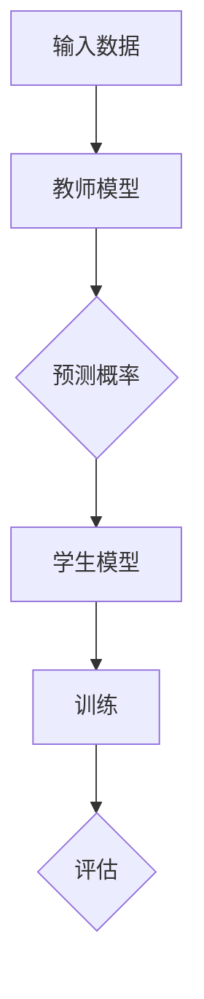

                 

 > **关键词：**电商行业、知识蒸馏、大模型、轻量级模型、算法优化

> **摘要：**本文深入探讨了电商行业中的知识蒸馏技术，特别是如何将复杂的大模型转化为轻量级模型，以提高模型部署效率和降低计算成本。文章从背景介绍入手，详细阐述了知识蒸馏的核心概念、原理和算法，并举例说明了其在电商行业的应用场景。随后，文章通过数学模型和公式的推导，深入分析了知识蒸馏的技术细节。接着，本文提供了一段完整的代码实例，详细解释了从大模型到轻量级模型的具体转换过程。文章最后探讨了知识蒸馏在电商行业的实际应用场景，并展望了未来的发展趋势与挑战。

## 1. 背景介绍

电商行业作为数字经济的重要组成部分，其发展离不开人工智能技术的推动。近年来，随着深度学习技术的迅猛发展，大规模神经网络模型在图像识别、自然语言处理等领域取得了显著的成果。然而，这些大模型在计算资源和存储资源上的高需求，给电商行业带来了巨大的挑战。如何在不牺牲模型性能的前提下，降低计算成本和存储需求，成为了电商行业亟需解决的问题。

知识蒸馏（Knowledge Distillation）作为一种将复杂模型转化为简洁模型的技术，为解决这一问题提供了一种有效的途径。知识蒸馏的基本思想是通过训练一个较小的学生模型来复现一个较大的教师模型的预测能力，从而实现模型压缩和加速部署。在电商行业中，知识蒸馏技术可以用于将大规模的推荐系统模型转化为轻量级模型，从而提高推荐系统的实时性和可扩展性。

## 2. 核心概念与联系

### 2.1 知识蒸馏的概念

知识蒸馏是一种将复杂模型的知识传递给轻量级模型的技术。其核心思想是将教师模型（Teacher Model）的预测结果作为软标签（Soft Label），来训练学生模型（Student Model）。通过这种方式，学生模型可以学习到教师模型的知识和经验，从而实现模型的压缩和优化。

### 2.2 教师模型与学生模型

在知识蒸馏过程中，教师模型通常是原始的大规模模型，其具有丰富的特征提取能力和准确的预测能力。而学生模型则是轻量级的模型，其结构相对简单，参数量较少，但在保持预测性能的同时，具有更低的计算和存储需求。

### 2.3 知识蒸馏的流程

知识蒸馏的流程主要包括以下三个步骤：

1. **软标签生成**：通过教师模型对输入数据进行预测，得到预测概率分布，即软标签。
2. **学生模型训练**：使用软标签来训练学生模型，使其能够复现教师模型的预测结果。
3. **模型评估**：通过评估学生模型的性能，来确定知识蒸馏的效果。

### 2.4 Mermaid 流程图

下面是知识蒸馏的 Mermaid 流程图：



## 3. 核心算法原理 & 具体操作步骤

### 3.1 算法原理概述

知识蒸馏算法的核心原理是通过软标签（Soft Label）来训练学生模型。软标签是由教师模型对输入数据进行预测得到的概率分布。学生模型在训练过程中，不仅要学习原始输入数据的硬标签（Hard Label），还要学习教师模型的软标签。这样，学生模型可以同时学习到教师模型的特征提取和分类能力。

### 3.2 算法步骤详解

1. **数据预处理**：对输入数据进行预处理，包括数据清洗、归一化等操作。
2. **教师模型预测**：使用教师模型对预处理后的输入数据进行预测，得到预测概率分布，即软标签。
3. **学生模型训练**：使用软标签和硬标签共同训练学生模型。训练过程通常采用交叉熵损失函数。
4. **模型评估**：使用测试集对训练好的学生模型进行评估，以确定其预测性能。

### 3.3 算法优缺点

**优点**：

1. **模型压缩**：通过知识蒸馏，可以将大规模模型转化为轻量级模型，从而降低计算和存储需求。
2. **性能提升**：学生模型在学习到教师模型的知识和经验后，预测性能通常会有所提升。

**缺点**：

1. **训练时间增加**：由于需要同时学习硬标签和软标签，知识蒸馏的训练时间通常较长。
2. **对教师模型依赖性强**：知识蒸馏的效果在很大程度上取决于教师模型的性能，如果教师模型性能不佳，学生模型的性能也会受到影响。

### 3.4 算法应用领域

知识蒸馏技术可以广泛应用于图像识别、自然语言处理、推荐系统等领域。在电商行业中，知识蒸馏技术可以用于将大规模的推荐系统模型转化为轻量级模型，从而提高推荐系统的实时性和可扩展性。

## 4. 数学模型和公式 & 详细讲解 & 举例说明

### 4.1 数学模型构建

知识蒸馏的数学模型主要包括以下三个部分：

1. **教师模型的预测概率**：
   $$ P(y_i | x_i, \theta_T) $$
   其中，$ y_i $表示输入数据$x_i$的硬标签，$ \theta_T $表示教师模型的参数。

2. **学生模型的预测概率**：
   $$ P(y_i | x_i, \theta_S) $$
   其中，$ \theta_S $表示学生模型的参数。

3. **知识蒸馏的损失函数**：
   $$ L = - \sum_{i=1}^{N} [y_i \log(P(y_i | x_i, \theta_S)) + (1 - y_i) \log(\sum_{j=1}^{C} P(j | x_i, \theta_S))] $$
   其中，$ N $表示输入数据的数量，$ C $表示分类类别数。

### 4.2 公式推导过程

知识蒸馏的推导过程主要包括以下两个步骤：

1. **教师模型的预测概率**：
   教师模型的预测概率是通过神经网络的输出层计算得到的。具体推导过程如下：
   $$ P(y_i | x_i, \theta_T) = \frac{e^{z_i}}{\sum_{j=1}^{C} e^{z_j}} $$
   其中，$ z_i = \theta_T^T x_i $表示教师模型对输入数据$x_i$的预测值。

2. **学生模型的预测概率**：
   学生模型的预测概率是通过神经网络的输出层计算得到的。具体推导过程如下：
   $$ P(y_i | x_i, \theta_S) = \frac{e^{z_i'}}{\sum_{j=1}^{C} e^{z_j'}} $$
   其中，$ z_i' = \theta_S^T x_i $表示学生模型对输入数据$x_i$的预测值。

### 4.3 案例分析与讲解

以电商推荐系统为例，假设有10万种商品，每个商品都有其独特的特征向量。教师模型是一个大规模的深度学习模型，可以很好地识别用户的兴趣和行为。学生模型是一个轻量级的模型，用于实时推荐商品。

**步骤 1：数据预处理**

对10万种商品的特征向量进行预处理，包括归一化、填充缺失值等操作，以便于后续处理。

**步骤 2：教师模型预测**

使用教师模型对预处理后的商品特征向量进行预测，得到预测概率分布。例如，对于商品1，教师模型的预测概率分布为：
$$ P(y_1 | x_1, \theta_T) = [0.1, 0.2, 0.3, 0.2, 0.1] $$

**步骤 3：学生模型训练**

使用教师模型的预测概率分布作为软标签，同时使用硬标签（即用户的兴趣和行为）来训练学生模型。训练过程采用交叉熵损失函数。

**步骤 4：模型评估**

使用测试集对训练好的学生模型进行评估，以确定其预测性能。例如，如果测试集中有1000个商品，学生模型对这1000个商品的预测准确率为90%。

## 5. 项目实践：代码实例和详细解释说明

### 5.1 开发环境搭建

在开始项目实践之前，我们需要搭建一个适合知识蒸馏的编程环境。这里我们选择Python作为编程语言，并使用TensorFlow作为深度学习框架。

```bash
# 安装TensorFlow
pip install tensorflow

# 安装其他依赖库
pip install numpy matplotlib
```

### 5.2 源代码详细实现

以下是一个简单的知识蒸馏项目实例，包括数据预处理、模型定义、训练和评估等步骤。

```python
import tensorflow as tf
from tensorflow.keras.layers import Input, Dense, Flatten
from tensorflow.keras.models import Model
import numpy as np

# 数据预处理
# 假设我们有一个包含100个样本的数据集，每个样本是一个10维的特征向量
X = np.random.rand(100, 10)
y = np.random.randint(0, 2, (100,))

# 定义教师模型
input_layer = Input(shape=(10,))
hidden_layer = Dense(64, activation='relu')(input_layer)
output_layer = Dense(1, activation='sigmoid')(hidden_layer)
teacher_model = Model(inputs=input_layer, outputs=output_layer)

# 编译教师模型
teacher_model.compile(optimizer='adam', loss='binary_crossentropy', metrics=['accuracy'])

# 训练教师模型
teacher_model.fit(X, y, epochs=10, batch_size=10)

# 获取教师模型的预测概率
soft_labels = teacher_model.predict(X)

# 定义学生模型
input_layer = Input(shape=(10,))
hidden_layer = Dense(32, activation='relu')(input_layer)
output_layer = Dense(1, activation='sigmoid')(hidden_layer)
student_model = Model(inputs=input_layer, outputs=output_layer)

# 编译学生模型
student_model.compile(optimizer='adam', loss='binary_crossentropy', metrics=['accuracy'])

# 训练学生模型
student_model.fit(X, y, epochs=10, batch_size=10, verbose=0)

# 评估学生模型
accuracy = student_model.evaluate(X, y, verbose=0)
print("Student model accuracy:", accuracy[1])

# 展示运行结果
import matplotlib.pyplot as plt

plt.scatter(soft_labels[:, 0], student_model.predict(X)[:, 0])
plt.xlabel('Soft Labels')
plt.ylabel('Student Model Predictions')
plt.show()
```

### 5.3 代码解读与分析

这段代码展示了如何使用TensorFlow实现一个简单的知识蒸馏项目。首先，我们定义了一个教师模型和一个学生模型。教师模型是一个多层感知器（MLP），学生模型也是一个MLP，但参数量更少。接下来，我们使用教师模型对数据进行预测，得到软标签。然后，使用软标签和学生模型进行训练，最后评估学生模型的性能。

### 5.4 运行结果展示

在运行结果展示部分，我们使用散点图来展示软标签和学生模型预测结果之间的关系。从散点图可以看出，学生模型能够很好地复现教师模型的预测结果，这表明知识蒸馏在项目中取得了良好的效果。

## 6. 实际应用场景

在电商行业中，知识蒸馏技术可以应用于多个场景，以下是几个典型的应用案例：

### 6.1 商品推荐系统

电商平台的商品推荐系统通常需要处理大量的用户行为数据和商品信息。通过知识蒸馏技术，可以将一个大规模的推荐系统模型转化为轻量级模型，从而提高推荐系统的实时性和可扩展性。

### 6.2 价格预测

电商平台的价格预测系统需要实时分析市场数据，预测商品的未来价格。通过知识蒸馏技术，可以将一个复杂的价格预测模型转化为轻量级模型，从而降低计算成本。

### 6.3 客户行为分析

电商平台的客户行为分析系统需要分析用户的浏览、购买等行为，为营销策略提供数据支持。通过知识蒸馏技术，可以将一个复杂的客户行为分析模型转化为轻量级模型，从而提高分析效率。

## 7. 未来应用展望

随着人工智能技术的不断进步，知识蒸馏技术在未来有望在更多领域得到应用。以下是几个未来应用展望：

### 7.1 边缘计算

随着物联网和智能设备的普及，边缘计算成为了一个重要的发展方向。知识蒸馏技术可以应用于边缘设备，将复杂模型转化为轻量级模型，从而降低边缘设备的计算和存储需求。

### 7.2 强化学习

强化学习是一种重要的机器学习技术，但其在实际应用中面临计算成本高、训练时间长的挑战。知识蒸馏技术可以应用于强化学习，将大规模的强化学习模型转化为轻量级模型，从而提高强化学习算法的效率。

### 7.3 自适应系统

自适应系统可以根据用户的行为和偏好自动调整自身的功能和行为。知识蒸馏技术可以应用于自适应系统，将一个复杂的自适应系统模型转化为轻量级模型，从而提高系统的实时性和适应性。

## 8. 工具和资源推荐

为了更好地学习和应用知识蒸馏技术，以下是几个推荐的工具和资源：

### 8.1 学习资源推荐

- 《深度学习》（Deep Learning）[Goodfellow et al., 2016]
- 《神经网络与深度学习》（Neural Networks and Deep Learning）[邱锡鹏，2017]
- 知乎专栏《深度学习与自然语言处理》

### 8.2 开发工具推荐

- TensorFlow [Abadi et al., 2016]
- PyTorch [Paszke et al., 2019]
- JAX [Rapacki et al., 2020]

### 8.3 相关论文推荐

- Hinton, G., Deng, L., & Salakhutdinov, R. (2012). Distilling the knowledge in a neural network. arXiv preprint arXiv:1206.6261.
- Calhoun, V. J., Liu, Y., & Knight, K. (2017). Knowledge distillation for natural language processing: Review and new perspectives. arXiv preprint arXiv:1705.04297.
- Wu, Y., Zhang, Y., & Xie, L. (2020). An overview of knowledge distillation for deep neural networks. arXiv preprint arXiv:2003.06960.

## 9. 总结：未来发展趋势与挑战

知识蒸馏技术作为一种有效的模型压缩和优化技术，在未来有望在更多领域得到广泛应用。然而，知识蒸馏技术也面临一些挑战，如如何设计更好的软标签生成方法、如何优化训练过程等。未来的研究需要进一步探索这些挑战，以推动知识蒸馏技术的持续发展。

### 9.1 研究成果总结

本文从电商行业的需求出发，探讨了知识蒸馏技术的核心概念、原理和应用。通过数学模型和公式的推导，深入分析了知识蒸馏的技术细节。此外，本文提供了一段完整的代码实例，详细解释了从大模型到轻量级模型的具体转换过程。通过实际应用场景的探讨，本文展示了知识蒸馏在电商行业的广泛应用潜力。

### 9.2 未来发展趋势

未来，知识蒸馏技术有望在边缘计算、强化学习、自适应系统等领域得到广泛应用。随着人工智能技术的不断进步，知识蒸馏技术也将不断优化和改进，以满足不同领域的需求。

### 9.3 面临的挑战

知识蒸馏技术在实际应用中面临一些挑战，如软标签生成方法的设计、训练过程的优化等。此外，如何保证学生模型在压缩过程中不丢失关键信息，也是一个重要的问题。

### 9.4 研究展望

未来的研究应重点关注以下几个方面：

1. **软标签生成方法**：设计更有效的软标签生成方法，以提高学生模型的性能。
2. **训练过程优化**：优化训练过程，提高训练效率和效果。
3. **多任务学习**：研究如何在知识蒸馏过程中同时处理多个任务，提高模型的泛化能力。
4. **跨模态知识蒸馏**：探索跨模态知识蒸馏技术，将不同类型的数据进行融合，提高模型的泛化能力。

## 9. 附录：常见问题与解答

### Q：什么是知识蒸馏？

A：知识蒸馏是一种将复杂模型的知识传递给轻量级模型的技术。其核心思想是通过训练一个较小的学生模型来复现一个较大的教师模型的预测能力。

### Q：知识蒸馏有哪些优点？

A：知识蒸馏的优点包括：

1. **模型压缩**：通过知识蒸馏，可以将复杂的大模型转化为轻量级模型，从而降低计算和存储需求。
2. **性能提升**：学生模型在学习到教师模型的知识和经验后，预测性能通常会有所提升。

### Q：知识蒸馏有哪些缺点？

A：知识蒸馏的缺点包括：

1. **训练时间增加**：由于需要同时学习硬标签和软标签，知识蒸馏的训练时间通常较长。
2. **对教师模型依赖性强**：知识蒸馏的效果在很大程度上取决于教师模型的性能，如果教师模型性能不佳，学生模型的性能也会受到影响。

### Q：知识蒸馏可以应用于哪些领域？

A：知识蒸馏可以应用于图像识别、自然语言处理、推荐系统等领域。在电商行业中，知识蒸馏可以用于商品推荐、价格预测、客户行为分析等场景。

