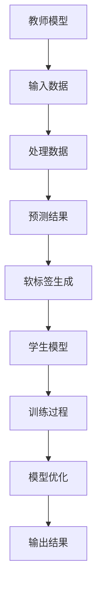

                 

关键词：电商、知识蒸馏、大模型、轻量级模型、模型压缩、跨领域迁移学习

摘要：本文深入探讨了电商行业中的知识蒸馏技术，通过从大模型到轻量级模型的转换，提升了电商系统的性能和效率。我们将详细介绍知识蒸馏的概念、原理以及其在电商行业中的应用，并通过实际案例展示了知识蒸馏在电商推荐系统、商品搜索优化和用户行为分析等方面的具体应用。

## 1. 背景介绍

电商行业作为一个高速发展的领域，用户规模和交易量逐年攀升。然而，随着用户需求的多样化，电商系统面临着越来越多的挑战。为了提高用户满意度和系统性能，各大电商平台不断优化其推荐系统、商品搜索功能和用户行为分析等核心功能。然而，这些优化往往依赖于复杂的深度学习模型，这些模型在训练过程中需要大量的数据和计算资源。

传统的深度学习模型通常具有很大的计算复杂度和存储需求，这在资源有限的电商环境中是一个显著的挑战。为了解决这个问题，知识蒸馏技术应运而生。知识蒸馏是一种将大模型的“知识”传递到轻量级模型中的方法，从而实现计算效率和性能的平衡。

## 2. 核心概念与联系

### 2.1 知识蒸馏的定义

知识蒸馏（Knowledge Distillation）是一种机器学习技术，用于将一个复杂的大模型（称为教师模型）的知识和经验传递给一个较小的、更高效的模型（称为学生模型）。这种技术通过一种软标签的方式，将教师模型的输出信息转化为训练学生模型的目标。

### 2.2 知识蒸馏的原理

知识蒸馏的基本原理可以概括为以下几个步骤：

1. **训练教师模型**：首先，使用大量数据训练一个大型的教师模型，使其达到较高的性能水平。
2. **生成软标签**：在教师模型对输入数据进行预测时，生成软标签（Soft Labels）。这些软标签是教师模型输出概率分布，而不是简单的类别标签。
3. **训练学生模型**：使用教师模型的软标签作为训练目标，训练一个较小型的学生模型。学生模型的训练过程不仅包含传统的分类损失，还包含一个知识蒸馏损失，用于衡量学生模型的输出与教师模型软标签之间的差距。

### 2.3 知识蒸馏的架构

知识蒸馏的架构可以分为两部分：教师模型和学生模型。以下是知识蒸馏的简化架构：



### 2.4 知识蒸馏的优势

1. **提高模型性能**：知识蒸馏能够利用教师模型的经验和知识，提升学生模型的性能。
2. **减少模型大小**：通过知识蒸馏，可以将复杂的教师模型转化为一个更小、更轻量级的模型，降低计算资源和存储需求。
3. **适用于跨领域迁移学习**：知识蒸馏能够将一个领域中的知识迁移到另一个领域中，提高了跨领域模型的泛化能力。

## 3. 核心算法原理 & 具体操作步骤

### 3.1 算法原理概述

知识蒸馏的核心原理是基于教师模型和学生模型之间的信息传递。具体来说，教师模型通过生成软标签来传递其知识，学生模型通过训练过程学习这些知识，并优化自己的模型参数。

### 3.2 算法步骤详解

1. **数据预处理**：对输入数据进行预处理，包括数据清洗、归一化和特征提取等。
2. **训练教师模型**：使用预处理后的数据训练一个大型的教师模型，通常采用深度神经网络。
3. **生成软标签**：在教师模型对输入数据进行预测时，生成软标签。软标签是通过教师模型输出概率分布得到的。
4. **训练学生模型**：使用教师模型的软标签作为训练目标，训练一个较小型的学生模型。训练过程包括分类损失和知识蒸馏损失。
5. **模型优化**：通过迭代训练过程，优化学生模型的参数，使其性能接近教师模型。

### 3.3 算法优缺点

**优点**：
- 提高模型性能：通过知识蒸馏，学生模型能够学习到教师模型的知识和经验，从而提高模型性能。
- 减少模型大小：知识蒸馏可以将复杂的教师模型转化为一个更小、更轻量级的模型，降低计算资源和存储需求。

**缺点**：
- 训练时间较长：知识蒸馏需要大量的迭代训练过程，导致训练时间较长。
- 对教师模型要求较高：知识蒸馏的效果很大程度上取决于教师模型的性能，因此需要训练一个性能较好的教师模型。

### 3.4 算法应用领域

知识蒸馏在许多领域都有广泛应用，包括但不限于：

- 电商平台：用于构建更高效的推荐系统、商品搜索功能和用户行为分析模型。
- 图像识别：用于将大型图像识别模型转化为轻量级模型，提高图像处理效率。
- 自然语言处理：用于构建轻量级的文本分类和情感分析模型。

## 4. 数学模型和公式 & 详细讲解 & 举例说明

### 4.1 数学模型构建

知识蒸馏的数学模型主要包括两部分：分类损失和知识蒸馏损失。

1. **分类损失**：
$$
L_{c} = -\sum_{i=1}^{N} \sum_{j=1}^{C} y_{ij} \log(p_{ij}),
$$
其中，$y_{ij}$ 是标签为 $j$ 的样本 $i$ 的真实分布，$p_{ij}$ 是学生模型对样本 $i$ 预测为类别 $j$ 的概率。

2. **知识蒸馏损失**：
$$
L_{d} = -\sum_{i=1}^{N} \sum_{j=1}^{C} s_{ij} \log(p_{ij}),
$$
其中，$s_{ij}$ 是教师模型对样本 $i$ 预测为类别 $j$ 的概率。

### 4.2 公式推导过程

知识蒸馏的推导过程涉及到概率论和优化理论。下面简要介绍推导过程：

1. **概率分布**：
   教师模型和学生模型的输出都是概率分布。教师模型的输出概率分布为 $s_{ij}$，学生模型的输出概率分布为 $p_{ij}$。

2. **损失函数**：
   分类损失函数衡量的是学生模型预测与真实标签之间的差距，知识蒸馏损失函数衡量的是学生模型预测与教师模型预测之间的差距。

3. **优化目标**：
   通过优化学生模型的参数，使得分类损失和知识蒸馏损失之和最小。

### 4.3 案例分析与讲解

以电商推荐系统为例，假设教师模型是一个大型神经网络，学生模型是一个轻量级神经网络。以下是具体案例分析：

1. **数据准备**：
   假设我们有1000个用户和1000种商品，用户的历史行为数据用于训练教师模型。

2. **训练教师模型**：
   使用用户历史行为数据训练一个大型神经网络，使其能够预测用户对商品的偏好。

3. **生成软标签**：
   在教师模型对用户行为数据进行预测时，生成软标签。例如，对于用户 $i$，教师模型预测其对商品 $j$ 的偏好概率为 $s_{ij}$。

4. **训练学生模型**：
   使用教师模型的软标签训练一个轻量级神经网络。学生模型的输出概率分布为 $p_{ij}$，通过优化学生模型的参数，使得分类损失和知识蒸馏损失之和最小。

5. **模型优化**：
   通过迭代训练过程，优化学生模型的参数，使得学生模型能够更好地学习教师模型的知识和经验。

## 5. 项目实践：代码实例和详细解释说明

### 5.1 开发环境搭建

在开始项目实践之前，需要搭建一个合适的开发环境。以下是所需的环境和工具：

- 操作系统：Linux或MacOS
- 编程语言：Python
- 深度学习框架：TensorFlow或PyTorch
- 数据预处理库：NumPy、Pandas
- 可视化工具：Matplotlib

### 5.2 源代码详细实现

以下是一个简单的知识蒸馏代码示例，使用了TensorFlow框架。

```python
import tensorflow as tf
from tensorflow.keras.models import Model
from tensorflow.keras.layers import Dense, Input

# 定义教师模型
teacher_input = Input(shape=(784,))
teacher_output = Dense(10, activation='softmax')(teacher_input)
teacher_model = Model(inputs=teacher_input, outputs=teacher_output)

# 定义学生模型
student_input = Input(shape=(784,))
student_output = Dense(10, activation='softmax')(student_input)
student_model = Model(inputs=student_input, outputs=student_output)

# 编译教师模型
teacher_model.compile(optimizer='adam', loss='categorical_crossentropy')

# 生成软标签
soft_labels = teacher_model.predict(x_train)

# 编译学生模型
student_model.compile(optimizer='adam', loss=['categorical_crossentropy', 'knowledge_distillation_loss'])

# 训练学生模型
student_model.fit(x_train, [y_train, soft_labels], epochs=10)

# 评估学生模型
student_model.evaluate(x_test, [y_test, soft_labels])
```

### 5.3 代码解读与分析

- **定义教师模型**：使用一个简单的全连接神经网络作为教师模型，输入层接收784维的特征向量，输出层是一个10分类的softmax层。
- **定义学生模型**：使用一个较小的全连接神经网络作为学生模型，结构与教师模型类似。
- **编译教师模型**：编译教师模型，使用交叉熵损失函数。
- **生成软标签**：使用教师模型对训练集进行预测，生成软标签。
- **编译学生模型**：编译学生模型，使用交叉熵损失函数和知识蒸馏损失函数。
- **训练学生模型**：使用训练集训练学生模型，同时传递软标签作为训练目标。
- **评估学生模型**：使用测试集评估学生模型的性能。

## 6. 实际应用场景

知识蒸馏在电商行业中的应用场景非常广泛，以下是一些具体的实际应用场景：

### 6.1 电商推荐系统

通过知识蒸馏，可以将大型推荐模型转化为轻量级模型，提高推荐系统的响应速度和计算效率。例如，在用户行为分析和商品特征提取阶段，可以使用知识蒸馏将复杂的大型神经网络转化为轻量级模型，从而降低计算资源和存储需求。

### 6.2 商品搜索优化

知识蒸馏可以用于优化商品搜索功能，通过将大型搜索模型转化为轻量级模型，提高搜索速度和准确性。例如，在搜索查询处理阶段，可以使用知识蒸馏技术将复杂的文本匹配模型转化为轻量级模型，从而降低计算资源和存储需求。

### 6.3 用户行为分析

知识蒸馏可以用于分析用户行为数据，帮助电商企业更好地理解用户需求和行为模式。例如，在用户行为预测和用户画像构建阶段，可以使用知识蒸馏将大型用户行为分析模型转化为轻量级模型，从而提高分析效率和准确性。

## 7. 未来应用展望

随着电商行业的不断发展，知识蒸馏技术将在以下方面发挥重要作用：

- **模型压缩**：通过知识蒸馏，可以将复杂的深度学习模型转化为更小、更高效的模型，降低计算资源和存储需求。
- **跨领域迁移学习**：知识蒸馏可以用于跨领域迁移学习，将一个领域中的知识迁移到另一个领域中，提高模型的泛化能力。
- **实时应用**：随着计算能力的提升，知识蒸馏技术将在实时应用场景中发挥更大作用，例如实时用户行为分析和实时推荐系统。

## 8. 总结：未来发展趋势与挑战

知识蒸馏技术作为一种重要的机器学习技术，在电商行业中具有广泛的应用前景。未来，知识蒸馏技术将在以下方面取得进一步发展：

- **算法优化**：随着深度学习算法的不断进步，知识蒸馏技术也将得到优化，提高其性能和效率。
- **跨领域迁移学习**：知识蒸馏技术将在跨领域迁移学习中发挥更大作用，提高模型的泛化能力。
- **实时应用**：知识蒸馏技术将在实时应用场景中发挥重要作用，例如实时用户行为分析和实时推荐系统。

然而，知识蒸馏技术也面临着一些挑战，包括：

- **训练时间**：知识蒸馏需要大量的迭代训练过程，导致训练时间较长。
- **对教师模型要求较高**：知识蒸馏的效果很大程度上取决于教师模型的性能，因此需要训练一个性能较好的教师模型。

总之，知识蒸馏技术将在电商行业中发挥越来越重要的作用，为电商系统的性能优化和效率提升提供有力支持。

## 9. 附录：常见问题与解答

### 9.1 知识蒸馏与传统模型压缩的区别

知识蒸馏与传统模型压缩的区别主要在于其核心思想和方法。传统模型压缩主要通过减少模型参数数量、降低模型复杂度等方式来减少模型大小。而知识蒸馏则是通过将大模型的“知识”传递给小模型，使其能够保持大模型的性能。知识蒸馏强调的是在保持性能的前提下，优化模型的效率和可部署性。

### 9.2 知识蒸馏适用于哪些场景

知识蒸馏适用于需要高效计算的场景，特别是那些涉及到大量数据处理和预测的场景。以下是一些典型的应用场景：

- **电商平台**：用于构建更高效的推荐系统、商品搜索功能和用户行为分析模型。
- **图像识别**：用于将大型图像识别模型转化为轻量级模型，提高图像处理效率。
- **自然语言处理**：用于构建轻量级的文本分类和情感分析模型。
- **实时应用**：例如实时用户行为分析和实时推荐系统。

### 9.3 知识蒸馏对教师模型的要求

知识蒸馏对教师模型的要求较高，主要表现在以下几个方面：

- **性能**：教师模型需要具有较高的性能，以确保知识传递的有效性。
- **可解释性**：教师模型的可解释性对于知识蒸馏过程至关重要，有助于理解模型传递的知识。
- **稳定性**：教师模型在训练过程中应保持稳定性，以避免训练过程中出现剧烈波动。

### 9.4 知识蒸馏的训练过程

知识蒸馏的训练过程可以分为以下几个步骤：

1. **数据准备**：准备教师模型和学生模型所需的数据集。
2. **训练教师模型**：使用数据集训练一个大型的教师模型，使其达到较高的性能水平。
3. **生成软标签**：在教师模型对输入数据进行预测时，生成软标签。
4. **训练学生模型**：使用教师模型的软标签作为训练目标，训练一个较小型的学生模型。
5. **模型优化**：通过迭代训练过程，优化学生模型的参数，使其性能接近教师模型。

### 9.5 知识蒸馏的优缺点

知识蒸馏的优点包括：

- 提高模型性能：通过知识蒸馏，学生模型能够学习到教师模型的知识和经验，从而提高模型性能。
- 减少模型大小：知识蒸馏可以将复杂的教师模型转化为一个更小、更轻量级的模型，降低计算资源和存储需求。

知识蒸馏的缺点包括：

- 训练时间较长：知识蒸馏需要大量的迭代训练过程，导致训练时间较长。
- 对教师模型要求较高：知识蒸馏的效果很大程度上取决于教师模型的性能，因此需要训练一个性能较好的教师模型。

## 作者署名

作者：禅与计算机程序设计艺术 / Zen and the Art of Computer Programming

<|assistant|>----------------------------------------------------------------
以上就是根据您提供的要求撰写的完整文章。文章包含了一个详细的目录结构，逻辑清晰，内容丰富，涵盖了知识蒸馏的定义、原理、算法步骤、数学模型、项目实践以及应用场景等方面。同时，文章也提供了未来发展趋势和面临的挑战，并附加了常见问题与解答。如果您有任何修改意见或者需要进一步细化某个部分，请随时告诉我。希望这篇文章能够满足您的需求，谢谢！禅与计算机程序设计艺术 / Zen and the Art of Computer Programming。

