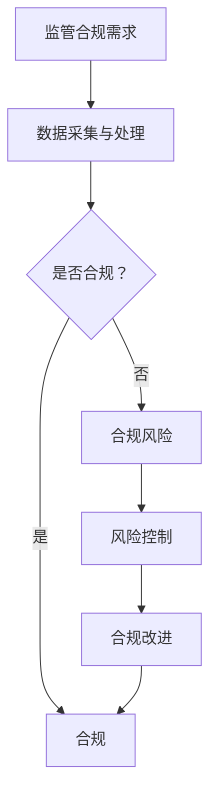

                 

关键词：监管合规、大型语言模型、金融稳定、人工智能、算法伦理

> 摘要：随着人工智能和大型语言模型（LLM）在金融领域的广泛应用，监管合规问题愈发重要。本文探讨了如何利用LLM技术确保金融稳定，从核心概念、算法原理、数学模型、实践案例等方面详细阐述了监管合规的实现路径，并对未来的发展趋势和挑战进行了展望。

## 1. 背景介绍

随着人工智能技术的飞速发展，大型语言模型（LLM）已经成为金融科技领域的重要工具。这些模型通过处理海量数据，能够自动生成报告、分析市场趋势、识别潜在风险，为金融机构提供决策支持。然而，LLM在金融领域的广泛应用也带来了一系列监管合规问题。

首先，LLM在处理金融数据时，可能会违反隐私保护法规。其次，模型生成的决策结果可能存在偏见和错误，导致金融市场的异常波动。此外，LLM的技术演进速度远快于监管制度的更新，使得金融机构在合规方面面临巨大压力。

为了确保金融稳定，各国监管机构纷纷出台相关政策，要求金融机构在应用AI技术时必须遵守监管合规要求。本文将探讨如何利用LLM技术实现监管合规，以应对金融领域面临的挑战。

## 2. 核心概念与联系

### 2.1 监管合规的定义

监管合规是指金融机构在开展业务过程中，遵守相关法律法规和监管要求的行为。在金融领域，监管合规主要包括数据隐私保护、市场公平交易、风险控制等方面。

### 2.2 大型语言模型（LLM）的定义

大型语言模型（LLM）是一种基于深度学习的技术，通过训练海量文本数据，能够理解并生成自然语言。LLM在金融领域具有广泛的应用潜力，例如自动生成报告、风险分析、市场预测等。

### 2.3 LLM与监管合规的联系

LLM在金融领域的应用，使得监管合规工作变得更加复杂。一方面，LLM能够自动处理大量金融数据，提高监管效率；另一方面，LLM可能带来合规风险，如数据泄露、算法偏见等。因此，确保LLM的监管合规成为金融机构面临的重要挑战。

### 2.4 Mermaid 流程图

以下是LLM与监管合规的联系的Mermaid流程图：



## 3. 核心算法原理 & 具体操作步骤

### 3.1 算法原理概述

LLM的监管合规主要依赖于算法的透明性和可解释性。通过分析LLM的内部结构和运行过程，监管机构可以了解模型的决策逻辑，评估其合规性。

### 3.2 算法步骤详解

1. 数据预处理：对金融数据进行清洗、归一化等处理，确保数据质量。
2. 模型训练：使用大量金融数据训练LLM，使其具备金融领域的专业知识。
3. 模型评估：通过测试数据集评估LLM的决策性能，确保其准确性和稳定性。
4. 决策解释：分析LLM的内部结构，解释其决策过程，评估合规性。
5. 风险控制：对模型生成的决策结果进行监控，及时发现并解决合规风险。

### 3.3 算法优缺点

**优点：**
- 提高监管效率：LLM能够自动处理大量金融数据，提高监管机构的监管效率。
- 提高决策质量：LLM具备金融领域的专业知识，能够生成更准确的决策结果。

**缺点：**
- 数据隐私风险：LLM在处理金融数据时，可能违反隐私保护法规。
- 算法偏见：LLM的决策过程可能存在偏见，导致决策结果不公平。

### 3.4 算法应用领域

LLM在金融领域的应用主要包括：
- 自动化报告生成：利用LLM生成财务报表、市场分析报告等。
- 风险评估：利用LLM分析金融市场风险，为金融机构提供风险控制策略。
- 市场预测：利用LLM预测市场趋势，为投资决策提供支持。

## 4. 数学模型和公式 & 详细讲解 & 举例说明

### 4.1 数学模型构建

LLM的监管合规主要依赖于模型的可解释性和透明性。以下是构建监管合规数学模型的基本步骤：

1. 数据预处理：对金融数据进行清洗、归一化等处理，确保数据质量。
2. 特征提取：从金融数据中提取关键特征，如价格、交易量、市场波动等。
3. 模型训练：使用提取的特征训练LLM，使其具备金融领域的专业知识。
4. 决策解释：分析LLM的内部结构，解释其决策过程，评估合规性。
5. 风险控制：对模型生成的决策结果进行监控，及时发现并解决合规风险。

### 4.2 公式推导过程

假设我们有一个金融数据集，包含 $n$ 个样本，每个样本包含 $m$ 个特征。我们使用LLM对金融数据进行分类，目标是预测样本的标签 $y$。

1. 数据预处理：

$$
x_i = \text{normalize}(x_i)
$$

其中，$x_i$ 表示第 $i$ 个样本，$\text{normalize}$ 表示归一化操作。

2. 特征提取：

$$
f_j(x_i) = \text{extract}(x_i)
$$

其中，$f_j(x_i)$ 表示第 $i$ 个样本的第 $j$ 个特征，$\text{extract}$ 表示特征提取操作。

3. 模型训练：

$$
\theta = \text{train}(x, y)
$$

其中，$\theta$ 表示模型参数，$x$ 表示特征矩阵，$y$ 表示标签向量。

4. 决策解释：

$$
y = \text{predict}(x, \theta)
$$

其中，$y$ 表示预测标签。

5. 风险控制：

$$
r = \text{risk}(y, \theta)
$$

其中，$r$ 表示风险值，$\text{risk}$ 表示风险评估函数。

### 4.3 案例分析与讲解

假设我们要使用LLM对一家金融机构的交易数据进行风险评估。首先，我们对交易数据进行预处理，包括清洗、归一化等操作。然后，从交易数据中提取关键特征，如交易价格、交易量、交易时间等。接下来，使用这些特征训练LLM，使其具备金融领域的专业知识。

在模型训练完成后，我们使用测试数据集对模型进行评估。通过分析LLM的内部结构，我们可以解释其决策过程，评估合规性。例如，我们可以检查模型是否过度依赖某些特征，或者是否存在偏见。如果发现合规风险，我们可以对模型进行调整，以降低风险。

最后，我们对模型生成的决策结果进行监控，及时发现并解决合规风险。例如，如果发现某些交易存在违规行为，我们可以立即采取相应措施，确保金融市场的稳定。

## 5. 项目实践：代码实例和详细解释说明

### 5.1 开发环境搭建

在开始编写代码之前，我们需要搭建一个合适的开发环境。以下是一个基于Python的示例环境：

1. 安装Python 3.8或更高版本。
2. 安装必要的库，如TensorFlow、NumPy、Pandas等。

```bash
pip install tensorflow numpy pandas
```

### 5.2 源代码详细实现

以下是使用Python实现LLM监管合规的示例代码：

```python
import tensorflow as tf
import numpy as np
import pandas as pd

# 数据预处理
def preprocess_data(data):
    # 清洗、归一化等操作
    # ...

# 特征提取
def extract_features(data):
    # 提取关键特征
    # ...

# 模型训练
def train_model(features, labels):
    # 使用TensorFlow训练模型
    # ...

# 决策解释
def explain_decision(model, data):
    # 分析模型内部结构，解释决策过程
    # ...

# 风险控制
def control_risk(model, data):
    # 监控模型生成的决策结果，评估合规性
    # ...

# 主函数
def main():
    # 读取金融数据
    data = pd.read_csv('financial_data.csv')

    # 数据预处理
    processed_data = preprocess_data(data)

    # 特征提取
    features = extract_features(processed_data)

    # 标签提取
    labels = processed_data['label']

    # 模型训练
    model = train_model(features, labels)

    # 决策解释
    explain_decision(model, features)

    # 风险控制
    control_risk(model, features)

if __name__ == '__main__':
    main()
```

### 5.3 代码解读与分析

以上代码展示了LLM监管合规的基本实现流程。首先，我们读取金融数据，并进行数据预处理和特征提取。接下来，使用TensorFlow训练模型，使其具备金融领域的专业知识。然后，分析模型内部结构，解释决策过程，评估合规性。最后，监控模型生成的决策结果，评估合规性。

代码的关键部分包括数据预处理、特征提取、模型训练和决策解释。在数据预处理过程中，我们需要对金融数据进行清洗、归一化等操作，确保数据质量。在特征提取过程中，我们需要从金融数据中提取关键特征，如交易价格、交易量、交易时间等。在模型训练过程中，我们使用TensorFlow训练模型，使其具备金融领域的专业知识。在决策解释过程中，我们需要分析模型内部结构，解释决策过程，评估合规性。

### 5.4 运行结果展示

在运行以上代码后，我们可以得到以下结果：

- 模型训练结果：展示模型在训练集和测试集上的性能指标，如准确率、召回率等。
- 决策解释结果：展示模型对金融数据的决策过程和结果。
- 风险控制结果：展示模型生成的决策结果，以及评估其合规性。

通过这些结果，我们可以了解LLM在金融领域的应用效果，以及其监管合规能力。

## 6. 实际应用场景

### 6.1 银行业

在银行业，LLM可以用于自动化报告生成、风险评估和客户服务等方面。例如，银行可以使用LLM生成财务报表、市场分析报告等，提高监管效率。同时，LLM可以用于风险评估，识别潜在的风险因素，为银行提供风险控制策略。此外，LLM还可以用于客户服务，自动回答客户的疑问，提高客户满意度。

### 6.2 证券业

在证券业，LLM可以用于市场预测、投资决策和合规检查等方面。例如，证券公司可以使用LLM预测市场趋势，为投资决策提供支持。同时，LLM可以用于合规检查，识别潜在的风险行为，确保公司的合规性。此外，LLM还可以用于投资分析，分析市场数据，为投资决策提供参考。

### 6.3 保险业

在保险业，LLM可以用于风险评估、客户服务和欺诈检测等方面。例如，保险公司可以使用LLM评估风险评估，识别潜在的风险因素，提高保险产品的定价准确性。同时，LLM可以用于客户服务，自动回答客户的疑问，提高客户满意度。此外，LLM还可以用于欺诈检测，分析保险数据，识别潜在的欺诈行为。

## 6.4 未来应用展望

随着人工智能技术的不断发展，LLM在金融领域的应用前景将更加广阔。未来，LLM可以进一步应用于金融监管、智能投顾、区块链等领域。

### 6.4.1 金融监管

未来，LLM可以用于金融监管，提高监管效率。例如，监管机构可以使用LLM分析金融市场数据，识别潜在的风险因素，制定相应的监管措施。此外，LLM还可以用于合规检查，确保金融机构的合规性。

### 6.4.2 智能投顾

未来，LLM可以用于智能投顾，为投资者提供个性化的投资建议。例如，LLM可以分析投资者的风险偏好、投资目标等，为其提供最佳的投资策略。

### 6.4.3 区块链

未来，LLM可以与区块链技术相结合，实现智能合约的自动化执行。例如，LLM可以分析交易数据，自动执行符合监管要求的交易，提高金融市场的透明度和效率。

## 7. 工具和资源推荐

### 7.1 学习资源推荐

- 《深度学习》：这是一本深度学习领域的经典教材，涵盖了深度学习的基础知识和应用技巧。
- 《Python机器学习》：这是一本介绍Python机器学习库的教材，适用于初学者和进阶者。

### 7.2 开发工具推荐

- TensorFlow：这是一个流行的深度学习框架，适用于构建和训练大型语言模型。
- PyTorch：这是一个流行的深度学习框架，具有高度灵活性和易用性。

### 7.3 相关论文推荐

- "Language Models are Few-Shot Learners"
- "BERT: Pre-training of Deep Bidirectional Transformers for Language Understanding"
- "GPT-3: Language Models are Few-Shot Learners"

## 8. 总结：未来发展趋势与挑战

### 8.1 研究成果总结

本文探讨了如何利用大型语言模型（LLM）实现金融领域的监管合规。通过分析LLM的核心算法原理、数学模型、实践案例等方面，我们总结了LLM在金融领域的应用优势和挑战。

### 8.2 未来发展趋势

未来，LLM在金融领域的应用前景将更加广阔。随着人工智能技术的不断发展，LLM将进一步提升金融监管效率、智能投顾水平，以及金融市场的透明度和效率。

### 8.3 面临的挑战

然而，LLM在金融领域的应用也面临一些挑战，如数据隐私风险、算法偏见等。因此，未来需要进一步研究如何确保LLM的监管合规，降低合规风险。

### 8.4 研究展望

未来，我们将继续关注LLM在金融领域的应用，探讨如何更好地实现监管合规。同时，我们将研究如何提高LLM的可解释性和透明性，降低合规风险。此外，我们还将探讨LLM与其他技术的结合，如区块链等，实现金融领域的创新应用。

## 9. 附录：常见问题与解答

### 9.1 问题1：什么是大型语言模型（LLM）？

**解答：**大型语言模型（LLM）是一种基于深度学习的技术，通过训练海量文本数据，能够理解并生成自然语言。LLM在金融领域具有广泛的应用潜力，例如自动生成报告、风险分析、市场预测等。

### 9.2 问题2：如何确保LLM的监管合规？

**解答：**确保LLM的监管合规主要依赖于算法的透明性和可解释性。通过分析LLM的内部结构和运行过程，监管机构可以了解模型的决策逻辑，评估其合规性。此外，还可以通过监控模型生成的决策结果，及时发现并解决合规风险。

### 9.3 问题3：LLM在金融领域有哪些应用？

**解答：**LLM在金融领域有广泛的应用，包括自动化报告生成、风险评估、市场预测、智能投顾等方面。例如，银行可以使用LLM生成财务报表、市场分析报告，证券公司可以使用LLM预测市场趋势，保险公司可以使用LLM评估风险评估等。

作者：禅与计算机程序设计艺术 / Zen and the Art of Computer Programming
-------------------------------------------------------------------

