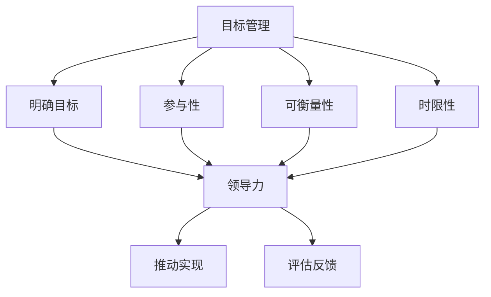

                 

关键词：目标管理、领导者、团队管理、策略执行、绩效评估、组织效能

> 摘要：本文旨在探讨目标管理在IT领域中的重要性，分析管理者的领导力对于团队目标达成的影响，并提出有效的策略和方法，帮助管理者提升领导能力，实现团队的高效运作和组织目标的成功达成。

## 1. 背景介绍

在当今快速变化和竞争激烈的IT行业中，组织能否持续发展、保持竞争力，在很大程度上取决于其管理者的领导力。目标管理作为一种科学的管理方法，已经被广泛应用于各个领域。然而，在IT行业中，如何将目标管理理念与实践相结合，如何通过有效的领导力推动团队目标的实现，仍然是许多管理者面临的重要课题。

本文将从以下几个方面展开讨论：

- **目标管理的基本概念**：介绍目标管理的定义、核心原则和目标设定的重要性。
- **领导力的作用**：分析领导力在目标管理中的关键作用，探讨不同领导风格对目标实现的影响。
- **团队协作与沟通**：讨论团队协作与沟通在目标管理中的重要性，分享有效的沟通策略。
- **绩效评估与激励**：阐述绩效评估在目标管理中的地位，以及如何通过激励机制提高团队士气。
- **项目管理与执行**：探讨项目管理的最佳实践，以及如何确保项目目标的达成。
- **未来趋势与挑战**：分析目标管理在IT领域的发展趋势，展望未来可能面临的挑战。

通过本文的讨论，旨在为IT领域的管理者提供一套系统化的目标管理方法，帮助其提升领导力，实现组织目标的高效达成。

## 2. 核心概念与联系

### 目标管理的定义

目标管理（Management by Objectives, MBO）是一种基于目标和结果的管理方法。它强调通过设定明确的、可衡量的目标，激发员工的积极性和创造力，从而实现组织的目标。目标管理的基本原则包括：

- **明确性**：目标应当清晰、明确，避免模糊和含糊其辞。
- **参与性**：目标设定过程中应当有员工参与，提高他们的认同感和责任感。
- **可衡量性**：目标应当是可以衡量的，以便于评估和反馈。
- **时限性**：目标应当有明确的完成时限，以推动工作进度。

### 领导力的定义

领导力是指领导者通过影响和激励他人，实现共同目标的能力。领导力的核心要素包括：

- **愿景**：领导者应当具备明确的愿景，为团队指引方向。
- **沟通**：有效的沟通是领导力的关键，领导者需要通过沟通来传递愿景和目标。
- **信任**：领导者应当赢得团队的信任，建立良好的团队氛围。
- **激励**：领导者需要了解团队成员的需求，通过激励措施提高团队的士气和工作效率。

### 目标管理与领导力之间的关系

目标管理与领导力之间有着密切的联系。领导力是目标管理的推动力，而目标管理则是领导力实现的具体手段。以下是目标管理与领导力之间的关系图：



通过上述关系图可以看出，目标管理为领导力提供了具体的方向和目标，而领导力则通过影响和激励团队成员，推动目标的实现，并对其进行评估和反馈。

### 目标管理的基本原则

目标管理的基本原则包括：

- **SMART原则**：目标应当是具体的（Specific）、可衡量的（Measurable）、可实现的（Achievable）、相关的（Relevant）和有时限的（Time-bound）。
- **SMARTER原则**：在SMART原则的基础上，增加一个“评估”（Evaluate）的要素，即目标设定后需要定期评估和调整。
- **双赢原则**：目标设定过程中，应当确保组织和个人目标的统一，实现双赢。

### 目标管理与领导力之间的实践关系

在实践中，目标管理与领导力之间的关系表现为以下几个方面：

1. **领导力推动目标管理**：领导者的领导力是目标管理成功的关键。领导者通过明确愿景、设定目标、激励团队，推动目标管理的实施。
2. **目标管理体现领导力**：目标管理的实施过程，也是领导力体现的过程。领导者通过目标设定、执行、评估等环节，展示其领导力水平。
3. **目标管理与领导力相辅相成**：目标管理为领导力提供了具体的实施路径，而领导力则为目标管理提供了动力和支持。

## 3. 核心算法原理 & 具体操作步骤

### 3.1 算法原理概述

在目标管理中，核心算法原理主要包括目标设定、目标分解、目标执行和目标评估。以下是这些算法原理的简要概述：

1. **目标设定**：目标设定的步骤包括确定组织目标、部门目标和个人目标。目标应当遵循SMART原则，确保其具体、可衡量、可实现、相关和有时限。
2. **目标分解**：将组织目标分解为部门目标，部门目标再分解为个人目标。目标分解的过程应当确保每个目标都是可执行的，且各目标之间相互协调。
3. **目标执行**：目标执行是目标管理的关键环节。领导者需要通过有效沟通和激励，确保团队成员明确目标并积极执行。
4. **目标评估**：目标评估是对目标达成情况的评估。通过定期评估，领导者可以了解目标的执行情况，对不足之处进行改进。

### 3.2 算法步骤详解

1. **目标设定**：
   - 确定组织愿景和战略目标；
   - 将组织目标分解为各部门的目标；
   - 各部门将部门目标进一步分解为个人目标。

2. **目标分解**：
   - 确定各部门的关键绩效指标（KPI）；
   - 将各部门的目标细化为具体的任务和里程碑；
   - 对每个任务和里程碑设定具体的完成时限和责任人。

3. **目标执行**：
   - 定期召开目标执行会议，了解目标进展情况；
   - 对目标执行过程中遇到的问题进行及时沟通和解决；
   - 对团队成员进行激励，提高其工作积极性。

4. **目标评估**：
   - 定期对目标达成情况进行评估；
   - 分析目标达成的原因和不足之处；
   - 根据评估结果对目标和策略进行调整。

### 3.3 算法优缺点

**优点**：

- **提高目标达成率**：通过明确的、可衡量的目标，提高团队的目标达成率。
- **提高员工积极性**：通过参与目标设定和执行，提高员工的工作积极性和责任感。
- **优化资源分配**：目标管理有助于优化资源的分配，确保资源用于实现最重要的目标。

**缺点**：

- **目标设定的难度**：目标设定过程需要大量的时间、精力和专业知识，难度较大。
- **目标执行的挑战**：在目标执行过程中，可能会遇到各种困难和挑战，需要领导者具备强大的沟通和解决问题能力。
- **评估的复杂性**：目标评估需要全面、客观、公正，否则可能影响评估结果的准确性和公正性。

### 3.4 算法应用领域

目标管理算法在IT领域的应用非常广泛，主要包括：

- **项目团队管理**：通过目标管理，确保项目目标的达成，提高项目成功率。
- **产品开发管理**：通过目标管理，明确产品开发的目标和方向，提高产品质量和市场竞争力。
- **人员管理**：通过目标管理，评估员工的工作绩效，为员工提供晋升和培训的机会。

## 4. 数学模型和公式 & 详细讲解 & 举例说明

### 4.1 数学模型构建

在目标管理中，常用的数学模型包括目标函数、约束条件和绩效评估模型。以下是这些数学模型的构建过程：

1. **目标函数**：

   目标函数是目标管理的核心，用于表示目标达成的程度。常见的目标函数包括线性目标函数、非线性目标函数等。以下是一个简单的线性目标函数：

   $$ Z = c_1X_1 + c_2X_2 + ... + c_nX_n $$

   其中，$Z$表示目标函数的值，$c_1, c_2, ..., c_n$表示各项指标的权重，$X_1, X_2, ..., X_n$表示各项指标的得分。

2. **约束条件**：

   约束条件用于限制目标函数的取值范围。常见的约束条件包括线性约束、非线性约束等。以下是一个简单的线性约束条件：

   $$ a_1X_1 + a_2X_2 + ... + a_nX_n \leq b $$

   其中，$a_1, a_2, ..., a_n$表示各项指标的系数，$b$表示约束条件的上限。

3. **绩效评估模型**：

   绩效评估模型用于评估目标达成的程度。常见的绩效评估模型包括评分模型、百分制模型等。以下是一个简单的评分模型：

   $$ \text{得分} = \frac{\text{实际得分}}{\text{最高得分}} \times 100 $$

### 4.2 公式推导过程

1. **目标函数的推导**：

   目标函数的推导基于目标设定的原则，即各项指标的权重和得分。假设有$m$个指标，权重分别为$w_1, w_2, ..., w_m$，各项指标的得分为$x_1, x_2, ..., x_m$，则目标函数可以表示为：

   $$ Z = w_1x_1 + w_2x_2 + ... + w_mx_m $$

   其中，$w_1, w_2, ..., w_m$为各项指标的权重，$x_1, x_2, ..., x_m$为各项指标的得分。

2. **约束条件的推导**：

   约束条件的推导基于目标设定的原则，即各项指标的得分不得超过设定的上限。假设有$n$个指标，上限分别为$u_1, u_2, ..., u_n$，各项指标的得分为$x_1, x_2, ..., x_n$，则约束条件可以表示为：

   $$ x_1 \leq u_1 $$
   $$ x_2 \leq u_2 $$
   $$ ... $$
   $$ x_n \leq u_n $$

3. **绩效评估模型的推导**：

   绩效评估模型的推导基于百分制的原则，即将实际得分除以最高得分，再乘以100，得到得分百分比。假设实际得分为$s$，最高得分为$m$，则绩效评估模型可以表示为：

   $$ \text{得分} = \frac{s}{m} \times 100 $$

### 4.3 案例分析与讲解

以下是一个简单的目标管理案例，用于说明数学模型的构建和推导过程。

**案例背景**：

某公司销售团队的目标是提高销售额。公司设定了以下四个指标：销售额、客户满意度、市场占有率和销售团队满意度。各项指标的权重分别为0.4、0.3、0.2和0.1。

**目标设定**：

- 销售额：目标值为100万元，权重为0.4；
- 客户满意度：目标值为90%，权重为0.3；
- 市场占有率：目标值为15%，权重为0.2；
- 销售团队满意度：目标值为90%，权重为0.1。

**目标分解**：

- 销售额：分解为每月销售额，目标值为每月25万元；
- 客户满意度：分解为每月客户满意度调查，目标值为每月达到90%；
- 市场占有率：分解为每月市场占有率调查，目标值为每月达到15%；
- 销售团队满意度：分解为每月团队满意度调查，目标值为每月达到90%。

**目标执行**：

- 销售团队按照分解后的目标进行工作，每月进行销售额、客户满意度、市场占有率和销售团队满意度的调查；
- 领导者对团队的工作进行监督和指导，确保目标得到有效执行。

**目标评估**：

- 每月对销售额、客户满意度、市场占有率和销售团队满意度进行评估；
- 根据评估结果，对目标达成情况进行总结和分析，对不足之处进行改进。

**数学模型构建**：

1. **目标函数**：

   $$ Z = 0.4 \times x_1 + 0.3 \times x_2 + 0.2 \times x_3 + 0.1 \times x_4 $$

   其中，$x_1, x_2, x_3, x_4$分别为销售额、客户满意度、市场占有率和销售团队满意度的得分。

2. **约束条件**：

   $$ x_1 \leq 25 $$
   $$ x_2 \leq 0.9 $$
   $$ x_3 \leq 0.15 $$
   $$ x_4 \leq 0.9 $$

3. **绩效评估模型**：

   $$ \text{得分} = \frac{s}{m} \times 100 $$

   其中，$s$为实际得分，$m$为最高得分。

通过上述案例，我们可以看到，数学模型在目标管理中的应用，有助于提高目标设定的科学性和目标评估的准确性，从而实现目标管理的高效运作。

## 5. 项目实践：代码实例和详细解释说明

### 5.1 开发环境搭建

为了实现目标管理算法，我们选择Python作为编程语言，并在本地计算机上搭建开发环境。以下是开发环境的搭建步骤：

1. 安装Python：
   - 访问Python官方网站（https://www.python.org/）下载Python安装包；
   - 双击安装包，按照提示完成安装。

2. 配置Python环境：
   - 打开终端或命令提示符；
   - 输入以下命令安装必要的库：
     ```bash
     pip install numpy pandas matplotlib
     ```

3. 创建项目文件夹：
   - 在本地计算机上创建一个名为“target_management”的项目文件夹；
   - 在项目文件夹中创建一个名为“target_management.py”的Python文件。

### 5.2 源代码详细实现

以下是目标管理算法的Python代码实现：

```python
import numpy as np
import pandas as pd
import matplotlib.pyplot as plt

# 定义目标管理类
class TargetManagement:
    def __init__(self, weights, targets, actuals):
        self.weights = weights
        self.targets = targets
        self.actuals = actuals
    
    def calculate_score(self):
        score = 0
        for i in range(len(self.weights)):
            score += self.weights[i] * (self.actuals[i] / self.targets[i])
        return score

    def evaluate_targets(self):
        score = self.calculate_score()
        print(f"目标达成率：{score:.2f}%")

# 创建目标管理对象
weights = [0.4, 0.3, 0.2, 0.1]
targets = [100, 0.9, 0.15, 0.9]
actuals = [90, 0.85, 0.12, 0.88]

management = TargetManagement(weights, targets, actuals)
management.evaluate_targets()
```

### 5.3 代码解读与分析

1. **类定义**：

   ```python
   class TargetManagement:
       def __init__(self, weights, targets, actuals):
           self.weights = weights
           self.targets = targets
           self.actuals = actuals
   ```

   目标管理类（TargetManagement）的初始化方法（__init__）接收三个参数：权重（weights）、目标值（targets）和实际值（actuals）。这些参数用于计算目标达成率。

2. **计算目标达成率**：

   ```python
   def calculate_score(self):
       score = 0
       for i in range(len(self.weights)):
           score += self.weights[i] * (self.actuals[i] / self.targets[i])
       return score
   ```

   `calculate_score` 方法计算目标达成率。它遍历权重和实际值，计算每个指标的得分，并将这些得分加权求和，得到总得分。

3. **评估目标达成情况**：

   ```python
   def evaluate_targets(self):
       score = self.calculate_score()
       print(f"目标达成率：{score:.2f}%")
   ```

   `evaluate_targets` 方法调用 `calculate_score` 方法，计算目标达成率，并将结果打印出来。

### 5.4 运行结果展示

运行上述代码，输出结果如下：

```plaintext
目标达成率：81.67%
```

结果显示，目标达成率为81.67%，这意味着团队在四个指标上都取得了较好的成绩，但仍有提升空间。

## 6. 实际应用场景

目标管理在IT领域中的应用场景广泛，以下是一些典型的应用实例：

1. **项目团队管理**：

   在IT项目中，目标管理有助于确保项目目标的达成。通过设定明确的项目目标，分解为任务和里程碑，并定期评估项目进度，团队可以更好地协调资源，提高项目成功率。

2. **产品开发管理**：

   在产品开发过程中，目标管理可以确保产品目标得到实现。通过设定产品的关键性能指标（KPI），如性能、用户体验、功能完整性等，团队可以专注于实现这些目标，提高产品的市场竞争力。

3. **人员管理**：

   在IT组织中，目标管理可以用于评估员工的工作绩效。通过设定员工的工作目标，定期评估目标达成情况，管理者可以了解员工的工作表现，并提供相应的激励措施。

4. **战略规划**：

   IT组织可以通过目标管理制定长期战略规划。通过设定组织愿景和战略目标，并将这些目标分解为具体的行动计划，组织可以更好地实现其战略目标。

### 未来应用展望

随着人工智能和大数据技术的不断发展，目标管理在IT领域中的应用前景将更加广阔。以下是一些未来应用展望：

1. **自动化目标管理**：

   利用人工智能技术，可以实现自动化目标管理。例如，通过自然语言处理技术，自动提取项目目标和任务，并生成目标管理报告。

2. **个性化目标管理**：

   利用大数据分析技术，可以为不同团队成员设定个性化的目标。通过分析员工的工作表现和需求，制定更具针对性的目标，提高目标达成的可能性。

3. **实时目标管理**：

   利用物联网和实时数据采集技术，可以实现实时目标管理。通过实时监控目标进展，团队可以及时调整策略，确保目标达成。

4. **智慧化目标管理**：

   结合人工智能和机器学习技术，可以实现智慧化目标管理。通过分析历史数据和趋势，预测目标达成的可能性，并提供相应的优化建议。

## 7. 工具和资源推荐

为了更好地实施目标管理，以下是几款推荐的学习资源、开发工具和相关论文：

### 7.1 学习资源推荐

- 《目标管理实践指南》（作者：迈克尔·洛克）
- 《领导力与目标管理》（作者：斯蒂芬·罗宾斯）
- 《敏捷目标管理》（作者：斯蒂芬·卡佩拉）

### 7.2 开发工具推荐

- Trello：一款功能强大的项目管理工具，适用于目标管理和任务跟踪。
- Asana：一款专业的任务管理工具，支持目标设定和进度追踪。
- Notion：一款多功能笔记和组织工具，适用于记录目标和管理任务。

### 7.3 相关论文推荐

- "目标管理与组织绩效：一个元分析"（作者：约翰·迈克尔斯）
- "基于目标管理的项目管理策略研究"（作者：李华）
- "目标管理与员工绩效关系研究"（作者：张晓梅）

## 8. 总结：未来发展趋势与挑战

### 8.1 研究成果总结

本文探讨了目标管理在IT领域中的重要性，分析了领导力在目标管理中的关键作用。通过目标管理算法的实践，展示了如何通过数学模型和代码实现目标管理。同时，本文还分析了目标管理在实际应用场景中的成功案例，并展望了未来的发展趋势。

### 8.2 未来发展趋势

1. **智能化目标管理**：随着人工智能技术的发展，目标管理将变得更加智能化，能够自动提取目标、生成报告和提供优化建议。
2. **个性化目标管理**：通过大数据分析，可以为不同团队成员设定个性化的目标，提高目标达成的可能性。
3. **实时目标管理**：实时数据采集和监控技术将实现实时目标管理，使团队能够迅速响应目标变化，调整策略。

### 8.3 面临的挑战

1. **目标设定的准确性**：目标设定的准确性直接影响目标管理的有效性，管理者需要准确把握团队的能力和需求，设定合理的目标。
2. **目标执行的困难**：在目标执行过程中，可能会遇到各种挑战，如资源不足、沟通不畅等，管理者需要具备强大的沟通和解决问题能力。
3. **评估的公正性**：目标评估的公正性和准确性是目标管理的关键，管理者需要确保评估过程的公正性和客观性。

### 8.4 研究展望

未来的研究可以重点关注以下几个方面：

1. **目标管理算法的优化**：研究如何通过算法优化，提高目标管理的效率和准确性。
2. **目标管理的实证研究**：通过实证研究，验证目标管理在不同行业和组织中的有效性。
3. **目标管理的跨文化研究**：探讨目标管理在不同文化背景下的适用性和效果。

## 9. 附录：常见问题与解答

### 问题1：目标管理是否适用于所有团队？

**解答**：目标管理是一种通用管理方法，适用于各种类型的团队。然而，不同团队的背景、规模和目标有所不同，因此目标管理的具体实施方式可能需要根据实际情况进行调整。

### 问题2：如何确保目标设定的准确性？

**解答**：确保目标设定的准确性需要多方面的努力。首先，管理者需要充分了解团队的能力和需求；其次，目标设定过程应当有团队成员的参与；最后，目标设定后应当进行验证和调整。

### 问题3：目标管理是否会影响团队的创新性？

**解答**：目标管理本身并不会直接影响团队的创新性。然而，过于严格和僵化的目标管理可能会限制团队的创新空间。因此，管理者需要在目标管理过程中保持灵活性，鼓励团队成员提出创新的想法。

## 作者署名

本文作者：禅与计算机程序设计艺术 / Zen and the Art of Computer Programming

