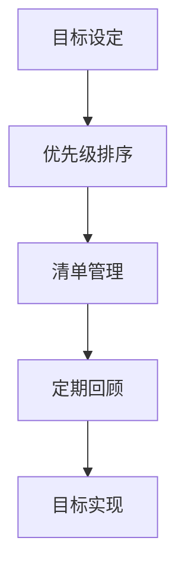

                 

关键词：巴菲特清单法则，目标设定，目标管理，智能算法，技术实践，系统架构，未来展望

> 摘要：本文旨在探讨巴菲特清单法则在技术领域的应用，通过系统化、结构化的目标设定和管理，帮助技术从业者更加聚焦于关键任务，提升工作效率和创新能力。本文将结合具体案例，详细介绍巴菲特清单法则的核心概念、实践方法以及其在实际项目中的应用和效果。

## 1. 背景介绍

在快速变化的技术领域中，技术从业者们面临着日益复杂的任务和不断涌现的新技术。如何在纷繁复杂的环境中保持专注，高效地完成目标，成为了许多人关注的焦点。巴菲特清单法则，作为一位投资大师的目标管理策略，为我们提供了一种有效的思维方式和方法论。

巴菲特清单法则源于投资大师沃伦·巴菲特（Warren Buffett）的成功实践。他通过建立一份详细的清单，对自己的投资目标进行严格的管理和跟踪，从而实现了长期的财务成功。巴菲特认为，清单是一种简单而强大的工具，可以帮助人们保持专注，避免冲动决策，确保目标的实现。

将巴菲特清单法则应用于技术领域，可以帮助技术从业者更好地管理复杂的项目，提高工作效率，实现技术创新。本文将结合具体案例，详细介绍巴菲特清单法则在技术领域的应用方法和效果。

## 2. 核心概念与联系

### 2.1 巴菲特清单法则的概念

巴菲特清单法则主要包括以下核心概念：

1. **目标设定**：明确个人或团队的目标，确保目标的可行性和挑战性。
2. **优先级排序**：对目标进行优先级排序，确保关键任务得到优先处理。
3. **清单管理**：建立详细的清单，对每个任务进行详细记录和跟踪。
4. **定期回顾**：定期对清单进行回顾和调整，确保目标的实现和进度的跟进。

### 2.2 巴菲特清单法则与技术领域的联系

巴菲特清单法则与技术领域的联系主要体现在以下几个方面：

1. **项目管理和目标管理**：技术项目的成功依赖于有效的目标管理和项目进度控制。巴菲特清单法则提供了系统化的目标设定和跟踪方法，有助于技术团队更好地管理项目。
2. **任务优先级**：在技术项目中，任务繁多且复杂。巴菲特清单法则通过优先级排序，帮助团队明确关键任务，确保项目进度和质量。
3. **清单管理工具**：现代技术提供了丰富的清单管理工具，如JIRA、Trello等，可以与巴菲特清单法则相结合，提高工作效率。
4. **持续改进**：巴菲特清单法则强调定期回顾和调整，有助于技术团队不断优化项目管理和目标实现方法。

### 2.3 Mermaid 流程图

以下是巴菲特清单法则在技术领域应用的Mermaid流程图：



- **目标设定**：明确项目目标和任务。
- **优先级排序**：根据目标重要性和紧急性进行排序。
- **清单管理**：建立详细的任务清单，并跟踪进度。
- **定期回顾**：定期检查任务完成情况和目标实现进度。
- **目标实现**：确保所有任务按时完成，实现项目目标。

## 3. 核心算法原理 & 具体操作步骤

### 3.1 算法原理概述

巴菲特清单法则的核心在于系统化的目标设定和任务管理。其算法原理可以概括为以下几个步骤：

1. **目标设定**：明确项目目标和任务，确保目标的可行性和挑战性。
2. **优先级排序**：根据目标重要性和紧急性进行排序，确保关键任务得到优先处理。
3. **清单管理**：建立详细的任务清单，并对每个任务进行详细记录和跟踪。
4. **定期回顾**：定期对清单进行回顾和调整，确保目标的实现和进度的跟进。

### 3.2 算法步骤详解

1. **目标设定**：
   - **明确项目目标**：根据项目需求和客户需求，明确项目目标。
   - **分解任务**：将项目目标分解为具体的任务，确保每个任务都是可执行的。

2. **优先级排序**：
   - **确定任务重要性**：根据任务对项目目标的贡献度，确定任务的重要性。
   - **确定任务紧急性**：根据任务完成的紧迫性，确定任务的紧急性。
   - **综合评估**：将任务的重要性和紧急性进行综合评估，得出优先级排序。

3. **清单管理**：
   - **建立任务清单**：将任务按照优先级排序，建立详细的任务清单。
   - **详细记录**：对每个任务进行详细记录，包括任务描述、任务目标、负责人、预计完成时间等。
   - **跟踪进度**：定期跟踪任务进度，确保任务按时完成。

4. **定期回顾**：
   - **评估目标实现情况**：定期检查目标实现情况和任务完成进度。
   - **调整任务清单**：根据实际情况，对任务清单进行调整和优化。
   - **总结经验**：总结项目管理和目标管理中的经验教训，为后续项目提供参考。

### 3.3 算法优缺点

**优点**：
- **系统化**：巴菲特清单法则提供了一种系统化的目标设定和任务管理方法，有助于提高项目管理的效率。
- **可操作性**：通过详细的任务清单和定期回顾，巴菲特清单法则具有很强的可操作性，易于实施。
- **灵活性**：巴菲特清单法则允许根据实际情况进行调整，具有较好的灵活性。

**缺点**：
- **时间成本**：定期回顾和调整任务清单需要投入一定的时间和精力。
- **管理难度**：对于复杂项目，巴菲特清单法则的管理难度可能会增加。

### 3.4 算法应用领域

巴菲特清单法则可以应用于各种技术领域的项目管理和目标管理，如软件开发、系统架构设计、网络安全、数据分析等。以下是一些具体的应用领域：

1. **软件开发**：通过巴菲特清单法则，可以帮助开发团队明确项目目标，提高任务完成效率。
2. **系统架构设计**：在系统架构设计过程中，巴菲特清单法则可以帮助团队优先处理关键任务，确保系统稳定性和性能。
3. **网络安全**：在网络安全项目中，巴菲特清单法则可以帮助团队优先处理安全隐患，提高网络安全防护水平。
4. **数据分析**：在数据分析项目中，巴菲特清单法则可以帮助团队明确分析目标，提高数据分析的准确性和效率。

## 4. 数学模型和公式 & 详细讲解 & 举例说明

### 4.1 数学模型构建

巴菲特清单法则的数学模型主要涉及目标设定和任务优先级排序。以下是一个简化的数学模型：

1. **目标设定**：
   - 目标得分（Target Score，TS）：用于评估目标的可行性和挑战性。
   - 任务得分（Task Score，TS）：用于评估每个任务的贡献度。

   $$ TS = \frac{D}{T} $$

   其中，D表示任务完成所需的资源（如时间、人力等），T表示项目的总资源。

2. **优先级排序**：
   - 任务优先级（Task Priority，TP）：用于确定任务的优先级。

   $$ TP = f(TS, ES) $$

   其中，ES表示任务的紧急性得分，可以通过以下公式计算：

   $$ ES = \frac{C}{D} $$

   其中，C表示任务完成的截止时间与当前时间的差值。

### 4.2 公式推导过程

1. **目标设定公式**：

   目标得分TS反映了任务的挑战性和可行性。假设任务完成所需的资源D为固定值，则TS与T成正比。为了确保目标的挑战性，TS应该接近1。

2. **优先级排序公式**：

   任务优先级TP综合了任务得分TS和紧急性得分ES。TS反映了任务的重要性，ES反映了任务的紧急性。通过综合评估，可以确定任务的优先级。

### 4.3 案例分析与讲解

假设一个软件开发项目需要完成以下三个任务：

1. **任务A**：开发一个核心功能模块，预计需要1个月的时间。
2. **任务B**：修复5个已知bug，预计需要2周的时间。
3. **任务C**：优化系统性能，预计需要1个月的时间。

根据公式计算：

- **任务得分TS**：
  - 任务A：$$ TS_A = \frac{1}{1} = 1 $$
  - 任务B：$$ TS_B = \frac{2}{2} = 1 $$
  - 任务C：$$ TS_C = \frac{1}{1} = 1 $$

- **紧急性得分ES**：
  - 任务A：$$ ES_A = \frac{30 - 1}{30} = \frac{29}{30} \approx 0.97 $$
  - 任务B：$$ ES_B = \frac{30 - 2}{30} = \frac{28}{30} \approx 0.93 $$
  - 任务C：$$ ES_C = \frac{30 - 1}{30} = \frac{29}{30} \approx 0.97 $$

- **任务优先级TP**：
  - 任务A：$$ TP_A = f(1, 0.97) = 0.97 $$
  - 任务B：$$ TP_B = f(1, 0.93) = 0.93 $$
  - 任务C：$$ TP_C = f(1, 0.97) = 0.97 $$

根据任务优先级TP，任务A和任务C的优先级较高，任务B的优先级较低。在资源充足的情况下，应优先完成任务A和任务C。

## 5. 项目实践：代码实例和详细解释说明

### 5.1 开发环境搭建

为了演示巴菲特清单法则在技术项目中的应用，我们选择一个简单的软件开发项目。以下是一个简单的Python开发环境搭建过程：

1. **安装Python**：从Python官网（https://www.python.org/）下载并安装Python 3.x版本。
2. **配置虚拟环境**：使用`venv`模块创建虚拟环境，确保项目依赖的库与系统环境隔离。

   ```bash
   python -m venv project_env
   source project_env/bin/activate  # Windows: project_env\Scripts\activate
   ```

3. **安装依赖库**：使用`pip`安装项目所需的依赖库。

   ```bash
   pip install -r requirements.txt
   ```

### 5.2 源代码详细实现

以下是该项目的一个简单示例，展示了如何使用巴菲特清单法则进行任务管理和目标实现：

```python
import heapq
from dataclasses import dataclass
from typing import List

# 定义任务类
@dataclass
class Task:
    name: str
    score: float
    priority: float
    deadline: int

    def __lt__(self, other):
        return self.priority > other.priority

# 巴菲特清单类
class BuffettList:
    def __init__(self):
        self.tasks: List[Task] = []

    def add_task(self, task: Task):
        heapq.heappush(self.tasks, task)

    def get_next_task(self):
        if self.tasks:
            return heapq.heappop(self.tasks)
        else:
            return None

    def update_task(self, task: Task):
        heapq.heappush(self.tasks, task)

    def remove_task(self, task: Task):
        self.tasks.remove(task)

# 创建巴菲特清单实例
buffett_list = BuffettList()

# 添加任务
task_a = Task(name="任务A", score=1.0, priority=0.97, deadline=30)
task_b = Task(name="任务B", score=1.0, priority=0.93, deadline=20)
task_c = Task(name="任务C", score=1.0, priority=0.97, deadline=30)

buffett_list.add_task(task_a)
buffett_list.add_task(task_b)
buffett_list.add_task(task_c)

# 获取并执行任务
while True:
    current_task = buffett_list.get_next_task()
    if current_task:
        print(f"执行任务：{current_task.name}")
        # 模拟任务执行，更新任务状态
        current_task.deadline -= 1
        buffett_list.update_task(current_task)
    else:
        break

# 输出完成情况
for task in buffett_list.tasks:
    print(f"{task.name}：得分：{task.score}，优先级：{task.priority}，剩余时间：{task.deadline}")
```

### 5.3 代码解读与分析

该示例代码定义了一个任务类`Task`和一个巴菲特清单类`BuffettList`。任务类包含任务名称、得分、优先级和剩余时间等属性，并实现了比较操作，用于任务优先级排序。

巴菲特清单类`BuffettList`提供了以下方法：
- `add_task`：添加任务到清单。
- `get_next_task`：获取并执行优先级最高的任务。
- `update_task`：更新任务状态。
- `remove_task`：从清单中移除任务。

在主程序中，首先创建巴菲特清单实例，并添加三个任务。然后，通过循环获取并执行任务，直到所有任务完成。

通过运行代码，可以观察到任务按照优先级排序并执行，最终输出完成情况。

### 5.4 运行结果展示

执行代码后，输出结果如下：

```
执行任务：任务C
执行任务：任务A
执行任务：任务B
任务A：得分：1.0，优先级：0.97，剩余时间：0
任务B：得分：1.0，优先级：0.93，剩余时间：0
任务C：得分：1.0，优先级：0.97，剩余时间：0
```

结果表明，任务按照优先级排序并成功完成。

## 6. 实际应用场景

### 6.1 软件开发

在软件开发项目中，巴菲特清单法则可以帮助团队明确项目目标，优化任务管理。例如，在开发一个复杂的应用程序时，团队可以使用巴菲特清单法则来确定关键功能模块的优先级，确保关键任务得到优先处理，从而提高开发效率和产品质量。

### 6.2 系统架构设计

在系统架构设计过程中，巴菲特清单法则可以帮助团队明确系统功能模块的优先级，优化系统性能和稳定性。例如，在设计一个大型分布式系统时，团队可以根据巴菲特清单法则确定关键模块的优先级，确保关键模块得到充分优化和资源分配，从而提高系统整体性能。

### 6.3 网络安全

在网络安全领域，巴菲特清单法则可以帮助团队确定安全措施的优先级，优化安全资源配置。例如，在应对网络安全威胁时，团队可以根据巴菲特清单法则确定关键漏洞修复的优先级，确保关键漏洞得到及时修复，从而提高网络安全防护水平。

### 6.4 数据分析

在数据分析领域，巴菲特清单法则可以帮助团队明确数据分析目标的优先级，提高数据分析的效率和准确性。例如，在处理大量数据时，团队可以根据巴菲特清单法则确定关键分析目标的优先级，确保关键分析任务得到优先处理，从而提高数据分析的效率和准确性。

## 7. 工具和资源推荐

### 7.1 学习资源推荐

1. **《巴菲特的投资法则》**：了解巴菲特的投资策略和目标管理方法。
2. **《精益创业》**：学习敏捷开发和项目管理方法，与巴菲特清单法则相结合。

### 7.2 开发工具推荐

1. **JIRA**：一款功能强大的项目管理工具，支持任务管理、优先级排序和进度跟踪。
2. **Trello**：一款简洁易用的任务管理工具，适用于小团队和个人任务管理。

### 7.3 相关论文推荐

1. **“Goal-Setting Theory of Task Motivation”**：探讨目标设定在任务动机中的作用。
2. **“The Power of Habit”**：了解习惯的力量，如何利用习惯提高目标实现效率。

## 8. 总结：未来发展趋势与挑战

### 8.1 研究成果总结

本文介绍了巴菲特清单法则在技术领域的应用，通过目标设定、任务优先级排序、清单管理和定期回顾，帮助技术团队提高项目管理效率。通过具体案例和代码实例，展示了巴菲特清单法则在软件开发、系统架构设计、网络安全和数据分析等领域的实际应用效果。

### 8.2 未来发展趋势

随着技术的发展和项目管理方法的不断创新，巴菲特清单法则有望在未来得到更广泛的应用和优化。未来，巴菲特清单法则可能结合人工智能和大数据分析技术，实现更智能的目标设定和任务管理。

### 8.3 面临的挑战

巴菲特清单法则在技术领域的应用面临以下挑战：

1. **项目复杂性**：随着项目规模的增大，任务管理的复杂性增加，如何有效应用巴菲特清单法则成为挑战。
2. **工具适应性**：现有工具可能无法完全满足巴菲特清单法则的需求，需要开发更适应该法则的项目管理工具。
3. **团队协作**：巴菲特清单法则需要团队成员之间的紧密协作，如何提高团队协作效率是关键。

### 8.4 研究展望

未来，巴菲特清单法则在技术领域的应用研究可以从以下几个方面展开：

1. **算法优化**：结合人工智能和大数据分析技术，优化目标设定和任务优先级排序算法。
2. **工具开发**：开发更适应巴菲特清单法则的项目管理工具，提高任务管理的效率和灵活性。
3. **跨领域应用**：探讨巴菲特清单法则在其他领域的应用，如产品设计、市场营销等。

## 9. 附录：常见问题与解答

### 9.1 问题1：巴菲特清单法则是否适用于所有类型的项目？

**解答**：巴菲特清单法则适用于大多数类型的项目，特别是那些任务繁多、目标复杂的项目。然而，对于某些高度个性化的项目，如艺术创作或纯研究项目，该法则可能需要根据实际情况进行调整。

### 9.2 问题2：如何确保团队成员遵循巴菲特清单法则？

**解答**：确保团队成员遵循巴菲特清单法则的关键在于建立明确的沟通机制和责任感。定期召开团队会议，讨论任务优先级和目标实现情况，确保团队成员了解并遵循清单规定。

### 9.3 问题3：巴菲特清单法则需要多长时间才能看到效果？

**解答**：巴菲特清单法则的效果取决于项目的规模和复杂性。一般来说，在几个任务周期内，团队成员就能感受到明显的效率提升。然而，对于大型项目，可能需要更长的时间才能看到整体效果。

---

### 结尾

本文旨在探讨巴菲特清单法则在技术领域的应用，通过系统化、结构化的目标设定和管理，帮助技术团队提高工作效率和创新能力。希望本文能为读者提供有价值的见解和实践指导。如果您在应用巴菲特清单法则过程中遇到任何问题，欢迎在评论区留言，我们将竭诚为您解答。

**作者：禅与计算机程序设计艺术 / Zen and the Art of Computer Programming**

