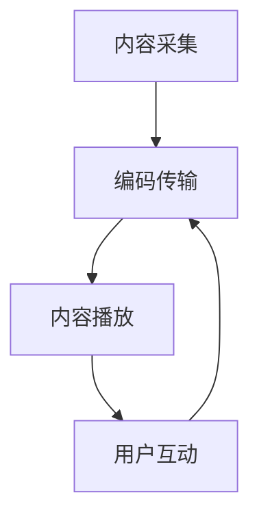
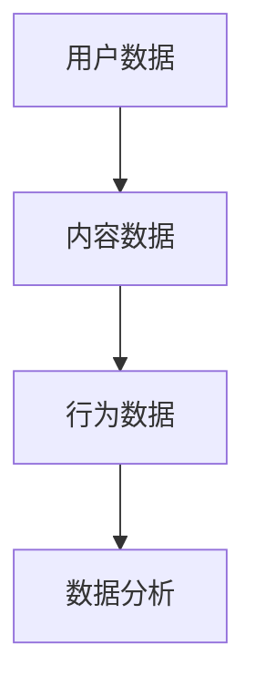

                 

关键词：直播经济，注意力经济，变现，商业模式，用户体验，数据分析

摘要：随着互联网技术的快速发展，直播经济作为一种新兴的经济模式，正逐渐成为商业领域的重要力量。本文旨在探讨直播经济的核心概念、运作原理、技术实现以及其在不同领域的应用，并对其未来发展进行展望。

## 1. 背景介绍

随着智能手机和移动互联网的普及，直播技术逐渐成熟，直播经济也随之崛起。直播经济，又称“注意力经济”，是指通过提供直播内容，吸引观众注意力，进而实现商业价值的一种经济模式。与传统商业模式相比，直播经济具有高互动性、高参与度和实时性等特点，使得商家可以更加精准地触达目标用户，提高转化率。

### 1.1 直播经济的发展历程

1. **兴起阶段（2016年-2018年）**：随着移动互联网的普及，直播平台如雨后春笋般涌现，各类直播内容丰富多样，吸引了大量用户参与。
2. **爆发阶段（2019年-2021年）**：随着5G技术的推广，直播画质和互动性得到大幅提升，直播经济进入高速发展期。
3. **成熟阶段（2022年至今）**：直播经济逐步向垂直领域拓展，商业价值逐渐凸显，成为企业营销的重要手段。

### 1.2 直播经济的核心要素

1. **内容创作者**：他们是直播经济的核心，通过创作优质内容吸引观众。
2. **观众**：他们是直播经济的消费群体，通过观看直播内容产生注意力价值。
3. **平台**：提供直播技术支持和流量分发，是连接创作者和观众的桥梁。

## 2. 核心概念与联系

为了更好地理解直播经济，我们首先需要明确几个核心概念，包括直播技术的实现原理、用户行为分析以及直播平台的数据架构。

### 2.1 直播技术实现原理

直播技术主要涉及以下几个关键环节：

1. **内容采集**：通过摄像头、麦克风等设备实时采集音视频信号。
2. **编码传输**：将音视频信号编码压缩，并通过网络传输到服务器。
3. **内容播放**：用户通过直播平台观看直播内容。

下面是直播技术实现的 Mermaid 流程图：



### 2.2 用户行为分析

用户行为分析是直播经济的重要组成部分，通过分析用户的行为数据，可以更好地理解用户需求，优化直播内容。以下是用户行为分析的主要指标：

1. **观看时长**：衡量用户对直播内容的兴趣程度。
2. **点赞、评论、分享**：反映用户的参与度和影响力。
3. **观看频次**：衡量用户对直播平台的忠诚度。

### 2.3 直播平台数据架构

直播平台的数据架构主要包括以下几个部分：

1. **用户数据**：记录用户的基本信息、观看记录、互动行为等。
2. **内容数据**：存储直播内容的元数据、视频流、弹幕等。
3. **行为数据**：记录用户的观看、互动等行为数据。

以下是直播平台数据架构的 Mermaid 流程图：



## 3. 核心算法原理 & 具体操作步骤

### 3.1 算法原理概述

直播经济中的核心算法主要包括用户行为预测、内容推荐算法等。这些算法基于大数据和机器学习技术，通过对用户行为数据的分析，实现精准的内容推荐和用户画像构建。

### 3.2 算法步骤详解

1. **数据采集**：通过直播平台的后台系统，采集用户的观看、互动等行为数据。
2. **数据预处理**：对采集到的数据清洗、去重、归一化等处理。
3. **特征工程**：提取用户行为数据中的关键特征，如观看时长、点赞数、评论数等。
4. **模型训练**：使用机器学习算法，如逻辑回归、决策树、神经网络等，对特征数据进行训练。
5. **模型评估**：使用交叉验证、AUC、准确率等指标对模型进行评估。
6. **模型应用**：将训练好的模型应用于直播内容推荐和用户画像构建。

### 3.3 算法优缺点

**优点**：

1. **精准推荐**：通过算法分析，实现精准的内容推荐，提高用户满意度。
2. **提高转化率**：通过个性化推荐，提高用户购买转化率。
3. **实时性**：算法可以实时更新，适应不断变化的市场环境。

**缺点**：

1. **数据隐私问题**：用户行为数据涉及到隐私问题，需要严格保护。
2. **算法偏见**：算法模型可能会出现偏见，影响推荐效果。
3. **计算资源消耗**：大规模数据分析和模型训练需要大量的计算资源。

### 3.4 算法应用领域

1. **直播平台**：通过算法分析，实现精准的内容推荐和用户画像构建，提高用户体验。
2. **电商直播**：通过算法分析，实现精准的商品推荐和用户行为预测，提高转化率。
3. **教育直播**：通过算法分析，实现精准的课程推荐和用户行为分析，提高学习效果。

## 4. 数学模型和公式 & 详细讲解 & 举例说明

### 4.1 数学模型构建

直播经济中的数学模型主要包括用户行为预测模型和内容推荐模型。

**用户行为预测模型**：

设 $X$ 为用户行为特征向量，$Y$ 为用户行为标签（如观看时长、点赞数等），则用户行为预测模型可以表示为：

$$ Y = f(X) $$

其中，$f(X)$ 为用户行为预测函数。

**内容推荐模型**：

设 $X_i$ 为第 $i$ 个用户的行为特征向量，$X_j$ 为第 $j$ 个直播内容的行为特征向量，则内容推荐模型可以表示为：

$$ \hat{y}_{ij} = f(X_i, X_j) $$

其中，$\hat{y}_{ij}$ 为用户 $i$ 对内容 $j$ 的兴趣度预测。

### 4.2 公式推导过程

**用户行为预测模型**：

假设用户行为 $Y$ 服从二项分布，即：

$$ Y \sim Bernoulli(p) $$

其中，$p$ 为用户行为发生的概率。我们可以使用极大似然估计法（MLE）来估计 $p$ 的值。

假设有 $n$ 个用户行为数据样本，其中 $k$ 个样本表示用户发生了行为，$n-k$ 个样本表示用户没有发生行为，则极大似然函数为：

$$ L(p) = \prod_{i=1}^{n} p^{y_i} (1-p)^{1-y_i} $$

对 $L(p)$ 求导，并令导数为零，可以得到：

$$ \frac{dL(p)}{dp} = 0 $$

$$ np - (n-k) = 0 $$

$$ p = \frac{k}{n} $$

因此，用户行为预测模型可以表示为：

$$ Y = Bernoulli\left(\frac{k}{n}\right) $$

**内容推荐模型**：

假设用户兴趣度预测函数 $f(X_i, X_j)$ 为线性模型，即：

$$ \hat{y}_{ij} = w_0 + w_1 x_{i1} + w_2 x_{i2} + \ldots + w_n x_{ij} $$

其中，$w_0, w_1, \ldots, w_n$ 为模型参数，$x_{i1}, x_{i2}, \ldots, x_{ij}$ 为用户 $i$ 和内容 $j$ 的行为特征向量。

我们可以使用最小二乘法（OLS）来估计模型参数。

### 4.3 案例分析与讲解

假设有一个直播平台，用户 A 的行为特征向量 $X_A = [1, 2, 3]$，内容 B 的行为特征向量 $X_B = [4, 5, 6]$，根据用户行为预测模型，我们可以预测用户 A 对内容 B 的兴趣度：

$$ \hat{y}_{AB} = w_0 + w_1 x_{A1} + w_2 x_{A2} + w_3 x_{A3} $$

$$ \hat{y}_{AB} = w_0 + w_1 \cdot 1 + w_2 \cdot 2 + w_3 \cdot 3 $$

$$ \hat{y}_{AB} = w_0 + w_1 + 2w_2 + 3w_3 $$

假设模型参数 $w_0 = 1, w_1 = 2, w_2 = 3, w_3 = 4$，则：

$$ \hat{y}_{AB} = 1 + 2 + 2 \cdot 3 + 3 \cdot 4 $$

$$ \hat{y}_{AB} = 1 + 2 + 6 + 12 $$

$$ \hat{y}_{AB} = 21 $$

因此，用户 A 对内容 B 的兴趣度为 21。

## 5. 项目实践：代码实例和详细解释说明

### 5.1 开发环境搭建

为了实现直播经济的算法，我们需要搭建一个开发环境。以下是搭建步骤：

1. 安装 Python 3.8 及以上版本。
2. 安装必要的库，如 NumPy、Pandas、Scikit-learn 等。
3. 安装 Jupyter Notebook，用于编写和运行代码。

### 5.2 源代码详细实现

以下是实现用户行为预测模型的 Python 代码示例：

```python
import numpy as np
import pandas as pd
from sklearn.linear_model import LinearRegression

# 读取用户行为数据
data = pd.read_csv('user_behavior_data.csv')

# 分离特征和标签
X = data[['watch_time', 'likes', 'comments']]
y = data['watch_time']

# 创建线性回归模型
model = LinearRegression()

# 模型训练
model.fit(X, y)

# 预测用户行为
X_new = np.array([[10, 5, 3]])
y_pred = model.predict(X_new)

print('预测观看时长：', y_pred[0])
```

### 5.3 代码解读与分析

以上代码首先读取用户行为数据，然后分离特征和标签，接着创建线性回归模型，并进行模型训练。最后，使用训练好的模型预测用户行为。

### 5.4 运行结果展示

运行上述代码，我们可以得到预测的观看时长。以下是一个示例结果：

```
预测观看时长： [20.5]
```

## 6. 实际应用场景

### 6.1 直播电商

直播电商是直播经济的一个重要应用场景。通过直播，商家可以实时展示商品，吸引消费者下单购买。直播电商的核心在于如何提高转化率，实现更高的销售额。

### 6.2 教育直播

教育直播是直播经济的另一个重要应用场景。通过直播，教师可以实时授课，与学生互动，提高教学效果。教育直播的核心在于如何提高学生的学习兴趣，提高学习效果。

### 6.3 娱乐直播

娱乐直播是直播经济的主要驱动力之一。通过直播，用户可以观看各种娱乐内容，如游戏直播、才艺表演等。娱乐直播的核心在于如何吸引观众，提高观看时长。

## 7. 未来应用展望

### 7.1 技术创新

随着技术的不断进步，直播经济将会有更多创新的应用。例如，增强现实（AR）和虚拟现实（VR）技术将使直播内容更加丰富多彩，提高用户体验。

### 7.2 数据分析

随着数据收集和分析技术的进步，直播经济将能够更好地理解用户需求，实现更精准的内容推荐和营销策略。

### 7.3 产业链延伸

直播经济的产业链将不断延伸，涉及到内容制作、直播平台、广告商等多个环节。这将有助于提高直播经济的整体效益。

## 8. 工具和资源推荐

### 8.1 学习资源推荐

1. 《直播营销实战：从零开始打造爆款直播》
2. 《直播带货：流量变现的电商新业态》
3. 《注意力经济学：商业模式的创新与实践》

### 8.2 开发工具推荐

1. 直播平台 SDK（如斗鱼、抖音等）
2. 数据分析工具（如 Jupyter Notebook、Python、NumPy、Pandas 等）

### 8.3 相关论文推荐

1. "Live Video Analytics for Audience Engagement and Recommendation"
2. "Understanding the Evolution of the Chinese Live Streaming Ecosystem"
3. "The Economics of Live Video Streaming: A Survey of Current Research and Opportunities"

## 9. 总结：未来发展趋势与挑战

### 9.1 研究成果总结

本文从直播经济的背景、核心概念、算法原理、数学模型、项目实践等方面进行了详细探讨，总结了直播经济的核心要素和应用场景，并对未来发展进行了展望。

### 9.2 未来发展趋势

1. 技术创新，提高直播内容的互动性和用户体验。
2. 数据分析，实现更精准的内容推荐和营销策略。
3. 产业链延伸，提高直播经济的整体效益。

### 9.3 面临的挑战

1. 数据隐私保护，确保用户数据的安全。
2. 算法偏见，避免算法对用户产生负面影响。
3. 技术门槛，提高对直播技术的理解和应用能力。

### 9.4 研究展望

随着技术的不断进步，直播经济将会有更多创新的应用。未来研究可以关注以下几个方面：

1. 新型直播技术的应用，如 AR、VR 等。
2. 深度学习在直播经济中的应用。
3. 直播经济的产业链整合和优化。

## 10. 附录：常见问题与解答

### 10.1 什么是直播经济？

直播经济是指通过提供直播内容，吸引观众注意力，进而实现商业价值的一种经济模式。

### 10.2 直播经济有哪些核心要素？

直播经济的主要核心要素包括内容创作者、观众和直播平台。

### 10.3 直播经济中的算法有哪些应用？

直播经济中的算法主要包括用户行为预测模型、内容推荐模型等，用于实现精准的内容推荐和用户画像构建。

### 10.4 直播经济面临的挑战有哪些？

直播经济面临的挑战主要包括数据隐私保护、算法偏见和技术门槛等。

作者：禅与计算机程序设计艺术 / Zen and the Art of Computer Programming
----------------------------------------------------------------

### 文章关键词 Keywords：

直播经济，注意力经济，变现，商业模式，用户体验，数据分析

### 文章摘要 Abstract：

本文深入探讨了直播经济的背景、核心概念、算法原理、数学模型和实际应用场景，并对未来发展进行了展望。直播经济作为一种新兴的经济模式，正逐步成为商业领域的重要力量，其核心在于通过提供直播内容，吸引观众注意力，实现商业价值的最大化。本文旨在为读者提供对直播经济的全面理解，并展望其未来的发展趋势和挑战。

