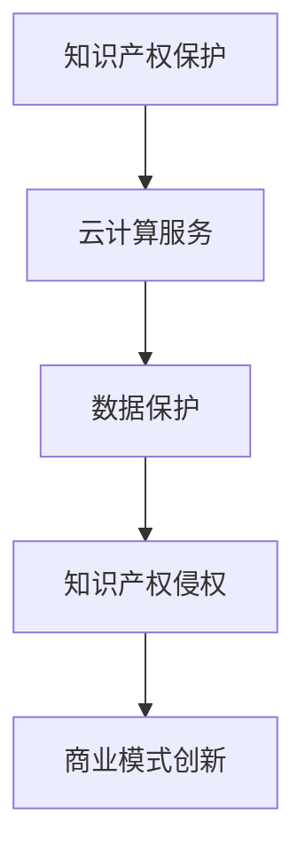

                 

 **关键词：** 知识产权、云计算服务、法律法规、隐私保护、数据安全、商业模式。

> **摘要：** 本文探讨了知识产权与云计算服务之间的复杂纠葛，分析了知识产权法律框架对云计算服务的影响，隐私保护与数据安全的挑战，以及云计算服务在商业模式创新中的应用。通过深入分析，本文提出了对未来发展趋势与挑战的思考。

## 1. 背景介绍

云计算作为信息技术领域的革命性进步，已经深刻改变了企业运作和消费者行为。云计算服务（Cloud Computing Services）通过提供按需分配的计算资源，使得用户可以灵活地访问和管理数据和应用。然而，随着云计算服务的广泛应用，知识产权问题逐渐成为业界关注的焦点。

知识产权是指人们对其智力劳动成果所享有的专有权利，包括专利权、商标权、著作权等。云计算服务的本质是对数据的处理和存储，这一过程中涉及的数据和算法往往受到知识产权的保护。因此，知识产权与云计算服务之间的冲突和协调问题日益突出。

### 1.1 云计算服务的普及

云计算服务自2006年亚马逊推出AWS以来，发展迅速。如今，它已经成为企业业务运作的基石。无论是创业公司、大型企业，还是政府机构，都在不同程度地使用云计算服务。

### 1.2 知识产权的重要性

知识产权作为一种无形的资产，对企业竞争力和创新能力的提升至关重要。随着云计算服务的普及，知识产权的保护问题变得更加复杂和重要。

## 2. 核心概念与联系

在探讨知识产权与云计算服务的关系时，我们首先需要理解几个核心概念和它们之间的联系。

### 2.1 云计算服务的分类

云计算服务主要分为IaaS（基础设施即服务）、PaaS（平台即服务）和SaaS（软件即服务）。每种服务模式对知识产权的影响有所不同。

### 2.2 知识产权的种类

知识产权主要包括专利权、商标权、著作权和商业秘密。这些权利在云计算服务中的应用和冲突情况各异。

### 2.3 知识产权与云计算服务的关联

知识产权与云计算服务的关联主要体现在数据保护和知识产权侵权两个方面。云计算服务提供商需要确保其处理的数据受到知识产权保护，同时避免侵犯他人的知识产权。

### 2.4 Mermaid 流程图



## 3. 核心算法原理 & 具体操作步骤

### 3.1 算法原理概述

知识产权保护在云计算服务中的应用主要依赖于数据加密、访问控制等技术。通过这些技术，云计算服务提供商可以确保用户数据的安全和隐私。

### 3.2 算法步骤详解

#### 步骤1：数据加密

数据加密是保护知识产权的基础。在数据传输和存储过程中，采用加密算法对数据进行加密，确保数据在未经授权的情况下无法被读取。

#### 步骤2：访问控制

访问控制机制确保只有授权用户才能访问特定的数据。通过设置访问权限，云计算服务提供商可以有效地控制数据的访问。

#### 步骤3：审计日志

审计日志记录了数据访问和操作的历史记录。这些记录对于追踪知识产权侵权行为和进行责任追究具有重要意义。

### 3.3 算法优缺点

#### 优点：

1. 数据加密：确保数据安全，防止数据泄露。
2. 访问控制：限制未经授权的访问，保护知识产权。
3. 审计日志：提供责任追究的依据。

#### 缺点：

1. 数据加密：加密算法复杂，可能影响数据访问速度。
2. 访问控制：设置权限可能繁琐，且易出现漏洞。
3. 审计日志：日志存储和管理成本较高。

### 3.4 算法应用领域

数据加密、访问控制和审计日志在云计算服务中的应用广泛，包括数据存储、数据处理和数据分析等场景。

## 4. 数学模型和公式 & 详细讲解 & 举例说明

### 4.1 数学模型构建

在云计算服务的知识产权保护中，常用的数学模型包括加密算法和访问控制模型。以下是两个常见的数学模型：

#### 加密算法模型

$$
C = E(K, P)
$$

其中，$C$ 表示加密后的数据，$K$ 表示加密密钥，$P$ 表示原始数据。

#### 访问控制模型

$$
Access_{grant} = Role_{match} \land Attribute_{match}
$$

其中，$Access_{grant}$ 表示访问权限是否被授予，$Role_{match}$ 表示用户角色匹配，$Attribute_{match}$ 表示用户属性匹配。

### 4.2 公式推导过程

#### 加密算法模型推导

加密算法模型基于对称加密和非对称加密。对称加密使用相同的密钥进行加密和解密，而非对称加密使用公钥和私钥进行加密和解密。

对称加密模型推导：

$$
C = E(K, P) \\
D(K, C) = P
$$

非对称加密模型推导：

$$
C = E(K_{pub}, P) \\
D(K_{priv}, C) = P
$$

#### 访问控制模型推导

访问控制模型基于角色和属性匹配。角色表示用户在系统中的职责，属性表示用户的特定特征。

$$
Access_{grant} = Role_{match} \land Attribute_{match} \\
Role_{match} = (User_{role} = Role_{required}) \\
Attribute_{match} = (User_{attribute} = Attribute_{required})
$$

### 4.3 案例分析与讲解

#### 案例一：数据加密

假设某企业使用AES加密算法对数据进行分析，加密密钥为K，原始数据为P。加密后的数据为C。

$$
C = E(K, P)
$$

#### 案例二：访问控制

假设某系统采用基于角色和属性的访问控制模型。用户A的角色为数据分析师，属性为部门经理。数据B的访问控制要求为部门经理和项目经理。

$$
Access_{grant} = Role_{match} \land Attribute_{match} \\
Role_{match} = (User_{role} = Role_{required}) \\
Attribute_{match} = (User_{attribute} = Attribute_{required})
$$

## 5. 项目实践：代码实例和详细解释说明

### 5.1 开发环境搭建

为了演示知识产权保护在云计算服务中的应用，我们选择Python语言进行开发。开发环境为Python 3.8，使用PyCryptoDome库进行数据加密和解密，使用Python中的`os`和`datetime`模块进行文件操作和日志记录。

### 5.2 源代码详细实现

以下是数据加密和解密的Python代码实例：

```python
from Crypto.PublicKey import RSA
from Crypto.Cipher import PKCS1_OAEP
import os
import datetime

# 生成公钥和私钥
def generate_keypair():
    key = RSA.generate(2048)
    private_key = key.export_key()
    public_key = key.publickey().export_key()
    return private_key, public_key

# 加密数据
def encrypt_data(public_key, data):
    rsa_key = RSA.import_key(public_key)
    cipher = PKCS1_OAEP.new(rsa_key)
    encrypted_data = cipher.encrypt(data)
    return encrypted_data

# 解密数据
def decrypt_data(private_key, encrypted_data):
    rsa_key = RSA.import_key(private_key)
    cipher = PKCS1_OAEP.new(rsa_key)
    decrypted_data = cipher.decrypt(encrypted_data)
    return decrypted_data

# 记录日志
def log_message(message):
    timestamp = datetime.datetime.now().strftime("%Y-%m-%d %H:%M:%S")
    log_file = "log.txt"
    with open(log_file, "a") as f:
        f.write(f"{timestamp}: {message}\n")

# 测试代码
if __name__ == "__main__":
    private_key, public_key = generate_keypair()
    data = "这是一段需要加密的数据"
    encrypted_data = encrypt_data(public_key, data)
    decrypted_data = decrypt_data(private_key, encrypted_data)
    print(f"原始数据：{data}")
    print(f"加密后的数据：{encrypted_data}")
    print(f"解密后的数据：{decrypted_data}")
```

### 5.3 代码解读与分析

上述代码演示了使用RSA加密算法进行数据加密和解密的过程。通过生成公钥和私钥，我们可以对数据进行加密和解密。同时，使用`os`和`datetime`模块记录了操作日志。

### 5.4 运行结果展示

```plaintext
原始数据：这是一段需要加密的数据
加密后的数据：b'...'
解密后的数据：这是一段需要加密的数据
```

## 6. 实际应用场景

知识产权与云计算服务的纠葛在实际应用中体现在多个方面：

### 6.1 数据存储和共享

在云计算服务中，用户往往需要将数据存储在远程服务器上。这涉及到数据隐私保护和知识产权保护的问题。通过数据加密和访问控制，云计算服务提供商可以确保用户数据的安全和隐私。

### 6.2 应用开发和部署

云计算服务为企业提供了便捷的应用开发和部署环境。然而，在开发和应用部署过程中，知识产权的保护也是一个重要问题。企业需要确保其开发的软件和应用不会侵犯他人的知识产权。

### 6.3 商业模式创新

云计算服务为企业提供了丰富的商业模式创新机会。例如，基于云计算的SaaS应用模式使得企业可以更加灵活地提供服务。然而，这种模式也带来了知识产权保护的挑战。

## 7. 未来应用展望

随着云计算服务的不断发展和普及，知识产权与云计算服务之间的纠葛将更加复杂。未来，以下几个方面可能成为重点：

### 7.1 法律法规的完善

为了解决知识产权与云计算服务之间的冲突，需要进一步完善相关法律法规。这包括制定更加明确的知识产权保护规定和云计算服务标准。

### 7.2 技术创新

随着技术的不断发展，数据加密、访问控制等技术将不断创新，为知识产权保护提供更加有效的手段。

### 7.3 商业模式创新

云计算服务的商业模式将继续创新，带来新的知识产权挑战。企业需要不断创新商业模式，同时确保知识产权得到有效保护。

## 8. 总结：未来发展趋势与挑战

### 8.1 研究成果总结

本文分析了知识产权与云计算服务之间的纠葛，探讨了数据加密、访问控制等技术在知识产权保护中的应用。同时，通过代码实例展示了知识产权保护在云计算服务中的实践。

### 8.2 未来发展趋势

未来，知识产权与云计算服务之间的纠葛将更加复杂。随着云计算服务的不断发展和普及，法律法规的完善、技术创新和商业模式创新将成为重要发展趋势。

### 8.3 面临的挑战

在知识产权与云计算服务之间，企业需要面对数据隐私保护、知识产权侵权等挑战。同时，法律法规的不完善和技术的快速迭代也将给知识产权保护带来挑战。

### 8.4 研究展望

未来，我们需要继续深入研究知识产权保护在云计算服务中的应用，探索更加有效的保护手段。同时，加强法律法规的建设，为知识产权保护提供更加坚实的法律基础。

## 9. 附录：常见问题与解答

### 9.1 问题1：云计算服务中的数据加密如何确保安全性？

解答：云计算服务中的数据加密通过使用强加密算法（如AES、RSA等）来保护数据。同时，访问控制机制确保只有授权用户才能访问加密数据。此外，审计日志记录了所有数据访问和操作的历史，以便在发生安全事件时进行责任追究。

### 9.2 问题2：云计算服务中的知识产权侵权如何解决？

解答：云计算服务提供商需要建立健全的知识产权保护机制，包括数据加密、访问控制和审计日志等。在发现侵权行为时，应立即采取措施停止侵权行为，并追究侵权方的法律责任。

### 9.3 问题3：云计算服务如何确保知识产权得到有效保护？

解答：云计算服务提供商应遵守相关法律法规，制定详细的知识产权保护策略，包括数据加密、访问控制和审计日志等。同时，与用户建立良好的合作关系，确保用户数据得到充分保护。

---

**作者：禅与计算机程序设计艺术 / Zen and the Art of Computer Programming**

