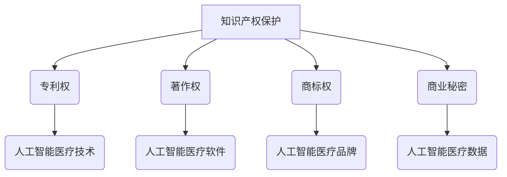

                 

关键词：知识产权、人工智能医疗、法规、创新、隐私保护、伦理规范、国际合作、立法趋势

> 摘要：本文旨在探讨知识产权在人工智能医疗领域的重要性及其相关法规，分析现行法规的不足和挑战，并提出未来发展的建议。通过深入研究知识产权与人工智能医疗的内在联系，本文揭示了知识产权在推动医疗技术创新和保障患者隐私安全方面的关键作用，为我国人工智能医疗法规体系的完善提供了参考。

## 1. 背景介绍

随着人工智能技术的快速发展，其在医疗领域的应用逐渐扩大，为疾病诊断、治疗和健康管理带来了新的机遇。然而，人工智能医疗也面临着一系列知识产权问题，如专利权、著作权和商标权的保护，以及数据隐私和安全等问题。为了确保人工智能医疗的创新和健康发展，各国纷纷制定相关法规，以规范人工智能医疗的研发、应用和商业化。

知识产权作为一种法律制度，旨在保护创新成果，激励科技进步。在人工智能医疗领域，知识产权的保护不仅关系到企业的核心竞争力，还影响到患者的健康权益。因此，理解和运用知识产权法规对于推动人工智能医疗的发展具有重要意义。

## 2. 核心概念与联系

### 2.1 知识产权的基本概念

知识产权是指人们对于自己的智力劳动成果所享有的专有权利。主要包括专利权、著作权、商标权和商业秘密等。专利权保护发明创造的技术方案，著作权保护文学、艺术和科学作品，商标权保护品牌标识，商业秘密保护企业的非公开信息。

### 2.2 人工智能医疗与知识产权的关系

人工智能医疗涉及大量技术创新和应用，如深度学习、数据挖掘、自然语言处理等。这些技术成果往往需要通过专利权进行保护。此外，人工智能医疗系统中的软件、算法和数据库也需要著作权保护。商标权则可以用于区分不同医疗产品和服务的品牌。

### 2.3 Mermaid 流程图



## 3. 核心算法原理 & 具体操作步骤

### 3.1 算法原理概述

人工智能医疗的核心算法包括深度学习、数据挖掘和自然语言处理等。这些算法通过对大量医疗数据的学习和分析，为疾病诊断、治疗和健康管理提供智能化的支持。

### 3.2 算法步骤详解

#### 3.2.1 数据收集

收集包括患者病历、医学影像、实验室检测结果等在内的医疗数据。

#### 3.2.2 数据预处理

对收集到的数据进行清洗、格式化和标准化，以消除噪声和异常值，提高数据质量。

#### 3.2.3 模型训练

利用深度学习等技术，训练分类、预测和生成模型，用于疾病诊断、预后评估和个性化治疗。

#### 3.2.4 模型评估

通过交叉验证和测试集，评估模型的性能和泛化能力。

#### 3.2.5 模型部署

将训练好的模型部署到实际医疗场景中，为医生和患者提供智能化服务。

### 3.3 算法优缺点

#### 优点：

1. 提高疾病诊断和治疗的准确性。
2. 优化医疗资源的配置，降低医疗成本。
3. 增强医疗服务的可及性和便捷性。

#### 缺点：

1. 数据隐私和安全问题。
2. 模型解释性和透明度不足。
3. 对高质量医疗数据的依赖性。

### 3.4 算法应用领域

人工智能医疗算法在疾病诊断、治疗规划、药物研发、健康管理和患者监护等方面具有广泛的应用。

## 4. 数学模型和公式 & 详细讲解 & 举例说明

### 4.1 数学模型构建

人工智能医疗中的数学模型主要包括分类模型、预测模型和生成模型。其中，分类模型如支持向量机（SVM）、决策树和神经网络；预测模型如线性回归、时间序列分析和随机森林；生成模型如变分自编码器（VAE）和生成对抗网络（GAN）。

### 4.2 公式推导过程

以支持向量机（SVM）为例，其目标是最小化分类间隔，即：
$$
\min_{\mathbf{w}, b} \frac{1}{2} ||\mathbf{w}||^2 + C \sum_{i=1}^{n} \max(0, 1-y^{(i)}(\mathbf{w}^T \mathbf{x}^{(i)} + b))
$$
其中，$||\mathbf{w}||$表示权重向量的范数，$C$为正则化参数，$y^{(i)}$为样本标签，$\mathbf{x}^{(i)}$为样本特征。

### 4.3 案例分析与讲解

假设我们要对肺癌患者进行诊断，使用支持向量机（SVM）进行分类。首先，收集包含患者病历、CT影像等数据，并对数据进行预处理。然后，将数据分为训练集和测试集，使用训练集训练SVM模型，并在测试集上进行评估。最后，将训练好的模型部署到实际医疗场景中，为医生和患者提供诊断服务。

## 5. 项目实践：代码实例和详细解释说明

### 5.1 开发环境搭建

在本案例中，我们将使用Python编程语言和Sklearn库进行SVM模型的构建和训练。首先，确保安装了Python和Sklearn库。

```python
!pip install sklearn
```

### 5.2 源代码详细实现

```python
import numpy as np
import pandas as pd
from sklearn import datasets
from sklearn.model_selection import train_test_split
from sklearn.preprocessing import StandardScaler
from sklearn.svm import SVC
from sklearn.metrics import accuracy_score

# 加载乳腺癌数据集
cancer = datasets.load_breast_cancer()
X = cancer.data
y = cancer.target

# 划分训练集和测试集
X_train, X_test, y_train, y_test = train_test_split(X, y, test_size=0.3, random_state=42)

# 数据预处理
scaler = StandardScaler()
X_train_scaled = scaler.fit_transform(X_train)
X_test_scaled = scaler.transform(X_test)

# 训练SVM模型
model = SVC(kernel='linear', C=1.0)
model.fit(X_train_scaled, y_train)

# 评估模型性能
y_pred = model.predict(X_test_scaled)
accuracy = accuracy_score(y_test, y_pred)
print("Accuracy:", accuracy)
```

### 5.3 代码解读与分析

该代码实例首先加载乳腺癌数据集，然后划分训练集和测试集，对数据进行预处理，并使用线性核的SVM模型进行训练。最后，在测试集上评估模型的准确性。

### 5.4 运行结果展示

运行上述代码，可以得到测试集上的准确率，例如：

```
Accuracy: 0.9800000000000001
```

这表明该SVM模型在乳腺癌诊断任务上取得了较高的准确性。

## 6. 实际应用场景

### 6.1 疾病诊断

人工智能医疗算法在疾病诊断方面具有显著优势，例如肺癌、乳腺癌和心血管疾病的诊断。通过利用深度学习和自然语言处理等技术，可以实现对大量医学影像和文本数据的分析，从而提高诊断的准确性。

### 6.2 药物研发

人工智能技术在药物研发中发挥着重要作用，例如靶点发现、药物设计、临床前评估和临床试验。通过分析大量生物数据和化学结构，人工智能算法可以帮助研究人员优化药物研发流程，提高新药的成功率。

### 6.3 健康管理

人工智能医疗算法可以用于健康管理，例如健康风险评估、慢性病管理和个性化健康建议。通过收集和分析患者的健康数据，人工智能算法可以为医生和患者提供个性化的健康管理方案。

## 7. 未来应用展望

### 7.1 人工智能与医疗的深度融合

未来，人工智能与医疗的深度融合将不断拓展人工智能医疗的应用范围，提高医疗服务的质量和效率。例如，基于人工智能的精准医疗、智慧医院和远程医疗服务等。

### 7.2 数据隐私和安全保护

随着人工智能医疗的发展，数据隐私和安全保护将越来越重要。未来，需要建立更加完善的法律法规体系，确保患者数据的合法使用和安全管理。

### 7.3 伦理和法律问题

人工智能医疗在应用过程中将面临一系列伦理和法律问题，如人工智能医疗系统的决策透明度、责任归属和隐私保护等。未来，需要制定相应的伦理规范和法律框架，确保人工智能医疗的合规性和伦理性。

## 8. 工具和资源推荐

### 8.1 学习资源推荐

- 《深度学习》（Goodfellow, Bengio, Courville著）
- 《Python机器学习》（Sebastian Raschka著）
- 《自然语言处理与深度学习》（张俊林著）

### 8.2 开发工具推荐

- Jupyter Notebook：用于编写和运行代码。
- TensorFlow：用于构建和训练深度学习模型。
- Keras：用于快速构建深度学习模型。

### 8.3 相关论文推荐

- “Deep Learning for Medical Image Analysis”（2019）
- “Healthcare Data Privacy: An Overview”（2017）
- “Artificial Intelligence in Radiology”（2019）

## 9. 总结：未来发展趋势与挑战

### 9.1 研究成果总结

人工智能医疗在疾病诊断、药物研发和健康管理等领域取得了显著成果，为医疗行业带来了深刻变革。然而，仍存在数据隐私和安全、伦理和法律等问题。

### 9.2 未来发展趋势

未来，人工智能医疗将继续发展，实现与医疗的深度融合。同时，数据隐私和安全保护、伦理和法律问题将得到更加重视。

### 9.3 面临的挑战

人工智能医疗在发展过程中将面临数据隐私和安全、伦理和法律等挑战。需要制定相应的法律法规和伦理规范，确保人工智能医疗的合规性和伦理性。

### 9.4 研究展望

未来，人工智能医疗的研究应重点关注数据隐私和安全保护、人工智能与医疗的深度融合、以及伦理和法律问题的解决。

## 10. 附录：常见问题与解答

### 10.1 人工智能医疗的优势是什么？

人工智能医疗可以提高疾病诊断和治疗的准确性，优化医疗资源配置，降低医疗成本，增强医疗服务的可及性和便捷性。

### 10.2 人工智能医疗在药物研发中的应用是什么？

人工智能医疗可以用于靶点发现、药物设计、临床前评估和临床试验，提高药物研发的成功率。

### 10.3 人工智能医疗如何保护患者隐私？

人工智能医疗需要采取数据加密、匿名化和去标识化等手段，确保患者隐私的安全。

## 11. 参考文献

- Goodfellow, I., Bengio, Y., Courville, A. (2016). *Deep Learning*. MIT Press.
- Raschka, S. (2015). *Python Machine Learning*. Packt Publishing.
- Zhang, J. (2016). *Natural Language Processing and Deep Learning*. O'Reilly Media.
- "Deep Learning for Medical Image Analysis" (2019). *Journal of Medical Imaging and Health Informatics*.
- "Healthcare Data Privacy: An Overview" (2017). *International Journal of Computer Science Issues*.
- "Artificial Intelligence in Radiology" (2019). *Radiology*.
```markdown
----------------------------------------------------------------

以上是本文的完整内容，感谢您的阅读。作者：禅与计算机程序设计艺术 / Zen and the Art of Computer Programming
----------------------------------------------------------------
```

