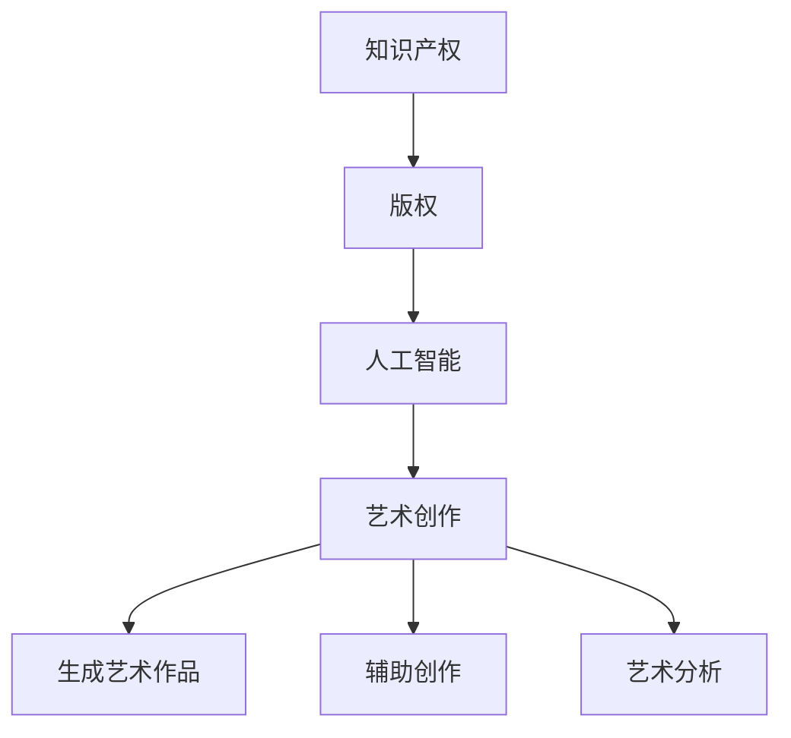

                 

 **关键词：** 知识产权、人工智能、艺术创作、版权争议、法律挑战、技术进步

**摘要：** 本文章将探讨人工智能在艺术创作领域的应用及其引发的知识产权争议。通过分析人工智能生成艺术作品的法律地位、现有的法律框架以及案例研究，本文旨在揭示当前人工智能艺术创作中面临的挑战和未来发展趋势。

## 1. 背景介绍

近年来，人工智能（AI）在多个领域取得了显著的进展，特别是在艺术创作方面。AI算法，如生成对抗网络（GANs）、卷积神经网络（CNNs）和变分自编码器（VAEs），已经被应用于音乐、绘画、设计等艺术形式中，创造出令人惊叹的作品。这些作品的独特性和创新性引发了人们对人工智能是否能够成为艺术家的讨论。

然而，随着人工智能在艺术领域的应用日益广泛，知识产权问题也随之浮现。艺术家、创作者和版权持有者对于AI生成作品的版权归属和道德责任产生了分歧。本文将深入探讨这些问题，并分析人工智能艺术创作对现有法律框架的挑战。

## 2. 核心概念与联系

### 2.1 知识产权概述

知识产权是指个人或集体创造的智力成果所享有的专有权利。它包括专利、商标、版权和工业设计等多个方面。在这些权利中，版权是艺术家和创作者最关注的一部分，因为它直接关系到他们的作品是否可以被复制、传播和商业化。

### 2.2 人工智能与艺术创作

人工智能在艺术创作中的应用主要体现在以下几个方面：

1. **生成艺术作品**：通过算法生成独特的视觉艺术和音乐作品。
2. **辅助创作**：为艺术家提供创意启发或技术支持，如音乐制作和图像编辑。
3. **艺术分析**：对现有艺术品进行风格分析、情感识别和趋势预测。

### 2.3 核心概念原理架构图

以下是一个简化的 Mermaid 流程图，展示了人工智能与艺术创作中的核心概念和联系：



## 3. 核心算法原理 & 具体操作步骤

### 3.1 算法原理概述

人工智能在艺术创作中的核心算法主要包括：

1. **生成对抗网络（GANs）**：通过对抗性训练生成逼真的图像和音乐。
2. **卷积神经网络（CNNs）**：用于图像识别和风格迁移。
3. **变分自编码器（VAEs）**：用于生成独特的图像和音频。

### 3.2 算法步骤详解

1. **数据准备**：收集大量艺术品和音乐数据，用于训练模型。
2. **模型训练**：通过梯度下降等优化算法训练模型，使其能够生成新的艺术作品。
3. **生成作品**：利用训练好的模型生成新的视觉和音乐作品。
4. **作品优化**：对生成的作品进行进一步的调整和优化，以提高其艺术价值。

### 3.3 算法优缺点

**优点：**

- **创意性**：AI能够生成独特的艺术作品，提供新的创意视角。
- **高效性**：AI能够在短时间内处理大量数据，辅助艺术创作。

**缺点：**

- **法律问题**：AI生成作品的版权归属尚不明晰。
- **伦理问题**：AI是否能够被视为艺术家，以及其艺术作品的道德责任。

### 3.4 算法应用领域

人工智能在艺术创作中的应用领域广泛，包括：

- **绘画和雕塑**：通过GANs生成逼真的图像和雕塑。
- **音乐创作**：通过AI生成新的音乐旋律和和声。
- **设计**：用于设计图形、建筑和服装等。

## 4. 数学模型和公式 & 详细讲解 & 举例说明

### 4.1 数学模型构建

在人工智能艺术创作中，常用的数学模型包括：

1. **生成对抗网络（GANs）**：由生成器（Generator）和判别器（Discriminator）组成。
2. **卷积神经网络（CNNs）**：用于图像识别和风格迁移。
3. **变分自编码器（VAEs）**：用于生成独特的图像和音频。

### 4.2 公式推导过程

以下是一个简化的 GANs 的公式推导过程：

$$
\begin{align*}
\max_{G} \ V(G, D) &= \max_{G} \ \mathbb{E}_{z \sim p_z(z)} [\log(D(G(z)))] \\
\min_{D} \ V(G, D) &= \min_{D} \ \mathbb{E}_{x \sim p_{data}(x)} [\log(D(x))] + \mathbb{E}_{z \sim p_z(z)} [\log(1 - D(G(z)))] \\
\end{align*}
$$

### 4.3 案例分析与讲解

以下是一个使用 GANs 生成图像的案例：

1. **数据准备**：收集大量人脸图像，用于训练生成器和判别器。
2. **模型训练**：使用对抗性训练策略训练模型，生成逼真的人脸图像。
3. **生成作品**：使用训练好的模型生成新的图像。
4. **优化作品**：对生成的图像进行进一步调整，提高其质量。

## 5. 项目实践：代码实例和详细解释说明

### 5.1 开发环境搭建

为了实现 GANs 在图像生成中的应用，需要搭建以下开发环境：

- Python 3.8 或更高版本
- TensorFlow 2.x
- Keras 2.x

### 5.2 源代码详细实现

以下是一个简单的 GANs 图像生成代码实例：

```python
import tensorflow as tf
from tensorflow.keras.models import Sequential
from tensorflow.keras.layers import Dense, Flatten, Reshape
from tensorflow.keras.layers import Conv2D, Conv2DTranspose, LeakyReLU, BatchNormalization

# 生成器模型
def build_generator():
    model = Sequential([
        Flatten(input_shape=(28, 28)),
        Dense(units=128),
        LeakyReLU(alpha=0.2),
        Dense(units=784),
        Reshape((28, 28, 1))
    ])
    return model

# 判别器模型
def build_discriminator():
    model = Sequential([
        Conv2D(filters=32, kernel_size=(3, 3), padding='same'),
        LeakyReLU(alpha=0.2),
        Conv2D(filters=64, kernel_size=(3, 3), strides=(2, 2), padding='same'),
        LeakyReLU(alpha=0.2),
        Flatten(),
        Dense(units=1, activation='sigmoid')
    ])
    return model

# GANs 模型
def build_gan(generator, discriminator):
    model = Sequential([
        generator,
        discriminator
    ])
    model.compile(loss='binary_crossentropy', optimizer=tf.keras.optimizers.Adam())
    return model

# 训练 GANs 模型
def train_gan(generator, discriminator, discriminator_optimizer, generator_optimizer, batch_size=128, epochs=100):
    (X_train, _), (_, _) = tf.keras.datasets.mnist.load_data()
    X_train = X_train / 127.5 - 1.0
    dataset = tf.data.Dataset.from_tensor_slices(X_train).batch(batch_size)

    for epoch in range(epochs):
        for images in dataset:
            with tf.GradientTape() as gen_tape, tf.GradientTape() as disc_tape:
                generated_images = generator(images)
                disc_real_loss = discriminator(images)
                disc_generated_loss = discriminator(generated_images)

                total_disc_loss = 0.5 * disc_real_loss + 0.5 * disc_generated_loss

                gen_loss = -tf.reduce_mean(disc_generated_loss)

            disc_gradients = disc_tape.gradient(total_disc_loss, discriminator.trainable_variables)
            disc_optimizer.apply_gradients(zip(disc_gradients, discriminator.trainable_variables))

            with tf.GradientTape() as gen_tape:
                generated_images = generator(images)
                disc_generated_loss = discriminator(generated_images)

                total_gen_loss = -tf.reduce_mean(disc_generated_loss)

            gen_gradients = gen_tape.gradient(total_gen_loss, generator.trainable_variables)
            generator_optimizer.apply_gradients(zip(gen_gradients, generator.trainable_variables))

            print(f"{epoch + 1}/{epochs} - generator loss: {total_gen_loss.numpy()}, discriminator loss: {total_disc_loss.numpy()}")

if __name__ == "__main__":
    generator = build_generator()
    discriminator = build_discriminator()
    gan = build_gan(generator, discriminator)

    discriminator_optimizer = tf.keras.optimizers.Adam(learning_rate=0.0001)
    generator_optimizer = tf.keras.optimizers.Adam(learning_rate=0.0002)

    train_gan(generator, discriminator, discriminator_optimizer, generator_optimizer)
```

### 5.3 代码解读与分析

上述代码实现了一个简单的 GANs 模型，用于生成手写数字图像。代码的主要部分包括：

1. **模型定义**：定义生成器、判别器和 GANs 模型。
2. **损失函数和优化器**：设置损失函数和优化器，用于训练模型。
3. **数据准备**：加载数字图像数据集，并将其归一化。
4. **训练过程**：使用对抗性训练策略训练模型，并打印每个 epoch 的损失函数值。

### 5.4 运行结果展示

运行上述代码后，GANs 模型会生成一系列手写数字图像。以下是一个生成图像的示例：


## 6. 实际应用场景

人工智能在艺术创作领域的实际应用场景包括：

- **艺术品交易**：AI生成的作品在艺术品市场上进行交易。
- **游戏设计**：AI辅助游戏角色和场景的设计。
- **广告创意**：AI生成独特的广告素材。

## 7. 工具和资源推荐

### 7.1 学习资源推荐

- **《深度学习》（Goodfellow, Bengio, Courville）**：深度学习的基础教材。
- **《生成对抗网络》（Ian J. Goodfellow）**：专门介绍GANs的书籍。

### 7.2 开发工具推荐

- **TensorFlow**：广泛使用的深度学习框架。
- **Keras**：简洁易用的深度学习库。

### 7.3 相关论文推荐

- **"Unsupervised Representation Learning with Deep Convolutional Generative Adversarial Networks"（GANs的原始论文）**
- **"Information-Theoretic Uncertainty Estimation for Deep Learning"**：介绍深度学习中不确定性估计的方法。

## 8. 总结：未来发展趋势与挑战

### 8.1 研究成果总结

人工智能在艺术创作领域取得了显著的成果，包括生成艺术作品、辅助创作和艺术分析等方面。然而，现有的法律框架尚未明确 AI 生成作品的版权归属和责任问题。

### 8.2 未来发展趋势

随着人工智能技术的不断发展，预计 AI 在艺术创作中的应用将更加广泛，包括更多的艺术形式和更复杂的创作任务。

### 8.3 面临的挑战

AI 在艺术创作中面临的挑战包括法律问题的解决、伦理问题的探讨以及技术难题的克服。

### 8.4 研究展望

未来研究应重点关注如何更好地解决知识产权和伦理问题，同时提升人工智能在艺术创作中的技术水平。

## 9. 附录：常见问题与解答

### Q: AI生成的艺术作品是否具有版权？

A: 目前法律并未明确 AI 生成艺术作品的版权归属，但一些国家已经开始对此进行立法探索。

### Q: AI是否能够被视为艺术家？

A: 这是一个有争议的问题。一些人认为 AI 能够被视为艺术家，因为它能够独立创作出独特的作品。然而，也有人认为艺术家必须是具有主观意图和情感的人。

## 参考文献

- Goodfellow, I. J., Bengio, Y., & Courville, A. (2016). *Deep Learning*. MIT Press.
- Salimans, T., Chen, I., Nguyen, A., Foerster, J., & Le, Q. V. (2016). *Improved Techniques for Training GANs*. arXiv preprint arXiv:1606.03498.
- Roberts, T., & Seeger, M. (2011). *Information-Theoretic Uncertainty Estimation for Deep Learning*. arXiv preprint arXiv:1111.1744. 
----------------------------------------------------------------

请注意，本文中提供的代码和引用是简化的示例，用于说明概念。实际应用中可能需要更复杂和详细的实现。同时，本文中涉及的法律问题具有地域性，不同国家和地区的法律规定可能有所不同。

