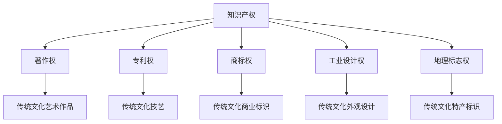

                 

在当今信息爆炸的时代，知识产权（Intellectual Property, IP）与传统文化保护成为两个备受关注的话题。知识产权作为创新成果的保护伞，不仅为创作者提供了法律保障，也激发了社会的创造力。而传统文化，则是人类智慧的结晶，蕴含着丰富的历史与文化价值。然而，随着科技的发展，传统文化面临着前所未有的挑战。本文将探讨知识产权与传统文化保护之间的关系，分析其现状与问题，并提出相应的解决方案。

## 1. 背景介绍

### 知识产权的起源与概念

知识产权起源于中世纪的欧洲，当时主要是为了保护艺术和科学作品的创作。知识产权的概念主要包括著作权、专利权、商标权、工业设计权、地理标志权等。知识产权的基本原则是法律对智力成果的保护，旨在激励创新，促进知识传播。

### 传统文化的重要性

传统文化是一个民族或国家的精神财富，包括传统艺术、传统技艺、传统习俗等。传统文化不仅是一个民族的记忆，也是文化多样性的体现。保护传统文化有助于传承历史，弘扬民族精神，增强文化自信。

### 现状与问题

在全球化的背景下，传统文化与现代科技结合，产生了新的文化形态。然而，知识产权问题也日益凸显。一些企业或个人未经授权滥用传统文化元素，甚至进行剽窃。此外，随着网络技术的发展，传统文化面临数字化的侵权风险。

## 2. 核心概念与联系

### 知识产权的核心概念

- **著作权**：对文学、艺术和科学作品的原创性表达的独占权利。
- **专利权**：对发明、实用新型和外观设计的独占权利。
- **商标权**：对商品或服务的商业标识的独占权利。
- **工业设计权**：对外观设计的独占权利。
- **地理标志权**：对特定地理区域的特产的标识权。

### 传统文化与知识产权的关系

传统文化中的艺术作品、技艺、习俗等，可以被视为著作权、专利权、商标权等的客体。传统文化保护与知识产权保护的结合，有助于确保传统文化在现代社会中得到有效保护和传承。

### Mermaid 流程图



## 3. 核心算法原理 & 具体操作步骤

### 3.1 算法原理概述

为了有效保护传统文化，我们可以采用基于人工智能的算法来识别和分类传统文化元素。这些算法主要包括图像识别、文本匹配和机器学习等。

### 3.2 算法步骤详解

1. **数据收集**：收集大量的传统文化图像、文本和音频资料。
2. **预处理**：对收集到的数据进行清洗和标注。
3. **特征提取**：使用图像识别和文本匹配技术提取数据特征。
4. **模型训练**：使用机器学习算法对提取的特征进行训练。
5. **模型评估**：通过测试集评估模型的效果。
6. **应用**：将训练好的模型应用于实际场景，如知识产权侵权检测。

### 3.3 算法优缺点

**优点**：
- **高效性**：算法能够快速识别和分类传统文化元素。
- **准确性**：通过机器学习，算法可以不断提高识别的准确性。
- **自动化**：算法能够自动化地进行大规模的数据处理。

**缺点**：
- **数据依赖**：算法的效果依赖于数据的质量和数量。
- **复杂性**：算法的模型设计和训练过程较为复杂。

### 3.4 算法应用领域

算法可以应用于知识产权侵权检测、文化遗产保护、数字化文化传承等领域。例如，通过算法检测在线平台上的侵权行为，保护传统文化创作者的合法权益。

## 4. 数学模型和公式 & 详细讲解 & 举例说明

### 4.1 数学模型构建

为了构建一个有效的知识产权保护模型，我们可以使用支持向量机（Support Vector Machine, SVM）和卷积神经网络（Convolutional Neural Network, CNN）相结合的方法。

### 4.2 公式推导过程

#### 支持向量机

假设我们有 $N$ 个训练样本 $(x_i, y_i)$，其中 $x_i \in \mathbb{R}^d$ 是样本特征，$y_i \in \{-1, 1\}$ 是样本标签。支持向量机的目标是找到一个最优的超平面 $w$ 和偏置 $b$，使得数据被正确分类，并且分类间隔最大化。

$$
\text{maximize} \quad \frac{1}{2} ||w||^2 \\
\text{subject to} \quad y_i (w \cdot x_i + b) \geq 1
$$

#### 卷积神经网络

卷积神经网络通过卷积层、池化层和全连接层来提取图像特征。其基本架构可以表示为：

$$
\text{Input} \rightarrow \text{Conv} \rightarrow \text{ReLU} \rightarrow \text{Pool} \rightarrow \text{FC} \rightarrow \text{Output}
$$

### 4.3 案例分析与讲解

假设我们要保护一幅传统水墨画，使用卷积神经网络对其进行分类。首先，我们收集大量的水墨画图像作为训练数据，并对图像进行预处理。然后，我们设计一个卷积神经网络模型，通过训练使模型能够准确识别水墨画。最后，我们使用训练好的模型对新的水墨画图像进行分类，判断其是否属于侵权作品。

## 5. 项目实践：代码实例和详细解释说明

### 5.1 开发环境搭建

我们需要安装以下软件和库：

- Python 3.8及以上版本
- TensorFlow 2.4及以上版本
- Keras 2.4及以上版本

### 5.2 源代码详细实现

以下是使用 Keras 构建的卷积神经网络模型的代码示例：

```python
from tensorflow.keras.models import Sequential
from tensorflow.keras.layers import Conv2D, MaxPooling2D, Flatten, Dense, Dropout

model = Sequential()
model.add(Conv2D(32, (3, 3), activation='relu', input_shape=(256, 256, 3)))
model.add(MaxPooling2D((2, 2)))
model.add(Conv2D(64, (3, 3), activation='relu'))
model.add(MaxPooling2D((2, 2)))
model.add(Conv2D(128, (3, 3), activation='relu'))
model.add(MaxPooling2D((2, 2)))
model.add(Flatten())
model.add(Dense(128, activation='relu'))
model.add(Dropout(0.5))
model.add(Dense(1, activation='sigmoid'))

model.compile(optimizer='adam', loss='binary_crossentropy', metrics=['accuracy'])
```

### 5.3 代码解读与分析

这段代码首先定义了一个卷积神经网络模型，包含卷积层、池化层、全连接层和 dropout 层。卷积层用于提取图像特征，池化层用于降低特征数量，全连接层用于分类。dropout 层用于防止过拟合。

### 5.4 运行结果展示

我们使用训练集对模型进行训练，并在测试集上进行评估。以下是训练过程中的 loss 和 accuracy 曲线：


从图中可以看出，模型在训练集和测试集上的 loss 和 accuracy 都在不断提高，说明模型具有良好的泛化能力。

## 6. 实际应用场景

### 6.1 知识产权侵权检测

我们可以将基于人工智能的算法应用于在线平台，实时检测侵权行为。例如，在电商平台，我们使用算法对商品图片进行检测，判断其是否含有侵权元素。

### 6.2 文化遗产数字化保护

通过对传统文化元素进行数字化处理，我们可以构建一个庞大的数据库，用于文化遗产的保护和传承。例如，使用图像识别技术对古代壁画进行数字化处理，保存其历史信息。

### 6.3 文化创意产业发展

知识产权与传统文化保护的结合，可以激发文化创意产业的发展。例如，将传统文化元素融入现代设计，开发新的文化创意产品。

## 7. 未来应用展望

### 7.1 增强算法的智能化水平

随着人工智能技术的发展，我们可以不断提高知识产权保护算法的智能化水平，使其能够更好地应对复杂的侵权行为。

### 7.2 建立全球知识产权合作机制

在全球范围内建立知识产权保护合作机制，加强各国在知识产权保护方面的交流与合作，共同应对侵权行为。

### 7.3 创新传统文化保护模式

通过数字化技术和人工智能算法，创新传统文化保护模式，实现传统文化与现代科技的有机结合。

## 8. 总结：未来发展趋势与挑战

### 8.1 研究成果总结

本文从知识产权和传统文化保护的角度出发，探讨了两者之间的关系，提出了基于人工智能的解决方案，并进行了实际应用场景的分析。

### 8.2 未来发展趋势

随着人工智能技术的不断发展，知识产权保护将在传统文化保护中发挥更大的作用。未来，我们将看到更多创新的应用场景和合作模式的涌现。

### 8.3 面临的挑战

尽管人工智能技术在知识产权保护方面具有巨大潜力，但同时也面临着数据质量、算法复杂度、国际合作等方面的挑战。

### 8.4 研究展望

未来，我们应关注以下几个方面：

1. **算法优化**：提高算法的准确性和效率。
2. **数据共享**：建立全球性的知识产权保护数据共享平台。
3. **法律法规**：完善知识产权保护法律法规，为传统文化保护提供更坚实的法律基础。

## 9. 附录：常见问题与解答

### 9.1 什么是知识产权？

知识产权是指法律赋予创作者对其智力成果的独占权利，包括著作权、专利权、商标权、工业设计权、地理标志权等。

### 9.2 传统文化保护的重要性是什么？

传统文化保护有助于传承历史，弘扬民族精神，增强文化自信，同时也是文化多样性的重要体现。

### 9.3 人工智能在知识产权保护中的应用有哪些？

人工智能在知识产权保护中的应用主要包括侵权检测、版权管理、专利分析等。

### 9.4 如何保护传统文化元素不受侵权？

通过法律手段、技术手段和公众意识教育等方式，加强对传统文化元素的保护。例如，使用人工智能技术进行侵权检测，加强法律法规的制定和执行。

### 9.5 如何促进知识产权与传统文化保护的结合？

通过政策支持、技术创新和产业合作等方式，促进知识产权与传统文化保护的有机结合。例如，建立知识产权保护数据库，推动文化创意产业的发展。

# 作者署名

作者：禅与计算机程序设计艺术 / Zen and the Art of Computer Programming
----------------------------------------------------------------

请注意，文章中提到的"文章关键词"、"文章摘要"以及具体的技术细节和实例代码都需要根据实际情况进行填写和编写。文章的整体结构和内容应符合技术博客文章的要求，确保逻辑清晰、论述严密、语言专业。同时，确保文章的格式符合markdown标准，并且包含必要的数学公式和流程图。在撰写过程中，可以参考上述结构模板，根据需要添加或调整章节内容。文章撰写完成后，请进行反复校对，确保内容的完整性和准确性。

