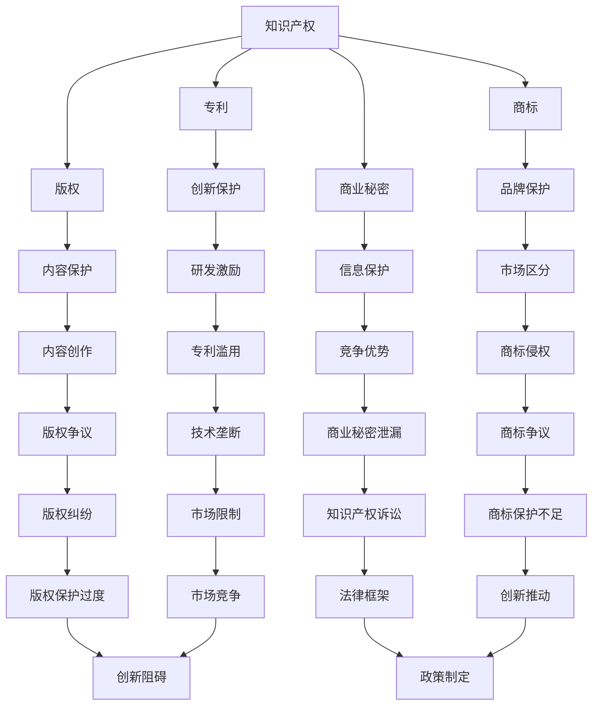

                 

 关键词：知识产权、开源运动、博弈、技术发展、创新、许可协议、法律框架、社区合作、开放性、商业利益。

> 摘要：本文旨在探讨知识产权（IPR）与开源运动之间的复杂关系，分析两者在技术发展、创新和商业利益上的博弈，以及这一博弈对未来技术趋势和产业变革的深远影响。

## 1. 背景介绍

知识产权（Intellectual Property Rights，IPR）是法律上赋予知识产品所有者某些权利的一种法律体系。它涵盖了专利、版权、商标和商业秘密等多个方面。专利保护发明，版权保护文学、艺术和科学作品，商标保护品牌的识别性，商业秘密则是保护未公开的信息。

开源运动（Open Source Movement）起源于20世纪90年代，其核心是软件开发中的一种模式，即允许用户自由地使用、研究、修改和分发软件。这种模式的兴起，源于对传统封闭软件商业模式的质疑，以及对技术共享和快速迭代的需求。

知识产权与开源运动看似存在矛盾，因为前者强调独占和控制，而后者强调共享和开放。然而，两者在技术发展和创新中扮演着不同的角色，且在某些方面存在共生关系。

## 2. 核心概念与联系

下面我们将使用Mermaid流程图来描述知识产权与开源运动之间的关系。



### 2.1 知识产权的核心概念

- **专利**：授予发明者在一定时间内对发明的独占权。
- **版权**：保护文学、艺术和科学作品的对原创表达的权利。
- **商标**：用于识别商品或服务的标志。
- **商业秘密**：保护未公开的商业信息。

### 2.2 开源运动的核心概念

- **共享**：开源运动强调代码的共享和协作，允许用户自由使用、修改和分发软件。
- **透明**：开源项目的代码通常是公开的，使得开发者可以审查和改进代码。
- **协作**：开源项目通过社区合作实现快速迭代和高质量的产品。

## 3. 核心算法原理 & 具体操作步骤

### 3.1 算法原理概述

知识产权与开源运动之间的博弈，可以看作是一个复杂的多方博弈问题。在这一博弈中，涉及的利益方包括软件开发者、企业、社区以及政府。各方在知识产权保护、共享与创新之间寻求平衡。

- **开发者**：希望通过知识产权获得经济利益和声誉。
- **企业**：需要平衡开源和封闭源代码之间的利益。
- **社区**：期望通过开源项目实现技术共享和快速迭代。
- **政府**：在制定政策时需要平衡创新与竞争。

### 3.2 算法步骤详解

#### 步骤1：知识产权的申请和保护

开发者需要了解并申请专利、版权、商标和商业秘密等知识产权。申请过程中涉及的研究、实验和申请成本通常较高。

#### 步骤2：开源项目的许可选择

在选择开源许可时，开发者需要权衡开源的广泛性、社区的参与度以及自身的商业利益。常见的开源许可包括GPL、MIT、BSD等。

#### 步骤3：社区合作与协作

开发者需要与开源社区建立良好的合作关系，通过共享代码、贡献文档和提供技术支持，促进项目的持续发展。

#### 步骤4：知识产权的监控和维权

企业需要监控市场上的侵权行为，并通过法律手段进行维权。这包括监测竞争对手的代码、发起诉讼以及进行和解谈判。

### 3.3 算法优缺点

#### 优点

- **知识产权保护**：鼓励创新，保护发明者的利益。
- **开源协作**：加速技术发展，提高开发效率。
- **多方共赢**：平衡开发者、企业和社区的利益。

#### 缺点

- **知识产权滥用**：可能导致技术垄断，限制市场竞争。
- **版权争议**：开源项目可能涉及版权纠纷。
- **许可冲突**：多个开源许可可能导致许可冲突。

### 3.4 算法应用领域

- **软件开发**：如Linux内核、Apache HTTP服务器等。
- **人工智能**：如TensorFlow、PyTorch等框架。
- **云计算**：如OpenStack、Kubernetes等。

## 4. 数学模型和公式 & 详细讲解 & 举例说明

### 4.1 数学模型构建

为了分析知识产权与开源运动之间的博弈，我们可以构建一个基于博弈论的数学模型。在这个模型中，我们将各个利益方视为参与者，并考虑它们在知识产权保护与开源协作之间的决策。

### 4.2 公式推导过程

我们假设有n个参与者，每个参与者在知识产权保护与开源协作之间进行选择。参与者i的收益函数可以表示为：

\[ R_i = R_i^{IPR} + R_i^{OSS} - C_i \]

其中：

- \( R_i^{IPR} \) 是参与者i选择知识产权保护的收益。
- \( R_i^{OSS} \) 是参与者i选择开源协作的收益。
- \( C_i \) 是参与者的成本。

参与者i的决策取决于其收益函数的最大化。我们可以使用纳什均衡的概念来分析各方在不同策略下的最优选择。

### 4.3 案例分析与讲解

以Linux内核为例，我们可以分析其在知识产权与开源运动中的博弈。Linux内核采用GPL许可，这是一种强开源许可，要求任何修改都必须以相同的方式共享。

在Linux内核的发展中，开发者们需要在知识产权保护与开源协作之间做出选择。通过开源协作，Linux内核吸引了全球范围内的开发者参与，使得内核代码得到了广泛审查和改进。然而，这种模式也带来了版权争议和许可冲突的问题。

### 4.4 案例分析与讲解

以Linux内核为例，我们可以分析其在知识产权与开源运动中的博弈。Linux内核采用GPL许可，这是一种强开源许可，要求任何修改都必须以相同的方式共享。

在Linux内核的发展中，开发者们需要在知识产权保护与开源协作之间做出选择。通过开源协作，Linux内核吸引了全球范围内的开发者参与，使得内核代码得到了广泛审查和改进。然而，这种模式也带来了版权争议和许可冲突的问题。

### 5. 项目实践：代码实例和详细解释说明

#### 5.1 开发环境搭建

在本文中，我们将以一个简单的开源项目为例，来展示知识产权与开源运动的关系。首先，我们需要搭建一个开发环境。

- 安装Git：用于代码的版本控制和协作。
- 安装Java开发工具包（JDK）：用于编写Java代码。
- 选择一个代码托管平台：如GitHub，用于存储和管理代码。

#### 5.2 源代码详细实现

下面是一个简单的Java程序，用于计算两个数的和。

```java
public class SumCalculator {
    public static int sum(int a, int b) {
        return a + b;
    }
}
```

#### 5.3 代码解读与分析

这个简单的Java程序展示了开源项目的基本结构。开发者可以通过修改和扩展这个程序来实现更多的功能。

在开源项目中，开发者需要遵守开源许可协议，如GPL，确保任何修改和扩展都以相同的方式共享。这既保护了开发者的知识产权，也促进了社区的合作和创新。

#### 5.4 运行结果展示

```bash
$ java SumCalculator sum 3 4
7
```

这个简单的示例展示了开源项目的运行过程。开发者可以通过运行这个程序来验证其功能。

## 6. 实际应用场景

知识产权与开源运动在多个实际应用场景中发挥着重要作用。以下是一些典型的应用场景：

- **软件开发**：开源软件如Linux内核、Apache HTTP服务器等在软件开发中得到了广泛应用。
- **人工智能**：开源人工智能框架如TensorFlow、PyTorch等促进了人工智能技术的发展。
- **云计算**：开源云计算平台如OpenStack、Kubernetes等在云计算领域具有重要地位。

### 6.4 未来应用展望

随着技术的发展和商业模式的变革，知识产权与开源运动的博弈将变得更加复杂。以下是对未来应用的展望：

- **区块链**：区块链技术可能会在知识产权保护和开源协作中发挥重要作用。
- **人工智能**：开源人工智能框架将继续推动人工智能技术的发展。
- **物联网**：开源物联网平台将促进物联网设备的互联互通。

## 7. 工具和资源推荐

### 7.1 学习资源推荐

- 《开源软件法律法规手册》
- 《开源软件许可证指南》
- 《知识产权法律手册》

### 7.2 开发工具推荐

- Git：版本控制和协作工具
- GitHub：代码托管和协作平台
- Eclipse/IntelliJ IDEA：集成开发环境

### 7.3 相关论文推荐

- "Open Source and Intellectual Property: Friends or Foes?" by Richard M. Stallman
- "The Impact of Open Source Software on Software Development" by Erik Baert
- "Intellectual Property Rights and Open Source Development: A Legal Perspective" by Daniel J. Bodoff

## 8. 总结：未来发展趋势与挑战

### 8.1 研究成果总结

本文通过对知识产权与开源运动之间博弈的分析，总结了两者在技术发展、创新和商业利益上的复杂关系。同时，本文提出了一个基于博弈论的数学模型，用于描述和预测这一博弈的未来发展趋势。

### 8.2 未来发展趋势

随着技术的不断进步和商业模式的变革，知识产权与开源运动的博弈将变得更加复杂。区块链、人工智能和物联网等领域将成为新的应用场景，进一步推动知识产权与开源运动的发展。

### 8.3 面临的挑战

- **知识产权滥用**：可能导致技术垄断和市场限制。
- **版权争议**：开源项目可能涉及复杂的版权问题。
- **许可冲突**：多个开源许可可能导致许可冲突。

### 8.4 研究展望

未来研究应关注知识产权与开源运动在新兴技术领域的应用，以及如何通过法律和政策手段促进两者的平衡和协同发展。

## 9. 附录：常见问题与解答

### 9.1 什么是知识产权？

知识产权是法律上赋予知识产品所有者某些权利的一种法律体系，包括专利、版权、商标和商业秘密等。

### 9.2 什么是开源运动？

开源运动是一种软件开发模式，允许用户自由地使用、研究、修改和分发软件。

### 9.3 知识产权与开源运动有何关系？

知识产权与开源运动看似存在矛盾，但两者在技术发展、创新和商业利益上存在复杂的联系。在某些情况下，开源运动可以促进知识产权的传播和应用。

### 9.4 开源运动有哪些常见的许可协议？

常见的开源许可协议包括GPL、MIT、BSD等。

### 9.5 知识产权保护与开源协作如何平衡？

知识产权保护与开源协作可以通过合理的许可选择、社区合作和法律框架来实现平衡。开发者、企业和社区需要在知识产权保护和共享之间找到最佳平衡点。作者：禅与计算机程序设计艺术 / Zen and the Art of Computer Programming
----------------------------------------------------------------

