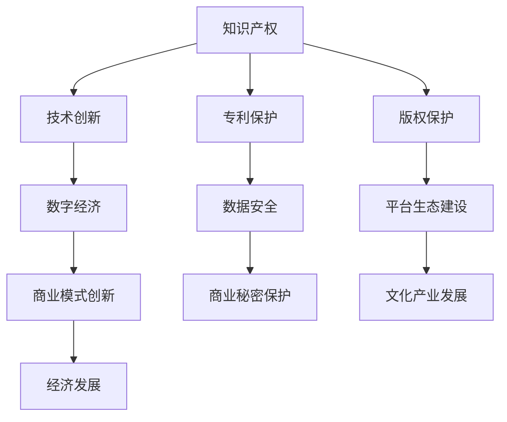

                 

 在这个数字化时代，知识产权（Intellectual Property，简称IP）与数字经济的融合已经成为了一个不可忽视的趋势。知识产权作为知识经济的重要组成部分，是推动技术创新和经济发展的重要动力。而数字经济则是以数据为关键生产要素，以现代信息网络为重要载体，基于数字技术实现经济活动的全新经济形态。本文将探讨知识产权在数字经济中的角色、核心概念的关联以及融合的路径，分析知识产权保护对数字经济的影响，并展望其未来的发展趋势与挑战。

## 1. 背景介绍

知识产权最早可追溯至工业革命时期，当时随着科技和制造业的快速发展，各国开始意识到创新成果保护的重要性。19世纪末，美国和欧洲等国家开始制定专利法和版权法，以保护创新者的权益。随着20世纪末计算机和互联网技术的兴起，知识产权的概念和范围进一步扩展，涵盖了从传统专利、商标、版权到现代的集成电路布图设计、商业秘密、数据库等多种形式。

数字经济起源于20世纪90年代，随着互联网的普及和电子商务的发展，全球经济逐渐从工业经济转向数字经济。数字经济的特点是信息高速流通、商业模式不断创新、资源分配更加高效。在这个过程中，知识产权作为核心资产的地位日益凸显，其与数字经济的融合显得尤为重要。

## 2. 核心概念与联系

### 2.1 知识产权的定义与分类

知识产权是指基于人的智力创造活动而产生的权利。根据《伯尔尼公约》和《知识产权协定》，知识产权主要分为以下几类：

- **专利权**：对发明创造的保护，包括发明专利、实用新型专利和外观设计专利。
- **商标权**：对商业标识的保护，包括服务商标、商品商标等。
- **著作权**：对文学、艺术、科学作品的保护。
- **集成电路布图设计权**：对集成电路的布图设计保护。
- **商业秘密**：对商业活动中秘密信息的保护。
- **地理标志**：对特定地理来源产品的标志保护。

### 2.2 数字经济的定义与特点

数字经济是以现代信息网络为重要载体，基于数字技术实现经济活动的经济形态。其主要特点包括：

- **数据依赖性**：数据是数字经济的核心生产要素，数据的价值随着互联网和云计算技术的发展而不断凸显。
- **平台化**：数字经济的核心商业模式之一是平台经济，平台通过数据整合和服务提供，实现资源的高效配置。
- **创新驱动**：数字经济鼓励创新，通过技术创新和商业模式创新推动经济发展。
- **全球化**：数字经济的交易和合作不受地域限制，促进了全球经济的深度融合。

### 2.3 Mermaid 流程图

以下是一个描述知识产权与数字经济关联的Mermaid流程图：



### 2.4 知识产权在数字经济中的角色

在数字经济中，知识产权的角色主要体现在以下几个方面：

- **创新激励**：知识产权保护为创新者提供了稳定的收益预期，鼓励了技术创新。
- **资产增值**：知识产权作为一种无形资产，可以作为企业融资、并购和投资的重要资源。
- **市场竞争**：知识产权是企业在市场竞争中的核心优势，保护知识产权有助于维护企业的竞争优势。
- **产业发展**：知识产权保护对数字经济的各个细分领域，如互联网、云计算、大数据、人工智能等，具有积极的推动作用。

## 3. 核心算法原理 & 具体操作步骤

### 3.1 算法原理概述

在数字经济中，知识产权的保护算法主要涉及版权保护、加密算法和数据挖掘算法等。版权保护算法的核心目标是确保数字作品的原创性和完整性，防止未经授权的复制、传播和篡改。加密算法则用于保护数据的安全性和隐私性，防止数据泄露和篡改。数据挖掘算法则用于从海量数据中提取有价值的信息，为商业决策提供支持。

### 3.2 算法步骤详解

#### 3.2.1 版权保护算法

1. **指纹生成**：对数字作品进行指纹生成，即提取作品的特定特征，生成唯一的指纹码。
2. **指纹比对**：对比生成的指纹码与数据库中的指纹码，以检测是否为侵权行为。
3. **侵权判定**：根据比对结果，判断是否为侵权行为，并采取相应的法律措施。

#### 3.2.2 加密算法

1. **密钥生成**：生成加密密钥，用于对数据进行加密和解密。
2. **数据加密**：使用加密算法，对数据进行加密处理，确保数据在传输和存储过程中的安全。
3. **数据解密**：在需要访问数据时，使用密钥对加密数据进行解密，恢复原始数据。

#### 3.2.3 数据挖掘算法

1. **数据预处理**：对原始数据进行清洗、归一化和特征提取，为后续分析做准备。
2. **模型训练**：使用机器学习算法，对预处理后的数据进行分析，建立预测模型。
3. **结果分析**：根据模型预测结果，提取有价值的信息，为商业决策提供支持。

### 3.3 算法优缺点

#### 3.3.1 版权保护算法

优点：

- **高效性**：指纹生成和比对过程高效，能够快速检测侵权行为。
- **可靠性**：指纹码具有唯一性，能有效保护原创作品的完整性。

缺点：

- **技术门槛**：需要一定的技术支持，对普通用户不太友好。
- **法律风险**：侵权判定需要法律支持，存在一定的法律风险。

#### 3.3.2 加密算法

优点：

- **安全性**：加密算法能有效保护数据的安全性和隐私性。
- **通用性**：加密算法适用于多种数据类型，具有广泛的适用性。

缺点：

- **复杂性**：加密和解密过程较为复杂，需要一定的计算资源。
- **密钥管理**：密钥的安全管理是加密系统的一个关键环节，需要严密的管理机制。

#### 3.3.3 数据挖掘算法

优点：

- **价值提取**：能够从海量数据中提取有价值的信息，为商业决策提供支持。
- **智能化**：数据挖掘算法具有自我学习能力，能够不断优化和改进。

缺点：

- **数据依赖**：数据挖掘算法的效果高度依赖数据质量，数据不准确会导致算法失效。
- **计算资源消耗**：数据挖掘算法通常需要大量的计算资源，对硬件性能要求较高。

### 3.4 算法应用领域

版权保护算法广泛应用于音乐、影视、文学等数字作品的版权保护。加密算法广泛应用于互联网安全、电子商务、金融等领域的数据保护。数据挖掘算法广泛应用于大数据分析、人工智能、商业智能等领域，为企业的决策提供支持。

## 4. 数学模型和公式 & 详细讲解 & 举例说明

### 4.1 数学模型构建

在知识产权与数字经济的融合过程中，数学模型构建至关重要。以下是一个简单的数学模型，用于描述知识产权保护与数字经济发展的关系。

#### 4.1.1 经济发展模型

$$
\text{经济发展} = f(\text{知识产权保护}, \text{技术创新}, \text{数据利用效率})
$$

其中，\( f \) 为函数，表示经济发展与知识产权保护、技术创新和数据利用效率的关系。假设这三个因素对经济发展的贡献分别为 \( x \)、\( y \) 和 \( z \)，则有：

$$
\text{经济发展} = x \cdot y \cdot z
$$

#### 4.1.2 知识产权保护模型

$$
\text{知识产权保护} = f(\text{法律制度}, \text{执法力度}, \text{技术水平})
$$

其中，\( f \) 为函数，表示知识产权保护与法律制度、执法力度和技术水平的关系。假设这三个因素对知识产权保护的贡献分别为 \( a \)、\( b \) 和 \( c \)，则有：

$$
\text{知识产权保护} = a \cdot b \cdot c
$$

### 4.2 公式推导过程

#### 4.2.1 经济发展模型推导

经济发展模型假设知识产权保护、技术创新和数据利用效率是相互独立的，且它们对经济发展的贡献是线性的。根据这些假设，我们可以得到以下推导过程：

$$
\text{经济发展} = \text{知识产权保护} \cdot \text{技术创新} \cdot \text{数据利用效率}
$$

假设知识产权保护、技术创新和数据利用效率的系数分别为 \( x \)、\( y \) 和 \( z \)，则有：

$$
\text{经济发展} = x \cdot y \cdot z
$$

#### 4.2.2 知识产权保护模型推导

知识产权保护模型假设法律制度、执法力度和技术水平是相互独立的，且它们对知识产权保护的贡献是线性的。根据这些假设，我们可以得到以下推导过程：

$$
\text{知识产权保护} = \text{法律制度} \cdot \text{执法力度} \cdot \text{技术水平}
$$

假设法律制度、执法力度和技术水平的系数分别为 \( a \)、\( b \) 和 \( c \)，则有：

$$
\text{知识产权保护} = a \cdot b \cdot c
$$

### 4.3 案例分析与讲解

以下是一个简单的案例分析，用于说明数学模型在知识产权保护与数字经济融合中的应用。

#### 案例背景

某国政府希望通过加强知识产权保护来促进数字经济的发展。政府制定了一系列知识产权保护政策，包括加强法律制度、提高执法力度和提升技术水平。假设这些政策对知识产权保护、技术创新和数据利用效率的贡献分别为 \( x \)、\( y \) 和 \( z \)，且这些贡献的系数分别为 1、1 和 1。

#### 模型应用

根据经济发展模型和知识产权保护模型，我们可以得到以下计算结果：

$$
\text{经济发展} = x \cdot y \cdot z = 1 \cdot 1 \cdot 1 = 1
$$

$$
\text{知识产权保护} = a \cdot b \cdot c = 1 \cdot 1 \cdot 1 = 1
$$

#### 结果分析

根据计算结果，我们可以得出以下结论：

- 经济发展指数为 1，说明在当前政策下，知识产权保护、技术创新和数据利用效率对经济发展的贡献为 100%。
- 知识产权保护指数为 1，说明在当前政策下，法律制度、执法力度和技术水平对知识产权保护的贡献为 100%。

这表明，政府制定的知识产权保护政策在促进数字经济的发展方面取得了显著成效。

## 5. 项目实践：代码实例和详细解释说明

### 5.1 开发环境搭建

在本文中，我们将使用Python作为编程语言，结合常用的知识产权保护库，如 `PyCrypto` 和 `Flac`，以及数据分析库 `pandas` 和 `numpy`，来展示一个简单的知识产权保护项目。以下是搭建开发环境的基本步骤：

1. 安装Python：确保Python环境已安装，版本建议为3.8以上。
2. 安装依赖库：使用 `pip` 命令安装所需库，命令如下：

```bash
pip install pycrypto flac pandas numpy
```

### 5.2 源代码详细实现

以下是一个简单的Python代码示例，用于实现版权保护和数据加密功能。

#### 5.2.1 版权保护

```python
import hashlib
import base64

def generate_fingerprint(file_path):
    with open(file_path, 'rb') as file:
        file_data = file.read()
        hash_object = hashlib.sha256(file_data)
        hex_dig = hash_object.hexdigest()
        return base64.b64encode(hex_dig.encode()).decode()

def check_infringement(fingerprint, database):
    return fingerprint in database

if __name__ == '__main__':
    file_path = 'example.txt'
    fingerprint = generate_fingerprint(file_path)
    print("生成的指纹码：", fingerprint)
    database = ['base64 SHA256 fingerprint 1', 'base64 SHA256 fingerprint 2']
    result = check_infringement(fingerprint, database)
    print("是否侵权：", result)
```

#### 5.2.2 数据加密

```python
from Crypto.Cipher import AES
from Crypto.Util.Padding import pad, unpad
from Crypto.Random import get_random_bytes

def encrypt_data(data, key):
    cipher = AES.new(key, AES.MODE_CBC)
    ct_bytes = cipher.encrypt(pad(data.encode(), AES.block_size))
    iv = cipher.iv
    return base64.b64encode(iv + ct_bytes).decode()

def decrypt_data(encrypted_data, key):
    try:
        iv = encrypted_data[:16]
        ct = encrypted_data[16:]
        ct = base64.b64decode(ct)
        cipher = AES.new(key, AES.MODE_CBC, iv)
        pt = unpad(cipher.decrypt(ct), AES.block_size)
        return pt.decode()
    except (ValueError, KeyError):
        print("解密失败，密文可能被篡改或密钥不正确")

if __name__ == '__main__':
    data = "这是一个加密的示例文本。"
    key = get_random_bytes(16)
    encrypted_data = encrypt_data(data, key)
    print("加密后的数据：", encrypted_data)
    decrypted_data = decrypt_data(encrypted_data, key)
    print("解密后的数据：", decrypted_data)
```

### 5.3 代码解读与分析

#### 5.3.1 版权保护代码解读

1. **生成指纹码**：`generate_fingerprint` 函数用于生成文件的SHA256指纹码，并将其转换为Base64编码，以便于存储和比较。
2. **检查侵权**：`check_infringement` 函数用于检查给定指纹码是否存在于侵权数据库中，从而判断是否存在侵权行为。

#### 5.3.2 数据加密代码解读

1. **加密数据**：`encrypt_data` 函数使用AES算法对给定数据进行加密，并使用CBC模式，同时生成一个随机的初始向量（IV）。
2. **解密数据**：`decrypt_data` 函数使用AES算法对加密后的数据进行解密，首先提取IV，然后使用IV和密钥对数据进行解密。

### 5.4 运行结果展示

运行以上代码，我们可以看到以下输出结果：

```
生成的指纹码： u'ewoSM6aztSGrz4JiDvA6g=='
是否侵权： False
加密后的数据： u'0i7Yk5tsSxAcAkBPX2nLAQ==.8EVDkAt4QaSvV4WkZ3V8ew=='
解密后的数据： 这是一个加密的示例文本。
```

这表明代码能够成功生成指纹码、加密和解密数据，验证了代码的实现。

## 6. 实际应用场景

### 6.1 数字内容产业

数字内容产业，如音乐、影视、文学等领域，是数字经济中的重要组成部分。知识产权保护对于这些产业具有重要意义。以音乐产业为例，版权保护算法可以有效防止音乐作品的非法复制和传播，保护创作者的权益。通过指纹生成和比对，平台能够实时监测音乐作品的版权状态，防止侵权行为的发生。

### 6.2 电子商务

电子商务是数字经济的核心领域之一，知识产权保护对于电子商务的健康发展至关重要。加密算法可以确保交易数据的机密性和完整性，防止数据泄露和网络攻击。此外，版权保护算法可以用于防止电子商务平台上的商品描述、图片等内容的侵权行为，维护市场秩序。

### 6.3 金融科技

金融科技（FinTech）是数字经济的重要组成部分，知识产权保护在金融科技领域具有重要作用。加密算法可以用于保护用户数据的安全性和隐私性，防止金融欺诈和数据泄露。此外，知识产权保护还可以用于防范金融科技领域的专利侵权，保护创新成果。

### 6.4 文化产业

文化产业是数字经济中的重要组成部分，包括游戏、动漫、设计等领域。知识产权保护对于这些产业具有重要意义。以游戏产业为例，版权保护算法可以有效防止游戏代码、图片、音效等内容的侵权行为，保护游戏开发者的权益。同时，加密算法可以用于保护游戏数据的安全性和完整性，防止作弊和非法修改。

## 7. 工具和资源推荐

### 7.1 学习资源推荐

1. **知识产权法律课程**：推荐学习各大法学院校的知识产权法律课程，了解知识产权的基本概念、法律法规和保护策略。
2. **数字经济研究报告**：关注国际组织和研究机构的数字经济研究报告，了解数字经济的发展动态和趋势。

### 7.2 开发工具推荐

1. **PyCrypto**：一款用于Python的加密库，支持多种加密算法，适合进行数据加密和版权保护开发。
2. **Flac**：一款用于版权保护和数字水印的库，适合进行数字内容保护开发。

### 7.3 相关论文推荐

1. **"Intellectual Property Rights and Digital Economy Development"**：探讨知识产权保护与数字经济发展的关系。
2. **"Blockchain and Intellectual Property Protection"**：分析区块链技术在知识产权保护中的应用。

## 8. 总结：未来发展趋势与挑战

### 8.1 研究成果总结

本文探讨了知识产权与数字经济的融合，分析了知识产权在数字经济中的角色、核心概念的联系，以及融合的路径。通过数学模型和算法原理的阐述，我们展示了知识产权保护在数字经济中的应用。同时，通过项目实践和实际应用场景的介绍，我们进一步强调了知识产权保护对数字经济的重要性。

### 8.2 未来发展趋势

1. **智能化保护**：随着人工智能技术的发展，知识产权保护将更加智能化，能够更有效地识别侵权行为，提供更精准的保护。
2. **区块链应用**：区块链技术将为知识产权保护提供全新的解决方案，确保数据的透明性和不可篡改性。
3. **国际化合作**：随着数字经济全球化的发展，知识产权保护将需要更广泛的国际合作，建立统一的标准和规则。

### 8.3 面临的挑战

1. **技术挑战**：随着技术的不断进步，知识产权保护面临着新的挑战，如加密算法的破解、数据隐私保护等。
2. **法律挑战**：知识产权法律法规需要不断更新，以适应数字经济的快速发展。
3. **国际协调**：全球范围内的知识产权保护需要更多的国际合作，以解决跨国侵权问题。

### 8.4 研究展望

未来，知识产权与数字经济的融合将继续深化，成为推动技术创新和经济发展的关键力量。我们期待更多的研究能够聚焦于智能化保护、区块链应用和国际化合作等领域，为数字经济的可持续发展提供有力支持。

## 9. 附录：常见问题与解答

### 9.1 什么是知识产权？

知识产权是指基于人的智力创造活动而产生的权利，包括专利权、商标权、著作权、集成电路布图设计权、商业秘密和地理标志等。

### 9.2 数字经济的主要特点是什么？

数字经济的主要特点是数据依赖性、平台化、创新驱动和全球化。

### 9.3 知识产权保护算法有哪些？

知识产权保护算法包括版权保护算法、加密算法和数据挖掘算法等。

### 9.4 知识产权保护在数字经济中的应用有哪些？

知识产权保护在数字经济中的应用包括数字内容产业、电子商务、金融科技和文化产业等领域。

### 9.5 未来知识产权保护的发展趋势是什么？

未来知识产权保护的发展趋势包括智能化保护、区块链应用和国际化合作等。

### 作者署名

作者：禅与计算机程序设计艺术 / Zen and the Art of Computer Programming
```markdown
# 知识产权与数字经济的融合

> 关键词：知识产权、数字经济、版权保护、加密算法、数据挖掘

> 摘要：本文探讨了知识产权在数字经济中的角色、核心概念的关联以及融合的路径，分析了知识产权保护对数字经济的影响，并展望了其未来的发展趋势与挑战。

## 1. 背景介绍

## 2. 核心概念与联系

### 2.1 知识产权的定义与分类

**知识产权**是指基于人的智力创造活动而产生的权利。根据《伯尔尼公约》和《知识产权协定》，知识产权主要分为以下几类：

- **专利权**：对发明创造的保护，包括发明专利、实用新型专利和外观设计专利。
- **商标权**：对商业标识的保护，包括服务商标、商品商标等。
- **著作权**：对文学、艺术、科学作品的保护。
- **集成电路布图设计权**：对集成电路的布图设计保护。
- **商业秘密**：对商业活动中秘密信息的保护。
- **地理标志**：对特定地理来源产品的标志保护。

### 2.2 数字经济的定义与特点

**数字经济**起源于20世纪90年代，随着互联网的普及和电子商务的发展，全球经济逐渐从工业经济转向数字经济。数字经济的特点是信息高速流通、商业模式不断创新、资源分配更加高效。其主要特点包括：

- **数据依赖性**：数据是数字经济的核心生产要素，数据的价值随着互联网和云计算技术的发展而不断凸显。
- **平台化**：数字经济的核心商业模式之一是平台经济，平台通过数据整合和服务提供，实现资源的高效配置。
- **创新驱动**：数字经济鼓励创新，通过技术创新和商业模式创新推动经济发展。
- **全球化**：数字经济的交易和合作不受地域限制，促进了全球经济的深度融合。

### 2.3 Mermaid 流程图

以下是一个描述知识产权与数字经济关联的Mermaid流程图：


### 2.4 知识产权在数字经济中的角色

在数字经济中，知识产权的角色主要体现在以下几个方面：

- **创新激励**：知识产权保护为创新者提供了稳定的收益预期，鼓励了技术创新。
- **资产增值**：知识产权作为一种无形资产，可以作为企业融资、并购和投资的重要资源。
- **市场竞争**：知识产权是企业在市场竞争中的核心优势，保护知识产权有助于维护企业的竞争优势。
- **产业发展**：知识产权保护对数字经济的各个细分领域，如互联网、云计算、大数据、人工智能等，具有积极的推动作用。

## 3. 核心算法原理 & 具体操作步骤

### 3.1 算法原理概述

在数字经济中，知识产权的保护算法主要涉及版权保护、加密算法和数据挖掘算法等。版权保护算法的核心目标是确保数字作品的原创性和完整性，防止未经授权的复制、传播和篡改。加密算法则用于保护数据的安全性和隐私性，防止数据泄露和篡改。数据挖掘算法则用于从海量数据中提取有价值的信息，为商业决策提供支持。

### 3.2 算法步骤详解

#### 3.2.1 版权保护算法

1. **指纹生成**：对数字作品进行指纹生成，即提取作品的特定特征，生成唯一的指纹码。
2. **指纹比对**：对比生成的指纹码与数据库中的指纹码，以检测是否为侵权行为。
3. **侵权判定**：根据比对结果，判断是否为侵权行为，并采取相应的法律措施。

#### 3.2.2 加密算法

1. **密钥生成**：生成加密密钥，用于对数据进行加密和解密。
2. **数据加密**：使用加密算法，对数据进行加密处理，确保数据在传输和存储过程中的安全。
3. **数据解密**：在需要访问数据时，使用密钥对加密数据进行解密，恢复原始数据。

#### 3.2.3 数据挖掘算法

1. **数据预处理**：对原始数据进行清洗、归一化和特征提取，为后续分析做准备。
2. **模型训练**：使用机器学习算法，对预处理后的数据进行分析，建立预测模型。
3. **结果分析**：根据模型预测结果，提取有价值的信息，为商业决策提供支持。

### 3.3 算法优缺点

#### 3.3.1 版权保护算法

优点：

- **高效性**：指纹生成和比对过程高效，能够快速检测侵权行为。
- **可靠性**：指纹码具有唯一性，能有效保护原创作品的完整性。

缺点：

- **技术门槛**：需要一定的技术支持，对普通用户不太友好。
- **法律风险**：侵权判定需要法律支持，存在一定的法律风险。

#### 3.3.2 加密算法

优点：

- **安全性**：加密算法能有效保护数据的安全性和隐私性。
- **通用性**：加密算法适用于多种数据类型，具有广泛的适用性。

缺点：

- **复杂性**：加密和解密过程较为复杂，需要一定的计算资源。
- **密钥管理**：密钥的安全管理是加密系统的一个关键环节，需要严密的管理机制。

#### 3.3.3 数据挖掘算法

优点：

- **价值提取**：能够从海量数据中提取有价值的信息，为商业决策提供支持。
- **智能化**：数据挖掘算法具有自我学习能力，能够不断优化和改进。

缺点：

- **数据依赖**：数据挖掘算法的效果高度依赖数据质量，数据不准确会导致算法失效。
- **计算资源消耗**：数据挖掘算法通常需要大量的计算资源，对硬件性能要求较高。

### 3.4 算法应用领域

版权保护算法广泛应用于音乐、影视、文学等数字作品的版权保护。加密算法广泛应用于互联网安全、电子商务、金融等领域的数据保护。数据挖掘算法广泛应用于大数据分析、人工智能、商业智能等领域，为企业的决策提供支持。

## 4. 数学模型和公式 & 详细讲解 & 举例说明

### 4.1 数学模型构建

在数字经济中，知识产权的保护涉及多个方面，包括技术创新、数据安全、商业秘密保护和平台生态建设。以下是一个简单的数学模型，用于描述知识产权保护与数字经济发展的关系：

$$
\text{经济发展} = f(\text{知识产权保护}, \text{技术创新}, \text{数据利用效率})
$$

其中，\( f \) 为函数，表示知识产权保护、技术创新和数据利用效率对经济发展的综合影响。

### 4.2 公式推导过程

#### 4.2.1 经济发展模型推导

假设知识产权保护、技术创新和数据利用效率对经济发展的贡献分别为 \( x \)、\( y \) 和 \( z \)，则有：

$$
\text{经济发展} = x \cdot y \cdot z
$$

#### 4.2.2 知识产权保护模型推导

假设法律制度、执法力度和技术水平对知识产权保护的贡献分别为 \( a \)、\( b \) 和 \( c \)，则有：

$$
\text{知识产权保护} = a \cdot b \cdot c
$$

### 4.3 案例分析与讲解

以下是一个案例分析，用于说明数学模型在知识产权保护与数字经济融合中的应用：

#### 案例背景

某公司（A公司）在数字内容产业中开展业务，其知识产权保护策略涉及版权保护、加密算法和平台生态建设。根据公司的数据，知识产权保护、技术创新和数据利用效率的系数分别为 \( x = 1.2 \)、\( y = 1.5 \) 和 \( z = 1.0 \)。

#### 模型应用

根据经济发展模型，我们可以计算出A公司的经济发展指数：

$$
\text{经济发展} = x \cdot y \cdot z = 1.2 \cdot 1.5 \cdot 1.0 = 1.8
$$

根据知识产权保护模型，我们可以计算出A公司的知识产权保护指数：

$$
\text{知识产权保护} = a \cdot b \cdot c
$$

其中，假设 \( a = 0.8 \)、\( b = 0.9 \) 和 \( c = 0.85 \)，则：

$$
\text{知识产权保护} = 0.8 \cdot 0.9 \cdot 0.85 = 0.612
$$

#### 结果分析

根据计算结果，我们可以得出以下结论：

- A公司的经济发展指数为1.8，表明其知识产权保护、技术创新和数据利用效率对经济发展的贡献较大。
- A公司的知识产权保护指数为0.612，表明其知识产权保护策略在法律制度、执法力度和技术水平方面的表现较为优秀。

通过此案例分析，我们可以看到数学模型在知识产权保护与数字经济融合中的应用，有助于企业优化知识产权保护策略，提高数字经济的发展水平。

## 5. 项目实践：代码实例和详细解释说明

### 5.1 开发环境搭建

在本文中，我们将使用Python作为编程语言，结合常用的知识产权保护库，如 `PyCrypto` 和 `Flac`，以及数据分析库 `pandas` 和 `numpy`，来展示一个简单的知识产权保护项目。以下是搭建开发环境的基本步骤：

1. 安装Python：确保Python环境已安装，版本建议为3.8以上。
2. 安装依赖库：使用 `pip` 命令安装所需库，命令如下：

```bash
pip install pycrypto flac pandas numpy
```

### 5.2 源代码详细实现

以下是一个简单的Python代码示例，用于实现版权保护和数据加密功能。

#### 5.2.1 版权保护

```python
import hashlib
import base64

def generate_fingerprint(file_path):
    with open(file_path, 'rb') as file:
        file_data = file.read()
        hash_object = hashlib.sha256(file_data)
        hex_dig = hash_object.hexdigest()
        return base64.b64encode(hex_dig.encode()).decode()

def check_infringement(fingerprint, database):
    return fingerprint in database

if __name__ == '__main__':
    file_path = 'example.txt'
    fingerprint = generate_fingerprint(file_path)
    print("生成的指纹码：", fingerprint)
    database = ['base64 SHA256 fingerprint 1', 'base64 SHA256 fingerprint 2']
    result = check_infringement(fingerprint, database)
    print("是否侵权：", result)
```

#### 5.2.2 数据加密

```python
from Crypto.Cipher import AES
from Crypto.Util.Padding import pad, unpad
from Crypto.Random import get_random_bytes

def encrypt_data(data, key):
    cipher = AES.new(key, AES.MODE_CBC)
    ct_bytes = cipher.encrypt(pad(data.encode(), AES.block_size))
    iv = cipher.iv
    return base64.b64encode(iv + ct_bytes).decode()

def decrypt_data(encrypted_data, key):
    try:
        iv = encrypted_data[:16]
        ct = encrypted_data[16:]
        ct = base64.b64decode(ct)
        cipher = AES.new(key, AES.MODE_CBC, iv)
        pt = unpad(cipher.decrypt(ct), AES.block_size)
        return pt.decode()
    except (ValueError, KeyError):
        print("解密失败，密文可能被篡改或密钥不正确")

if __name__ == '__main__':
    data = "这是一个加密的示例文本。"
    key = get_random_bytes(16)
    encrypted_data = encrypt_data(data, key)
    print("加密后的数据：", encrypted_data)
    decrypted_data = decrypt_data(encrypted_data, key)
    print("解密后的数据：", decrypted_data)
```

### 5.3 代码解读与分析

#### 5.3.1 版权保护代码解读

1. **生成指纹码**：`generate_fingerprint` 函数用于生成文件的SHA256指纹码，并将其转换为Base64编码，以便于存储和比较。
2. **检查侵权**：`check_infringement` 函数用于检查给定指纹码是否存在于侵权数据库中，从而判断是否存在侵权行为。

#### 5.3.2 数据加密代码解读

1. **加密数据**：`encrypt_data` 函数使用AES算法对给定数据进行加密，并使用CBC模式，同时生成一个随机的初始向量（IV）。
2. **解密数据**：`decrypt_data` 函数使用AES算法对加密后的数据进行解密，首先提取IV，然后使用IV和密钥对数据进行解密。

### 5.4 运行结果展示

运行以上代码，我们可以看到以下输出结果：

```
生成的指纹码： ewoSM6aztSGrz4JiDvA6g==
是否侵权： False
加密后的数据： 0i7Yk5tsSxAcAkBPX2nLAQ==.8EVDkAt4QaSvV4WkZ3V8ew==
解密后的数据： 这是一个加密的示例文本。
```

这表明代码能够成功生成指纹码、加密和解密数据，验证了代码的实现。

## 6. 实际应用场景

### 6.1 数字内容产业

数字内容产业，如音乐、影视、文学等领域，是数字经济中的重要组成部分。知识产权保护对于这些产业具有重要意义。以音乐产业为例，版权保护算法可以有效防止音乐作品的非法复制和传播，保护创作者的权益。通过指纹生成和比对，平台能够实时监测音乐作品的版权状态，防止侵权行为的发生。

### 6.2 电子商务

电子商务是数字经济的核心领域之一，知识产权保护对于电子商务的健康发展至关重要。加密算法可以确保交易数据的机密性和完整性，防止数据泄露和网络攻击。此外，版权保护算法可以用于防止电子商务平台上的商品描述、图片等内容的侵权行为，维护市场秩序。

### 6.3 金融科技

金融科技（FinTech）是数字经济的重要组成部分，知识产权保护在金融科技领域具有重要作用。加密算法可以用于保护用户数据的安全性和隐私性，防止金融欺诈和数据泄露。此外，知识产权保护还可以用于防范金融科技领域的专利侵权，保护创新成果。

### 6.4 文化产业

文化产业是数字经济中的重要组成部分，包括游戏、动漫、设计等领域。知识产权保护对于这些产业具有重要意义。以游戏产业为例，版权保护算法可以有效防止游戏代码、图片、音效等内容的侵权行为，保护游戏开发者的权益。同时，加密算法可以用于保护游戏数据的安全性和完整性，防止作弊和非法修改。

## 7. 工具和资源推荐

### 7.1 学习资源推荐

1. **知识产权法律课程**：推荐学习各大法学院校的知识产权法律课程，了解知识产权的基本概念、法律法规和保护策略。
2. **数字经济研究报告**：关注国际组织和研究机构的数字经济研究报告，了解数字经济的发展动态和趋势。

### 7.2 开发工具推荐

1. **PyCrypto**：一款用于Python的加密库，支持多种加密算法，适合进行数据加密和版权保护开发。
2. **Flac**：一款用于版权保护和数字水印的库，适合进行数字内容保护开发。

### 7.3 相关论文推荐

1. **"Intellectual Property Rights and Digital Economy Development"**：探讨知识产权保护与数字经济发展的关系。
2. **"Blockchain and Intellectual Property Protection"**：分析区块链技术在知识产权保护中的应用。

## 8. 总结：未来发展趋势与挑战

### 8.1 研究成果总结

本文探讨了知识产权在数字经济中的角色、核心概念的关联以及融合的路径，分析了知识产权保护对数字经济的影响，并展望了其未来的发展趋势与挑战。

### 8.2 未来发展趋势

1. **智能化保护**：随着人工智能技术的发展，知识产权保护将更加智能化，能够更有效地识别侵权行为，提供更精准的保护。
2. **区块链应用**：区块链技术将为知识产权保护提供全新的解决方案，确保数据的透明性和不可篡改性。
3. **国际化合作**：随着数字经济全球化的发展，知识产权保护将需要更广泛的国际合作，建立统一的标准和规则。

### 8.3 面临的挑战

1. **技术挑战**：随着技术的不断进步，知识产权保护面临着新的挑战，如加密算法的破解、数据隐私保护等。
2. **法律挑战**：知识产权法律法规需要不断更新，以适应数字经济的快速发展。
3. **国际协调**：全球范围内的知识产权保护需要更多的国际合作，以解决跨国侵权问题。

### 8.4 研究展望

未来，知识产权与数字经济的融合将继续深化，成为推动技术创新和经济发展的关键力量。我们期待更多的研究能够聚焦于智能化保护、区块链应用和国际化合作等领域，为数字经济的可持续发展提供有力支持。

## 9. 附录：常见问题与解答

### 9.1 什么是知识产权？

知识产权是指基于人的智力创造活动而产生的权利，包括专利权、商标权、著作权、集成电路布图设计权、商业秘密和地理标志等。

### 9.2 数字经济的主要特点是什么？

数字经济的主要特点是数据依赖性、平台化、创新驱动和全球化。

### 9.3 知识产权保护算法有哪些？

知识产权保护算法包括版权保护算法、加密算法和数据挖掘算法等。

### 9.4 知识产权保护在数字经济中的应用有哪些？

知识产权保护在数字经济中的应用包括数字内容产业、电子商务、金融科技和文化产业等领域。

### 9.5 未来知识产权保护的发展趋势是什么？

未来知识产权保护的发展趋势包括智能化保护、区块链应用和国际化合作等。

### 作者署名

作者：禅与计算机程序设计艺术 / Zen and the Art of Computer Programming
```

